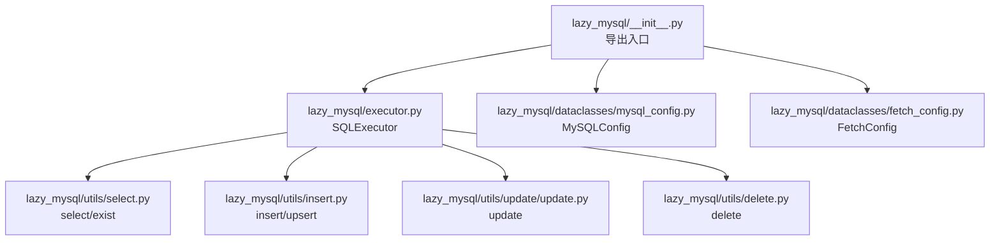
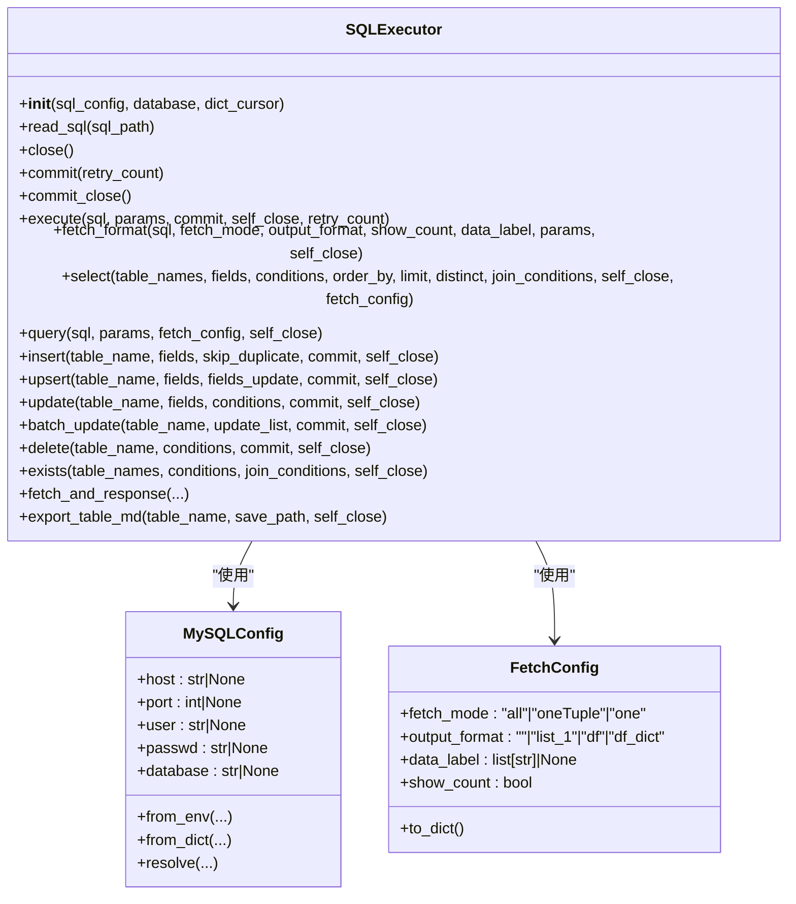
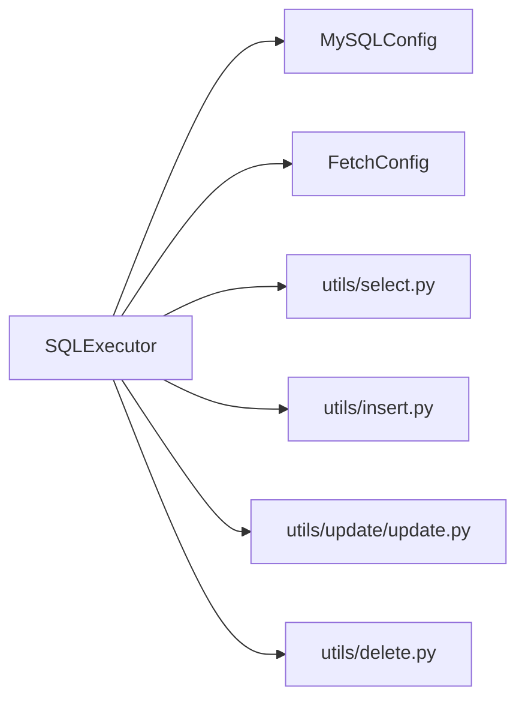

# API参考

<cite>
**本文引用的文件**
- [lazy_mysql/executor.py](file://lazy_mysql/executor.py)
- [lazy_mysql/dataclasses/mysql_config.py](file://lazy_mysql/dataclasses/mysql_config.py)
- [lazy_mysql/dataclasses/fetch_config.py](file://lazy_mysql/dataclasses/fetch_config.py)
- [lazy_mysql/utils/select.py](file://lazy_mysql/utils/select.py)
- [lazy_mysql/utils/insert.py](file://lazy_mysql/utils/insert.py)
- [lazy_mysql/utils/update/update.py](file://lazy_mysql/utils/update/update.py)
- [lazy_mysql/utils/delete.py](file://lazy_mysql/utils/delete.py)
- [lazy_mysql/__init__.py](file://lazy_mysql/__init__.py)
- [README.md](file://README.md)
- [docs/FETCH_CONFIG.md](file://docs/FETCH_CONFIG.md)
- [docs/CONNECTION.md](file://docs/CONNECTION.md)
- [tests/test_sql_config.py](file://tests/test_sql_config.py)
</cite>

## 目录
1. [简介](#简介)
2. [项目结构](#项目结构)
3. [核心组件](#核心组件)
4. [架构总览](#架构总览)
5. [详细组件分析](#详细组件分析)
6. [依赖分析](#依赖分析)
7. [性能考虑](#性能考虑)
8. [故障排查指南](#故障排查指南)
9. [结论](#结论)
10. [附录](#附录)

## 简介
本文件为 lazy_mysql 库的完整 API 参考，聚焦于 SQLExecutor 类的公共方法与配置类 FetchConfig、MySQLConfig 的参数说明，并提供各方法的签名、参数、返回值、使用示例与最佳实践。同时涵盖版本兼容性与废弃功能迁移指引，帮助开发者准确、高效地使用该库。

## 项目结构
- 核心入口与导出：lazy_mysql/__init__.py
- 执行器：lazy_mysql/executor.py
- 配置模型：lazy_mysql/dataclasses/mysql_config.py、lazy_mysql/dataclasses/fetch_config.py
- 工具与业务实现：lazy_mysql/utils/select.py、lazy_mysql/utils/insert.py、lazy_mysql/utils/update/update.py、lazy_mysql/utils/delete.py
- 文档与示例：docs/*、README.md
- 测试：tests/test_sql_config.py

图表来源
- [lazy_mysql/__init__.py:1-21](file://lazy_mysql/__init__.py#L1-L21)
- [lazy_mysql/executor.py:14-616](file://lazy_mysql/executor.py#L14-L616)

章节来源
- [lazy_mysql/__init__.py:1-21](file://lazy_mysql/__init__.py#L1-L21)
- [lazy_mysql/executor.py:14-616](file://lazy_mysql/executor.py#L14-L616)

## 核心组件
- SQLExecutor：统一数据库操作接口，封装连接、执行、结果格式化、事务提交与关闭等能力。
- MySQLConfig：数据库连接配置模型，支持从环境变量、字典或显式参数解析，具备端口校验与空值处理。
- FetchConfig：查询结果格式化配置模型，控制 fetch_mode、output_format、data_label、show_count。

章节来源
- [lazy_mysql/executor.py:14-616](file://lazy_mysql/executor.py#L14-L616)
- [lazy_mysql/dataclasses/mysql_config.py:10-135](file://lazy_mysql/dataclasses/mysql_config.py#L10-L135)
- [lazy_mysql/dataclasses/fetch_config.py:8-24](file://lazy_mysql/dataclasses/fetch_config.py#L8-L24)

## 架构总览
SQLExecutor 作为门面，内部委派至各工具模块完成具体操作；查询结果通过 fetch_format 统一格式化，支持多种输出形式。

图表来源
- [lazy_mysql/executor.py:14-616](file://lazy_mysql/executor.py#L14-L616)
- [lazy_mysql/dataclasses/mysql_config.py:10-135](file://lazy_mysql/dataclasses/mysql_config.py#L10-L135)
- [lazy_mysql/dataclasses/fetch_config.py:8-24](file://lazy_mysql/dataclasses/fetch_config.py#L8-L24)

## 详细组件分析

### SQLExecutor 类 API 参考

- 初始化
  - 签名：SQLExecutor.__init__(sql_config=None, database=None, dict_cursor=False)
  - 参数
    - sql_config：可为 None、字典或 MySQLConfig 实例；默认 None 时从环境变量解析
    - database：覆盖配置中的 database
    - dict_cursor：是否使用字典游标
  - 返回：无
  - 说明：内部通过连接工厂建立连接，支持自动重连与回滚兜底
  - 示例：参见 [CONNECTION.md:9-34](file://docs/CONNECTION.md#L9-L34)

- 关闭连接
  - 签名：SQLExecutor.close()
  - 参数：无
  - 返回：无
  - 说明：关闭游标与连接，防止解释器退出时的兼容性问题

- 提交事务
  - 签名：SQLExecutor.commit(retry_count=0)
  - 参数：retry_count（内部重试计数）
  - 返回：无
  - 说明：自动处理可重试错误（连接丢失/超时），必要时回滚并重连

- 提交并关闭
  - 签名：SQLExecutor.commit_close()
  - 参数：无
  - 返回：无
  - 说明：先提交再关闭

- 执行任意 SQL
  - 签名：SQLExecutor.execute(sql, params=None, commit=False, self_close=False, retry_count=0)
  - 参数
    - sql：SQL 语句，支持 %s 与 %(name)s 占位符
    - params：单个元组/字典、单个列表或批量参数列表（executemany）
    - commit：执行后是否提交
    - self_close：执行后是否关闭连接
    - retry_count：内部重试计数
  - 返回：无
  - 说明：自动区分单条与批量执行；SELECT 不支持批量；空参数集校验；错误时自动重连与回滚

- 结果格式化
  - 签名：SQLExecutor.fetch_format(sql, fetch_mode, output_format="", show_count=False, data_label=None, params=None, self_close=False)
  - 参数
    - fetch_mode：all/oneTuple/one
    - output_format：""/list_1/df/df_dict（部分模式生效）
    - data_label：列名或键名（DataFrame/字典时）
    - show_count：是否返回(数据, 数量)
  - 返回：根据配置返回不同格式
  - 说明：委托给工具层格式化器

- 查询（智能构建）
  - 签名：SQLExecutor.select(table_names, fields, conditions=None, order_by=None, limit=None, distinct=False, join_conditions=None, self_close=False, fetch_config=None)
  - 参数
    - table_names：字符串或表名列表（多表 JOIN）
    - fields：字段列表或字典（按表聚合）
    - conditions：字典条件，支持 NDayInterval
    - order_by/limit/distinct：排序、限制、去重
    - join_conditions：JOIN 类型与 ON 条件
    - fetch_config：FetchConfig 或字典
  - 返回：根据 fetch_config 返回
  - 说明：自动构造 SQL，支持 JOIN、WHERE、ORDER BY、LIMIT；字段字典时自动加表前缀

- 自定义 SQL 查询
  - 签名：SQLExecutor.query(sql, params=None, fetch_config=None, self_close=False)
  - 参数：与 select 类似，但直接执行传入 SQL
  - 返回：根据 fetch_config 返回
  - 说明：默认 output_format=df_dict，兼容旧字典方式

- 插入
  - 签名：SQLExecutor.insert(table_name, fields, skip_duplicate=False, commit=False, self_close=False)
  - 参数
    - fields：单条字典或多条字典列表
    - skip_duplicate：基于主键/唯一索引跳过重复
  - 返回：插入记录数
  - 说明：根据数据量自动选择策略（executemany 分批、LOAD DATA INFILE）

- Upsert
  - 签名：SQLExecutor.upsert(table_name, fields, fields_update=None, commit=False, self_close=False)
  - 参数
    - fields：单条或多条字典
    - fields_update：指定冲突时更新的字段集合
  - 返回：影响记录数
  - 说明：单条直插，多条批量

- 更新
  - 签名：SQLExecutor.update(table_name, fields, conditions, commit=False, self_close=False)
  - 参数：fields/conditions 均不可为空
  - 返回：无
  - 说明：动态构造 SET/WHERE，参数合并执行

- 批量更新
  - 签名：SQLExecutor.batch_update(table_name, update_list, commit=False, self_close=False)
  - 参数：update_list 每项包含 fields 与 conditions
  - 返回：无
  - 说明：根据条件复杂度选择 CASE WHEN 语法

- 删除
  - 签名：SQLExecutor.delete(table_name, conditions, commit=False, self_close=False)
  - 参数：conditions 不可为空
  - 返回：无
  - 说明：动态构造 WHERE 并执行

- 存在性判断
  - 签名：SQLExecutor.exists(table_names, conditions=None, join_conditions=None, self_close=False) -> bool
  - 返回：是否存在匹配记录
  - 说明：使用 SELECT 1 LIMIT 1 优化

- 产品数据获取与格式化
  - 签名：SQLExecutor.fetch_and_response(table_names, fields, conditions=None, distinct=False, join_conditions=None, fetch_config=None, order_by=None, limit=None, format_func=None, self_close=True)
  - 返回：包含 success/result/message 的字典
  - 说明：封装 select 与格式化，支持自定义 format_func

- 导出表结构为 Markdown
  - 签名：SQLExecutor.export_table_md(table_name, save_path=None, self_close=True)
  - 参数：table_name 可为字符串、列表或元组（批量导出）
  - 返回：单表返回 None，批量返回导出表名列表

- 读取 SQL 文件
  - 签名：SQLExecutor.read_sql(sql_path)
  - 返回：SQL 文本

章节来源
- [lazy_mysql/executor.py:14-616](file://lazy_mysql/executor.py#L14-L616)
- [lazy_mysql/utils/select.py:4-237](file://lazy_mysql/utils/select.py#L4-L237)
- [lazy_mysql/utils/insert.py:7-287](file://lazy_mysql/utils/insert.py#L7-L287)
- [lazy_mysql/utils/update/update.py:4-44](file://lazy_mysql/utils/update/update.py#L4-L44)
- [lazy_mysql/utils/delete.py:3-26](file://lazy_mysql/utils/delete.py#L3-L26)

### MySQLConfig 配置类
- 字段
  - host: str | None
  - port: int | None
  - user: str | None
  - passwd: str | None
  - database: str | None
- 方法
  - from_env(host=None, port=None, user=None, passwd=None, database=None)
  - from_dict(sql_config)
  - resolve(sql_config=None, host=None, port=None, user=None, passwd=None, database=None)
- 环境变量
  - LAZY_MYSQL_HOST、LAZY_MYSQL_PORT、LAZY_MYSQL_USER、LAZY_MYSQL_PASSWD、LAZY_MYSQL_DATABASE
- 优先级（高→低）
  - SQLExecutor 显式 database 参数 > MySQLConfig 显式参数/字典配置 > 环境变量
- 空值规则：None 或空串不会覆盖已有值
- 端口校验：非整数将抛出异常
- 默认值：未提供时由环境变量决定

章节来源
- [lazy_mysql/dataclasses/mysql_config.py:10-135](file://lazy_mysql/dataclasses/mysql_config.py#L10-L135)
- [tests/test_sql_config.py:5-164](file://tests/test_sql_config.py#L5-L164)
- [docs/CONNECTION.md:56-132](file://docs/CONNECTION.md#L56-L132)

### FetchConfig 配置类
- 字段
  - fetch_mode: "all"|"oneTuple"|"one"
  - output_format: ""|"list_1"|"df"|"df_dict"
  - data_label: list[str] | None
  - show_count: bool
- 方法
  - to_dict(): 将模型转换为字典（兼容旧方式）
- 使用场景
  - 控制返回数据数量与格式
  - DataFrame/字典输出时的列名映射
  - 返回(数据, 数量)元组

章节来源
- [lazy_mysql/dataclasses/fetch_config.py:8-24](file://lazy_mysql/dataclasses/fetch_config.py#L8-L24)
- [docs/FETCH_CONFIG.md:1-223](file://docs/FETCH_CONFIG.md#L1-L223)

### API 使用示例与最佳实践

- 连接与基本使用
  - 参考：[CONNECTION.md:9-34](file://docs/CONNECTION.md#L9-L34)
  - 最佳实践：使用上下文管理器或 finally 确保 close()

- 查询
  - 智能 select：[README.md:59-91](file://README.md#L59-L91)
  - 自定义 query：[README.md:64-68](file://README.md#L64-L68)

- 插入与 Upsert
  - 单条/批量 insert：[README.md:96-116](file://README.md#L96-L116)
  - Upsert：同上

- 更新与删除
  - 条件更新/删除：[README.md:120-131](file://README.md#L120-L131)

- FetchConfig 使用
  - 模型方式与字典方式：[docs/FETCH_CONFIG.md:169-223](file://docs/FETCH_CONFIG.md#L169-L223)

- 批量更新策略
  - 单字段条件使用简化 CASE 语法，多字段条件使用通用 CASE WHEN：[lazy_mysql/executor.py:276-306](file://lazy_mysql/executor.py#L276-L306)

- 错误处理与重试
  - 可重试错误类型与自动重连：[lazy_mysql/executor.py:7-12](file://lazy_mysql/executor.py#L7-L12)、[lazy_mysql/executor.py:62-107](file://lazy_mysql/executor.py#L62-L107)

章节来源
- [README.md:26-140](file://README.md#L26-L140)
- [docs/FETCH_CONFIG.md:169-223](file://docs/FETCH_CONFIG.md#L169-L223)
- [lazy_mysql/executor.py:7-12](file://lazy_mysql/executor.py#L7-L12)
- [lazy_mysql/executor.py:62-107](file://lazy_mysql/executor.py#L62-L107)

### 版本兼容性与废弃功能

- 版本要求
  - Python：3.7+
  - MySQL：8.0.36+（完全支持）
  - 依赖：mysql-connector-python>=9.4.0、pandas>=2.3.1
- 兼容性说明
  - 低于上述版本的兼容性尚未验证
- 废弃与迁移
  - 无废弃功能；历史版本中 query/select 的默认 output_format 与 FetchConfig 的字典方式仍受支持，建议逐步迁移到 FetchConfig 模型方式以获得更强类型保障

章节来源
- [README.md:163-172](file://README.md#L163-L172)
- [docs/CONNECTION.md:302-326](file://docs/CONNECTION.md#L302-L326)

## 依赖分析

图表来源
- [lazy_mysql/executor.py:14-616](file://lazy_mysql/executor.py#L14-L616)
- [lazy_mysql/utils/select.py:4-237](file://lazy_mysql/utils/select.py#L4-L237)
- [lazy_mysql/utils/insert.py:7-287](file://lazy_mysql/utils/insert.py#L7-L287)
- [lazy_mysql/utils/update/update.py:4-44](file://lazy_mysql/utils/update/update.py#L4-L44)
- [lazy_mysql/utils/delete.py:3-26](file://lazy_mysql/utils/delete.py#L3-L26)

章节来源
- [lazy_mysql/executor.py:14-616](file://lazy_mysql/executor.py#L14-L616)

## 性能考虑
- 批量插入策略
  - 小量（<1000）：executemany
  - 中量（1000-50000）：分批1000条
  - 大量（50000-100000）：分批5000条
  - 超大量（>=100000）：LOAD DATA INFILE 分批50000条
- 批量更新
  - 单字段条件：CASE key WHEN 语法（性能最优）
  - 复杂条件：CASE WHEN ... THEN 语法
- 查询优化
  - exists 使用 SELECT 1 LIMIT 1
  - select 支持 DISTINCT、ORDER BY、LIMIT

章节来源
- [lazy_mysql/utils/insert.py:11-64](file://lazy_mysql/utils/insert.py#L11-L64)
- [lazy_mysql/executor.py:276-306](file://lazy_mysql/executor.py#L276-L306)
- [lazy_mysql/utils/select.py:159-237](file://lazy_mysql/utils/select.py#L159-L237)

## 故障排查指南
- 常见错误
  - fields 为空：select/update/delete 抛出 ValueError
  - conditions 为空：update/delete 抛出 ValueError
  - SELECT 批量执行：抛出 ValueError（性能警告）
  - 连接丢失/超时：自动重连与回滚
- 建议
  - 使用 commit_close() 或 finally 确保关闭
  - 使用 FetchConfig 明确 output_format 与 data_label
  - 使用 exists() 替代全表扫描的 count 查询

章节来源
- [lazy_mysql/utils/select.py:61-62](file://lazy_mysql/utils/select.py#L61-L62)
- [lazy_mysql/utils/update/update.py:16-24](file://lazy_mysql/utils/update/update.py#L16-L24)
- [lazy_mysql/utils/delete.py:14-17](file://lazy_mysql/utils/delete.py#L14-L17)
- [lazy_mysql/executor.py:159-161](file://lazy_mysql/executor.py#L159-L161)
- [lazy_mysql/executor.py:78-92](file://lazy_mysql/executor.py#L78-L92)

## 结论
本参考文档系统梳理了 SQLExecutor 的全部公共 API 与配置类参数，结合实际实现与文档，给出了参数说明、返回值、使用示例与最佳实践。建议在生产环境中优先使用 FetchConfig 模型方式与上下文管理器，以获得更好的类型安全与资源管理。

## 附录

### API 方法一览（摘要）
- SQLExecutor.__init__
- SQLExecutor.close
- SQLExecutor.commit
- SQLExecutor.commit_close
- SQLExecutor.execute
- SQLExecutor.fetch_format
- SQLExecutor.select
- SQLExecutor.query
- SQLExecutor.insert
- SQLExecutor.upsert
- SQLExecutor.update
- SQLExecutor.batch_update
- SQLExecutor.delete
- SQLExecutor.exists
- SQLExecutor.fetch_and_response
- SQLExecutor.export_table_md
- SQLExecutor.read_sql

章节来源
- [lazy_mysql/executor.py:14-616](file://lazy_mysql/executor.py#L14-L616)