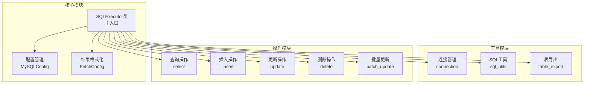
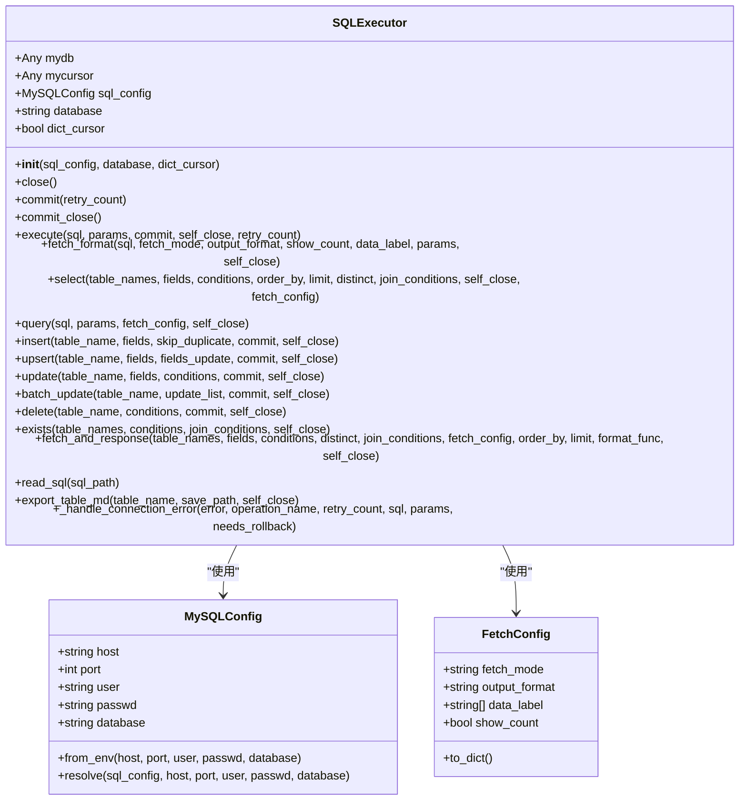
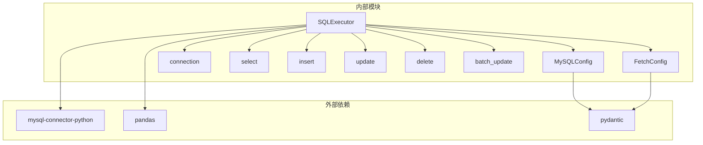

# SQLExecutor类API

<cite>
**本文档引用的文件**
- [executor.py](file://lazy_mysql/executor.py)
- [__init__.py](file://lazy_mysql/__init__.py)
- [mysql_config.py](file://lazy_mysql/dataclasses/mysql_config.py)
- [fetch_config.py](file://lazy_mysql/dataclasses/fetch_config.py)
- [connect.py](file://lazy_mysql/utils/connect.py)
- [update.py](file://lazy_mysql/utils/update/update.py)
- [batch_update.py](file://lazy_mysql/utils/update/batch_update.py)
- [README.md](file://README.md)
</cite>

## 目录
1. [简介](#简介)
2. [项目结构](#项目结构)
3. [核心组件](#核心组件)
4. [架构概览](#架构概览)
5. [详细组件分析](#详细组件分析)
6. [依赖分析](#依赖分析)
7. [性能考虑](#性能考虑)
8. [故障排除指南](#故障排除指南)
9. [结论](#结论)

## 简介
SQLExecutor类是lazy_mysql库的核心组件，提供统一的MySQL数据库操作接口。该类封装了连接管理、CRUD操作、事务控制、批量操作等功能，支持智能参数绑定、结果格式化、自动重连和错误处理。

## 项目结构
该项目采用模块化设计，主要包含以下核心模块：



**图表来源**
- [executor.py:14-616](file://lazy_mysql/executor.py#L14-L616)
- [__init__.py:1-21](file://lazy_mysql/__init__.py#L1-L21)

**章节来源**
- [executor.py:14-616](file://lazy_mysql/executor.py#L14-L616)
- [__init__.py:1-21](file://lazy_mysql/__init__.py#L1-L21)

## 核心组件

### 构造函数
SQLExecutor类的构造函数负责初始化数据库连接和配置。

**方法签名**
```python
def __init__(self, sql_config=None, database=None, dict_cursor=False)
```

**参数说明**
- `sql_config`: 数据库配置对象，可为None、字典或MySQLConfig实例
- `database`: 数据库名称，优先于配置中的database参数
- `dict_cursor`: 是否使用字典游标返回结果

**返回值**
- 无（构造函数）

**异常处理**
- 通过MySQLConfig.resolve()解析配置
- 通过connection()建立数据库连接
- 支持环境变量自动配置

**最佳实践**
- 建议使用MySQLConfig.from_env()或MySQLConfig.resolve()创建配置
- 在生产环境中明确指定database参数
- 使用dict_cursor=True获取字典格式结果

**章节来源**
- [executor.py:20-25](file://lazy_mysql/executor.py#L20-L25)
- [mysql_config.py:88-135](file://lazy_mysql/dataclasses/mysql_config.py#L88-L135)
- [connect.py:16-68](file://lazy_mysql/utils/connect.py#L16-L68)

### 连接管理方法

#### close() - 关闭数据库连接
**方法签名**
```python
def close(self)
```

**功能描述**
- 关闭游标和数据库连接
- 清理资源，防止内存泄漏
- 处理关闭过程中的异常

**返回值**
- 无

**异常处理**
- 捕获并忽略关闭过程中的异常
- 确保资源被正确释放

**最佳实践**
- 在使用完毕后始终调用close()
- 在异常处理中确保连接被正确关闭

#### commit() - 提交事务
**方法签名**
```python
def commit(self, retry_count=0)
```

**参数说明**
- `retry_count`: 内部参数，用于记录重试次数

**功能描述**
- 提交当前事务
- 支持自动重连和回滚
- 处理连接丢失等可重试错误

**返回值**
- 无

**异常处理**
- 检测可重试错误（连接丢失、超时）
- 自动重连并重试操作
- 发生错误时回滚事务并抛出异常

**最佳实践**
- 在批量操作后调用commit()
- 使用commit_close()同时提交和关闭连接

#### commit_close() - 提交并关闭
**方法签名**
```python
def commit_close(self)
```

**功能描述**
- 提交事务并关闭连接
- 简化常用操作流程

**返回值**
- 无

**章节来源**
- [executor.py:33-47](file://lazy_mysql/executor.py#L33-L47)
- [executor.py:109-119](file://lazy_mysql/executor.py#L109-L119)
- [executor.py:121-124](file://lazy_mysql/executor.py#L121-L124)

## 架构概览



**图表来源**
- [executor.py:14-616](file://lazy_mysql/executor.py#L14-L616)
- [mysql_config.py:10-135](file://lazy_mysql/dataclasses/mysql_config.py#L10-L135)
- [fetch_config.py:8-24](file://lazy_mysql/dataclasses/fetch_config.py#L8-L24)

## 详细组件分析

### CRUD操作方法

#### select() - 查询数据
**方法签名**
```python
def select(self, table_names, fields=None, conditions=None, order_by=None, limit=None, distinct=False, join_conditions=None, self_close=False, fetch_config=None)
```

**参数说明**
- `table_names`: 表名，字符串或列表
- `fields`: 查询字段列表，必填
- `conditions`: WHERE条件，字典格式
- `order_by`: ORDER BY子句
- `limit`: LIMIT限制
- `distinct`: 是否去重
- `join_conditions`: JOIN条件
- `self_close`: 是否自动关闭连接
- `fetch_config`: FetchConfig配置对象或字典

**返回值**
- 查询结果，格式根据fetch_config配置

**异常处理**
- 检查fields参数有效性
- 支持复杂条件和JOIN操作
- 自动处理结果格式化

**使用示例**
```python
# 基础查询
users = executor.select('users', ['id', 'name', 'email'])

# 条件查询
active_users = executor.select(
    'users',
    ['id', 'name', 'email'],
    conditions={'status': 'active'},
    order_by='created_at DESC',
    limit=10
)
```

**最佳实践**
- 始终指定fields参数
- 使用FetchConfig控制结果格式
- 对于复杂查询使用query()方法

**章节来源**
- [executor.py:324-386](file://lazy_mysql/executor.py#L324-L386)
- [fetch_config.py:8-24](file://lazy_mysql/dataclasses/fetch_config.py#L8-L24)

#### query() - 自定义SQL查询
**方法签名**
```python
def query(self, sql, params=None, fetch_config=None, self_close=False)
```

**功能描述**
- 执行自定义SQL语句
- 支持复杂查询和子查询
- 提供灵活的结果格式化选项

**参数说明**
- `sql`: SQL语句
- `params`: 查询参数
- `fetch_config`: 结果格式配置
- `self_close`: 是否自动关闭连接

**返回值**
- 查询结果，支持多种格式

**使用示例**
```python
# 窗口函数查询
result = executor.query(
    "SELECT id, name, RANK() OVER (ORDER BY score DESC) as rank FROM users",
    fetch_config={'output_format': 'df_dict', 'data_label': ['id', 'name', 'rank']}
)
```

**最佳实践**
- 使用参数化查询防止SQL注入
- 合理使用fetch_config优化性能
- 对于简单查询优先使用select()

**章节来源**
- [executor.py:515-591](file://lazy_mysql/executor.py#L515-L591)
- [fetch_config.py:8-24](file://lazy_mysql/dataclasses/fetch_config.py#L8-L24)

#### insert() - 插入数据
**方法签名**
```python
def insert(self, table_name, fields, skip_duplicate=False, commit=False, self_close=False)
```

**功能描述**
- 智能插入数据，支持多种数据量级别
- 自动选择最优插入策略
- 支持批量插入优化

**策略选择**
- 单条数据：使用传统INSERT
- 1000-50000条：分批1000条
- 50000-100000条：分批5000条
- ≥100000条：使用LOAD DATA INFILE

**返回值**
- 插入成功的记录数

**使用示例**
```python
# 单条插入
executor.insert('users', {'name': '张三', 'email': 'zhang@example.com'}, commit=True)

# 批量插入
users_data = [
    {'name': '李四', 'email': 'li@example.com', 'age': 25},
    {'name': '王五', 'email': 'wang@example.com', 'age': 30},
]
inserted_count = executor.insert('users', users_data, commit=True)
```

**最佳实践**
- 对大量数据使用批量插入
- 合理设置skip_duplicate参数
- 使用commit=True确保数据持久化

**章节来源**
- [executor.py:214-234](file://lazy_mysql/executor.py#L214-L234)

#### upsert() - 插入或更新
**方法签名**
```python
def upsert(self, table_name, fields, fields_update=None, commit=False, self_close=False)
```

**功能描述**
- 实现INSERT ... ON DUPLICATE KEY UPDATE
- 存在则更新，不存在则插入
- 支持单条和批量操作

**参数说明**
- `fields_update`: 指定冲突时更新的字段集合
- `fields_update=None`：更新所有字段

**返回值**
- 成功的记录数

**使用示例**
```python
user_data = {
    'id': 1,
    'name': '张三',
    'email': 'new_email@example.com',
    'updated_at': '2024-01-15 10:00:00'
}
executor.upsert('users', user_data, commit=True)
```

**最佳实践**
- 明确指定唯一键约束
- 合理使用fields_update参数
- 注意MySQL版本兼容性

**章节来源**
- [executor.py:237-254](file://lazy_mysql/executor.py#L237-L254)

#### update() - 更新数据
**方法签名**
```python
def update(self, table_name, fields, conditions, commit=False, self_close=False)
```

**功能描述**
- 通用SQL更新执行器
- 动态构造WHERE子句
- 支持复杂条件和表达式

**参数说明**
- `fields`: 需要更新的字段和值
- `conditions`: WHERE条件，不能为空

**返回值**
- 无

**异常处理**
- 检查fields和conditions参数
- 防止全表更新的安全风险

**使用示例**
```python
executor.update(
    'users',
    {'status': 'premium', 'updated_at': '2024-01-15 10:00:00'},
    conditions={'last_login': ('>=', '2024-01-01'), 'points': ('>=', 1000)},
    commit=True
)
```

**最佳实践**
- 始终指定WHERE条件
- 使用复杂条件时注意性能
- 对于大量更新使用batch_update()

**章节来源**
- [executor.py:257-270](file://lazy_mysql/executor.py#L257-L270)
- [update.py:4-44](file://lazy_mysql/utils/update/update.py#L4-L44)

#### batch_update() - 批量更新
**方法签名**
```python
def batch_update(self, table_name, update_list, commit=False, self_close=False)
```

**功能描述**
- 智能批量更新方法
- 自动判断WHERE条件复杂度
- 选择最优SQL生成策略

**策略选择逻辑**
1. 单一字段条件：使用简化的CASE语法（性能最优）
2. 复杂条件：使用通用的CASE WHEN语法

**参数说明**
- `update_list`: 更新数据列表，格式为字典列表

**返回值**
- 无

**使用示例**
```python
# 单一主键条件
update_list = [
    {'fields': {'name': '张三', 'age': 25}, 'conditions': {'id': 1}},
    {'fields': {'name': '李四', 'age': 30}, 'conditions': {'id': 2}}
]
executor.batch_update('users', update_list, commit=True)
```

**最佳实践**
- 对于大量更新优先使用batch_update()
- 合理设计表结构和索引
- 注意批量更新的事务控制

**章节来源**
- [executor.py:272-307](file://lazy_mysql/executor.py#L272-L307)
- [batch_update.py:6-32](file://lazy_mysql/utils/update/batch_update.py#L6-L32)

#### delete() - 删除数据
**方法签名**
```python
def delete(self, table_name, conditions, commit=False, self_close=False)
```

**功能描述**
- 通用SQL删除执行器
- 支持动态构造WHERE子句
- 安全删除机制

**参数说明**
- `conditions`: WHERE条件，不能为空

**返回值**
- 无

**异常处理**
- 检查conditions参数的有效性
- 防止误删全表数据

**使用示例**
```python
executor.delete('users', conditions={'status': 'inactive'}, commit=True)
```

**最佳实践**
- 始终指定精确的WHERE条件
- 对重要数据使用软删除
- 定期备份重要数据

**章节来源**
- [executor.py:309-321](file://lazy_mysql/executor.py#L309-L321)

### 事务控制方法

#### commit() - 提交事务
**方法签名**
```python
def commit(self, retry_count=0)
```

**功能描述**
- 提交数据库事务
- 支持自动重连和回滚
- 处理连接异常

**异常处理**
- 检测可重试错误（连接丢失、超时）
- 自动重连并重试
- 发生错误时回滚事务

**最佳实践**
- 在批量操作后及时提交
- 使用commit_close()简化流程
- 在异常处理中确保事务一致性

#### rollback() - 回滚事务
**方法签名**
```python
def rollback(self)
```

**功能描述**
- 回滚当前事务
- 处理连接异常

**异常处理**
- 捕获并忽略回滚过程中的异常
- 连接断开时自动降级处理

**最佳实践**
- 在异常发生时主动回滚
- 使用try-except块保护事务
- 避免长时间持有事务锁

### 批量操作方法

#### execute() - SQL执行器
**方法签名**
```python
def execute(self, sql, params=None, commit=False, self_close=False, retry_count=0)
```

**功能描述**
- SQL语句执行方法
- 支持多种参数格式
- 自动判断单条/批量执行

**参数格式支持**
1. 单个元组：用于位置参数（%s占位符）
2. 单个字典：用于命名参数（%(name)s占位符）
3. 单个列表：自动转换为元组
4. 批量执行：用于executemany（仅DML语句）

**异常处理**
- 检测空参数集并抛出ValueError
- 防止SELECT查询批量执行
- 支持自动重连和回滚

**最佳实践**
- 使用参数化查询防止SQL注入
- 合理选择单条vs批量执行
- 对大量数据使用分批处理

**章节来源**
- [executor.py:126-185](file://lazy_mysql/executor.py#L126-L185)

### 辅助方法

#### fetch_format() - 结果格式化
**方法签名**
```python
def fetch_format(self, sql, fetch_mode, output_format="", show_count=False, data_label=None, params=None, self_close=False)
```

**功能描述**
- 定义解析结果程序（格式化返回结果）
- 支持多种输出格式

**输出格式支持**
- `""`：元组列表
- `"list_1"`：扁平化列表
- `"df"`：pandas DataFrame
- `"df_dict"`：字典列表

**返回值**
- 格式化后的查询结果

**最佳实践**
- 根据使用场景选择合适的输出格式
- 对大量数据使用DataFrame格式
- 合理使用show_count参数

**章节来源**
- [executor.py:188-211](file://lazy_mysql/executor.py#L188-L211)

#### exists() - 存在性检查
**方法签名**
```python
def exists(self, table_names, conditions=None, join_conditions=None, self_close=False) -> bool
```

**功能描述**
- 快速判断数据是否存在
- 使用SELECT 1 ... LIMIT 1优化性能

**返回值**
- True：存在符合条件的记录
- False：不存在符合条件的记录

**最佳实践**
- 对于存在性检查优先使用exists()
- 避免全表扫描
- 合理设计WHERE条件

**章节来源**
- [executor.py:388-421](file://lazy_mysql/executor.py#L388-L421)

#### fetch_and_response() - 格式化响应
**方法签名**
```python
def fetch_and_response(self, table_names, fields=None, conditions=None, distinct=False, join_conditions=None, fetch_config=None, order_by=None, limit=None, format_func=None, self_close=True)
```

**功能描述**
- 通用的产品数据获取与格式化方法
- 返回标准化的响应格式

**返回值**
- 字典格式：{"success": bool, "result": any, "message": str}

**最佳实践**
- 使用标准化响应格式
- 合理使用format_func进行数据处理
- 确保异常情况下的统一处理

**章节来源**
- [executor.py:423-513](file://lazy_mysql/executor.py#L423-L513)

#### export_table_md() - 表结构导出
**方法签名**
```python
def export_table_md(self, table_name, save_path=None, self_close=True)
```

**功能描述**
- 将表结构导出为Markdown格式
- 支持单表和批量导出

**参数说明**
- `table_name`: 表名或表名列表
- `save_path`: 保存路径

**返回值**
- 单表导出：None
- 批量导出：导出的表名列表

**最佳实践**
- 定期导出表结构文档
- 使用版本控制系统管理文档
- 合理组织导出文件结构

**章节来源**
- [executor.py:594-616](file://lazy_mysql/executor.py#L594-L616)

## 依赖分析



**图表来源**
- [executor.py:1-5](file://lazy_mysql/executor.py#L1-L5)
- [mysql_config.py:8](file://lazy_mysql/dataclasses/mysql_config.py#L8)]
- [fetch_config.py:1](file://lazy_mysql/dataclasses/fetch_config.py#L1)]

**依赖关系分析**
- **mysql-connector-python**: 核心数据库连接库
- **pandas**: 数据格式化和DataFrame支持
- **pydantic**: 配置验证和序列化
- **内部模块**: 按功能模块化组织

**潜在循环依赖**
- 无直接循环依赖
- 模块间通过导入避免循环引用

**外部依赖版本要求**
- mysql-connector-python>=9.4.0
- pandas>=2.3.1
- Python>=3.7

**章节来源**
- [executor.py:1-5](file://lazy_mysql/executor.py#L1-L5)
- [README.md:163-171](file://README.md#L163-L171)

## 性能考虑

### 连接管理优化
- 使用缓冲游标避免多次查询时的"Unread result found"错误
- 支持连接池配置（pool_size、pool_reset_session）
- 自动重连机制减少连接中断影响

### 查询优化
- exists()方法使用LIMIT 1避免全表扫描
- 智能参数绑定减少SQL解析开销
- 批量操作自动分批处理

### 内存管理
- __del__兜底清理避免资源泄漏
- self_close参数支持自动资源管理
- 大数据处理时使用流式处理

### 并发控制
- 连接池支持并发连接管理
- 事务隔离级别控制
- 死锁检测和处理

## 故障排除指南

### 连接问题
**常见错误**
- ConnectionTimeoutError：连接超时
- InterfaceError：接口错误
- Lost connection to MySQL server：连接丢失

**解决方案**
- 检查网络连接和防火墙设置
- 验证MySQL服务器状态
- 调整连接参数和超时设置

### SQL执行错误
**常见错误**
- ProgrammingError：编程错误
- IntegrityError：完整性约束错误
- OperationalError：操作错误

**解决方案**
- 检查SQL语法和参数绑定
- 验证表结构和权限
- 查看MySQL错误日志

### 性能问题
**常见问题**
- 查询缓慢：检查索引和查询计划
- 内存不足：使用分批处理
- 连接过多：调整连接池配置

**解决方案**
- 优化SQL查询和索引
- 使用适当的fetch_config配置
- 监控数据库性能指标

### 最佳实践建议

#### 错误处理模式
```python
try:
    # 数据库操作
    result = executor.select('users', ['id', 'name'])
except Exception as e:
    # 记录错误日志
    print(f"数据库操作失败: {e}")
    # 执行回滚或重试
    executor.rollback()
finally:
    # 确保连接关闭
    executor.close()
```

#### 事务管理最佳实践
- 将相关操作放在同一个事务中
- 使用commit()确保数据一致性
- 在异常情况下主动rollback()

#### 性能优化建议
- 对于大量数据使用批量操作
- 合理使用索引和查询条件
- 监控数据库性能指标

**章节来源**
- [executor.py:62-107](file://lazy_mysql/executor.py#L62-L107)
- [connect.py:74-84](file://lazy_mysql/utils/connect.py#L74-L84)

## 结论
SQLExecutor类提供了完整的MySQL数据库操作解决方案，具有以下特点：

**核心优势**
- 统一的API接口，简化数据库操作
- 智能参数绑定和结果格式化
- 自动重连和错误处理机制
- 批量操作优化和性能提升

**适用场景**
- Web应用开发和API后端服务
- 数据分析和报表生成
- 批量数据处理和ETL流程
- 企业级应用的事务处理

**未来发展**
- 持续优化批量操作性能
- 增强错误处理和监控能力
- 扩展更多数据库支持
- 提供更丰富的查询构建器功能

通过合理使用SQLExecutor类的各项功能，开发者可以显著提高数据库操作的效率和可靠性，减少重复代码，提升应用程序的整体质量。