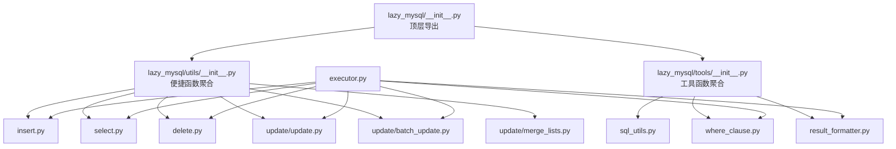
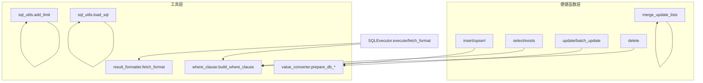
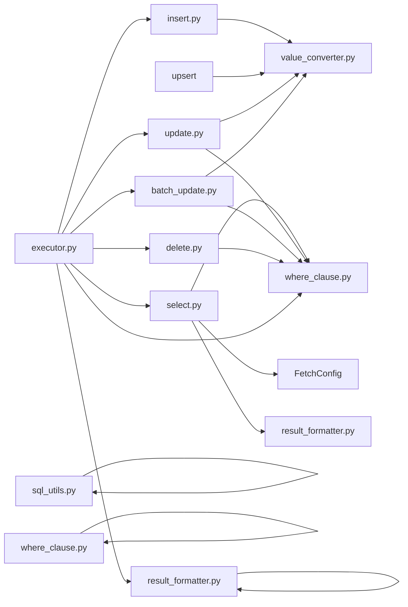

# 工具函数API

<cite>
**本文引用的文件**
- [lazy_mysql/__init__.py](file://lazy_mysql/__init__.py)
- [lazy_mysql/utils/__init__.py](file://lazy_mysql/utils/__init__.py)
- [lazy_mysql/tools/__init__.py](file://lazy_mysql/tools/__init__.py)
- [lazy_mysql/utils/insert.py](file://lazy_mysql/utils/insert.py)
- [lazy_mysql/utils/select.py](file://lazy_mysql/utils/select.py)
- [lazy_mysql/utils/delete.py](file://lazy_mysql/utils/delete.py)
- [lazy_mysql/utils/update/update.py](file://lazy_mysql/utils/update/update.py)
- [lazy_mysql/utils/update/batch_update.py](file://lazy_mysql/utils/update/batch_update.py)
- [lazy_mysql/utils/update/merge_lists.py](file://lazy_mysql/utils/update/merge_lists.py)
- [lazy_mysql/utils/value_converter.py](file://lazy_mysql/utils/value_converter.py)
- [lazy_mysql/tools/sql_utils.py](file://lazy_mysql/tools/sql_utils.py)
- [lazy_mysql/tools/where_clause.py](file://lazy_mysql/tools/where_clause.py)
- [lazy_mysql/tools/result_formatter.py](file://lazy_mysql/tools/result_formatter.py)
- [lazy_mysql/dataclasses/fetch_config.py](file://lazy_mysql/dataclasses/fetch_config.py)
- [lazy_mysql/executor.py](file://lazy_mysql/executor.py)
</cite>

## 目录
1. [简介](#简介)
2. [项目结构](#项目结构)
3. [核心组件](#核心组件)
4. [架构总览](#架构总览)
5. [详细组件分析](#详细组件分析)
6. [依赖分析](#依赖分析)
7. [性能考量](#性能考量)
8. [故障排查指南](#故障排查指南)
9. [结论](#结论)
10. [附录](#附录)

## 简介
本文件面向“工具函数”的完整API文档，涵盖便捷函数与SQL工具函数，包括：
- 便捷函数：insert、upsert、select、exists、update、batch_update、delete、merge_update_lists
- SQL工具函数：add_limit、load_sql
- 结果格式化：通过 fetch_format 与 FetchConfig 控制返回格式
- 函数组合使用最佳实践与性能建议

## 项目结构
围绕工具函数的模块组织如下：
- 顶层导出：在包级 __all__ 中统一导出便捷函数与工具函数
- 工具函数入口：utils 与 tools 子包分别聚合各功能模块
- 执行器：SQLExecutor 提供统一执行与格式化能力，并封装便捷函数

图示来源
- [lazy_mysql/__init__.py:1-21](file://lazy_mysql/__init__.py#L1-L21)
- [lazy_mysql/utils/__init__.py:1-6](file://lazy_mysql/utils/__init__.py#L1-L6)
- [lazy_mysql/tools/__init__.py:1-5](file://lazy_mysql/tools/__init__.py#L1-L5)

章节来源
- [lazy_mysql/__init__.py:1-21](file://lazy_mysql/__init__.py#L1-L21)
- [lazy_mysql/utils/__init__.py:1-6](file://lazy_mysql/utils/__init__.py#L1-L6)
- [lazy_mysql/tools/__init__.py:1-5](file://lazy_mysql/tools/__init__.py#L1-L5)

## 核心组件
- insert/upsert：智能插入与UPSERT，支持单条、批量、超大批量LOAD DATA INFILE策略
- select/exists：通用查询与存在性判断，支持JOIN、DISTINCT、LIMIT、FetchConfig格式化
- update/batch_update：单条更新与智能批量更新，自动选择CASE WHEN/IN策略
- delete：安全删除，强制要求WHERE条件避免全表删除
- merge_update_lists：合并多个更新列表，按conditions去重并处理冲突
- SQL工具：add_limit、load_sql；条件构造：build_where_clause；结果格式化：fetch_format

章节来源
- [lazy_mysql/utils/insert.py:7-287](file://lazy_mysql/utils/insert.py#L7-L287)
- [lazy_mysql/utils/select.py:4-237](file://lazy_mysql/utils/select.py#L4-L237)
- [lazy_mysql/utils/delete.py:3-26](file://lazy_mysql/utils/delete.py#L3-L26)
- [lazy_mysql/utils/update/update.py:4-44](file://lazy_mysql/utils/update/update.py#L4-L44)
- [lazy_mysql/utils/update/batch_update.py:6-313](file://lazy_mysql/utils/update/batch_update.py#L6-L313)
- [lazy_mysql/utils/update/merge_lists.py:21-91](file://lazy_mysql/utils/update/merge_lists.py#L21-L91)
- [lazy_mysql/tools/sql_utils.py:3-53](file://lazy_mysql/tools/sql_utils.py#L3-L53)
- [lazy_mysql/tools/where_clause.py:42-127](file://lazy_mysql/tools/where_clause.py#L42-L127)
- [lazy_mysql/tools/result_formatter.py:3-77](file://lazy_mysql/tools/result_formatter.py#L3-L77)

## 架构总览
工具函数通过 SQLExecutor 统一执行SQL，结合 where_clause 构建WHERE子句，借助 value_converter 规范化数据类型，最终由 result_formatter 按 FetchConfig 输出。

图示来源
- [lazy_mysql/executor.py:126-211](file://lazy_mysql/executor.py#L126-L211)
- [lazy_mysql/tools/where_clause.py:42-127](file://lazy_mysql/tools/where_clause.py#L42-L127)
- [lazy_mysql/tools/result_formatter.py:3-77](file://lazy_mysql/tools/result_formatter.py#L3-L77)
- [lazy_mysql/utils/value_converter.py:74-115](file://lazy_mysql/utils/value_converter.py#L74-L115)

## 详细组件分析

### insert：智能插入
- 功能：根据数据量自动选择最优策略（单条、executemany分批、LOAD DATA INFILE）
- 关键点：
  - 支持 skip_duplicate（基于主键/唯一索引）
  - 使用 value_converter 规范化类型
  - 超大批量分批写入临时CSV并LOAD DATA INFILE
- 返回：插入成功的记录数（int）

章节来源
- [lazy_mysql/utils/insert.py:7-287](file://lazy_mysql/utils/insert.py#L7-L287)
- [lazy_mysql/utils/value_converter.py:74-115](file://lazy_mysql/utils/value_converter.py#L74-L115)

### upsert：插入或更新
- 功能：单条/批量 INSERT ... ON DUPLICATE KEY UPDATE
- 关键点：
  - fields_update 可指定冲突时更新的字段集合
  - 自动确定更新字段列表
- 返回：影响记录数（int）

章节来源
- [lazy_mysql/utils/insert.py:74-159](file://lazy_mysql/utils/insert.py#L74-L159)

### select：通用查询
- 功能：支持单表/多表JOIN、DISTINCT、LIMIT、ORDER BY、FetchConfig格式化
- 关键点：
  - conditions 支持元组运算符、IN/NOT IN、NULL/NOT NULL、NDayInterval
  - fetch_config 支持 all/oneTuple/one 与 list_1/df/df_dict/dict 输出
  - JOIN默认使用 item_id 关联，也可自定义join_conditions
- 返回：根据 fetch_mode/output_format 决定的结构化结果

章节来源
- [lazy_mysql/utils/select.py:4-237](file://lazy_mysql/utils/select.py#L4-L237)
- [lazy_mysql/dataclasses/fetch_config.py:8-24](file://lazy_mysql/dataclasses/fetch_config.py#L8-L24)

### exists：存在性判断
- 功能：SELECT 1 ... LIMIT 1 快速判断是否存在
- 关键点：
  - 性能优于全表扫描
  - 支持JOIN与NDayInterval
- 返回：布尔值

章节来源
- [lazy_mysql/utils/select.py:159-237](file://lazy_mysql/utils/select.py#L159-L237)

### update：单条更新
- 功能：动态SET子句，安全更新
- 关键点：
  - fields/conditions 均不可为空
  - 使用 value_converter 规范化字段值
- 返回：无（副作用）

章节来源
- [lazy_mysql/utils/update/update.py:4-44](file://lazy_mysql/utils/update/update.py#L4-L44)
- [lazy_mysql/utils/value_converter.py:74-115](file://lazy_mysql/utils/value_converter.py#L74-L115)

### batch_update：智能批量更新
- 功能：自动判断WHERE条件复杂度，选择CASE WHEN/IN或通用CASE WHEN策略
- 关键点：
  - 简单条件（单一字段）：使用简化CASE key WHEN语法
  - 复杂条件：使用通用CASE WHEN语法，OR连接不同记录条件
  - 参数顺序严格：先SET子句参数，再WHERE子句参数
- 返回：无（副作用）

章节来源
- [lazy_mysql/utils/update/batch_update.py:6-313](file://lazy_mysql/utils/update/batch_update.py#L6-L313)

### delete：安全删除
- 功能：动态WHERE子句，强制要求conditions
- 关键点：
  - conditions 为空将抛错，避免误删全表
- 返回：无（副作用）

章节来源
- [lazy_mysql/utils/delete.py:3-26](file://lazy_mysql/utils/delete.py#L3-L26)

### merge_update_lists：合并更新列表
- 功能：按conditions去重并合并fields，处理冲突策略
- 关键点：
  - on_conflict 支持 error/skip/override
  - conditions 深拷贝，避免污染原始数据
- 返回：合并后的 update_list

章节来源
- [lazy_mysql/utils/update/merge_lists.py:21-91](file://lazy_mysql/utils/update/merge_lists.py#L21-L91)

### add_limit：SQL条件限制片段
- 功能：构建AND/OR条件片段，支持多运算符与IN/NOT IN
- 关键点：
  - value 为 "", "all", "null", None, [] 时返回空字符串
  - 支持 column_alias 前缀
- 返回：SQL条件片段（字符串）

章节来源
- [lazy_mysql/tools/sql_utils.py:9-53](file://lazy_mysql/tools/sql_utils.py#L9-L53)

### load_sql：载入SQL文件
- 功能：读取本地SQL文件内容
- 返回：去除首尾空白的SQL文本

章节来源
- [lazy_mysql/tools/sql_utils.py:3-7](file://lazy_mysql/tools/sql_utils.py#L3-L7)

### where_clause：WHERE子句构造
- 功能：根据conditions生成WHERE子句与参数列表
- 关键点：
  - 支持元组运算符、IN/NOT IN、NULL/NOT NULL
  - NDayInterval 自动展开为日期表达式
  - Dict类型自动JSON序列化
- 返回：(where_clause, params)

章节来源
- [lazy_mysql/tools/where_clause.py:42-127](file://lazy_mysql/tools/where_clause.py#L42-L127)

### result_formatter：结果格式化
- 功能：按 fetch_mode/output_format/data_label/show_count 输出
- 关键点：
  - all：支持 list_1、df、df_dict
  - oneTuple：支持 dict（需 data_label）
  - one：返回首个字段值
- 返回：结构化结果或(结果, 数量)

章节来源
- [lazy_mysql/tools/result_formatter.py:3-77](file://lazy_mysql/tools/result_formatter.py#L3-L77)

## 依赖分析
- 便捷函数依赖：
  - insert/upsert：value_converter
  - select：where_clause、FetchConfig、result_formatter
  - update/batch_update：value_converter、where_clause
  - delete：where_clause
- 工具函数依赖：
  - add_limit：无外部依赖
  - load_sql：文件IO
  - where_clause：json、NDayInterval
  - result_formatter：pandas（可选）
- 执行器依赖：
  - SQLExecutor.execute/fetch_format 统一封装上述能力

图示来源
- [lazy_mysql/utils/insert.py:5-6](file://lazy_mysql/utils/insert.py#L5-L6)
- [lazy_mysql/utils/select.py:1-2](file://lazy_mysql/utils/select.py#L1-L2)
- [lazy_mysql/utils/update/update.py:1-2](file://lazy_mysql/utils/update/update.py#L1-L2)
- [lazy_mysql/utils/update/batch_update.py:2-3](file://lazy_mysql/utils/update/batch_update.py#L2-L3)
- [lazy_mysql/utils/delete.py:1](file://lazy_mysql/utils/delete.py#L1-L1)
- [lazy_mysql/tools/sql_utils.py:1](file://lazy_mysql/tools/sql_utils.py#L1-L1)
- [lazy_mysql/tools/where_clause.py:1](file://lazy_mysql/tools/where_clause.py#L1-L1)
- [lazy_mysql/tools/result_formatter.py:1](file://lazy_mysql/tools/result_formatter.py#L1-L1)
- [lazy_mysql/executor.py:126-211](file://lazy_mysql/executor.py#L126-L211)

## 性能考量
- 插入策略
  - 单条：传统INSERT
  - 小批量（<1000）：executemany
  - 中批量（1000-50000）：分批1000条
  - 大批量（50000-100000）：分批5000条
  - 超大批量（≥100000）：LOAD DATA INFILE，分批50000条，内存占用低、速度高
- 批量更新
  - 简单条件（单一字段）优先使用简化CASE语法，性能最优
  - 复杂条件使用通用CASE WHEN，注意参数顺序与WHERE OR连接
- 查询
  - exists 使用 SELECT 1 LIMIT 1，避免全表扫描
  - select 支持 DISTINCT/LIMIT/ORDER BY，合理使用索引
- 类型转换
  - value_converter 统一处理None、NaN、pandas/numpy、JSON、日期时间、字节等，减少数据库层错误

## 故障排查指南
- WHERE条件为空
  - delete 会在 conditions 为空时抛错，避免误删全表
- 条件格式错误
  - update/batch_update 要求 fields/conditions 均非空
  - where_clause 对元组长度、运算符、IN列表元素类型有严格校验
- 输出格式与data_label不匹配
  - result_formatter 在 output_format 为 df/df_dict/dict 时要求 data_label 非空且长度匹配
- Pandas依赖
  - 使用 df/df_dict 输出需安装pandas，否则会报错
- 连接与超时
  - SQLExecutor 对连接丢失/超时进行重试与回滚，必要时自动关闭连接

章节来源
- [lazy_mysql/utils/delete.py:14-26](file://lazy_mysql/utils/delete.py#L14-L26)
- [lazy_mysql/utils/update/update.py:16-25](file://lazy_mysql/utils/update/update.py#L16-L25)
- [lazy_mysql/tools/where_clause.py:85-127](file://lazy_mysql/tools/where_clause.py#L85-L127)
- [lazy_mysql/tools/result_formatter.py:29-53](file://lazy_mysql/tools/result_formatter.py#L29-L53)
- [lazy_mysql/executor.py:62-107](file://lazy_mysql/executor.py#L62-L107)

## 结论
本工具函数体系以 SQLExecutor 为核心，通过 where_clause、value_converter、result_formatter 形成完整的数据入参、SQL构造、执行与结果格式化闭环。便捷函数覆盖常见CRUD场景，SQL工具函数提供灵活的条件与SQL加载能力，配合 FetchConfig 可按需输出多种结构化结果。遵循本文最佳实践与性能建议，可在保证安全性的同时获得更高的吞吐与更低的资源消耗。

## 附录

### API清单与签名要点
- insert(executor, table_name, fields, skip_duplicate=False, commit=False, self_close=False, temp_dir=None) -> int
- upsert(executor, table_name, fields, fields_update=None, commit=False, self_close=False) -> int
- select(executor, table_names, fields, conditions=None, order_by=None, limit=None, distinct=False, join_conditions=None, self_close=False, fetch_config=None)
- exists(executor, table_names, conditions=None, join_conditions=None, self_close=False) -> bool
- update(executor, table_name, fields, conditions, commit=False, self_close=False) -> None
- batch_update(executor, table_name, update_list, commit=False, self_close=False) -> None
- delete(executor, table_name, conditions, commit=False, self_close=False) -> None
- merge_update_lists(*update_lists, on_conflict='error') -> list
- add_limit(column, value, column_alias="", add_and=True, operator="=") -> str
- load_sql(sql_path) -> str

### 使用示例（路径指引）
- insert/upsert：见对应函数注释中的示例
- select：参考 [select.py 示例:40-58](file://lazy_mysql/utils/select.py#L40-L58)
- exists：参考 [select.py 示例:175-189](file://lazy_mysql/utils/select.py#L175-L189)
- update：参考 [update.py 示例](file://lazy_mysql/utils/update/update.py:26-L44)
- batch_update：参考 [batch_update.py 示例](file://lazy_mysql/utils/update/batch_update.py:25-L38)
- merge_update_lists：参考 [merge_lists.py 示例](file://lazy_mysql/utils/update/merge_lists.py:38-L47)
- add_limit：参考 [sql_utils.py 示例:21-29](file://lazy_mysql/tools/sql_utils.py#L21-L29)
- load_sql：参考 [sql_utils.py 示例:4-7](file://lazy_mysql/tools/sql_utils.py#L4-L7)

### 结果格式化选项
- fetch_mode：all、oneTuple、one
- output_format：
  - all：""（元组列表）、"list_1"（首列扁平化）、"df"（DataFrame）、"df_dict"（字典列表）
  - oneTuple："dict"（需 data_label）
  - one：单值
- show_count：仅在 all 模式下生效，返回(结果, 数量)

章节来源
- [lazy_mysql/tools/result_formatter.py:3-77](file://lazy_mysql/tools/result_formatter.py#L3-L77)
- [lazy_mysql/dataclasses/fetch_config.py:8-24](file://lazy_mysql/dataclasses/fetch_config.py#L8-L24)