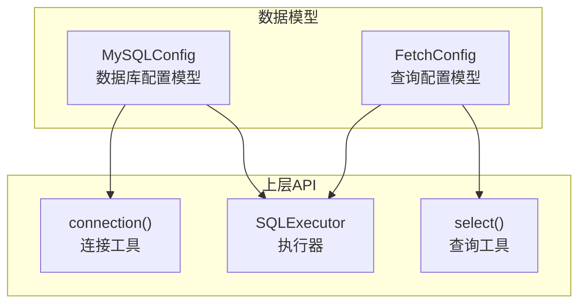
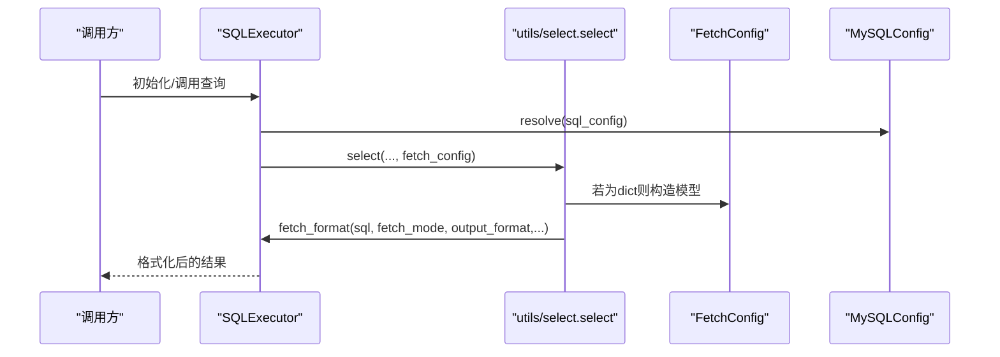
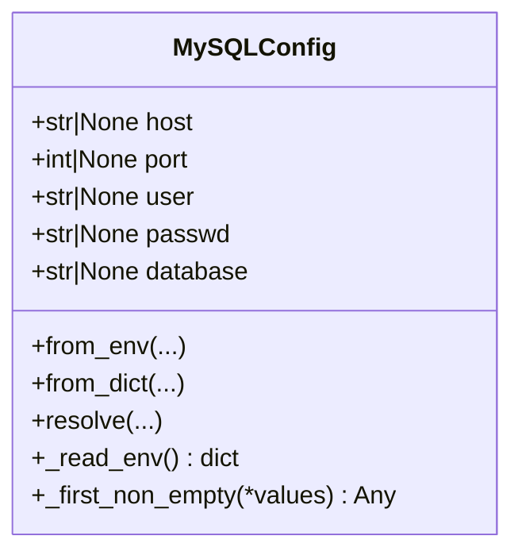
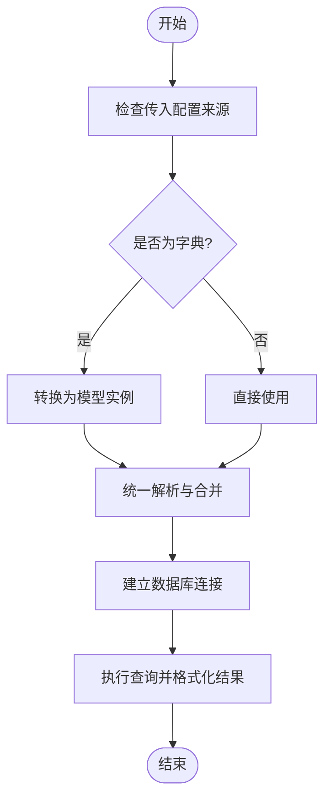
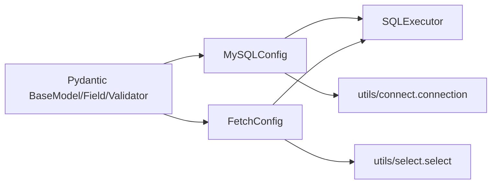

# 数据模型API

<cite>
**本文引用的文件**
- [mysql_config.py](file://lazy_mysql/dataclasses/mysql_config.py)
- [fetch_config.py](file://lazy_mysql/dataclasses/fetch_config.py)
- [__init__.py（dataclasses）](file://lazy_mysql/dataclasses/__init__.py)
- [__init__.py（根包）](file://lazy_mysql/__init__.py)
- [executor.py](file://lazy_mysql/executor.py)
- [select.py](file://lazy_mysql/utils/select.py)
- [connect.py](file://lazy_mysql/utils/connect.py)
- [FETCH_CONFIG.md](file://docs/FETCH_CONFIG.md)
- [test_sql_config.py](file://tests/test_sql_config.py)
</cite>

## 目录
1. [简介](#简介)
2. [项目结构](#项目结构)
3. [核心组件](#核心组件)
4. [架构总览](#架构总览)
5. [详细组件分析](#详细组件分析)
6. [依赖分析](#依赖分析)
7. [性能考虑](#性能考虑)
8. [故障排查指南](#故障排查指南)
9. [结论](#结论)
10. [附录](#附录)

## 简介
本文件面向“数据模型”API，系统性梳理并说明以下两类数据类的字段定义、类型约束、验证规则、使用方式与在系统中的集成关系：
- MySQLConfig：数据库连接配置模型，支持从环境变量、字典或对象解析配置，并提供统一的解析与合并策略。
- FetchConfig：查询结果获取与格式化配置模型，用于控制查询返回模式、输出格式、列名映射与计数显示。

文档还涵盖数据模型之间的关系、继承层次与组合模式，以及在不同API中的使用场景与转换规则，并给出创建、验证与序列化的实践指引。

## 项目结构
数据模型位于 lazy_mysql/dataclasses 目录下，分别由 mysql_config.py 与 fetch_config.py 提供。根包与 dataclasses 包均导出了这些模型，便于上层模块直接引用。查询与连接等高层API在 executor.py、utils/select.py、utils/connect.py 中广泛使用这些数据模型。



图表来源
- [mysql_config.py:1-135](file://lazy_mysql/dataclasses/mysql_config.py#L1-L135)
- [fetch_config.py:1-24](file://lazy_mysql/dataclasses/fetch_config.py#L1-L24)
- [executor.py:1-616](file://lazy_mysql/executor.py#L1-L616)
- [select.py:1-237](file://lazy_mysql/utils/select.py#L1-L237)
- [connect.py:1-91](file://lazy_mysql/utils/connect.py#L1-L91)

章节来源
- [__init__.py（dataclasses）:1-5](file://lazy_mysql/dataclasses/__init__.py#L1-L5)
- [__init__.py（根包）:1-21](file://lazy_mysql/__init__.py#L1-L21)

## 核心组件
- MySQLConfig：基于 Pydantic BaseModel 的配置模型，负责数据库连接参数的解析、校验与合并，支持从环境变量、字典或对象读取配置。
- FetchConfig：基于 Pydantic BaseModel 的查询配置模型，用于控制查询结果的返回模式、输出格式、列名映射与计数显示。

章节来源
- [mysql_config.py:10-135](file://lazy_mysql/dataclasses/mysql_config.py#L10-L135)
- [fetch_config.py:8-24](file://lazy_mysql/dataclasses/fetch_config.py#L8-L24)

## 架构总览
MySQLConfig 与 FetchConfig 在系统中的使用路径如下：
- 连接阶段：MySQLConfig.resolve(...) 解析配置，传递给 connection(...) 建立数据库连接。
- 查询阶段：SQLExecutor.select(...) 或 SQLExecutor.query(...) 接收 FetchConfig 或其字典形式，驱动 fetch_format(...) 进行结果格式化。
- 工具层：utils/select.py 的 select(...) 函数同样接收 FetchConfig 或字典，内部统一转换为 FetchConfig 实例。



图表来源
- [executor.py:20-25](file://lazy_mysql/executor.py#L20-L25)
- [executor.py:324-386](file://lazy_mysql/executor.py#L324-L386)
- [select.py:4-60](file://lazy_mysql/utils/select.py#L4-L60)
- [fetch_config.py:16-24](file://lazy_mysql/dataclasses/fetch_config.py#L16-L24)
- [mysql_config.py:88-135](file://lazy_mysql/dataclasses/mysql_config.py#L88-L135)

## 详细组件分析

### MySQLConfig 数据模型
- 角色定位：统一解析与合并数据库连接配置，屏蔽来源差异（环境变量、字典、对象）。
- 字段与类型约束
  - host: str | None，默认 None
  - port: int | None，默认 None（字符串端口会被强制转换为整数）
  - user: str | None，默认 None
  - passwd: str | None，默认 None
  - database: str | None，默认 None
- 校验规则
  - 空字符串会被视为 None（统一空值语义）
  - port 的非空字符串会尝试转换为整数，否则抛出异常
- 解析与合并策略
  - from_env(...): 从环境变量读取配置，显式参数优先级高于环境变量
  - from_dict(...): 从字典读取配置，空值不覆盖，缺失字段从环境变量补齐
  - resolve(...): 统一入口，支持传入字典或对象，遵循“显式参数 > 字典/对象 > 环境变量”的优先级，空值不覆盖
- 默认配置
  - DEFAULT_MYSQL_CONFIG = MySQLConfig.resolve()，在无显式配置时提供默认值来源



图表来源
- [mysql_config.py:10-135](file://lazy_mysql/dataclasses/mysql_config.py#L10-L135)

章节来源
- [mysql_config.py:19-41](file://lazy_mysql/dataclasses/mysql_config.py#L19-L41)
- [mysql_config.py:47-60](file://lazy_mysql/dataclasses/mysql_config.py#L47-L60)
- [mysql_config.py:62-80](file://lazy_mysql/dataclasses/mysql_config.py#L62-L80)
- [mysql_config.py:88-135](file://lazy_mysql/dataclasses/mysql_config.py#L88-L135)

### FetchConfig 数据模型
- 角色定位：控制查询结果的返回模式与输出格式，兼容字典与模型两种输入方式。
- 字段与类型约束
  - fetch_mode: Literal["all", "oneTuple", "one"]，默认 "all"
  - output_format: Literal["", "list_1", "df", "df_dict"]，默认 ""
  - data_label: List[str] | None，默认 None（当为 None 且需要 DataFrame/字典时，系统会根据 fields 自动生成）
  - show_count: bool，默认 False
- 序列化
  - to_dict(): 将模型转换为字典，用于兼容旧的字典方式

```mermaid
classDiagram
class FetchConfig {
+FetchMode fetch_mode
+OutputFormat output_format
+str[]|None data_label
+bool show_count
+to_dict() dict
}
class FetchMode {
<<enum>>
"all"
"oneTuple"
"one"
}
class OutputFormat {
<<enum>>
""
"list_1"
"df"
"df_dict"
}
FetchConfig --> FetchMode : "使用"
FetchConfig --> OutputFormat : "使用"
```

图表来源
- [fetch_config.py:8-24](file://lazy_mysql/dataclasses/fetch_config.py#L8-L24)

章节来源
- [fetch_config.py:11-14](file://lazy_mysql/dataclasses/fetch_config.py#L11-L14)
- [fetch_config.py:16-24](file://lazy_mysql/dataclasses/fetch_config.py#L16-L24)

### 使用场景与转换规则
- 在 SQLExecutor 初始化与查询中
  - SQLExecutor.__init__ 与 SQLExecutor.query/SQLExecutor.select 均支持传入 MySQLConfig 或其字典形式，内部通过 MySQLConfig.resolve(...) 统一解析
  - 查询时，若传入的是字典，select(...) 会将其转换为 FetchConfig 实例
- 在连接建立时
  - utils/connect.connection(...) 接收 MySQLConfig.resolve(...) 的结果，作为连接参数
- 在结果格式化时
  - SQLExecutor.fetch_format(...) 接收 fetch_mode、output_format、show_count、data_label 等配置，驱动结果格式化



图表来源
- [executor.py:20-25](file://lazy_mysql/executor.py#L20-L25)
- [select.py:127-133](file://lazy_mysql/utils/select.py#L127-L133)
- [mysql_config.py:88-135](file://lazy_mysql/dataclasses/mysql_config.py#L88-L135)

章节来源
- [executor.py:324-386](file://lazy_mysql/executor.py#L324-L386)
- [select.py:4-60](file://lazy_mysql/utils/select.py#L4-L60)
- [connect.py:16-31](file://lazy_mysql/utils/connect.py#L16-L31)

## 依赖分析
- MySQLConfig 依赖
  - Python 标准库 os
  - Pydantic BaseModel 与 field_validator
- FetchConfig 依赖
  - Pydantic BaseModel 与 Field
  - typing.Literal 与 typing.Optional
- 上层依赖
  - SQLExecutor 依赖 MySQLConfig 与 FetchConfig
  - utils/select.select 依赖 FetchConfig
  - utils/connect.connection 依赖 MySQLConfig



图表来源
- [mysql_config.py:8](file://lazy_mysql/dataclasses/mysql_config.py#L8)
- [fetch_config.py:1](file://lazy_mysql/dataclasses/fetch_config.py#L1)
- [executor.py:2-4](file://lazy_mysql/executor.py#L2-L4)
- [select.py:2](file://lazy_mysql/utils/select.py#L2)
- [connect.py:4](file://lazy_mysql/utils/connect.py#L4)

章节来源
- [__init__.py（dataclasses）:1-5](file://lazy_mysql/dataclasses/__init__.py#L1-L5)
- [__init__.py（根包）:1-21](file://lazy_mysql/__init__.py#L1-L21)

## 性能考虑
- MySQLConfig 的端口解析采用惰性转换，仅在非空时进行类型转换，避免不必要的开销
- FetchConfig 的 data_label 自动生成逻辑仅在需要 DataFrame/字典时触发，减少不必要的计算
- SQLExecutor 在连接失败时具备可重试机制，降低瞬时网络波动对整体性能的影响

## 故障排查指南
- 端口解析异常
  - 现象：传入非整数值的端口导致异常
  - 处理：确保传入的端口为整数或可转换为整数的字符串
  - 参考
    - [mysql_config.py:32-41](file://lazy_mysql/dataclasses/mysql_config.py#L32-L41)
- 空值覆盖问题
  - 现象：显式传入空字符串或 None 导致覆盖已有配置
  - 处理：空字符串与 None 在解析时被视为“不覆盖”，请确认传参
  - 参考
    - [mysql_config.py:25-31](file://lazy_mysql/dataclasses/mysql_config.py#L25-L31)
    - [mysql_config.py:63-67](file://lazy_mysql/dataclasses/mysql_config.py#L63-L67)
- 查询结果格式化异常
  - 现象：使用 DataFrame/字典格式时未提供 data_label
  - 处理：当 output_format 为 "df"/"df_dict"/"dict" 时，data_label 必须提供
  - 参考
    - [FETCH_CONFIG.md:92-93](file://docs/FETCH_CONFIG.md#L92-L93)
    - [FETCH_CONFIG.md:153](file://docs/FETCH_CONFIG.md#L153)
- 连接失败与重试
  - 现象：连接超时或接口错误
  - 处理：检查网络与凭据，必要时增加重试次数与延迟
  - 参考
    - [connect.py:74-84](file://lazy_mysql/utils/connect.py#L74-L84)

章节来源
- [test_sql_config.py:1-164](file://tests/test_sql_config.py#L1-L164)
- [FETCH_CONFIG.md:1-223](file://docs/FETCH_CONFIG.md#L1-L223)

## 结论
MySQLConfig 与 FetchConfig 作为数据模型层的核心，提供了统一的配置解析、严格的类型与空值约束、灵活的来源合并策略与清晰的使用边界。它们在 SQLExecutor、utils/select 与 utils/connect 等上层API中被广泛使用，既保证了易用性，又兼顾了健壮性与可维护性。建议在实际使用中：
- 优先使用模型实例（MySQLConfig、FetchConfig），并在需要兼容旧代码时再使用字典
- 明确各字段的默认值与约束，避免因空值覆盖导致的配置偏差
- 在查询结果格式化时，合理设置 fetch_mode 与 output_format，并提供必要的 data_label

## 附录

### 字段定义与约束一览
- MySQLConfig
  - host: str | None
  - port: int | None（字符串端口将被强制转换为整数）
  - user: str | None
  - passwd: str | None
  - database: str | None
- FetchConfig
  - fetch_mode: "all" | "oneTuple" | "one"
  - output_format: "" | "list_1" | "df" | "df_dict"
  - data_label: List[str] | None
  - show_count: bool

章节来源
- [mysql_config.py:19-41](file://lazy_mysql/dataclasses/mysql_config.py#L19-L41)
- [fetch_config.py:11-14](file://lazy_mysql/dataclasses/fetch_config.py#L11-L14)

### 创建、验证与序列化示例（步骤说明）
- 创建 MySQLConfig
  - 从环境变量创建：调用 MySQLConfig.from_env(...)，显式参数优先于环境变量
  - 从字典创建：调用 MySQLConfig.from_dict(...) 或 MySQLConfig.resolve(dict)
  - 统一解析：调用 MySQLConfig.resolve(...)，支持多种来源与优先级
  - 参考
    - [mysql_config.py:70-80](file://lazy_mysql/dataclasses/mysql_config.py#L70-L80)
    - [mysql_config.py:88-135](file://lazy_mysql/dataclasses/mysql_config.py#L88-L135)
- 创建 FetchConfig
  - 使用模型：直接构造 FetchConfig(...)
  - 使用字典：传入字典，内部会转换为模型实例
  - 参考
    - [select.py:127-133](file://lazy_mysql/utils/select.py#L127-L133)
    - [FETCH_CONFIG.md:169-223](file://docs/FETCH_CONFIG.md#L169-L223)
- 序列化
  - MySQLConfig：可通过 Pydantic 的 model_dump() 获取字典（在当前实现中未显式暴露，但可按 Pydantic 习惯使用）
  - FetchConfig：使用 to_dict() 将模型转换为字典
  - 参考
    - [fetch_config.py:16-24](file://lazy_mysql/dataclasses/fetch_config.py#L16-L24)

### 在不同API中的使用场景
- SQLExecutor
  - 初始化：传入 MySQLConfig 或字典，内部统一解析
  - 查询：传入 FetchConfig 或字典，内部统一转换
  - 参考
    - [executor.py:20-25](file://lazy_mysql/executor.py#L20-L25)
    - [executor.py:324-386](file://lazy_mysql/executor.py#L324-L386)
- utils/select
  - select(...)：支持传入 FetchConfig 或字典
  - 参考
    - [select.py:4-60](file://lazy_mysql/utils/select.py#L4-L60)
- utils/connect
  - connection(...)：接收 MySQLConfig.resolve(...) 的结果
  - 参考
    - [connect.py:16-31](file://lazy_mysql/utils/connect.py#L16-L31)