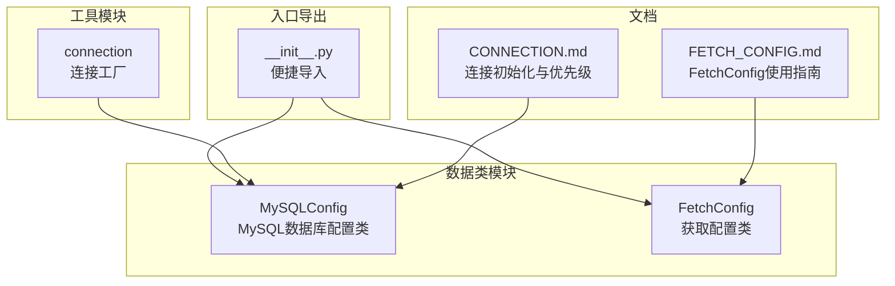
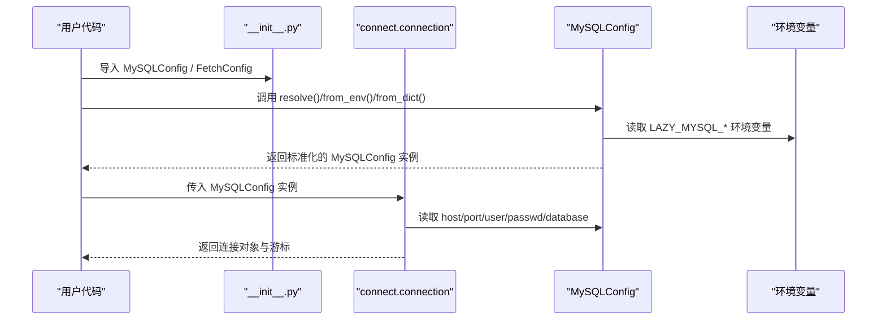
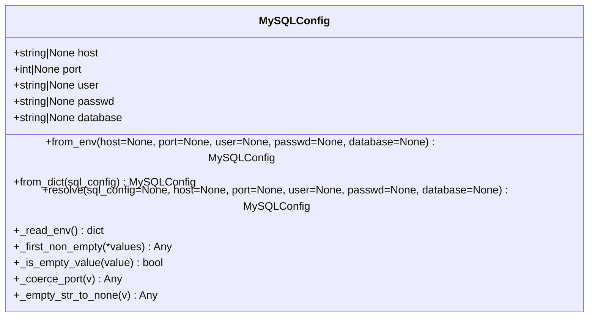
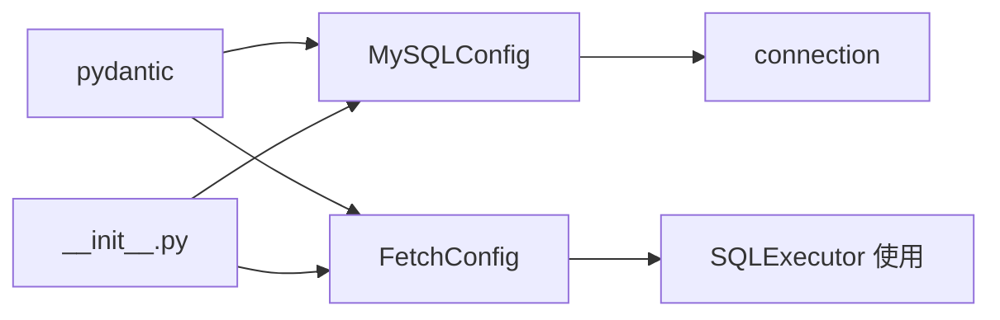
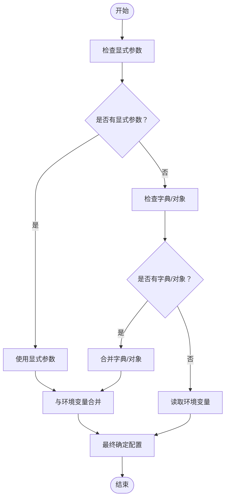

# 配置类API

<cite>
**本文引用的文件**
- [mysql_config.py](file://lazy_mysql/dataclasses/mysql_config.py)
- [fetch_config.py](file://lazy_mysql/dataclasses/fetch_config.py)
- [FETCH_CONFIG.md](file://docs/FETCH_CONFIG.md)
- [CONNECTION.md](file://docs/CONNECTION.md)
- [connect.py](file://lazy_mysql/utils/connect.py)
- [__init__.py](file://lazy_mysql/__init__.py)
- [test_sql_config.py](file://tests/test_sql_config.py)
</cite>

## 目录
1. [简介](#简介)
2. [项目结构](#项目结构)
3. [核心组件](#核心组件)
4. [架构总览](#架构总览)
5. [详细组件分析](#详细组件分析)
6. [依赖分析](#依赖分析)
7. [性能考虑](#性能考虑)
8. [故障排查指南](#故障排查指南)
9. [结论](#结论)
10. [附录](#附录)

## 简介
本文件为配置类的完整API文档，重点覆盖以下内容：
- MySQLConfig类的全部配置参数、数据类型、默认值、取值范围与使用场景
- FetchConfig类的全部配置参数、数据类型、默认值、取值范围与使用场景
- 配置类的初始化方法、配置验证规则、配置合并策略与配置优先级
- 不同配置场景的完整示例，包括环境变量配置、字典配置、文件配置等方式

## 项目结构
配置类位于数据类模块中，配合连接工具与文档说明共同构成完整的配置体系。



图表来源
- [mysql_config.py:1-135](file://lazy_mysql/dataclasses/mysql_config.py#L1-L135)
- [fetch_config.py:1-24](file://lazy_mysql/dataclasses/fetch_config.py#L1-L24)
- [connect.py:1-91](file://lazy_mysql/utils/connect.py#L1-L91)
- [__init__.py:1-21](file://lazy_mysql/__init__.py#L1-L21)
- [FETCH_CONFIG.md:1-223](file://docs/FETCH_CONFIG.md#L1-L223)
- [CONNECTION.md:1-334](file://docs/CONNECTION.md#L1-L334)

章节来源
- [mysql_config.py:1-135](file://lazy_mysql/dataclasses/mysql_config.py#L1-L135)
- [fetch_config.py:1-24](file://lazy_mysql/dataclasses/fetch_config.py#L1-L24)
- [connect.py:1-91](file://lazy_mysql/utils/connect.py#L1-L91)
- [__init__.py:1-21](file://lazy_mysql/__init__.py#L1-L21)
- [FETCH_CONFIG.md:1-223](file://docs/FETCH_CONFIG.md#L1-L223)
- [CONNECTION.md:1-334](file://docs/CONNECTION.md#L1-L334)

## 核心组件
- MySQLConfig：MySQL数据库连接配置类，支持从环境变量、字典或显式参数解析配置，并进行类型校验与空值处理。
- FetchConfig：查询结果获取与输出格式控制配置类，支持多种获取模式与输出格式。

章节来源
- [mysql_config.py:10-135](file://lazy_mysql/dataclasses/mysql_config.py#L10-L135)
- [fetch_config.py:8-24](file://lazy_mysql/dataclasses/fetch_config.py#L8-L24)

## 架构总览
配置类与连接流程的关系如下：



图表来源
- [__init__.py:1-21](file://lazy_mysql/__init__.py#L1-L21)
- [connect.py:16-30](file://lazy_mysql/utils/connect.py#L16-L30)
- [mysql_config.py:47-132](file://lazy_mysql/dataclasses/mysql_config.py#L47-L132)

## 详细组件分析

### MySQLConfig 类

#### 配置参数一览
- host: 字符串或None，默认None
  - 取值范围: 任意可解析的主机名或IP地址
  - 使用场景: 数据库服务器地址
- port: 整数或None，默认None
  - 取值范围: 1~65535（被强制转换）
  - 使用场景: 数据库服务端口
- user: 字符串或None，默认None
  - 取值范围: 任意非空字符串
  - 使用场景: 访问数据库的用户名
- passwd: 字符串或None，默认None
  - 取值范围: 任意字符串
  - 使用场景: 访问数据库的密码
- database: 字符串或None，默认None
  - 取值范围: 任意字符串
  - 使用场景: 默认数据库名称

章节来源
- [mysql_config.py:19-23](file://lazy_mysql/dataclasses/mysql_config.py#L19-L23)

#### 初始化方法与优先级
- from_env(host=None, port=None, user=None, passwd=None, database=None)
  - 从环境变量读取配置；显式参数优先级更高，空值不会覆盖已有值
  - 环境变量映射:
    - LAZY_MYSQL_HOST → host
    - LAZY_MYSQL_PORT → port
    - LAZY_MYSQL_USER → user
    - LAZY_MYSQL_PASSWD → passwd
    - LAZY_MYSQL_DATABASE → database
- from_dict(sql_config)
  - 从字典读取配置；空值不覆盖，缺失字段从环境变量补齐
- resolve(sql_config=None, host=None, port=None, user=None, passwd=None, database=None)
  - 统一解析配置来源，优先级：显式参数 > 字典/配置对象 > 环境变量
  - 空值（None或空字符串）不会覆盖已有值

章节来源
- [mysql_config.py:70-132](file://lazy_mysql/dataclasses/mysql_config.py#L70-L132)

#### 验证规则
- 空字符串会被转换为None，避免误用空字符串作为有效值
- port字段会在非None时尝试转换为整数，否则保持None
- 非法的port值会抛出异常，提示必须为整数

章节来源
- [mysql_config.py:25-40](file://lazy_mysql/dataclasses/mysql_config.py#L25-L40)

#### 配置合并策略
- 多源合并顺序: 显式参数 > 字典/对象 > 环境变量
- 空值不覆盖: 若高优先级源提供None或空字符串，则继续向低优先级源查找首个非空值
- 环境变量读取: 仅在对应键存在且非空时才生效

章节来源
- [mysql_config.py:63-132](file://lazy_mysql/dataclasses/mysql_config.py#L63-L132)

#### 默认配置
- DEFAULT_MYSQL_CONFIG = MySQLConfig.resolve()
  - 通过resolve()在无显式参数时自动从环境变量读取默认配置

章节来源
- [mysql_config.py:134-135](file://lazy_mysql/dataclasses/mysql_config.py#L134-L135)

#### 类图（基于实际代码）



图表来源
- [mysql_config.py:10-135](file://lazy_mysql/dataclasses/mysql_config.py#L10-L135)

#### 配置场景示例

- 环境变量配置
  - 通过设置 LAZY_MYSQL_* 环境变量，调用 MySQLConfig.from_env() 或 MySQLConfig.resolve() 即可读取
  - 参考: [CONNECTION.md:56-80](file://docs/CONNECTION.md#L56-L80)

- 字典配置
  - 传入字典到 MySQLConfig.resolve() 或 from_dict()，空值不覆盖，缺失字段从环境变量补齐
  - 参考: [test_sql_config.py:31-46](file://tests/test_sql_config.py#L31-L46)

- 文件配置（推荐）
  - 将敏感配置写入配置文件（如.env），在应用启动时读取并传递给 resolve()/from_env()
  - 参考: [CONNECTION.md:284-300](file://docs/CONNECTION.md#L284-L300)

- 混合配置
  - 显式参数优先级最高，其次为字典/对象，最后为环境变量
  - 参考: [CONNECTION.md:85-132](file://docs/CONNECTION.md#L85-L132)

### FetchConfig 类

#### 配置参数一览
- fetch_mode: Literal["all", "oneTuple", "one"]，默认"all"
  - all: 获取所有结果
  - oneTuple: 获取单条记录（元组或字典）
  - one: 获取单个值（第一个字段的值）
- output_format: Literal["", "list_1", "df", "df_dict"] 或 "dict"（仅在特定条件下有效），默认""
  - ""（默认）: 返回原始元组列表或元组
  - "list_1": 返回扁平化列表（提取每行第一个字段）
  - "df": 返回pandas DataFrame
  - "df_dict": 返回字典列表（DataFrame转dict）
  - "dict": 仅在 fetch_mode="oneTuple" 且 data_label 不为空时有效
- data_label: List[str] 或 None，默认None
  - 用于DataFrame的列名或字典的键名重命名
  - 当 output_format="df" 或 "df_dict" 时不能为空
- show_count: bool，默认False
  - 若为True，返回 (数据, 总数) 元组

章节来源
- [fetch_config.py:4-14](file://lazy_mysql/dataclasses/fetch_config.py#L4-L14)
- [FETCH_CONFIG.md:5-40](file://docs/FETCH_CONFIG.md#L5-L40)

#### 行为与约束
- fetch_mode="one" 时，output_format 无效
- output_format="df"/"df_dict" 时，data_label 必须非空，否则抛出异常
- output_format="dict" 时，data_label 必须非空且长度与字段数一致，否则抛出异常
- show_count=True 时，返回值为 (数据, 总数)

章节来源
- [FETCH_CONFIG.md:92-167](file://docs/FETCH_CONFIG.md#L92-L167)

#### to_dict() 方法
- 将模型转换为字典，便于兼容旧的字典方式
- 返回包含 fetch_mode、output_format、data_label、show_count 的字典

章节来源
- [fetch_config.py:16-23](file://lazy_mysql/dataclasses/fetch_config.py#L16-L23)

#### 类图（基于实际代码）

```mermaid
classDiagram
class FetchConfig {
+FetchMode fetch_mode
+OutputFormat output_format
+str[]|None data_label
+bool show_count
+to_dict() dict
}
class FetchMode {
<<enumeration>>
"all"
"oneTuple"
"one"
}
class OutputFormat {
<<enumeration>>
""
"list_1"
"df"
"df_dict"
"dict"
}
FetchConfig --> FetchMode : "使用"
FetchConfig --> OutputFormat : "使用"
```

图表来源
- [fetch_config.py:4-23](file://lazy_mysql/dataclasses/fetch_config.py#L4-L23)

#### 使用示例
- 使用 FetchConfig 模型（推荐）
  - 参考: [FETCH_CONFIG.md:171-200](file://docs/FETCH_CONFIG.md#L171-L200)
- 使用字典（兼容旧方式）
  - 参考: [FETCH_CONFIG.md:202-222](file://docs/FETCH_CONFIG.md#L202-L222)

## 依赖分析
- MySQLConfig 依赖 pydantic BaseModel 与 field_validator 进行数据校验
- FetchConfig 依赖 pydantic BaseModel 与 Field 进行数据校验
- 连接工具 connection 依赖 MySQLConfig.resolve() 将任意配置源统一为标准配置对象
- __init__.py 将 MySQLConfig、DEFAULT_MYSQL_CONFIG、FetchConfig 暴露为便捷导入



图表来源
- [mysql_config.py:8](file://lazy_mysql/dataclasses/mysql_config.py#L8)
- [fetch_config.py:1](file://lazy_mysql/dataclasses/fetch_config.py#L1)
- [connect.py:4](file://lazy_mysql/utils/connect.py#L4)
- [__init__.py:1-5](file://lazy_mysql/__init__.py#L1-L5)

章节来源
- [mysql_config.py:8](file://lazy_mysql/dataclasses/mysql_config.py#L8)
- [fetch_config.py:1](file://lazy_mysql/dataclasses/fetch_config.py#L1)
- [connect.py:4](file://lazy_mysql/utils/connect.py#L4)
- [__init__.py:1-5](file://lazy_mysql/__init__.py#L1-L5)

## 性能考虑
- 配置解析采用惰性策略：仅在需要时读取环境变量，避免不必要的IO
- 空值不覆盖策略减少重复赋值，提升合并效率
- 连接建立时使用缓冲与纯Python实现以提升兼容性与稳定性
- 建议在应用启动阶段完成配置解析，避免在热路径重复解析

## 故障排查指南
- 端口解析错误
  - 现象: 抛出“port必须是整数”的异常
  - 原因: 非法的port值（如字符串或None）
  - 处理: 确保port为整数或None
  - 参考: [mysql_config.py:32-40](file://lazy_mysql/dataclasses/mysql_config.py#L32-L40)

- 环境变量未设置导致的空值
  - 现象: 配置项为None
  - 原因: 环境变量为空字符串或未设置
  - 处理: 显式传入参数或正确设置环境变量
  - 参考: [mysql_config.py:47-60](file://lazy_mysql/dataclasses/mysql_config.py#L47-L60)

- 输出格式与data_label不匹配
  - 现象: 使用 "df"/"df_dict" 时抛出异常
  - 原因: data_label 为空或长度不匹配
  - 处理: 提供正确的 data_label 列表
  - 参考: [FETCH_CONFIG.md:92-153](file://docs/FETCH_CONFIG.md#L92-L153)

- 连接失败与重试
  - 现象: 连接超时或无法连接
  - 处理: 检查网络、凭据与重试配置；必要时升级连接器版本
  - 参考: [connect.py:74-88](file://lazy_mysql/utils/connect.py#L74-L88), [CONNECTION.md:180-228](file://docs/CONNECTION.md#L180-L228)

章节来源
- [mysql_config.py:32-40](file://lazy_mysql/dataclasses/mysql_config.py#L32-L40)
- [mysql_config.py:47-60](file://lazy_mysql/dataclasses/mysql_config.py#L47-L60)
- [FETCH_CONFIG.md:92-153](file://docs/FETCH_CONFIG.md#L92-L153)
- [connect.py:74-88](file://lazy_mysql/utils/connect.py#L74-L88)
- [CONNECTION.md:180-228](file://docs/CONNECTION.md#L180-L228)

## 结论
- MySQLConfig 提供了灵活的多源配置能力，支持环境变量、字典与显式参数的组合使用，并具备完善的验证与合并策略
- FetchConfig 提供了丰富的查询结果控制选项，满足多样化的输出需求
- 建议在生产环境中优先使用文件配置结合环境变量覆盖的方式，确保安全与灵活性

## 附录

### 配置优先级与合并流程（流程图）



图表来源
- [mysql_config.py:88-132](file://lazy_mysql/dataclasses/mysql_config.py#L88-L132)