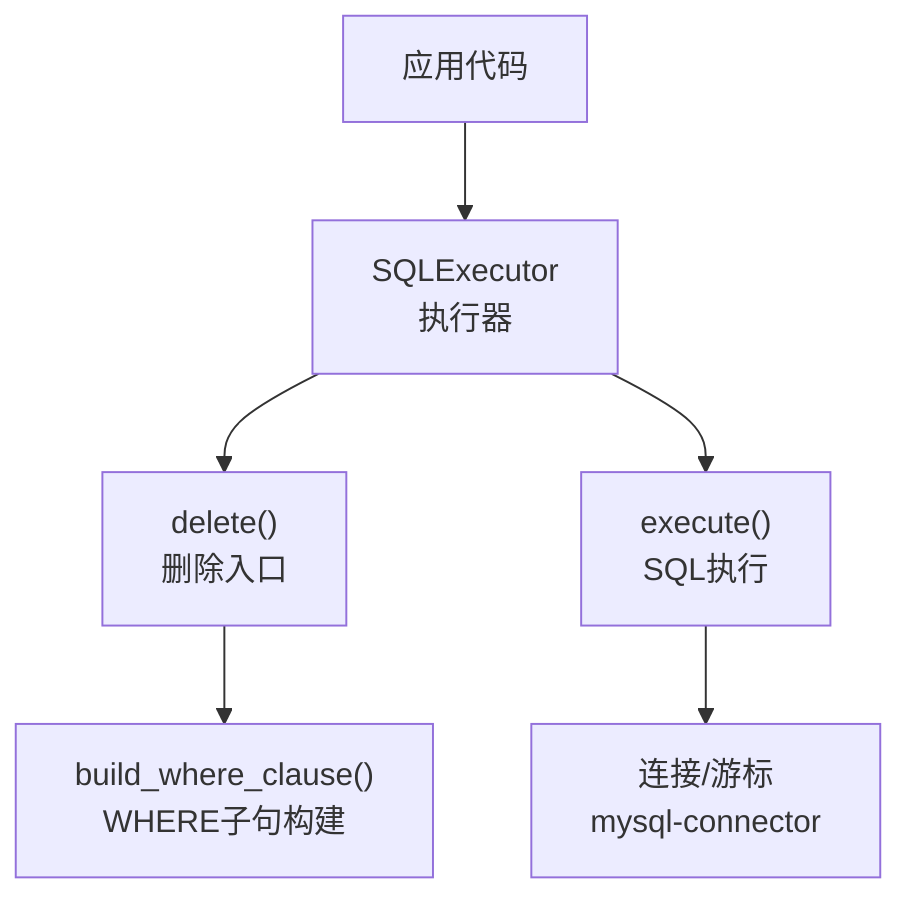
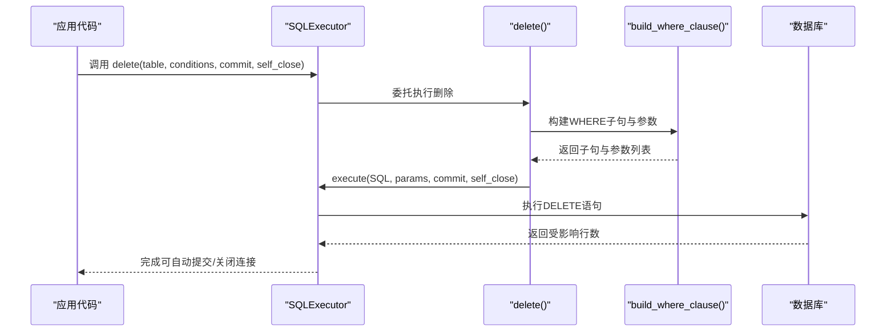
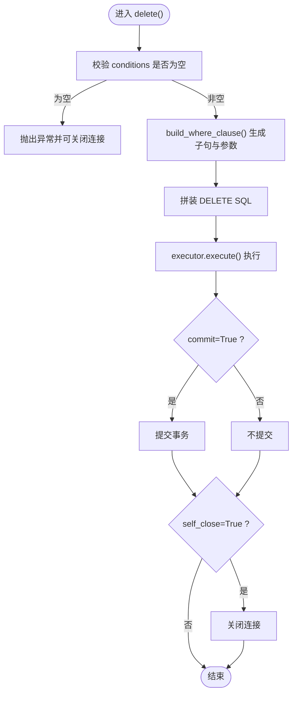
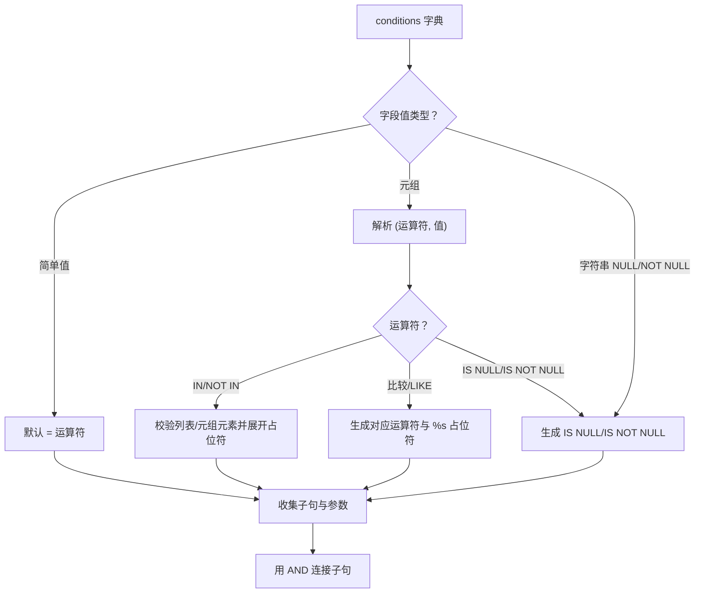
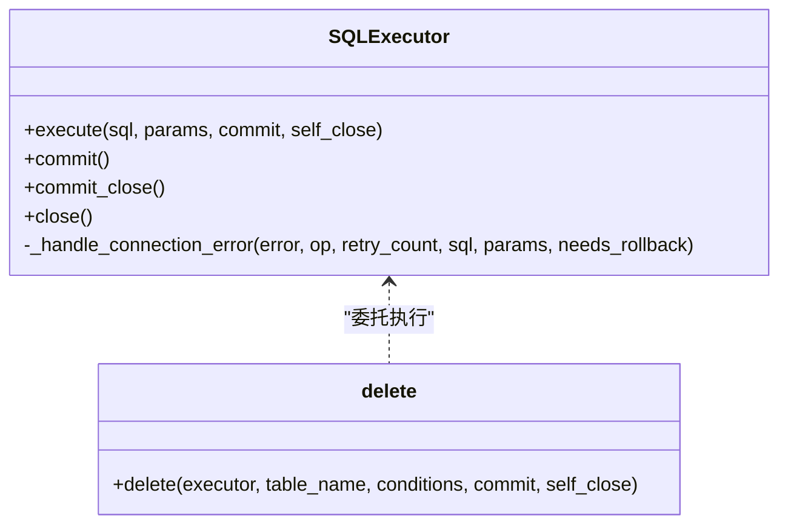
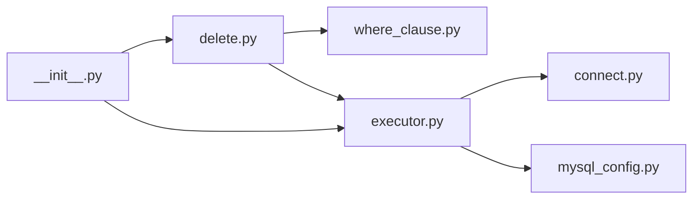

# DELETE删除

<cite>
**本文引用的文件**
- [delete.py](file://lazy_mysql/utils/delete.py)
- [where_clause.py](file://lazy_mysql/tools/where_clause.py)
- [executor.py](file://lazy_mysql/executor.py)
- [DELETE.md](file://docs/DELETE.md)
- [CONDITIONS.md](file://docs/CONDITIONS.md)
- [__init__.py](file://lazy_mysql/__init__.py)
- [connect.py](file://lazy_mysql/utils/connect.py)
- [mysql_config.py](file://lazy_mysql/dataclasses/mysql_config.py)
- [fetch_config.py](file://lazy_mysql/dataclasses/fetch_config.py)
</cite>

## 目录
1. [简介](#简介)
2. [项目结构](#项目结构)
3. [核心组件](#核心组件)
4. [架构总览](#架构总览)
5. [详细组件分析](#详细组件分析)
6. [依赖分析](#依赖分析)
7. [性能考虑](#性能考虑)
8. [故障排查指南](#故障排查指南)
9. [结论](#结论)
10. [附录](#附录)

## 简介
本篇文档聚焦于DELETE删除操作，系统阐述如何在lazy_mysql中安全、可控地执行删除。内容涵盖：
- 删除方式：单条记录删除、批量删除、条件删除
- WHERE条件：精确删除、范围删除、组合条件删除
- 安全机制：空条件保护、参数化查询、事务回滚、连接管理
- 性能优化：批量删除策略、索引影响、事务处理
- 实战示例：安全删除、批量清理、条件筛选删除等场景

## 项目结构
围绕DELETE的核心文件与职责如下：
- lazy_mysql/utils/delete.py：删除入口与WHERE条件构建
- lazy_mysql/tools/where_clause.py：WHERE子句与参数校验
- lazy_mysql/executor.py：SQL执行器与事务/连接管理
- docs/DELETE.md：删除操作指南与示例
- docs/CONDITIONS.md：WHERE条件构造规范
- lazy_mysql/__init__.py：对外导出与便捷导入
- lazy_mysql/utils/connect.py：连接建立与重试
- lazy_mysql/dataclasses/mysql_config.py：配置解析
- lazy_mysql/dataclasses/fetch_config.py：查询结果配置

图表来源
- [executor.py:308-321](file://lazy_mysql/executor.py#L308-L321)
- [delete.py:3-26](file://lazy_mysql/utils/delete.py#L3-L26)
- [where_clause.py:42-127](file://lazy_mysql/tools/where_clause.py#L42-L127)

章节来源
- [__init__.py:3-20](file://lazy_mysql/__init__.py#L3-L20)
- [executor.py:14-616](file://lazy_mysql/executor.py#L14-L616)

## 核心组件
- 删除入口：delete(executor, table_name, conditions, commit=False, self_close=False)
  - 强制校验conditions非空，防止全表删除风险
  - 动态构建WHERE子句与参数列表
  - 调用executor.execute执行SQL
- WHERE子句构建：build_where_clause(conditions)
  - 支持等值、比较运算符、IN/NOT IN、IS NULL/IS NOT NULL
  - 支持NDayInterval日期区间表达式
  - 参数化防注入，自动校验类型（拒绝numpy，字典转JSON）
- 执行器：SQLExecutor
  - 提供delete()快捷入口
  - 统一execute()执行、commit/rollback、连接关闭
  - 可重试连接错误，必要时回滚事务

章节来源
- [delete.py:3-26](file://lazy_mysql/utils/delete.py#L3-L26)
- [where_clause.py:42-127](file://lazy_mysql/tools/where_clause.py#L42-L127)
- [executor.py:308-321](file://lazy_mysql/executor.py#L308-L321)

## 架构总览
DELETE从应用层到数据库的调用链路如下：

图表来源
- [executor.py:308-321](file://lazy_mysql/executor.py#L308-L321)
- [delete.py:3-26](file://lazy_mysql/utils/delete.py#L3-L26)
- [where_clause.py:42-127](file://lazy_mysql/tools/where_clause.py#L42-L127)

## 详细组件分析

### 删除入口与安全校验
- 强制条件校验：conditions为空将抛出异常，避免误删全表
- WHERE子句与参数：通过build_where_clause生成安全的SQL片段与参数列表
- 执行与事务：调用executor.execute，支持commit与self_close

图表来源
- [delete.py:14-26](file://lazy_mysql/utils/delete.py#L14-L26)
- [executor.py:126-185](file://lazy_mysql/executor.py#L126-L185)

章节来源
- [delete.py:3-26](file://lazy_mysql/utils/delete.py#L3-L26)

### WHERE条件与运算符
- 等值条件：字段=值（默认=）
- 比较运算符：>, >=, <, <=, !=, <>
- 模糊匹配：LIKE, NOT LIKE
- 集合匹配：IN, NOT IN（列表/元组自动展开）
- 空值判断：IS NULL, IS NOT NULL
- 日期区间：NDayInterval(7)等价于“>= DATE_SUB(NOW(), INTERVAL 7 DAY)”
- 组合条件：多字段自动AND连接

图表来源
- [where_clause.py:42-127](file://lazy_mysql/tools/where_clause.py#L42-L127)

章节来源
- [CONDITIONS.md:36-104](file://docs/CONDITIONS.md#L36-L104)
- [where_clause.py:42-127](file://lazy_mysql/tools/where_clause.py#L42-L127)

### 执行器与事务/连接管理
- execute(sql, params, commit, self_close)：统一执行入口，支持单条/批量
- commit()：提交事务，内部处理可重试连接错误
- close()：关闭游标与连接，兜底析构
- _handle_connection_error()：连接丢失/超时自动重连，必要时回滚

图表来源
- [executor.py:126-185](file://lazy_mysql/executor.py#L126-L185)
- [executor.py:62-106](file://lazy_mysql/executor.py#L62-L106)
- [delete.py:3-26](file://lazy_mysql/utils/delete.py#L3-L26)

章节来源
- [executor.py:126-185](file://lazy_mysql/executor.py#L126-L185)
- [executor.py:62-106](file://lazy_mysql/executor.py#L62-L106)

### 删除操作的典型场景
- 单条记录删除：基于主键等值条件
- 范围删除：基于时间/数值范围
- 列表删除：IN/NOT IN批量筛选
- 组合条件删除：多字段AND组合
- 软删除：通过IS NULL/IS NOT NULL判断逻辑删除标记

章节来源
- [DELETE.md:36-66](file://docs/DELETE.md#L36-L66)
- [CONDITIONS.md:148-156](file://docs/CONDITIONS.md#L148-L156)

## 依赖分析
- delete依赖where_clause构建WHERE子句
- executor提供统一执行与事务/连接管理
- __init__导出delete与相关工具
- connect与mysql_config负责连接建立与配置解析
- fetch_config用于查询侧的返回格式控制（删除操作不直接使用）

图表来源
- [delete.py:1](file://lazy_mysql/utils/delete.py#L1)
- [where_clause.py:1](file://lazy_mysql/tools/where_clause.py#L1)
- [executor.py:3](file://lazy_mysql/executor.py#L3)
- [connect.py:1](file://lazy_mysql/utils/connect.py#L1)
- [mysql_config.py:1](file://lazy_mysql/dataclasses/mysql_config.py#L1)
- [__init__.py:3-4](file://lazy_mysql/__init__.py#L3-L4)

章节来源
- [__init__.py:3-20](file://lazy_mysql/__init__.py#L3-L20)

## 性能考虑
- 批量删除策略
  - 单条删除：适合少量、精准删除
  - 批量删除：通过IN/范围条件一次性筛选，减少往返
  - 注意：IN列表过大可能影响性能，建议分批执行
- 索引影响
  - WHERE条件涉及的字段应建立合适索引，避免全表扫描
  - LIKE通配符前置会失效索引，应合理设计模式
- 事务处理
  - 大批量删除建议使用commit=False，统一提交，减少事务开销
  - 发生错误时自动回滚，避免半更新
- 连接与重试
  - 长事务场景下注意连接超时与断线重连
  - 可结合self_close控制连接生命周期

## 故障排查指南
- 常见错误场景
  - 条件为空：触发安全保护，抛出异常
  - 数据类型不匹配：如numpy类型、非法字典值
  - 外键约束/权限不足：数据库层拒绝
- 调试技巧
  - 预览将被删除的记录与数量
  - 检查表结构与字段存在性
  - 分步验证WHERE子句与参数

章节来源
- [DELETE.md:68-121](file://docs/DELETE.md#L68-L121)
- [where_clause.py:17-39](file://lazy_mysql/tools/where_clause.py#L17-L39)

## 结论
lazy_mysql的DELETE删除以“安全优先”为核心设计：强制条件校验、参数化查询、事务回滚与连接管理，配合灵活的WHERE条件构造，既能满足单条/批量/条件删除需求，又兼顾性能与可靠性。建议在生产环境中：
- 始终提供明确的conditions
- 为WHERE字段建立索引
- 大批量删除采用分批+统一提交
- 使用预览与审计机制保障安全

## 附录
- 实际使用示例（路径参考）
  - 单条删除：[DELETE.md:39-47](file://docs/DELETE.md#L39-L47)
  - 范围删除：[DELETE.md:42-47](file://docs/DELETE.md#L42-L47)
  - 列表删除：[DELETE.md:49-54](file://docs/DELETE.md#L49-L54)
  - 组合条件删除：[DELETE.md:56-65](file://docs/DELETE.md#L56-L65)
  - 调试删除：[DELETE.md:90-121](file://docs/DELETE.md#L90-L121)
- WHERE条件构造参考
  - 运算符与示例：[CONDITIONS.md:36-104](file://docs/CONDITIONS.md#L36-L104)
  - 日期区间：[CONDITIONS.md:76-88](file://docs/CONDITIONS.md#L76-L88)
  - 空值判断：[CONDITIONS.md:54-74](file://docs/CONDITIONS.md#L54-L74)