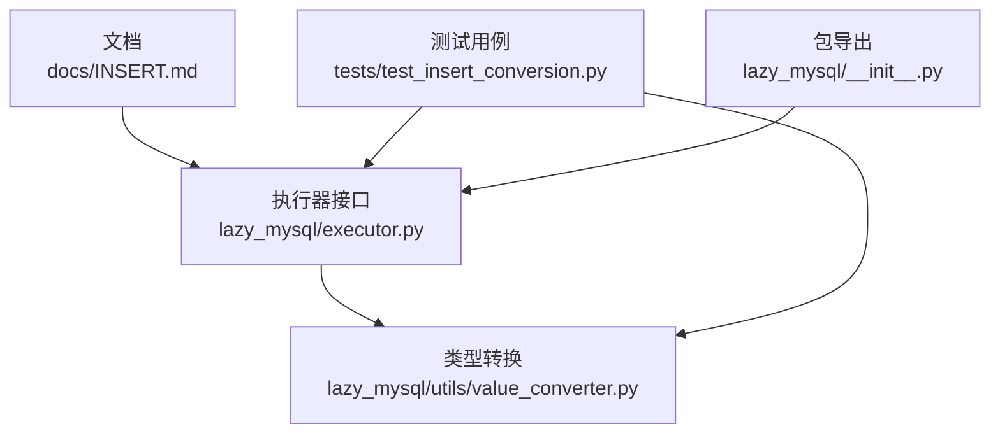
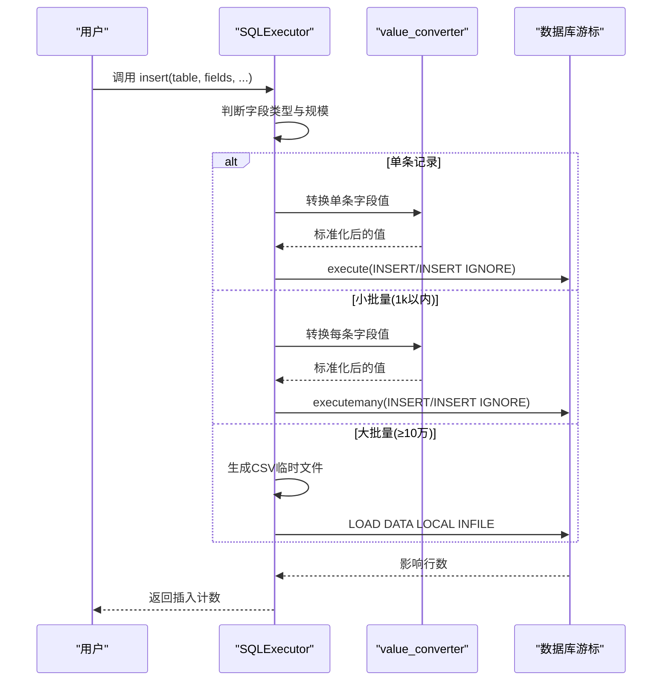
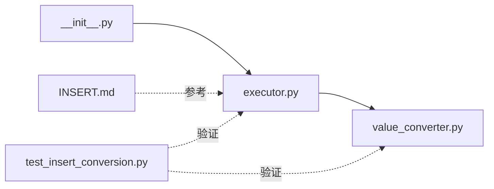

# INSERT插入

<cite>
**本文引用的文件**
- [lazy_mysql/__init__.py](file://lazy_mysql/__init__.py)
- [lazy_mysql/executor.py](file://lazy_mysql/executor.py)
- [docs/INSERT.md](file://docs/INSERT.md)
- [lazy_mysql/utils/value_converter.py](file://lazy_mysql/utils/value_converter.py)
- [tests/test_insert_conversion.py](file://tests/test_insert_conversion.py)
</cite>

## 目录
1. [简介](#简介)
2. [项目结构](#项目结构)
3. [核心组件](#核心组件)
4. [架构总览](#架构总览)
5. [详细组件分析](#详细组件分析)
6. [依赖分析](#依赖分析)
7. [性能考虑](#性能考虑)
8. [故障排查指南](#故障排查指南)
9. [结论](#结论)
10. [附录](#附录)

## 简介
本篇文档聚焦于 INSERT 插入操作，系统阐述单条记录插入、批量插入、条件插入（UPSERT）等能力；详述 Python 类型到 MySQL 的自动转换与验证机制；说明参数传递方式（字典、列表、命名参数）；给出性能优化策略（批量大小、事务、索引）；并通过测试用例路径展示典型场景。

## 项目结构
围绕 INSERT 的关键模块与文档如下：
- 文档层：docs/INSERT.md 提供 INSERT 的使用指南与最佳实践
- 执行器层：lazy_mysql/executor.py 提供 insert/upsert 接口与 SQL 执行封装
- 工具层：lazy_mysql/utils/value_converter.py 提供类型转换与缺失值处理
- 测试层：tests/test_insert_conversion.py 展示类型转换与批量/UPSERT 行为

图表来源
- [docs/INSERT.md:1-243](file://docs/INSERT.md#L1-L243)
- [lazy_mysql/executor.py:14-616](file://lazy_mysql/executor.py#L14-L616)
- [lazy_mysql/utils/value_converter.py:1-115](file://lazy_mysql/utils/value_converter.py#L1-L115)
- [lazy_mysql/__init__.py:1-21](file://lazy_mysql/__init__.py#L1-L21)
- [tests/test_insert_conversion.py:1-211](file://tests/test_insert_conversion.py#L1-L211)

章节来源
- [lazy_mysql/executor.py:14-616](file://lazy_mysql/executor.py#L14-L616)
- [docs/INSERT.md:1-243](file://docs/INSERT.md#L1-L243)
- [lazy_mysql/utils/value_converter.py:1-115](file://lazy_mysql/utils/value_converter.py#L1-L115)
- [lazy_mysql/__init__.py:1-21](file://lazy_mysql/__init__.py#L1-L21)
- [tests/test_insert_conversion.py:1-211](file://tests/test_insert_conversion.py#L1-L211)

## 核心组件
- SQLExecutor.insert：面向用户的插入入口，自动选择策略（单条、标准/优化批量、LOAD DATA INFILE）
- SQLExecutor.upsert：基于 ON DUPLICATE KEY UPDATE 的“存在则更新，不存在则插入”
- value_converter.prepare_db_value：将 Python 值标准化为可安全传入 MySQL 的类型
- 文档 INSERT.md：提供参数说明、示例与最佳实践

章节来源
- [lazy_mysql/executor.py:213-253](file://lazy_mysql/executor.py#L213-L253)
- [lazy_mysql/utils/value_converter.py:74-115](file://lazy_mysql/utils/value_converter.py#L74-L115)
- [docs/INSERT.md:28-151](file://docs/INSERT.md#L28-L151)

## 架构总览
INSERT 的端到端流程：用户调用 SQLExecutor.insert，内部根据数据形态与规模选择策略，必要时借助 value_converter 进行类型转换，最终通过底层游标执行 SQL 并返回插入计数。

图表来源
- [lazy_mysql/executor.py:213-253](file://lazy_mysql/executor.py#L213-L253)
- [lazy_mysql/utils/value_converter.py:74-115](file://lazy_mysql/utils/value_converter.py#L74-L115)

## 详细组件分析

### SQLExecutor.insert：智能插入策略
- 单条记录（dict）：直接构建 INSERT 或 INSERT IGNORE
- 小批量（<1000）：使用标准 executemany
- 中批量（1000-50000）：优化 executemany，按 1000 条/批
- 大批量（50000-100000）：优化 executemany，按 5000 条/批
- 超大批量（≥100000）：LOAD DATA LOCAL INFILE，按 50000 条/批
- 支持 skip_duplicate（INSERT IGNORE）与 commit/self_close 控制

章节来源
- [lazy_mysql/executor.py:213-233](file://lazy_mysql/executor.py#L213-L233)
- [docs/INSERT.md:5-151](file://docs/INSERT.md#L5-L151)

### SQLExecutor.upsert：条件插入（存在则更新，不存在则插入）
- 单条：直接构造 ON DUPLICATE KEY UPDATE
- 多条：批量 executemany 方式执行
- 支持 fields_update 指定冲突时更新的字段集合

章节来源
- [lazy_mysql/executor.py:236-253](file://lazy_mysql/executor.py#L236-L253)
- [docs/INSERT.md:26](file://docs/INSERT.md#L26)

### 参数传递与占位符
- 单个元组：位置参数（%s）
- 单个字典：命名参数（%(name)s）
- 单个列表：自动转元组
- 批量执行：列表/元组/字典的列表，executemany
- SELECT 不支持批量执行（会显著降性能）

章节来源
- [lazy_mysql/executor.py:126-185](file://lazy_mysql/executor.py#L126-L185)

### 类型转换与验证机制
- 缺失值识别：None、pd.NA、pd.NaT、NaN
- Pandas/NumPy：Timestamp/Timedelta 转换，Index/array 转 JSON 字符串
- 日期时间：datetime/date/time 转字符串；Decimal 转字符串
- 字节序列：bytes/bytearray/memoryview 转换为 UTF-8 字符串或字节
- 结构化数据：dict/list/tuple/set 转 JSON 字符串
- 行级转换：prepare_db_row 对整行字段逐一转换

章节来源
- [lazy_mysql/utils/value_converter.py:9-115](file://lazy_mysql/utils/value_converter.py#L9-L115)

### 数据验证与边界处理
- 空参数校验：批量参数中若出现 None/[]/()/{}，抛出明确错误
- SELECT 批量执行保护：禁止对 SELECT 使用批量执行
- 跳过重复：skip_duplicate=True 时使用 INSERT IGNORE

章节来源
- [lazy_mysql/executor.py:147-185](file://lazy_mysql/executor.py#L147-L185)

### 实际场景示例（以测试用例为准）
- 单条记录自动转换：见 [tests/test_insert_conversion.py:29-50](file://tests/test_insert_conversion.py#L29-L50)
- 小批量自动转换：见 [tests/test_insert_conversion.py:52-76](file://tests/test_insert_conversion.py#L52-L76)
- 优化批量转换：见 [tests/test_insert_conversion.py:79-117](file://tests/test_insert_conversion.py#L79-L117)
- UPSERT 单条转换：见 [tests/test_insert_conversion.py:119-138](file://tests/test_insert_conversion.py#L119-L138)
- UPSERT 批量转换：见 [tests/test_insert_conversion.py:140-170](file://tests/test_insert_conversion.py#L140-L170)
- Pandas 列表类值支持：见 [tests/test_insert_conversion.py:172-180](file://tests/test_insert_conversion.py#L172-L180)
- LOAD DATA INFILE 中的 IGNORE 位置正确性：见 [tests/test_insert_conversion.py:184-208](file://tests/test_insert_conversion.py#L184-L208)

## 依赖分析
- 导出入口：lazy_mysql/__init__.py 暴露 insert、upsert 等便捷导入
- 执行器依赖：SQLExecutor 依赖连接工具与数据类
- 类型转换：insert/upsert 流程中调用 value_converter 进行值预处理
- 文档与测试：INSERT.md 提供使用说明，test_insert_conversion.py 验证类型转换与策略行为

图表来源
- [lazy_mysql/__init__.py:1-21](file://lazy_mysql/__init__.py#L1-L21)
- [lazy_mysql/executor.py:14-616](file://lazy_mysql/executor.py#L14-L616)
- [lazy_mysql/utils/value_converter.py:1-115](file://lazy_mysql/utils/value_converter.py#L1-L115)
- [docs/INSERT.md:1-243](file://docs/INSERT.md#L1-L243)
- [tests/test_insert_conversion.py:1-211](file://tests/test_insert_conversion.py#L1-L211)

章节来源
- [lazy_mysql/__init__.py:1-21](file://lazy_mysql/__init__.py#L1-L21)
- [lazy_mysql/executor.py:14-616](file://lazy_mysql/executor.py#L14-L616)
- [lazy_mysql/utils/value_converter.py:1-115](file://lazy_mysql/utils/value_converter.py#L1-L115)
- [docs/INSERT.md:1-243](file://docs/INSERT.md#L1-L243)
- [tests/test_insert_conversion.py:1-211](file://tests/test_insert_conversion.py#L1-L211)

## 性能考虑
- 批量大小控制
  - 小批量（<1000）：标准 executemany
  - 中批量（1k-50k）：优化 executemany，1000 条/批
  - 中大型批量（50k-100k）：优化 executemany，5000 条/批
  - 超大批量（≥100k）：LOAD DATA LOCAL INFILE，50000 条/批
- 事务处理
  - 单次操作：commit=True 立即提交
  - 批量操作：手动控制提交，保证原子性
- 索引与约束
  - skip_duplicate=True 仅对主键/显式 UNIQUE 索引生效
  - 使用 INSERT IGNORE 跳过违反唯一约束的记录
- MySQL 服务端优化建议（来自文档）
  - 启用 LOCAL INFILE
  - 调整 max_allowed_packet、innodb_buffer_pool_size 等参数

章节来源
- [docs/INSERT.md:5-151](file://docs/INSERT.md#L5-L151)
- [docs/INSERT.md:194-242](file://docs/INSERT.md#L194-L242)

## 故障排查指南
- 空参数错误
  - 现象：批量参数中包含 None/[]/()/{} 时报错
  - 处理：在调用前过滤空值或补齐字段
- SELECT 批量执行被拒绝
  - 现象：对 SELECT 使用批量执行会抛出异常
  - 处理：仅对 DML（INSERT/UPDATE/DELETE）使用批量执行
- 跳过重复无效
  - 现象：skip_duplicate=True 未生效
  - 原因：仅对主键/显式 UNIQUE 索引有效
- 资源清理与临时文件
  - 场景：使用 LOAD DATA INFILE 时，临时文件清理需关注异常路径
  - 建议：确保异常处理覆盖临时文件删除

章节来源
- [lazy_mysql/executor.py:147-185](file://lazy_mysql/executor.py#L147-L185)
- [docs/INSERT.md:142-151](file://docs/INSERT.md#L142-L151)

## 结论
lazy_mysql 的 INSERT 模块通过智能策略与类型转换，兼顾易用性与高性能。单条、小批量、超大批量均有针对性优化；配合 skip_duplicate 与事务控制，可满足多数生产场景需求。建议结合业务数据规模与索引设计，合理选择策略并做好异常与资源管理。

## 附录
- 使用示例（以测试用例为准）
  - 单条插入与自动转换：[tests/test_insert_conversion.py:29-50](file://tests/test_insert_conversion.py#L29-L50)
  - 小批量插入与自动转换：[tests/test_insert_conversion.py:52-76](file://tests/test_insert_conversion.py#L52-L76)
  - 优化批量插入与自动转换：[tests/test_insert_conversion.py:79-117](file://tests/test_insert_conversion.py#L79-L117)
  - UPSERT 单条与批量：[tests/test_insert_conversion.py:119-170](file://tests/test_insert_conversion.py#L119-L170)
  - Pandas 列表类值支持：[tests/test_insert_conversion.py:172-180](file://tests/test_insert_conversion.py#L172-L180)
  - LOAD DATA INFILE 中 IGNORE 位置正确性：[tests/test_insert_conversion.py:184-208](file://tests/test_insert_conversion.py#L184-L208)