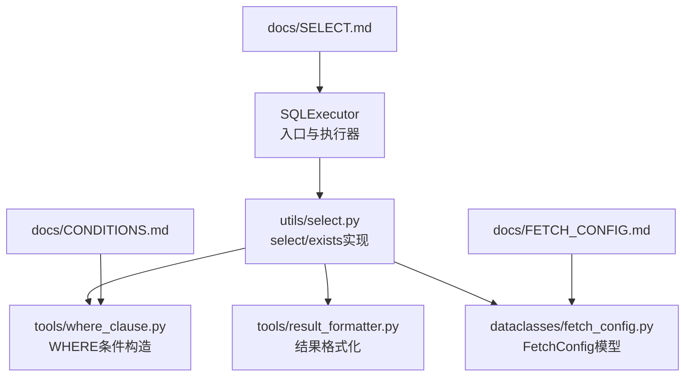
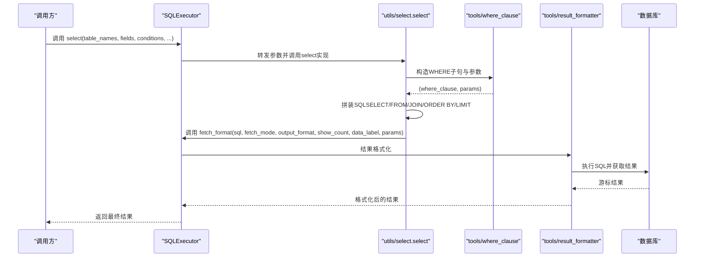
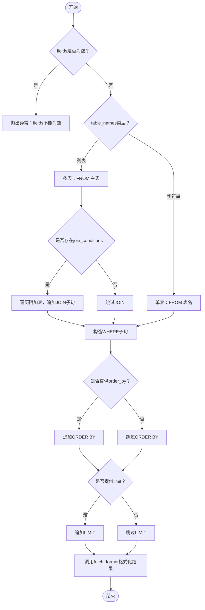
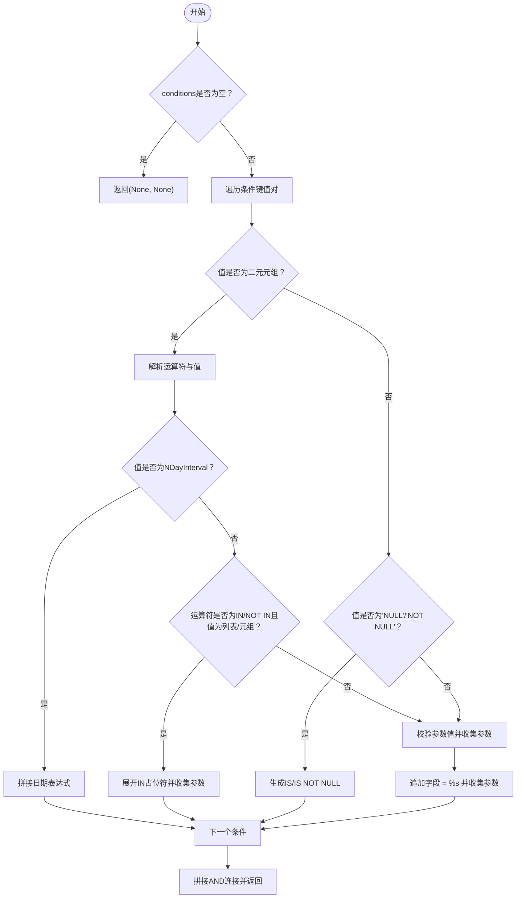
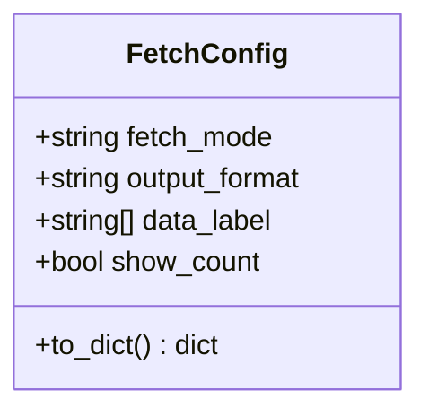
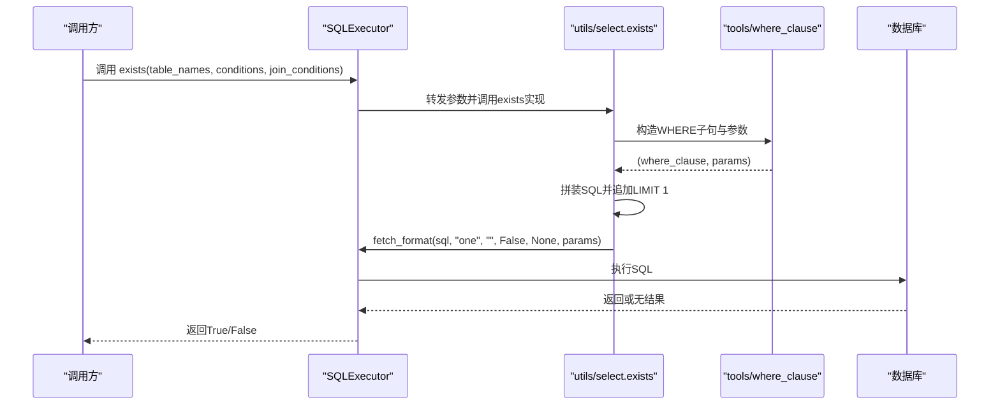
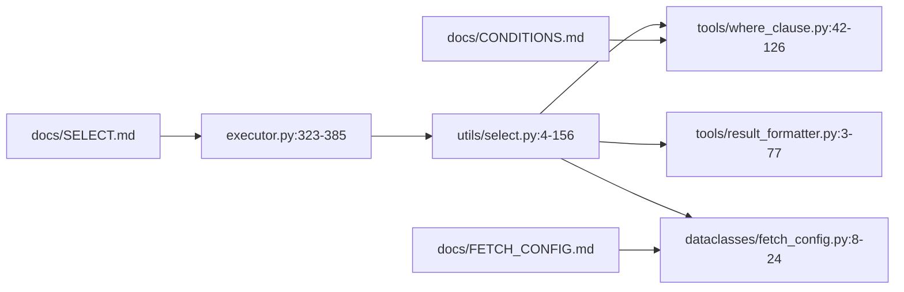

# SELECT查询

<cite>
**本文引用的文件**
- [select.py](file://lazy_mysql/utils/select.py)
- [executor.py](file://lazy_mysql/executor.py)
- [where_clause.py](file://lazy_mysql/tools/where_clause.py)
- [fetch_config.py](file://lazy_mysql/dataclasses/fetch_config.py)
- [result_formatter.py](file://lazy_mysql/tools/result_formatter.py)
- [SELECT.md](file://docs/SELECT.md)
- [FETCH_CONFIG.md](file://docs/FETCH_CONFIG.md)
- [CONDITIONS.md](file://docs/CONDITIONS.md)
</cite>

## 目录
1. [简介](#简介)
2. [项目结构](#项目结构)
3. [核心组件](#核心组件)
4. [架构总览](#架构总览)
5. [组件详细分析](#组件详细分析)
6. [依赖关系分析](#依赖关系分析)
7. [性能考量](#性能考量)
8. [故障排查指南](#故障排查指南)
9. [结论](#结论)
10. [附录](#附录)

## 简介
本篇文档聚焦于智能查询构建器的SELECT查询能力，系统讲解如何使用SQLExecutor封装的select方法与内部工具，完成从基础查询、复杂条件、多表关联、排序限制，到结果格式化与性能优化的完整流程。同时深入说明WHERE条件构造语法（等值、比较、IN、BETWEEN、LIKE、空值判断等）以及FetchConfig配置项（fetch_mode、output_format、data_label、show_count）的使用场景与注意事项。

## 项目结构
围绕SELECT查询的关键文件与职责如下：
- lazy_mysql/executor.py：对外暴露SQLExecutor类，提供select、exists、fetch_format等入口方法
- lazy_mysql/utils/select.py：select与exists的具体实现，负责SQL拼装、JOIN构造、WHERE条件生成与结果格式化调度
- lazy_mysql/tools/where_clause.py：WHERE条件构造器，支持多种运算符、IN/NOT IN、空值判断、NDayInterval日期区间
- lazy_mysql/tools/result_formatter.py：结果格式化器，依据fetch_mode与output_format输出元组列表、字典列表、DataFrame或单值
- lazy_mysql/dataclasses/fetch_config.py：FetchConfig数据模型，定义fetch_mode、output_format、data_label、show_count
- docs/SELECT.md、docs/FETCH_CONFIG.md、docs/CONDITIONS.md：官方文档，提供使用示例与配置说明



图表来源
- [executor.py:323-385](file://lazy_mysql/executor.py#L323-L385)
- [select.py:4-156](file://lazy_mysql/utils/select.py#L4-L156)
- [where_clause.py:42-126](file://lazy_mysql/tools/where_clause.py#L42-L126)
- [result_formatter.py:3-77](file://lazy_mysql/tools/result_formatter.py#L3-L77)
- [fetch_config.py:8-24](file://lazy_mysql/dataclasses/fetch_config.py#L8-L24)

章节来源
- [executor.py:14-200](file://lazy_mysql/executor.py#L14-L200)
- [select.py:4-156](file://lazy_mysql/utils/select.py#L4-L156)
- [where_clause.py:42-126](file://lazy_mysql/tools/where_clause.py#L42-L126)
- [result_formatter.py:3-77](file://lazy_mysql/tools/result_formatter.py#L3-L77)
- [fetch_config.py:8-24](file://lazy_mysql/dataclasses/fetch_config.py#L8-L24)

## 核心组件
- SQLExecutor.select：对外统一入口，负责参数校验、委托utils/select.py实现与结果格式化
- utils/select.select：核心实现，拼装SELECT、FROM、JOIN、WHERE、ORDER BY、LIMIT；处理distinct；调度executor.fetch_format
- tools/where_clause.build_where_clause：将conditions字典转换为WHERE子句与参数列表，支持IN/NOT IN、空值判断、NDayInterval
- tools/result_formatter.fetch_format：按fetch_mode与output_format输出元组列表、字典列表、DataFrame或单值，并可返回数量
- dataclasses/fetch_config.FetchConfig：配置模型，支持字典与模型两种传参方式

章节来源
- [executor.py:323-385](file://lazy_mysql/executor.py#L323-L385)
- [select.py:4-156](file://lazy_mysql/utils/select.py#L4-L156)
- [where_clause.py:42-126](file://lazy_mysql/tools/where_clause.py#L42-L126)
- [result_formatter.py:3-77](file://lazy_mysql/tools/result_formatter.py#L3-L77)
- [fetch_config.py:8-24](file://lazy_mysql/dataclasses/fetch_config.py#L8-L24)

## 架构总览
下图展示了从SQLExecutor.select到最终结果返回的端到端流程，包括WHERE条件构造与结果格式化：



图表来源
- [executor.py:323-385](file://lazy_mysql/executor.py#L323-L385)
- [select.py:114-156](file://lazy_mysql/utils/select.py#L114-L156)
- [where_clause.py:42-126](file://lazy_mysql/tools/where_clause.py#L42-L126)
- [result_formatter.py:3-77](file://lazy_mysql/tools/result_formatter.py#L3-L77)

## 组件详细分析

### 1) 基础查询与多表关联
- 单表查询：指定表名与字段列表即可，自动拼装SELECT ... FROM ...
- 多表关联：传入表名列表与join_conditions，支持INNER JOIN、LEFT JOIN、RIGHT JOIN、FULL OUTER JOIN等类型；默认使用主表.item_id = 附表.item_id进行关联，也可自定义字段与运算符
- DISTINCT：通过distinct参数启用去重
- ORDER BY/LIMIT：支持order_by与limit参数，二者优先级高于外部传入



图表来源
- [select.py:61-156](file://lazy_mysql/utils/select.py#L61-L156)

章节来源
- [select.py:4-156](file://lazy_mysql/utils/select.py#L4-L156)
- [executor.py:323-385](file://lazy_mysql/executor.py#L323-L385)

### 2) WHERE条件构造（等值、比较、IN、BETWEEN、LIKE、空值）
- 等值条件：字段直配值，生成“字段 = 值”
- 比较运算符：支持=、!=、<>、>、>=、<、<=、LIKE、NOT LIKE
- IN/NOT IN：支持列表/元组，自动展开为占位符并注入参数
- 空值判断：'NULL'/'NOT NULL'生成IS/IS NOT NULL
- BETWEEN：通过元组格式与NDayInterval实现日期区间筛选
- 参数校验：禁止numpy类型；字典类型自动JSON序列化；非法类型抛错



图表来源
- [where_clause.py:85-126](file://lazy_mysql/tools/where_clause.py#L85-L126)

章节来源
- [where_clause.py:42-126](file://lazy_mysql/tools/where_clause.py#L42-L126)
- [CONDITIONS.md:36-104](file://docs/CONDITIONS.md#L36-L104)

### 3) FetchConfig配置详解（fetch_mode、output_format、data_label、show_count）
- fetch_mode：all（默认）、oneTuple、one
- output_format：仅在all或oneTuple时有效，支持""（元组/元组列表）、"list_1"（首列扁平化）、"df"（DataFrame）、"df_dict"（DataFrame转字典列表）、"dict"（oneTuple且data_label非空时）
- data_label：DataFrame列名或字典键名；为None时可基于fields自动生成（字典格式时需展平）
- show_count：为True时返回(数据, 总数)元组
- 兼容性：既支持字典传参，也支持FetchConfig模型实例



图表来源
- [fetch_config.py:8-24](file://lazy_mysql/dataclasses/fetch_config.py#L8-L24)

章节来源
- [fetch_config.py:8-24](file://lazy_mysql/dataclasses/fetch_config.py#L8-L24)
- [result_formatter.py:3-77](file://lazy_mysql/tools/result_formatter.py#L3-L77)
- [FETCH_CONFIG.md:54-168](file://docs/FETCH_CONFIG.md#L54-L168)

### 4) 结果格式化与返回形态
- all模式：默认返回元组列表；可选"list_1"、"df"、"df_dict"
- oneTuple模式：默认返回单条元组；可选"dict"（需data_label非空且长度匹配）
- one模式：返回单个值（第一个字段的值）
- show_count：在all模式下返回(数据, 总数)

```mermaid
flowchart TD
FStart(["进入fetch_format"]) --> Mode{"fetch_mode"}
Mode --> |all| AllPath["fetchall()"]
AllPath --> OFmt{"output_format"}
OFmt --> |""| RetAllTup["返回元组列表"]
OFmt --> |"list_1"| RetFlat["提取首列返回列表"]
OFmt --> |"df"| RetDF["构造DataFrame(data_label)"]
OFmt --> |"df_dict"| RetDFDict["DataFrame.to_dict('records')"]
Mode --> |oneTuple| OneTuplePath["fetchone()"]
OneTuplePath --> DictCheck{"output_format==dict 且 data_label非空？"}
DictCheck --> |是| RetDict["zip(data_label, 元组) -> 字典"]
DictCheck --> |否| RetOneTuple["返回元组"]
Mode --> |one| OnePath["fetchone()"]
OnePath --> OneVal["取首个字段值或字典"]
OFmt --> |其他| Error["抛出错误"]
RetAllTup --> CountCheck{"show_count？"}
RetDF --> CountCheck
RetDFDict --> CountCheck
RetFlat --> CountCheck
RetDict --> CountCheck
RetOneTuple --> CountCheck
OneVal --> CountCheck
CountCheck --> |是| RetPair["返回(结果, 数量)"]
CountCheck --> |否| RetSingle["返回结果"]
```

图表来源
- [result_formatter.py:3-77](file://lazy_mysql/tools/result_formatter.py#L3-L77)

章节来源
- [result_formatter.py:3-77](file://lazy_mysql/tools/result_formatter.py#L3-L77)
- [FETCH_CONFIG.md:109-168](file://docs/FETCH_CONFIG.md#L109-L168)

### 5) 快速存在性检查 exists
- 采用SELECT 1 ... LIMIT 1优化路径，命中即停，避免全表扫描
- 支持单表与多表JOIN条件，支持NDayInterval日期区间
- 返回布尔值，适合存在性判断场景



图表来源
- [select.py:159-237](file://lazy_mysql/utils/select.py#L159-L237)

章节来源
- [select.py:159-237](file://lazy_mysql/utils/select.py#L159-L237)
- [SELECT.md:161-266](file://docs/SELECT.md#L161-L266)

### 6) 实战示例与场景
- 单表基础查询：指定表与字段，返回字典列表或DataFrame
- 多字段别名与表前缀：通过字典形式fields指定表前缀，避免同名列歧义
- JOIN多表关联：INNER JOIN/LT/RT/FULL OUTER JOIN，自定义关联字段
- 复杂条件组合：等值、比较、IN、LIKE、空值、NDayInterval混合
- 排序与限制：order_by与limit灵活组合，支持分页
- 聚合查询：COUNT、SUM、MAX等聚合字段与GROUP BY（通过自定义SQL或query方法）

章节来源
- [SELECT.md:120-371](file://docs/SELECT.md#L120-L371)
- [SELECT.md:372-410](file://docs/SELECT.md#L372-L410)
- [SELECT.md:418-672](file://docs/SELECT.md#L418-L672)

## 依赖关系分析
- SQLExecutor.select依赖utils/select.select实现SQL拼装与执行
- utils/select.select依赖tools/where_clause.build_where_clause生成WHERE子句
- utils/select.select依赖tools/result_formatter.fetch_format进行结果格式化
- utils/select.select依赖dataclasses/fetch_config.FetchConfig进行配置解析
- 文档层SELECT.md/FETCH_CONFIG.md/CONDITIONS.md提供使用示例与配置说明



图表来源
- [executor.py:323-385](file://lazy_mysql/executor.py#L323-L385)
- [select.py:4-156](file://lazy_mysql/utils/select.py#L4-L156)
- [where_clause.py:42-126](file://lazy_mysql/tools/where_clause.py#L42-L126)
- [result_formatter.py:3-77](file://lazy_mysql/tools/result_formatter.py#L3-L77)
- [fetch_config.py:8-24](file://lazy_mysql/dataclasses/fetch_config.py#L8-L24)

章节来源
- [executor.py:323-385](file://lazy_mysql/executor.py#L323-L385)
- [select.py:4-156](file://lazy_mysql/utils/select.py#L4-L156)
- [where_clause.py:42-126](file://lazy_mysql/tools/where_clause.py#L42-L126)
- [result_formatter.py:3-77](file://lazy_mysql/tools/result_formatter.py#L3-L77)
- [fetch_config.py:8-24](file://lazy_mysql/dataclasses/fetch_config.py#L8-L24)

## 性能考量
- EXISTS优化：存在性判断使用SELECT 1 LIMIT 1，避免传输实际数据与全表扫描
- 字段选择：仅查询必要字段，避免SELECT *
- WHERE过滤：尽量在数据库层面过滤，减少应用层二次处理
- 索引利用：确保WHERE条件字段建立合适索引
- JOIN顺序：小表驱动大表，减少中间结果集规模
- 结果格式：DataFrame/DICT转换带来额外开销，按需选择

章节来源
- [SELECT.md:185-189](file://docs/SELECT.md#L185-L189)
- [SELECT.md:562-610](file://docs/SELECT.md#L562-L610)

## 故障排查指南
- fields为空：抛出异常，确保必填字段列表非空
- data_label与输出格式不匹配：当output_format为df/df_dict时若data_label为空或长度不一致，抛出异常
- 参数类型错误：numpy类型或不可JSON化的字典类型会被拒绝
- 连接丢失/超时：SQLExecutor内置重连与回滚机制，必要时自动重建连接
- 无结果集：注意某些SQL不返回结果集的情况，避免误用fetch_format

章节来源
- [select.py:61-62](file://lazy_mysql/utils/select.py#L61-L62)
- [result_formatter.py:26-31](file://lazy_mysql/tools/result_formatter.py#L26-L31)
- [result_formatter.py:49-53](file://lazy_mysql/tools/result_formatter.py#L49-L53)
- [where_clause.py:27-38](file://lazy_mysql/tools/where_clause.py#L27-L38)
- [executor.py:62-106](file://lazy_mysql/executor.py#L62-L106)

## 结论
通过SQLExecutor.select与配套工具，开发者可以以声明式的方式快速构建SELECT查询，覆盖从基础查询到复杂条件、多表关联、排序限制与多样化结果格式的完整场景。合理使用FetchConfig与WHERE条件构造器，可在保证安全性的同时获得良好的开发体验与运行性能。

## 附录
- 术语
  - NDayInterval：表示“N天前”的日期表达式，用于最近N天区间筛选
- 相关文档
  - [SELECT.md](file://docs/SELECT.md)
  - [FETCH_CONFIG.md](file://docs/FETCH_CONFIG.md)
  - [CONDITIONS.md](file://docs/CONDITIONS.md)