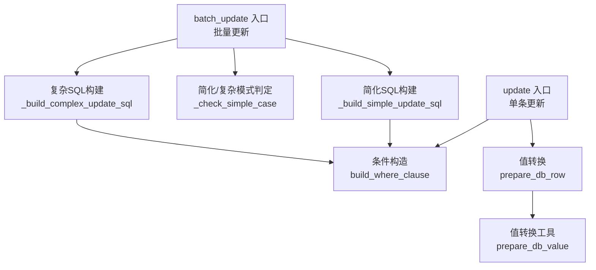
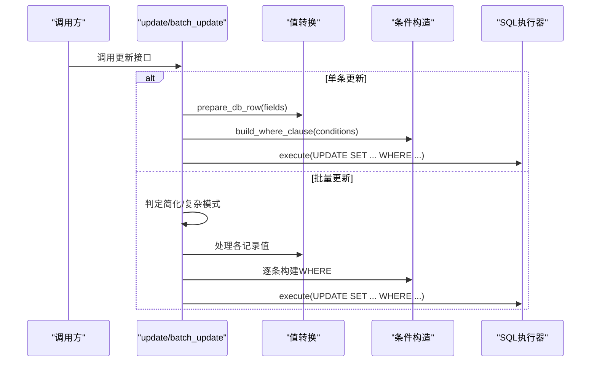
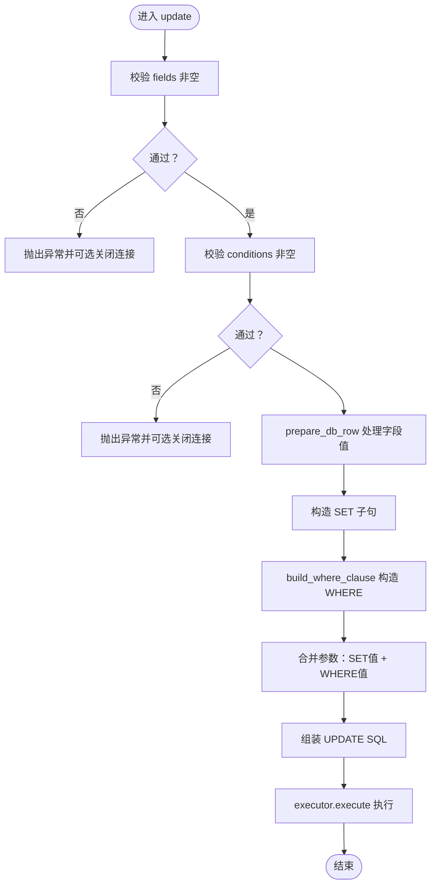
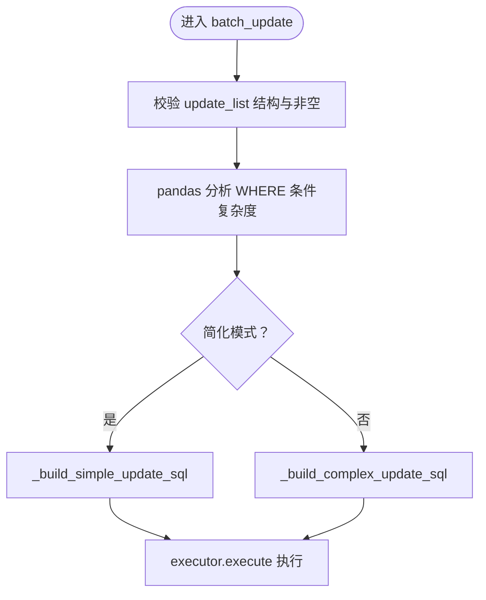
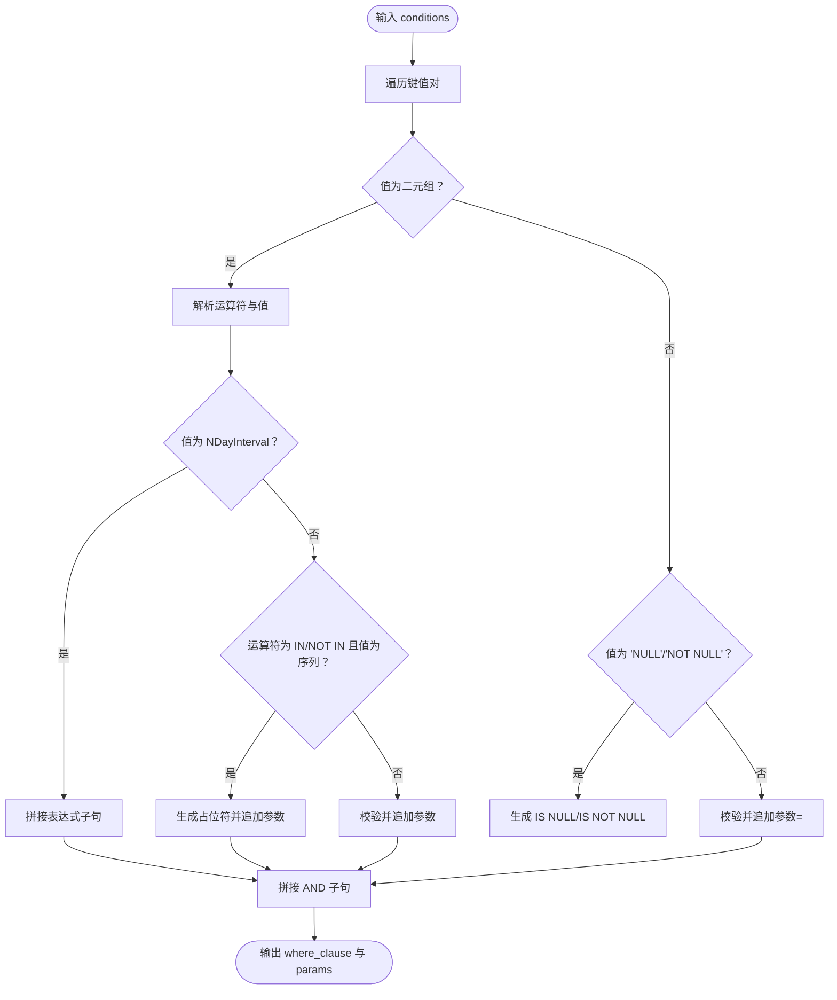
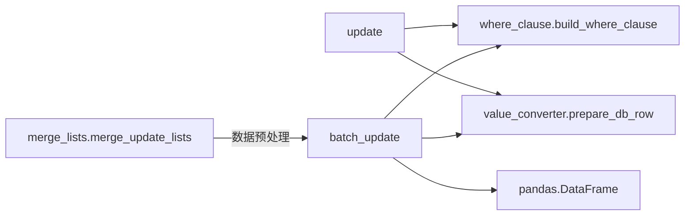

# UPDATE更新

<cite>
**本文引用的文件**   
- [lazy_mysql/utils/update/__init__.py](file://lazy_mysql/utils/update/__init__.py)
- [lazy_mysql/utils/update/update.py](file://lazy_mysql/utils/update/update.py)
- [lazy_mysql/utils/update/batch_update.py](file://lazy_mysql/utils/update/batch_update.py)
- [lazy_mysql/utils/update/merge_lists.py](file://lazy_mysql/utils/update/merge_lists.py)
- [lazy_mysql/tools/where_clause.py](file://lazy_mysql/tools/where_clause.py)
- [lazy_mysql/utils/value_converter.py](file://lazy_mysql/utils/value_converter.py)
- [lazy_mysql/tests/test_update_conversion.py](file://tests/test_update_conversion.py)
- [lazy_mysql/tests/test_batch_update.py](file://tests/test_batch_update.py)
- [README.md](file://README.md)
- [docs/CONDITIONS.md](file://docs/CONDITIONS.md)
</cite>

## 目录
1. [简介](#简介)
2. [项目结构](#项目结构)
3. [核心组件](#核心组件)
4. [架构总览](#架构总览)
5. [详细组件分析](#详细组件分析)
6. [依赖分析](#依赖分析)
7. [性能考量](#性能考量)
8. [故障排查指南](#故障排查指南)
9. [结论](#结论)
10. [附录](#附录)

## 简介
本章节面向“UPDATE更新”能力，系统阐述单条记录更新、批量更新、条件更新的实现方式与最佳实践；详解WHERE条件在更新中的使用（精确匹配、范围条件、复合条件等）；说明数据类型转换与验证机制如何保障更新数据的正确性与安全性；并结合参数化执行、索引使用、事务处理与批量策略给出性能建议。文末提供多场景示例路径，帮助快速落地。

## 项目结构
围绕UPDATE能力的关键模块如下：
- 单条更新入口：update
- 批量更新入口：batch_update
- 条件构造：build_where_clause
- 值转换与验证：prepare_db_row / prepare_db_value
- 列表合并：merge_update_lists
- 测试与示例：单元测试与README示例

图表来源
- [lazy_mysql/utils/update/update.py:1-44](file://lazy_mysql/utils/update/update.py#L1-L44)
- [lazy_mysql/utils/update/batch_update.py:1-313](file://lazy_mysql/utils/update/batch_update.py#L1-L313)
- [lazy_mysql/tools/where_clause.py:1-127](file://lazy_mysql/tools/where_clause.py#L1-L127)
- [lazy_mysql/utils/value_converter.py:1-115](file://lazy_mysql/utils/value_converter.py#L1-L115)

章节来源
- [lazy_mysql/utils/update/__init__.py:1-10](file://lazy_mysql/utils/update/__init__.py#L1-L10)
- [lazy_mysql/utils/update/update.py:1-44](file://lazy_mysql/utils/update/update.py#L1-L44)
- [lazy_mysql/utils/update/batch_update.py:1-313](file://lazy_mysql/utils/update/batch_update.py#L1-L313)
- [lazy_mysql/utils/update/merge_lists.py:1-91](file://lazy_mysql/utils/update/merge_lists.py#L1-L91)
- [lazy_mysql/tools/where_clause.py:1-127](file://lazy_mysql/tools/where_clause.py#L1-L127)
- [lazy_mysql/utils/value_converter.py:1-115](file://lazy_mysql/utils/value_converter.py#L1-L115)

## 核心组件
- 单条更新 update
  - 输入：executor、表名、fields（字段映射）、conditions（WHERE条件）、commit、self_close
  - 关键点：校验fields/conditions非空；统一值转换；构造SET/WHERE；参数合并；调用executor.execute
- 批量更新 batch_update
  - 输入：executor、表名、update_list（每项含fields与conditions）、commit、self_close
  - 关键点：格式校验；pandas分析条件复杂度；自动选择简化/复杂SQL策略；参数顺序严格控制
- 条件构造 build_where_clause
  - 输入：conditions（字典）
  - 支持：等值、运算符元组、NULL/NOT NULL、IN/NOT IN、NDayInterval表达式
- 值转换与验证 prepare_db_row / prepare_db_value
  - 支持：None/pd.NA/pd.NaT/NaN、numpy/pandas序列、dict/list/tuple、时间/日期/Decimal、bytes等
  - 校验：拒绝numpy类型（需显式转换），字典自动JSON序列化
- 列表合并 merge_update_lists
  - 功能：按conditions去重合并fields，支持冲突策略（error/skip/override）

章节来源
- [lazy_mysql/utils/update/update.py:4-44](file://lazy_mysql/utils/update/update.py#L4-L44)
- [lazy_mysql/utils/update/batch_update.py:6-81](file://lazy_mysql/utils/update/batch_update.py#L6-L81)
- [lazy_mysql/tools/where_clause.py:42-127](file://lazy_mysql/tools/where_clause.py#L42-L127)
- [lazy_mysql/utils/value_converter.py:74-115](file://lazy_mysql/utils/value_converter.py#L74-L115)
- [lazy_mysql/utils/update/merge_lists.py:21-91](file://lazy_mysql/utils/update/merge_lists.py#L21-L91)

## 架构总览
UPDATE执行链路分为两条主线：
- 单条更新：update → 值转换 → 条件构造 → 组装SQL → 执行
- 批量更新：batch_update → 条件复杂度判定 → 选择策略 → 构建CASE WHEN/IN → 条件构造 → 组装SQL → 执行

图表来源
- [lazy_mysql/utils/update/update.py:4-44](file://lazy_mysql/utils/update/update.py#L4-L44)
- [lazy_mysql/utils/update/batch_update.py:6-81](file://lazy_mysql/utils/update/batch_update.py#L6-L81)
- [lazy_mysql/tools/where_clause.py:42-127](file://lazy_mysql/tools/where_clause.py#L42-L127)
- [lazy_mysql/utils/value_converter.py:113-115](file://lazy_mysql/utils/value_converter.py#L113-L115)

## 详细组件分析

### 单条更新 update
- 设计要点
  - 强制校验fields与conditions非空，避免全表更新风险
  - 统一值转换，保证与插入/批量更新一致的类型处理策略
  - SET子句按fields字典键顺序拼接，参数按值顺序传递
  - WHERE子句通过build_where_clause生成，支持多种运算符与特殊值
- 错误处理
  - fields为空：抛出异常并可选关闭连接
  - conditions为空：抛出异常并可选关闭连接
- 性能与安全
  - 参数化执行，防止SQL注入
  - 建议为WHERE字段建立索引以加速匹配

图表来源
- [lazy_mysql/utils/update/update.py:16-44](file://lazy_mysql/utils/update/update.py#L16-L44)
- [lazy_mysql/utils/value_converter.py:113-115](file://lazy_mysql/utils/value_converter.py#L113-L115)
- [lazy_mysql/tools/where_clause.py:42-127](file://lazy_mysql/tools/where_clause.py#L42-L127)

章节来源
- [lazy_mysql/utils/update/update.py:4-44](file://lazy_mysql/utils/update/update.py#L4-L44)
- [lazy_mysql/tests/test_update_conversion.py:145-155](file://tests/test_update_conversion.py#L145-L155)

### 批量更新 batch_update
- 模式选择
  - 简化模式：所有记录的WHERE仅包含单一字段且为简单值（如id=1），使用CASE key WHEN语法，性能最优
  - 复杂模式：WHERE包含多字段或复杂条件（如范围、多条件组合），使用CASE WHEN ... THEN语法
- 参数顺序
  - 简化模式：SET子句参数（key_value, value对）在前，WHERE IN的key_values在后
  - 复杂模式：SET子句参数（where_params + value）在前，最终WHERE子句的where_params在后
- 安全与健壮性
  - 校验每条记录必须包含fields与conditions，且均非空
  - 条件构造失败时抛出异常
- 性能建议
  - 尽可能使用简化模式（单一主键条件）
  - 控制单次批量规模，避免长事务与锁竞争

图表来源
- [lazy_mysql/utils/update/batch_update.py:40-81](file://lazy_mysql/utils/update/batch_update.py#L40-L81)
- [lazy_mysql/utils/update/batch_update.py:232-264](file://lazy_mysql/utils/update/batch_update.py#L232-L264)
- [lazy_mysql/utils/update/batch_update.py:267-313](file://lazy_mysql/utils/update/batch_update.py#L267-L313)

章节来源
- [lazy_mysql/utils/update/batch_update.py:6-81](file://lazy_mysql/utils/update/batch_update.py#L6-L81)
- [lazy_mysql/tests/test_batch_update.py:14-84](file://tests/test_batch_update.py#L14-L84)
- [lazy_mysql/tests/test_batch_update.py:86-132](file://tests/test_batch_update.py#L86-L132)
- [lazy_mysql/tests/test_batch_update.py:134-156](file://tests/test_batch_update.py#L134-L156)

### 条件构造 build_where_clause
- 支持的条件格式
  - 等值：字段: 值（默认=）
  - 运算符元组：字段: (运算符, 值)，如 ('>', 18)、('LIKE', '%...%')、('IN', [...])
  - 特殊字符串：'NULL'/'NOT NULL'
  - NDayInterval：用于相对日期（如最近7天）
- 参数化与校验
  - 所有值通过_validate_param_value进行类型校验与转换
  - IN/NOT IN自动展开占位符并追加参数
- 复杂条件
  - 多个条件用AND连接
  - 单条记录内的多条件由元组内部的运算符决定（如AND）

图表来源
- [lazy_mysql/tools/where_clause.py:42-127](file://lazy_mysql/tools/where_clause.py#L42-L127)

章节来源
- [lazy_mysql/tools/where_clause.py:42-127](file://lazy_mysql/tools/where_clause.py#L42-L127)
- [docs/CONDITIONS.md:1-164](file://docs/CONDITIONS.md#L1-L164)

### 值转换与验证 prepare_db_row / prepare_db_value
- 能力概览
  - 缺失值标准化：None/pd.NA/pd.NaT/NaN统一为None
  - numpy/pandas序列：递归降维并尝试转为Python原生类型
  - 时间/日期/Decimal：转为ISO字符串或Python原生类型
  - 字典/列表/集合：JSON序列化为字符串
  - 字节类：解码为UTF-8字符串
- 安全约束
  - 拒绝numpy类型（需显式转换）
  - 字典类型自动JSON序列化，失败即报错
- 一致性
  - 与插入/批量更新共享转换规则，避免类型不一致导致的异常

章节来源
- [lazy_mysql/utils/value_converter.py:74-115](file://lazy_mysql/utils/value_converter.py#L74-L115)
- [lazy_mysql/tests/test_update_conversion.py:27-51](file://tests/test_update_conversion.py#L27-L51)
- [lazy_mysql/tests/test_update_conversion.py:53-100](file://tests/test_update_conversion.py#L53-L100)
- [lazy_mysql/tests/test_update_conversion.py:102-143](file://tests/test_update_conversion.py#L102-L143)

### 列表合并 merge_update_lists
- 场景
  - 将多个update_list按conditions去重，合并fields
  - 处理字段冲突（error/skip/override）
- 关键点
  - conditions深拷贝，避免外部副作用
  - 条件键通过可哈希元组比较，支持嵌套结构

章节来源
- [lazy_mysql/utils/update/merge_lists.py:21-91](file://lazy_mysql/utils/update/merge_lists.py#L21-L91)

## 依赖分析
- 组件耦合
  - update依赖value_converter与where_clause
  - batch_update依赖value_converter、where_clause与pandas
  - merge_lists独立，服务于批量场景的预处理
- 外部依赖
  - pandas用于批量分析与DataFrame转换
  - mysql-connector-python通过executor执行SQL（由上层库提供）

图表来源
- [lazy_mysql/utils/update/update.py:1-2](file://lazy_mysql/utils/update/update.py#L1-L2)
- [lazy_mysql/utils/update/batch_update.py:1-3](file://lazy_mysql/utils/update/batch_update.py#L1-L3)
- [lazy_mysql/utils/update/merge_lists.py:1](file://lazy_mysql/utils/update/merge_lists.py#L1)

章节来源
- [lazy_mysql/utils/update/update.py:1-44](file://lazy_mysql/utils/update/update.py#L1-L44)
- [lazy_mysql/utils/update/batch_update.py:1-313](file://lazy_mysql/utils/update/batch_update.py#L1-L313)
- [lazy_mysql/utils/update/merge_lists.py:1-91](file://lazy_mysql/utils/update/merge_lists.py#L1-L91)

## 性能考量
- 索引使用
  - WHERE条件涉及的字段建议建立索引，尤其是批量更新的主键字段
- 事务与批处理
  - 使用commit参数控制事务粒度，避免长事务造成锁等待
  - 批量更新时合理分批，降低单次锁持有时间
- SQL策略
  - 尽可能使用简化模式（单一主键条件）以获得更优的CASE WHEN性能
  - 复杂模式下注意CASE WHEN分支数量与参数顺序，避免WHERE过长
- 类型转换成本
  - 大批量JSON序列化/反序列化会增加CPU开销，尽量减少不必要的字典/数组字段更新

## 故障排查指南
- 常见错误与定位
  - fields为空：检查调用处是否遗漏字段映射
  - conditions为空：确认WHERE条件是否传入，避免全表更新
  - numpy类型：将numpy标量/数组转换为Python原生类型后再传入
  - 字典无法JSON化：检查字典内嵌对象是否可序列化
- 参数顺序问题
  - 复杂批量更新的参数顺序为：SET子句参数（where_params + value）在前，WHERE子句参数在后
  - 简化批量更新的参数顺序为：SET子句参数在前，WHERE IN的key_values在后
- 单元测试参考
  - 单条更新值转换与参数顺序验证
  - 批量更新参数顺序与模式判定验证
  - 空fields/conditions的异常处理

章节来源
- [lazy_mysql/tests/test_update_conversion.py:145-155](file://tests/test_update_conversion.py#L145-L155)
- [lazy_mysql/tests/test_update_conversion.py:157-173](file://tests/test_update_conversion.py#L157-L173)
- [lazy_mysql/tests/test_batch_update.py:14-84](file://tests/test_batch_update.py#L14-L84)
- [lazy_mysql/tests/test_batch_update.py:86-132](file://tests/test_batch_update.py#L86-L132)
- [lazy_mysql/tests/test_batch_update.py:134-156](file://tests/test_batch_update.py#L134-L156)

## 结论
UPDATE模块通过统一的值转换、严谨的条件构造与灵活的批量策略，提供了安全、高效、易用的更新能力。遵循本文的条件设计、类型转换与性能建议，可在保证数据正确性的前提下显著提升更新效率。

## 附录

### 示例路径（按场景）
- 单条记录更新（精确条件）
  - 示例路径：[README.md:120-127](file://README.md#L120-L127)
- 单条记录更新（范围/复合条件）
  - 示例路径：[README.md:118-131](file://README.md#L118-L131)
- 批量更新（简化模式：单一主键条件）
  - 示例路径：[lazy_mysql/utils/update/batch_update.py:25-38](file://lazy_mysql/utils/update/batch_update.py#L25-L38)
- 批量更新（复杂模式：多字段/范围条件）
  - 示例路径：[lazy_mysql/utils/update/batch_update.py:33-38](file://lazy_mysql/utils/update/batch_update.py#L33-L38)
- 条件构造（运算符/IN/NULL）
  - 示例路径：[docs/CONDITIONS.md:21-52](file://docs/CONDITIONS.md#L21-L52)
  - 示例路径：[docs/CONDITIONS.md:129-146](file://docs/CONDITIONS.md#L129-L146)
- 值转换（字典/时间戳/缺失值）
  - 示例路径：[lazy_mysql/tests/test_update_conversion.py:27-51](file://tests/test_update_conversion.py#L27-L51)
  - 示例路径：[lazy_mysql/tests/test_update_conversion.py:53-100](file://tests/test_update_conversion.py#L53-L100)
  - 示例路径：[lazy_mysql/tests/test_update_conversion.py:102-143](file://tests/test_update_conversion.py#L102-L143)