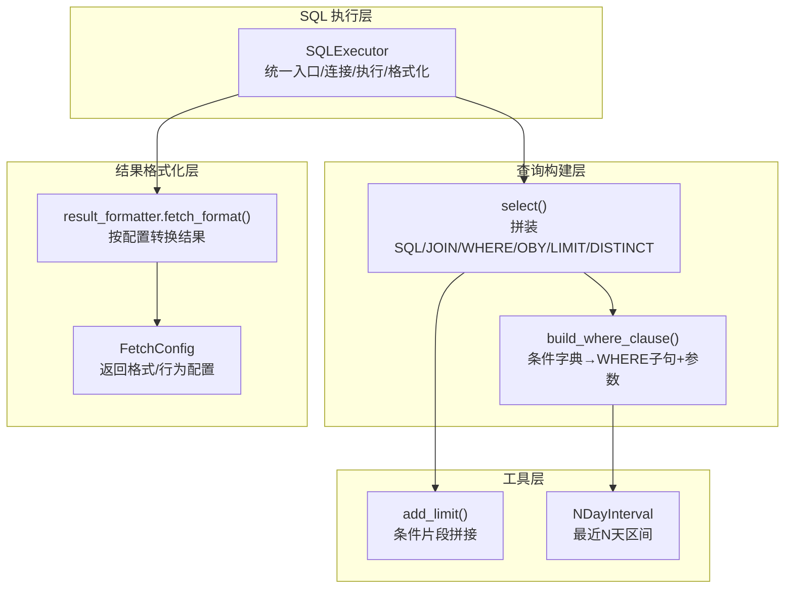
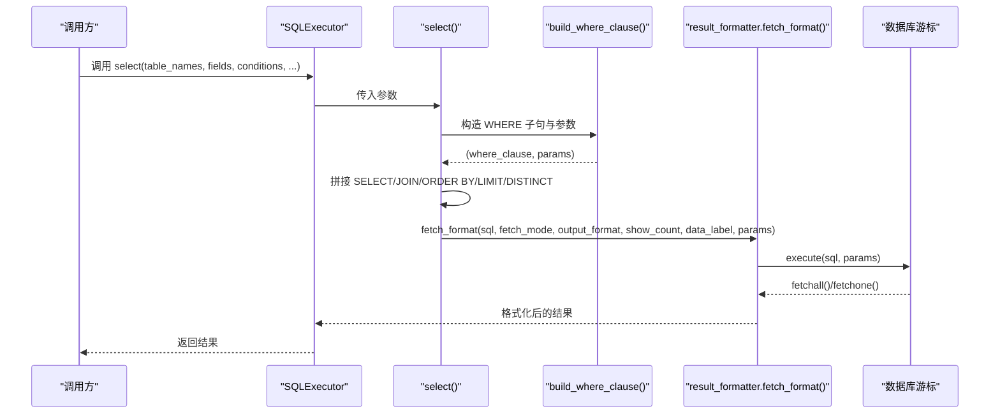
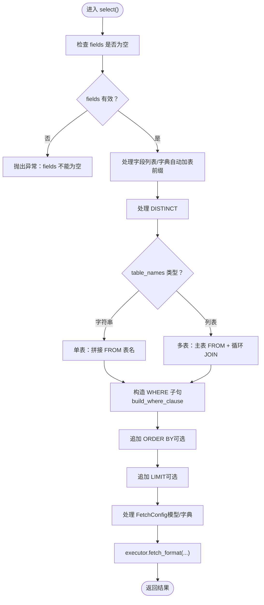
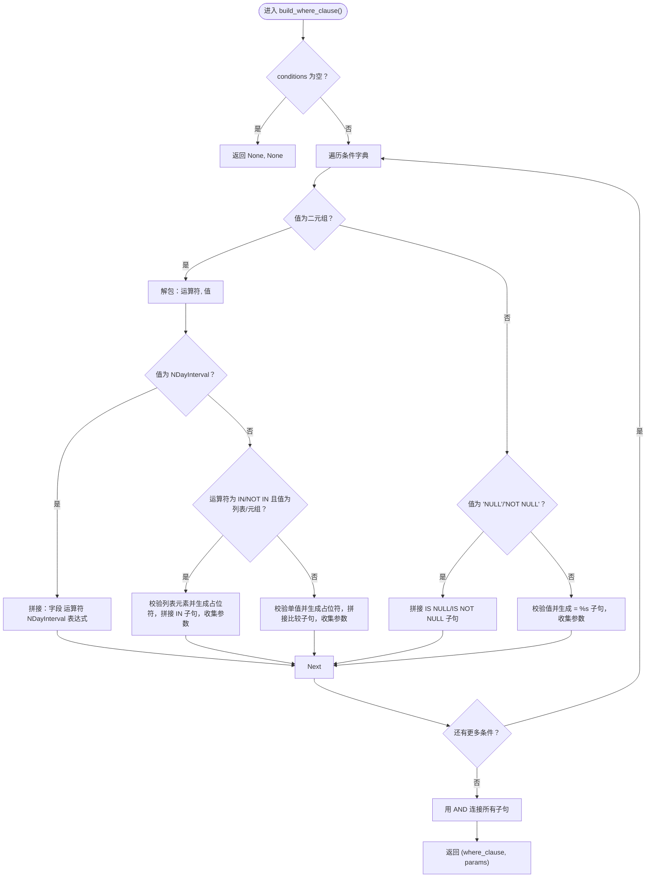
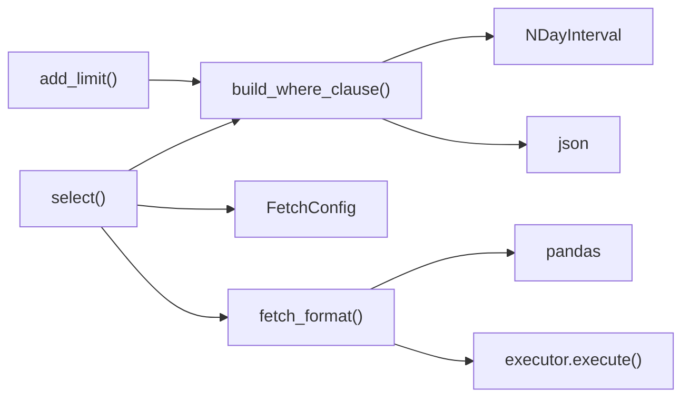

# 基础操作

<cite>
**本文引用的文件**
- [select.py](file://lazy_mysql/utils/select.py)
- [where_clause.py](file://lazy_mysql/tools/where_clause.py)
- [sql_utils.py](file://lazy_mysql/tools/sql_utils.py)
- [fetch_config.py](file://lazy_mysql/dataclasses/fetch_config.py)
- [result_formatter.py](file://lazy_mysql/tools/result_formatter.py)
- [executor.py](file://lazy_mysql/executor.py)
- [SELECT.md](file://docs/SELECT.md)
- [CONDITIONS.md](file://docs/CONDITIONS.md)
- [FETCH_CONFIG.md](file://docs/FETCH_CONFIG.md)
</cite>

## 目录
1. [简介](#简介)
2. [项目结构](#项目结构)
3. [核心组件](#核心组件)
4. [架构总览](#架构总览)
5. [详细组件分析](#详细组件分析)
6. [依赖分析](#依赖分析)
7. [性能考虑](#性能考虑)
8. [故障排查指南](#故障排查指南)
9. [结论](#结论)
10. [附录](#附录)

## 简介
本指南聚焦“基础数据库操作”中的 SELECT 查询能力，系统讲解：
- 智能查询构建器的使用：自动拼接 WHERE、JOIN、ORDER BY、LIMIT、DISTINCT 等子句
- 复杂条件查询：等值、比较、IN、BETWEEN、LIKE、空值判断、最近N天区间
- 多表关联：支持 INNER/LEFT/RIGHT/FULL JOIN
- 排序与限制：order_by、limit 的灵活使用
- 自定义 SQL 查询：query() 手写 SQL 的执行与参数传递
- FetchConfig 配置：fetch_mode、output_format、data_label、show_count 的作用与用法
- 丰富的查询场景示例与最佳实践

## 项目结构
围绕 SELECT 查询的关键模块与职责：
- SQL 执行器：SQLExecutor 提供统一入口，封装连接、执行、结果格式化、错误处理与重连机制
- 查询构建器：select() 负责拼装 SQL（含 WHERE、JOIN、ORDER BY、LIMIT、DISTINCT）
- 条件构造器：build_where_clause() 将 conditions 字典转换为 WHERE 子句与参数列表
- 结果格式化：result_formatter.fetch_format() 将游标结果按 fetch_mode/output_format/data_label/show_count 转换
- 配置模型：FetchConfig 定义返回格式与行为的强类型配置
- 工具函数：add_limit() 用于辅助拼接条件片段；NDayInterval 用于最近N天区间



图表来源
- [executor.py:14-616](file://lazy_mysql/executor.py#L14-L616)
- [select.py:1-237](file://lazy_mysql/utils/select.py#L1-L237)
- [where_clause.py:1-127](file://lazy_mysql/tools/where_clause.py#L1-L127)
- [result_formatter.py:1-77](file://lazy_mysql/tools/result_formatter.py#L1-L77)
- [fetch_config.py:1-24](file://lazy_mysql/dataclasses/fetch_config.py#L1-L24)
- [sql_utils.py:1-53](file://lazy_mysql/tools/sql_utils.py#L1-L53)

章节来源
- [executor.py:14-616](file://lazy_mysql/executor.py#L14-L616)
- [select.py:1-237](file://lazy_mysql/utils/select.py#L1-L237)
- [where_clause.py:1-127](file://lazy_mysql/tools/where_clause.py#L1-L127)
- [result_formatter.py:1-77](file://lazy_mysql/tools/result_formatter.py#L1-L77)
- [fetch_config.py:1-24](file://lazy_mysql/dataclasses/fetch_config.py#L1-L24)
- [sql_utils.py:1-53](file://lazy_mysql/tools/sql_utils.py#L1-L53)

## 核心组件
- SQLExecutor：负责连接、执行 SQL、错误重连、提交/关闭、以及调用 fetch_format 进行结果格式化
- select()：ORM 风格的 SELECT 构建器，支持多表 JOIN、WHERE 条件、排序、限制、去重
- build_where_clause()：将 conditions 字典转换为 WHERE 子句与参数列表，支持多种运算符与特殊值
- result_formatter.fetch_format()：根据 fetch_mode/output_format/data_label/show_count 转换最终结果
- FetchConfig：强类型配置模型，替代旧版字典配置，提供类型安全与默认值
- add_limit()：辅助拼接条件片段，支持多种运算符与 IN/NOT IN
- NDayInterval：最近 N 天区间表达式，用于 WHERE 条件

章节来源
- [executor.py:14-616](file://lazy_mysql/executor.py#L14-L616)
- [select.py:1-237](file://lazy_mysql/utils/select.py#L1-L237)
- [where_clause.py:1-127](file://lazy_mysql/tools/where_clause.py#L1-L127)
- [result_formatter.py:1-77](file://lazy_mysql/tools/result_formatter.py#L1-L77)
- [fetch_config.py:1-24](file://lazy_mysql/dataclasses/fetch_config.py#L1-L24)
- [sql_utils.py:1-53](file://lazy_mysql/tools/sql_utils.py#L1-L53)

## 架构总览
下图展示了从调用 select() 到返回结果的端到端流程，包括 WHERE 条件构造、JOIN 拼接、排序限制、以及结果格式化。



图表来源
- [executor.py:324-386](file://lazy_mysql/executor.py#L324-L386)
- [select.py:4-156](file://lazy_mysql/utils/select.py#L4-L156)
- [where_clause.py:42-127](file://lazy_mysql/tools/where_clause.py#L42-L127)
- [result_formatter.py:3-77](file://lazy_mysql/tools/result_formatter.py#L3-L77)

## 详细组件分析

### 查询构建器 select()
- 功能要点
  - 支持单表与多表 JOIN（默认基于主表.item_id 与子表.item_id 关联，也可自定义字段）
  - 自动处理 DISTINCT、ORDER BY、LIMIT
  - 自动为字段字典添加表前缀
  - 支持 NDayInterval 最近 N 天区间
  - 支持 FetchConfig 模型与旧版字典配置
- 关键流程
  - 解析 fields：若为字典，自动加表前缀
  - 拼接 SELECT/DISTINCT 子句
  - 多表时循环追加 JOIN 子句
  - 构造 WHERE 子句（build_where_clause）
  - 追加 ORDER BY/LIMIT
  - 调用 executor.fetch_format 执行并格式化



图表来源
- [select.py:4-156](file://lazy_mysql/utils/select.py#L4-L156)

章节来源
- [select.py:1-237](file://lazy_mysql/utils/select.py#L1-L237)

### WHERE 条件构造器 build_where_clause()
- 支持的条件格式
  - 简单值：默认等值比较
  - 元组：(运算符, 值)，支持 =、!=、<>、>、>=、<、<=、LIKE、NOT LIKE、IN、NOT IN
  - 特殊字符串：'NULL'/'NOT NULL'
  - NDayInterval：最近 N 天区间表达式
- 参数校验与安全
  - 拒绝 numpy 类型参数
  - 字典类型自动 JSON 序列化
  - IN/NOT IN 列表逐项校验
- 返回值
  - where_clause：WHERE 子句（不含 WHERE 关键字），条件间用 AND 连接
  - params：对应参数列表，用于防止 SQL 注入



图表来源
- [where_clause.py:42-127](file://lazy_mysql/tools/where_clause.py#L42-L127)

章节来源
- [where_clause.py:1-127](file://lazy_mysql/tools/where_clause.py#L1-L127)

### 结果格式化 result_formatter.fetch_format()
- 支持的返回模式
  - all：返回元组列表/扁平列表/DataFrame/字典列表
  - oneTuple：返回单条元组或字典（需 data_label）
  - one：返回单个值（第一个字段）
- 输出格式
  - ""：原始元组/元组
  - list_1：提取每行首字段的扁平列表（仅 all）
  - df：pandas DataFrame（需 data_label）
  - df_dict：DataFrame 转字典列表（需 data_label）
  - dict：oneTuple 且 data_label 非空时返回字典
- 计数与关闭
  - show_count=True 时返回 (数据, 数量)
  - self_close=True 时自动关闭连接

```mermaid
flowchart TD
Start(["进入 fetch_format()"]) --> Validate["校验 output_format 与 data_label"]
Validate --> Exec["执行 SQL 并获取游标"]
Exec --> Mode{"fetch_mode？"}
Mode -- all --> AllPath["fetchall()"]
AllPath --> OFmt{"output_format？"}
OFmt -- "" --> RetAll["返回元组列表"]
OFmt -- "list_1" --> RetList1["提取首字段，返回扁平列表"]
OFmt -- "df" --> RetDF["DataFrame(columns=data_label)"]
OFmt -- "df_dict" --> RetDFDict["DataFrame→to_dict('records')"]
Mode -- oneTuple --> OneT["fetchone()"]
OneT --> DictFmt{"output_format==dict 且 data_label 有效？"}
DictFmt -- 是 --> RetDict["zip(data_label, row) → dict"]
DictFmt -- 否 --> RetOneT["返回元组"]
Mode -- one --> OneV["fetchone() 并取首个字段"]
OneV --> RetOne["返回单值"]
RetAll --> Count{"show_count？"}
RetList1 --> Count
RetDF --> Count
RetDFDict --> Count
RetDict --> Count
RetOneT --> Count
RetOne --> Count
Count -- 是 --> RetTuple["返回 (结果, 数量)"]
Count -- 否 --> RetRes["返回结果"]
```

图表来源
- [result_formatter.py:3-77](file://lazy_mysql/tools/result_formatter.py#L3-L77)

章节来源
- [result_formatter.py:1-77](file://lazy_mysql/tools/result_formatter.py#L1-L77)

### FetchConfig 配置详解
- 字段说明
  - fetch_mode：all/oneTuple/one
  - output_format：""/list_1/df/df_dict/dict（部分模式受 fetch_mode 限制）
  - data_label：DataFrame 列名或字典键名，为 None 时可自动生成
  - show_count：是否返回 (数据, 数量)
- 使用方式
  - 推荐使用 FetchConfig 模型实例
  - 兼容旧版字典配置（自动转换）

章节来源
- [fetch_config.py:1-24](file://lazy_mysql/dataclasses/fetch_config.py#L1-L24)
- [FETCH_CONFIG.md:1-223](file://docs/FETCH_CONFIG.md#L1-L223)

### 自定义 SQL 查询 query()
- 适用场景：复杂 SELECT（子查询、UNION、窗口函数）、非 ORM 场景
- 参数与返回：与 select() 类似的 fetch_config 控制，但由调用方手写 SQL
- 注意：SELECT 不支持批量执行（会触发异常提示）

章节来源
- [executor.py:515-590](file://lazy_mysql/executor.py#L515-L590)
- [docs/SELECT.md:157-159](file://docs/SELECT.md#L157-L159)

### 快速存在性检查 exists()
- 优化点：使用 SELECT 1 ... LIMIT 1，命中即停，避免全表扫描
- 适合：仅需判断是否存在，无需具体数据的场景

章节来源
- [select.py:159-237](file://lazy_mysql/utils/select.py#L159-L237)
- [docs/SELECT.md:161-266](file://docs/SELECT.md#L161-L266)

## 依赖分析
- select() 依赖
  - where_clause.build_where_clause：WHERE 条件构造
  - dataclasses.FetchConfig：配置模型
  - executor.fetch_format：结果格式化
- result_formatter.fetch_format() 依赖
  - pandas：DataFrame 输出
  - executor.execute：执行 SQL
- where_clause.build_where_clause() 依赖
  - NDayInterval：最近 N 天区间
  - json：字典序列化
- sql_utils.add_limit() 依赖
  - 字符串/数值处理，支持 IN/NOT IN



图表来源
- [select.py:1-2](file://lazy_mysql/utils/select.py#L1-L2)
- [where_clause.py:1-1](file://lazy_mysql/tools/where_clause.py#L1-L1)
- [result_formatter.py](file://lazy_mysql/tools/result_formatter.py#L1)
- [sql_utils.py:1-53](file://lazy_mysql/tools/sql_utils.py#L1-L53)

章节来源
- [select.py:1-237](file://lazy_mysql/utils/select.py#L1-L237)
- [where_clause.py:1-127](file://lazy_mysql/tools/where_clause.py#L1-L127)
- [result_formatter.py:1-77](file://lazy_mysql/tools/result_formatter.py#L1-L77)
- [sql_utils.py:1-53](file://lazy_mysql/tools/sql_utils.py#L1-L53)

## 性能考虑
- 字段选择：尽量只查询必要字段，避免 SELECT *
- WHERE 条件：在过滤阶段尽早缩小数据集，避免应用层二次过滤
- 索引利用：确保 WHERE/JOIN 字段建立合适索引
- JOIN 顺序：小表驱动大表，减少笛卡尔积
- EXISTS 优化：存在性判断使用 exists()，避免全量数据传输
- 分页：结合 ORDER BY 与 LIMIT 实现分页，避免 OFFSET 过大导致慢查询

章节来源
- [docs/SELECT.md:562-610](file://docs/SELECT.md#L562-L610)

## 故障排查指南
- 字段重复：多表同名列需使用表前缀区分
- 空结果：合理处理空结果，避免后续索引越界
- 错误处理：SQLExecutor 内置连接丢失/超时重连与回滚逻辑
- 参数安全：所有值均经参数化绑定，避免 SQL 注入
- numpy 类型：不支持 numpy 类型，请先转换为 Python 原生类型
- 字典类型：字典会被自动 JSON 序列化，确保可序列化

章节来源
- [docs/SELECT.md:611-640](file://docs/SELECT.md#L611-L640)
- [where_clause.py:17-39](file://lazy_mysql/tools/where_clause.py#L17-L39)
- [executor.py:62-107](file://lazy_mysql/executor.py#L62-L107)

## 结论
本指南系统阐述了 lazy_mysql 的 SELECT 查询能力，涵盖智能构建器、复杂条件、多表关联、排序限制、自定义 SQL、以及结果格式化与配置。通过 FetchConfig 与 result_formatter，开发者可以灵活控制返回格式与行为；通过 exists() 与 WHERE 条件构造器，既能保证易用性又能兼顾性能与安全性。

## 附录

### 常用查询场景与示例路径
- 单表查询与字段别名
  - 示例路径：[docs/SELECT.md:120-155](file://docs/SELECT.md#L120-L155)
- 多表 JOIN 与条件组合
  - 示例路径：[docs/SELECT.md:372-410](file://docs/SELECT.md#L372-L410)
- 排序与限制
  - 示例路径：[docs/SELECT.md:304-370](file://docs/SELECT.md#L304-L370)
- WHERE 条件语法与示例
  - 文档：[docs/CONDITIONS.md:1-164](file://docs/CONDITIONS.md#L1-L164)
- FetchConfig 配置与返回值示例
  - 文档：[docs/FETCH_CONFIG.md:1-223](file://docs/FETCH_CONFIG.md#L1-L223)

### API 与参数速查
- select(executor, table_names, fields, conditions=None, order_by=None, limit=None, distinct=False, join_conditions=None, self_close=False, fetch_config=None)
- query(sql, params=None, fetch_config=None, self_close=False)
- exists(executor, table_names, conditions=None, join_conditions=None, self_close=False) -> bool
- add_limit(column, value, column_alias="", add_and=True, operator="=")

章节来源
- [docs/SELECT.md:19-118](file://docs/SELECT.md#L19-L118)
- [executor.py:324-421](file://lazy_mysql/executor.py#L324-L421)
- [sql_utils.py:9-53](file://lazy_mysql/tools/sql_utils.py#L9-L53)