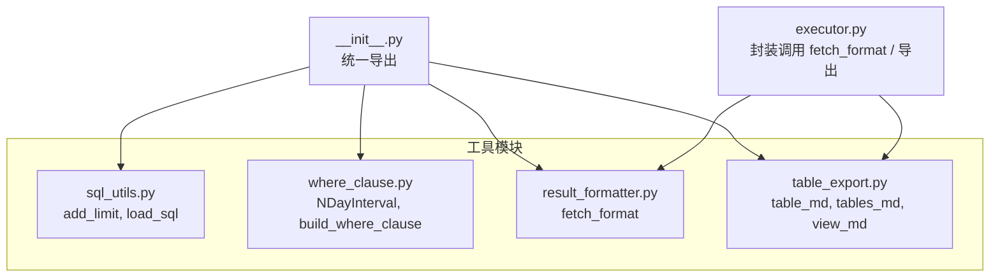
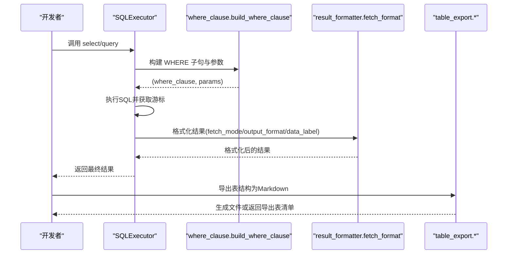
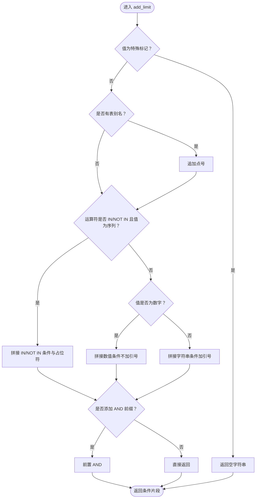
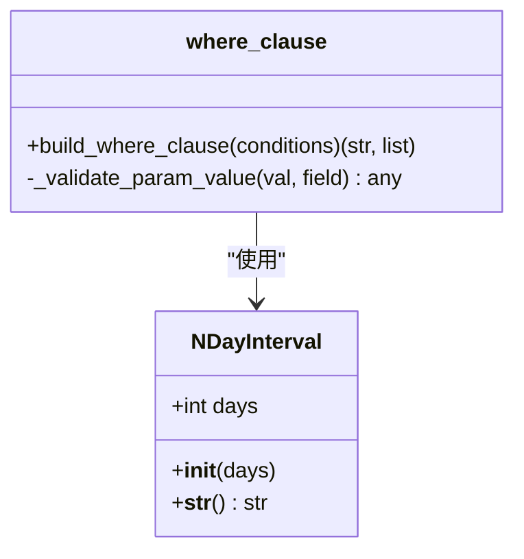
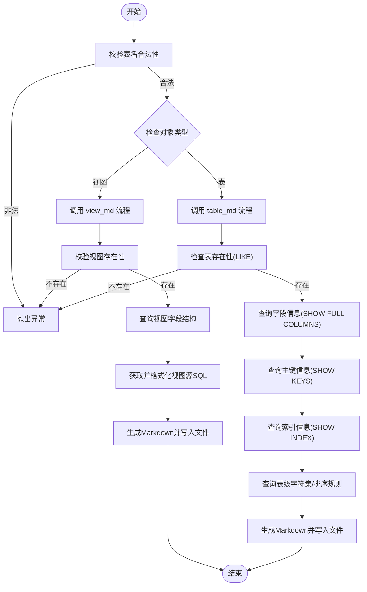
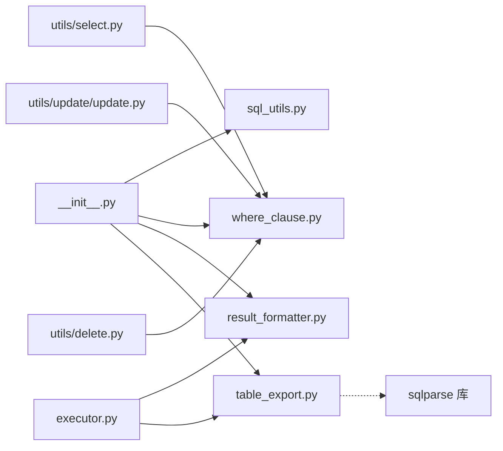

# 工具函数

<cite>
**本文引用的文件**
- [lazy_mysql/tools/__init__.py](file://lazy_mysql/tools/__init__.py)
- [lazy_mysql/tools/sql_utils.py](file://lazy_mysql/tools/sql_utils.py)
- [lazy_mysql/tools/where_clause.py](file://lazy_mysql/tools/where_clause.py)
- [lazy_mysql/tools/result_formatter.py](file://lazy_mysql/tools/result_formatter.py)
- [lazy_mysql/tools/table_export.py](file://lazy_mysql/tools/table_export.py)
- [lazy_mysql/__init__.py](file://lazy_mysql/__init__.py)
- [lazy_mysql/executor.py](file://lazy_mysql/executor.py)
- [docs/SQL_UTILS.md](file://docs/SQL_UTILS.md)
- [docs/CONDITIONS.md](file://docs/CONDITIONS.md)
- [docs/FETCH_CONFIG.md](file://docs/FETCH_CONFIG.md)
- [docs/SELECT.md](file://docs/SELECT.md)
- [README.md](file://README.md)
</cite>

## 目录
1. [简介](#简介)
2. [项目结构](#项目结构)
3. [核心组件](#核心组件)
4. [架构总览](#架构总览)
5. [详细组件分析](#详细组件分析)
6. [依赖关系分析](#依赖关系分析)
7. [性能考量](#性能考量)
8. [故障排查指南](#故障排查指南)
9. [结论](#结论)
10. [附录](#附录)

## 简介
本章节面向使用 lazy_mysql 的开发者，系统性介绍工具函数与辅助能力，重点覆盖：
- SQL 工具函数集合：add_limit 条件构建、字符串拼接、运算符支持、SQL 文件加载
- 结果格式化：支持 DataFrame、字典、列表等多种输出格式的转换与配置
- 表结构导出：一键导出 Markdown 格式的数据库文档，**新增视图支持**
- where_clause 工具：条件字典到 WHERE 子句与参数的安全转换
- 设计原则与扩展机制：可维护性、安全性、易用性与可扩展性

## 项目结构
lazy_mysql 的工具模块位于 lazy_mysql/tools 下，提供独立的工具函数与类，便于在查询、更新、删除、导出等场景复用。核心入口在 lazy_mysql/__init__.py 中统一导出，便于外部按需导入。



图表来源
- [lazy_mysql/tools/__init__.py:1-5](file://lazy_mysql/tools/__init__.py#L1-L5)
- [lazy_mysql/__init__.py:4-20](file://lazy_mysql/__init__.py#L4-L20)
- [lazy_mysql/executor.py:187-211](file://lazy_mysql/executor.py#L187-L211)

章节来源
- [lazy_mysql/tools/__init__.py:1-5](file://lazy_mysql/tools/__init__.py#L1-L5)
- [lazy_mysql/__init__.py:4-20](file://lazy_mysql/__init__.py#L4-L20)

## 核心组件
- add_limit：构建单个条件片段，支持多种运算符、表别名、AND 前缀控制与特殊值短路，**现已支持参数化查询**
- load_sql：从文件读取 SQL 文本，支持 UTF-8 编码与空白裁剪
- build_where_clause：将条件字典转换为 WHERE 子句与参数列表，支持 IN/NOT IN、NULL/NOT NULL、NDayInterval 表达式
- NDayInterval：日期区间表达式，用于"最近 N 天"等场景
- fetch_format：统一的结果格式化入口，支持 all/oneTuple/one 模式与 list_1、df、df_dict、dict 输出
- table_md / tables_md / view_md：导出单表、视图或多表结构为 Markdown 文档，包含字段、索引、字符集等信息，**新增视图支持**

章节来源
- [lazy_mysql/tools/sql_utils.py:10-53](file://lazy_mysql/tools/sql_utils.py#L10-L53)
- [lazy_mysql/tools/where_clause.py:42-127](file://lazy_mysql/tools/where_clause.py#L42-L127)
- [lazy_mysql/tools/result_formatter.py:3-77](file://lazy_mysql/tools/result_formatter.py#L3-L77)
- [lazy_mysql/tools/table_export.py:12-316](file://lazy_mysql/tools/table_export.py#L12-L316)

## 架构总览
工具函数围绕"条件构建—参数化—结果格式化—文档导出"的链路组织，既可独立使用，也可与 SQLExecutor 的 select/query 方法协同工作。



图表来源
- [lazy_mysql/executor.py:187-211](file://lazy_mysql/executor.py#L187-L211)
- [lazy_mysql/tools/where_clause.py:42-127](file://lazy_mysql/tools/where_clause.py#L42-L127)
- [lazy_mysql/tools/result_formatter.py:3-77](file://lazy_mysql/tools/result_formatter.py#L3-L77)
- [lazy_mysql/tools/table_export.py:12-316](file://lazy_mysql/tools/table_export.py#L12-L316)

## 详细组件分析

### add_limit：条件片段构建与字符串拼接
- 功能要点
  - 支持运算符：=、!=、<>、>、>=、<、<=、LIKE、NOT LIKE、IN、NOT IN
  - 支持表别名 column_alias
  - add_and 控制是否添加 AND 前缀
  - 特殊值短路：空字符串、"all"、"null"、None、空列表/元组均返回空字符串
  - IN/NOT IN 的列表/元组值自动拼接占位符与值
  - 数字类型不加引号，字符串类型自动加引号
  - **新增**：返回 `(sql_fragment, params)` 元组，支持参数化查询
- 使用场景
  - 与 SQL 拼接器组合，快速拼接 WHERE 片段
  - 作为 select/query 的补充条件片段
- 设计原则
  - 安全：字符串值自动加引号；IN/NOT IN 使用占位符
  - 简洁：默认 AND 前缀，减少手工拼接
  - 可读：支持 LIKE/NOT LIKE、IN/NOT IN 等常见运算符
  - **新增**：参数化查询支持，防止 SQL 注入
- 扩展机制
  - 可在上层封装为更高级的条件构建器
  - 可与模板引擎结合，实现动态 SQL 片段拼装



图表来源
- [lazy_mysql/tools/sql_utils.py:10-53](file://lazy_mysql/tools/sql_utils.py#L10-L53)

章节来源
- [lazy_mysql/tools/sql_utils.py:10-53](file://lazy_mysql/tools/sql_utils.py#L10-L53)
- [docs/SQL_UTILS.md:43-170](file://docs/SQL_UTILS.md#L43-L170)

### where_clause：条件字典到 WHERE 子句与参数
- 核心能力
  - build_where_clause：将条件字典转换为 WHERE 子句与参数列表
  - 支持简单值（默认 =）、元组格式（运算符, 值）、字符串 'NULL'/'NOT NULL'
  - IN/NOT IN 自动展开为多个占位符并收集参数
  - NDayInterval 自动拼接 SQL 表达式（如 DATE_SUB(NOW(), INTERVAL N DAY)）
  - 类型校验：禁止 numpy 类型；字典类型自动 JSON 序列化
- 错误处理
  - 元组格式长度非 2 抛出 ValueError
  - numpy 类型抛出 TypeError
  - Dict 类型 JSON 序列化失败抛出 TypeError
- 设计原则
  - 安全：所有值通过参数化查询传递，避免注入
  - 灵活：支持复杂运算符与表达式
  - 易用：支持字符串简写（NULL/NOT NULL）
- 扩展机制
  - 可新增更多表达式类型（如时间范围、正则匹配等）
  - 可扩展运算符集合



图表来源
- [lazy_mysql/tools/where_clause.py:3-15](file://lazy_mysql/tools/where_clause.py#L3-L15)
- [lazy_mysql/tools/where_clause.py:42-127](file://lazy_mysql/tools/where_clause.py#L42-L127)

章节来源
- [lazy_mysql/tools/where_clause.py:42-127](file://lazy_mysql/tools/where_clause.py#L42-L127)
- [docs/CONDITIONS.md:1-164](file://docs/CONDITIONS.md#L1-L164)

### 结果格式化：fetch_format 与 SQLExecutor 集成
- 功能要点
  - 支持三种 fetch_mode：all、oneTuple、one
  - 支持四种 output_format：
    - ""（默认）：原始元组/元组列表
    - "list_1"：提取每行第一个字段的扁平列表（仅 all）
    - "df"：pandas DataFrame（仅 all）
    - "df_dict"：DataFrame 转字典列表（仅 all）
    - "dict"：oneTuple 时 data_label 非空返回字典
  - show_count：在 all 模式下返回 (数据, 数量)
  - data_label：DataFrame 列名或字典键名，缺失时抛错
- 设计原则
  - 一致性：与 SQLExecutor 的 select/query 配置保持一致
  - 安全：仅在 all/oneTuple 模式下支持 DataFrame/字典
  - 可观测：show_count 提供结果规模信息
- 扩展机制
  - 可增加新的 output_format（如 JSON、CSV）
  - 可扩展 data_label 的自动生成策略

```mermaid
sequenceDiagram
participant Exec as "SQLExecutor"
participant RF as "result_formatter.fetch_format"
participant DF as "pandas.DataFrame"
Exec->>RF : 调用 fetch_format(sql, fetch_mode, output_format, data_label, ...)
RF->>RF : 根据 fetch_mode 获取结果
alt fetch_mode == "all"
RF->>RF : 根据 output_format 转换
opt output_format == "df"
RF->>DF : 构造DataFrame(列名为data_label)
opt output_format == "df_dict"
RF->>RF : to_dict(orient="records")
end
else fetch_mode == "oneTuple"
opt output_format == "dict" 且 data_label 非空
RF->>RF : zip(data_label, row) -> dict
end
else fetch_mode == "one"
RF->>RF : 取第一个字段值或返回 None
end
RF-->>Exec : 返回格式化结果
```

图表来源
- [lazy_mysql/tools/result_formatter.py:3-77](file://lazy_mysql/tools/result_formatter.py#L3-L77)
- [lazy_mysql/executor.py:187-211](file://lazy_mysql/executor.py#L187-L211)

章节来源
- [lazy_mysql/tools/result_formatter.py:3-77](file://lazy_mysql/tools/result_formatter.py#L3-L77)
- [docs/FETCH_CONFIG.md:1-223](file://docs/FETCH_CONFIG.md#L1-L223)
- [docs/SELECT.md:61-88](file://docs/SELECT.md#L61-L88)

### 表结构导出：table_md、view_md 与 tables_md
- 功能要点
  - table_md：导出单表结构为 Markdown，包含字段、类型、编码/排序规则、默认值、主键标识、索引信息
  - **新增**：自动识别视图并委托 view_md 处理
  - view_md：导出视图结构为 Markdown，包含字段、类型、编码/排序规则、默认值和源 SQL
  - tables_md：批量导出，支持导出所有表和视图或指定表/视图列表
  - **新增**：视图导出到单独的 views 子目录
  - **新增**：集成 sqlparse 库进行 SQL 格式化
  - 安全校验：表名校验仅允许字母、数字、下划线；SHOW TABLES/LIKE 参数化
  - 信息丰富：字符集、排序规则、主键、索引（含复合索引顺序）
- 设计原则
  - 安全：表名校验 + 参数化 LIKE
  - 完整：涵盖字段、索引、表级属性
  - 可定制：支持自定义保存路径/目录
  - **新增**：视图支持，包含源 SQL 格式化
- 扩展机制
  - 可增加更多元信息（如分区、触发器等）
  - 可输出为 HTML/Word 等其他格式



图表来源
- [lazy_mysql/tools/table_export.py:12-316](file://lazy_mysql/tools/table_export.py#L12-L316)

章节来源
- [lazy_mysql/tools/table_export.py:12-316](file://lazy_mysql/tools/table_export.py#L12-L316)

### load_sql：SQL 文件载入
- 功能要点
  - 从文件读取 SQL 文本，UTF-8 编码
  - 去除首尾空白字符
- 使用场景
  - 将复杂 SQL 分离到文件，便于版本管理与复用
- 设计原则
  - 简洁：最小化 API，专注文本读取
  - 安全：文件路径由调用方控制，避免注入风险

章节来源
- [lazy_mysql/tools/sql_utils.py:4-7](file://lazy_mysql/tools/sql_utils.py#L4-L7)
- [docs/SQL_UTILS.md:131-167](file://docs/SQL_UTILS.md#L131-L167)

## 依赖关系分析
- 工具模块相互独立，通过 lazy_mysql/__init__.py 统一导出
- SQLExecutor 在 select/query 中调用 fetch_format 进行结果格式化
- SQLExecutor 在导出场景调用 table_export 的 table_md/tables_md/view_md
- where_clause 的 build_where_clause 被 select/update/delete 等工具方法复用
- **新增**：table_export 集成 sqlparse 库进行 SQL 格式化



图表来源
- [lazy_mysql/__init__.py:4-20](file://lazy_mysql/__init__.py#L4-L20)
- [lazy_mysql/executor.py:187-211](file://lazy_mysql/executor.py#L187-L211)
- [lazy_mysql/utils/select.py](file://lazy_mysql/utils/select.py#L1)
- [lazy_mysql/utils/update/update.py](file://lazy_mysql/utils/update/update.py#L2)
- [lazy_mysql/utils/delete.py](file://lazy_mysql/utils/delete.py#L1)

章节来源
- [lazy_mysql/__init__.py:4-20](file://lazy_mysql/__init__.py#L4-L20)
- [lazy_mysql/executor.py:187-211](file://lazy_mysql/executor.py#L187-L211)
- [lazy_mysql/utils/select.py:1-27](file://lazy_mysql/utils/select.py#L1-L27)
- [lazy_mysql/utils/update/update.py:1-44](file://lazy_mysql/utils/update/update.py#L1-L44)
- [lazy_mysql/utils/delete.py:1-26](file://lazy_mysql/utils/delete.py#L1-L26)

## 性能考量
- 条件构建
  - IN/NOT IN 使用占位符与参数列表，避免字符串拼接带来的性能与安全问题
  - add_limit 对空值短路，减少无效拼接
  - **新增**：参数化查询支持，提升安全性同时保持性能
- 结果格式化
  - DataFrame 构造在大结果集上可能带来内存压力，建议在需要时才启用
  - show_count 仅在 all 模式下统计，避免额外查询
- 导出
  - 单表导出涉及多次 SHOW 查询，批量导出时注意连接复用与异常容错
  - **新增**：视图导出包含 SQL 格式化开销，建议在需要时才启用
  - **新增**：表名校验正则表达式预编译，提升性能

## 故障排查指南
- where_clause
  - 元组格式长度不为 2：检查条件字典的值是否为 (运算符, 值) 形式
  - numpy 类型：将 numpy 值转换为 Python 原生类型后再传入
  - Dict 类型 JSON 序列化失败：确认字典可被 JSON 正确序列化
- fetch_format
  - output_format 为 "df"/"df_dict" 但 data_label 为空：提供 data_label 或改用默认输出
  - data_label 长度与字段数不一致：核对字段数量与 data_label 长度
  - fetch_mode 错误：仅支持 "all"、"oneTuple"、"one"
- table_export
  - 表名非法：仅允许字母、数字、下划线，且以字母或下划线开头
  - 表不存在：确认表名大小写与数据库一致
  - **新增**：视图导出失败：确认视图名存在且为视图类型
  - **新增**：SQL 格式化失败：检查 sqlparse 库版本兼容性
- **新增**：add_limit 参数化查询
  - 返回值类型错误：调用方需适配新的 (sql_fragment, params) 元组格式
  - 参数绑定错误：确保将 params 元组正确传递给 SQL 执行器

章节来源
- [lazy_mysql/tools/where_clause.py:17-39](file://lazy_mysql/tools/where_clause.py#L17-L39)
- [lazy_mysql/tools/result_formatter.py:26-53](file://lazy_mysql/tools/result_formatter.py#L26-L53)
- [lazy_mysql/tools/table_export.py:5-9](file://lazy_mysql/tools/table_export.py#L5-L9)

## 结论
lazy_mysql 的工具函数体系以"安全、灵活、易用"为核心设计原则，通过 add_limit、where_clause、fetch_format、table_export 等模块，覆盖了条件构建、参数化、结果格式化与文档导出的关键环节。**最新版本新增了视图支持、SQL格式化集成和增强的安全措施**，显著提升了功能完整性和安全性。它们既可独立使用，也能与 SQLExecutor 的 select/query 紧密协作，显著提升开发效率与可维护性。建议在实际项目中：
- 使用 where_clause 构建 WHERE 子句，确保参数化与类型安全
- 使用 fetch_format 控制输出格式，按需启用 DataFrame 与字典
- 使用 table_export 生成数据库文档，**充分利用新增的视图支持功能**
- **新增**：利用 sqlparse 进行 SQL 格式化，提升代码可读性
- **新增**：遵循增强的表名校验和安全措施，防止 SQL 注入
- 遵循扩展机制，按需新增表达式与输出格式

## 附录

### 实际项目使用示例（路径指引）
- 条件构建与查询
  - [docs/SQL_UTILS.md:43-170](file://docs/SQL_UTILS.md#L43-L170) 展示 add_limit 的基本用法与 IN/NOT IN、LIKE/NOT LIKE、特殊值处理
  - [docs/CONDITIONS.md:1-164](file://docs/CONDITIONS.md#L1-L164) 展示 build_where_clause 的多种条件格式与 NDayInterval 使用
- 结果格式化
  - [docs/FETCH_CONFIG.md:1-223](file://docs/FETCH_CONFIG.md#L1-L223) 详述 fetch_mode 与 output_format 的组合
  - [docs/SELECT.md:61-88](file://docs/SELECT.md#L61-L88) 说明 data_label 与 show_count 的使用
- 导出表结构
  - [lazy_mysql/executor.py:593-615](file://lazy_mysql/executor.py#L593-L615) 展示导出接口
  - [lazy_mysql/tools/table_export.py:12-316](file://lazy_mysql/tools/table_export.py#L12-L316) 展示导出实现细节，**包含视图支持**

### 设计原则与扩展机制
- 安全性
  - 参数化查询：where_clause、fetch_format、table_export 均通过参数化或严格校验防止注入
  - **新增**：表名校验正则表达式，防止 SQL 注入攻击
  - **新增**：视图类型检测，避免混淆表和视图
- 可维护性
  - 单一职责：各工具函数聚焦特定任务，便于测试与演进
  - **新增**：模块化设计，支持独立的功能扩展
- 可扩展性
  - 新增表达式：在 where_clause 中扩展支持（如正则、范围）
  - 新增输出格式：在 fetch_format 中扩展（如 JSON、CSV）
  - 新增导出格式：在 table_export 中扩展（如 HTML/Word）
  - **新增**：SQL 格式化扩展，集成更多格式化选项

### 破坏性变更说明
- **add_limit 函数**：从直接字符串拼接改为返回 `(sql_fragment, params)` 元组，调用方需相应调整代码
- **增强的安全措施**：新增表名校验和视图支持，提升整体安全性