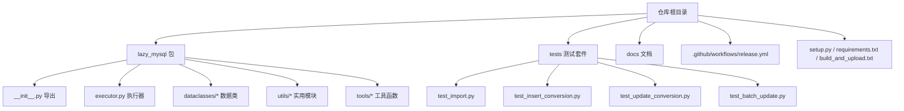
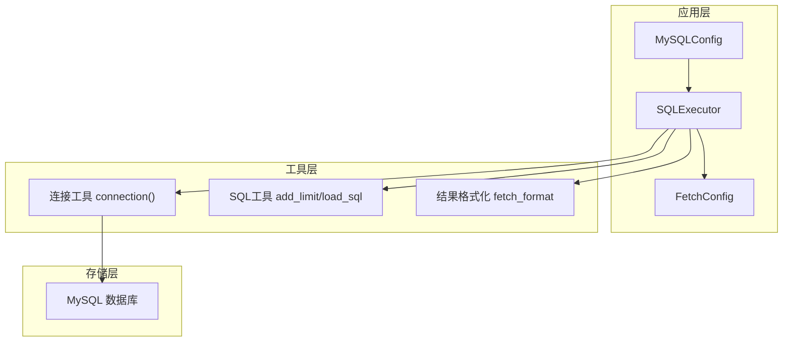
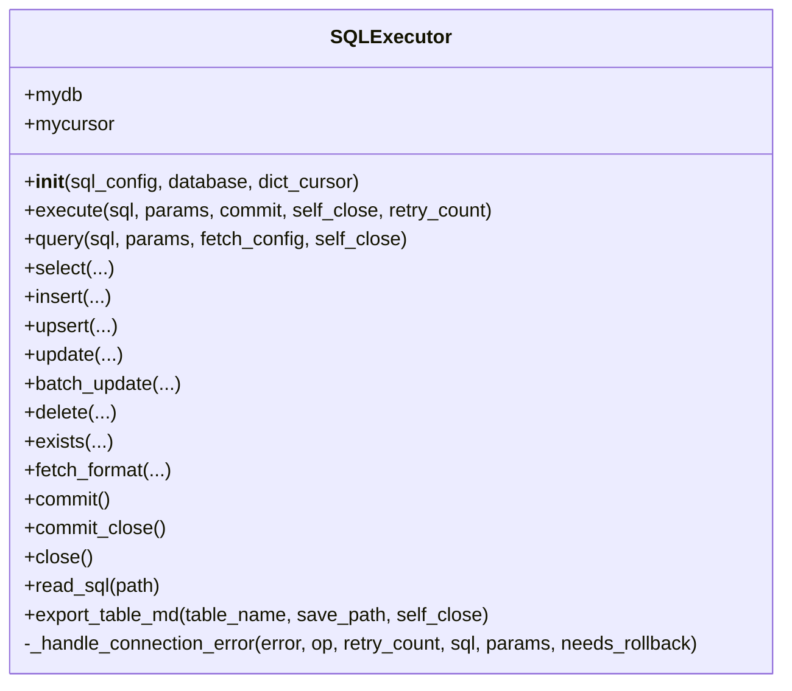
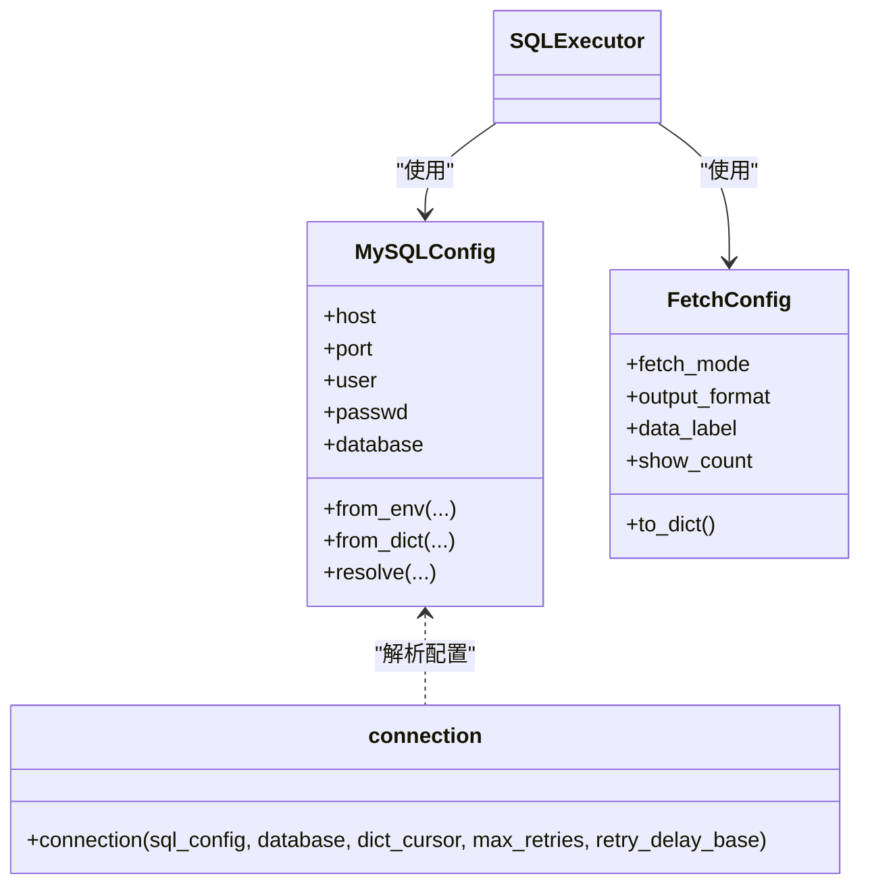
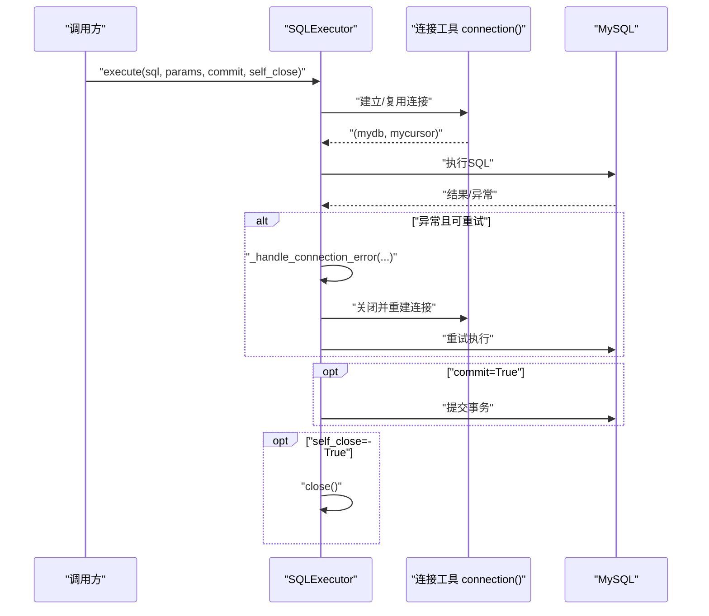
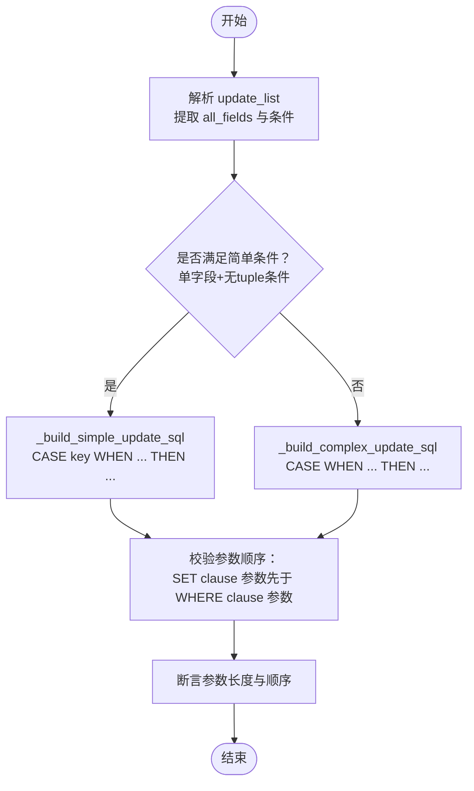
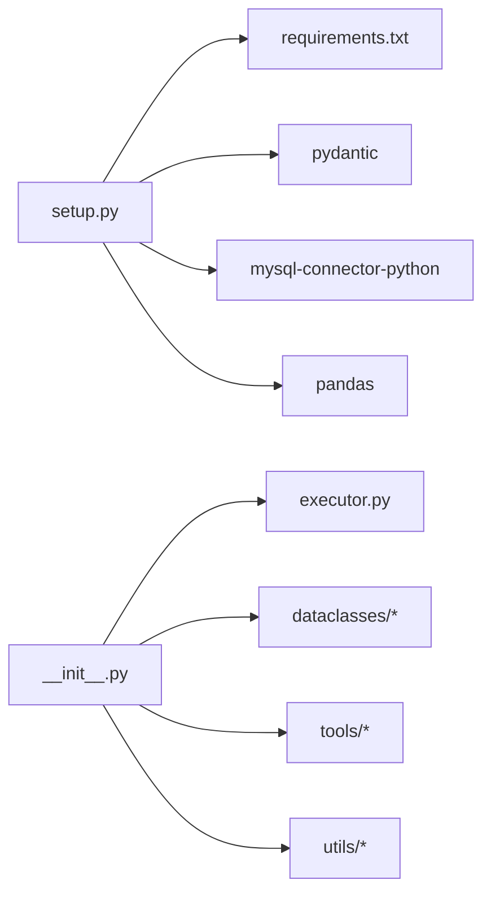
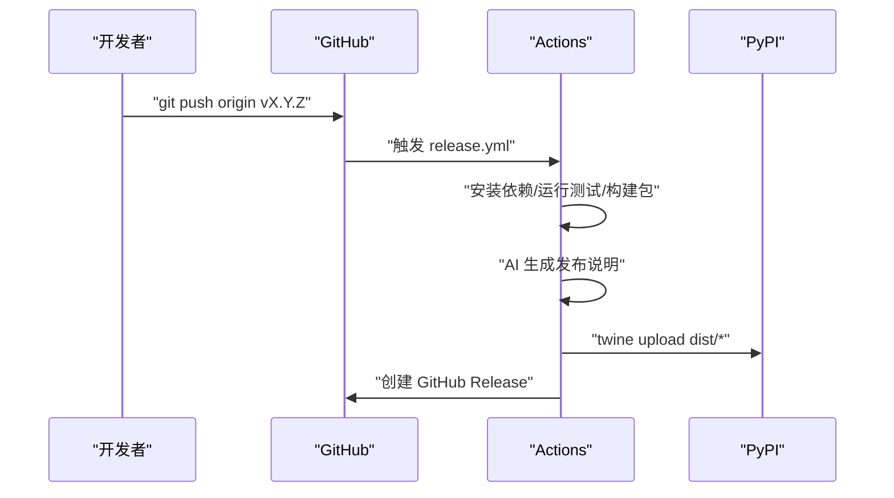

# 开发者指南

<cite>
**本文引用的文件**
- [README.md](file://README.md)
- [setup.py](file://setup.py)
- [requirements.txt](file://requirements.txt)
- [.github/workflows/release.yml](file://.github/workflows/release.yml)
- [lazy_mysql/__init__.py](file://lazy_mysql/__init__.py)
- [lazy_mysql/executor.py](file://lazy_mysql/executor.py)
- [lazy_mysql/dataclasses/mysql_config.py](file://lazy_mysql/dataclasses/mysql_config.py)
- [lazy_mysql/dataclasses/fetch_config.py](file://lazy_mysql/dataclasses/fetch_config.py)
- [lazy_mysql/utils/connect.py](file://lazy_mysql/utils/connect.py)
- [lazy_mysql/tools/sql_utils.py](file://lazy_mysql/tools/sql_utils.py)
- [tests/test_import.py](file://tests/test_import.py)
- [tests/test_insert_conversion.py](file://tests/test_insert_conversion.py)
- [tests/test_update_conversion.py](file://tests/test_update_conversion.py)
- [tests/test_batch_update.py](file://tests/test_batch_update.py)
- [build_and_upload.txt](file://build_and_upload.txt)
</cite>

## 目录
1. [简介](#简介)
2. [项目结构](#项目结构)
3. [核心组件](#核心组件)
4. [架构总览](#架构总览)
5. [详细组件分析](#详细组件分析)
6. [依赖关系分析](#依赖关系分析)
7. [性能考量](#性能考量)
8. [故障排查指南](#故障排查指南)
9. [结论](#结论)
10. [附录](#附录)

## 简介
本指南面向 lazy_mysql 项目的贡献者与扩展开发者，提供从开发环境搭建、代码规范、测试策略，到提交流程、分支管理、发布流程与版本管理的完整工作指南。同时给出扩展开发（新增功能、改进现有功能、Bug 修复）的实施建议与代码审查标准。

## 项目结构
仓库采用“包内模块化 + 文档 + 测试 + 工作流”的组织方式：
- 包根：lazy_mysql，包含入口、执行器、数据类、工具与实用模块
- 文档：docs 下提供各功能的使用说明与技术细节
- 测试：tests 下包含导入、插入/更新转换、批量更新等单元测试
- 工作流：.github/workflows/release.yml 定义自动化构建、测试、打包与发布流程
- 配置：setup.py、requirements.txt、build_and_upload.txt 等

图表来源
- [lazy_mysql/__init__.py:1-21](file://lazy_mysql/__init__.py#L1-L21)
- [lazy_mysql/executor.py:1-616](file://lazy_mysql/executor.py#L1-L616)
- [lazy_mysql/dataclasses/mysql_config.py:1-135](file://lazy_mysql/dataclasses/mysql_config.py#L1-L135)
- [lazy_mysql/dataclasses/fetch_config.py:1-24](file://lazy_mysql/dataclasses/fetch_config.py#L1-L24)
- [lazy_mysql/utils/connect.py:1-91](file://lazy_mysql/utils/connect.py#L1-L91)
- [lazy_mysql/tools/sql_utils.py:1-53](file://lazy_mysql/tools/sql_utils.py#L1-L53)
- [tests/test_import.py:1-12](file://tests/test_import.py#L1-L12)
- [tests/test_insert_conversion.py:1-211](file://tests/test_insert_conversion.py#L1-L211)
- [tests/test_update_conversion.py:1-173](file://tests/test_update_conversion.py#L1-L173)
- [tests/test_batch_update.py:1-192](file://tests/test_batch_update.py#L1-L192)

章节来源
- [README.md:1-197](file://README.md#L1-L197)
- [setup.py:1-34](file://setup.py#L1-L34)
- [requirements.txt:1-3](file://requirements.txt#L1-L3)

## 核心组件
- 执行器 SQLExecutor：统一的数据库操作入口，封装连接、执行、查询、插入、更新、删除、导出等功能，并内置重试与回滚机制
- 数据类 MySQLConfig / FetchConfig：标准化配置来源与查询结果格式化参数
- 工具模块：连接建立、SQL 片段构造、结果格式化、批量导出等
- 测试套件：覆盖导入一致性、值转换、批量更新参数顺序与校验等

章节来源
- [lazy_mysql/executor.py:1-616](file://lazy_mysql/executor.py#L1-L616)
- [lazy_mysql/dataclasses/mysql_config.py:1-135](file://lazy_mysql/dataclasses/mysql_config.py#L1-L135)
- [lazy_mysql/dataclasses/fetch_config.py:1-24](file://lazy_mysql/dataclasses/fetch_config.py#L1-L24)
- [lazy_mysql/utils/connect.py:1-91](file://lazy_mysql/utils/connect.py#L1-L91)
- [lazy_mysql/tools/sql_utils.py:1-53](file://lazy_mysql/tools/sql_utils.py#L1-L53)

## 架构总览
lazy_mysql 的架构围绕“配置解析—连接管理—SQL 执行—结果格式化”展开，通过数据类与工具模块解耦，测试驱动保证关键路径正确性。

图表来源
- [lazy_mysql/executor.py:1-616](file://lazy_mysql/executor.py#L1-L616)
- [lazy_mysql/utils/connect.py:1-91](file://lazy_mysql/utils/connect.py#L1-L91)
- [lazy_mysql/tools/sql_utils.py:1-53](file://lazy_mysql/tools/sql_utils.py#L1-L53)
- [lazy_mysql/dataclasses/fetch_config.py:1-24](file://lazy_mysql/dataclasses/fetch_config.py#L1-L24)
- [lazy_mysql/dataclasses/mysql_config.py:1-135](file://lazy_mysql/dataclasses/mysql_config.py#L1-L135)

## 详细组件分析

### 执行器 SQLExecutor
- 统一入口：封装 execute、query、select、insert、upsert、update、batch_update、delete、exists、export_table_md 等
- 错误处理：内置可重试错误识别与自动重连、事务回滚、连接关闭兜底
- 结果格式化：通过 fetch_format 支持多种输出格式与计数展示
- 连接管理：支持字典游标、自动关闭、commit/close 组合

图表来源
- [lazy_mysql/executor.py:1-616](file://lazy_mysql/executor.py#L1-L616)

章节来源
- [lazy_mysql/executor.py:1-616](file://lazy_mysql/executor.py#L1-L616)

### 配置与连接
- MySQLConfig：支持从参数、字典、环境变量解析，空值不覆盖，提供默认配置
- FetchConfig：强类型配置项，控制 fetch_mode、output_format、data_label、show_count
- 连接工具：带重试、版本检查、缓冲游标、字典游标、LOAD DATA INFILE 支持

图表来源
- [lazy_mysql/dataclasses/mysql_config.py:1-135](file://lazy_mysql/dataclasses/mysql_config.py#L1-L135)
- [lazy_mysql/dataclasses/fetch_config.py:1-24](file://lazy_mysql/dataclasses/fetch_config.py#L1-L24)
- [lazy_mysql/utils/connect.py:1-91](file://lazy_mysql/utils/connect.py#L1-L91)
- [lazy_mysql/executor.py:1-616](file://lazy_mysql/executor.py#L1-L616)

章节来源
- [lazy_mysql/dataclasses/mysql_config.py:1-135](file://lazy_mysql/dataclasses/mysql_config.py#L1-L135)
- [lazy_mysql/dataclasses/fetch_config.py:1-24](file://lazy_mysql/dataclasses/fetch_config.py#L1-L24)
- [lazy_mysql/utils/connect.py:1-91](file://lazy_mysql/utils/connect.py#L1-L91)

### 工具与实用模块
- SQL 工具：add_limit 构造条件片段；load_sql 读取 SQL 文件
- 结果格式化：与执行器配合，支持 list_1、df、df_dict 等输出格式
- 批量导出：单表或多表 Markdown 导出

章节来源
- [lazy_mysql/tools/sql_utils.py:1-53](file://lazy_mysql/tools/sql_utils.py#L1-L53)
- [lazy_mysql/executor.py:593-616](file://lazy_mysql/executor.py#L593-L616)

### 测试策略与用例规范
- 测试框架：pytest
- 覆盖维度：
  - 导入一致性：确保模块导出稳定
  - 值转换：插入/更新对 Python 值（列表、字典、时间戳、pandas NA）的序列化与转换
  - 批量更新：参数顺序、简单/复杂 CASE 语法、条件校验
- 测试文件路径参考：
  - [tests/test_import.py:1-12](file://tests/test_import.py#L1-L12)
  - [tests/test_insert_conversion.py:1-211](file://tests/test_insert_conversion.py#L1-L211)
  - [tests/test_update_conversion.py:1-173](file://tests/test_update_conversion.py#L1-L173)
  - [tests/test_batch_update.py:1-192](file://tests/test_batch_update.py#L1-L192)

章节来源
- [tests/test_import.py:1-12](file://tests/test_import.py#L1-L12)
- [tests/test_insert_conversion.py:1-211](file://tests/test_insert_conversion.py#L1-L211)
- [tests/test_update_conversion.py:1-173](file://tests/test_update_conversion.py#L1-L173)
- [tests/test_batch_update.py:1-192](file://tests/test_batch_update.py#L1-L192)

### 关键流程时序图

#### 执行器执行流程（含重试）

图表来源
- [lazy_mysql/executor.py:62-185](file://lazy_mysql/executor.py#L62-L185)
- [lazy_mysql/utils/connect.py:15-91](file://lazy_mysql/utils/connect.py#L15-L91)

#### 批量更新参数顺序校验（复杂 CASE）

图表来源
- [tests/test_batch_update.py:14-84](file://tests/test_batch_update.py#L14-L84)
- [tests/test_batch_update.py:86-132](file://tests/test_batch_update.py#L86-L132)

## 依赖关系分析
- 运行时依赖：mysql-connector-python、pandas、pydantic
- 版本要求：setup.py 指定最低版本；连接工具包含版本检查提示
- 包导出：__init__.py 明确公开 API，便于外部使用与测试

图表来源
- [setup.py:1-34](file://setup.py#L1-L34)
- [requirements.txt:1-3](file://requirements.txt#L1-L3)
- [lazy_mysql/__init__.py:1-21](file://lazy_mysql/__init__.py#L1-L21)

章节来源
- [setup.py:1-34](file://setup.py#L1-L34)
- [requirements.txt:1-3](file://requirements.txt#L1-L3)
- [lazy_mysql/__init__.py:1-21](file://lazy_mysql/__init__.py#L1-L21)

## 性能考量
- 批量插入策略：根据数据规模自动选择 optimzed executemany 或 LOAD DATA INFILE，显著提升大体量数据写入性能
- 查询优化：exists 使用 SELECT 1 ... LIMIT 1，避免全表扫描
- 结果格式化：支持 DataFrame 直出与字典列表，兼顾易用性与内存占用
- 连接与缓冲：启用 buffered 游标与 use_pure，减少“未读结果”与兼容性问题

章节来源
- [lazy_mysql/executor.py:213-254](file://lazy_mysql/executor.py#L213-L254)
- [lazy_mysql/executor.py:387-421](file://lazy_mysql/executor.py#L387-L421)
- [lazy_mysql/utils/connect.py:46-67](file://lazy_mysql/utils/connect.py#L46-L67)

## 故障排查指南
- 连接失败与重试
  - 现象：ConnectionTimeoutError、InterfaceError
  - 处理：连接工具内置指数退避重试；必要时检查网络与凭据
- 可重试错误自动恢复
  - 现象：连接丢失、超时
  - 处理：执行器捕获并尝试重连，必要时回滚事务并关闭连接
- 参数与类型错误
  - 现象：TypeError（连接参数类型）、ValueError（空条件/空字段）
  - 处理：严格校验输入，避免全表更新；确保字段非空
- 版本兼容
  - 建议：升级 mysql-connector-python 至 9.4.0+，遵循 setup.py 与连接工具的版本提示

章节来源
- [lazy_mysql/utils/connect.py:70-90](file://lazy_mysql/utils/connect.py#L70-L90)
- [lazy_mysql/executor.py:62-106](file://lazy_mysql/executor.py#L62-L106)
- [tests/test_update_conversion.py:145-154](file://tests/test_update_conversion.py#L145-L154)
- [tests/test_batch_update.py:158-171](file://tests/test_batch_update.py#L158-L171)

## 结论
lazy_mysql 通过清晰的模块划分、强类型的配置模型与完善的测试体系，提供了高性能、易用的 MySQL 操作体验。建议贡献者遵循本文档的开发与测试规范，在变更前完善测试用例并通过 CI 流程，确保质量与稳定性。

## 附录

### 开发环境搭建
- Python 版本：参考 setup.py 中 python_requires
- 依赖安装：pip install -r requirements.txt
- 本地开发安装：pip install -e .
- 运行测试：pytest

章节来源
- [setup.py:30-34](file://setup.py#L30-L34)
- [requirements.txt:1-3](file://requirements.txt#L1-L3)

### 代码规范
- 类型注解：广泛使用 typing，确保参数与返回值明确
- 配置模型：使用 pydantic BaseModel，提供字段校验与默认值
- 错误处理：区分可重试与不可重试错误，统一异常路径
- 导出接口：通过 __init__.py 明确公开 API，保持向后兼容

章节来源
- [lazy_mysql/dataclasses/fetch_config.py:1-24](file://lazy_mysql/dataclasses/fetch_config.py#L1-L24)
- [lazy_mysql/dataclasses/mysql_config.py:1-135](file://lazy_mysql/dataclasses/mysql_config.py#L1-L135)
- [lazy_mysql/__init__.py:1-21](file://lazy_mysql/__init__.py#L1-L21)

### 测试策略与用例编写规范
- 导入一致性：确保模块导出稳定
- 值转换：覆盖 Python 原生类型、pandas 类型与 NA 值
- 批量更新：校验参数顺序、CASE 语法生成、条件合法性
- 断言风格：pytest 断言，关注行为而非实现细节

章节来源
- [tests/test_import.py:1-12](file://tests/test_import.py#L1-L12)
- [tests/test_insert_conversion.py:1-211](file://tests/test_insert_conversion.py#L1-L211)
- [tests/test_update_conversion.py:1-173](file://tests/test_update_conversion.py#L1-L173)
- [tests/test_batch_update.py:1-192](file://tests/test_batch_update.py#L1-L192)

### 提交流程与分支管理
- 分支策略：建议采用功能分支（feature/*）、修复分支（fix/*）、热修复（hotfix/*）
- 提交规范：语义化提交信息（feat/fix/docs/chore），简明描述变更
- Pull Request 规范：
  - PR 描述包含变更动机、影响范围、测试覆盖
  - 通过 CI（构建、测试、打包）与代码审查
  - 合并前确保版本号与变更日志更新

（本节为通用流程建议，未直接分析具体文件）

### 代码审查标准
- 正确性：覆盖边界条件与异常路径
- 可维护性：模块职责单一、接口清晰、注释充分
- 性能：避免不必要的全表扫描与重复查询
- 兼容性：保持向后兼容，谨慎变更公共 API
- 测试：新增功能配套单元测试，既有逻辑补充用例

（本节为通用标准建议，未直接分析具体文件）

### 发布流程与版本管理
- 标签与触发：推送 v* 标签触发 GitHub Actions
- 步骤概览：检出代码、设置 Python、安装依赖、运行 pytest、构建包、生成 AI 版本说明、上传至 PyPI、创建 GitHub Release
- 本地构建与上传：使用 build_and_upload.txt 中的命令

图表来源
- [.github/workflows/release.yml:1-168](file://.github/workflows/release.yml#L1-L168)
- [build_and_upload.txt:1-5](file://build_and_upload.txt#L1-L5)

章节来源
- [.github/workflows/release.yml:1-168](file://.github/workflows/release.yml#L1-L168)
- [build_and_upload.txt:1-5](file://build_and_upload.txt#L1-L5)

### 扩展开发指导
- 新增功能
  - 在 lazy_mysql/dataclasses、lazy_mysql/tools、lazy_mysql/utils 中按职责新增模块
  - 通过 __init__.py 明确导出，保持 API 稳定
  - 编写对应测试用例，覆盖正常与异常路径
- 现有功能改进
  - 优先完善测试用例，再进行重构与优化
  - 保持向后兼容，必要时引入配置项或默认值
- Bug 修复
  - 添加最小可复现测试，定位问题后修复并回归
  - 记录修复原因与影响范围

章节来源
- [lazy_mysql/__init__.py:1-21](file://lazy_mysql/__init__.py#L1-L21)
- [tests/test_import.py:1-12](file://tests/test_import.py#L1-L12)