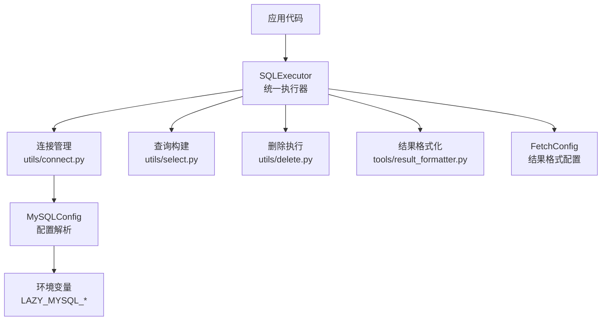
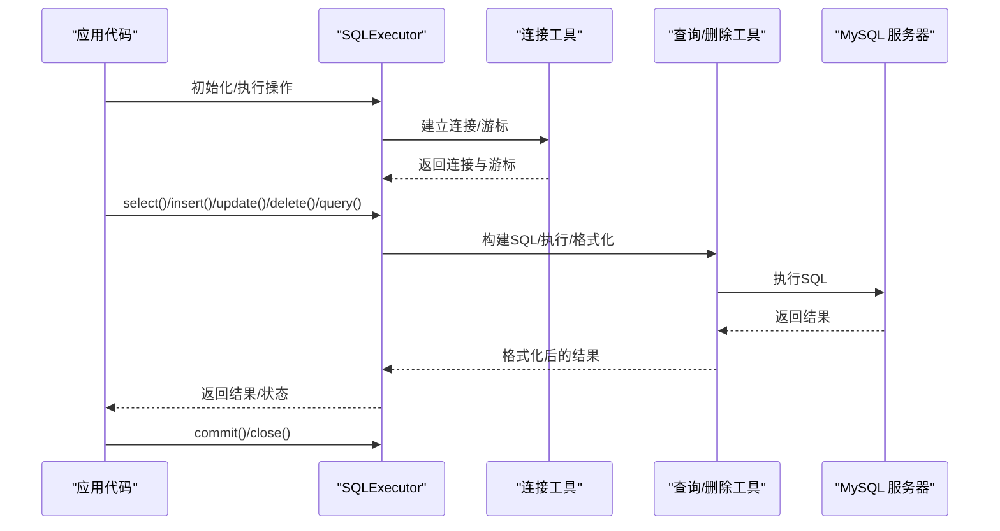
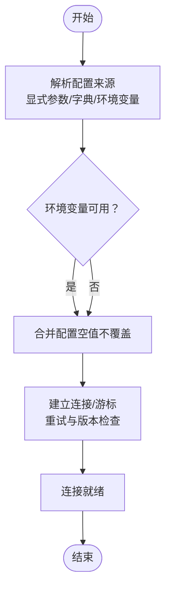
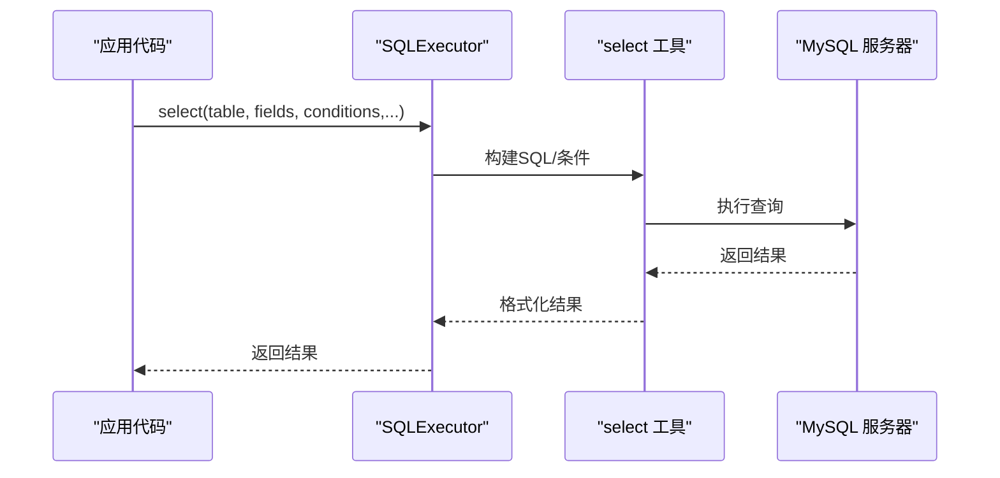
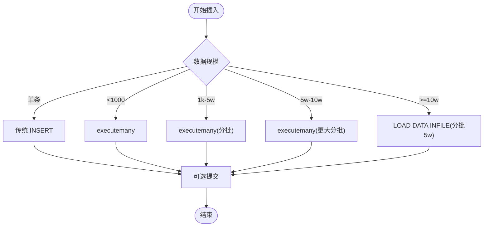
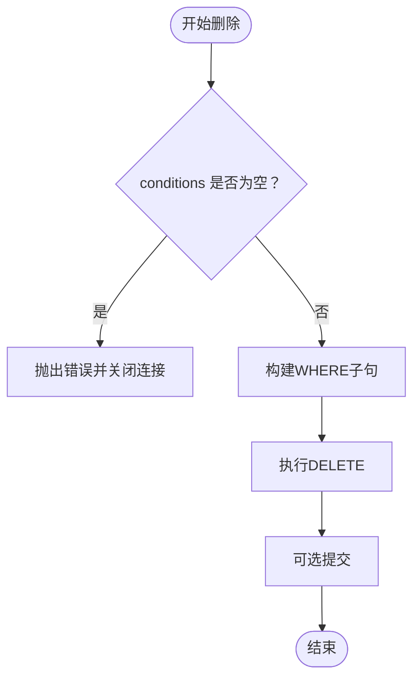
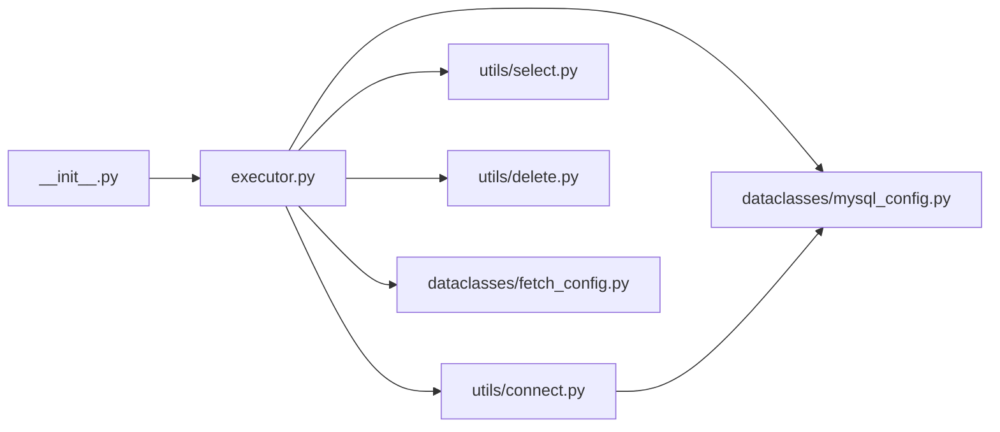

# 快速开始

<cite>
**本文引用的文件**
- [README.md](file://README.md)
- [setup.py](file://setup.py)
- [requirements.txt](file://requirements.txt)
- [lazy_mysql/__init__.py](file://lazy_mysql/__init__.py)
- [lazy_mysql/dataclasses/mysql_config.py](file://lazy_mysql/dataclasses/mysql_config.py)
- [lazy_mysql/utils/connect.py](file://lazy_mysql/utils/connect.py)
- [lazy_mysql/executor.py](file://lazy_mysql/executor.py)
- [lazy_mysql/utils/select.py](file://lazy_mysql/utils/select.py)
- [lazy_mysql/utils/delete.py](file://lazy_mysql/utils/delete.py)
- [lazy_mysql/dataclasses/fetch_config.py](file://lazy_mysql/dataclasses/fetch_config.py)
- [lazy_mysql/tools/sql_utils.py](file://lazy_mysql/tools/sql_utils.py)
- [docs/CONNECTION.md](file://docs/CONNECTION.md)
- [docs/SELECT.md](file://docs/SELECT.md)
- [docs/INSERT.md](file://docs/INSERT.md)
- [docs/DELETE.md](file://docs/DELETE.md)
</cite>

## 目录
1. [简介](#简介)
2. [项目结构](#项目结构)
3. [核心组件](#核心组件)
4. [架构总览](#架构总览)
5. [详细组件分析](#详细组件分析)
6. [依赖关系分析](#依赖关系分析)
7. [性能注意事项](#性能注意事项)
8. [故障排查指南](#故障排查指南)
9. [结论](#结论)
10. [附录](#附录)

## 简介
本指南面向首次使用 lazy_mysql 的开发者，帮助你在最短时间内完成安装、连接初始化、配置读取、以及完成基本的 CRUD 操作（SELECT 智能查询、INSERT 批量插入、UPDATE 条件更新、DELETE 安全删除），并掌握 upsert、连接管理与最佳实践。文中所有示例均来自仓库文档与源码，确保可直接运行。

## 项目结构
- 核心入口与导出：通过包级导出统一暴露配置、执行器与工具函数，便于直接导入使用。
- 配置层：MySQLConfig 提供统一的配置来源解析（显式参数、字典、环境变量）。
- 连接层：封装 mysql-connector-python，提供连接、游标、重试与版本检查。
- 执行层：SQLExecutor 提供统一的 SQL 执行接口，内置 select、insert、upsert、update、batch_update、delete、query、exists 等方法。
- 工具层：where_clause、result_formatter、table_export、sql_utils 等辅助模块。
- 文档层：CONNECTION.md、SELECT.md、INSERT.md、DELETE.md 等详细说明各操作的使用方式与最佳实践。

图表来源
- [lazy_mysql/executor.py:14-616](file://lazy_mysql/executor.py#L14-L616)
- [lazy_mysql/utils/connect.py:16-91](file://lazy_mysql/utils/connect.py#L16-L91)
- [lazy_mysql/utils/select.py:4-237](file://lazy_mysql/utils/select.py#L4-L237)
- [lazy_mysql/utils/delete.py:3-26](file://lazy_mysql/utils/delete.py#L3-L26)
- [lazy_mysql/dataclasses/fetch_config.py:8-24](file://lazy_mysql/dataclasses/fetch_config.py#L8-L24)
- [lazy_mysql/dataclasses/mysql_config.py:82-135](file://lazy_mysql/dataclasses/mysql_config.py#L82-L135)

章节来源
- [lazy_mysql/__init__.py:1-21](file://lazy_mysql/__init__.py#L1-L21)
- [docs/CONNECTION.md:1-334](file://docs/CONNECTION.md#L1-L334)

## 核心组件
- SQLExecutor：统一的数据库操作入口，封装连接、执行、结果格式化、事务与重连处理。
- MySQLConfig：统一解析配置来源，支持显式参数、字典、环境变量，空值不覆盖策略。
- FetchConfig：控制查询结果的获取模式与输出格式（all/oneTuple/one、df/df_dict/list_1 等）。
- 连接工具：connection 函数负责建立连接、游标、重试与版本检查。
- 查询/删除工具：select、delete 等方法内部通过 where_clause 构建 WHERE 子句，保证安全性与灵活性。

章节来源
- [lazy_mysql/executor.py:14-616](file://lazy_mysql/executor.py#L14-L616)
- [lazy_mysql/dataclasses/mysql_config.py:10-135](file://lazy_mysql/dataclasses/mysql_config.py#L10-L135)
- [lazy_mysql/dataclasses/fetch_config.py:8-24](file://lazy_mysql/dataclasses/fetch_config.py#L8-L24)
- [lazy_mysql/utils/connect.py:16-91](file://lazy_mysql/utils/connect.py#L16-L91)
- [lazy_mysql/utils/select.py:4-237](file://lazy_mysql/utils/select.py#L4-L237)
- [lazy_mysql/utils/delete.py:3-26](file://lazy_mysql/utils/delete.py#L3-L26)

## 架构总览
下图展示了从应用到数据库的关键交互路径：应用通过 SQLExecutor 发起操作，SQLExecutor 调用连接层建立连接与游标，随后根据操作类型调用相应工具模块（查询构建、删除执行、结果格式化），并在必要时进行事务提交与连接关闭。

图表来源
- [lazy_mysql/executor.py:20-616](file://lazy_mysql/executor.py#L20-L616)
- [lazy_mysql/utils/connect.py:16-91](file://lazy_mysql/utils/connect.py#L16-L91)
- [lazy_mysql/utils/select.py:4-237](file://lazy_mysql/utils/select.py#L4-L237)
- [lazy_mysql/utils/delete.py:3-26](file://lazy_mysql/utils/delete.py#L3-L26)

## 详细组件分析

### 安装与环境要求
- 安装命令：pip install --upgrade lazy-mysql
- 环境要求：
  - Python：3.10+
  - MySQL：8.0.36+
  - 依赖库：mysql-connector-python>=9.4.0、pandas>=2.3.1、pydantic>=2.0.0
- 注意：setup.py 中声明 Python 最低版本为 3.10，但 README.md 中给出的“环境要求”为 3.7+，建议以实际发布版本为准。

章节来源
- [README.md:163-172](file://README.md#L163-L172)
- [setup.py:30-30](file://setup.py#L30-L30)
- [requirements.txt:1-3](file://requirements.txt#L1-L3)

### 数据库连接初始化与配置
- 直接参数配置：通过 MySQLConfig 直接传入 host、user、passwd、database 等参数。
- 环境变量配置：不传配置时自动从 LAZY_MYSQL_HOST/LAZY_MYSQL_PORT/LAZY_MYSQL_USER/LAZY_MYSQL_PASSWD/LAZY_MYSQL_DATABASE 读取。
- 混合配置：显式参数优先级最高，其次为字典配置，再次为环境变量；空值不会覆盖已有值。
- 高级连接参数：可通过底层 connection 函数传入 dict_cursor、max_retries、retry_delay_base 等。
- 连接最佳实践：使用 try/finally 或上下文管理器确保连接关闭；生产环境建议复用连接。

图表来源
- [lazy_mysql/dataclasses/mysql_config.py:82-135](file://lazy_mysql/dataclasses/mysql_config.py#L82-L135)
- [lazy_mysql/utils/connect.py:16-91](file://lazy_mysql/utils/connect.py#L16-L91)
- [docs/CONNECTION.md:85-133](file://docs/CONNECTION.md#L85-L133)

章节来源
- [docs/CONNECTION.md:1-334](file://docs/CONNECTION.md#L1-L334)
- [lazy_mysql/dataclasses/mysql_config.py:10-135](file://lazy_mysql/dataclasses/mysql_config.py#L10-L135)
- [lazy_mysql/utils/connect.py:16-91](file://lazy_mysql/utils/connect.py#L16-L91)

### 基本 CRUD 操作

#### SELECT 智能查询
- 支持单表/多表 JOIN、WHERE 条件、ORDER BY/LIMIT、DISTINCT。
- 结果格式化：all/oneTuple/one，输出格式可选 list_1、df、df_dict。
- 存在性检查 exists：使用 SELECT 1 ... LIMIT 1，性能优于 select + 判断。
- fetch_config：支持 fetch_mode、output_format、data_label、show_count。

图表来源
- [lazy_mysql/executor.py:324-386](file://lazy_mysql/executor.py#L324-L386)
- [lazy_mysql/utils/select.py:4-157](file://lazy_mysql/utils/select.py#L4-L157)
- [docs/SELECT.md:1-672](file://docs/SELECT.md#L1-L672)

章节来源
- [docs/SELECT.md:1-672](file://docs/SELECT.md#L1-L672)
- [lazy_mysql/utils/select.py:4-237](file://lazy_mysql/utils/select.py#L4-L237)
- [lazy_mysql/executor.py:324-386](file://lazy_mysql/executor.py#L324-L386)

#### INSERT 批量插入
- 自动策略：单条、小批量（<1000）、中批量（1k-5w）、大批次（≥10w）分别采用不同优化策略。
- 超大数据：使用 LOAD DATA LOCAL INFILE，分批处理，显著提升性能。
- 重复处理：skip_duplicate=True 时使用 INSERT IGNORE 跳过重复。
- 事务管理：单次可 commit=True 立即提交；批量建议手动控制提交时机。

图表来源
- [docs/INSERT.md:7-15](file://docs/INSERT.md#L7-L15)
- [docs/INSERT.md:152-188](file://docs/INSERT.md#L152-L188)

章节来源
- [docs/INSERT.md:1-243](file://docs/INSERT.md#L1-L243)

#### UPDATE 条件更新
- 支持动态构造 WHERE 条件，批量更新支持简化 CASE WHEN 语法与通用 CASE WHEN 语法。
- 建议配合事务管理，确保复杂业务的一致性。

章节来源
- [lazy_mysql/executor.py:257-269](file://lazy_mysql/executor.py#L257-L269)
- [lazy_mysql/executor.py:272-306](file://lazy_mysql/executor.py#L272-L306)

#### DELETE 安全删除
- 强制要求 conditions，防止误删全表。
- 支持复杂条件组合与调试技巧（预览、计数）。

图表来源
- [lazy_mysql/utils/delete.py:14-26](file://lazy_mysql/utils/delete.py#L14-L26)

章节来源
- [docs/DELETE.md:1-122](file://docs/DELETE.md#L1-L122)
- [lazy_mysql/utils/delete.py:3-26](file://lazy_mysql/utils/delete.py#L3-L26)

#### Upsert 操作
- 基于 MySQL 的 INSERT ... ON DUPLICATE KEY UPDATE，支持单条与批量。
- 字段更新策略：fields_update 指定冲突时更新的字段集合，None 表示更新所有字段。

章节来源
- [lazy_mysql/executor.py:237-254](file://lazy_mysql/executor.py#L237-L254)

### 关键概念与最佳实践

#### 参数化查询
- SQLExecutor.execute 支持 %s 与 %(name)s 占位符，自动区分单参数与批量参数，防止 SQL 注入。
- 批量执行时禁止 SELECT，避免性能问题。

章节来源
- [lazy_mysql/executor.py:126-185](file://lazy_mysql/executor.py#L126-L185)

#### 连接池与连接管理
- 连接层使用 mysql-connector-python 的连接参数，建议在生产环境中合理设置缓冲与本地文件权限。
- 推荐：连接复用、显式关闭、异常时回滚并关闭。

章节来源
- [lazy_mysql/utils/connect.py:54-63](file://lazy_mysql/utils/connect.py#L54-L63)
- [docs/CONNECTION.md:230-282](file://docs/CONNECTION.md#L230-L282)

#### 事务处理
- commit()/commit_close() 提交事务并关闭连接；内部对可重试错误进行自动重连与回滚处理。
- 复杂业务建议手动控制事务边界，确保原子性。

章节来源
- [lazy_mysql/executor.py:109-124](file://lazy_mysql/executor.py#L109-L124)
- [lazy_mysql/executor.py:62-107](file://lazy_mysql/executor.py#L62-L107)

#### 结果格式化与 FetchConfig
- 支持 all/oneTuple/one 三种获取模式与 list_1、df、df_dict 等输出格式。
- data_label 用于 DataFrame 列名或字典键名；show_count 控制是否返回总数。

章节来源
- [lazy_mysql/executor.py:188-211](file://lazy_mysql/executor.py#L188-L211)
- [lazy_mysql/dataclasses/fetch_config.py:8-24](file://lazy_mysql/dataclasses/fetch_config.py#L8-L24)
- [docs/SELECT.md:51-118](file://docs/SELECT.md#L51-L118)

## 依赖关系分析
- 包导出：__init__.py 统一导出 MySQLConfig、SQLExecutor、FetchConfig、工具函数等。
- 执行器依赖：SQLExecutor 依赖 MySQLConfig、连接工具、查询/删除工具与结果格式化工具。
- 配置解析：MySQLConfig 支持 from_env/from_dict/resolve，空值不覆盖策略贯穿配置链路。
- 连接工具：connection 封装 mysql-connector-python，提供重试与版本检查。

图表来源
- [lazy_mysql/__init__.py:1-21](file://lazy_mysql/__init__.py#L1-L21)
- [lazy_mysql/executor.py:1-6](file://lazy_mysql/executor.py#L1-L6)
- [lazy_mysql/dataclasses/mysql_config.py:1-135](file://lazy_mysql/dataclasses/mysql_config.py#L1-L135)
- [lazy_mysql/utils/connect.py:1-91](file://lazy_mysql/utils/connect.py#L1-L91)
- [lazy_mysql/utils/select.py:1-237](file://lazy_mysql/utils/select.py#L1-L237)
- [lazy_mysql/utils/delete.py:1-26](file://lazy_mysql/utils/delete.py#L1-L26)
- [lazy_mysql/dataclasses/fetch_config.py:1-24](file://lazy_mysql/dataclasses/fetch_config.py#L1-L24)

章节来源
- [lazy_mysql/__init__.py:1-21](file://lazy_mysql/__init__.py#L1-L21)
- [lazy_mysql/executor.py:1-6](file://lazy_mysql/executor.py#L1-L6)

## 性能注意事项
- 批量插入：根据数据规模自动选择最优策略，超大数据使用 LOAD DATA INFILE 分批处理。
- 查询优化：尽量在数据库侧过滤（WHERE）、排序（ORDER BY）、限制（LIMIT）；避免 SELECT *。
- 结果格式：DataFrame 适合分析场景，元组列表适合高性能场景；按需选择 output_format。
- 连接复用：避免频繁创建/销毁连接，批量操作复用同一连接。

章节来源
- [docs/INSERT.md:7-15](file://docs/INSERT.md#L7-L15)
- [docs/INSERT.md:152-188](file://docs/INSERT.md#L152-L188)
- [docs/SELECT.md:562-610](file://docs/SELECT.md#L562-L610)

## 故障排查指南
- 连接失败：检查网络、凭据与 MySQL 服务状态；查看重试日志与版本提示。
- 权限错误：确认用户权限与数据库存在性；必要时设置 LOCAL INFILE 与相关参数。
- 删除风险：确保 conditions 非空；使用调试技巧预览与计数。
- 结果为空：确认字段名、表名与 JOIN 条件；使用 exists 快速判断。

章节来源
- [docs/CONNECTION.md:180-229](file://docs/CONNECTION.md#L180-L229)
- [docs/DELETE.md:68-122](file://docs/DELETE.md#L68-L122)
- [lazy_mysql/utils/delete.py:14-26](file://lazy_mysql/utils/delete.py#L14-L26)

## 结论
通过本快速开始指南，你已掌握 lazy_mysql 的安装、连接初始化、配置解析与核心 CRUD 操作，并了解 upsert、连接管理与性能优化要点。建议在实际项目中结合文档进一步学习 WHERE 条件、JOIN、事务与结果格式化等高级能力。

## 附录

### 快速示例清单（路径引用）
- 连接初始化与环境变量读取：[CONNECTION.md:56-80](file://docs/CONNECTION.md#L56-L80)
- 智能查询示例：[README.md:57-92](file://README.md#L57-L92)
- 批量插入与 Upsert 示例：[README.md:94-116](file://README.md#L94-L116)
- 条件更新与安全删除示例：[README.md:118-131](file://README.md#L118-L131)
- 查询结果格式化（FetchConfig）：[docs/SELECT.md:51-118](file://docs/SELECT.md#L51-L118)
- SQL 工具函数（add_limit/load_sql）：[lazy_mysql/tools/sql_utils.py:4-53](file://lazy_mysql/tools/sql_utils.py#L4-L53)