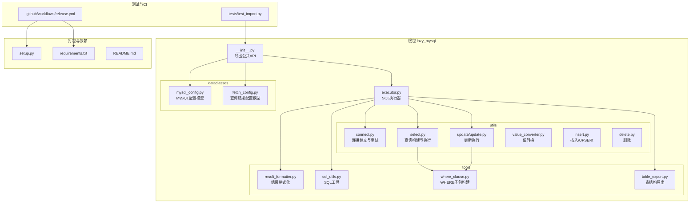
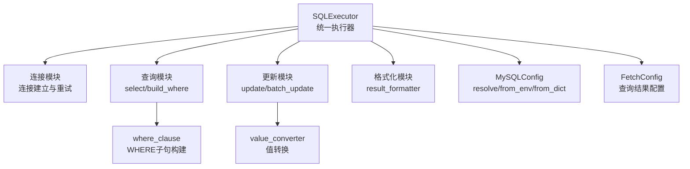
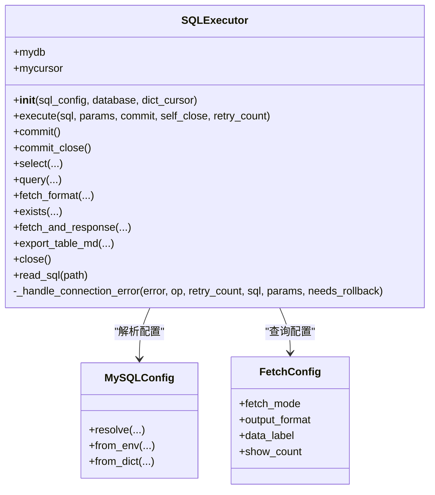
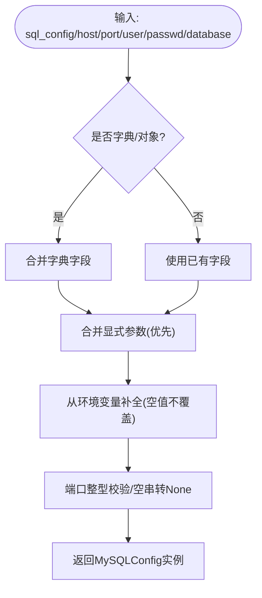
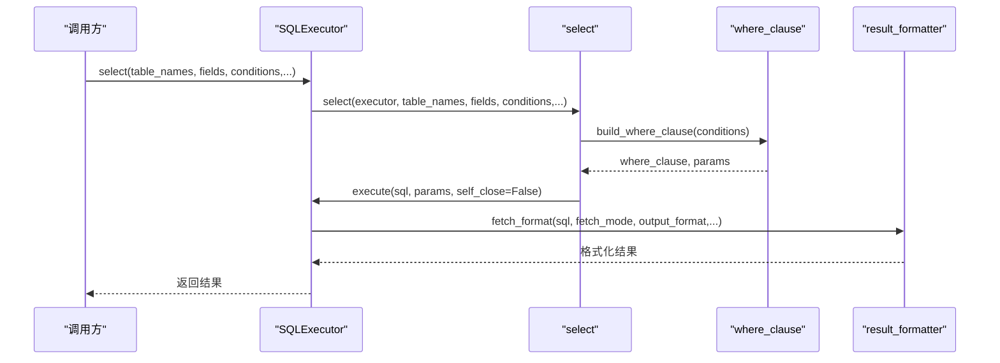
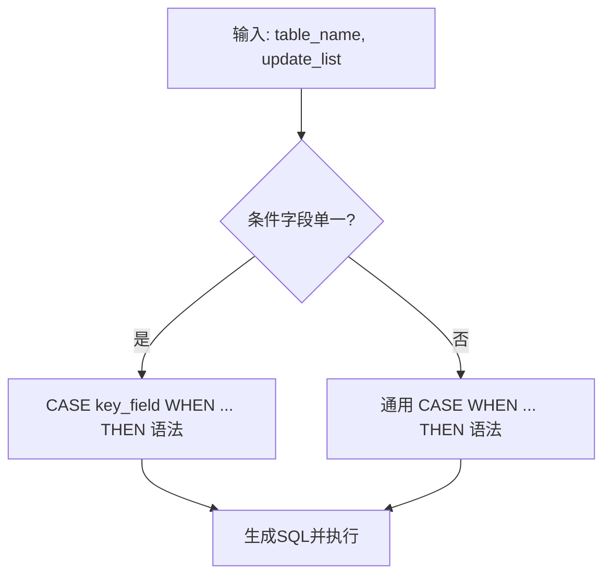
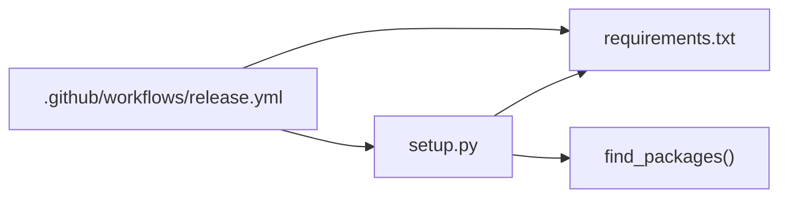

# 代码组织

<cite>
**本文引用的文件**
- [lazy_mysql/__init__.py](file://lazy_mysql/__init__.py)
- [lazy_mysql/executor.py](file://lazy_mysql/executor.py)
- [lazy_mysql/dataclasses/mysql_config.py](file://lazy_mysql/dataclasses/mysql_config.py)
- [lazy_mysql/dataclasses/fetch_config.py](file://lazy_mysql/dataclasses/fetch_config.py)
- [lazy_mysql/utils/connect.py](file://lazy_mysql/utils/connect.py)
- [lazy_mysql/utils/select.py](file://lazy_mysql/utils/select.py)
- [lazy_mysql/utils/update/update.py](file://lazy_mysql/utils/update/update.py)
- [lazy_mysql/tools/result_formatter.py](file://lazy_mysql/tools/result_formatter.py)
- [lazy_mysql/tools/sql_utils.py](file://lazy_mysql/tools/sql_utils.py)
- [tests/test_import.py](file://tests/test_import.py)
- [.github/workflows/release.yml](file://.github/workflows/release.yml)
- [setup.py](file://setup.py)
- [requirements.txt](file://requirements.txt)
- [README.md](file://README.md)
</cite>

## 目录
1. [简介](#简介)
2. [项目结构](#项目结构)
3. [核心组件](#核心组件)
4. [架构总览](#架构总览)
5. [详细组件分析](#详细组件分析)
6. [依赖分析](#依赖分析)
7. [性能考虑](#性能考虑)
8. [故障排查指南](#故障排查指南)
9. [结论](#结论)
10. [附录](#附录)

## 简介
本文件面向 lazy_mysql 项目的代码组织与架构设计，总结最佳实践，涵盖目录结构设计原则、模块划分与文件命名规范、包组织策略；配置管理（配置文件组织、环境变量使用、配置验证与加载顺序）；错误处理与异常管理（异常类型设计、错误信息标准化、日志记录策略）；代码风格与静态分析工具使用；单元测试与集成测试组织方式及持续集成最佳实践。

## 项目结构
项目采用“按职责分层 + 功能域聚合”的组织方式：
- 根包 lazy_mysql 下按功能域划分为 dataclasses（数据模型）、utils（通用工具与业务操作）、tools（辅助工具与格式化）、executor（统一执行器入口）。
- tests 与 docs 分离，便于独立维护与发布。
- setup.py 与 requirements.txt 明确声明依赖与打包元数据。

图表来源
- [lazy_mysql/__init__.py:1-21](file://lazy_mysql/__init__.py#L1-L21)
- [lazy_mysql/executor.py:1-616](file://lazy_mysql/executor.py#L1-L616)
- [lazy_mysql/dataclasses/mysql_config.py:1-135](file://lazy_mysql/dataclasses/mysql_config.py#L1-L135)
- [lazy_mysql/dataclasses/fetch_config.py:1-24](file://lazy_mysql/dataclasses/fetch_config.py#L1-L24)
- [lazy_mysql/utils/connect.py:1-91](file://lazy_mysql/utils/connect.py#L1-L91)
- [lazy_mysql/utils/select.py:1-237](file://lazy_mysql/utils/select.py#L1-L237)
- [lazy_mysql/utils/update/update.py:1-44](file://lazy_mysql/utils/update/update.py#L1-L44)
- [lazy_mysql/tools/result_formatter.py:1-77](file://lazy_mysql/tools/result_formatter.py#L1-L77)
- [lazy_mysql/tools/sql_utils.py:1-53](file://lazy_mysql/tools/sql_utils.py#L1-L53)
- [tests/test_import.py:1-12](file://tests/test_import.py#L1-L12)
- [.github/workflows/release.yml:1-168](file://.github/workflows/release.yml#L1-L168)
- [setup.py:1-34](file://setup.py#L1-L34)
- [requirements.txt:1-3](file://requirements.txt#L1-L3)

章节来源
- [lazy_mysql/__init__.py:1-21](file://lazy_mysql/__init__.py#L1-L21)
- [lazy_mysql/executor.py:1-616](file://lazy_mysql/executor.py#L1-L616)
- [lazy_mysql/dataclasses/mysql_config.py:1-135](file://lazy_mysql/dataclasses/mysql_config.py#L1-L135)
- [lazy_mysql/dataclasses/fetch_config.py:1-24](file://lazy_mysql/dataclasses/fetch_config.py#L1-L24)
- [lazy_mysql/utils/connect.py:1-91](file://lazy_mysql/utils/connect.py#L1-L91)
- [lazy_mysql/utils/select.py:1-237](file://lazy_mysql/utils/select.py#L1-L237)
- [lazy_mysql/utils/update/update.py:1-44](file://lazy_mysql/utils/update/update.py#L1-L44)
- [lazy_mysql/tools/result_formatter.py:1-77](file://lazy_mysql/tools/result_formatter.py#L1-L77)
- [lazy_mysql/tools/sql_utils.py:1-53](file://lazy_mysql/tools/sql_utils.py#L1-L53)
- [tests/test_import.py:1-12](file://tests/test_import.py#L1-L12)
- [.github/workflows/release.yml:1-168](file://.github/workflows/release.yml#L1-L168)
- [setup.py:1-34](file://setup.py#L1-L34)
- [requirements.txt:1-3](file://requirements.txt#L1-L3)

## 核心组件
- SQL执行器：统一入口，封装连接、执行、结果格式化、错误重试与资源回收。
- 配置模型：MySQLConfig（环境变量优先、显式参数覆盖、空值不覆盖策略）与 FetchConfig（查询结果格式化配置）。
- 工具与业务模块：连接建立与重试、查询构建与执行、更新/插入/删除、结果格式化、SQL工具与导出。

章节来源
- [lazy_mysql/executor.py:14-616](file://lazy_mysql/executor.py#L14-L616)
- [lazy_mysql/dataclasses/mysql_config.py:10-135](file://lazy_mysql/dataclasses/mysql_config.py#L10-L135)
- [lazy_mysql/dataclasses/fetch_config.py:8-24](file://lazy_mysql/dataclasses/fetch_config.py#L8-L24)
- [lazy_mysql/utils/connect.py:16-91](file://lazy_mysql/utils/connect.py#L16-L91)
- [lazy_mysql/utils/select.py:4-237](file://lazy_mysql/utils/select.py#L4-L237)
- [lazy_mysql/utils/update/update.py:4-44](file://lazy_mysql/utils/update/update.py#L4-L44)
- [lazy_mysql/tools/result_formatter.py:3-77](file://lazy_mysql/tools/result_formatter.py#L3-L77)

## 架构总览
整体采用“执行器 + 模块化工具 + 配置模型”的分层架构：
- 执行器负责生命周期管理（连接、提交、关闭）、错误重试与回滚、统一参数与结果格式化。
- 工具模块聚焦单一职责：连接、查询构建、更新、格式化、SQL工具。
- 配置模型通过 Pydantic 提供强类型校验与默认值，支持环境变量与显式参数的合并策略。

图表来源
- [lazy_mysql/executor.py:14-616](file://lazy_mysql/executor.py#L14-L616)
- [lazy_mysql/utils/connect.py:16-91](file://lazy_mysql/utils/connect.py#L16-L91)
- [lazy_mysql/utils/select.py:4-237](file://lazy_mysql/utils/select.py#L4-L237)
- [lazy_mysql/utils/update/update.py:4-44](file://lazy_mysql/utils/update/update.py#L4-L44)
- [lazy_mysql/tools/result_formatter.py:3-77](file://lazy_mysql/tools/result_formatter.py#L3-L77)
- [lazy_mysql/dataclasses/mysql_config.py:88-135](file://lazy_mysql/dataclasses/mysql_config.py#L88-L135)
- [lazy_mysql/dataclasses/fetch_config.py:8-24](file://lazy_mysql/dataclasses/fetch_config.py#L8-L24)

## 详细组件分析

### SQL执行器（SQLExecutor）
- 职责边界清晰：连接管理、SQL执行、结果格式化、错误重试与回滚、资源回收。
- 错误处理：内置可重试错误关键字匹配，自动重连与回滚；统一异常包装与日志输出。
- 执行策略：支持单条/批量参数，SELECT禁止批量执行；commit/close 生命周期控制。
- 结果格式化：统一通过 fetch_format 调用 result_formatter，支持 all/oneTuple/one 与 list_1、df、df_dict 等输出格式。

图表来源
- [lazy_mysql/executor.py:14-616](file://lazy_mysql/executor.py#L14-L616)
- [lazy_mysql/dataclasses/mysql_config.py:88-135](file://lazy_mysql/dataclasses/mysql_config.py#L88-L135)
- [lazy_mysql/dataclasses/fetch_config.py:8-24](file://lazy_mysql/dataclasses/fetch_config.py#L8-L24)

章节来源
- [lazy_mysql/executor.py:14-616](file://lazy_mysql/executor.py#L14-L616)

### 配置管理（MySQLConfig 与 FetchConfig）
- MySQLConfig
  - 环境变量前缀：LAZY_MYSQL_*，支持 host/port/user/passwd/database。
  - 解析策略：resolve > from_dict > from_env；显式参数优先，空值不覆盖；端口强制整型校验。
  - 默认配置：DEFAULT_MYSQL_CONFIG 通过 resolve() 生成。
- FetchConfig
  - 类型安全：使用 Pydantic 字段与 Literal 类型约束取值范围。
  - 兼容旧字典：to_dict 支持向后兼容。

图表来源
- [lazy_mysql/dataclasses/mysql_config.py:88-135](file://lazy_mysql/dataclasses/mysql_config.py#L88-L135)

章节来源
- [lazy_mysql/dataclasses/mysql_config.py:10-135](file://lazy_mysql/dataclasses/mysql_config.py#L10-L135)
- [lazy_mysql/dataclasses/fetch_config.py:8-24](file://lazy_mysql/dataclasses/fetch_config.py#L8-L24)

### 查询构建与执行（select 与 where_clause）
- select
  - 支持单表/多表 JOIN、DISTINCT、ORDER BY、LIMIT。
  - 字段支持字典形式自动加表前缀；data_label 自动生成或校验长度。
  - 通过 FetchConfig 控制 fetch_mode/output_format/show_count。
- where_clause
  - 条件字典转 WHERE 子句，支持 NDayInterval 等扩展类型。

图表来源
- [lazy_mysql/utils/select.py:4-237](file://lazy_mysql/utils/select.py#L4-L237)
- [lazy_mysql/tools/result_formatter.py:3-77](file://lazy_mysql/tools/result_formatter.py#L3-L77)

章节来源
- [lazy_mysql/utils/select.py:4-237](file://lazy_mysql/utils/select.py#L4-L237)

### 更新与批量更新（update 与 batch_update）
- update
  - 字段值统一转换，SET 子句动态生成，WHERE 子句由 where_clause 构建。
  - 必须提供 conditions，防止全表更新。
- batch_update
  - 根据 WHERE 条件复杂度选择 CASE WHEN 简化语法或通用语法，提升性能。

图表来源
- [lazy_mysql/utils/update/update.py:4-44](file://lazy_mysql/utils/update/update.py#L4-L44)

章节来源
- [lazy_mysql/utils/update/update.py:4-44](file://lazy_mysql/utils/update/update.py#L4-L44)

### 结果格式化（result_formatter）
- 支持 all/oneTuple/one 三种获取模式与 list_1、df、df_dict 等输出格式。
- data_label 校验：当输出为 DataFrame/字典时，data_label 长度需与字段数一致。
- show_count：在 all 模式下返回(数据, 数量)二元组。

章节来源
- [lazy_mysql/tools/result_formatter.py:3-77](file://lazy_mysql/tools/result_formatter.py#L3-L77)

### 连接与重试（utils/connect）
- 版本检查：提示 mysql-connector-python 版本过低。
- 连接参数：buffered、use_pure、allow_local_infile 等关键参数启用。
- 重试机制：基于 ConnectionTimeoutError/InterfaceError 的指数退避重试，最多重试若干次。

章节来源
- [lazy_mysql/utils/connect.py:16-91](file://lazy_mysql/utils/connect.py#L16-L91)

### 导出与工具（tools）
- sql_utils：load_sql、add_limit 等常用 SQL 片段构建工具。
- table_export：单表/多表 Markdown 导出。
- where_clause：WHERE 条件构建。

章节来源
- [lazy_mysql/tools/sql_utils.py:4-53](file://lazy_mysql/tools/sql_utils.py#L4-L53)
- [lazy_mysql/tools/result_formatter.py:3-77](file://lazy_mysql/tools/result_formatter.py#L3-L77)

## 依赖分析
- 依赖声明：setup.py 与 requirements.txt 明确 mysql-connector-python、pandas、pydantic 版本范围。
- 包发现：setup.py 使用 find_packages 自动发现包结构，保证 __init__.py 导出完整。
- CI 依赖安装：GitHub Actions 在 Ubuntu 上安装依赖并运行测试与打包。

图表来源
- [setup.py:1-34](file://setup.py#L1-L34)
- [requirements.txt:1-3](file://requirements.txt#L1-L3)
- [.github/workflows/release.yml:33-46](file://.github/workflows/release.yml#L33-L46)

章节来源
- [setup.py:1-34](file://setup.py#L1-L34)
- [requirements.txt:1-3](file://requirements.txt#L1-L3)
- [.github/workflows/release.yml:33-46](file://.github/workflows/release.yml#L33-L46)

## 性能考虑
- 批量插入策略：根据数据量选择常规 executemany 或 LOAD DATA INFILE，分批处理以平衡内存与吞吐。
- 查询优化：exists 使用 SELECT 1 LIMIT 1，避免全表扫描。
- 结果格式化：DataFrame 转换与列名映射在必要时进行，避免不必要的转换。
- 连接优化：缓冲查询结果、纯 Python 实现提升兼容性、允许本地文件导入以支持大数据导入。

章节来源
- [lazy_mysql/executor.py:214-321](file://lazy_mysql/executor.py#L214-L321)
- [lazy_mysql/utils/select.py:159-237](file://lazy_mysql/utils/select.py#L159-L237)
- [lazy_mysql/utils/connect.py:54-67](file://lazy_mysql/utils/connect.py#L54-L67)

## 故障排查指南
- 连接失败与重试
  - 触发条件：ConnectionTimeoutError/InterfaceError；可重试错误关键字匹配。
  - 处理流程：关闭旧连接、重建连接、必要时回滚事务、抛出统一异常。
- 参数与类型错误
  - execute：对 params 类型严格校验，禁止 SELECT 批量执行；空参数集抛出明确错误。
  - result_formatter：DataFrame/字典输出时 data_label 长度校验。
- 资源回收
  - close 与 __del__ 双重兜底，避免未关闭连接导致的资源泄漏。
- 常见问题定位
  - “未返回结果集”：检查连接是否提前关闭；fetch_and_response 中包含提示信息。

章节来源
- [lazy_mysql/executor.py:62-107](file://lazy_mysql/executor.py#L62-L107)
- [lazy_mysql/executor.py:147-185](file://lazy_mysql/executor.py#L147-L185)
- [lazy_mysql/tools/result_formatter.py:29-53](file://lazy_mysql/tools/result_formatter.py#L29-L53)

## 结论
lazy_mysql 采用清晰的分层与模块化设计，通过统一执行器与强类型配置模型，实现了连接管理、SQL 构建、执行与结果格式化的闭环。配合 CI 自动化与严格的错误处理策略，具备良好的可维护性与可扩展性。建议在后续迭代中补充静态分析工具配置与更完善的日志体系。

## 附录

### 目录结构设计原则与命名规范
- 按职责分层：executor 作为统一入口，utils 与 tools 各司其职。
- 文件命名：小写 + 下划线；工具函数与类分别置于对应模块；__init__.py 仅做导出与版本信息。
- 包组织：dataclasses 与 tools 作为子包，__all__ 明确公共 API。

章节来源
- [lazy_mysql/__init__.py:1-21](file://lazy_mysql/__init__.py#L1-L21)

### 配置管理最佳实践
- 配置来源优先级：显式参数 > 字典/对象 > 环境变量；空值不覆盖。
- 环境变量：统一前缀 LAZY_MYSQL_*，便于容器化部署。
- 配置验证：Pydantic 字段校验与端口整型转换，避免运行期错误。
- 加载顺序：MySQLConfig.resolve → from_env → from_dict，确保最小参数即可工作。

章节来源
- [lazy_mysql/dataclasses/mysql_config.py:88-135](file://lazy_mysql/dataclasses/mysql_config.py#L88-L135)

### 错误处理与异常管理规范
- 异常类型设计：区分连接错误与业务错误；连接错误支持可重试与自动回滚。
- 错误信息标准化：统一包装为“SQL 操作失败”消息，保留原始异常细节。
- 日志记录策略：关键错误与重试过程打印日志，便于定位问题。

章节来源
- [lazy_mysql/executor.py:62-107](file://lazy_mysql/executor.py#L62-L107)

### 代码风格与静态分析工具使用
- 代码风格：遵循 Python 命名规范与类型注解；模块职责单一。
- 建议工具：pylint/flake8/black/isort 等（在 CI 中集成以保证一致性）。

### 单元测试与集成测试组织
- 单元测试：tests/test_import.py 验证导出一致性与导入路径一致性。
- 建议扩展：为 executor、utils、tools 各模块增加针对性测试，覆盖错误分支与边界条件。

章节来源
- [tests/test_import.py:1-12](file://tests/test_import.py#L1-L12)

### 持续集成最佳实践
- 触发条件：推送 v* 标签触发发布流程。
- 步骤拆分：安装依赖、pytest 测试、打包、AI 生成发布说明、上传 PyPI 与 GitHub Release。
- 版本与变更日志：基于 Git Tag 间提交记录自动生成变更说明。

章节来源
- [.github/workflows/release.yml:1-168](file://.github/workflows/release.yml#L1-L168)