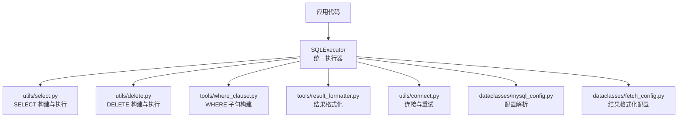
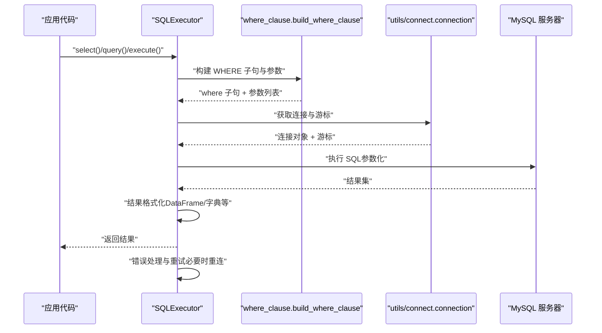
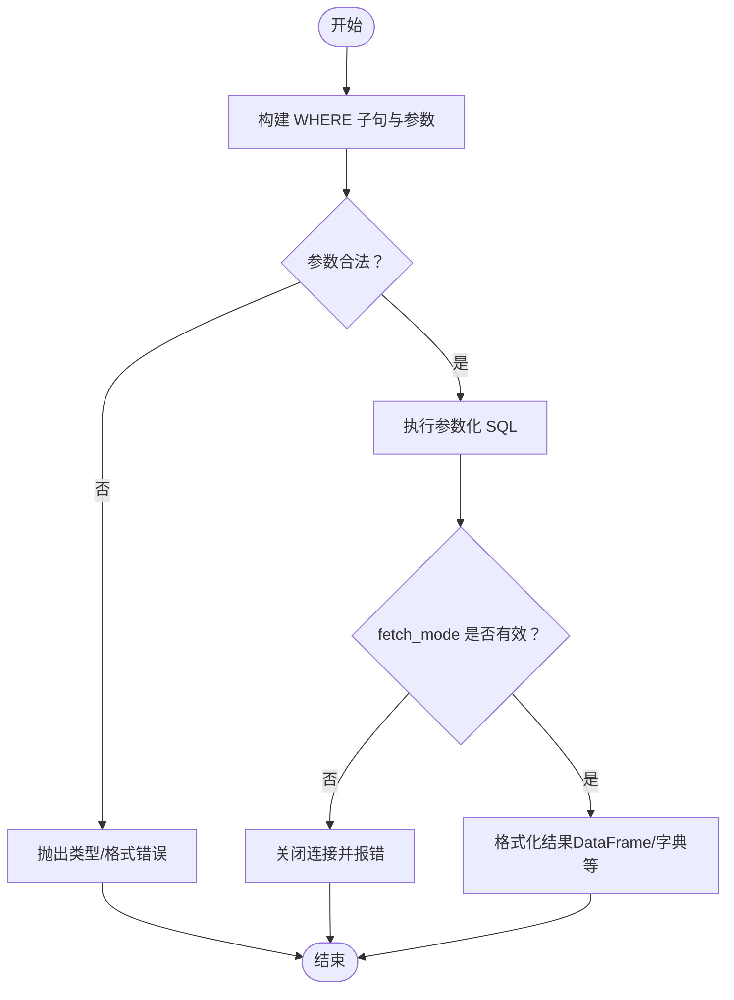
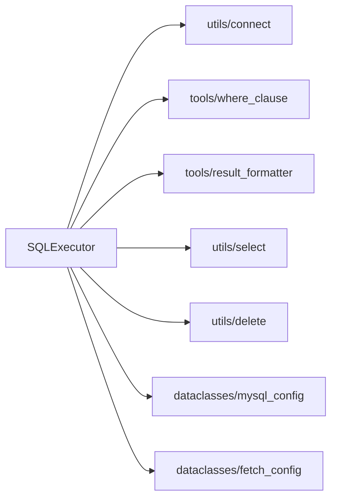

# 安全实践

<cite>
**本文引用的文件**
- [lazy_mysql/__init__.py](file://lazy_mysql/__init__.py)
- [lazy_mysql/executor.py](file://lazy_mysql/executor.py)
- [lazy_mysql/utils/connect.py](file://lazy_mysql/utils/connect.py)
- [lazy_mysql/dataclasses/mysql_config.py](file://lazy_mysql/dataclasses/mysql_config.py)
- [lazy_mysql/dataclasses/fetch_config.py](file://lazy_mysql/dataclasses/fetch_config.py)
- [lazy_mysql/utils/select.py](file://lazy_mysql/utils/select.py)
- [lazy_mysql/utils/delete.py](file://lazy_mysql/utils/delete.py)
- [lazy_mysql/tools/where_clause.py](file://lazy_mysql/tools/where_clause.py)
- [lazy_mysql/tools/sql_utils.py](file://lazy_mysql/tools/sql_utils.py)
- [lazy_mysql/tools/result_formatter.py](file://lazy_mysql/tools/result_formatter.py)
- [docs/CONNECTION.md](file://docs/CONNECTION.md)
- [docs/QUERY.md](file://docs/QUERY.md)
- [docs/code_reviews/fixed/2026-06-15-Yuanbao-代码审查报告.md](file://docs/code_reviews/fixed/2026-06-15-Yuanbao-代码审查报告.md)
- [docs/code_reviews/fixed/2026-06-18-Yuanbao-代码审查报告.md](file://docs/code_reviews/fixed/2026-06-18-Yuanbao-代码审查报告.md)
- [tests/test_sql_config.py](file://tests/test_sql_config.py)
</cite>

## 目录
1. [简介](#简介)
2. [项目结构](#项目结构)
3. [核心组件](#核心组件)
4. [架构总览](#架构总览)
5. [详细组件分析](#详细组件分析)
6. [依赖分析](#依赖分析)
7. [性能考虑](#性能考虑)
8. [故障排查指南](#故障排查指南)
9. [结论](#结论)
10. [附录](#附录)

## 简介
本指南聚焦于 lazy_mysql 的安全编程最佳实践，围绕“参数化查询”“敏感数据处理”“连接安全配置”“安全审计与漏洞检测”等方面展开，结合仓库中现有实现与代码审查报告，给出可操作的安全建议与对比示例，帮助开发者在使用本库时规避常见安全风险。

## 项目结构
lazy_mysql 采用模块化设计，核心围绕 SQLExecutor 执行器与若干工具模块协作：
- 执行器层：SQLExecutor 提供统一的执行接口，封装连接、执行、结果格式化与错误处理
- 工具层：where_clause、sql_utils、result_formatter 等负责 WHERE 子句构建、SQL 片段与结果格式化
- 配置层：MySQLConfig、FetchConfig 提供配置解析与结果格式化约束
- 连接层：utils/connect 提供连接建立、重试与游标配置

图表来源
- [lazy_mysql/executor.py:14-616](file://lazy_mysql/executor.py#L14-L616)
- [lazy_mysql/utils/select.py:1-237](file://lazy_mysql/utils/select.py#L1-L237)
- [lazy_mysql/utils/delete.py:1-26](file://lazy_mysql/utils/delete.py#L1-L26)
- [lazy_mysql/tools/where_clause.py:1-127](file://lazy_mysql/tools/where_clause.py#L1-L127)
- [lazy_mysql/tools/result_formatter.py:1-77](file://lazy_mysql/tools/result_formatter.py#L1-L77)
- [lazy_mysql/utils/connect.py:1-91](file://lazy_mysql/utils/connect.py#L1-L91)
- [lazy_mysql/dataclasses/mysql_config.py:1-135](file://lazy_mysql/dataclasses/mysql_config.py#L1-L135)
- [lazy_mysql/dataclasses/fetch_config.py:1-24](file://lazy_mysql/dataclasses/fetch_config.py#L1-L24)

章节来源
- [lazy_mysql/__init__.py:1-21](file://lazy_mysql/__init__.py#L1-L21)
- [docs/CONNECTION.md:1-334](file://docs/CONNECTION.md#L1-L334)

## 核心组件
- SQLExecutor：统一执行入口，支持 execute、query、select、exists、update、batch_update、delete 等；内置连接错误重试与回滚逻辑
- MySQLConfig：集中解析配置来源（显式参数、字典、环境变量），并进行类型校验与空值处理
- where_clause.build_where_clause：将条件字典安全地转换为 WHERE 子句与参数列表，防止 SQL 注入
- result_formatter.fetch_format：根据 FetchConfig 控制结果格式化，支持 DataFrame、字典列表等
- tools/sql_utils.add_limit：早期实现存在 IN/NOT IN 参数化不足的问题，已在代码审查中提出修复建议

章节来源
- [lazy_mysql/executor.py:14-616](file://lazy_mysql/executor.py#L14-L616)
- [lazy_mysql/dataclasses/mysql_config.py:1-135](file://lazy_mysql/dataclasses/mysql_config.py#L1-L135)
- [lazy_mysql/tools/where_clause.py:42-127](file://lazy_mysql/tools/where_clause.py#L42-L127)
- [lazy_mysql/tools/result_formatter.py:1-77](file://lazy_mysql/tools/result_formatter.py#L1-L77)
- [lazy_mysql/tools/sql_utils.py:1-53](file://lazy_mysql/tools/sql_utils.py#L1-L53)

## 架构总览
下图展示了 SQLExecutor 的关键流程：参数化查询、WHERE 子句构建、结果格式化与错误处理。

图表来源
- [lazy_mysql/executor.py:126-185](file://lazy_mysql/executor.py#L126-L185)
- [lazy_mysql/utils/select.py:114-156](file://lazy_mysql/utils/select.py#L114-L156)
- [lazy_mysql/tools/where_clause.py:42-127](file://lazy_mysql/tools/where_clause.py#L42-L127)
- [lazy_mysql/utils/connect.py:16-91](file://lazy_mysql/utils/connect.py#L16-L91)

## 详细组件分析

### 参数化查询与 SQL 注入防护
- 安全模式（推荐）
  - 使用 SQLExecutor.execute/query/select 等方法，传入 SQL 语句与 params 参数，底层通过游标执行器进行参数化绑定
  - where_clause.build_where_clause 将条件字典安全转换为 WHERE 子句与参数列表，避免字符串拼接
  - result_formatter.fetch_format 仅在 fetch_mode 正确时才进行结果读取，防止未返回结果集时报错
- 不安全模式（应避免）
  - 直接拼接用户输入到 SQL 字符串中
  - 使用字符串格式化（f-string、%）拼接字段名、表名或不受控的值
  - 在 IN/NOT IN 场景中未使用占位符，导致参数未被参数化

图表来源
- [lazy_mysql/tools/where_clause.py:42-127](file://lazy_mysql/tools/where_clause.py#L42-L127)
- [lazy_mysql/tools/result_formatter.py:3-77](file://lazy_mysql/tools/result_formatter.py#L3-L77)
- [lazy_mysql/executor.py:126-185](file://lazy_mysql/executor.py#L126-L185)

章节来源
- [lazy_mysql/executor.py:126-185](file://lazy_mysql/executor.py#L126-L185)
- [lazy_mysql/tools/where_clause.py:17-39](file://lazy_mysql/tools/where_clause.py#L17-L39)
- [docs/QUERY.md:204-209](file://docs/QUERY.md#L204-L209)

### 动态 SQL 构建的安全注意事项
- 字段名与表名
  - 不应直接拼接用户输入到字段名/表名位置，应进行白名单校验或仅允许字母、数字、下划线等限定字符
  - 代码审查指出 SHOW 系列命令不支持参数化，需在函数入口处进行严格校验
- 比较运算符与 IN 列表
  - 使用 IN/NOT IN 时，应为每个元素生成占位符并传入参数列表，避免字符串拼接
  - 代码审查建议将 add_limit 改为返回 (sql_fragment, params) 元组，便于统一参数化

章节来源
- [docs/code_reviews/fixed/2026-06-15-Yuanbao-代码审查报告.md:58-75](file://docs/code_reviews/fixed/2026-06-15-Yuanbao-代码审查报告.md#L58-L75)
- [docs/code_reviews/fixed/2026-06-15-Yuanbao-代码审查报告.md:77-84](file://docs/code_reviews/fixed/2026-06-15-Yuanbao-代码_review_report.md#L77-L84)
- [lazy_mysql/tools/sql_utils.py:38-52](file://lazy_mysql/tools/sql_utils.py#L38-L52)

### 敏感数据处理最佳实践
- 密码与凭据
  - 使用 MySQLConfig.from_env 从环境变量读取凭据，避免硬编码
  - 配置解析过程中对空字符串进行转换，避免误用空值覆盖
- 加密与传输
  - 本项目未直接提供加密功能；建议在应用层对敏感数据进行入库前加密、出库后解密
  - 连接层可通过底层连接器配置 SSL/TLS（如需），但本仓库未在默认连接中启用
- 访问控制
  - 为不同环境创建最小权限账户，避免使用 root 或高权限账号
  - 通过数据库层面的权限控制与审计日志，限制可执行的操作范围

章节来源
- [lazy_mysql/dataclasses/mysql_config.py:47-80](file://lazy_mysql/dataclasses/mysql_config.py#L47-L80)
- [docs/CONNECTION.md:56-80](file://docs/CONNECTION.md#L56-L80)

### 连接安全配置
- 连接参数与重试
  - 连接函数支持重试与延迟递增，自动处理超时与接口错误
  - 建议在应用层使用上下文管理器或 try/finally 确保连接关闭
- 游标与缓冲
  - 默认使用缓冲游标，避免“未读结果”问题；可根据需要切换字典游标
- 版本兼容性
  - 连接器版本检查提示，建议升级至推荐版本以获得更好的安全性与稳定性

章节来源
- [lazy_mysql/utils/connect.py:16-91](file://lazy_mysql/utils/connect.py#L16-L91)
- [docs/CONNECTION.md:180-228](file://docs/CONNECTION.md#L180-L228)

### 安全审计与漏洞检测
- 自动化审查发现
  - IN/NOT IN 未参数化：已在代码审查中提出修复建议
  - SHOW 命令不支持参数化：建议对表名进行白名单校验
- 建议的检测清单
  - 回归测试：覆盖参数化查询、IN 列表、NULL/NOT NULL、NDayInterval 等边界条件
  - 静态分析：对 SQL 拼接点进行扫描，确保仅在受控位置进行字符串拼接
  - 运行时审计：记录 SQL 与参数（脱敏敏感字段），便于追踪潜在风险

章节来源
- [docs/code_reviews/fixed/2026-06-15-Yuanbao-代码审查报告.md:58-75](file://docs/code_reviews/fixed/2026-06-15-Yuanbao-代码审查报告.md#L58-L75)
- [docs/code_reviews/fixed/2026-06-18-Yuanbao-代码审查报告.md:55-82](file://docs/code_reviews/fixed/2026-06-18-Yuanbao-代码审查报告.md#L55-L82)

### 实际代码示例（安全 vs 不安全）

- 安全：使用参数化查询
  - 使用 execute/query/select 的 params 参数传递用户输入
  - 使用 where_clause 构建 WHERE 子句，避免字符串拼接
  - 参考路径：[lazy_mysql/executor.py:126-185](file://lazy_mysql/executor.py#L126-L185)，[lazy_mysql/tools/where_clause.py:42-127](file://lazy_mysql/tools/where_clause.py#L42-L127)
- 不安全：直接拼接用户输入
  - 将用户输入直接拼接到 SQL 字符串中
  - IN/NOT IN 未使用占位符，导致参数未被参数化
  - 参考路径：[lazy_mysql/tools/sql_utils.py:38-52](file://lazy_mysql/tools/sql_utils.py#L38-L52)，[docs/code_reviews/fixed/2026-06-15-Yuanbao-代码审查报告.md:77-84](file://docs/code_reviews/fixed/2026-06-15-Yuanbao-代码审查报告.md#L77-L84)

## 依赖分析
- 组件耦合
  - SQLExecutor 依赖连接层、工具层与配置层；工具层之间相对独立，便于维护
- 外部依赖
  - mysql-connector-python：连接与参数化执行的基础
  - pandas：可选结果格式化（DataFrame）
- 循环依赖
  - 未发现循环导入；各模块职责清晰

图表来源
- [lazy_mysql/executor.py:1-616](file://lazy_mysql/executor.py#L1-L616)
- [lazy_mysql/utils/connect.py:1-91](file://lazy_mysql/utils/connect.py#L1-L91)
- [lazy_mysql/tools/where_clause.py:1-127](file://lazy_mysql/tools/where_clause.py#L1-L127)
- [lazy_mysql/tools/result_formatter.py:1-77](file://lazy_mysql/tools/result_formatter.py#L1-L77)
- [lazy_mysql/utils/select.py:1-237](file://lazy_mysql/utils/select.py#L1-L237)
- [lazy_mysql/utils/delete.py:1-26](file://lazy_mysql/utils/delete.py#L1-L26)
- [lazy_mysql/dataclasses/mysql_config.py:1-135](file://lazy_mysql/dataclasses/mysql_config.py#L1-L135)
- [lazy_mysql/dataclasses/fetch_config.py:1-24](file://lazy_mysql/dataclasses/fetch_config.py#L1-L24)

## 性能考虑
- 连接与重试
  - 合理设置重试次数与延迟，避免瞬时网络波动导致的频繁重试
- 查询优化
  - EXISTS 优化：使用 SELECT 1 并 LIMIT 1，避免全表扫描
  - IN 列表大小：大批量 IN 时考虑临时表或分批处理
- 结果格式化
  - DataFrame 转换适合离线分析，实时接口建议使用元组或字典列表

章节来源
- [lazy_mysql/utils/select.py:159-237](file://lazy_mysql/utils/select.py#L159-L237)
- [lazy_mysql/tools/result_formatter.py:16-77](file://lazy_mysql/tools/result_formatter.py#L16-L77)

## 故障排查指南
- 常见错误分类
  - 连接失败：超时、DNS 解析失败、网络不可达；支持自动重试
  - 权限错误：用户名或密码错误、数据库不存在
  - 未返回结果集：游标提前关闭或查询非 DQL
- 排查步骤
  - 检查连接参数与环境变量
  - 验证 SQL 与参数是否匹配（占位符数量与类型）
  - 使用 EXISTS 或 LIMIT 1 优化定位问题
  - 查看连接器版本与兼容性提示

章节来源
- [lazy_mysql/utils/connect.py:180-228](file://lazy_mysql/utils/connect.py#L180-L228)
- [lazy_mysql/executor.py:62-106](file://lazy_mysql/executor.py#L62-L106)
- [docs/CONNECTION.md:180-228](file://docs/CONNECTION.md#L180-L228)

## 结论
lazy_mysql 在参数化查询与 WHERE 子句构建方面具备良好的安全基线，但在 IN/NOT IN 参数化与 SHOW 命令的表名校验方面仍存在风险点。建议在应用层严格执行“参数化优先”“白名单校验”“最小权限”原则，并结合自动化审查与回归测试持续提升安全性。

## 附录

### 安全配置要点清单
- 使用 MySQLConfig.from_env 从环境变量读取凭据
- 所有用户输入通过 params 传入，避免字符串拼接
- IN/NOT IN 使用占位符逐项绑定
- 对表名/库名进行白名单校验
- 为不同环境配置最小权限账户
- 使用上下文管理器确保连接关闭

章节来源
- [lazy_mysql/dataclasses/mysql_config.py:47-80](file://lazy_mysql/dataclasses/mysql_config.py#L47-L80)
- [lazy_mysql/tools/sql_utils.py:38-52](file://lazy_mysql/tools/sql_utils.py#L38-L52)
- [docs/code_reviews/fixed/2026-06-15-Yuanbao-代码审查报告.md:58-75](file://docs/code_reviews/fixed/2026-06-15-Yuanbao-代码审查报告.md#L58-L75)