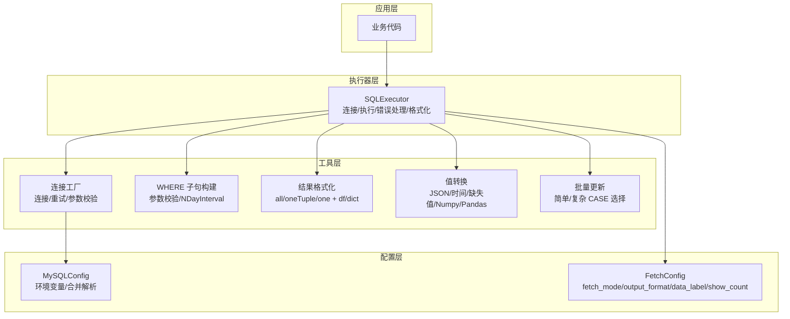
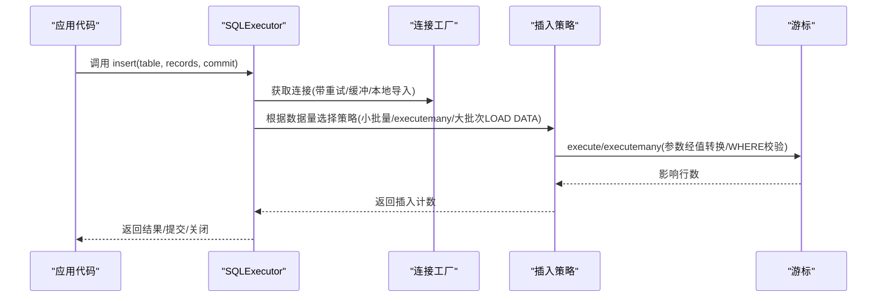
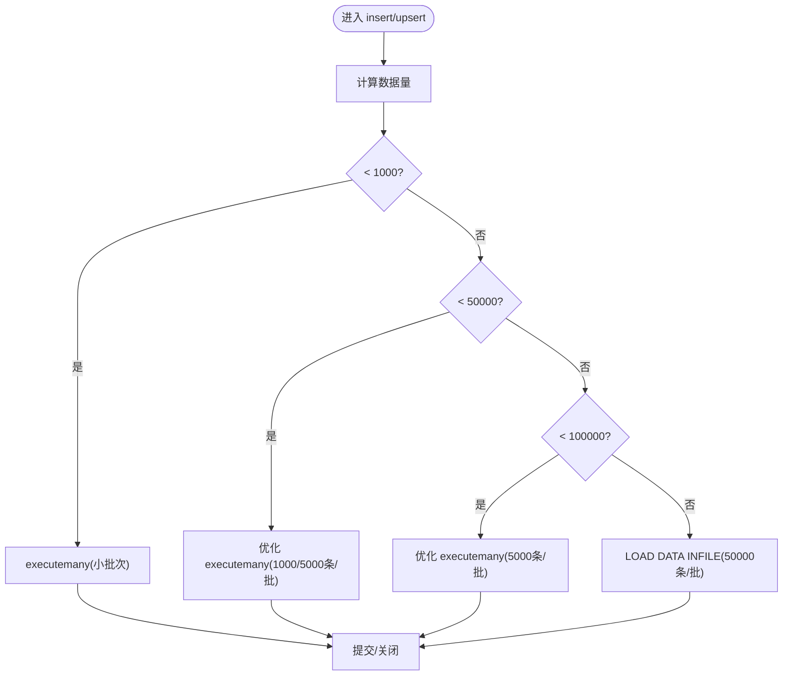
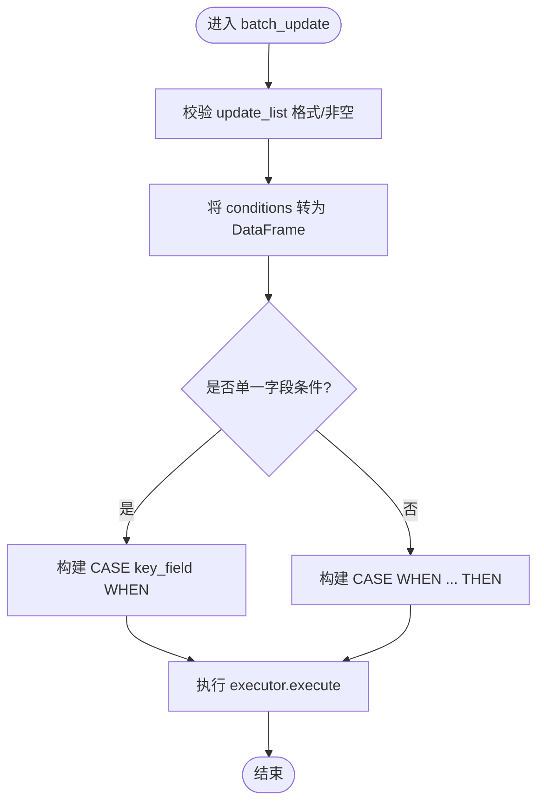
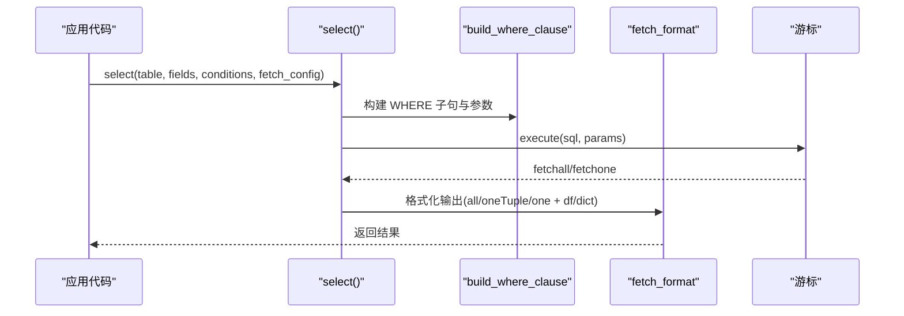
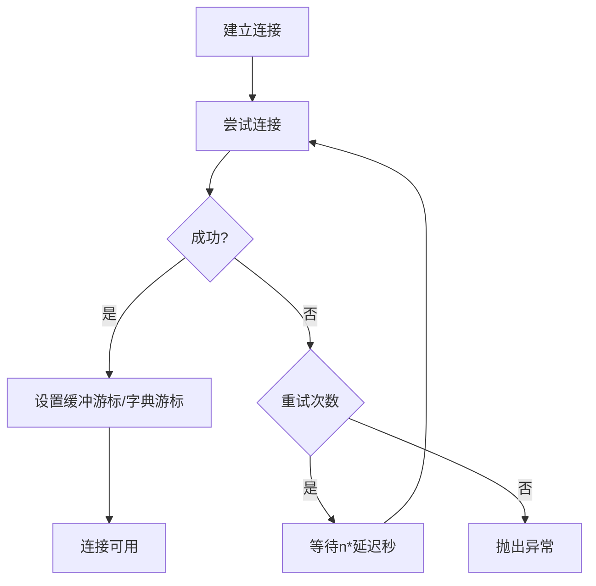
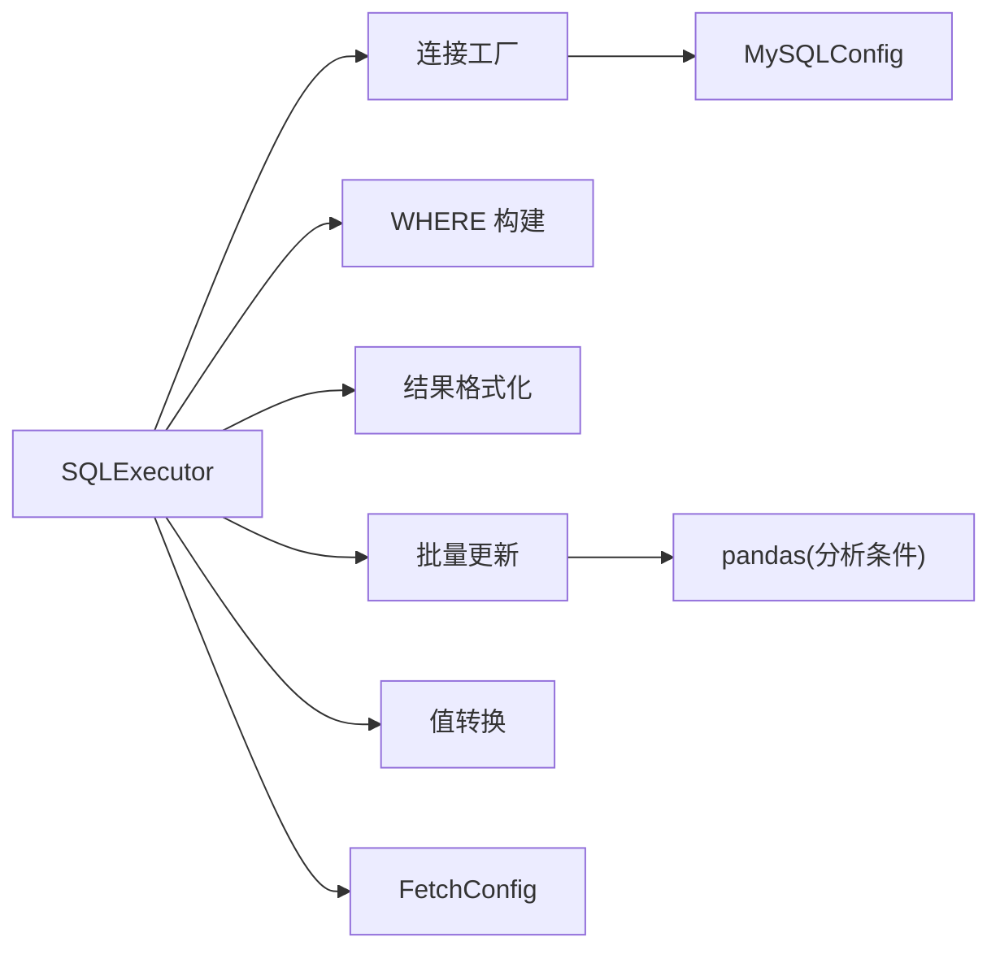

# 性能优化

<cite>
**本文引用的文件**
- [README.md](file://README.md)
- [lazy_mysql/__init__.py](file://lazy_mysql/__init__.py)
- [lazy_mysql/executor.py](file://lazy_mysql/executor.py)
- [lazy_mysql/utils/connect.py](file://lazy_mysql/utils/connect.py)
- [lazy_mysql/dataclasses/mysql_config.py](file://lazy_mysql/dataclasses/mysql_config.py)
- [lazy_mysql/dataclasses/fetch_config.py](file://lazy_mysql/dataclasses/fetch_config.py)
- [lazy_mysql/utils/select.py](file://lazy_mysql/utils/select.py)
- [lazy_mysql/utils/delete.py](file://lazy_mysql/utils/delete.py)
- [lazy_mysql/utils/update/batch_update.py](file://lazy_mysql/utils/update/batch_update.py)
- [lazy_mysql/tools/where_clause.py](file://lazy_mysql/tools/where_clause.py)
- [lazy_mysql/tools/result_formatter.py](file://lazy_mysql/tools/result_formatter.py)
- [lazy_mysql/utils/value_converter.py](file://lazy_mysql/utils/value_converter.py)
- [tests/test_batch_update.py](file://tests/test_batch_update.py)
- [tests/test_insert_conversion.py](file://tests/test_insert_conversion.py)
- [docs/INSERT.md](file://docs/INSERT.md)
</cite>

## 目录
1. [简介](#简介)
2. [项目结构](#项目结构)
3. [核心组件](#核心组件)
4. [架构总览](#架构总览)
5. [详细组件分析](#详细组件分析)
6. [依赖关系分析](#依赖关系分析)
7. [性能考量](#性能考量)
8. [故障排查指南](#故障排查指南)
9. [结论](#结论)
10. [附录](#附录)

## 简介
本指南围绕 lazy_mysql 的性能优化展开，聚焦以下主题：
- 批量操作策略：批量插入、批量更新的最优配置与执行策略
- 连接池配置与管理：连接数、超时、复用与重试
- 查询优化技巧：索引使用建议、查询计划分析、慢查询监控
- 大数据量处理：分页策略、内存管理、并发控制
- 性能测试与基准：测试方法与工具使用
- 调优案例与效果对比：真实场景下的参数与策略建议

## 项目结构
lazy_mysql 通过统一的 SQLExecutor 提供连接、查询、插入、更新、删除等能力，并内置智能策略（如批量插入的多策略选择、批量更新的 CASE 语法优化、WHERE 条件构建与参数校验、结果格式化等）。核心模块如下：
- 执行器层：SQLExecutor 负责连接、执行、错误处理与结果格式化
- 工具层：where_clause 构建 WHERE 子句与参数校验；result_formatter 控制返回格式；value_converter 统一值转换
- 数据类：MySQLConfig、FetchConfig 提供配置解析与结果格式化参数
- 批量更新：基于 pandas 分析条件复杂度，自动选择 CASE WHEN 或 CASE key_field WHEN 简化语法
- 文档与测试：INSERT.md 提供插入策略说明；测试覆盖参数顺序、简单/复杂 CASE 场景与值转换

**图表来源**
- [lazy_mysql/executor.py:14-616](file://lazy_mysql/executor.py#L14-L616)
- [lazy_mysql/utils/connect.py:15-91](file://lazy_mysql/utils/connect.py#L15-L91)
- [lazy_mysql/tools/where_clause.py:42-127](file://lazy_mysql/tools/where_clause.py#L42-L127)
- [lazy_mysql/tools/result_formatter.py:3-77](file://lazy_mysql/tools/result_formatter.py#L3-L77)
- [lazy_mysql/utils/value_converter.py:74-115](file://lazy_mysql/utils/value_converter.py#L74-L115)
- [lazy_mysql/utils/update/batch_update.py:6-313](file://lazy_mysql/utils/update/batch_update.py#L6-L313)
- [lazy_mysql/dataclasses/mysql_config.py:10-135](file://lazy_mysql/dataclasses/mysql_config.py#L10-L135)
- [lazy_mysql/dataclasses/fetch_config.py:8-24](file://lazy_mysql/dataclasses/fetch_config.py#L8-L24)

**章节来源**
- [README.md:1-197](file://README.md#L1-L197)
- [lazy_mysql/__init__.py:1-21](file://lazy_mysql/__init__.py#L1-L21)

## 核心组件
- SQLExecutor：统一入口，封装连接、执行、提交、关闭、重试与结果格式化
- 连接工厂：负责连接建立、重试、缓冲游标、本地文件导入开关
- WHERE 子句构建：支持多种比较运算符、IN/NOT IN、NULL/NOT NULL、NDayInterval
- 结果格式化：支持 all/oneTuple/one，以及 list_1、df、df_dict 等输出格式
- 批量更新：基于 pandas 分析条件复杂度，自动选择 CASE WHEN 或 CASE key_field WHEN
- 值转换：统一处理 JSON、时间、缺失值、Numpy/Pandas 类型，保证数据库兼容性
- 配置：MySQLConfig 支持环境变量与参数合并；FetchConfig 控制结果格式化

**章节来源**
- [lazy_mysql/executor.py:14-616](file://lazy_mysql/executor.py#L14-L616)
- [lazy_mysql/utils/connect.py:15-91](file://lazy_mysql/utils/connect.py#L15-L91)
- [lazy_mysql/tools/where_clause.py:42-127](file://lazy_mysql/tools/where_clause.py#L42-L127)
- [lazy_mysql/tools/result_formatter.py:3-77](file://lazy_mysql/tools/result_formatter.py#L3-L77)
- [lazy_mysql/utils/update/batch_update.py:6-313](file://lazy_mysql/utils/update/batch_update.py#L6-L313)
- [lazy_mysql/utils/value_converter.py:74-115](file://lazy_mysql/utils/value_converter.py#L74-L115)
- [lazy_mysql/dataclasses/mysql_config.py:10-135](file://lazy_mysql/dataclasses/mysql_config.py#L10-L135)
- [lazy_mysql/dataclasses/fetch_config.py:8-24](file://lazy_mysql/dataclasses/fetch_config.py#L8-L24)

## 架构总览
下图展示 SQLExecutor 在执行一次“批量插入”时的关键交互路径，体现连接、策略选择、参数校验与执行流程。

**图表来源**
- [lazy_mysql/executor.py:214-233](file://lazy_mysql/executor.py#L214-L233)
- [lazy_mysql/utils/connect.py:15-91](file://lazy_mysql/utils/connect.py#L15-L91)
- [lazy_mysql/utils/value_converter.py:74-115](file://lazy_mysql/utils/value_converter.py#L74-L115)
- [lazy_mysql/tools/where_clause.py:42-127](file://lazy_mysql/tools/where_clause.py#L42-L127)

## 详细组件分析

### 批量插入与 UPSERT 策略
- 策略选择依据数据量自动切换：
  - 小于 1000 条：标准 executemany
  - 1000-50000 条：优化 executemany（分批大小随阈值调整）
  - 50000-100000 条：优化 executemany（更大批次）
  - ≥100000 条：LOAD DATA INFILE（分批 50000 条）
- UPSERT：基于 MySQL 的 ON DUPLICATE KEY UPDATE，支持单条与批量
- 值转换：自动将 Python/NumPy/Pandas/JSON/时间等类型转换为数据库兼容值
- 事务与连接：支持 commit/self_close，或由上层事务管理

**图表来源**
- [lazy_mysql/executor.py:214-233](file://lazy_mysql/executor.py#L214-L233)
- [docs/INSERT.md:5-243](file://docs/INSERT.md#L5-L243)
- [tests/test_insert_conversion.py:119-211](file://tests/test_insert_conversion.py#L119-L211)

**章节来源**
- [lazy_mysql/executor.py:214-233](file://lazy_mysql/executor.py#L214-L233)
- [docs/INSERT.md:5-243](file://docs/INSERT.md#L5-L243)
- [tests/test_insert_conversion.py:119-211](file://tests/test_insert_conversion.py#L119-L211)

### 批量更新策略（智能 CASE 选择）
- 条件复杂度分析：使用 pandas 检查 WHERE 条件是否仅包含单一字段
- 简单 CASE：CASE key_field WHEN 语法，性能最优
- 复杂 CASE：CASE WHEN ... THEN 语法，支持多字段/复合条件
- 参数顺序与完整性：严格保证 SET 子句参数在 WHERE 子句之前，避免错误

**图表来源**
- [lazy_mysql/utils/update/batch_update.py:6-313](file://lazy_mysql/utils/update/batch_update.py#L6-L313)
- [tests/test_batch_update.py:14-192](file://tests/test_batch_update.py#L14-L192)

**章节来源**
- [lazy_mysql/utils/update/batch_update.py:6-313](file://lazy_mysql/utils/update/batch_update.py#L6-L313)
- [tests/test_batch_update.py:14-192](file://tests/test_batch_update.py#L14-L192)

### 查询与结果格式化
- 查询构建：支持多表 JOIN、DISTINCT、ORDER BY、LIMIT；WHERE 条件通过 build_where_clause 生成
- 结果格式化：支持 all/oneTuple/one，以及 list_1、df、df_dict；可选 show_count
- 存在性快速判断：exists 使用 SELECT 1 LIMIT 1，避免全表扫描

**图表来源**
- [lazy_mysql/utils/select.py:4-156](file://lazy_mysql/utils/select.py#L4-L156)
- [lazy_mysql/tools/where_clause.py:42-127](file://lazy_mysql/tools/where_clause.py#L42-L127)
- [lazy_mysql/tools/result_formatter.py:3-77](file://lazy_mysql/tools/result_formatter.py#L3-L77)

**章节来源**
- [lazy_mysql/utils/select.py:4-156](file://lazy_mysql/utils/select.py#L4-L156)
- [lazy_mysql/tools/where_clause.py:42-127](file://lazy_mysql/tools/where_clause.py#L42-L127)
- [lazy_mysql/tools/result_formatter.py:3-77](file://lazy_mysql/tools/result_formatter.py#L3-L77)

### 连接与错误处理
- 连接参数：缓冲游标、纯 Python 实现、本地文件导入开关
- 重试机制：针对连接超时/丢失错误进行指数退避重试
- 错误兜底：统一错误处理与回滚，必要时自动重连

**图表来源**
- [lazy_mysql/utils/connect.py:15-91](file://lazy_mysql/utils/connect.py#L15-L91)
- [lazy_mysql/executor.py:62-107](file://lazy_mysql/executor.py#L62-L107)

**章节来源**
- [lazy_mysql/utils/connect.py:15-91](file://lazy_mysql/utils/connect.py#L15-L91)
- [lazy_mysql/executor.py:62-107](file://lazy_mysql/executor.py#L62-L107)

## 依赖关系分析
- SQLExecutor 依赖连接工厂、WHERE 构建、结果格式化、批量更新、值转换与配置类
- 批量更新依赖 pandas 进行条件复杂度分析
- 查询路径依赖 WHERE 构建与结果格式化
- 配置类支持环境变量与参数合并，确保灵活部署

**图表来源**
- [lazy_mysql/executor.py:14-616](file://lazy_mysql/executor.py#L14-L616)
- [lazy_mysql/utils/update/batch_update.py:1-3](file://lazy_mysql/utils/update/batch_update.py#L1-L3)
- [lazy_mysql/dataclasses/mysql_config.py:10-135](file://lazy_mysql/dataclasses/mysql_config.py#L10-L135)
- [lazy_mysql/dataclasses/fetch_config.py:8-24](file://lazy_mysql/dataclasses/fetch_config.py#L8-L24)

**章节来源**
- [lazy_mysql/executor.py:14-616](file://lazy_mysql/executor.py#L14-L616)
- [lazy_mysql/utils/update/batch_update.py:1-3](file://lazy_mysql/utils/update/batch_update.py#L1-L3)
- [lazy_mysql/dataclasses/mysql_config.py:10-135](file://lazy_mysql/dataclasses/mysql_config.py#L10-L135)
- [lazy_mysql/dataclasses/fetch_config.py:8-24](file://lazy_mysql/dataclasses/fetch_config.py#L8-L24)

## 性能考量
- 批量插入
  - 小批量（<1000）：executemany，参数少、事务短
  - 中批量（1k-5w）：分批 1000/5000，平衡内存与网络往返
  - 大批量（≥5w）：LOAD DATA INFILE 分批 50000，显著降低网络与协议开销
  - 值转换：提前将复杂类型序列化/标准化，减少数据库端转换成本
- 批量更新
  - 单一主键条件：CASE key_field WHEN 语法，单条 SQL 更新多行，减少网络往返
  - 复杂条件：CASE WHEN ... THEN，支持多字段/复合条件，注意参数顺序与 WHERE 连接
- 查询优化
  - EXISTS 优化：SELECT 1 LIMIT 1 避免全表扫描
  - WHERE 条件：使用 IN/范围/索引列，避免函数包裹导致索引失效
  - 结果格式化：大数据量优先使用 df/dict，但注意内存占用
- 连接与并发
  - 使用缓冲游标避免“未读结果”错误
  - 重试与超时：合理设置重试次数与延迟，避免瞬时抖动影响吞吐
  - 连接复用：在事务内复用同一连接，减少握手与上下文切换
- 大数据量处理
  - 分页：LIMIT/OFFSET 或基于游标的增量拉取
  - 内存：优先使用流式/分块处理，避免一次性载入
  - 并发：控制并发度，避免数据库连接池饱和

[本节为通用性能指导，无需列出具体文件来源]

## 故障排查指南
- 连接失败/超时
  - 检查重试日志与延迟；确认网络与数据库可达
  - 核对连接参数（主机、端口、用户、密码、数据库）
- 批量执行参数错误
  - 确认参数类型与格式；避免空参数集
  - 对于 SELECT，禁止批量执行（会显著降低性能）
- WHERE 条件异常
  - 检查 IN 列表元素类型；避免 numpy 类型直接写入
  - Dict 类型自动 JSON 序列化，确保可序列化
- 结果格式化错误
  - 当 output_format 为 df/dict 时，data_label 必须提供且长度匹配
- 批量更新参数顺序
  - SET 子句参数在前，WHERE 子句参数在后；测试用例验证了参数顺序正确性

**章节来源**
- [lazy_mysql/executor.py:147-185](file://lazy_mysql/executor.py#L147-L185)
- [lazy_mysql/tools/where_clause.py:17-39](file://lazy_mysql/tools/where_clause.py#L17-L39)
- [lazy_mysql/tools/result_formatter.py:26-53](file://lazy_mysql/tools/result_formatter.py#L26-L53)
- [tests/test_batch_update.py:14-84](file://tests/test_batch_update.py#L14-L84)

## 结论
lazy_mysql 通过“策略自适应 + 参数与类型统一 + 结果格式化 + 连接重试”的设计，在批量插入、批量更新、查询与结果处理等方面实现了良好的性能与易用性。结合本文的配置建议与最佳实践，可在不同规模与场景下获得稳定、高效的数据库操作体验。

[本节为总结性内容，无需列出具体文件来源]

## 附录

### A. 连接池配置与管理
- 连接参数要点
  - buffered=True：避免“未读结果”错误，适合多查询场景
  - use_pure=True：提高兼容性，减少外部依赖
  - allow_local_infile=True：启用 LOAD DATA INFILE
- 重试策略
  - 最大重试次数与延迟基数可调，避免瞬时抖动放大
- 连接复用
  - 在事务内复用同一连接，减少握手与上下文切换
  - 使用 commit/self_close 或上层事务管理

**章节来源**
- [lazy_mysql/utils/connect.py:15-91](file://lazy_mysql/utils/connect.py#L15-L91)
- [lazy_mysql/executor.py:109-124](file://lazy_mysql/executor.py#L109-L124)

### B. 查询优化与慢查询监控
- 索引使用建议
  - WHERE 条件中的等值/范围/IN 列尽量命中索引
  - 避免在索引列上使用函数或表达式
- 查询计划分析
  - 使用 EXPLAIN/ANALYZE 查看执行计划，关注全表扫描与回表次数
- 慢查询监控
  - 开启慢查询日志，定位耗时 SQL
  - 结合 EXISTS 优化替代 COUNT/全表扫描

[本节为通用指导，无需列出具体文件来源]

### C. 大数据量处理最佳实践
- 分页策略
  - LIMIT/OFFSET 或基于游标的增量拉取，避免一次性加载
- 内存管理
  - 优先使用流式/分块处理；DataFrame 仅在必要时生成
- 并发控制
  - 控制并发度，避免数据库连接池饱和；合理设置重试与超时

[本节为通用指导，无需列出具体文件来源]

### D. 性能测试与基准
- 测试方法
  - 使用固定数据集（如 1 万、10 万条）对比不同策略耗时
  - 记录网络与 CPU 占用，评估不同批次大小的影响
- 基准工具
  - 使用 pytest 与性能计时器（如 time.perf_counter）
  - 结合数据库慢查询日志与系统监控指标

**章节来源**
- [tests/test_insert_conversion.py:1-211](file://tests/test_insert_conversion.py#L1-L211)
- [tests/test_batch_update.py:1-192](file://tests/test_batch_update.py#L1-L192)

### E. 调优案例与效果对比
- 批量插入
  - 小批量（<1k）：executemany
  - 中批量（1k-5w）：分批 1000/5000
  - 大批量（≥5w）：LOAD DATA INFILE 分批 50000
- 批量更新
  - 单一主键条件：CASE key_field WHEN 语法，单 SQL 多行更新
  - 复杂条件：CASE WHEN ... THEN，注意参数顺序与 WHERE 连接
- 查询
  - EXISTS 替代 COUNT/全表扫描，显著降低 IO

**章节来源**
- [docs/INSERT.md:5-243](file://docs/INSERT.md#L5-L243)
- [lazy_mysql/utils/update/batch_update.py:6-313](file://lazy_mysql/utils/update/batch_update.py#L6-L313)
- [lazy_mysql/utils/select.py:159-237](file://lazy_mysql/utils/select.py#L159-L237)