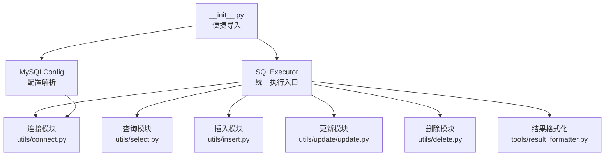
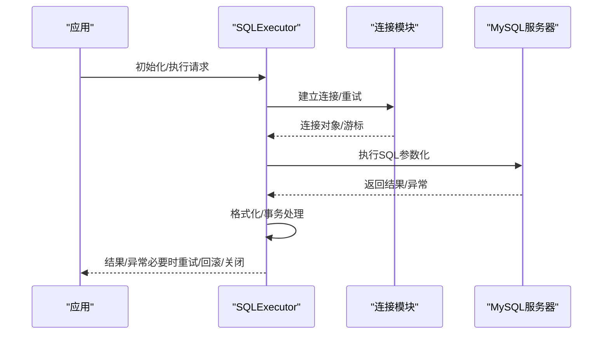
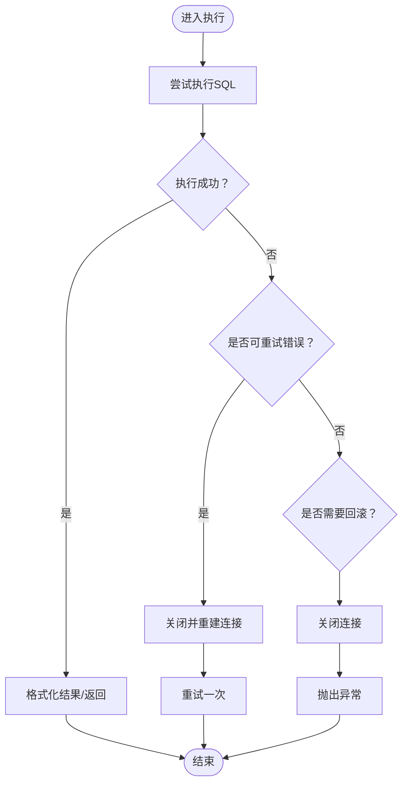
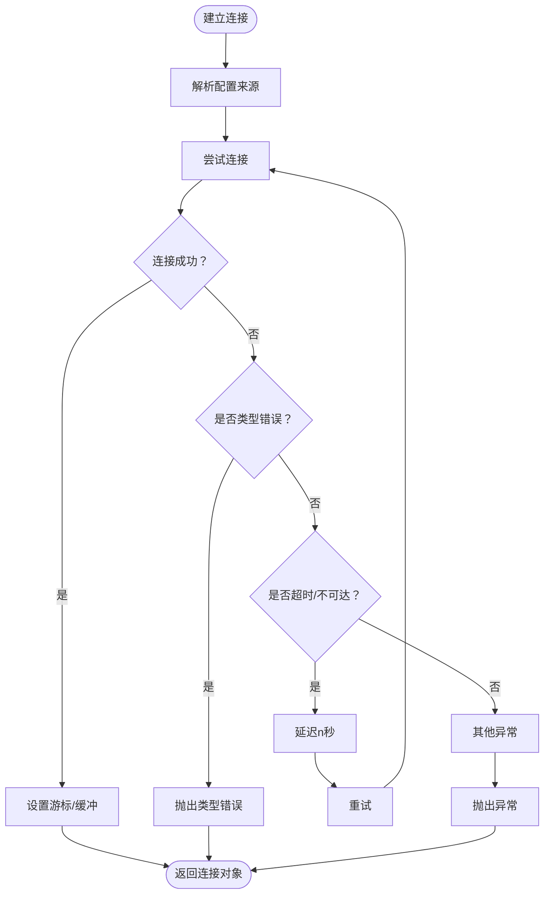
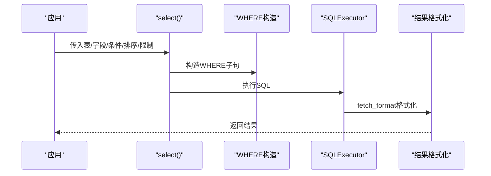
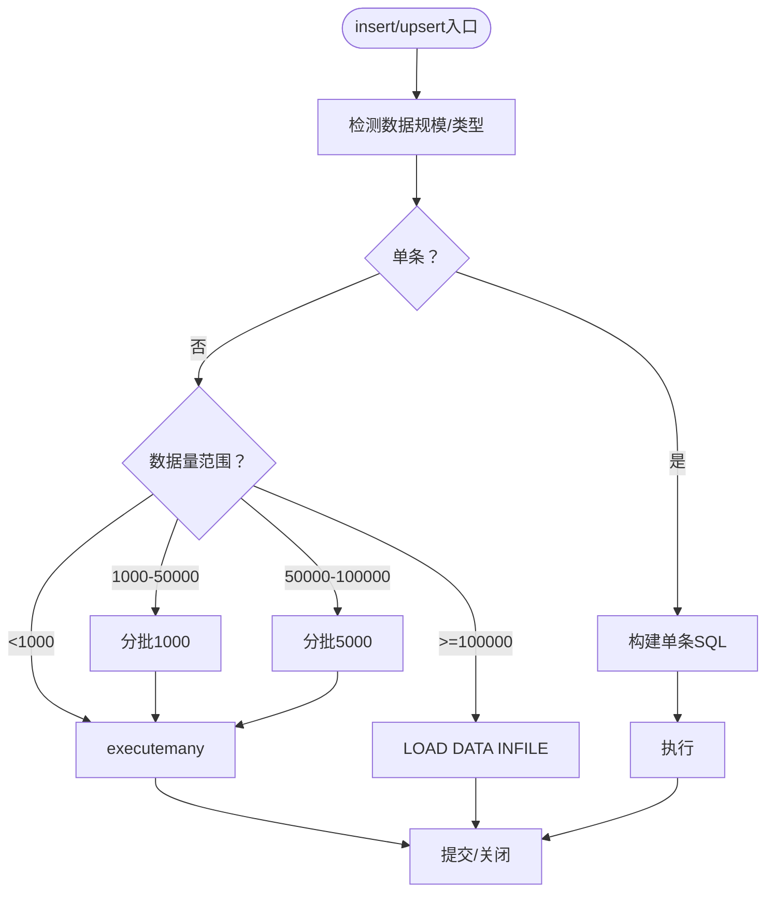
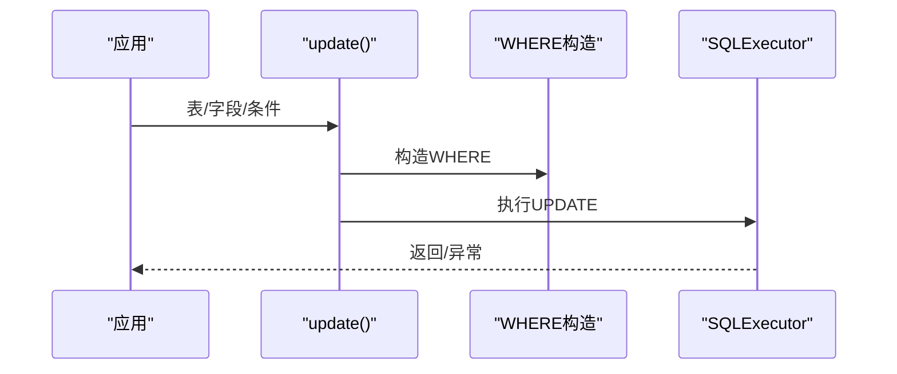
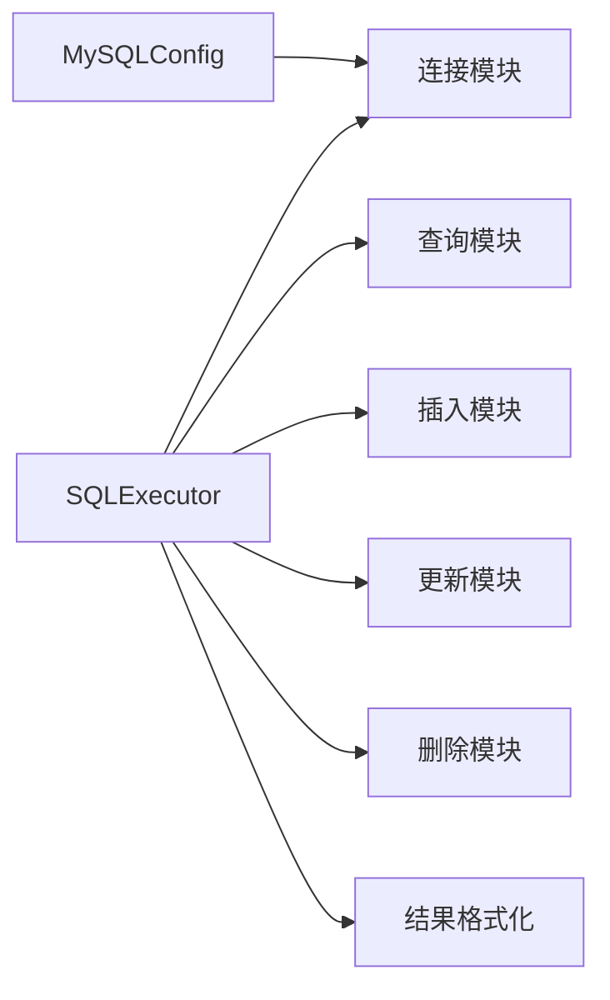

# 故障排除

<cite>
**本文引用的文件**
- [README.md](file://README.md)
- [lazy_mysql/__init__.py](file://lazy_mysql/__init__.py)
- [lazy_mysql/executor.py](file://lazy_mysql/executor.py)
- [lazy_mysql/utils/connect.py](file://lazy_mysql/utils/connect.py)
- [lazy_mysql/dataclasses/mysql_config.py](file://lazy_mysql/dataclasses/mysql_config.py)
- [lazy_mysql/utils/select.py](file://lazy_mysql/utils/select.py)
- [lazy_mysql/utils/insert.py](file://lazy_mysql/utils/insert.py)
- [lazy_mysql/utils/update/update.py](file://lazy_mysql/utils/update/update.py)
- [lazy_mysql/utils/delete.py](file://lazy_mysql/utils/delete.py)
- [lazy_mysql/tools/result_formatter.py](file://lazy_mysql/tools/result_formatter.py)
- [docs/CONNECTION.md](file://docs/CONNECTION.md)
- [docs/QUERY.md](file://docs/QUERY.md)
- [docs/SELECT.md](file://docs/SELECT.md)
- [docs/INSERT.md](file://docs/INSERT.md)
- [docs/DELETE.md](file://docs/DELETE.md)
</cite>

## 目录
1. [简介](#简介)
2. [项目结构](#项目结构)
3. [核心组件](#核心组件)
4. [架构总览](#架构总览)
5. [详细组件分析](#详细组件分析)
6. [依赖关系分析](#依赖关系分析)
7. [性能考量](#性能考量)
8. [故障排除指南](#故障排除指南)
9. [结论](#结论)
10. [附录](#附录)

## 简介
本指南面向使用 lazy_mysql 的开发者与运维人员，聚焦“故障排除与问题解决”。内容涵盖连接失败、查询超时、数据不一致、事务与资源泄漏、死锁与并发问题等常见问题的诊断与修复方法；同时提供调试技巧、日志分析、性能监控与数据库状态检查要点，以及问题分类与优先级评估、生产应急流程与社区求助最佳实践。

## 项目结构
lazy_mysql 采用模块化设计，围绕 SQLExecutor 统一入口，配合数据类、工具函数与各操作模块（select/insert/update/delete）协作完成数据库操作。核心文件与职责如下：
- 执行器与入口：executor.py、__init__.py
- 连接与配置：utils/connect.py、dataclasses/mysql_config.py
- 查询与结果格式化：utils/select.py、tools/result_formatter.py
- 数据变更：utils/insert.py、utils/update/update.py、utils/delete.py
- 文档与使用指南：docs 下各主题文档

图表来源
- [lazy_mysql/executor.py](file://lazy_mysql/executor.py)
- [lazy_mysql/utils/connect.py](file://lazy_mysql/utils/connect.py)
- [lazy_mysql/utils/select.py](file://lazy_mysql/utils/select.py)
- [lazy_mysql/utils/insert.py](file://lazy_mysql/utils/insert.py)
- [lazy_mysql/utils/update/update.py](file://lazy_mysql/utils/update/update.py)
- [lazy_mysql/utils/delete.py](file://lazy_mysql/utils/delete.py)
- [lazy_mysql/tools/result_formatter.py](file://lazy_mysql/tools/result_formatter.py)
- [lazy_mysql/__init__.py](file://lazy_mysql/__init__.py)
- [lazy_mysql/dataclasses/mysql_config.py](file://lazy_mysql/dataclasses/mysql_config.py)

章节来源
- [lazy_mysql/executor.py](file://lazy_mysql/executor.py)
- [lazy_mysql/utils/connect.py](file://lazy_mysql/utils/connect.py)
- [lazy_mysql/dataclasses/mysql_config.py](file://lazy_mysql/dataclasses/mysql_config.py)
- [lazy_mysql/utils/select.py](file://lazy_mysql/utils/select.py)
- [lazy_mysql/utils/insert.py](file://lazy_mysql/utils/insert.py)
- [lazy_mysql/utils/update/update.py](file://lazy_mysql/utils/update/update.py)
- [lazy_mysql/utils/delete.py](file://lazy_mysql/utils/delete.py)
- [lazy_mysql/tools/result_formatter.py](file://lazy_mysql/tools/result_formatter.py)
- [lazy_mysql/__init__.py](file://lazy_mysql/__init__.py)

## 核心组件
- SQLExecutor：统一的数据库操作入口，封装连接、执行、结果格式化、事务提交/回滚、连接关闭与重连逻辑。
- MySQLConfig：集中解析与合并配置来源（显式参数、字典、环境变量），并提供默认值与校验。
- 连接模块：负责建立连接、重试、游标类型与缓冲设置、版本兼容提示。
- 查询/插入/更新/删除模块：分别实现 select、insert/upsert、update、delete 的 SQL 构造与执行。
- 结果格式化：将游标结果转换为 list、DataFrame、字典列表等格式，并支持计数输出。

章节来源
- [lazy_mysql/executor.py](file://lazy_mysql/executor.py)
- [lazy_mysql/dataclasses/mysql_config.py](file://lazy_mysql/dataclasses/mysql_config.py)
- [lazy_mysql/utils/connect.py](file://lazy_mysql/utils/connect.py)
- [lazy_mysql/utils/select.py](file://lazy_mysql/utils/select.py)
- [lazy_mysql/utils/insert.py](file://lazy_mysql/utils/insert.py)
- [lazy_mysql/utils/update/update.py](file://lazy_mysql/utils/update/update.py)
- [lazy_mysql/utils/delete.py](file://lazy_mysql/utils/delete.py)
- [lazy_mysql/tools/result_formatter.py](file://lazy_mysql/tools/result_formatter.py)

## 架构总览
下图展示从应用到数据库的关键交互路径与错误处理策略：

图表来源
- [lazy_mysql/executor.py](file://lazy_mysql/executor.py)
- [lazy_mysql/utils/connect.py](file://lazy_mysql/utils/connect.py)

## 详细组件分析

### SQLExecutor 执行与错误处理
- 统一错误处理：内置可重试错误关键字识别（连接丢失、读取超时、超时错误），在首次检测到可重试错误时尝试重建连接并重试一次。
- 事务与回滚：commit/close 时若发生错误，自动回滚并关闭连接，避免半提交状态。
- 结果格式化：委托 result_formatter 完成 fetch_mode/output_format/data_label 的转换。
- 查询/写入：select/query/insert/upsert/update/delete 均通过 execute/fetch_format 统一调度，保证参数化与异常处理一致性。

图表来源
- [lazy_mysql/executor.py](file://lazy_mysql/executor.py)
- [lazy_mysql/tools/result_formatter.py](file://lazy_mysql/tools/result_formatter.py)

章节来源
- [lazy_mysql/executor.py](file://lazy_mysql/executor.py)
- [lazy_mysql/tools/result_formatter.py](file://lazy_mysql/tools/result_formatter.py)

### 连接与重试机制
- 连接参数优先级：SQLExecutor 显式 database > MySQLConfig 显式参数/字典 > 环境变量；空值不覆盖。
- 重试策略：针对 ConnectionTimeoutError/InterfaceError 自动重试，指数递增延迟；连接器版本过低给出升级提示。
- 游标与缓冲：默认 buffered=True，避免“未读结果”问题；dict_cursor 控制返回字典/元组。

图表来源
- [lazy_mysql/utils/connect.py](file://lazy_mysql/utils/connect.py)
- [lazy_mysql/dataclasses/mysql_config.py](file://lazy_mysql/dataclasses/mysql_config.py)

章节来源
- [lazy_mysql/utils/connect.py](file://lazy_mysql/utils/connect.py)
- [lazy_mysql/dataclasses/mysql_config.py](file://lazy_mysql/dataclasses/mysql_config.py)
- [docs/CONNECTION.md](file://docs/CONNECTION.md)

### 查询与结果格式化
- select：支持单表/多表 JOIN、WHERE 条件、排序、限制、去重；自动构造 SQL 并通过 fetch_format 输出。
- query：直接执行手写 SQL，fetch_config 控制输出格式；默认 output_format=df_dict。
- exists：使用 SELECT 1 LIMIT 1 优化存在性判断，避免全表扫描。

图表来源
- [lazy_mysql/utils/select.py](file://lazy_mysql/utils/select.py)
- [lazy_mysql/executor.py](file://lazy_mysql/executor.py)
- [lazy_mysql/tools/result_formatter.py](file://lazy_mysql/tools/result_formatter.py)
- [docs/SELECT.md](file://docs/SELECT.md)
- [docs/QUERY.md](file://docs/QUERY.md)

章节来源
- [lazy_mysql/utils/select.py](file://lazy_mysql/utils/select.py)
- [lazy_mysql/executor.py](file://lazy_mysql/executor.py)
- [lazy_mysql/tools/result_formatter.py](file://lazy_mysql/tools/result_formatter.py)
- [docs/SELECT.md](file://docs/SELECT.md)
- [docs/QUERY.md](file://docs/QUERY.md)

### 插入与批量优化
- 策略选择：单条/小批量/executemany 优化/LOAD DATA INFILE，自动分批与进度打印。
- UPSERT：基于 ON DUPLICATE KEY UPDATE，支持指定更新字段集合。
- 重复处理：skip_duplicate 基于主键/唯一索引，使用 INSERT IGNORE 跳过重复。

图表来源
- [lazy_mysql/utils/insert.py](file://lazy_mysql/utils/insert.py)
- [lazy_mysql/executor.py](file://lazy_mysql/executor.py)

章节来源
- [lazy_mysql/utils/insert.py](file://lazy_mysql/utils/insert.py)
- [docs/INSERT.md](file://docs/INSERT.md)

### 更新与删除
- update：强制要求 conditions，避免全表更新；参数化 WHERE。
- delete：强制要求 conditions，避免全表删除；支持复杂条件组合。

图表来源
- [lazy_mysql/utils/update/update.py](file://lazy_mysql/utils/update/update.py)
- [lazy_mysql/executor.py](file://lazy_mysql/executor.py)

章节来源
- [lazy_mysql/utils/update/update.py](file://lazy_mysql/utils/update/update.py)
- [lazy_mysql/utils/delete.py](file://lazy_mysql/utils/delete.py)
- [docs/DELETE.md](file://docs/DELETE.md)

## 依赖关系分析
- 组件耦合：SQLExecutor 依赖连接模块、查询/插入/更新/删除模块与结果格式化模块；各模块间通过函数调用解耦。
- 外部依赖：mysql-connector-python、pandas；连接器版本过低会提示升级。
- 配置来源：MySQLConfig 提供统一解析，支持环境变量与显式参数混合配置。

图表来源
- [lazy_mysql/executor.py](file://lazy_mysql/executor.py)
- [lazy_mysql/utils/connect.py](file://lazy_mysql/utils/connect.py)
- [lazy_mysql/utils/select.py](file://lazy_mysql/utils/select.py)
- [lazy_mysql/utils/insert.py](file://lazy_mysql/utils/insert.py)
- [lazy_mysql/utils/update/update.py](file://lazy_mysql/utils/update/update.py)
- [lazy_mysql/utils/delete.py](file://lazy_mysql/utils/delete.py)
- [lazy_mysql/tools/result_formatter.py](file://lazy_mysql/tools/result_formatter.py)
- [lazy_mysql/dataclasses/mysql_config.py](file://lazy_mysql/dataclasses/mysql_config.py)

章节来源
- [lazy_mysql/executor.py](file://lazy_mysql/executor.py)
- [lazy_mysql/dataclasses/mysql_config.py](file://lazy_mysql/dataclasses/mysql_config.py)

## 性能考量
- 连接与缓冲：使用 buffered=True 降低“未读结果”风险；合理设置 dict_cursor 以减少转换成本。
- 查询优化：尽量在数据库侧过滤（WHERE）、排序（ORDER BY）、限制（LIMIT）；避免 SELECT *。
- 批量插入：根据数据规模自动选择策略；超大数据量使用 LOAD DATA INFILE 并分批处理。
- 结果格式化：DataFrame 生成与转换有额外开销，按需使用；仅在需要时启用 show_count。

## 故障排除指南

### 一、连接失败
- 现象
  - 连接超时、DNS 解析失败、网络不可达、权限拒绝、未知数据库。
- 诊断步骤
  - 检查配置来源优先级与环境变量是否正确；确认 host/port/user/passwd/database。
  - 观察连接重试日志与延迟；确认连接器版本是否过低。
  - 使用底层 connection 函数自定义 max_retries/retry_delay_base。
- 解决方案
  - 修正凭据与网络；为目标数据库创建库与用户授权。
  - 升级 mysql-connector-python 至建议版本以上。
  - 在应用侧增加连接前置检查（如 ping/SELECT 1）。

章节来源
- [docs/CONNECTION.md](file://docs/CONNECTION.md)
- [lazy_mysql/utils/connect.py](file://lazy_mysql/utils/connect.py)
- [lazy_mysql/dataclasses/mysql_config.py](file://lazy_mysql/dataclasses/mysql_config.py)

### 二、查询超时
- 现象
  - 执行阶段抛出超时或读取超时；SQL 本身无语法错误。
- 诊断步骤
  - 使用 EXPLAIN 分析慢查询；确认 WHERE/JOIN/ORDER/LIMIT 是否合理。
  - 检查索引是否缺失；观察是否存在全表扫描。
  - 确认连接缓冲与游标设置；避免一次性拉取过多数据。
- 解决方案
  - 优化 WHERE/JOIN/排序/限制；为高频过滤字段建索引。
  - 分页查询或流式处理；减少一次性结果集大小。
  - 调整 MySQL 服务器参数（innodb_buffer_pool_size、max_allowed_packet 等）。

章节来源
- [docs/SELECT.md](file://docs/SELECT.md)
- [docs/QUERY.md](file://docs/QUERY.md)
- [lazy_mysql/utils/select.py](file://lazy_mysql/utils/select.py)

### 三、数据不一致
- 现象
  - 插入/更新/删除后数据与预期不符；重复插入未被跳过。
- 诊断步骤
  - 核对 skip_duplicate 依赖主键/唯一索引；确认 INSERT IGNORE 是否生效。
  - 检查事务边界与提交时机；确认 commit/close 是否按预期执行。
  - 对比执行前后数据快照，定位具体操作。
- 解决方案
  - 使用 UPSERT 或 ON DUPLICATE KEY UPDATE；明确 fields_update 范围。
  - 手动事务控制：多步写入统一提交；异常时回滚。
  - 对重复键策略进行单元测试与回归验证。

章节来源
- [lazy_mysql/utils/insert.py](file://lazy_mysql/utils/insert.py)
- [lazy_mysql/executor.py](file://lazy_mysql/executor.py)

### 四、事务与资源泄漏
- 现象
  - 事务未提交/回滚；连接未关闭；游标未释放。
- 诊断步骤
  - 检查是否显式调用 commit()/commit_close()；是否在 finally 中关闭。
  - 观察连接池与游标状态；避免长时间持有连接。
- 解决方案
  - 使用上下文管理器或 try/finally 确保 close()；
  - 大批量操作采用手动事务控制并在异常时回滚；
  - 避免在连接上执行长时间阻塞操作。

章节来源
- [docs/INSERT.md](file://docs/INSERT.md)
- [docs/DELETE.md](file://docs/DELETE.md)
- [lazy_mysql/executor.py](file://lazy_mysql/executor.py)

### 五、死锁与并发问题
- 现象
  - 多事务并发导致死锁；长时间锁等待。
- 诊断步骤
  - 查看 MySQL 锁等待与死锁日志；定位热点表与索引。
  - 检查事务粒度与锁顺序；确认是否跨表/跨行并发。
- 解决方案
  - 降低事务粒度；统一锁顺序；减少长事务；
  - 重试可重试的死锁错误；在应用层做幂等处理。

章节来源
- [lazy_mysql/executor.py](file://lazy_mysql/executor.py)

### 六、调试技巧与工具
- 日志与告警
  - 关注连接重试与 SQL 执行日志；在关键路径打印 SQL 与参数。
  - 使用 fetch_config.show_count 输出结果数量辅助验证。
- 性能监控
  - 使用 EXPLAIN/ANALYZE 分析 SQL；关注慢查询日志。
  - 监控连接数、缓冲池命中率、锁等待。
- 数据库状态检查
  - 检查表结构、索引、外键约束；确认字符集与时区设置。
  - 对批量导入场景，确认 LOCAL INFILE 与 max_allowed_packet。

章节来源
- [lazy_mysql/executor.py](file://lazy_mysql/executor.py)
- [lazy_mysql/tools/result_formatter.py](file://lazy_mysql/tools/result_formatter.py)
- [docs/INSERT.md](file://docs/INSERT.md)

### 七、问题分类与优先级评估
- P0（严重）：连接失败、权限拒绝、数据库不可达、数据丢失风险。
- P1（高）：查询超时、大量慢查询、重复插入未生效、事务未提交。
- P2（中）：结果格式异常、列名映射错误、DataFrame转换开销过高。
- P3（低）：版本兼容提示、日志冗余、文档不清晰。

### 八、常见陷阱与规避
- 忘记关闭连接：使用上下文管理器或 finally。
- 全表更新/删除：始终提供 conditions；对 delete/update 增加校验。
- 重复键策略误解：仅主键/唯一索引触发跳过；普通索引不触发。
- 大批量导入：确认 LOCAL INFILE 与磁盘空间；分批处理与进度监控。

章节来源
- [docs/DELETE.md](file://docs/DELETE.md)
- [lazy_mysql/utils/insert.py](file://lazy_mysql/utils/insert.py)
- [docs/INSERT.md](file://docs/INSERT.md)

### 九、问题上报与社区求助最佳实践
- 准备信息
  - 环境与版本：Python、MySQL、mysql-connector-python、pandas。
  - 配置来源与关键参数（host/port/user/database）。
  - 复现步骤、最小可运行样例、期望与实际结果。
  - 日志片段（含 SQL 与参数）、EXPLAIN 结果。
- 提交渠道
  - 依据仓库说明提交 Issue；遵循模板与标签规范。

章节来源
- [README.md](file://README.md)

### 十、生产环境应急流程
- 快速止损
  - 降级/熔断：暂停高风险写入；启用只读模式。
  - 回滚：对已知问题批次进行回滚或补偿。
- 诊断与修复
  - 快速定位慢查询与锁冲突；优化索引与 SQL。
  - 修复配置与权限；升级依赖至稳定版本。
- 复盘与改进
  - 建立压测与容量规划；完善监控与告警；制定演练计划。

## 结论
通过统一的 SQLExecutor、完善的错误处理与重试、清晰的配置解析与结果格式化，lazy_mysql 为数据库操作提供了稳健的基础设施。结合本文的故障排除方法与生产应急流程，可在大多数场景下快速定位并解决问题，保障系统稳定性与数据一致性。

## 附录
- 相关文档
  - [连接与配置](file://docs/CONNECTION.md)
  - [查询与结果格式化](file://docs/SELECT.md)
  - [自定义查询](file://docs/QUERY.md)
  - [插入与批量优化](file://docs/INSERT.md)
  - [删除与安全检查](file://docs/DELETE.md)