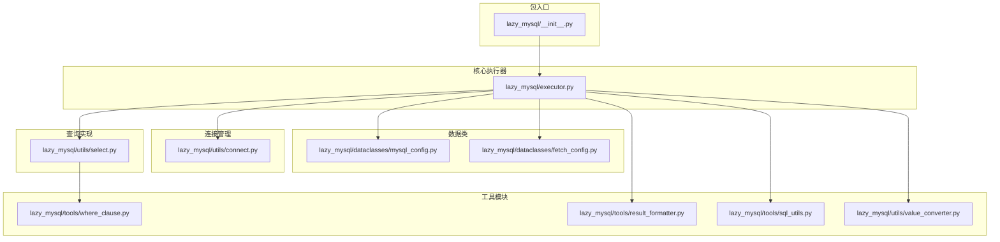
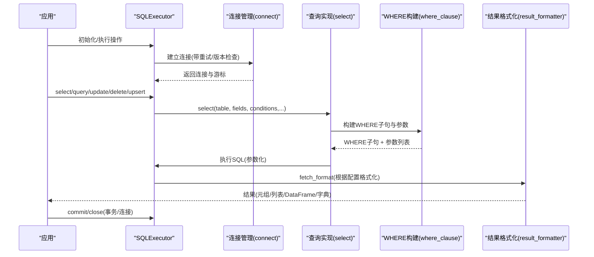
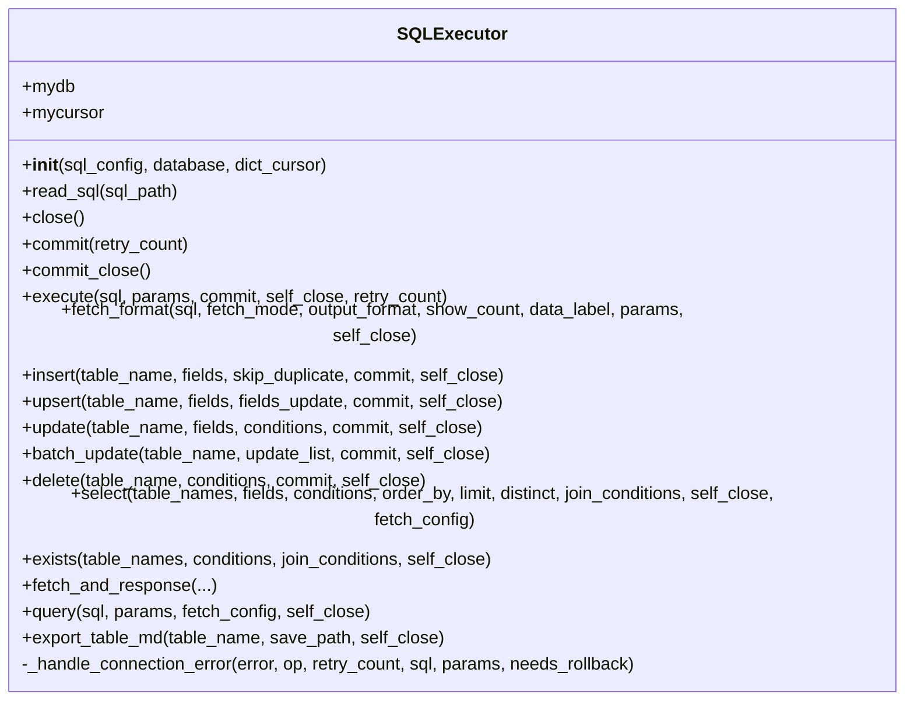
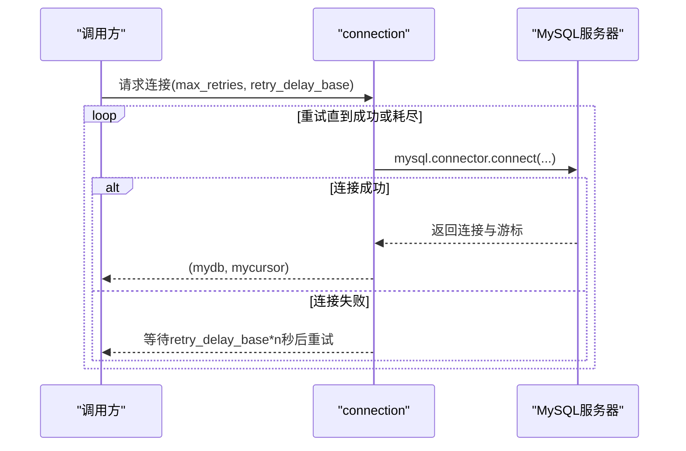
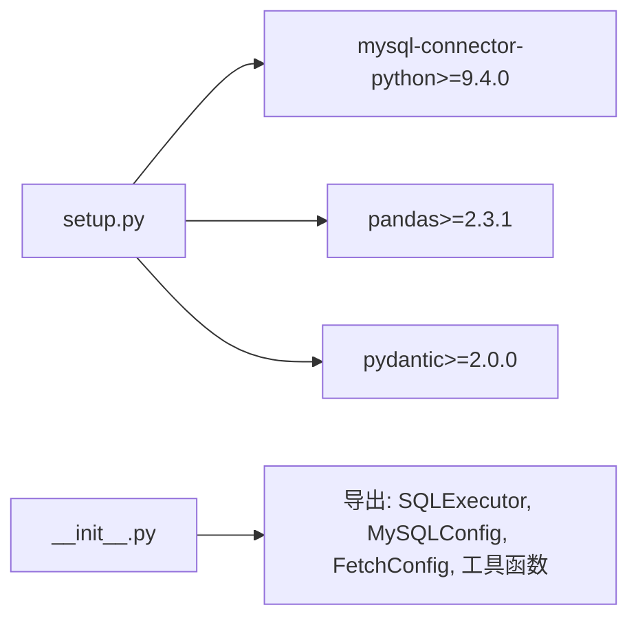

# 最佳实践

<cite>
**本文引用的文件**
- [README.md](file://README.md)
- [setup.py](file://setup.py)
- [requirements.txt](file://requirements.txt)
- [lazy_mysql/__init__.py](file://lazy_mysql/__init__.py)
- [lazy_mysql/executor.py](file://lazy_mysql/executor.py)
- [lazy_mysql/dataclasses/mysql_config.py](file://lazy_mysql/dataclasses/mysql_config.py)
- [lazy_mysql/dataclasses/fetch_config.py](file://lazy_mysql/dataclasses/fetch_config.py)
- [lazy_mysql/utils/connect.py](file://lazy_mysql/utils/connect.py)
- [lazy_mysql/tools/sql_utils.py](file://lazy_mysql/tools/sql_utils.py)
- [lazy_mysql/utils/select.py](file://lazy_mysql/utils/select.py)
- [lazy_mysql/tools/where_clause.py](file://lazy_mysql/tools/where_clause.py)
- [lazy_mysql/tools/result_formatter.py](file://lazy_mysql/tools/result_formatter.py)
- [lazy_mysql/utils/value_converter.py](file://lazy_mysql/utils/value_converter.py)
- [docs/CONNECTION.md](file://docs/CONNECTION.md)
- [tests/test_import.py](file://tests/test_import.py)
</cite>

## 目录
1. [简介](#简介)
2. [项目结构](#项目结构)
3. [核心组件](#核心组件)
4. [架构总览](#架构总览)
5. [详细组件分析](#详细组件分析)
6. [依赖关系分析](#依赖关系分析)
7. [性能考虑](#性能考虑)
8. [故障排查指南](#故障排查指南)
9. [结论](#结论)
10. [附录](#附录)

## 简介
本指南围绕 lazy_mysql 的使用与开发，总结安全编程、性能优化、代码组织与测试策略的最佳实践，并针对不同规模与类型的项目给出可落地的建议。内容基于仓库中的实现与文档，涵盖连接管理、参数化查询、SQL 注入防护、敏感数据处理、批量操作、连接池配置、索引与查询优化、错误处理与日志记录、代码风格与测试策略等主题。

## 项目结构
项目采用模块化设计，核心围绕 SQLExecutor 执行器展开，配合数据类（MySQLConfig、FetchConfig）、工具模块（where_clause、result_formatter、sql_utils、value_converter）以及连接管理（utils/connect）。对外通过包级导出提供便捷入口。



**图表来源**
- [lazy_mysql/__init__.py:1-21](file://lazy_mysql/__init__.py#L1-L21)
- [lazy_mysql/executor.py:1-616](file://lazy_mysql/executor.py#L1-L616)
- [lazy_mysql/dataclasses/mysql_config.py:1-135](file://lazy_mysql/dataclasses/mysql_config.py#L1-L135)
- [lazy_mysql/dataclasses/fetch_config.py:1-24](file://lazy_mysql/dataclasses/fetch_config.py#L1-L24)
- [lazy_mysql/utils/connect.py:1-91](file://lazy_mysql/utils/connect.py#L1-L91)
- [lazy_mysql/utils/select.py:1-237](file://lazy_mysql/utils/select.py#L1-L237)
- [lazy_mysql/tools/where_clause.py:1-127](file://lazy_mysql/tools/where_clause.py#L1-L127)
- [lazy_mysql/tools/result_formatter.py:1-77](file://lazy_mysql/tools/result_formatter.py#L1-L77)
- [lazy_mysql/tools/sql_utils.py:1-53](file://lazy_mysql/tools/sql_utils.py#L1-L53)
- [lazy_mysql/utils/value_converter.py:1-115](file://lazy_mysql/utils/value_converter.py#L1-L115)

**章节来源**
- [lazy_mysql/__init__.py:1-21](file://lazy_mysql/__init__.py#L1-L21)
- [lazy_mysql/executor.py:1-616](file://lazy_mysql/executor.py#L1-L616)
- [lazy_mysql/dataclasses/mysql_config.py:1-135](file://lazy_mysql/dataclasses/mysql_config.py#L1-L135)
- [lazy_mysql/dataclasses/fetch_config.py:1-24](file://lazy_mysql/dataclasses/fetch_config.py#L1-L24)
- [lazy_mysql/utils/connect.py:1-91](file://lazy_mysql/utils/connect.py#L1-L91)
- [lazy_mysql/utils/select.py:1-237](file://lazy_mysql/utils/select.py#L1-L237)
- [lazy_mysql/tools/where_clause.py:1-127](file://lazy_mysql/tools/where_clause.py#L1-L127)
- [lazy_mysql/tools/result_formatter.py:1-77](file://lazy_mysql/tools/result_formatter.py#L1-L77)
- [lazy_mysql/tools/sql_utils.py:1-53](file://lazy_mysql/tools/sql_utils.py#L1-L53)
- [lazy_mysql/utils/value_converter.py:1-115](file://lazy_mysql/utils/value_converter.py#L1-L115)

## 核心组件
- SQLExecutor：统一的数据库操作接口，封装连接、执行、结果格式化、事务提交/回滚、重试与兜底关闭等能力。
- MySQLConfig：集中式配置解析与环境变量读取，支持显式参数、字典配置与环境变量的优先级合并。
- FetchConfig：查询结果格式化配置，统一控制 fetch_mode、output_format、data_label、show_count。
- 工具模块：
  - where_clause：构建 WHERE 子句与参数列表，内置 SQL 注入防护（参数化）与特殊类型校验。
  - result_formatter：根据配置将游标结果转换为列表、DataFrame、字典列表等。
  - sql_utils：辅助函数（加载 SQL 文件、构建条件片段）。
  - value_converter：将 Pandas/NumPy/JSON/时间类型等标准化为数据库可接受的值。
- 连接管理：连接建立、版本检查、重试与参数校验。

**章节来源**
- [lazy_mysql/executor.py:14-616](file://lazy_mysql/executor.py#L14-L616)
- [lazy_mysql/dataclasses/mysql_config.py:10-135](file://lazy_mysql/dataclasses/mysql_config.py#L10-L135)
- [lazy_mysql/dataclasses/fetch_config.py:8-24](file://lazy_mysql/dataclasses/fetch_config.py#L8-L24)
- [lazy_mysql/tools/where_clause.py:42-127](file://lazy_mysql/tools/where_clause.py#L42-L127)
- [lazy_mysql/tools/result_formatter.py:3-77](file://lazy_mysql/tools/result_formatter.py#L3-L77)
- [lazy_mysql/tools/sql_utils.py:4-53](file://lazy_mysql/tools/sql_utils.py#L4-L53)
- [lazy_mysql/utils/value_converter.py:74-115](file://lazy_mysql/utils/value_converter.py#L74-L115)
- [lazy_mysql/utils/connect.py:16-91](file://lazy_mysql/utils/connect.py#L16-L91)

## 架构总览
下图展示 lazy_mysql 的关键交互：应用通过 SQLExecutor 发起操作，Executor 调用连接管理建立连接，查询路径经由 select 实现与 where_clause 构建 WHERE 子句，再由 result_formatter 格式化输出；批量/UPsert 等操作由对应工具模块处理。



**图表来源**
- [lazy_mysql/executor.py:14-616](file://lazy_mysql/executor.py#L14-L616)
- [lazy_mysql/utils/connect.py:16-91](file://lazy_mysql/utils/connect.py#L16-L91)
- [lazy_mysql/utils/select.py:4-156](file://lazy_mysql/utils/select.py#L4-L156)
- [lazy_mysql/tools/where_clause.py:42-127](file://lazy_mysql/tools/where_clause.py#L42-L127)
- [lazy_mysql/tools/result_formatter.py:3-77](file://lazy_mysql/tools/result_formatter.py#L3-L77)

## 详细组件分析

### SQLExecutor 执行器
- 统一接口：提供 select、query、insert、upsert、update、batch_update、delete、exists、fetch_and_response 等方法。
- 参数化执行：execute 支持单条/批量参数（元组/字典/列表），自动区分 SELECT 与 DML 并拒绝不安全的批量 SELECT。
- 错误与重试：内部维护可重试错误关键词，连接丢失/超时触发自动重连与回滚，失败时打印日志并关闭连接。
- 事务与关闭：commit/commit_close、close 与 __del__ 兜底清理，避免资源泄漏。
- 结果格式化：fetch_format 统一委托 result_formatter，支持 all/oneTuple/one 与 list_1、df、df_dict、dict 等输出。



**图表来源**
- [lazy_mysql/executor.py:14-616](file://lazy_mysql/executor.py#L14-L616)

**章节来源**
- [lazy_mysql/executor.py:14-616](file://lazy_mysql/executor.py#L14-L616)

### WHERE 条件构建与 SQL 注入防护
- 支持简单值、元组格式（运算符+值）、'NULL'/'NOT NULL' 等多种条件形式。
- IN/NOT IN 列表参数逐一校验并参数化，避免字符串拼接引发注入。
- NDayInterval 自动拼接 SQL 表达式，无需手动拼接字符串。
- 对 numpy/dict 等类型进行显式校验与转换，防止不安全数据进入数据库。

```mermaid
flowchart TD
Start(["输入条件字典"]) --> CheckEmpty{"是否为空?"}
CheckEmpty --> |是| ReturnNone["返回(None, None)"]
CheckEmpty --> |否| Loop["遍历键值对"]
Loop --> TypeCheck{"值类型"}
TypeCheck --> |元组(len==2)| TuplePath["解析运算符与值"]
TypeCheck --> |字符串(NULL/NOT NULL)| NullPath["生成IS条件"]
TypeCheck --> |其他| SimplePath["生成= %s"]
TuplePath --> NIntv{"是否NDayInterval?"}
NIntv --> |是| AppendExpr["追加表达式片段"]
NIntv --> |否| InOp{"运算符是否IN/NOT IN且值为序列?"}
InOp --> |是| ValidateList["逐项校验并参数化"] --> AppendIN["追加IN占位符并收集参数"]
InOp --> |否| ValidateVal["校验并参数化单值"] --> AppendKV["追加字段比较并收集参数"]
NullPath --> AppendNull["追加IS条件"]
SimplePath --> ValidateVal2["校验并参数化"] --> AppendEq["追加= %s并收集参数"]
AppendExpr --> Next["下一个键值"]
AppendIN --> Next
AppendKV --> Next
AppendNull --> Next
AppendEq --> Next
Next --> |遍历结束| Join["连接为WHERE子句 + 拼接参数列表"]
Join --> End(["返回"])
```

**图表来源**
- [lazy_mysql/tools/where_clause.py:42-127](file://lazy_mysql/tools/where_clause.py#L42-L127)

**章节来源**
- [lazy_mysql/tools/where_clause.py:17-127](file://lazy_mysql/tools/where_clause.py#L17-L127)

### 结果格式化与输出
- 支持 all/oneTuple/one 三种获取模式与 list_1、df、df_dict、dict 等输出格式。
- DataFrame 场景强制 data_label 校验，避免列名不匹配。
- show_count 在 all 模式下返回(数据, 数量)二元组，便于统计。

```mermaid
flowchart TD
Enter(["fetch_format入口"]) --> Mode{"fetch_mode"}
Mode --> |all| AllPath["fetchall()"]
Mode --> |oneTuple| OneTuplePath["fetchone()"]
Mode --> |one| OnePath["fetchone()取首列"]
AllPath --> OutFmt{"output_format"}
OutFmt --> |""| RetList["返回元组列表"]
OutFmt --> |"list_1"| RetFlat["提取首列组成列表"]
OutFmt --> |"df"| ToDF["DataFrame(columns=data_label)"]
ToDF --> DictOpt{"是否df_dict?"}
DictOpt --> |是| ToRecords["to_dict('records')"] --> CloseCheck
DictOpt --> |否| CloseCheck["self_close?"]
OutFmt --> |"dict"| Error["错误：oneTuple才支持dict"] --> CloseCheck
OneTuplePath --> DictOpt2{"是否output_format=dict且data_label有效?"}
DictOpt2 --> |是| ToDict["zip(data_label, row)"] --> CloseCheck
DictOpt2 --> |否| CloseCheck
OnePath --> CloseCheck
CloseCheck --> |是| DoClose["executor.close()"] --> Return
CloseCheck --> |否| Return["返回结果"]
```

**图表来源**
- [lazy_mysql/tools/result_formatter.py:3-77](file://lazy_mysql/tools/result_formatter.py#L3-L77)

**章节来源**
- [lazy_mysql/tools/result_formatter.py:3-77](file://lazy_mysql/tools/result_formatter.py#L3-L77)

### 连接管理与重试
- 自动版本检查，提示升级 mysql-connector-python。
- 支持连接超时与接口错误的指数退避重试。
- 底层连接参数包含 buffered、use_pure、allow_local_infile 等，兼顾兼容性与功能需求。
- 提供底层 connection 函数以支持更细粒度的高级配置。



**图表来源**
- [lazy_mysql/utils/connect.py:16-91](file://lazy_mysql/utils/connect.py#L16-L91)

**章节来源**
- [lazy_mysql/utils/connect.py:16-91](file://lazy_mysql/utils/connect.py#L16-L91)
- [docs/CONNECTION.md:180-228](file://docs/CONNECTION.md#L180-L228)

### 查询构建与 JOIN
- 支持单表/多表 JOIN，自动为主表字段添加前缀，或使用自定义条件。
- DISTINCT、ORDER BY、LIMIT 等子句按需拼接。
- 通过 FetchConfig 控制输出格式与列名映射。

**章节来源**
- [lazy_mysql/utils/select.py:4-156](file://lazy_mysql/utils/select.py#L4-L156)

### 批量与 UPSERT
- insert：根据数据量自动选择策略（executemany 分批或 LOAD DATA INFILE），避免一次性大批量导致的性能与内存问题。
- upsert：支持单条与批量，自动判断字段更新范围。
- batch_update：根据条件复杂度选择 CASE WHEN 简化或通用语法，提升批量更新性能。

**章节来源**
- [lazy_mysql/executor.py:214-321](file://lazy_mysql/executor.py#L214-L321)

## 依赖关系分析
- 包级导出：__all__ 明确暴露 API，便于上层直接导入。
- 外部依赖：mysql-connector-python、pandas、pydantic。
- 版本要求：Python >= 3.10，mysql-connector-python >= 9.4.0。



**图表来源**
- [setup.py:14-18](file://setup.py#L14-L18)
- [lazy_mysql/__init__.py:14-21](file://lazy_mysql/__init__.py#L14-L21)

**章节来源**
- [setup.py:1-34](file://setup.py#L1-L34)
- [requirements.txt:1-3](file://requirements.txt#L1-L3)
- [lazy_mysql/__init__.py:14-21](file://lazy_mysql/__init__.py#L14-L21)

## 性能考虑
- 批量插入策略
  - 小批量（<1000）：直接 executemany。
  - 中批量（1000-50000）：分批 1000 条。
  - 大批量（50000-100000）：分批 5000 条。
  - 超大批（>=100000）：使用 LOAD DATA INFILE 分批 50000 条，显著降低开销。
- 批量更新
  - 单字段条件：CASE key WHEN ... THEN 语法，性能最优。
  - 复杂条件：CASE WHEN ... THEN 语法，自动选择。
- 查询优化
  - exists 使用 SELECT 1 LIMIT 1，避免全表扫描。
  - WHERE 构建使用参数化，避免 LIKE 等场景的全表扫描。
  - 使用索引覆盖查询字段，减少回表。
- 连接与缓冲
  - buffered=True 避免“Unread result found”错误。
  - use_pure=True 提升兼容性，必要时可启用 allow_local_infile。
- 结果处理
  - DataFrame 输出时尽量复用 data_label，避免重复转换。
  - 大结果集建议分页或流式处理，避免内存峰值。

**章节来源**
- [lazy_mysql/executor.py:214-321](file://lazy_mysql/executor.py#L214-L321)
- [lazy_mysql/utils/select.py:159-237](file://lazy_mysql/utils/select.py#L159-L237)
- [lazy_mysql/tools/result_formatter.py:3-77](file://lazy_mysql/tools/result_formatter.py#L3-L77)
- [lazy_mysql/utils/connect.py:46-63](file://lazy_mysql/utils/connect.py#L46-L63)

## 故障排查指南
- 连接失败与重试
  - 自动重试：连接超时与接口错误触发重试，最多 5 次，延迟递增。
  - 版本检查：过时连接器会提示升级。
- 事务与回滚
  - commit 失败时自动回滚并关闭连接，避免脏状态。
- 常见错误定位
  - Access denied：用户名/密码错误。
  - Can't connect：网络/主机不可达。
  - Unknown database：数据库不存在。
  - No result set to fetch from：游标提前关闭或查询无结果集。
- 安全与数据类型
  - numpy 类型禁止直接写入，需先转换。
  - dict/列表等 JSON 类型自动序列化，失败时报错。
  - 时间/Decimal/Bytes 等类型规范化处理。

**章节来源**
- [lazy_mysql/executor.py:62-124](file://lazy_mysql/executor.py#L62-L124)
- [lazy_mysql/utils/connect.py:74-91](file://lazy_mysql/utils/connect.py#L74-L91)
- [lazy_mysql/tools/where_clause.py:17-39](file://lazy_mysql/tools/where_clause.py#L17-L39)
- [lazy_mysql/utils/value_converter.py:74-115](file://lazy_mysql/utils/value_converter.py#L74-L115)
- [docs/CONNECTION.md:205-228](file://docs/CONNECTION.md#L205-L228)

## 结论
lazy_mysql 通过统一的执行器、参数化查询与完善的错误处理，为 Python 项目提供了安全、易用且高性能的 MySQL 访问方案。结合本文的安全编程、性能优化与工程化实践，可在不同规模与类型的项目中稳定落地。

## 附录

### 安全编程最佳实践
- 始终使用参数化查询（占位符），避免字符串拼接。
- 使用 where_clause 构建 WHERE 子句，不要手写拼接。
- 对输入进行类型校验（numpy/dict/json），必要时转换。
- 严格限定条件范围，避免全表扫描与暴力 LIKE。
- 严禁将敏感信息（密码、密钥）写入日志或错误消息。

**章节来源**
- [lazy_mysql/tools/where_clause.py:42-127](file://lazy_mysql/tools/where_clause.py#L42-L127)
- [lazy_mysql/utils/value_converter.py:74-115](file://lazy_mysql/utils/value_converter.py#L74-L115)
- [lazy_mysql/executor.py:147-185](file://lazy_mysql/executor.py#L147-L185)

### 性能优化建议
- 批量操作：按数据量选择合适策略（executemany 分批/LOAD DATA INFILE）。
- 查询：使用 EXISTS 与 LIMIT 1、合理索引、避免 SELECT *。
- 连接：buffered/use_pure/allow_local_infile 等参数按需开启。
- 结果：DataFrame 输出时复用 data_label，避免重复转换。

**章节来源**
- [lazy_mysql/executor.py:214-321](file://lazy_mysql/executor.py#L214-L321)
- [lazy_mysql/utils/select.py:159-237](file://lazy_mysql/utils/select.py#L159-L237)
- [lazy_mysql/tools/result_formatter.py:3-77](file://lazy_mysql/tools/result_formatter.py#L3-L77)
- [lazy_mysql/utils/connect.py:46-63](file://lazy_mysql/utils/connect.py#L46-L63)

### 代码组织与项目结构最佳实践
- 配置管理：统一使用 MySQLConfig，支持显式参数、字典与环境变量优先级合并。
- 错误处理：使用 SQLExecutor 的错误处理与重试机制，避免裸异常传播。
- 日志记录：利用内置 print 与异常信息，生产环境建议接入标准日志框架。
- 上下文管理：使用 try/finally 或 with 模式确保连接关闭。
- 文档与测试：参考 docs/* 与 tests/*，完善单元测试与集成测试。

**章节来源**
- [lazy_mysql/dataclasses/mysql_config.py:62-135](file://lazy_mysql/dataclasses/mysql_config.py#L62-L135)
- [lazy_mysql/executor.py:32-124](file://lazy_mysql/executor.py#L32-L124)
- [docs/CONNECTION.md:230-282](file://docs/CONNECTION.md#L230-L282)
- [tests/test_import.py:1-12](file://tests/test_import.py#L1-L12)

### 常见问题与规避建议
- SELECT 不支持批量执行：会抛出异常，改为单条或使用 insert/upsert。
- data_label 与输出格式不匹配：DataFrame/字典输出需提供 data_label。
- 连接提前关闭：避免在 query/select 后再次使用已关闭的游标。
- numpy/dict 类型：必须先转换，否则抛出类型错误。

**章节来源**
- [lazy_mysql/executor.py:158-185](file://lazy_mysql/executor.py#L158-L185)
- [lazy_mysql/tools/result_formatter.py:29-53](file://lazy_mysql/tools/result_formatter.py#L29-L53)
- [lazy_mysql/executor.py:506-510](file://lazy_mysql/executor.py#L506-L510)

### 代码风格与测试策略
- 代码风格：遵循 Python 命名规范，使用类型注解与 docstring。
- 测试策略：单元测试覆盖导入一致性、配置解析、WHERE 构建、结果格式化与连接重试等关键路径。
- 文档驱动：以 docs/* 为准绳，保证使用示例与实现一致。

**章节来源**
- [tests/test_import.py:1-12](file://tests/test_import.py#L1-L12)
- [README.md:1-197](file://README.md#L1-L197)