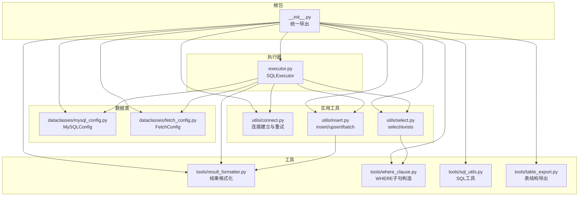
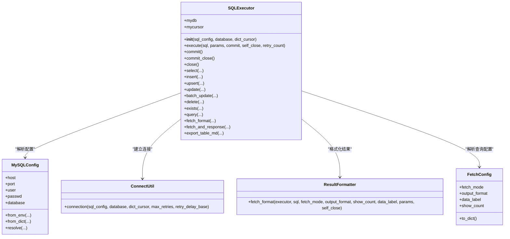
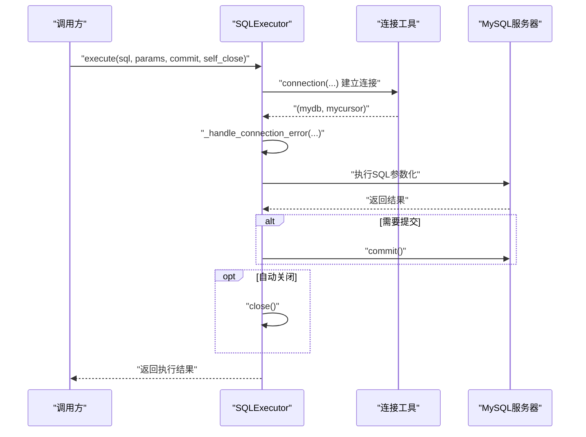
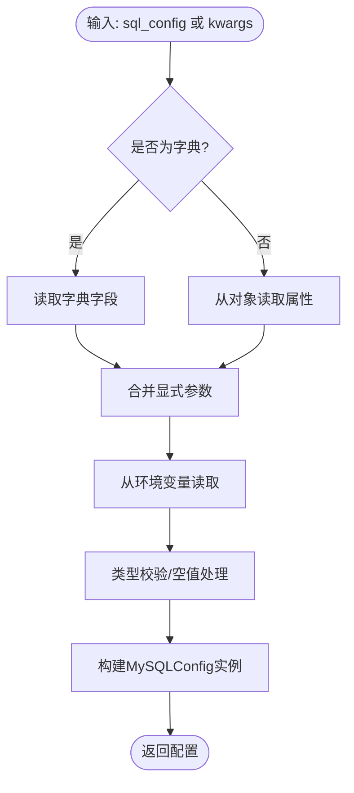
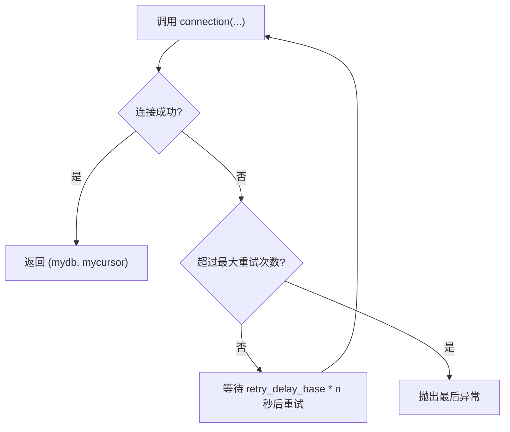
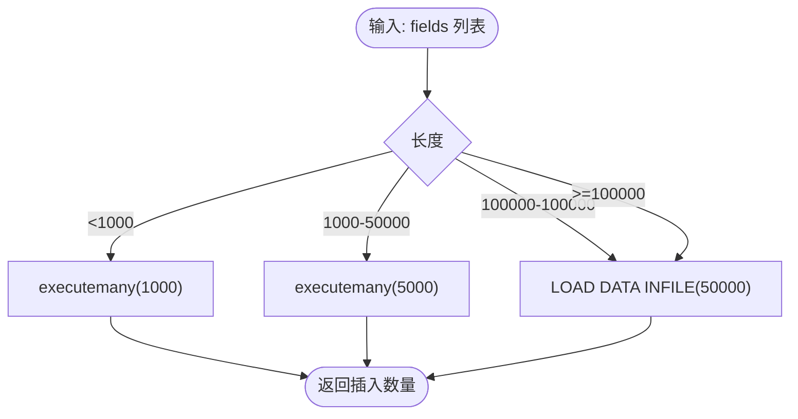
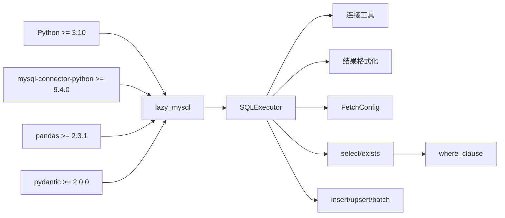

# 核心概念

<cite>
**本文引用的文件**
- [lazy_mysql/__init__.py](file://lazy_mysql/__init__.py)
- [lazy_mysql/executor.py](file://lazy_mysql/executor.py)
- [lazy_mysql/dataclasses/mysql_config.py](file://lazy_mysql/dataclasses/mysql_config.py)
- [lazy_mysql/dataclasses/fetch_config.py](file://lazy_mysql/dataclasses/fetch_config.py)
- [lazy_mysql/utils/connect.py](file://lazy_mysql/utils/connect.py)
- [lazy_mysql/tools/result_formatter.py](file://lazy_mysql/tools/result_formatter.py)
- [lazy_mysql/tools/sql_utils.py](file://lazy_mysql/tools/sql_utils.py)
- [lazy_mysql/utils/select.py](file://lazy_mysql/utils/select.py)
- [lazy_mysql/utils/insert.py](file://lazy_mysql/utils/insert.py)
- [lazy_mysql/tools/where_clause.py](file://lazy_mysql/tools/where_clause.py)
- [lazy_mysql/tools/table_export.py](file://lazy_mysql/tools/table_export.py)
- [README.md](file://README.md)
- [setup.py](file://setup.py)
</cite>

## 目录
1. [简介](#简介)
2. [项目结构](#项目结构)
3. [核心组件](#核心组件)
4. [架构总览](#架构总览)
5. [详细组件分析](#详细组件分析)
6. [依赖关系分析](#依赖关系分析)
7. [性能考量](#性能考量)
8. [故障排查指南](#故障排查指南)
9. [结论](#结论)

## 简介
本文件面向初学者与高级用户，系统阐释 lazy_mysql 的核心架构与设计原理，重点包括：
- SQLExecutor 类的统一接口理念与职责边界
- MySQLConfig 配置管理的“解析优先级”与工厂式解析
- 连接管理与重试策略、生命周期管理
- 参数化查询与 SQL 注入防护
- 批量操作优化与 LOAD DATA INFILE 支持
- 结果格式化：DataFrame、字典、列表等多模式输出
- 为使用者提供从入门到进阶的完整认知路径

## 项目结构
项目采用“分层+模块化”的组织方式：
- dataclasses：数据模型与配置（MySQLConfig、FetchConfig）
- utils：业务能力封装（连接、查询、插入、更新、删除等）
- tools：工具函数（结果格式化、SQL工具、导出、WHERE子句构造等）
- 根包导出：对外暴露统一入口与便捷导入



图表来源
- [lazy_mysql/__init__.py:1-21](file://lazy_mysql/__init__.py#L1-L21)
- [lazy_mysql/executor.py:14-616](file://lazy_mysql/executor.py#L14-L616)
- [lazy_mysql/dataclasses/mysql_config.py:10-135](file://lazy_mysql/dataclasses/mysql_config.py#L10-L135)
- [lazy_mysql/dataclasses/fetch_config.py:8-24](file://lazy_mysql/dataclasses/fetch_config.py#L8-L24)
- [lazy_mysql/utils/connect.py:15-91](file://lazy_mysql/utils/connect.py#L15-L91)
- [lazy_mysql/tools/result_formatter.py:3-77](file://lazy_mysql/tools/result_formatter.py#L3-L77)
- [lazy_mysql/tools/where_clause.py:42-127](file://lazy_mysql/tools/where_clause.py#L42-L127)
- [lazy_mysql/utils/select.py:4-237](file://lazy_mysql/utils/select.py#L4-L237)
- [lazy_mysql/utils/insert.py:7-287](file://lazy_mysql/utils/insert.py#L7-L287)
- [lazy_mysql/tools/table_export.py:12-190](file://lazy_mysql/tools/table_export.py#L12-L190)

章节来源
- [lazy_mysql/__init__.py:1-21](file://lazy_mysql/__init__.py#L1-L21)
- [README.md:1-197](file://README.md#L1-L197)

## 核心组件
- SQLExecutor：统一的数据库操作入口，封装连接、执行、格式化、事务、重试、生命周期管理等
- MySQLConfig：配置解析与工厂式合并，支持环境变量、字典、对象、显式参数的优先级解析
- FetchConfig：查询结果格式化配置模型，统一 fetch_mode、output_format、data_label、show_count
- 连接工具：连接建立、重试、参数校验、版本提示
- 工具函数：WHERE 子句构造、SQL 工具、结果格式化、表结构导出
- 业务封装：select/exists、insert/upsert/batch、update/delete 等

章节来源
- [lazy_mysql/executor.py:14-616](file://lazy_mysql/executor.py#L14-L616)
- [lazy_mysql/dataclasses/mysql_config.py:10-135](file://lazy_mysql/dataclasses/mysql_config.py#L10-L135)
- [lazy_mysql/dataclasses/fetch_config.py:8-24](file://lazy_mysql/dataclasses/fetch_config.py#L8-L24)
- [lazy_mysql/utils/connect.py:15-91](file://lazy_mysql/utils/connect.py#L15-L91)
- [lazy_mysql/tools/result_formatter.py:3-77](file://lazy_mysql/tools/result_formatter.py#L3-L77)
- [lazy_mysql/tools/where_clause.py:42-127](file://lazy_mysql/tools/where_clause.py#L42-L127)
- [lazy_mysql/utils/select.py:4-237](file://lazy_mysql/utils/select.py#L4-L237)
- [lazy_mysql/utils/insert.py:7-287](file://lazy_mysql/utils/insert.py#L7-L287)

## 架构总览
lazy_mysql 的整体架构围绕“统一执行器 + 配置模型 + 工具链”的思路展开：
- SQLExecutor 作为门面，聚合连接、执行、格式化、事务、重试、生命周期管理
- MySQLConfig 与 FetchConfig 提供“解析优先级 + 类型约束 + 兼容旧字典”的双轨配置体验
- 工具模块负责可复用的 SQL 构造、结果格式化、导出等



图表来源
- [lazy_mysql/executor.py:14-616](file://lazy_mysql/executor.py#L14-L616)
- [lazy_mysql/dataclasses/mysql_config.py:10-135](file://lazy_mysql/dataclasses/mysql_config.py#L10-L135)
- [lazy_mysql/dataclasses/fetch_config.py:8-24](file://lazy_mysql/dataclasses/fetch_config.py#L8-L24)
- [lazy_mysql/utils/connect.py:15-91](file://lazy_mysql/utils/connect.py#L15-L91)
- [lazy_mysql/tools/result_formatter.py:3-77](file://lazy_mysql/tools/result_formatter.py#L3-L77)

## 详细组件分析

### SQLExecutor 设计思想与统一接口
- 统一入口：提供 execute、select、insert、upsert、update、batch_update、delete、exists、query、fetch_format、fetch_and_response、export_table_md 等方法，覆盖常见 CRUD 与查询场景
- 生命周期管理：构造时建立连接，支持 commit/commit_close/close，析构兜底清理；提供 self_close 参数让上层按需自动关闭
- 错误与重试：内置可重试错误识别（连接丢失、超时等），在异常时尝试重连并回滚事务，避免资源泄漏
- 事务控制：commit/commit_close 显式提交；执行 DML 时可自动提交
- 结果格式化：统一的 fetch_format 与 query/fetch_and_response，支持 all/oneTuple/one 三种 fetch_mode 与 list_1、df、df_dict、dict 等 output_format



图表来源
- [lazy_mysql/executor.py:126-185](file://lazy_mysql/executor.py#L126-L185)
- [lazy_mysql/utils/connect.py:15-91](file://lazy_mysql/utils/connect.py#L15-L91)

章节来源
- [lazy_mysql/executor.py:14-616](file://lazy_mysql/executor.py#L14-L616)

### MySQLConfig 配置管理与工厂模式
- 解析优先级：显式参数 > 字典/对象 > 环境变量；空值不会覆盖已有值
- 环境变量映射：LAZY_MYSQL_HOST/PORT/USER/PASSWD/DATABASE
- 类型校验：端口强制整数，空字符串转 None；字段值空字符串转 None
- 工厂方法：
  - from_env：从环境变量读取并合并显式参数
  - from_dict：兼容旧字典方式
  - resolve：统一解析入口，串联以上来源



图表来源
- [lazy_mysql/dataclasses/mysql_config.py:82-135](file://lazy_mysql/dataclasses/mysql_config.py#L82-L135)

章节来源
- [lazy_mysql/dataclasses/mysql_config.py:10-135](file://lazy_mysql/dataclasses/mysql_config.py#L10-L135)

### 连接管理机制：连接池、重试、生命周期
- 连接建立：使用 mysql-connector-python，开启 buffered、use_pure、allow_local_infile 等参数，支持字典游标
- 重试策略：对连接超时、接口错误进行指数退避重试（可配置最大重试次数与延迟基数）
- 版本提示：检测连接器版本，低于阈值给出升级建议
- 生命周期：构造时建立，close/commit_close 显式关闭；析构兜底；支持 self_close 在执行后自动关闭



图表来源
- [lazy_mysql/utils/connect.py:15-91](file://lazy_mysql/utils/connect.py#L15-L91)

章节来源
- [lazy_mysql/utils/connect.py:15-91](file://lazy_mysql/utils/connect.py#L15-L91)

### 参数化查询与 SQL 注入防护
- 执行器 execute：统一走 cursor.execute/executemany，参数化传入，避免字符串拼接
- WHERE 子句构造：build_where_clause 将条件字典转为 WHERE 子句与参数列表，支持 IN/NOT IN、NULL/NOT NULL、运算符元组、NDayInterval 等
- 参数校验：对 numpy 类型与 dict 自动校验/转换，防止不安全数据进入数据库
- 表名校验：导出工具对表名做正则校验，防止注入

```mermaid
flowchart TD
S["输入: conditions 字典"] --> Pairs["遍历键值对"]
Pairs --> Type{"值类型?"}
Type --> |元组(len==2)| OpVal["解析运算符与值"]
Type --> |字符串(NULL/NOT NULL)| NullCheck["生成 IS NULL/IS NOT NULL"]
Type --> |简单值| Eq["生成 field = %s"]
OpVal --> Validate["校验/转换参数值"]
Validate --> Clause["追加到WHERE子句"]
NullCheck --> Clause
Eq --> Clause
Clause --> Join["AND 连接"]
Join --> Out["返回 (where_clause, params)"]
```

图表来源
- [lazy_mysql/tools/where_clause.py:42-127](file://lazy_mysql/tools/where_clause.py#L42-L127)

章节来源
- [lazy_mysql/executor.py:126-185](file://lazy_mysql/executor.py#L126-L185)
- [lazy_mysql/tools/where_clause.py:42-127](file://lazy_mysql/tools/where_clause.py#L42-L127)
- [lazy_mysql/tools/table_export.py:5-9](file://lazy_mysql/tools/table_export.py#L5-L9)

### 批量操作优化与 LOAD DATA INFILE 支持
- 策略选择：单条（dict）、小批量（<1000）直接 executemany、中批量（1000-100000）分批 executemany、超大批量（>=100000）使用 LOAD DATA INFILE
- 分批大小：1000/5000/50000，兼顾吞吐与内存
- LOAD DATA INFILE：将 CSV 写入临时文件，逐批执行 LOAD DATA LOCAL INFILE，支持跳过重复（INSERT IGNORE INTO TABLE）
- upsert：单条/批量自动选择 INSERT ... ON DUPLICATE KEY UPDATE



图表来源
- [lazy_mysql/utils/insert.py:7-287](file://lazy_mysql/utils/insert.py#L7-L287)

章节来源
- [lazy_mysql/utils/insert.py:7-287](file://lazy_mysql/utils/insert.py#L7-L287)

### 结果格式化：DataFrame、字典、列表
- fetch_format：统一入口，支持 all/oneTuple/one 三种 fetch_mode 与 list_1、df、df_dict、dict 等 output_format
- DataFrame：基于 pandas，列名来自 data_label；可转 dict 列表
- 单条元组/值：oneTuple/one 模式，支持 dict 输出（需提供 data_label）

```mermaid
flowchart TD
A["executor.execute(sql, params)"] --> B{"fetch_mode"}
B --> |all| C["fetchall()"]
C --> D{"output_format"}
D --> |"list_1"| E["提取首列"]
D --> |"df"| F["pd.DataFrame(columns=data_label)"]
F --> G{"df_dict?"}
G --> |是| H["to_dict(orient='records')"]
G --> |否| I["返回DataFrame"]
D --> |""| J["返回元组列表"]
B --> |oneTuple| K["fetchone()"]
K --> L{"output_format == 'dict' 且 data_label?"}
L --> |是| M["zip(data_label, result) -> dict"]
L --> |否| N["返回元组"]
B --> |one| O["fetchone()[0] 或 None"]
```

图表来源
- [lazy_mysql/tools/result_formatter.py:3-77](file://lazy_mysql/tools/result_formatter.py#L3-L77)

章节来源
- [lazy_mysql/tools/result_formatter.py:3-77](file://lazy_mysql/tools/result_formatter.py#L3-L77)

### 查询构建与复杂条件
- select：支持单表/多表 JOIN、DISTINCT、ORDER BY/LIMIT、WHERE 条件字典
- exists：SELECT 1 ... LIMIT 1 优化，快速判断存在性
- WHERE 子句：build_where_clause 支持 IN/NOT IN、NULL/NOT NULL、运算符元组、NDayInterval

章节来源
- [lazy_mysql/utils/select.py:4-237](file://lazy_mysql/utils/select.py#L4-L237)
- [lazy_mysql/tools/where_clause.py:42-127](file://lazy_mysql/tools/where_clause.py#L42-L127)

### 表结构导出与工具函数
- table_md/tables_md：导出 Markdown 文档，包含表信息、字段信息、索引信息
- add_limit：构建条件片段，支持 IN/NOT IN、运算符、别名等

章节来源
- [lazy_mysql/tools/table_export.py:12-190](file://lazy_mysql/tools/table_export.py#L12-L190)
- [lazy_mysql/tools/sql_utils.py:4-53](file://lazy_mysql/tools/sql_utils.py#L4-L53)

## 依赖关系分析
- 外部依赖：mysql-connector-python、pandas、pydantic
- 版本要求：Python >= 3.10，mysql-connector-python >= 9.4.0，pandas >= 2.3.1
- 内部耦合：SQLExecutor 依赖 MySQLConfig、连接工具、结果格式化、FetchConfig；select/insert 等进一步依赖 where_clause 等工具



图表来源
- [setup.py:14-18](file://setup.py#L14-L18)
- [lazy_mysql/executor.py:14-616](file://lazy_mysql/executor.py#L14-L616)

章节来源
- [setup.py:14-18](file://setup.py#L14-L18)
- [lazy_mysql/executor.py:14-616](file://lazy_mysql/executor.py#L14-L616)

## 性能考量
- 连接与缓冲：buffered=True 避免“未读结果”问题；use_pure=True 提升兼容性
- 批量策略：根据数据规模选择 executemany 分批或 LOAD DATA INFILE，显著降低网络往返与内存占用
- 查询优化：exists 使用 SELECT 1 LIMIT 1，避免全表扫描
- 结果格式化：DataFrame 适合分析场景，list_1/元组适合轻量传输

## 故障排查指南
- 连接失败/超时：检查网络、凭据、防火墙；观察重试日志；确认 mysql-connector-python 版本
- “无结果集”错误：确认 SQL 是否返回结果集（如 DDL/DML），或连接是否提前关闭
- 参数类型错误：避免 numpy 类型与不可序列化 dict；必要时转换为字符串或 JSON
- WHERE 条件无效：确认运算符元组格式、IN 列表元素类型、NULL/NOT NULL 字符串
- 导出失败：确认表名合法性、权限、磁盘空间

章节来源
- [lazy_mysql/executor.py:62-107](file://lazy_mysql/executor.py#L62-L107)
- [lazy_mysql/tools/where_clause.py:17-39](file://lazy_mysql/tools/where_clause.py#L17-L39)
- [lazy_mysql/tools/table_export.py:23-38](file://lazy_mysql/tools/table_export.py#L23-L38)

## 结论
lazy_mysql 通过“统一执行器 + 配置模型 + 工具链”的架构，实现了：
- 统一接口与一致体验：SQLExecutor 覆盖 CRUD 与查询，屏蔽底层差异
- 可靠的配置与连接管理：MySQLConfig 的解析优先级与连接重试保障稳定性
- 安全与健壮：参数化查询、WHERE 子句构造、表名校验、类型校验
- 高性能与可扩展：批量策略与 LOAD DATA INFILE、灵活的结果格式化
- 易用与兼容：FetchConfig 双轨支持（模型/字典），便于渐进迁移

对于初学者，建议从 SQLExecutor 的常用方法入手，逐步掌握配置解析与结果格式化；对于高级用户，可深入连接策略、批量优化与导出工具，结合实际场景定制化扩展。