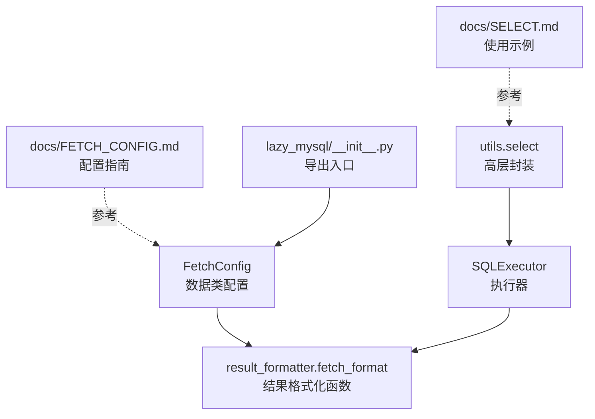
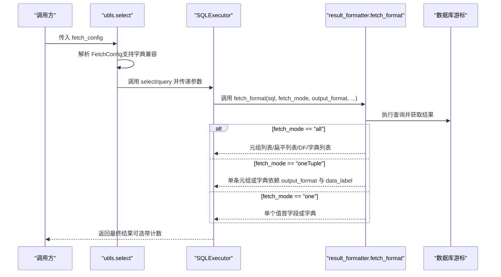
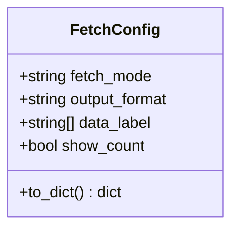

# FetchConfig查询配置类

<cite>
**本文引用的文件**
- [fetch_config.py](file://lazy_mysql/dataclasses/fetch_config.py)
- [result_formatter.py](file://lazy_mysql/tools/result_formatter.py)
- [executor.py](file://lazy_mysql/executor.py)
- [select.py](file://lazy_mysql/utils/select.py)
- [FETCH_CONFIG.md](file://docs/FETCH_CONFIG.md)
- [SELECT.md](file://docs/SELECT.md)
- [__init__.py](file://lazy_mysql/__init__.py)
</cite>

## 目录
1. [简介](#简介)
2. [项目结构](#项目结构)
3. [核心组件](#核心组件)
4. [架构总览](#架构总览)
5. [详细组件分析](#详细组件分析)
6. [依赖关系分析](#依赖关系分析)
7. [性能考量](#性能考量)
8. [故障排查指南](#故障排查指南)
9. [结论](#结论)
10. [附录](#附录)

## 简介
本文件系统性介绍 FetchConfig 查询配置类的设计与实现，重点覆盖以下方面：
- fetch_mode 参数的三种模式及其适用场景（all、oneTuple、one）
- output_format 参数的多种输出格式及其性能与使用注意事项（空字符串、list_1、df、df_dict、dict）
- data_label 参数的作用与命名规范（为 DataFrame 列名或字典键名提供别名）
- 不同查询结果类型的配置示例与实际应用场景
- 性能优化建议与最佳实践

## 项目结构
FetchConfig 位于数据类模块，配合工具层的结果格式化器与执行器共同完成查询结果的获取与转换。



图表来源
- [fetch_config.py:1-24](file://lazy_mysql/dataclasses/fetch_config.py#L1-L24)
- [result_formatter.py:1-77](file://lazy_mysql/tools/result_formatter.py#L1-L77)
- [executor.py:326-536](file://lazy_mysql/executor.py#L326-L536)
- [select.py:1-27](file://lazy_mysql/utils/select.py#L1-L27)
- [FETCH_CONFIG.md:1-223](file://docs/FETCH_CONFIG.md#L1-L223)
- [SELECT.md:468-639](file://docs/SELECT.md#L468-L639)
- [__init__.py:1-21](file://lazy_mysql/__init__.py#L1-L21)

章节来源
- [fetch_config.py:1-24](file://lazy_mysql/dataclasses/fetch_config.py#L1-L24)
- [result_formatter.py:1-77](file://lazy_mysql/tools/result_formatter.py#L1-L77)
- [executor.py:326-536](file://lazy_mysql/executor.py#L326-L536)
- [select.py:1-27](file://lazy_mysql/utils/select.py#L1-L27)
- [FETCH_CONFIG.md:1-223](file://docs/FETCH_CONFIG.md#L1-L223)
- [SELECT.md:468-639](file://docs/SELECT.md#L468-L639)
- [__init__.py:1-21](file://lazy_mysql/__init__.py#L1-L21)

## 核心组件
- FetchConfig：基于 Pydantic 的配置模型，定义 fetch_mode、output_format、data_label、show_count 四个关键字段，并提供 to_dict 兼容旧字典方式。
- result_formatter.fetch_format：根据 fetch_mode 与 output_format 对查询结果进行格式化，支持 all、oneTuple、one 三种模式以及 list_1、df、df_dict、dict 等输出格式。
- SQLExecutor：对外暴露 select/query 等方法，内部调用 result_formatter.fetch_format 完成最终结果转换。
- utils.select：高层封装，负责将 FetchConfig 解析为具体参数并调用执行器。

章节来源
- [fetch_config.py:8-24](file://lazy_mysql/dataclasses/fetch_config.py#L8-L24)
- [result_formatter.py:3-77](file://lazy_mysql/tools/result_formatter.py#L3-L77)
- [executor.py:326-536](file://lazy_mysql/executor.py#L326-L536)
- [select.py:4-27](file://lazy_mysql/utils/select.py#L4-L27)

## 架构总览
FetchConfig 作为统一的查询配置入口，贯穿“高层封装 -> 执行器 -> 结果格式化”的链路，确保上层调用者以一致的方式表达期望的返回形态。



图表来源
- [select.py:123-156](file://lazy_mysql/utils/select.py#L123-L156)
- [executor.py:326-536](file://lazy_mysql/executor.py#L326-L536)
- [result_formatter.py:3-77](file://lazy_mysql/tools/result_formatter.py#L3-L77)

## 详细组件分析

### FetchConfig 类设计
- 字段定义
  - fetch_mode：取值限定为 "all"、"oneTuple"、"one"，默认 "all"
  - output_format：取值限定为 ""、"list_1"、"df"、"df_dict"，默认 ""
  - data_label：可选的字符串列表，用于 DataFrame 列名或字典键名
  - show_count：布尔值，是否返回结果与总数的二元组
- 兼容性：to_dict 方法将模型转换为字典，便于与旧版字典配置兼容



图表来源
- [fetch_config.py:8-24](file://lazy_mysql/dataclasses/fetch_config.py#L8-L24)

章节来源
- [fetch_config.py:8-24](file://lazy_mysql/dataclasses/fetch_config.py#L8-L24)

### fetch_mode 参数详解
- all
  - 适用：需要一次性获取全部结果
  - 特点：可配合 output_format 产生多种输出形态；可选 show_count 返回总数
- oneTuple
  - 适用：只需要一条记录
  - 特点：默认返回元组；当 output_format 为 "dict" 且 data_label 非空时，返回字典
- one
  - 适用：只需要单个值（通常是首字段的值）
  - 特点：output_format 无效；当使用 dict_cursor=True 时，返回字典而非单值

章节来源
- [FETCH_CONFIG.md:7-16](file://docs/FETCH_CONFIG.md#L7-L16)
- [FETCH_CONFIG.md:155-167](file://docs/FETCH_CONFIG.md#L155-L167)

### output_format 参数详解
- ""（默认）
  - all：返回原始元组列表
  - oneTuple：返回原始元组
- "list_1"
  - 仅适用于 all：将每行的第一个字段提取为扁平列表
- "df"
  - 仅适用于 all：返回 pandas DataFrame
  - data_label 必须提供，否则抛出 ValueError
- "df_dict"
  - 仅适用于 all：先生成 DataFrame 再转为字典列表
  - data_label 必须提供，否则抛出 ValueError
- "dict"
  - 仅适用于 oneTuple：当 data_label 非空且长度与字段数一致时，返回字典
  - 否则抛出 ValueError

章节来源
- [FETCH_CONFIG.md:17-27](file://docs/FETCH_CONFIG.md#L17-L27)
- [FETCH_CONFIG.md:92](file://docs/FETCH_CONFIG.md#L92)
- [FETCH_CONFIG.md:153](file://docs/FETCH_CONFIG.md#L153)
- [result_formatter.py:29-53](file://lazy_mysql/tools/result_formatter.py#L29-L53)

### data_label 参数详解
- 作用：为 DataFrame 的列名或字典的键名提供自定义别名
- 规范：
  - 类型：字符串列表
  - 当为 None 时，系统会根据 fields 自动生成
  - 在使用 "df"/"df_dict" 或 "dict"（oneTuple）时，data_label 的长度需与字段数一致
- 自动生成：在 utils.select 中，若 data_label 为 None 且 output_format 包含 "df"/"dict"，会根据 fields（字典或列表）自动生成 data_label

章节来源
- [FETCH_CONFIG.md:29-33](file://docs/FETCH_CONFIG.md#L29-L33)
- [select.py:142-153](file://lazy_mysql/utils/select.py#L142-L153)

### show_count 参数详解
- 作用：当为 True 时，返回 (数据, 总数) 的二元组
- 适用：仅在 fetch_mode="all" 时生效
- 行为：在 all 模式下统计结果数量并打印提示信息

章节来源
- [FETCH_CONFIG.md:35-39](file://docs/FETCH_CONFIG.md#L35-L39)
- [result_formatter.py:72-76](file://lazy_mysql/tools/result_formatter.py#L72-L76)

### 结果格式化流程（算法）
```mermaid
flowchart TD
Start(["进入 fetch_format"]) --> CheckLabel["检查 data_label 是否为空"]
CheckLabel --> DFCheck{"output_format 是否为 df 或 df_dict?"}
DFCheck --> |是| RaiseErr["抛出 ValueError缺少 data_label"]
DFCheck --> |否| Exec["执行 SQL 并获取游标"]
Exec --> Mode{"fetch_mode"}
Mode --> |all| AllPath["获取全部结果"]
AllPath --> OF{"output_format"}
OF --> |""| RetAll["返回元组列表"]
OF --> |"list_1"| Flat["提取每行首字段为列表"]
OF --> |"df"| ToDF["构造 DataFrame 并可选转 dict"]
OF --> |"df_dict"| ToDFDict["构造 DataFrame 后转字典列表"]
Mode --> |oneTuple| OneTuple["获取单条记录"]
OneTuple --> DictCheck{"output_format 是否为 dict 且 data_label 非空？"}
DictCheck --> |是| Zip["按 data_label 与元组 zip 为字典"]
DictCheck --> |否| RetTuple["返回元组"]
Mode --> |one| OneVal["获取单条记录并取首字段或字典"]
RetAll --> End(["返回"])
Flat --> End
ToDF --> End
ToDFDict --> End
Zip --> End
RetTuple --> End
OneVal --> End
RaiseErr --> End
```

图表来源
- [result_formatter.py:3-77](file://lazy_mysql/tools/result_formatter.py#L3-L77)

章节来源
- [result_formatter.py:3-77](file://lazy_mysql/tools/result_formatter.py#L3-L77)

### 使用示例与场景
- 获取所有记录并返回 DataFrame（推荐）
  - 适合：数据分析、报表生成、可视化
  - 关键点：output_format="df"，data_label 提供列名
- 获取所有记录并返回字典列表
  - 适合：API 返回、前端渲染
  - 关键点：output_format="df_dict"，data_label 提供键名
- 获取单条记录（元组）
  - 适合：存在性检查、单行读取
  - 关键点：fetch_mode="oneTuple"
- 获取单条记录并转为字典
  - 适合：需要明确字段名的场景
  - 关键点：fetch_mode="oneTuple" + output_format="dict" + data_label
- 获取单个值
  - 适合：COUNT、聚合值、唯一标识
  - 关键点：fetch_mode="one"；当 dict_cursor=True 时返回字典

章节来源
- [FETCH_CONFIG.md:54-167](file://docs/FETCH_CONFIG.md#L54-L167)
- [SELECT.md:468-543](file://docs/SELECT.md#L468-L543)

## 依赖关系分析
- FetchConfig 依赖于 Pydantic 的 BaseModel 与 Field，用于类型约束与描述
- result_formatter.fetch_format 依赖 pandas（仅在 "df"/"df_dict" 时）
- SQLExecutor 将 FetchConfig 传递给 result_formatter.fetch_format
- utils.select 负责解析 FetchConfig 并在 data_label 为 None 时自动生成


图表来源
- [fetch_config.py:1-2](file://lazy_mysql/dataclasses/fetch_config.py#L1-L2)
- [result_formatter.py:1](file://lazy_mysql/tools/result_formatter.py#L1)
- [executor.py:209](file://lazy_mysql/executor.py#L209)
- [select.py:123-156](file://lazy_mysql/utils/select.py#L123-L156)

章节来源
- [fetch_config.py:1-2](file://lazy_mysql/dataclasses/fetch_config.py#L1-L2)
- [result_formatter.py:1](file://lazy_mysql/tools/result_formatter.py#L1)
- [executor.py:209](file://lazy_mysql/executor.py#L209)
- [select.py:123-156](file://lazy_mysql/utils/select.py#L123-L156)

## 性能考量
- 返回形态与内存占用
  - 元组列表（默认）：内存占用最小，CPU 开销低
  - 扁平列表（list_1）：仅保留首字段，内存占用更小
  - DataFrame（df）：内存占用较高，但便于后续分析与可视化
  - 字典列表（df_dict）：内存占用与 DataFrame 类似，但序列化成本更高
  - 字典（oneTuple + dict）：内存占用与元组相近，但需要额外 zip 操作
- I/O 与网络
  - 仅在 fetch_mode="all" 时会拉取全部结果，注意大数据量时的内存压力
- 字段选择
  - 仅查询必要字段，避免 "*" 导致的额外传输与解析开销
- WHERE 条件
  - 在数据库层面过滤，减少返回行数
- 索引利用
  - 确保 WHERE 条件涉及的字段有索引，降低扫描成本
- 连接管理
  - 合理设置 self_close，避免连接泄漏
- 批量操作
  - 对于大量写入，优先使用批量接口以减少往返次数

章节来源
- [SELECT.md:562-639](file://docs/SELECT.md#L562-L639)

## 故障排查指南
- 使用 "df"/"df_dict" 时报错 data_label 为空
  - 现象：抛出 ValueError
  - 处理：提供 data_label 或在 utils.select 中让其自动生成
- 使用 "dict"（oneTuple）时报错 data_label 长度不一致
  - 现象：抛出 ValueError
  - 处理：确保 data_label 长度与字段数一致
- fetch_mode 错误
  - 现象：抛出 ValueError
  - 处理：仅允许 "all"、"oneTuple"、"one"
- dict_cursor=True 时返回字典
  - 说明：当 dict_cursor=True 时，"one" 模式返回字典而非单个值
- 空结果处理
  - 建议：在调用方对空结果进行安全处理，避免后续操作报错

章节来源
- [result_formatter.py:29-67](file://lazy_mysql/tools/result_formatter.py#L29-L67)
- [FETCH_CONFIG.md:92](file://docs/FETCH_CONFIG.md#L92)
- [FETCH_CONFIG.md:153](file://docs/FETCH_CONFIG.md#L153)
- [FETCH_CONFIG.md:167](file://docs/FETCH_CONFIG.md#L167)

## 结论
FetchConfig 通过简洁的配置项组合，实现了灵活且高性能的查询结果控制。合理选择 fetch_mode 与 output_format，结合 data_label 的命名规范，可以在不同场景下获得最优的开发体验与运行效率。建议在大数据量场景优先采用元组列表或扁平列表，在需要分析与可视化的场景采用 DataFrame，并严格遵循字段与列名的一致性要求。

## 附录
- 导出入口：通过 __init__.py 暴露 FetchConfig，便于直接导入使用
- 文档参考：FETCH_CONFIG.md 与 SELECT.md 提供了丰富的示例与最佳实践

章节来源
- [__init__.py:5](file://lazy_mysql/__init__.py#L5)
- [FETCH_CONFIG.md:1-223](file://docs/FETCH_CONFIG.md#L1-L223)
- [SELECT.md:468-639](file://docs/SELECT.md#L468-L639)