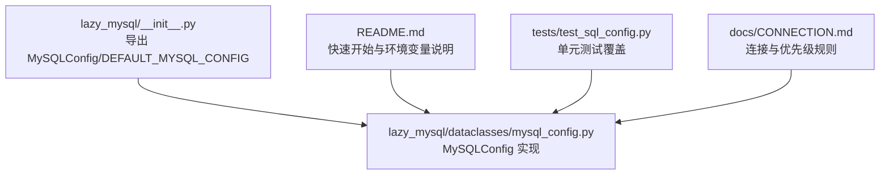
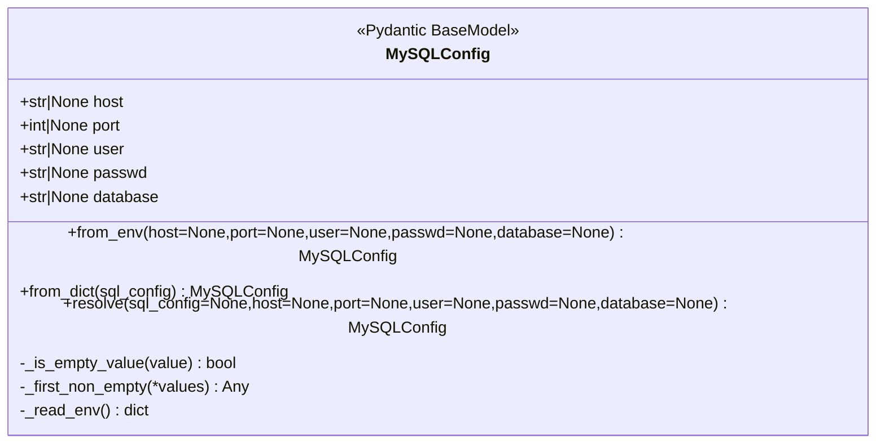
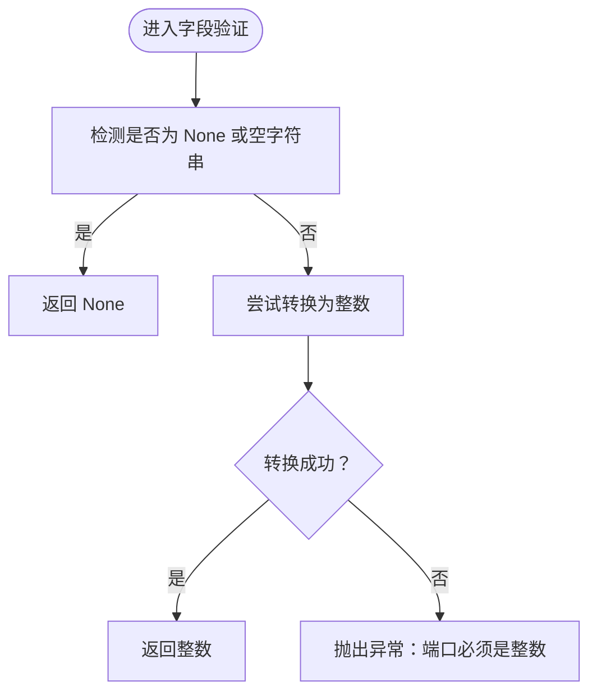
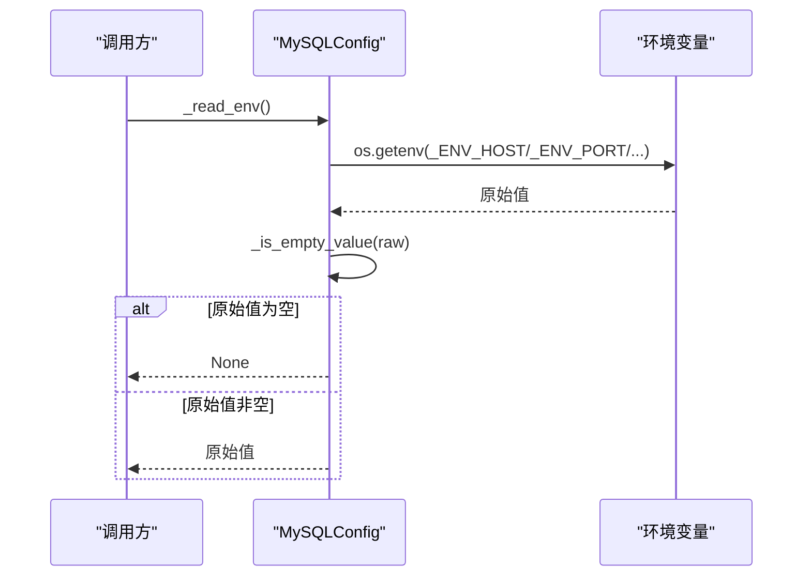
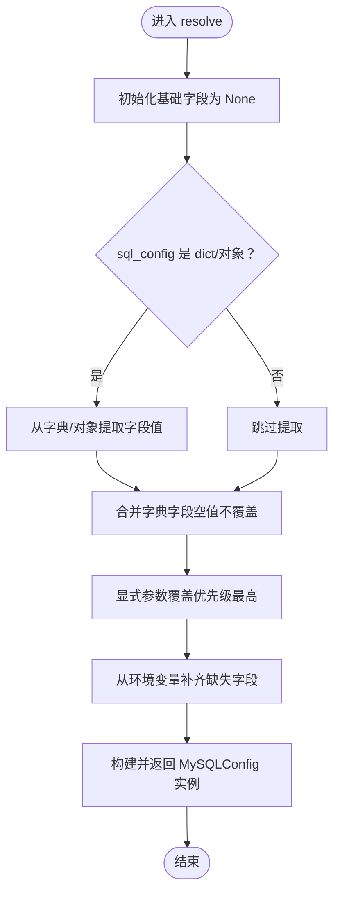
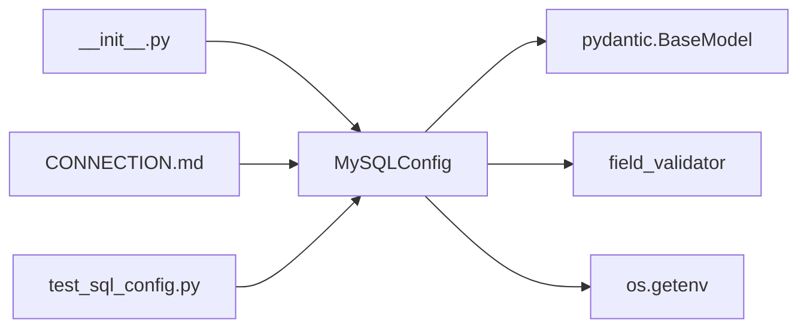

# MySQLConfig配置类

<cite>
**本文引用的文件**
- [mysql_config.py](file://lazy_mysql/dataclasses/mysql_config.py)
- [__init__.py](file://lazy_mysql/__init__.py)
- [README.md](file://README.md)
- [test_sql_config.py](file://tests/test_sql_config.py)
- [CONNECTION.md](file://docs/CONNECTION.md)
</cite>

## 目录
1. [简介](#简介)
2. [项目结构](#项目结构)
3. [核心组件](#核心组件)
4. [架构总览](#架构总览)
5. [详细组件分析](#详细组件分析)
6. [依赖关系分析](#依赖关系分析)
7. [性能考量](#性能考量)
8. [故障排查指南](#故障排查指南)
9. [结论](#结论)
10. [附录](#附录)

## 简介
本文件系统性地介绍 MySQLConfig 配置类的完整实现与使用方法，涵盖：
- 属性定义与类型约束
- 字段验证器工作机制（含空字符串到 None 的转换与端口强制转换）
- 环境变量读取与_get方法实现
- resolve方法的统一解析逻辑与优先级规则
- 多种配置加载方式的完整示例
- 配置验证错误处理与常见问题解决方案

## 项目结构
MySQLConfig 位于数据类模块中，作为连接配置的核心载体，配合 SQLExecutor 使用，并通过包导出提供便捷访问。

图表来源
- [__init__.py:1-21](file://lazy_mysql/__init__.py#L1-L21)
- [mysql_config.py:1-135](file://lazy_mysql/dataclasses/mysql_config.py#L1-L135)
- [README.md:26-56](file://README.md#L26-L56)
- [test_sql_config.py:1-164](file://tests/test_sql_config.py#L1-L164)
- [CONNECTION.md:56-132](file://docs/CONNECTION.md#L56-L132)

章节来源
- [__init__.py:1-21](file://lazy_mysql/__init__.py#L1-L21)
- [mysql_config.py:1-135](file://lazy_mysql/dataclasses/mysql_config.py#L1-L135)
- [README.md:26-56](file://README.md#L26-L56)
- [test_sql_config.py:1-164](file://tests/test_sql_config.py#L1-L164)
- [CONNECTION.md:56-132](file://docs/CONNECTION.md#L56-L132)

## 核心组件
- MySQLConfig：基于 Pydantic BaseModel 的配置模型，负责数据库连接参数的解析、校验与合并。
- 关键字段
  - host：数据库主机地址（可为 None）
  - port：数据库端口（整数或 None）
  - user：用户名（可为 None）
  - passwd：密码（可为 None）
  - database：默认数据库名（可为 None）
- 环境变量常量
  - _ENV_HOST、_ENV_PORT、_ENV_USER、_ENV_PASSWD、_ENV_DATABASE
- 工具方法
  - _is_empty_value：统一空值判定（None 或空字符串）
  - _first_non_empty：按顺序返回首个非空值
  - _read_env：从环境变量读取并标准化为空值
  - from_env：从环境变量与显式参数合并构建配置
  - from_dict：从字典构建配置（内部委托 resolve）
  - resolve：统一解析入口（显式参数 > 字典/对象 > 环境变量）

章节来源
- [mysql_config.py:10-135](file://lazy_mysql/dataclasses/mysql_config.py#L10-L135)

## 架构总览
MySQLConfig 的设计遵循“统一解析、分层合并”的原则，确保不同来源的配置能够以明确的优先级规则进行合并，同时对输入进行严格的空值与类型校验。

图表来源
- [mysql_config.py:10-135](file://lazy_mysql/dataclasses/mysql_config.py#L10-L135)

## 详细组件分析

### 字段验证器与空值处理
- _empty_str_to_none：在 before 模式下对 host、user、passwd、database 进行空字符串到 None 的转换，消除 None 与 "" 的语义歧义。
- _coerce_port：在 before 模式下对 port 进行空字符串到 None 的处理，并尝试将非空字符串转换为整数；若转换失败，抛出异常，提示端口必须为整数。

图表来源
- [mysql_config.py:25-40](file://lazy_mysql/dataclasses/mysql_config.py#L25-L40)

章节来源
- [mysql_config.py:25-40](file://lazy_mysql/dataclasses/mysql_config.py#L25-L40)

### 环境变量读取与_get实现
- _ENV_* 常量定义了对应的环境变量键名。
- _read_env：遍历各字段，调用内部_get(key)读取环境变量；若值为空（None 或空字符串），统一返回 None。
- _get：封装 os.getenv 并进行空值判定，避免空字符串污染配置。

图表来源
- [mysql_config.py:47-60](file://lazy_mysql/dataclasses/mysql_config.py#L47-L60)

章节来源
- [mysql_config.py:47-60](file://lazy_mysql/dataclasses/mysql_config.py#L47-L60)

### resolve方法的统一解析逻辑
resolve 是配置解析的统一入口，遵循“显式参数 > 字典/配置对象 > 环境变量”的优先级规则，并保证空值不会覆盖已有值。

图表来源
- [mysql_config.py:88-132](file://lazy_mysql/dataclasses/mysql_config.py#L88-L132)

章节来源
- [mysql_config.py:88-132](file://lazy_mysql/dataclasses/mysql_config.py#L88-L132)

### 工厂方法与默认配置
- from_env：从环境变量读取配置，显式参数优先级更高，空值不会覆盖已有值。
- from_dict：从字典读取配置，内部委托 resolve。
- DEFAULT_MYSQL_CONFIG：通过 resolve() 生成默认配置，所有字段均来自环境变量。

章节来源
- [mysql_config.py:70-80](file://lazy_mysql/dataclasses/mysql_config.py#L70-L80)
- [mysql_config.py:83-85](file://lazy_mysql/dataclasses/mysql_config.py#L83-L85)
- [mysql_config.py:134-135](file://lazy_mysql/dataclasses/mysql_config.py#L134-L135)

## 依赖关系分析
- 依赖 pydantic.BaseModel 与 field_validator 实现字段级校验。
- 依赖 os.getenv 读取系统环境变量。
- 通过包导出向外部暴露 MySQLConfig 与 DEFAULT_MYSQL_CONFIG。
- 文档与测试共同验证优先级与空值处理的行为。

图表来源
- [mysql_config.py:8-8](file://lazy_mysql/dataclasses/mysql_config.py#L8-L8)
- [__init__.py:1-2](file://lazy_mysql/__init__.py#L1-L2)
- [CONNECTION.md:56-132](file://docs/CONNECTION.md#L56-L132)
- [test_sql_config.py:1-164](file://tests/test_sql_config.py#L1-L164)

章节来源
- [mysql_config.py:8-8](file://lazy_mysql/dataclasses/mysql_config.py#L8-L8)
- [__init__.py:1-2](file://lazy_mysql/__init__.py#L1-L2)
- [CONNECTION.md:56-132](file://docs/CONNECTION.md#L56-L132)
- [test_sql_config.py:1-164](file://tests/test_sql_config.py#L1-L164)

## 性能考量
- 字段验证器在 before 模式下进行，开销极小，仅涉及空值判断与一次类型转换。
- 环境变量读取为 O(1) 操作，整体解析复杂度主要取决于输入规模（字典/对象字段数量）。
- 空值判定与优先级合并均为线性扫描，时间复杂度 O(n)，n 为字段数量（固定常量级）。

## 故障排查指南
- 端口类型错误
  - 现象：解析 port 时抛出异常，提示端口必须是整数。
  - 原因：传入的 port 既非 None/空字符串，又无法转换为整数。
  - 解决：确保 port 为整数或可转换为整数的字符串，或留空让环境变量接管。
  - 参考路径：[mysql_config.py:32-40](file://lazy_mysql/dataclasses/mysql_config.py#L32-L40)
- 空字符串导致字段缺失
  - 现象：某些字段值为 None，实际期望从环境变量读取。
  - 原因：空字符串被转换为 None，且显式参数未提供有效值。
  - 解决：提供非空字符串或留空让环境变量补齐；或显式传入 None 以外的有效值。
  - 参考路径：[mysql_config.py:25-30](file://lazy_mysql/dataclasses/mysql_config.py#L25-L30)
- 优先级误解
  - 现象：期望字典配置覆盖环境变量，但最终仍使用环境变量。
  - 原因：字典中对应字段为空值（None 或空字符串），不会覆盖已有值。
  - 解决：确保字典中提供非空字符串；或使用显式参数覆盖。
  - 参考路径：[mysql_config.py:88-132](file://lazy_mysql/dataclasses/mysql_config.py#L88-L132)
- 环境变量未设置
  - 现象：连接失败或默认值不符合预期。
  - 原因：相关环境变量未设置或为空。
  - 解决：设置正确的环境变量，或在调用处显式传参。
  - 参考路径：[mysql_config.py:47-60](file://lazy_mysql/dataclasses/mysql_config.py#L47-L60)

章节来源
- [mysql_config.py:25-40](file://lazy_mysql/dataclasses/mysql_config.py#L25-L40)
- [mysql_config.py:47-60](file://lazy_mysql/dataclasses/mysql_config.py#L47-L60)
- [mysql_config.py:88-132](file://lazy_mysql/dataclasses/mysql_config.py#L88-L132)

## 结论
MySQLConfig 通过清晰的优先级规则与严格的空值/类型校验，实现了灵活而可靠的数据库连接配置管理。其工厂方法与默认配置进一步简化了使用方式，适用于本地开发、容器化部署与 CI/CD 等多种场景。

## 附录

### 使用示例与最佳实践
- 从环境变量加载
  - 通过 DEFAULT_MYSQL_CONFIG 或 from_env() 从环境变量读取配置。
  - 参考路径：[CONNECTION.md:56-80](file://docs/CONNECTION.md#L56-L80)
- 从字典加载
  - 使用 from_dict() 或 resolve() 将字典转换为配置对象。
  - 参考路径：[mysql_config.py:83-85](file://lazy_mysql/dataclasses/mysql_config.py#L83-L85)
- 显式参数配置
  - 直接传入 host、port、user、passwd、database 等参数。
  - 参考路径：[README.md:28-56](file://README.md#L28-L56)
- 混合配置
  - 未提供的字段从环境变量补齐，显式参数优先级最高。
  - 参考路径：[mysql_config.py:88-132](file://lazy_mysql/dataclasses/mysql_config.py#L88-L132)

### 验证与测试参考
- 环境变量读取与优先级验证
  - 参考路径：[test_sql_config.py:5-18](file://tests/test_sql_config.py#L5-L18)
- resolve 接受 None 并从环境变量读取
  - 参考路径：[test_sql_config.py:21-28](file://tests/test_sql_config.py#L21-L28)
- resolve 接受字典并填充缺失值
  - 参考路径：[test_sql_config.py:48-60](file://tests/test_sql_config.py#L48-L60)
- SQLExecutor 接收可选配置与字典配置
  - 参考路径：[test_sql_config.py:63-91](file://tests/test_sql_config.py#L63-L91)
  - 参考路径：[test_sql_config.py:93-123](file://tests/test_sql_config.py#L93-L123)