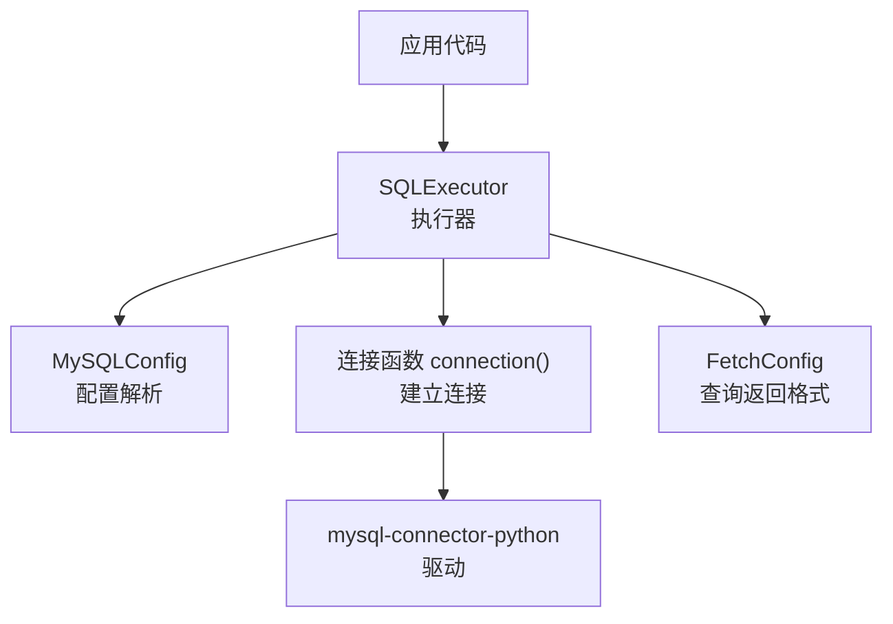
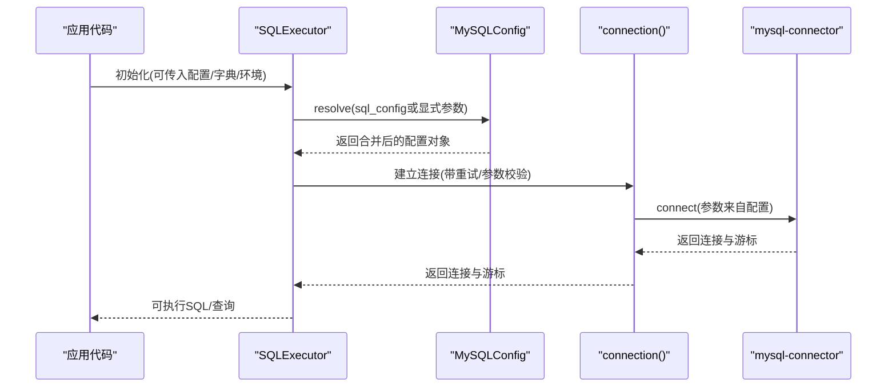
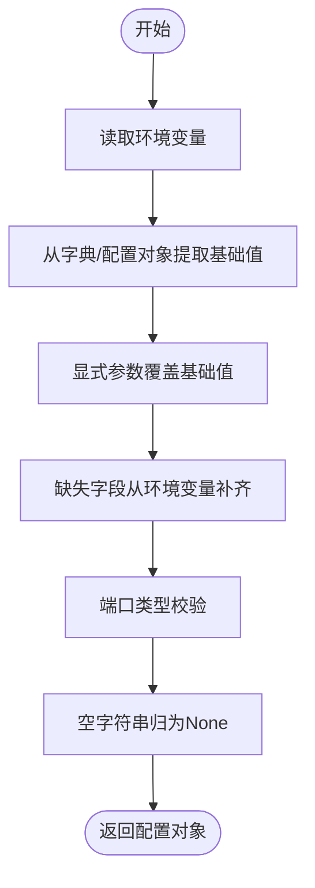
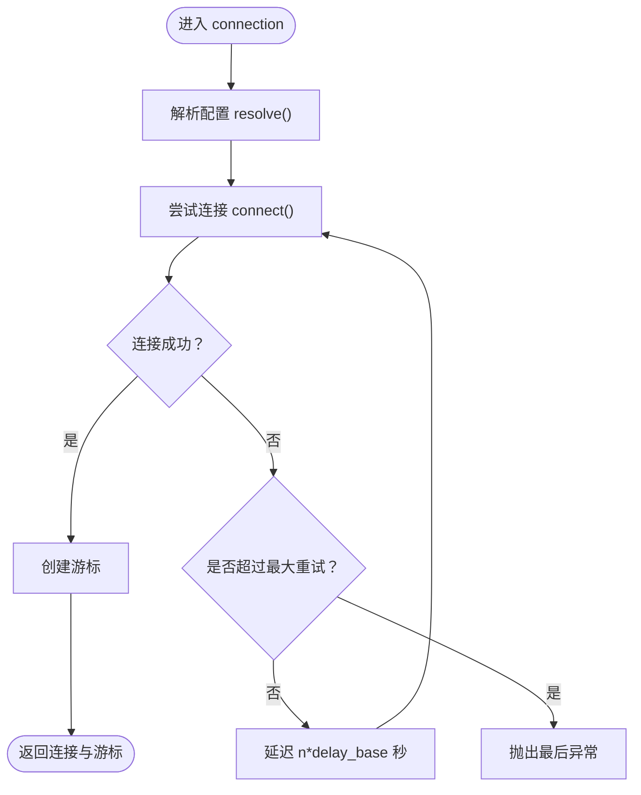
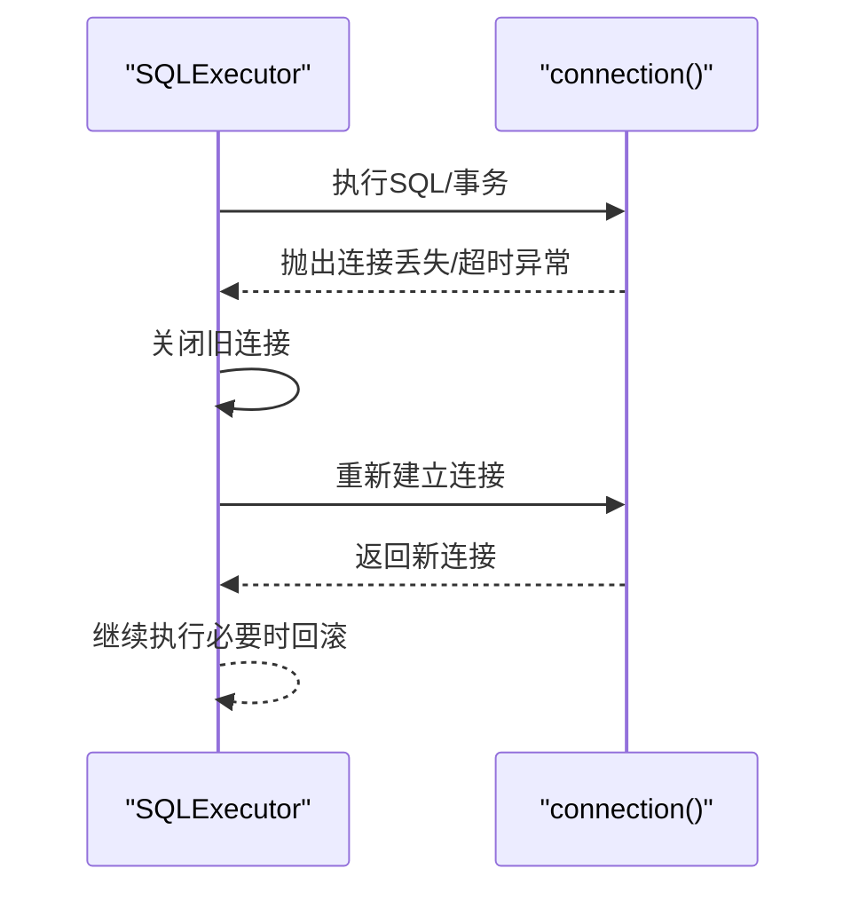
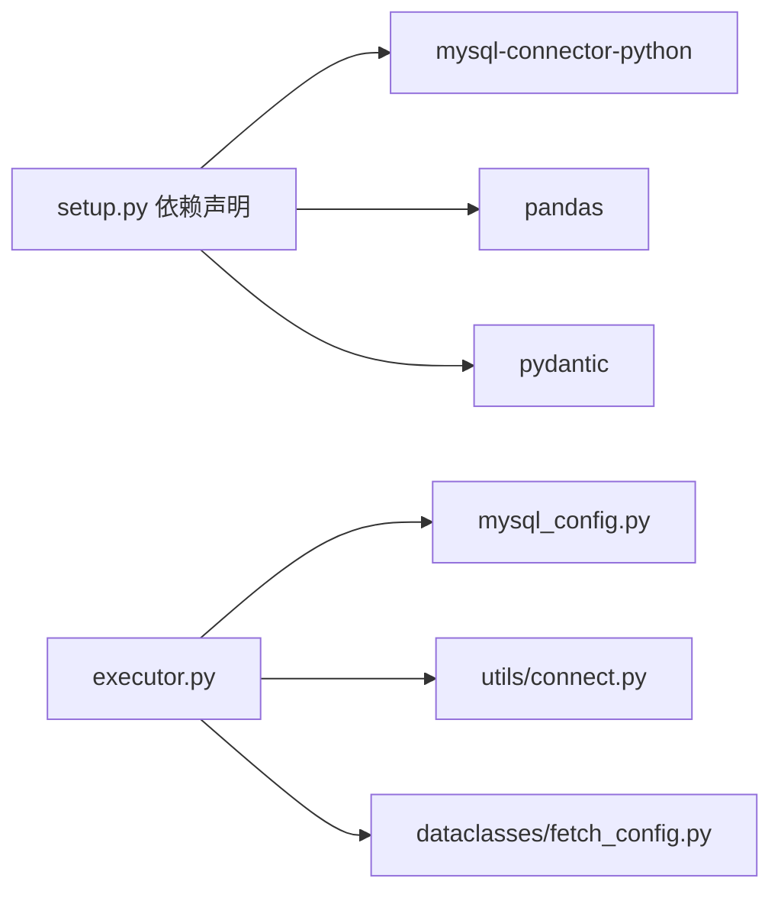

# 配置最佳实践

<cite>
**本文引用的文件**
- [lazy_mysql/dataclasses/mysql_config.py](file://lazy_mysql/dataclasses/mysql_config.py)
- [lazy_mysql/utils/connect.py](file://lazy_mysql/utils/connect.py)
- [lazy_mysql/executor.py](file://lazy_mysql/executor.py)
- [lazy_mysql/dataclasses/fetch_config.py](file://lazy_mysql/dataclasses/fetch_config.py)
- [docs/FETCH_CONFIG.md](file://docs/FETCH_CONFIG.md)
- [docs/CONNECTION.md](file://docs/CONNECTION.md)
- [tests/test_sql_config.py](file://tests/test_sql_config.py)
- [lazy_mysql/__init__.py](file://lazy_mysql/__init__.py)
- [setup.py](file://setup.py)
</cite>

## 目录
1. [简介](#简介)
2. [项目结构](#项目结构)
3. [核心组件](#核心组件)
4. [架构总览](#架构总览)
5. [详细组件分析](#详细组件分析)
6. [依赖分析](#依赖分析)
7. [性能考量](#性能考量)
8. [故障排查指南](#故障排查指南)
9. [结论](#结论)
10. [附录](#附录)

## 简介
本文件面向使用 lazy_mysql 的开发者，提供“配置管理”的最佳实践指导。内容覆盖不同环境（开发、测试、生产）的配置策略与注意事项，配置文件组织与命名规范，敏感信息的安全存储与管理，配置验证与调试技巧，以及热更新与动态配置的可行方案。同时给出安全建议（如密码加密存储、最小权限原则）与完整配置模板与示例，帮助快速落地。

## 项目结构
lazy_mysql 的配置体系围绕“配置解析优先级”展开：显式参数 > 字典/配置对象 > 环境变量。核心模块包括：
- 配置解析：MySQLConfig（负责从环境变量、字典、显式参数解析并合并）
- 连接层：utils/connect.py（基于 mysql-connector-python 建立连接，带重试与参数校验）
- 执行器：executor.py（封装 SQL 执行、查询格式化、事务与错误重连）
- 查询返回格式：FetchConfig（控制查询结果的返回模式与格式）

图表来源
- [lazy_mysql/executor.py:14-25](file://lazy_mysql/executor.py#L14-L25)
- [lazy_mysql/dataclasses/mysql_config.py:10-135](file://lazy_mysql/dataclasses/mysql_config.py#L10-L135)
- [lazy_mysql/utils/connect.py:16-91](file://lazy_mysql/utils/connect.py#L16-L91)
- [lazy_mysql/dataclasses/fetch_config.py:8-24](file://lazy_mysql/dataclasses/fetch_config.py#L8-L24)

章节来源
- [lazy_mysql/executor.py:14-25](file://lazy_mysql/executor.py#L14-L25)
- [lazy_mysql/dataclasses/mysql_config.py:10-135](file://lazy_mysql/dataclasses/mysql_config.py#L10-L135)
- [lazy_mysql/utils/connect.py:16-91](file://lazy_mysql/utils/connect.py#L16-L91)
- [lazy_mysql/dataclasses/fetch_config.py:8-24](file://lazy_mysql/dataclasses/fetch_config.py#L8-L24)

## 核心组件
- MySQLConfig：统一解析配置来源，支持空值不覆盖、端口类型校验、环境变量读取与优先级合并。
- connection：建立数据库连接，支持重试、参数校验与游标类型选择。
- SQLExecutor：封装连接生命周期、事务提交、错误重连、查询格式化与常用 CRUD 工具。
- FetchConfig：控制查询返回格式（all/oneTuple/one）、输出格式（原始/扁平/DF/DF字典）、列名映射与计数显示。

章节来源
- [lazy_mysql/dataclasses/mysql_config.py:10-135](file://lazy_mysql/dataclasses/mysql_config.py#L10-L135)
- [lazy_mysql/utils/connect.py:16-91](file://lazy_mysql/utils/connect.py#L16-L91)
- [lazy_mysql/executor.py:14-25](file://lazy_mysql/executor.py#L14-L25)
- [lazy_mysql/dataclasses/fetch_config.py:8-24](file://lazy_mysql/dataclasses/fetch_config.py#L8-L24)

## 架构总览
下图展示“配置解析与连接建立”的关键交互：

图表来源
- [lazy_mysql/executor.py:20-24](file://lazy_mysql/executor.py#L20-L24)
- [lazy_mysql/dataclasses/mysql_config.py:88-132](file://lazy_mysql/dataclasses/mysql_config.py#L88-L132)
- [lazy_mysql/utils/connect.py:16-91](file://lazy_mysql/utils/connect.py#L16-L91)

## 详细组件分析

### MySQLConfig 配置解析
- 环境变量键名：LAZY_MYSQL_HOST、LAZY_MYSQL_PORT、LAZY_MYSQL_USER、LAZY_MYSQL_PASSWD、LAZY_MYSQL_DATABASE。
- 优先级：显式参数 > 字典/配置对象 > 环境变量；空值（None 或 ""）不会覆盖已有值。
- 端口类型校验：非空字符串尝试转为整数，非法输入抛出异常。
- 数据库字段：支持 database 与 default_database（兼容）。

图表来源
- [lazy_mysql/dataclasses/mysql_config.py:47-132](file://lazy_mysql/dataclasses/mysql_config.py#L47-L132)

章节来源
- [lazy_mysql/dataclasses/mysql_config.py:10-135](file://lazy_mysql/dataclasses/mysql_config.py#L10-L135)
- [tests/test_sql_config.py:5-61](file://tests/test_sql_config.py#L5-L61)

### 连接与重试机制
- 连接参数：host、port、user、password、database、buffered、use_pure、allow_local_infile 等。
- 重试策略：对连接超时与接口错误进行指数退避重试（最大重试次数与延迟基数可配置）。
- 版本提示：对 mysql-connector-python 版本过旧给出升级提示。

图表来源
- [lazy_mysql/utils/connect.py:16-91](file://lazy_mysql/utils/connect.py#L16-L91)

章节来源
- [lazy_mysql/utils/connect.py:16-91](file://lazy_mysql/utils/connect.py#L16-L91)

### 执行器与错误重连
- SQLExecutor 在连接丢失或超时时尝试自动重连，必要时回滚事务并抛出异常。
- 支持 commit/close 生命周期管理，避免资源泄漏。

图表来源
- [lazy_mysql/executor.py:62-106](file://lazy_mysql/executor.py#L62-L106)

章节来源
- [lazy_mysql/executor.py:62-106](file://lazy_mysql/executor.py#L62-L106)

### 查询返回格式 FetchConfig
- fetch_mode：all/oneTuple/one
- output_format：空/df/df_dict/list_1/dict（oneTuple时）
- data_label：DataFrame列名或字典键名映射
- show_count：是否返回(数据, 数量)

章节来源
- [lazy_mysql/dataclasses/fetch_config.py:8-24](file://lazy_mysql/dataclasses/fetch_config.py#L8-L24)
- [docs/FETCH_CONFIG.md:1-223](file://docs/FETCH_CONFIG.md#L1-L223)

## 依赖分析
- 外部依赖：mysql-connector-python、pandas、pydantic。
- 版本要求：mysql-connector-python>=9.4.0，pandas>=2.3.1，pydantic>=2.0.0。
- 内部耦合：SQLExecutor 依赖 MySQLConfig 与 connection；FetchConfig 用于查询结果格式化。

图表来源
- [setup.py:14-18](file://setup.py#L14-L18)
- [lazy_mysql/executor.py:1-5](file://lazy_mysql/executor.py#L1-L5)
- [lazy_mysql/dataclasses/mysql_config.py:10-135](file://lazy_mysql/dataclasses/mysql_config.py#L10-L135)
- [lazy_mysql/utils/connect.py:1-91](file://lazy_mysql/utils/connect.py#L1-L91)
- [lazy_mysql/dataclasses/fetch_config.py:8-24](file://lazy_mysql/dataclasses/fetch_config.py#L8-L24)

章节来源
- [setup.py:14-18](file://setup.py#L14-L18)
- [lazy_mysql/executor.py:1-5](file://lazy_mysql/executor.py#L1-L5)

## 性能考量
- 连接参数：buffered=True、use_pure=True、allow_local_infile=True（按需启用）。
- 批量插入：executor 内部根据数据量自动选择最优策略（executemany 分批或 LOAD DATA INFILE）。
- 查询格式化：DataFrame/字典列表会引入额外内存与序列化成本，按需开启。
- 重试延迟：合理设置重试次数与延迟基数，避免雪崩效应。

## 故障排查指南
- 常见错误与定位
  - 端口类型错误：端口非整数导致校验失败。检查环境变量或传入参数。
  - 连接超时/接口错误：触发重试；若持续失败，检查网络、DNS、防火墙与数据库负载。
  - “无结果集可获取”：确认游标未被提前关闭，或使用 dict_cursor=True 时的返回格式。
  - 空值不覆盖：若高优先级来源为空（None/""），不会覆盖已有值，检查配置来源顺序。
- 调试技巧
  - 使用 tests/test_sql_config.py 中的环境变量模拟与断言，验证解析优先级。
  - 在 connection() 中临时禁用重试（max_retries=0）以便快速定位瞬时错误。
  - 通过 SQLExecutor 的错误重连逻辑观察“连接丢失/超时”场景下的自动恢复行为。

章节来源
- [lazy_mysql/utils/connect.py:70-90](file://lazy_mysql/utils/connect.py#L70-L90)
- [lazy_mysql/executor.py:62-106](file://lazy_mysql/executor.py#L62-L106)
- [tests/test_sql_config.py:125-163](file://tests/test_sql_config.py#L125-L163)

## 结论
lazy_mysql 的配置体系以“显式参数 > 字典/配置对象 > 环境变量”为核心，结合严格的类型校验与空值处理，确保在多环境部署中具备良好的一致性与可维护性。配合连接重试、自动重连与查询格式化能力，可在开发、测试、生产环境中稳定运行。建议在生产中强化安全与可观测性，按需启用连接池与审计日志，并定期评估依赖版本。

## 附录

### 环境配置策略与命名规范
- 开发环境
  - 本地 MySQL：LAZY_MYSQL_HOST=localhost、LAZY_MYSQL_PORT=3306、LAZY_MYSQL_USER=root、LAZY_MYSQL_PASSWD=（本地空密码或短密码）、LAZY_MYSQL_DATABASE=dev_db
  - 便于快速启动，建议开启 allow_local_infile 以支持本地数据导入
- 测试环境
  - 使用独立数据库与账号，最小权限原则；LAZY_MYSQL_DATABASE=test_db
  - 通过 CI 环境变量注入，避免硬编码
- 生产环境
  - 使用只读账号用于查询，写入账号分离；LAZY_MYSQL_DATABASE=prod_db
  - 严格限制网络访问与 TLS；避免明文密码，优先使用密钥管理服务

命名规范
- 环境变量统一前缀 LAZY_MYSQL_，字段与含义一一对应
- 配置文件建议采用 .env 或 YAML/JSON，按环境拆分（如 .env.development/.env.production），仅在本地或 CI 中使用

### 敏感信息存储与管理
- 密码与密钥
  - 使用密钥管理服务（如云厂商 KMS、Vault）或环境变量注入
  - 避免将敏感信息提交至仓库；使用 .gitignore 屏蔽本地配置文件
- 最小权限原则
  - 为不同环境与角色分配最小必要权限；读写分离、只读账号用于报表查询
- 加密与传输
  - 启用 TLS 连接；避免明文传输
  - 定期轮换密钥与账号

### 配置验证与调试
- 单元测试参考
  - 使用 pytest 与 monkeypatch 注入环境变量，验证解析优先级与空值处理
  - 示例断言：host/port/user/passwd/database 从环境变量读取；显式参数覆盖；空值不覆盖
- 运行时验证
  - 在 connection() 中临时禁用重试，快速定位瞬时错误
  - 使用 SQLExecutor 的错误重连逻辑观察连接丢失/超时场景

章节来源
- [tests/test_sql_config.py:5-61](file://tests/test_sql_config.py#L5-L61)
- [tests/test_sql_config.py:125-163](file://tests/test_sql_config.py#L125-L163)

### 热更新与动态配置
- 现状与建议
  - 当前连接建立后，配置对象不再动态刷新；如需“热更新”，建议在应用层面重建 SQLExecutor 实例并注入新的配置对象
  - 对于只读参数（如 host/port/user/database），可在业务层缓存并按需替换；对写入参数（如 passwd）谨慎处理
- 动态配置落地
  - 使用配置中心（如 Consul、etcd）拉取最新配置，应用启动或定时任务周期性重建连接
  - 对于 FetchConfig，可在每次查询前按需组装，无需重启进程

### 安全性考虑
- 密码加密存储：使用密钥管理服务或环境变量；避免明文存储
- 最小权限原则：为不同角色与环境分配最小权限；读写分离
- 传输安全：启用 TLS；限制网络访问范围
- 日志与审计：避免在日志中打印敏感信息；对关键操作增加审计

### 配置模板与示例
- 基础配置（环境变量）
  - LAZY_MYSQL_HOST、LAZY_MYSQL_PORT、LAZY_MYSQL_USER、LAZY_MYSQL_PASSWD、LAZY_MYSQL_DATABASE
- 字典配置（兼容旧方式）
  - 传入 SQLExecutor 或 connection 的字典，字段与环境变量一致
- FetchConfig 示例（来自官方文档）
  - all/oneTuple/one 模式与输出格式（空/df/df_dict/list_1/dict）
  - data_label 与 show_count 的组合使用

章节来源
- [docs/CONNECTION.md:60-203](file://docs/CONNECTION.md#L60-L203)
- [docs/FETCH_CONFIG.md:1-223](file://docs/FETCH_CONFIG.md#L1-L223)
- [lazy_mysql/dataclasses/fetch_config.py:8-24](file://lazy_mysql/dataclasses/fetch_config.py#L8-L24)