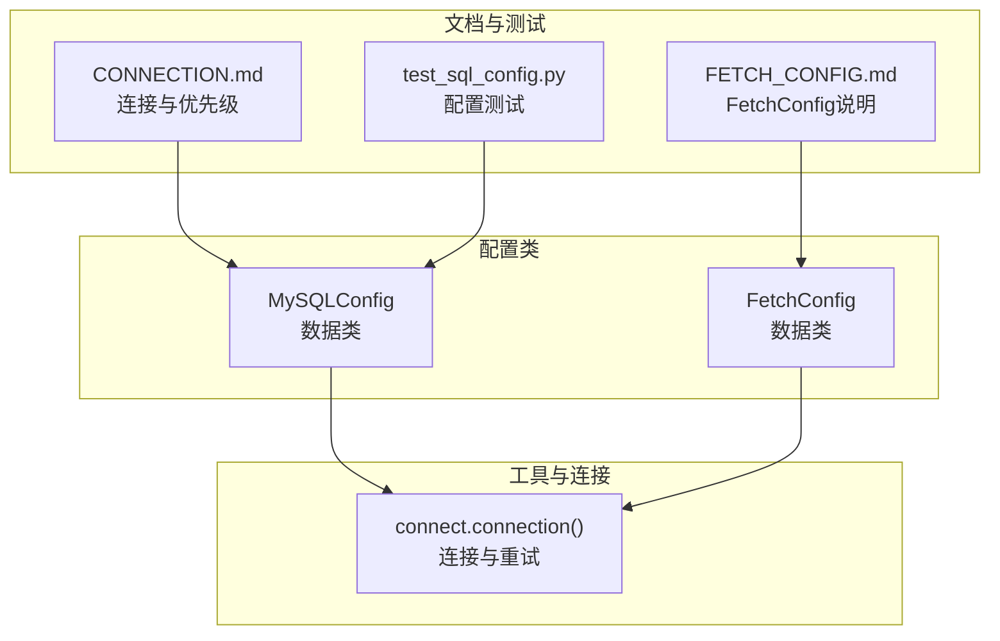
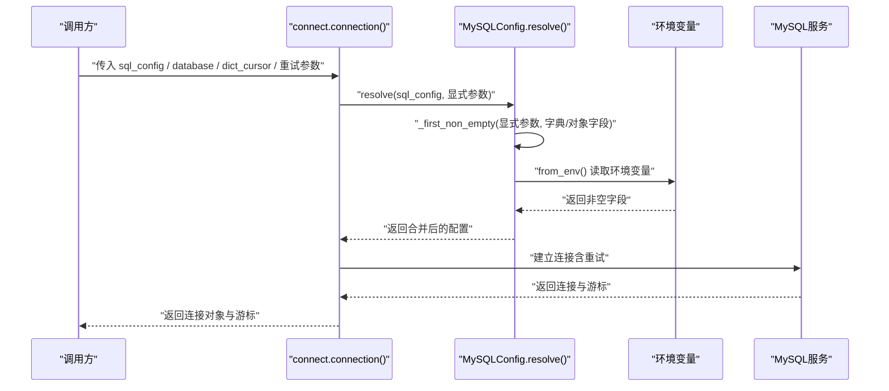
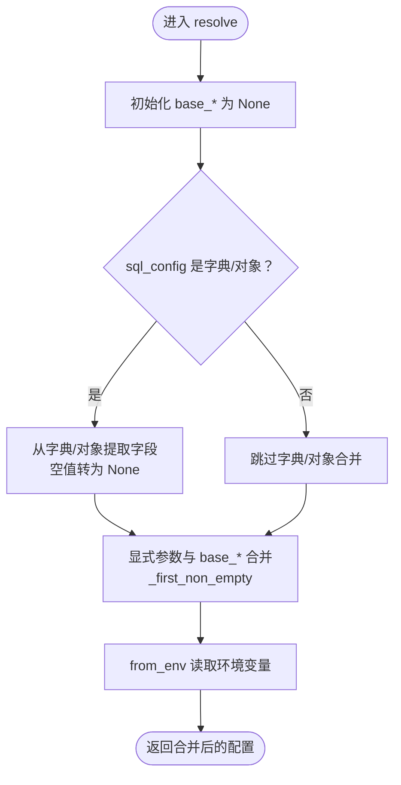
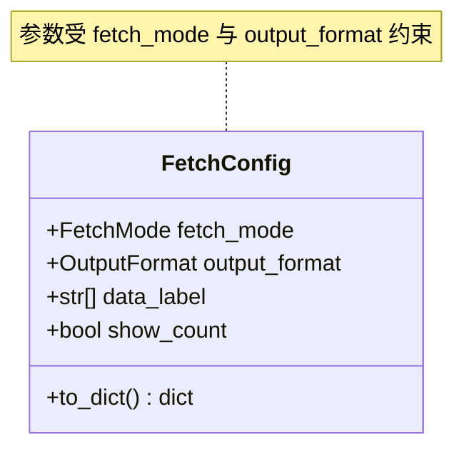
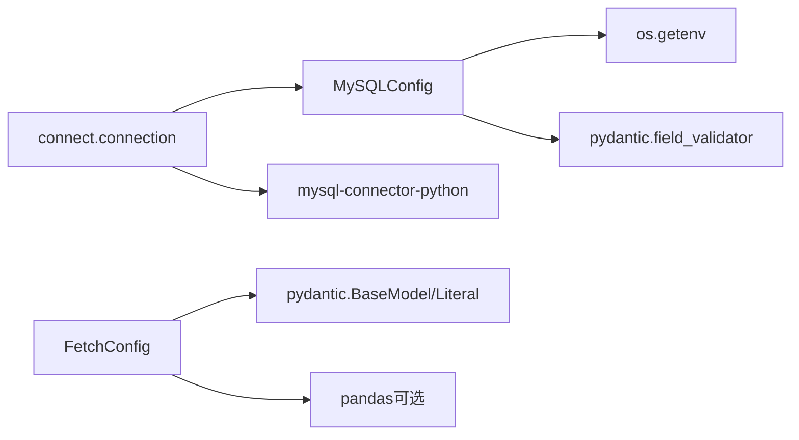

# 配置管理

<cite>
**本文引用的文件**
- [mysql_config.py](file://lazy_mysql/dataclasses/mysql_config.py)
- [fetch_config.py](file://lazy_mysql/dataclasses/fetch_config.py)
- [connect.py](file://lazy_mysql/utils/connect.py)
- [CONNECTION.md](file://docs/CONNECTION.md)
- [FETCH_CONFIG.md](file://docs/FETCH_CONFIG.md)
- [test_sql_config.py](file://tests/test_sql_config.py)
- [__init__.py](file://lazy_mysql/__init__.py)
</cite>

## 目录
1. [简介](#简介)
2. [项目结构](#项目结构)
3. [核心组件](#核心组件)
4. [架构总览](#架构总览)
5. [详细组件分析](#详细组件分析)
6. [依赖分析](#依赖分析)
7. [性能考虑](#性能考虑)
8. [故障排查指南](#故障排查指南)
9. [结论](#结论)
10. [附录](#附录)

## 简介
本文件系统性梳理 lazy_mysql 的配置管理体系，重点围绕以下目标展开：
- 深入解析 MySQLConfig 类的设计与实现，涵盖配置参数定义、验证规则、默认值策略与优先级合并策略。
- 详解 FetchConfig 配置类，解释 fetch_mode、output_format、data_label、show_count 等参数的作用与使用场景。
- 总结多种配置来源（环境变量、字典、对象）的优先级与合并策略，给出生产/开发/测试环境的最佳实践。
- 提供常见配置错误与解决方案，帮助快速定位与修复问题。

## 项目结构
配置管理相关的核心文件集中在 dataclasses 与 utils 包中，配合文档与测试用例形成完整的配置体系。

图表来源
- [mysql_config.py:10-135](file://lazy_mysql/dataclasses/mysql_config.py#L10-L135)
- [fetch_config.py:8-24](file://lazy_mysql/dataclasses/fetch_config.py#L8-L24)
- [connect.py:16-91](file://lazy_mysql/utils/connect.py#L16-L91)
- [CONNECTION.md:85-132](file://docs/CONNECTION.md#L85-L132)
- [FETCH_CONFIG.md:1-223](file://docs/FETCH_CONFIG.md#L1-L223)
- [test_sql_config.py:1-43](file://tests/test_sql_config.py#L1-L43)

章节来源
- [mysql_config.py:10-135](file://lazy_mysql/dataclasses/mysql_config.py#L10-L135)
- [fetch_config.py:8-24](file://lazy_mysql/dataclasses/fetch_config.py#L8-L24)
- [connect.py:16-91](file://lazy_mysql/utils/connect.py#L16-L91)
- [CONNECTION.md:85-132](file://docs/CONNECTION.md#L85-L132)
- [FETCH_CONFIG.md:1-223](file://docs/FETCH_CONFIG.md#L1-L223)
- [test_sql_config.py:1-43](file://tests/test_sql_config.py#L1-L43)

## 核心组件
- MySQLConfig：统一解析数据库连接配置，支持环境变量、字典、对象三种来源，具备严格的空值处理与优先级合并策略。
- FetchConfig：统一控制查询结果的返回模式与格式，支持 all/oneTuple/one 三种获取模式与多种输出格式。
- 连接工具：connection 函数负责建立连接、重试与异常处理，并通过 MySQLConfig.resolve 统一解析配置。

章节来源
- [mysql_config.py:10-135](file://lazy_mysql/dataclasses/mysql_config.py#L10-L135)
- [fetch_config.py:8-24](file://lazy_mysql/dataclasses/fetch_config.py#L8-L24)
- [connect.py:16-91](file://lazy_mysql/utils/connect.py#L16-L91)

## 架构总览
下图展示配置解析与连接建立的整体流程，体现“显式参数 > 字典/对象 > 环境变量”的优先级与空值不覆盖规则。

图表来源
- [connect.py:30-68](file://lazy_mysql/utils/connect.py#L30-L68)
- [mysql_config.py:88-132](file://lazy_mysql/dataclasses/mysql_config.py#L88-L132)
- [CONNECTION.md:85-102](file://docs/CONNECTION.md#L85-L102)

## 详细组件分析

### MySQLConfig 设计与实现
- 参数定义与默认值
  - 字段：host、port、user、passwd、database。
  - 默认值：全部为 None，未传入即为空，避免“空字符串”与“None”的语义混淆。
- 验证规则
  - 空字符串统一转为 None，防止空字符串污染后续逻辑。
  - port 字段在 before 阶段进行类型转换，非法值抛出明确错误。
- 环境变量映射
  - 通过类常量映射到 LAZY_MYSQL_HOST、LAZY_MYSQL_PORT、LAZY_MYSQL_USER、LAZY_MYSQL_PASSWD、LAZY_MYSQL_DATABASE。
- 优先级与合并策略
  - resolve 统一入口，优先级：显式参数 > 字典/对象 > 环境变量。
  - 空值（None 或 ""）不会覆盖已有值，保证“已有值不被空值回退”。
  - from_env 作为环境变量读取入口，内部再次应用 _first_non_empty 以保证优先级链路清晰。
- 默认配置
  - DEFAULT_MYSQL_CONFIG = MySQLConfig.resolve()，从环境变量读取默认值。

图表来源
- [mysql_config.py:88-132](file://lazy_mysql/dataclasses/mysql_config.py#L88-L132)

章节来源
- [mysql_config.py:10-135](file://lazy_mysql/dataclasses/mysql_config.py#L10-L135)
- [test_sql_config.py:1-43](file://tests/test_sql_config.py#L1-L43)
- [CONNECTION.md:85-132](file://docs/CONNECTION.md#L85-L132)

### FetchConfig 设计与实现
- 参数与含义
  - fetch_mode：all/oneTuple/one，控制返回数据数量与格式。
  - output_format：""/list_1/df/df_dict/dict，控制输出形态（仅对 all/oneTuple 生效）。
  - data_label：可选的列名或键名列表，用于 DataFrame 列名或字典键名重命名。
  - show_count：是否返回（数据, 总数）二元组。
- 行为约束
  - fetch_mode="one" 时，output_format 无效。
  - output_format="df"/"df_dict" 时，data_label 必须提供且非空，否则抛出错误。
  - output_format="dict" 仅在 fetch_mode="oneTuple" 且 data_label 非空时有效。
- 兼容性
  - 提供 to_dict 方法，便于与旧版字典配置兼容。

图表来源
- [fetch_config.py:8-24](file://lazy_mysql/dataclasses/fetch_config.py#L8-L24)

章节来源
- [fetch_config.py:8-24](file://lazy_mysql/dataclasses/fetch_config.py#L8-L24)
- [FETCH_CONFIG.md:1-223](file://docs/FETCH_CONFIG.md#L1-L223)

### 连接与配置解析集成
- 连接函数 connection
  - 通过 MySQLConfig.resolve 统一解析配置来源。
  - 支持 dict_cursor 控制游标返回字典或元组。
  - 内置重试机制，针对 ConnectionTimeoutError 与 InterfaceError 自动重试。
- 与 SQLExecutor 的协作
  - SQLExecutor 在构造时调用 MySQLConfig.resolve，确保配置来源与优先级一致。
  - 文档明确了“SQLExecutor 显式 database 参数 > MySQLConfig 显式参数/字典 > 环境变量”的优先级链路。

章节来源
- [connect.py:16-91](file://lazy_mysql/utils/connect.py#L16-L91)
- [CONNECTION.md:85-132](file://docs/CONNECTION.md#L85-L132)

## 依赖分析
- MySQLConfig 依赖
  - 环境变量读取：os.getenv。
  - 配置验证：pydantic field_validator。
  - 工具方法：_first_non_empty、_is_empty_value。
- FetchConfig 依赖
  - pydantic BaseModel/Field/Literal。
- 运行时依赖
  - mysql-connector-python：连接与游标。
  - pandas（可选）：当 output_format="df"/"df_dict" 时使用。

图表来源
- [mysql_config.py:5-8](file://lazy_mysql/dataclasses/mysql_config.py#L5-L8)
- [fetch_config.py:1-2](file://lazy_mysql/dataclasses/fetch_config.py#L1-L2)
- [connect.py:2-4](file://lazy_mysql/utils/connect.py#L2-L4)

章节来源
- [mysql_config.py:5-8](file://lazy_mysql/dataclasses/mysql_config.py#L5-L8)
- [fetch_config.py:1-2](file://lazy_mysql/dataclasses/fetch_config.py#L1-L2)
- [connect.py:2-4](file://lazy_mysql/utils/connect.py#L2-L4)

## 性能考虑
- 连接重试与延迟
  - 默认最大重试 5 次，延迟按线性递增（retry_delay_base * n），避免瞬时网络抖动导致频繁失败。
- 游标缓冲
  - 使用 buffered=True 避免“Unread result found”错误，提升多查询场景稳定性。
- 字典游标
  - dict_cursor=True 可简化结果处理，但会增加内存占用与序列化成本，建议按需开启。
- 版本兼容
  - 自动检查 mysql-connector-python 版本，建议升级至 9.4.0+ 以获得更好的性能与稳定性。

章节来源
- [connect.py:43-90](file://lazy_mysql/utils/connect.py#L43-L90)
- [CONNECTION.md:310-325](file://docs/CONNECTION.md#L310-L325)

## 故障排查指南
- 环境变量未生效
  - 确认环境变量键名是否正确（LAZY_MYSQL_HOST/PORT/USER/PASSWD/DATABASE）。
  - 确认值不是空字符串，空字符串会被转换为 None。
- 端口类型错误
  - port 必须为整数，非法字符串会触发 ValueError，检查传入类型与来源。
- 输出格式与 data_label 不匹配
  - 使用 output_format="df"/"df_dict" 时，data_label 必须提供且非空。
  - 使用 output_format="dict" 时，仅在 fetch_mode="oneTuple" 且 data_label 非空时有效。
- 连接失败与重试
  - ConnectionTimeoutError 与 InterfaceError 会自动重试，若仍失败，检查网络、DNS、防火墙与数据库可达性。
- 版本过时告警
  - 若出现连接器版本过时警告，建议升级到 9.4.0+。

章节来源
- [FETCH_CONFIG.md:92-153](file://docs/FETCH_CONFIG.md#L92-L153)
- [connect.py:70-90](file://lazy_mysql/utils/connect.py#L70-L90)
- [CONNECTION.md:180-228](file://docs/CONNECTION.md#L180-L228)

## 结论
lazy_mysql 的配置管理以 MySQLConfig 为核心，采用“显式参数 > 字典/对象 > 环境变量”的优先级与“空值不覆盖”的合并策略，结合 FetchConfig 的灵活输出控制，实现了跨环境、多来源的一致配置体验。配合连接层的重试与版本检查，能够在复杂环境中保持稳定与高效。

## 附录

### 配置优先级与合并策略（摘要）
- 优先级（高 → 低）
  - SQLExecutor 显式 database 参数
  - MySQLConfig 显式参数
  - 字典配置
  - 环境变量
- 合并规则
  - _first_non_empty 保证已有值不被空值覆盖。
  - 空字符串统一转为 None，避免污染配置。

章节来源
- [CONNECTION.md:85-102](file://docs/CONNECTION.md#L85-L102)
- [mysql_config.py:63-80](file://lazy_mysql/dataclasses/mysql_config.py#L63-L80)

### FetchConfig 参数速查
- fetch_mode：all/oneTuple/one
- output_format：""/list_1/df/df_dict/dict（受 fetch_mode 与 data_label 约束）
- data_label：可选，用于列名/键名重命名
- show_count：是否返回（数据, 总数）

章节来源
- [fetch_config.py:11-14](file://lazy_mysql/dataclasses/fetch_config.py#L11-L14)
- [FETCH_CONFIG.md:1-223](file://docs/FETCH_CONFIG.md#L1-L223)

### 最佳实践（按环境）
- 开发环境
  - 使用环境变量或字典配置，便于本地切换。
  - 启用 dict_cursor 以简化调试。
- 测试环境
  - 使用独立数据库与最小权限账号，通过环境变量注入。
  - 关闭 show_count 以减少额外统计开销。
- 生产环境
  - 严格使用环境变量注入敏感信息，避免硬编码。
  - 合理设置重试参数，平衡可用性与资源消耗。
  - 升级连接器版本至 9.4.0+，并定期检查版本告警。

章节来源
- [CONNECTION.md:284-300](file://docs/CONNECTION.md#L284-L300)
- [CONNECTION.md:310-325](file://docs/CONNECTION.md#L310-L325)