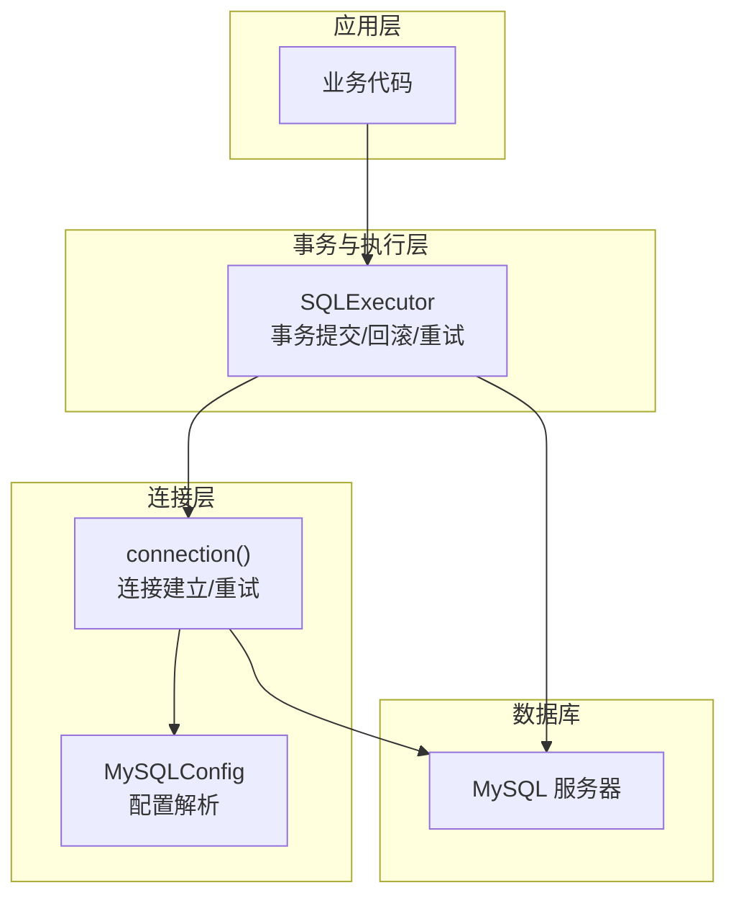
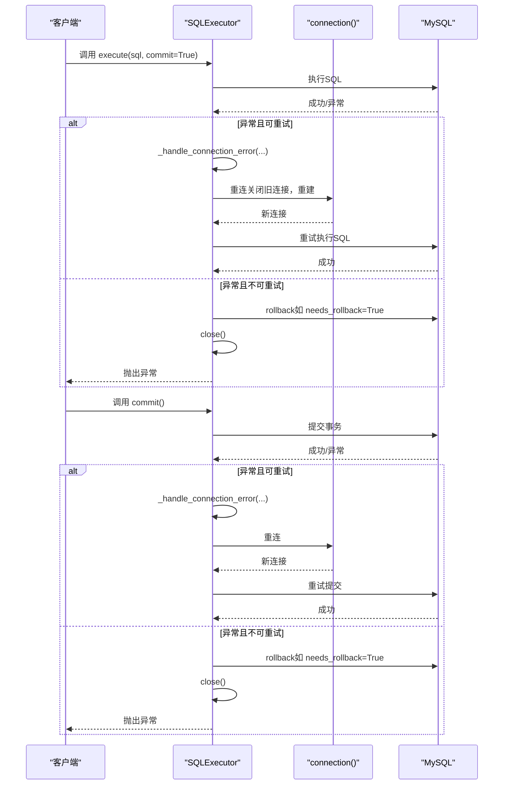
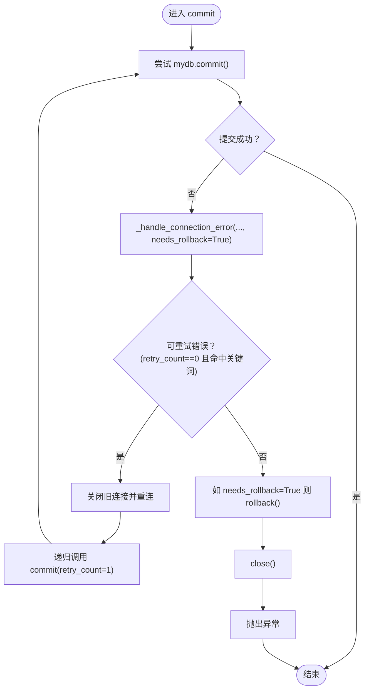
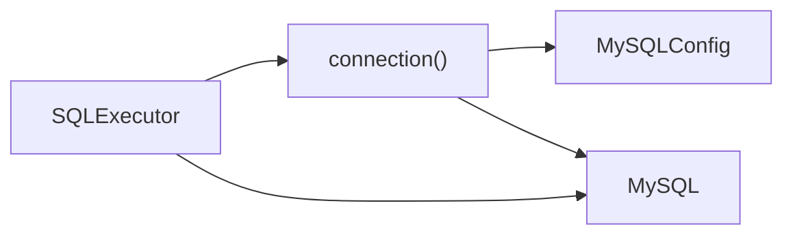

# 事务管理

<cite>
**本文引用的文件**   
- [executor.py](file://lazy_mysql/executor.py)
- [connect.py](file://lazy_mysql/utils/connect.py)
- [mysql_config.py](file://lazy_mysql/dataclasses/mysql_config.py)
- [CONNECTION.md](file://docs/CONNECTION.md)
- [2026-06-18-Yuanbao-代码审查报告.md](file://docs/code_reviews/fixed/2026-06-18-Yuanbao-代码审查报告.md)
- [数据库连接审查.md](file://docs/code_reviews/fixed/数据库连接审查.md)
</cite>

## 目录
1. [引言](#引言)
2. [项目结构](#项目结构)
3. [核心组件](#核心组件)
4. [架构总览](#架构总览)
5. [详细组件分析](#详细组件分析)
6. [依赖关系分析](#依赖关系分析)
7. [性能考量](#性能考量)
8. [故障排查指南](#故障排查指南)
9. [结论](#结论)
10. [附录](#附录)

## 引言
本文件系统性阐述 lazy_mysql 的事务管理机制与数据一致性保障策略，重点围绕 commit 方法的实现原理、自动重试机制与错误处理、needs_rollback 参数的作用与触发条件、事务边界设计原则（何时自动提交、何时手动提交）、最佳实践（长事务、死锁预防、隔离级别选择）以及事务失败后的恢复与一致性保障。

## 项目结构
围绕事务与一致性相关的关键模块如下：
- SQL 执行器：负责统一的 SQL 执行、事务提交与回滚、错误重试与恢复
- 连接管理：负责连接建立、版本检查、连接失败重试
- 配置解析：负责从多种来源解析数据库配置，确保连接参数正确性

图表来源
- [executor.py:14-24](file://lazy_mysql/executor.py#L14-L24)
- [connect.py:15-91](file://lazy_mysql/utils/connect.py#L15-L91)
- [mysql_config.py:88-132](file://lazy_mysql/dataclasses/mysql_config.py#L88-L132)

章节来源
- [executor.py:14-24](file://lazy_mysql/executor.py#L14-L24)
- [connect.py:15-91](file://lazy_mysql/utils/connect.py#L15-L91)
- [mysql_config.py:88-132](file://lazy_mysql/dataclasses/mysql_config.py#L88-L132)

## 核心组件
- SQLExecutor：封装连接、事务提交、回滚与错误处理，提供统一的 execute/commit/commit_close 接口
- connection：负责连接建立、版本检查与连接失败重试
- MySQLConfig：统一解析配置来源（显式参数 > 字典/对象 > 环境变量）

章节来源
- [executor.py:14-24](file://lazy_mysql/executor.py#L14-L24)
- [connect.py:15-91](file://lazy_mysql/utils/connect.py#L15-L91)
- [mysql_config.py:88-132](file://lazy_mysql/dataclasses/mysql_config.py#L88-L132)

## 架构总览
事务管理在 lazy_mysql 中遵循“显式控制 + 自动重试 + 回滚兜底”的设计：
- 事务边界由业务显式控制（commit 参数或显式调用 commit）
- 执行过程中遇到可重试错误（连接断开/超时）时自动重连并重试
- 发生错误时根据 needs_rollback 决定是否回滚，随后关闭连接并抛出异常

图表来源
- [executor.py:108-123](file://lazy_mysql/executor.py#L108-L123)
- [executor.py:125-184](file://lazy_mysql/executor.py#L125-L184)
- [executor.py:62-106](file://lazy_mysql/executor.py#L62-L106)
- [connect.py:15-91](file://lazy_mysql/utils/connect.py#L15-L91)

## 详细组件分析

### commit 方法实现与自动重试机制
- 调用路径：commit -> mydb.commit -> 异常捕获 -> _handle_connection_error -> 可重试则重连并递归调用 commit(retry_count=1)
- 重试判定：仅在 retry_count==0 且异常消息包含预设可重试关键词时触发重连
- 重试后行为：重连成功后继续提交；失败则进入回滚与关闭流程

图表来源
- [executor.py:108-123](file://lazy_mysql/executor.py#L108-L123)
- [executor.py:62-106](file://lazy_mysql/executor.py#L62-L106)

章节来源
- [executor.py:108-123](file://lazy_mysql/executor.py#L108-L123)
- [executor.py:62-106](file://lazy_mysql/executor.py#L62-L106)

### needs_rollback 参数与回滚触发条件
- 参数作用：指示在错误处理阶段是否需要执行回滚
- 触发条件：
  - commit 调用中：needs_rollback=True，确保提交失败时回滚
  - execute 调用中：当 commit=True 时，needs_rollback=True，确保执行失败时回滚
- 回滚行为：在连接可用时尝试 rollback；若连接已断开则忽略回滚错误

章节来源
- [executor.py:173-180](file://lazy_mysql/executor.py#L173-L180)
- [executor.py:97-102](file://lazy_mysql/executor.py#L97-L102)

### 事务边界设计原则
- 自动提交时机
  - execute 中 commit=True 时，执行后立即提交
  - insert/upsert/update/batch_update/delete 等方法均支持 commit 参数，可在单次操作完成后自动提交
- 手动提交时机
  - 将 commit=False（默认）时，需显式调用 commit() 或 commit_close() 完成事务
  - commit_close() 会在提交后关闭连接，适合一次性任务
- 事务粒度建议
  - 将相关联的 DML 操作组合在单个事务中，减少跨事务的一致性风险
  - 对批量写入场景，优先使用内置的批量执行器，减少往返次数

章节来源
- [executor.py:173-180](file://lazy_mysql/executor.py#L173-L180)
- [executor.py:213-233](file://lazy_mysql/executor.py#L213-L233)
- [executor.py:236-253](file://lazy_mysql/executor.py#L236-L253)
- [executor.py:256-269](file://lazy_mysql/executor.py#L256-L269)
- [executor.py:271-306](file://lazy_mysql/executor.py#L271-L306)

### 错误处理与恢复策略
- 可重试错误识别：基于预设关键词匹配连接断开/超时类异常
- 重连策略：关闭旧连接，使用相同配置重建连接
- 回滚与关闭：在 needs_rollback=True 时执行回滚，随后关闭连接并抛出异常
- 日志与诊断：输出 SQL 与参数（必要时），便于定位问题

章节来源
- [executor.py:62-106](file://lazy_mysql/executor.py#L62-L106)
- [executor.py:173-180](file://lazy_mysql/executor.py#L173-L180)

### 连接与事务一致性保障
- 连接建立：connection 在连接失败时按指数递增延迟重试，直至阈值
- 版本检查：连接成功后检查驱动版本，提示升级
- 配置来源：MySQLConfig 提供“显式参数 > 字典/对象 > 环境变量”的优先级解析，避免配置漂移

章节来源
- [connect.py:15-91](file://lazy_mysql/utils/connect.py#L15-L91)
- [mysql_config.py:88-132](file://lazy_mysql/dataclasses/mysql_config.py#L88-L132)

## 依赖关系分析
- SQLExecutor 依赖 connection 建立连接，并在异常时通过 connection 重连
- connection 依赖 MySQLConfig 解析配置
- 文档与审查报告明确了重试与回滚的边界与注意事项

图表来源
- [executor.py:14-24](file://lazy_mysql/executor.py#L14-L24)
- [connect.py:15-91](file://lazy_mysql/utils/connect.py#L15-L91)
- [mysql_config.py:88-132](file://lazy_mysql/dataclasses/mysql_config.py#L88-L132)

章节来源
- [executor.py:14-24](file://lazy_mysql/executor.py#L14-L24)
- [connect.py:15-91](file://lazy_mysql/utils/connect.py#L15-L91)
- [mysql_config.py:88-132](file://lazy_mysql/dataclasses/mysql_config.py#L88-L132)

## 性能考量
- 连接重试：连接层采用递增延迟重试，避免瞬时网络抖动放大
- 事务粒度：合理拆分事务，避免长时间持有锁；批量写入优先使用批量接口
- 结果缓冲：连接参数使用缓冲游标，减少“未读结果”类错误，提升吞吐

章节来源
- [connect.py:43-84](file://lazy_mysql/utils/connect.py#L43-L84)
- [CONNECTION.md:180-191](file://docs/CONNECTION.md#L180-L191)

## 故障排查指南
- 提交失败
  - 检查是否为可重试错误（连接断开/超时），系统会自动重连并重试
  - 若仍失败，确认 needs_rollback 是否生效（commit 调用中默认开启）
  - 查看异常日志与 SQL 参数，定位具体语句
- 执行失败
  - execute 中 commit=True 时，若发生错误会触发回滚
  - 检查参数格式与 SQL 语法，避免批量执行 SELECT
- 连接失败
  - 查看连接层重试日志与最终异常类型
  - 确认驱动版本与网络连通性

章节来源
- [executor.py:108-123](file://lazy_mysql/executor.py#L108-L123)
- [executor.py:125-184](file://lazy_mysql/executor.py#L125-L184)
- [executor.py:62-106](file://lazy_mysql/executor.py#L62-L106)
- [connect.py:74-84](file://lazy_mysql/utils/connect.py#L74-L84)
- [CONNECTION.md:180-228](file://docs/CONNECTION.md#L180-L228)

## 结论
lazy_mysql 的事务管理以“显式边界 + 自动重试 + 回滚兜底”为核心，通过 SQLExecutor 的统一接口与 connection 的稳健重试，确保在不稳定网络环境下仍能可靠完成事务提交与回滚。开发者应结合业务场景合理选择自动提交与手动提交的时机，遵循批量写入与短事务的原则，以获得更高的可靠性与性能。

## 附录

### 事务边界与最佳实践清单
- 何时自动提交
  - 单次写入操作（insert/upsert/update/delete）后立即 commit=True
  - 查询类操作通常无需提交（除非配合 DDL/DCL）
- 何时手动提交
  - 多步写入操作组合在一个事务中，结束后显式调用 commit()
  - 使用 commit_close() 完成一次性任务，避免连接泄漏
- 长事务注意事项
  - 减少锁持有时间，拆分为多个小事务
  - 避免在事务中执行耗时操作（如大结果集导出）
- 死锁预防
  - 统一更新顺序，避免循环等待
  - 适当降低隔离级别（谨慎评估一致性需求）
- 隔离级别选择
  - 默认 READ COMMITTED 已能满足多数场景
  - 高一致性需求可考虑 REPEATABLE READ 或 SERIALIZABLE，但需权衡性能
- 事务失败后的恢复
  - 系统自动回滚（needs_rollback=True 时）
  - 重连后再次提交，失败则关闭连接并上报

章节来源
- [executor.py:173-180](file://lazy_mysql/executor.py#L173-L180)
- [executor.py:213-306](file://lazy_mysql/executor.py#L213-L306)
- [executor.py:108-123](file://lazy_mysql/executor.py#L108-L123)
- [CONNECTION.md:180-228](file://docs/CONNECTION.md#L180-L228)