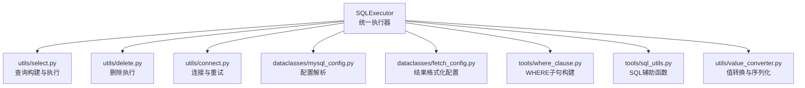
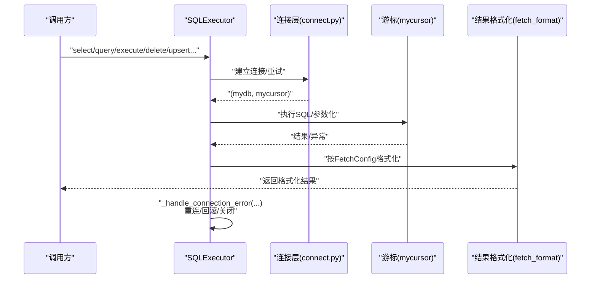
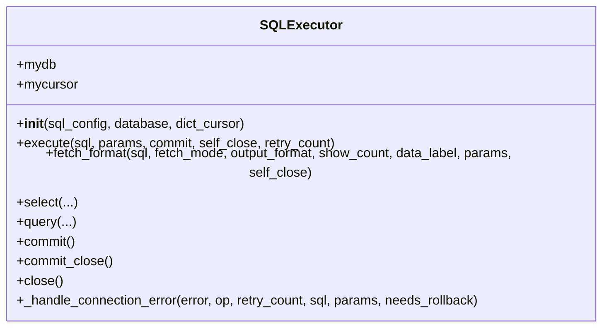
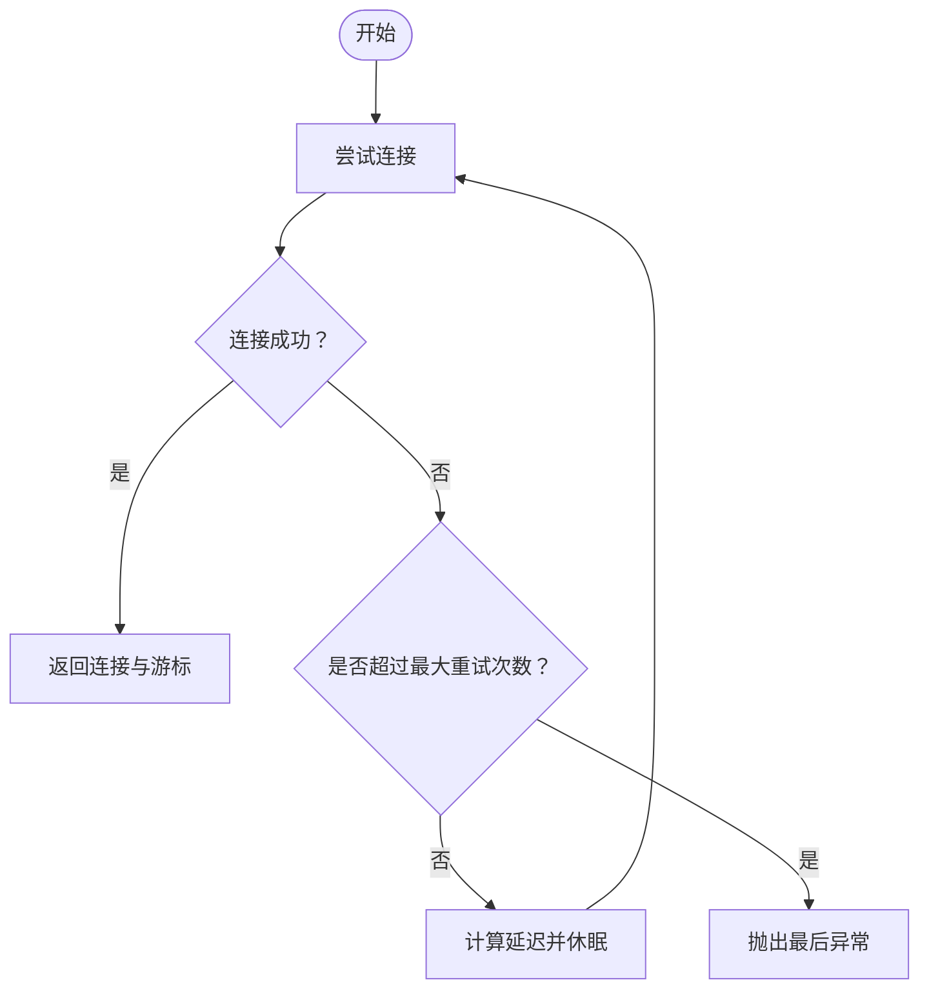
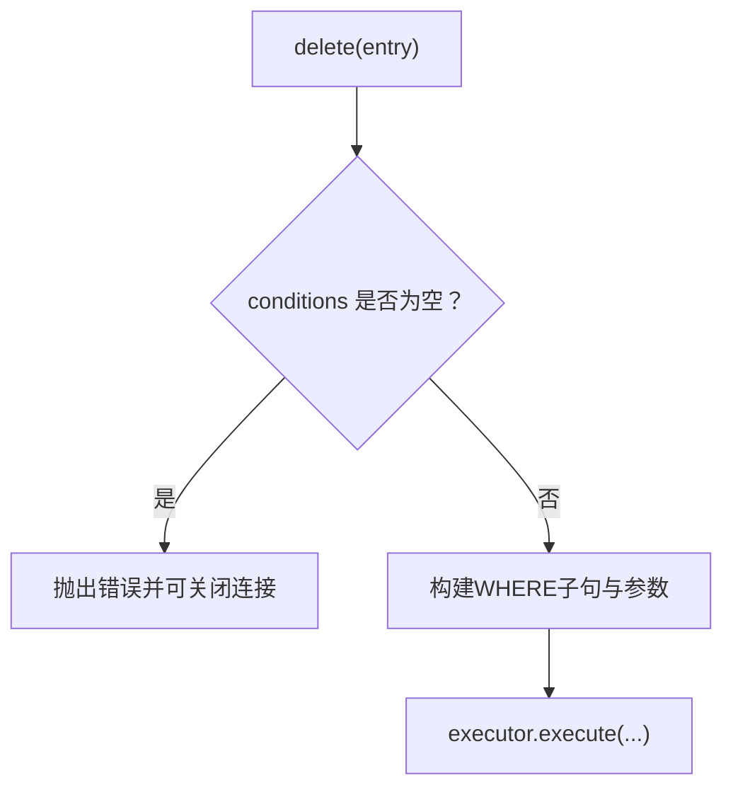
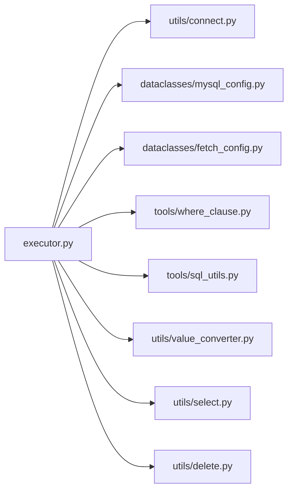

# 调试与故障排除

<cite>
**本文引用的文件**
- [README.md](file://README.md)
- [lazy_mysql/__init__.py](file://lazy_mysql/__init__.py)
- [lazy_mysql/executor.py](file://lazy_mysql/executor.py)
- [lazy_mysql/utils/connect.py](file://lazy_mysql/utils/connect.py)
- [lazy_mysql/utils/select.py](file://lazy_mysql/utils/select.py)
- [lazy_mysql/utils/delete.py](file://lazy_mysql/utils/delete.py)
- [lazy_mysql/dataclasses/mysql_config.py](file://lazy_mysql/dataclasses/mysql_config.py)
- [lazy_mysql/dataclasses/fetch_config.py](file://lazy_mysql/dataclasses/fetch_config.py)
- [lazy_mysql/tools/sql_utils.py](file://lazy_mysql/tools/sql_utils.py)
- [lazy_mysql/tools/where_clause.py](file://lazy_mysql/tools/where_clause.py)
- [lazy_mysql/utils/value_converter.py](file://lazy_mysql/utils/value_converter.py)
- [docs/CONNECTION.md](file://docs/CONNECTION.md)
</cite>

## 目录
1. [简介](#简介)
2. [项目结构](#项目结构)
3. [核心组件](#核心组件)
4. [架构总览](#架构总览)
5. [详细组件分析](#详细组件分析)
6. [依赖关系分析](#依赖关系分析)
7. [性能考量](#性能考量)
8. [故障排除指南](#故障排除指南)
9. [结论](#结论)
10. [附录](#附录)

## 简介
本指南面向使用 lazy_mysql 的开发者与运维人员，聚焦于调试技巧与故障排除。内容涵盖：
- 错误信息解读与诊断要点（SQL执行错误、连接错误、参数错误等）
- 日志记录最佳实践（关键操作日志级别、敏感信息脱敏）
- 性能问题诊断（慢查询识别、连接池监控、内存使用分析）
- 常见问题解决方案（SQL语法错误、权限不足、数据类型不匹配等）
- 调试工具与开发环境配置建议

## 项目结构
lazy_mysql 采用模块化设计，围绕 SQLExecutor 统一入口，结合 dataclasses 配置、tools 工具函数、utils 业务封装与连接层，形成清晰的层次化结构。



图表来源
- [lazy_mysql/executor.py:14-616](file://lazy_mysql/executor.py#L14-L616)
- [lazy_mysql/utils/select.py:1-237](file://lazy_mysql/utils/select.py#L1-L237)
- [lazy_mysql/utils/delete.py:1-26](file://lazy_mysql/utils/delete.py#L1-L26)
- [lazy_mysql/utils/connect.py:1-91](file://lazy_mysql/utils/connect.py#L1-L91)
- [lazy_mysql/dataclasses/mysql_config.py:1-135](file://lazy_mysql/dataclasses/mysql_config.py#L1-L135)
- [lazy_mysql/dataclasses/fetch_config.py:1-24](file://lazy_mysql/dataclasses/fetch_config.py#L1-L24)
- [lazy_mysql/tools/where_clause.py:1-127](file://lazy_mysql/tools/where_clause.py#L1-L127)
- [lazy_mysql/tools/sql_utils.py:1-53](file://lazy_mysql/tools/sql_utils.py#L1-L53)
- [lazy_mysql/utils/value_converter.py:1-115](file://lazy_mysql/utils/value_converter.py#L1-L115)

章节来源
- [README.md:1-197](file://README.md#L1-L197)
- [lazy_mysql/__init__.py:1-21](file://lazy_mysql/__init__.py#L1-L21)

## 核心组件
- SQLExecutor：统一入口，负责连接、执行、结果格式化、事务提交/回滚、重连与错误处理。
- 连接层（utils/connect.py）：封装 mysql-connector-python 连接、版本检查、重试与异常分类。
- 查询构建（utils/select.py、tools/where_clause.py）：动态构造 SELECT/EXISTS/JOIN/WHERE 子句，参数校验与注入防护。
- 删除执行（utils/delete.py）：强制要求条件，避免全表删除。
- 配置模型（dataclasses/mysql_config.py、dataclasses/fetch_config.py）：环境变量解析、参数优先级、结果格式化参数。
- 工具函数（tools/sql_utils.py、tools/where_clause.py）：SQL片段拼装、日期区间、参数值校验与转换。
- 值转换（utils/value_converter.py）：Pandas/Numpy/JSON/时间类型到数据库友好的转换。

章节来源
- [lazy_mysql/executor.py:14-616](file://lazy_mysql/executor.py#L14-L616)
- [lazy_mysql/utils/connect.py:15-91](file://lazy_mysql/utils/connect.py#L15-L91)
- [lazy_mysql/utils/select.py:4-156](file://lazy_mysql/utils/select.py#L4-L156)
- [lazy_mysql/utils/delete.py:3-26](file://lazy_mysql/utils/delete.py#L3-L26)
- [lazy_mysql/dataclasses/mysql_config.py:10-135](file://lazy_mysql/dataclasses/mysql_config.py#L10-L135)
- [lazy_mysql/dataclasses/fetch_config.py:8-24](file://lazy_mysql/dataclasses/fetch_config.py#L8-L24)
- [lazy_mysql/tools/where_clause.py:42-127](file://lazy_mysql/tools/where_clause.py#L42-L127)
- [lazy_mysql/tools/sql_utils.py:4-53](file://lazy_mysql/tools/sql_utils.py#L4-L53)
- [lazy_mysql/utils/value_converter.py:74-115](file://lazy_mysql/utils/value_converter.py#L74-L115)

## 架构总览
下图展示从调用到执行的关键交互与错误处理路径。



图表来源
- [lazy_mysql/executor.py:62-107](file://lazy_mysql/executor.py#L62-L107)
- [lazy_mysql/executor.py:126-185](file://lazy_mysql/executor.py#L126-L185)
- [lazy_mysql/utils/connect.py:43-91](file://lazy_mysql/utils/connect.py#L43-L91)

## 详细组件分析

### SQLExecutor 组件
- 统一入口：封装 execute、select、query、fetch_format、commit、commit_close、close 等。
- 可重试错误：内置可重试错误关键词，自动重连并提示。
- 事务与回滚：commit 失败时触发回滚与关闭，避免悬挂事务。
- 结果格式化：委托 fetch_format，支持 all/oneTuple/one、list_1、df、df_dict、dict 等。
- fetch_and_response：统一返回结构（success/result/message），便于上层统一处理。



图表来源
- [lazy_mysql/executor.py:14-616](file://lazy_mysql/executor.py#L14-L616)

章节来源
- [lazy_mysql/executor.py:14-616](file://lazy_mysql/executor.py#L14-L616)

### 连接与重试（utils/connect.py）
- 版本检查：对 mysql-connector-python 版本进行告警提示。
- 重试策略：基于指数递增延迟，捕获 ConnectionTimeoutError、InterfaceError 并重试。
- 参数与兼容性：use_pure、allow_local_infile、buffered 等参数提升稳定性与兼容性。



图表来源
- [lazy_mysql/utils/connect.py:43-91](file://lazy_mysql/utils/connect.py#L43-L91)

章节来源
- [lazy_mysql/utils/connect.py:15-91](file://lazy_mysql/utils/connect.py#L15-L91)
- [docs/CONNECTION.md:180-228](file://docs/CONNECTION.md#L180-L228)

### 查询构建与 WHERE 子句（utils/select.py、tools/where_clause.py）
- 动态 SELECT/JOIN/WHERE 构建，支持 DISTINCT、ORDER BY、LIMIT。
- WHERE 条件支持简单值、元组（运算符+值）、NULL/NOT NULL、IN/NOT IN、NDayInterval。
- 参数校验：禁止 numpy 类型直接写入，Dict 自动 JSON 序列化，避免注入风险。

```mermaid
flowchart TD
A["输入 conditions"] --> B{"是否为空？"}
B --> |是| RetNull["返回(None, None)"]
B --> |否| C["遍历键值对"]
C --> D{"值类型？"}
D --> |元组(len==2)| E["解析运算符与值"]
D --> |字符串(NULL/NOT NULL)| F["生成IS/IS NOT NULL"]
D --> |其他| G["默认=比较"]
E --> H{"是否为IN/NOT IN且值为列表/元组？"}
H --> |是| I["拼接占位符并收集参数"]
H --> |否| J["校验值并收集参数"]
F --> K["拼接条件片段"]
I --> K
J --> K
K --> L["合并为WHERE子句与参数列表"]
```

图表来源
- [lazy_mysql/tools/where_clause.py:42-127](file://lazy_mysql/tools/where_clause.py#L42-L127)
- [lazy_mysql/utils/select.py:114-156](file://lazy_mysql/utils/select.py#L114-L156)

章节来源
- [lazy_mysql/utils/select.py:4-156](file://lazy_mysql/utils/select.py#L4-L156)
- [lazy_mysql/tools/where_clause.py:42-127](file://lazy_mysql/tools/where_clause.py#L42-L127)

### 删除执行（utils/delete.py）
- 强制要求 conditions，避免误删全表。
- 构造 DELETE FROM ... WHERE 子句并执行。



图表来源
- [lazy_mysql/utils/delete.py:3-26](file://lazy_mysql/utils/delete.py#L3-L26)

章节来源
- [lazy_mysql/utils/delete.py:3-26](file://lazy_mysql/utils/delete.py#L3-L26)

### 配置与结果格式化（dataclasses/mysql_config.py、dataclasses/fetch_config.py）
- MySQLConfig：支持从字典/对象/环境变量解析，空值不覆盖，优先级明确。
- FetchConfig：统一 fetch_mode、output_format、data_label、show_count，兼容旧字典方式。

章节来源
- [lazy_mysql/dataclasses/mysql_config.py:10-135](file://lazy_mysql/dataclasses/mysql_config.py#L10-L135)
- [lazy_mysql/dataclasses/fetch_config.py:8-24](file://lazy_mysql/dataclasses/fetch_config.py#L8-L24)

### 工具函数（tools/sql_utils.py、tools/where_clause.py）
- add_limit：快速拼装 AND 条件片段，支持 IN/NOT IN、运算符与别名。
- NDayInterval：生成最近N天的 SQL 表达式，便于时间范围筛选。

章节来源
- [lazy_mysql/tools/sql_utils.py:9-53](file://lazy_mysql/tools/sql_utils.py#L9-L53)
- [lazy_mysql/tools/where_clause.py:3-15](file://lazy_mysql/tools/where_clause.py#L3-L15)

### 值转换（utils/value_converter.py）
- prepare_db_value/prepare_db_row：将 Pandas/Numpy/JSON/时间/十进制/字节等转换为数据库可接受形式，保障入库一致性。

章节来源
- [lazy_mysql/utils/value_converter.py:74-115](file://lazy_mysql/utils/value_converter.py#L74-L115)

## 依赖关系分析
- SQLExecutor 依赖连接层、配置模型、工具函数与业务封装模块。
- 查询路径依赖 WHERE 子句构建与 FetchConfig。
- 删除路径依赖 WHERE 子句构建与强条件校验。
- 值转换贯穿参数准备与结果序列化。



图表来源
- [lazy_mysql/executor.py:14-616](file://lazy_mysql/executor.py#L14-L616)
- [lazy_mysql/utils/connect.py:1-91](file://lazy_mysql/utils/connect.py#L1-L91)
- [lazy_mysql/dataclasses/mysql_config.py:1-135](file://lazy_mysql/dataclasses/mysql_config.py#L1-L135)
- [lazy_mysql/dataclasses/fetch_config.py:1-24](file://lazy_mysql/dataclasses/fetch_config.py#L1-L24)
- [lazy_mysql/tools/where_clause.py:1-127](file://lazy_mysql/tools/where_clause.py#L1-L127)
- [lazy_mysql/tools/sql_utils.py:1-53](file://lazy_mysql/tools/sql_utils.py#L1-L53)
- [lazy_mysql/utils/value_converter.py:1-115](file://lazy_mysql/utils/value_converter.py#L1-L115)
- [lazy_mysql/utils/select.py:1-237](file://lazy_mysql/utils/select.py#L1-L237)
- [lazy_mysql/utils/delete.py:1-26](file://lazy_mysql/utils/delete.py#L1-L26)

## 性能考量
- 连接与缓冲
  - 使用 buffered=True 避免“未读结果”问题，减少多次查询的资源争用。
  - use_pure=True 提升兼容性，降低外部依赖引发的连接失败。
- 查询优化
  - EXISTS/SELECT 1/LIMIT 1：exists 方法通过 LIMIT 1 避免全表扫描。
  - DISTINCT、ORDER BY、LIMIT 明确使用，避免不必要的全量扫描。
- 批量与流式
  - insert/upsert/batch_update 内置策略（executemany 分批、LOAD DATA INFILE 等）以应对大规模数据。
- 结果格式化
  - DataFrame/字典列表等格式化在内存与易用性间权衡，必要时开启 show_count 与 data_label 控制输出规模。

章节来源
- [lazy_mysql/utils/connect.py:46-63](file://lazy_mysql/utils/connect.py#L46-L63)
- [lazy_mysql/utils/select.py:159-237](file://lazy_mysql/utils/select.py#L159-L237)
- [lazy_mysql/executor.py:214-320](file://lazy_mysql/executor.py#L214-L320)

## 故障排除指南

### 一、错误信息解读与诊断要点
- 连接错误
  - ConnectionTimeoutError/InterfaceError：网络不稳定或目标不可达，查看 docs/CONNECTION.md 的自动重试与错误分支。
  - “Access denied”：用户名或密码错误；“Unknown database”：数据库不存在；“Can't connect”：主机/端口不可达。
  - 版本过旧告警：连接时检查 mysql-connector-python 版本，按提示升级。
- SQL执行错误
  - “No result set to fetch from”：底层游标/连接提前关闭导致，参考 fetch_and_response 的错误分支提示。
  - SELECT 不支持批量执行：批量参数仅适用于 DML，查询会抛出明确错误。
  - 参数类型错误：numpy 类型、不可序列化 Dict 均会被校验拦截，需先转换。
- 参数错误
  - conditions 为空（删除）：会抛出错误，避免误删全表。
  - 字段名重复（data_label 自动生成时）：会抛出重复字段错误，需显式指定 data_label。
- 可重试错误
  - 连接丢失、超时、timeoutError：SQLExecutor 内置可重试关键词，自动关闭并重建连接，必要时回滚事务。

章节来源
- [lazy_mysql/executor.py:62-107](file://lazy_mysql/executor.py#L62-L107)
- [lazy_mysql/executor.py:126-185](file://lazy_mysql/executor.py#L126-L185)
- [lazy_mysql/utils/select.py:61-62](file://lazy_mysql/utils/select.py#L61-L62)
- [lazy_mysql/utils/select.py:148-150](file://lazy_mysql/utils/select.py#L148-L150)
- [lazy_mysql/utils/delete.py:14-17](file://lazy_mysql/utils/delete.py#L14-L17)
- [lazy_mysql/tools/where_clause.py:27-38](file://lazy_mysql/tools/where_clause.py#L27-L38)
- [docs/CONNECTION.md:180-228](file://docs/CONNECTION.md#L180-L228)

### 二、日志记录最佳实践
- 关键操作日志级别
  - 连接：INFO（连接成功/失败重试次数与延迟）
  - 执行：DEBUG（SQL与参数，谨慎开启）
  - 结果：INFO（返回条数/形状，避免打印敏感数据）
- 敏感信息脱敏
  - SQL 参数：避免直接打印 params，可用占位符与摘要方式记录。
  - 错误消息：仅记录不含明文凭据的错误摘要。
- 统一日志格式
  - 记录操作名（select/execute/delete）、耗时、影响行数、异常类型与关键上下文。

章节来源
- [lazy_mysql/utils/connect.py:74-84](file://lazy_mysql/utils/connect.py#L74-L84)
- [lazy_mysql/executor.py:93-95](file://lazy_mysql/executor.py#L93-L95)

### 三、性能问题诊断
- 慢查询识别
  - 使用 EXPLAIN/ANALYZE（在 SQL 层自行执行）定位索引缺失、全表扫描。
  - 关注 WHERE 子句复杂度与 JOIN 条件，避免无索引的 OR/函数运算。
- 连接池监控
  - 连接层未内置连接池参数，若需池化，可在底层连接对象上设置（参考 docs/CONNECTION.md 的高级配置说明）。
- 内存使用分析
  - 大结果集优先考虑分页/游标/流式处理，避免一次性加载至 DataFrame。
  - 使用 show_count 与 data_label 控制输出规模，必要时选择 list_1/元组列表。

章节来源
- [docs/CONNECTION.md:134-178](file://docs/CONNECTION.md#L134-L178)
- [lazy_mysql/utils/select.py:134-156](file://lazy_mysql/utils/select.py#L134-L156)

### 四、常见问题与排查步骤
- SQL语法错误
  - 步骤：确认 SQL 片段、参数占位符、运算符；使用 query 执行自定义 SQL 时，严格校验 fetch_mode/output_format/data_label。
- 权限不足
  - 步骤：核对用户名/密码/数据库权限；测试连接成功后再执行 DML/DQL。
- 数据类型不匹配
  - 步骤：检查参数类型，避免 numpy/dict 等未转换；使用 value_converter 的准备流程。
- 删除全表风险
  - 步骤：确保 conditions 非空；必要时先 exists 判断或使用小批量测试。
- 结果集为空
  - 步骤：确认 SQL 是否返回结果集；检查连接/游标生命周期；参考 fetch_and_response 的错误提示。

章节来源
- [lazy_mysql/executor.py:506-510](file://lazy_mysql/executor.py#L506-L510)
- [lazy_mysql/utils/delete.py:14-17](file://lazy_mysql/utils/delete.py#L14-L17)
- [lazy_mysql/utils/value_converter.py:74-115](file://lazy_mysql/utils/value_converter.py#L74-L115)

### 五、调试工具与开发环境配置建议
- 连接与重试
  - 使用 docs/CONNECTION.md 的高级连接配置，调整 max_retries/retry_delay_base。
- 环境变量
  - 通过 LAZY_MYSQL_* 环境变量集中管理连接参数，支持混合配置。
- 版本兼容
  - 按 docs/CONNECTION.md 的版本检查与建议升级连接器版本。
- 上下文管理与自动关闭
  - 使用 try/finally 或上下文管理器确保 close/commit_close 调用。

章节来源
- [docs/CONNECTION.md:56-80](file://docs/CONNECTION.md#L56-L80)
- [docs/CONNECTION.md:134-178](file://docs/CONNECTION.md#L134-L178)
- [docs/CONNECTION.md:302-325](file://docs/CONNECTION.md#L302-L325)

## 结论
通过统一的 SQLExecutor、严谨的参数校验与 WHERE 子句构建、完善的连接重试与错误处理，lazy_mysql 在易用性与安全性方面提供了良好支撑。结合本文的调试与故障排除建议，可显著提升定位与解决问题的效率，并在生产环境中保持稳定与可观的性能表现。

## 附录
- 快速参考
  - 连接与重试：参阅 docs/CONNECTION.md 的自动重试与错误分支。
  - 查询与格式化：参阅 utils/select.py 与 dataclasses/fetch_config.py。
  - 删除安全：参阅 utils/delete.py 的条件校验。
  - 参数校验：参阅 tools/where_clause.py 的值校验与 JSON 序列化。
  - 值转换：参阅 utils/value_converter.py 的准备流程。