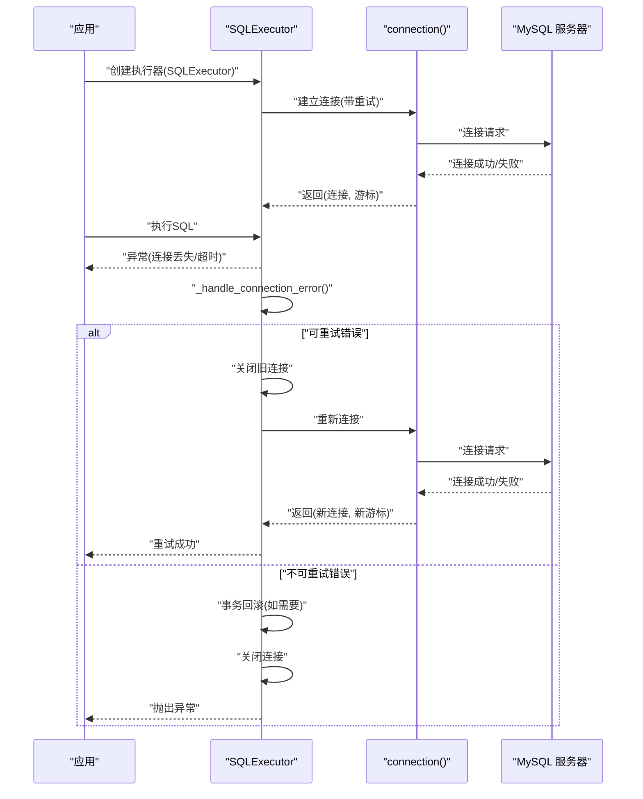
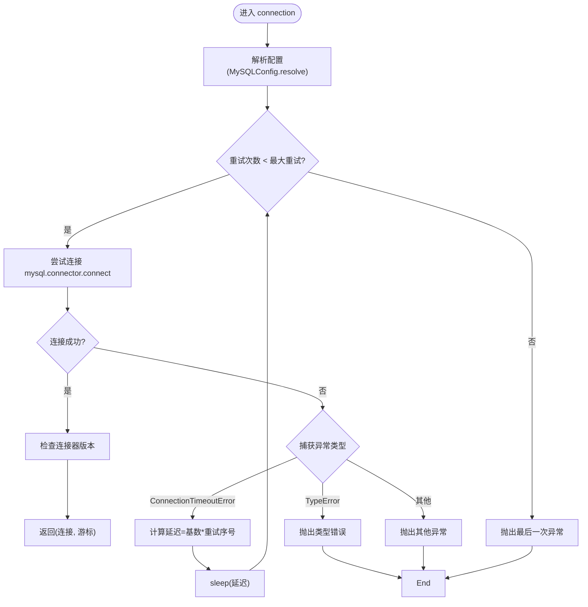
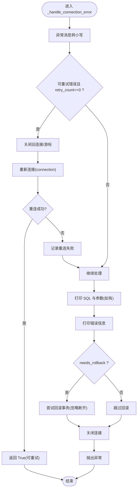
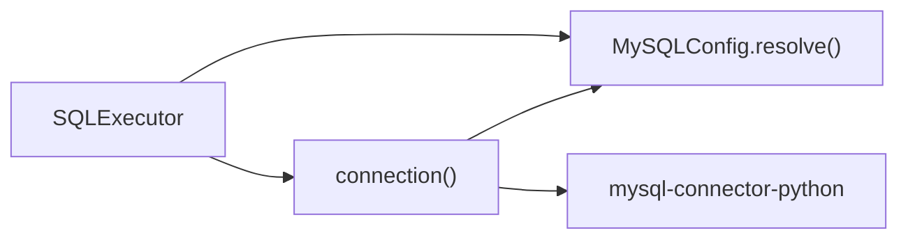

# 连接错误处理

<cite>
**本文引用的文件**
- [lazy_mysql/executor.py](file://lazy_mysql/executor.py)
- [lazy_mysql/utils/connect.py](file://lazy_mysql/utils/connect.py)
- [lazy_mysql/dataclasses/mysql_config.py](file://lazy_mysql/dataclasses/mysql_config.py)
- [docs/CONNECTION.md](file://docs/CONNECTION.md)
- [docs/code_reviews/固定/数据库连接审查.md](file://docs/code_reviews/固定/数据库连接审查.md)
- [tests/test_sql_config.py](file://tests/test_sql_config.py)
</cite>

## 更新摘要
**所做更改**
- 更新了可重试错误识别机制，修正了变量名遮蔽问题
- 改进了数据库连接初始化逻辑，增强了参数验证和错误处理
- 完善了连接工厂的版本检查和参数类型验证机制
- 优化了 _handle_connection_error 方法的错误处理流程

## 目录
1. [简介](#简介)
2. [项目结构](#项目结构)
3. [核心组件](#核心组件)
4. [架构总览](#架构总览)
5. [详细组件分析](#详细组件分析)
6. [依赖分析](#依赖分析)
7. [性能考虑](#性能考虑)
8. [故障排查指南](#故障排查指南)
9. [结论](#结论)

## 简介
本文聚焦 lazy_mysql 中"连接错误"的处理机制，系统阐述如下主题：
- 可重试错误的识别与分类（连接丢失、超时等）
- 自动重连的实现原理（连接状态检查、重新建立连接、游标重建）
- _handle_connection_error 方法的工作流程（错误记录、事务回滚、连接关闭）
- 诊断方法与常见问题的解决方案（网络异常、服务器重启、连接池耗尽）

## 项目结构
围绕连接错误处理的关键模块与职责：
- SQL 执行器：封装连接、执行 SQL、统一错误处理与重试
- 连接工厂：负责连接建立、版本检查、超时重试
- 配置解析：统一解析环境变量、字典、显式参数，保证优先级
- 文档与测试：提供使用说明、审查意见与回归保障

```mermaid
graph TB
subgraph "应用层"
EX["SQLExecutor<br/>统一执行与错误处理"]
END
subgraph "连接层"
CF["connection()<br/>连接工厂/重试"]
MC["MySQLConfig<br/>配置解析/优先级"]
END
subgraph "外部依赖"
DB["MySQL 服务器"]
CN["mysql-connector-python"]
END
EX --> CF
EX --> MC
CF --> CN
CN --> DB
```

**图表来源**
- [lazy_mysql/executor.py:14-25](file://lazy_mysql/executor.py#L14-L25)
- [lazy_mysql/utils/connect.py:16-91](file://lazy_mysql/utils/connect.py#L16-L91)
- [lazy_mysql/dataclasses/mysql_config.py:88-135](file://lazy_mysql/dataclasses/mysql_config.py#L88-L135)

**章节来源**
- [lazy_mysql/executor.py:14-25](file://lazy_mysql/executor.py#L14-L25)
- [lazy_mysql/utils/connect.py:16-91](file://lazy_mysql/utils/connect.py#L16-L91)
- [lazy_mysql/dataclasses/mysql_config.py:88-135](file://lazy_mysql/dataclasses/mysql_config.py#L88-L135)

## 核心组件
- 可重试错误清单：包含连接丢失、读取超时、超时错误、连接超时等关键词，用于判定是否触发自动重连
- 连接工厂 connection：封装连接建立、版本检查、超时重试与延迟退避
- SQLExecutor：封装连接对象与游标，提供统一的执行接口，并在异常时调用 _handle_connection_error
- _handle_connection_error：统一错误处理，识别可重试错误并尝试重连，否则记录日志、回滚事务、关闭连接并抛出异常

**章节来源**
- [lazy_mysql/executor.py:6-12](file://lazy_mysql/executor.py#L6-L12)
- [lazy_mysql/executor.py:62-106](file://lazy_mysql/executor.py#L62-L106)
- [lazy_mysql/utils/connect.py:16-91](file://lazy_mysql/utils/connect.py#L16-L91)

## 架构总览
连接错误处理的整体流程：
- 初始化阶段：SQLExecutor 通过 connection 建立连接并持有连接对象与游标
- 执行阶段：执行 SQL 时捕获异常
- 错误处理阶段：_handle_connection_error 识别可重试错误，尝试关闭旧连接并重新建立连接，必要时回滚事务并抛出异常



**图表来源**
- [lazy_mysql/executor.py:20-25](file://lazy_mysql/executor.py#L20-L25)
- [lazy_mysql/executor.py:62-106](file://lazy_mysql/executor.py#L62-L106)
- [lazy_mysql/utils/connect.py:43-91](file://lazy_mysql/utils/connect.py#L43-L91)

## 详细组件分析

### 可重试错误的识别与分类
- 识别依据：对异常消息进行小写匹配，若包含"Lost connection to MySQL server""The Read Operation timed out""TimeoutError""connection timeout"等关键词，则判定为可重试
- 限制条件：仅在 retry_count 为 0 时进行可重试判断，避免递归重试导致无限循环
- 作用范围：适用于 commit、execute 等操作在异常时的统一处理

**更新** 修正了变量名遮蔽问题，使用 `err_kw` 替代 `error` 避免外层参数遮蔽

**章节来源**
- [lazy_mysql/executor.py:6-12](file://lazy_mysql/executor.py#L6-L12)
- [lazy_mysql/executor.py:77-87](file://lazy_mysql/executor.py#L77-L87)

### 连接工厂与自动重试
- 连接建立：使用 mysql-connector-python 建立连接，设置缓冲游标、纯Python实现、允许本地文件导入等参数
- 版本检查：连接成功后统一检查连接器版本，低于阈值给出升级建议
- 超时重试：捕获连接超时与接口错误，按递增延迟进行重试，最多重试指定次数
- 参数优先级：通过 MySQLConfig.resolve 统一解析环境变量、字典与显式参数，保证优先级与空值不覆盖

**更新** 增强了参数类型验证，改进了版本检查逻辑，避免在异常处理块中进行版本检查



**图表来源**
- [lazy_mysql/utils/connect.py:16-91](file://lazy_mysql/utils/connect.py#L16-L91)
- [lazy_mysql/dataclasses/mysql_config.py:88-135](file://lazy_mysql/dataclasses/mysql_config.py#L88-L135)

**章节来源**
- [lazy_mysql/utils/connect.py:16-91](file://lazy_mysql/utils/connect.py#L16-L91)
- [lazy_mysql/dataclasses/mysql_config.py:88-135](file://lazy_mysql/dataclasses/mysql_config.py#L88-L135)
- [docs/CONNECTION.md:180-228](file://docs/CONNECTION.md#L180-L228)

### _handle_connection_error 方法工作流程
- 输入参数：异常对象、操作名称、重试次数、SQL与参数（用于日志）、是否需要回滚
- 错误识别：若为可重试错误且 retry_count==0，则尝试重连
- 重连步骤：关闭旧连接与游标，重新调用 connection 建立新连接与游标
- 事务处理：若 needs_rollback 为真，尝试回滚事务；若连接已断开则忽略回滚错误
- 日志与收尾：记录 SQL 与参数（如有）、打印错误信息；关闭连接并抛出异常

**更新** 改进了错误处理流程，增加了更详细的错误信息输出和异常类型区分



**图表来源**
- [lazy_mysql/executor.py:62-106](file://lazy_mysql/executor.py#L62-L106)

**章节来源**
- [lazy_mysql/executor.py:62-106](file://lazy_mysql/executor.py#L62-L106)

### 事务回滚与连接关闭
- 回滚策略：在需要回滚时尝试执行回滚；若连接已断开则忽略回滚错误，避免二次异常
- 关闭策略：无论是否重连成功，均在错误处理末尾关闭连接，释放资源
- 重试保护：_handle_connection_error 仅在 retry_count==0 时进行可重试判断，防止递归重试

**章节来源**
- [lazy_mysql/executor.py:97-106](file://lazy_mysql/executor.py#L97-L106)

### 执行器与底层调用的关系
- commit：在提交阶段捕获异常，调用 _handle_connection_error 并在需要时重试
- execute：在执行阶段捕获异常，调用 _handle_connection_error 并在需要时重试
- 其他操作（insert/upsert/update/batch_update/delete/select/query/fetch_format）均通过 execute 或底层工具函数间接调用 SQLExecutor.execute，从而共享统一的错误处理与重试逻辑

**章节来源**
- [lazy_mysql/executor.py:109-181](file://lazy_mysql/executor.py#L109-L181)
- [lazy_mysql/executor.py:214-321](file://lazy_mysql/executor.py#L214-L321)

## 依赖分析
- SQLExecutor 依赖 connection 与 MySQLConfig
- connection 依赖 mysql-connector-python 与 MySQLConfig
- 配置解析通过 MySQLConfig.resolve 实现优先级与空值处理



**图表来源**
- [lazy_mysql/executor.py:20-25](file://lazy_mysql/executor.py#L20-L25)
- [lazy_mysql/utils/connect.py:16-41](file://lazy_mysql/utils/connect.py#L16-L41)
- [lazy_mysql/dataclasses/mysql_config.py:88-135](file://lazy_mysql/dataclasses/mysql_config.py#L88-L135)

**章节来源**
- [lazy_mysql/executor.py:20-25](file://lazy_mysql/executor.py#L20-L25)
- [lazy_mysql/utils/connect.py:16-41](file://lazy_mysql/utils/connect.py#L16-L41)
- [lazy_mysql/dataclasses/mysql_config.py:88-135](file://lazy_mysql/dataclasses/mysql_config.py#L88-L135)

## 性能考虑
- 连接重试采用递增延迟，避免频繁重试造成瞬时压力
- 连接建立时启用缓冲游标与纯Python实现，兼顾兼容性与稳定性
- 重连成功后自动重建游标，确保后续操作可用

**章节来源**
- [lazy_mysql/utils/connect.py:74-82](file://lazy_mysql/utils/connect.py#L74-L82)
- [lazy_mysql/utils/connect.py:54-67](file://lazy_mysql/utils/connect.py#L54-L67)

## 故障排查指南

### 常见错误与诊断
- 访问被拒绝：检查用户名/密码/权限
- 无法连接：检查主机/端口/网络连通性
- 未知数据库：确认数据库名称
- 连接超时：检查网络质量、防火墙、服务器负载
- 读取超时：检查慢查询、锁等待、服务器资源

**章节来源**
- [docs/CONNECTION.md:205-228](file://docs/CONNECTION.md#L205-L228)

### 网络异常
- 现象：ConnectionTimeoutError、InterfaceError
- 处理：利用连接工厂的超时重试机制；必要时调整重试次数与延迟基数
- 建议：在网络波动场景下适当增加重试次数与延迟

**章节来源**
- [lazy_mysql/utils/connect.py:74-82](file://lazy_mysql/utils/connect.py#L74-L82)
- [docs/CONNECTION.md:180-203](file://docs/CONNECTION.md#L180-L203)

### 服务器重启
- 现象：连接丢失、读取超时
- 处理：_handle_connection_error 识别可重试错误并尝试重连；重连成功后继续执行
- 建议：在业务侧做好幂等与补偿，避免重复写入

**章节来源**
- [lazy_mysql/executor.py:77-87](file://lazy_mysql/executor.py#L77-L87)

### 连接池耗尽
- 现象：连接获取超时、排队等待
- 处理：检查连接使用模式，确保及时关闭连接；必要时缩短连接生命周期
- 建议：结合业务并发峰值评估连接池大小，避免长时间占用连接

**章节来源**
- [docs/CONNECTION.md:230-282](file://docs/CONNECTION.md#L230-L282)

### 版本兼容性
- 连接器版本过低会提示升级建议；建议升级至推荐版本以获得更好的稳定性与性能
- 如遇连接器异常，优先检查版本与依赖安装

**章节来源**
- [lazy_mysql/utils/connect.py:6-13](file://lazy_mysql/utils/connect.py#L6-L13)
- [docs/CONNECTION.md:302-325](file://docs/CONNECTION.md#L302-L325)

### 配置优先级与空值处理
- 优先级：显式参数 > 字典/对象 > 环境变量；空值不会覆盖已有值
- 边界情况：params=[] 与 params=[[]] 的行为差异已在审查中指出，需避免传入空参数集合

**章节来源**
- [lazy_mysql/dataclasses/mysql_config.py:88-135](file://lazy_mysql/dataclasses/mysql_config.py#L88-L135)
- [docs/code_reviews/固定/数据库连接审查.md:33-41](file://docs/code_reviews/固定/数据库连接审查.md#L33-L41)

### 参数验证与错误处理增强
- 参数类型验证：连接工厂现在提供更详细的参数类型错误信息
- 版本检查优化：版本检查逻辑独立提取，避免在异常处理块中产生误导
- 错误信息改进：提供更友好的错误提示和诊断信息

**章节来源**
- [docs/code_reviews/固定/数据库连接审查.md:278-340](file://docs/code_reviews/固定/数据库连接审查.md#L278-L340)

## 结论
lazy_mysql 通过"可重试错误识别 + 连接工厂重试 + 统一错误处理"的三层机制，实现了对连接丢失、超时等场景的稳健处理。_handle_connection_error 在保证事务一致性的同时，尽可能恢复连接并继续执行；连接工厂在建立连接时内置版本检查与超时重试，降低外部环境波动对业务的影响。配合合理的配置优先级与空值处理，整体具备良好的可维护性与可诊断性。

**更新** 本次更新进一步完善了数据库连接初始化逻辑，增强了参数验证和错误处理机制，提高了系统的稳定性和可维护性。