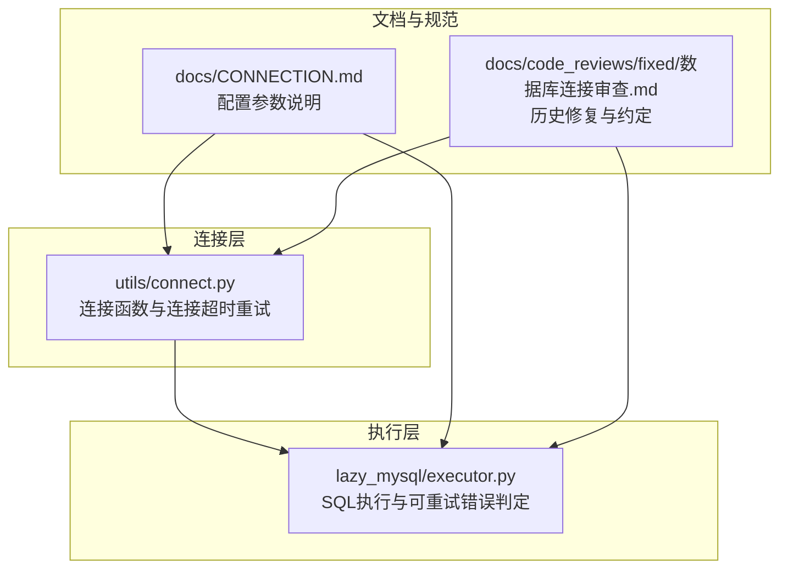
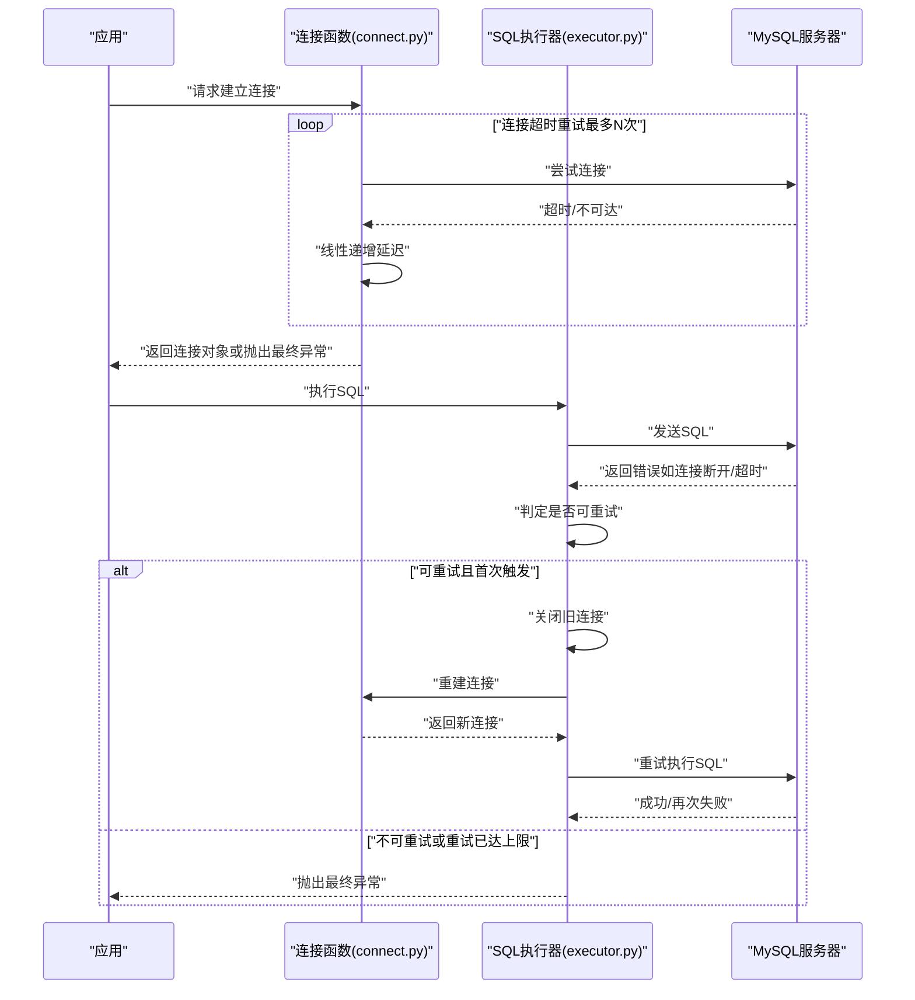
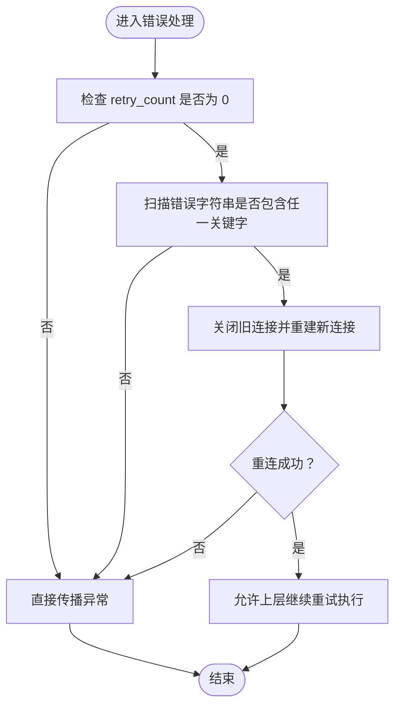
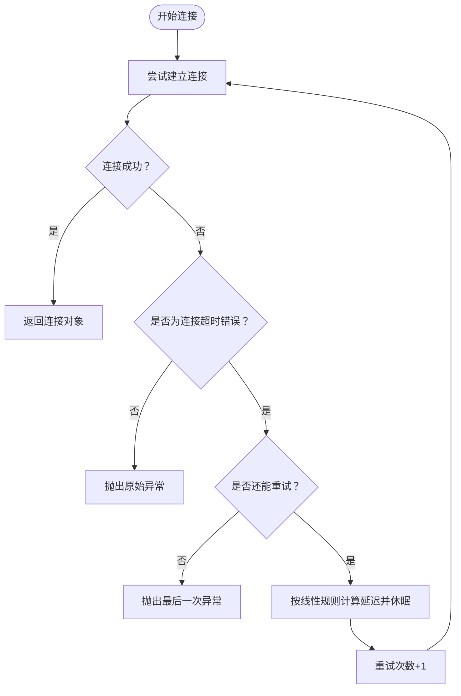
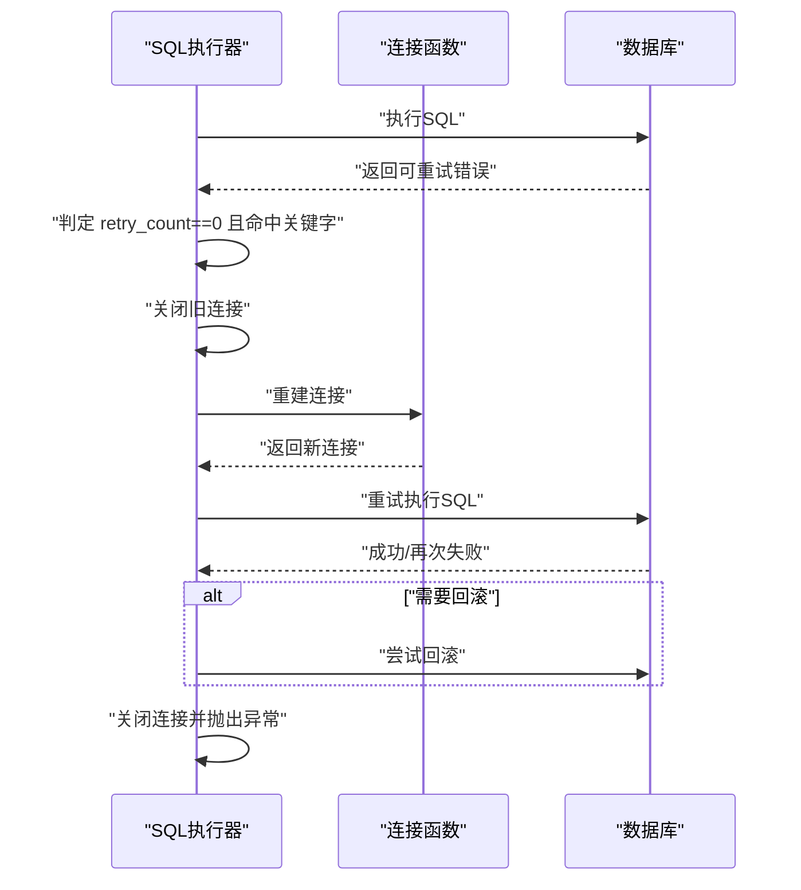
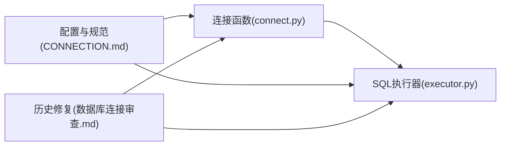

# 重试机制

<cite>
**本文引用的文件**
- [executor.py](file://lazy_mysql/executor.py)
- [connect.py](file://lazy_mysql/utils/connect.py)
- [CONNECTION.md](file://docs/CONNECTION.md)
- [数据库连接审查.md](file://docs/code_reviews/fixed/数据库连接审查.md)
</cite>

## 目录
1. [引言](#引言)
2. [项目结构](#项目结构)
3. [核心组件](#核心组件)
4. [架构总览](#架构总览)
5. [详细组件分析](#详细组件分析)
6. [依赖关系分析](#依赖关系分析)
7. [性能考量](#性能考量)
8. [故障排查指南](#故障排查指南)
9. [结论](#结论)
10. [附录](#附录)

## 引言
本文件聚焦于 lazy_mysql 的重试机制设计与实现，系统性解析以下内容：
- 可重试错误类型的判定依据与覆盖范围
- 重试策略的触发条件与执行流程
- 重试计数与最大重试次数的控制逻辑
- 指数退避（线性增长）在连接阶段的体现与应用
- 配置选项与可扩展的自定义策略路径
- 重试过程中的状态管理与错误传播机制

## 项目结构
围绕“重试机制”的相关文件主要分布在以下位置：
- 连接与重连逻辑：utils/connect.py
- SQL 执行与错误处理：lazy_mysql/executor.py
- 文档与配置说明：docs/CONNECTION.md
- 代码审查与历史修复记录：docs/code_reviews/fixed/数据库连接审查.md

图表来源
- [connect.py](file://lazy_mysql/utils/connect.py)
- [executor.py](file://lazy_mysql/executor.py)
- [CONNECTION.md](file://docs/CONNECTION.md)
- [数据库连接审查.md](file://docs/code_reviews/fixed/数据库连接审查.md)

章节来源
- [connect.py](file://lazy_mysql/utils/connect.py)
- [executor.py](file://lazy_mysql/executor.py)
- [CONNECTION.md](file://docs/CONNECTION.md)
- [数据库连接审查.md](file://docs/code_reviews/fixed/数据库连接审查.md)

## 核心组件
- 可重试错误集合（模块级私有常量）：用于在执行阶段识别“连接断开”“超时”等可恢复错误，从而触发自动重连。
- 连接阶段重试（连接函数）：对连接超时进行有限次数的重试，并采用线性递增的延迟策略。
- 执行阶段重试（SQL 执行器）：在执行过程中捕获可重试错误，关闭旧连接并重建新连接，随后允许上层继续重试。

章节来源
- [executor.py](file://lazy_mysql/executor.py)
- [数据库连接审查.md](file://docs/code_reviews/fixed/数据库连接审查.md)

## 架构总览
下图展示了“连接阶段重试”和“执行阶段重试”的协作关系与关键交互点。

图表来源
- [connect.py](file://lazy_mysql/utils/connect.py)
- [executor.py](file://lazy_mysql/executor.py)

## 详细组件分析

### 可重试错误集合与判定
- 命名与作用域：可重试错误集合为模块级私有常量，便于集中维护与复用。
- 判定逻辑：在执行阶段，当错误字符串中包含任一关键字时，且当前为首次重试（retry_count==0），则判定为可重试错误，触发自动重连流程。
- 影响范围：该集合覆盖“连接断开”“超时”等典型瞬时性错误，避免对不可恢复错误进行无意义的重试。

图表来源
- [executor.py](file://lazy_mysql/executor.py)

章节来源
- [executor.py](file://lazy_mysql/executor.py)

### 连接阶段重试（连接函数）
- 触发条件：连接过程中出现连接超时类错误时触发。
- 重试策略：在最大重试次数内进行有限重试，每次重试后按线性规则增加延迟时间。
- 重试上限：由外部传入的最大重试次数参数控制，超过上限后抛出最后一次异常。
- 重连动作：在每次重试前进行必要的清理与重连准备，确保资源释放与新连接建立。

图表来源
- [connect.py](file://lazy_mysql/utils/connect.py)

章节来源
- [connect.py](file://lazy_mysql/utils/connect.py)
- [CONNECTION.md](file://docs/CONNECTION.md)

### 执行阶段重试（SQL 执行器）
- 触发条件：在执行 SQL 期间捕获到可重试错误，且首次触发（retry_count==0）。
- 重试动作：关闭旧连接，通过连接函数重建新连接，然后允许上层继续执行。
- 回滚与收尾：若操作需要回滚，则在异常发生时尝试回滚；无论是否回滚，最终都会关闭连接并抛出异常。
- 递归重试：在 commit 等方法中，若判定为可重试错误，会在内部递增 retry_count 并再次调用自身以实现“最多一次”的额外重试。

图表来源
- [executor.py](file://lazy_mysql/executor.py)
- [connect.py](file://lazy_mysql/utils/connect.py)

章节来源
- [executor.py](file://lazy_mysql/executor.py)

### 指数退避与线性递增
- 连接阶段：采用线性递增的延迟策略（第 n 次延迟为 base × n），而非指数退避。该策略简单稳定，适合网络瞬时抖动场景。
- 执行阶段：通过“首次触发 + 重连 + 上层继续执行”的组合，避免在执行阶段引入复杂的退避算法，降低复杂度。

章节来源
- [connect.py](file://lazy_mysql/utils/connect.py)
- [CONNECTION.md](file://docs/CONNECTION.md)

### 配置选项与自定义策略
- 连接阶段配置：
  - 最大重试次数：控制连接超时类错误的重试上限。
  - 重试延迟基数：决定每次重试的延迟时间（线性增长）。
- 自定义策略路径：
  - 可重试关键字：通过调整模块级私有常量，扩大或限定可重试错误的匹配范围。
  - 扩展重试逻辑：可在连接函数或执行器中增加新的错误类型判定与处理分支，以适配特定业务场景。

章节来源
- [CONNECTION.md](file://docs/CONNECTION.md)
- [executor.py](file://lazy_mysql/executor.py)
- [数据库连接审查.md](file://docs/code_reviews/fixed/数据库连接审查.md)

## 依赖关系分析
- 连接函数依赖 MySQL 官方连接器，负责底层连接与异常分类。
- SQL 执行器依赖连接函数提供的连接对象，负责执行 SQL、错误判定与重连。
- 文档与代码审查文件提供配置说明与历史修复，确保行为一致与可追溯。

图表来源
- [connect.py](file://lazy_mysql/utils/connect.py)
- [executor.py](file://lazy_mysql/executor.py)
- [CONNECTION.md](file://docs/CONNECTION.md)
- [数据库连接审查.md](file://docs/code_reviews/fixed/数据库连接审查.md)

章节来源
- [connect.py](file://lazy_mysql/utils/connect.py)
- [executor.py](file://lazy_mysql/executor.py)
- [CONNECTION.md](file://docs/CONNECTION.md)
- [数据库连接审查.md](file://docs/code_reviews/fixed/数据库连接审查.md)

## 性能考量
- 连接阶段线性递增延迟：简单高效，适合中小规模重试场景；在高并发或长链路网络中需结合业务峰值评估总等待时间。
- 执行阶段仅在首次触发时重连：避免重复重连带来的额外开销，同时保证重试的确定性。
- 资源管理：在重连前后确保连接与游标被正确关闭与重建，减少资源泄漏风险。

## 故障排查指南
- 现象：连接超时反复重试后仍失败
  - 排查要点：确认最大重试次数与延迟基数设置是否合理；检查网络连通性与数据库负载。
- 现象：执行阶段报错但未触发重连
  - 排查要点：确认错误字符串是否包含可重试关键字；确认 retry_count 是否为 0。
- 现象：重连后仍报错
  - 排查要点：查看重连过程的日志输出；确认新连接可用性与权限配置。
- 现象：事务未回滚
  - 排查要点：确认执行器在异常路径中是否调用了回滚逻辑；检查数据库状态与事务隔离级别。

章节来源
- [executor.py](file://lazy_mysql/executor.py)
- [connect.py](file://lazy_mysql/utils/connect.py)

## 结论
lazy_mysql 的重试机制分为“连接阶段重试”和“执行阶段重试”两部分：
- 连接阶段采用线性递增延迟与有限次数重试，提升瞬时网络波动下的成功率；
- 执行阶段基于关键字匹配与首次触发约束，实现安全可控的自动重连；
- 通过模块级私有常量与配置参数，兼顾易用性与可扩展性；
- 在异常传播与状态管理方面，提供了明确的回滚与关闭流程，确保系统一致性。

## 附录
- 可重试错误关键字：通过模块级私有常量集中维护，便于统一更新与测试。
- 配置参数参考：
  - 最大重试次数：用于限制连接阶段的重试上限。
  - 重试延迟基数：用于计算每次重试的等待时间（线性增长）。

章节来源
- [CONNECTION.md](file://docs/CONNECTION.md)
- [executor.py](file://lazy_mysql/executor.py)
- [数据库连接审查.md](file://docs/code_reviews/fixed/数据库连接审查.md)