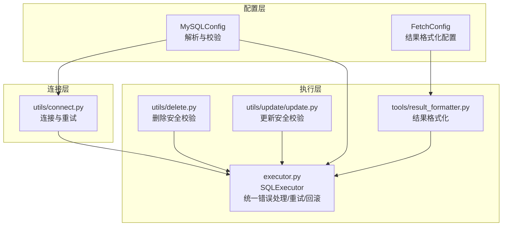
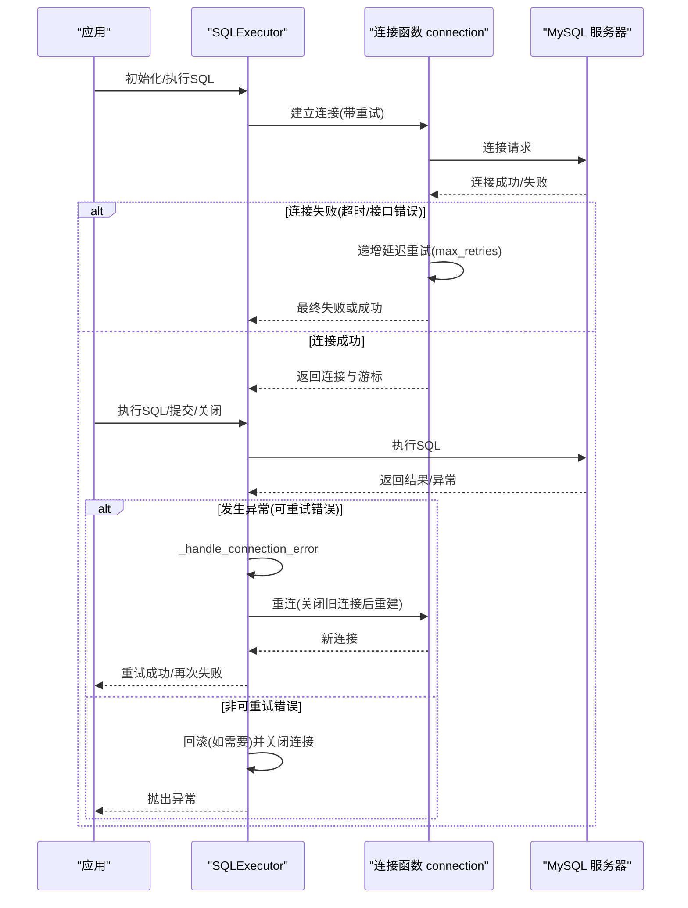
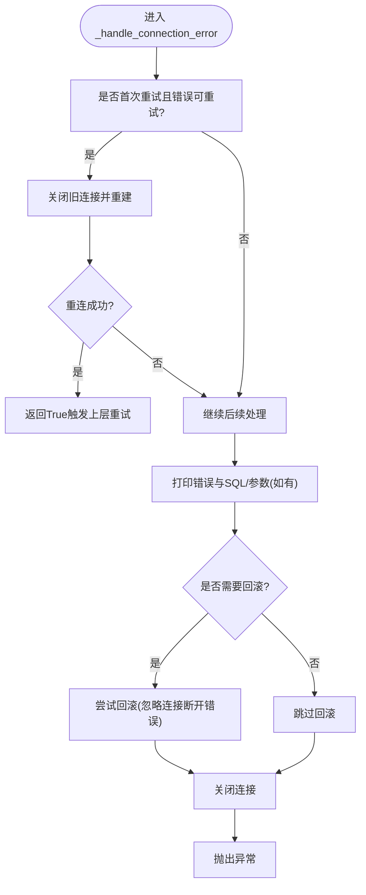
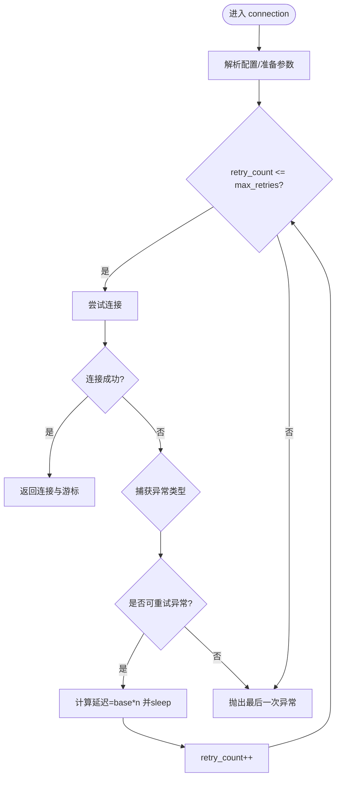
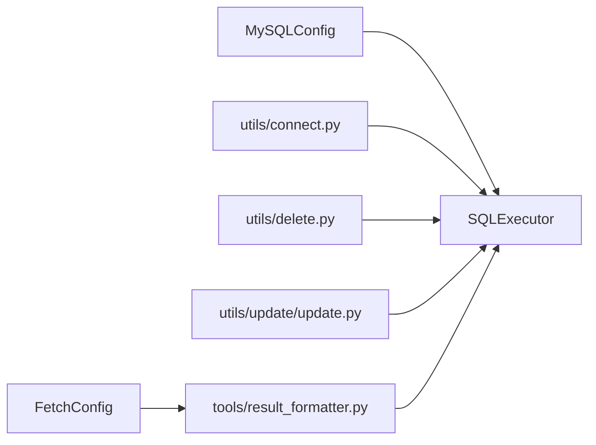

# 错误处理

<cite>
**本文引用的文件**
- [lazy_mysql/executor.py](file://lazy_mysql/executor.py)
- [lazy_mysql/utils/connect.py](file://lazy_mysql/utils/connect.py)
- [lazy_mysql/dataclasses/mysql_config.py](file://lazy_mysql/dataclasses/mysql_config.py)
- [lazy_mysql/dataclasses/fetch_config.py](file://lazy_mysql/dataclasses/fetch_config.py)
- [lazy_mysql/tools/result_formatter.py](file://lazy_mysql/tools/result_formatter.py)
- [lazy_mysql/utils/delete.py](file://lazy_mysql/utils/delete.py)
- [lazy_mysql/utils/update/update.py](file://lazy_mysql/utils/update/update.py)
- [docs/CONNECTION.md](file://docs/CONNECTION.md)
- [docs/DELETE.md](file://docs/DELETE.md)
- [docs/UPDATE.md](file://docs/UPDATE.md)
- [README.md](file://README.md)
</cite>

## 目录
1. [简介](#简介)
2. [项目结构](#项目结构)
3. [核心组件](#核心组件)
4. [架构总览](#架构总览)
5. [详细组件分析](#详细组件分析)
6. [依赖分析](#依赖分析)
7. [性能考量](#性能考量)
8. [故障排除指南](#故障排除指南)
9. [结论](#结论)
10. [附录](#附录)

## 简介
本指南聚焦于 lazy_mysql 的错误处理机制与故障排除实践，涵盖连接错误（超时、失败、网络异常）、事务回滚与一致性保障、重试策略（含指数退避与最大重试次数）、常见错误诊断（SQL语法、权限、数据类型不匹配等）、调试与日志最佳实践，以及性能问题的诊断与优化建议。内容基于仓库实际实现与文档整理，帮助开发者在生产环境中稳定使用该库。

## 项目结构
围绕错误处理与重试的关键模块如下：
- 连接层：连接建立与重试（连接器版本检查、递增延迟重试）
- 执行层：统一错误处理、自动重连、事务回滚、资源释放
- 工具层：结果格式化、WHERE子句构建、类型转换
- 配置层：MySQLConfig、FetchConfig，支持环境变量与优先级解析

图示来源
- [lazy_mysql/utils/connect.py:15-91](file://lazy_mysql/utils/connect.py#L15-L91)
- [lazy_mysql/executor.py:14-616](file://lazy_mysql/executor.py#L14-L616)
- [lazy_mysql/dataclasses/mysql_config.py:10-135](file://lazy_mysql/dataclasses/mysql_config.py#L10-L135)
- [lazy_mysql/dataclasses/fetch_config.py:8-24](file://lazy_mysql/dataclasses/fetch_config.py#L8-L24)
- [lazy_mysql/tools/result_formatter.py:3-77](file://lazy_mysql/tools/result_formatter.py#L3-L77)
- [lazy_mysql/utils/delete.py:3-26](file://lazy_mysql/utils/delete.py#L3-L26)
- [lazy_mysql/utils/update/update.py:4-44](file://lazy_mysql/utils/update/update.py#L4-L44)

章节来源
- [lazy_mysql/utils/connect.py:15-91](file://lazy_mysql/utils/connect.py#L15-L91)
- [lazy_mysql/executor.py:14-616](file://lazy_mysql/executor.py#L14-L616)
- [lazy_mysql/dataclasses/mysql_config.py:10-135](file://lazy_mysql/dataclasses/mysql_config.py#L10-L135)
- [lazy_mysql/dataclasses/fetch_config.py:8-24](file://lazy_mysql/dataclasses/fetch_config.py#L8-L24)
- [lazy_mysql/tools/result_formatter.py:3-77](file://lazy_mysql/tools/result_formatter.py#L3-L77)
- [lazy_mysql/utils/delete.py:3-26](file://lazy_mysql/utils/delete.py#L3-L26)
- [lazy_mysql/utils/update/update.py:4-44](file://lazy_mysql/utils/update/update.py#L4-L44)

## 核心组件
- SQLExecutor：统一的数据库操作入口，封装连接、执行、提交、关闭、错误处理与重试。
- 连接函数 connection：封装 mysql-connector-python 的连接与重试，支持递增延迟与最大重试次数。
- MySQLConfig：统一解析配置来源（显式参数、字典、环境变量），并进行类型校验。
- FetchConfig：查询结果格式化配置，控制 fetch_mode、output_format、data_label、show_count。
- 工具模块：delete、update、result_formatter 等，提供安全校验与结果格式化。

章节来源
- [lazy_mysql/executor.py:14-616](file://lazy_mysql/executor.py#L14-L616)
- [lazy_mysql/utils/connect.py:15-91](file://lazy_mysql/utils/connect.py#L15-L91)
- [lazy_mysql/dataclasses/mysql_config.py:10-135](file://lazy_mysql/dataclasses/mysql_config.py#L10-L135)
- [lazy_mysql/dataclasses/fetch_config.py:8-24](file://lazy_mysql/dataclasses/fetch_config.py#L8-L24)
- [lazy_mysql/tools/result_formatter.py:3-77](file://lazy_mysql/tools/result_formatter.py#L3-L77)
- [lazy_mysql/utils/delete.py:3-26](file://lazy_mysql/utils/delete.py#L3-L26)
- [lazy_mysql/utils/update/update.py:4-44](file://lazy_mysql/utils/update/update.py#L4-L44)

## 架构总览
下图展示错误处理与重试在整体架构中的位置与交互：

图示来源
- [lazy_mysql/executor.py:62-107](file://lazy_mysql/executor.py#L62-L107)
- [lazy_mysql/utils/connect.py:43-88](file://lazy_mysql/utils/connect.py#L43-L88)

章节来源
- [lazy_mysql/executor.py:62-107](file://lazy_mysql/executor.py#L62-L107)
- [lazy_mysql/utils/connect.py:43-88](file://lazy_mysql/utils/connect.py#L43-L88)

## 详细组件分析

### 组件A：SQLExecutor 统一错误处理与重试
- 可重试错误识别：针对“连接丢失”“读取超时”“TimeoutError”“连接超时”等关键字进行判定。
- 自动重连：在首次重试时关闭旧连接并重建，随后将控制权交还给上层重试逻辑。
- 事务回滚：当 needs_rollback 为真时，在错误发生后尝试回滚，忽略连接断开导致的回滚失败。
- 资源清理：错误发生后关闭游标与连接，并在析构函数中兜底清理，避免 PyCharm 调试器与连接器兼容性问题。
- 提交与执行：commit/execute 均内置重试与回滚逻辑，避免无限递归。

图示来源
- [lazy_mysql/executor.py:62-107](file://lazy_mysql/executor.py#L62-L107)

章节来源
- [lazy_mysql/executor.py:62-107](file://lazy_mysql/executor.py#L62-L107)
- [lazy_mysql/executor.py:108-124](file://lazy_mysql/executor.py#L108-L124)
- [lazy_mysql/executor.py:125-185](file://lazy_mysql/executor.py#L125-L185)

### 组件B：连接函数 connection 重试策略
- 支持的异常：连接超时与接口错误（DNS解析失败、网络不可达等）。
- 重试策略：递增延迟（第n次延迟为 base * n 秒），最大重试次数可配置。
- 版本检查：自动检查 mysql-connector-python 版本，提示升级建议。
- 连接参数：缓冲结果、使用纯Python实现、允许本地文件加载等，提升稳定性与兼容性。

图示来源
- [lazy_mysql/utils/connect.py:15-91](file://lazy_mysql/utils/connect.py#L15-L91)

章节来源
- [lazy_mysql/utils/connect.py:15-91](file://lazy_mysql/utils/connect.py#L15-L91)

### 组件C：MySQLConfig 配置解析与校验
- 支持来源：显式参数、字典、环境变量，空值不覆盖已有值。
- 校验规则：端口强转整数、空字符串转 None、环境变量读取。
- 默认配置：提供默认解析入口，便于零配置启动。

章节来源
- [lazy_mysql/dataclasses/mysql_config.py:10-135](file://lazy_mysql/dataclasses/mysql_config.py#L10-L135)

### 组件D：FetchConfig 结果格式化配置
- 控制项：fetch_mode、output_format、data_label、show_count。
- 兼容旧字典：支持从字典构造，便于渐进迁移。

章节来源
- [lazy_mysql/dataclasses/fetch_config.py:8-24](file://lazy_mysql/dataclasses/fetch_config.py#L8-L24)

### 组件E：工具模块的安全校验与格式化
- delete：强制要求 conditions 非空，防止全表删除。
- update：强制要求 fields 与 conditions 非空，防止全表更新。
- result_formatter：根据配置将结果转为元组列表、扁平列表、DataFrame、字典列表等；校验 data_label 与输出格式的匹配。

章节来源
- [lazy_mysql/utils/delete.py:3-26](file://lazy_mysql/utils/delete.py#L3-L26)
- [lazy_mysql/utils/update/update.py:4-44](file://lazy_mysql/utils/update/update.py#L4-L44)
- [lazy_mysql/tools/result_formatter.py:3-77](file://lazy_mysql/tools/result_formatter.py#L3-L77)

## 依赖分析
- SQLExecutor 依赖连接函数与配置类，间接依赖工具模块（where_clause、value_converter）。
- 连接函数依赖 mysql-connector-python，内部进行异常捕获与重试。
- 工具模块依赖 SQLExecutor 的 execute 与游标能力。

图示来源
- [lazy_mysql/executor.py:14-616](file://lazy_mysql/executor.py#L14-L616)
- [lazy_mysql/utils/connect.py:15-91](file://lazy_mysql/utils/connect.py#L15-L91)
- [lazy_mysql/dataclasses/mysql_config.py:10-135](file://lazy_mysql/dataclasses/mysql_config.py#L10-L135)
- [lazy_mysql/dataclasses/fetch_config.py:8-24](file://lazy_mysql/dataclasses/fetch_config.py#L8-L24)
- [lazy_mysql/tools/result_formatter.py:3-77](file://lazy_mysql/tools/result_formatter.py#L3-L77)
- [lazy_mysql/utils/delete.py:3-26](file://lazy_mysql/utils/delete.py#L3-L26)
- [lazy_mysql/utils/update/update.py:4-44](file://lazy_mysql/utils/update/update.py#L4-L44)

章节来源
- [lazy_mysql/executor.py:14-616](file://lazy_mysql/executor.py#L14-L616)
- [lazy_mysql/utils/connect.py:15-91](file://lazy_mysql/utils/connect.py#L15-L91)
- [lazy_mysql/dataclasses/mysql_config.py:10-135](file://lazy_mysql/dataclasses/mysql_config.py#L10-L135)
- [lazy_mysql/dataclasses/fetch_config.py:8-24](file://lazy_mysql/dataclasses/fetch_config.py#L8-L24)
- [lazy_mysql/tools/result_formatter.py:3-77](file://lazy_mysql/tools/result_formatter.py#L3-L77)
- [lazy_mysql/utils/delete.py:3-26](file://lazy_mysql/utils/delete.py#L3-L26)
- [lazy_mysql/utils/update/update.py:4-44](file://lazy_mysql/utils/update/update.py#L4-L44)

## 性能考量
- 连接缓冲与纯Python实现：使用缓冲游标与纯Python实现，减少外部依赖与“未读结果”问题，提升稳定性。
- 结果格式化：DataFrame 生成与列标签校验在内存与类型上需谨慎，避免不必要的大对象转换。
- 批量操作：insert/upsert/batch_update 等方法内置策略优化，减少网络往返与提升吞吐。
- 超时与重试：合理设置重试次数与延迟，避免在瞬时网络抖动下过度重试造成资源浪费。

章节来源
- [lazy_mysql/utils/connect.py:44-67](file://lazy_mysql/utils/connect.py#L44-L67)
- [lazy_mysql/tools/result_formatter.py:29-45](file://lazy_mysql/tools/result_formatter.py#L29-L45)
- [README.md:180-187](file://README.md#L180-L187)

## 故障排除指南

### 连接错误处理策略
- 连接超时与网络异常：由连接函数自动重试，递增延迟，最多重试固定次数；若仍失败，抛出异常。
- 连接失败（参数类型错误）：保留原始异常链，便于定位配置问题。
- 连接器版本过旧：自动提示升级建议，建议升级至推荐版本以获得更好稳定性与性能。

章节来源
- [lazy_mysql/utils/connect.py:16-91](file://lazy_mysql/utils/connect.py#L16-L91)
- [docs/CONNECTION.md:180-228](file://docs/CONNECTION.md#L180-L228)

### 事务回滚与一致性保障
- 提交阶段异常：自动触发回滚并重试（若为可重试错误），避免半提交状态。
- 执行阶段异常：若在执行时开启自动提交，则在异常时回滚；否则交由上层决定。
- 资源释放：错误发生后关闭游标与连接，析构函数兜底清理，降低资源泄漏风险。

章节来源
- [lazy_mysql/executor.py:96-106](file://lazy_mysql/executor.py#L96-L106)
- [lazy_mysql/executor.py:108-124](file://lazy_mysql/executor.py#L108-L124)
- [lazy_mysql/executor.py:125-185](file://lazy_mysql/executor.py#L125-L185)

### 重试策略配置与使用
- 连接重试：max_retries 与 retry_delay_base 可在连接函数中配置；默认最大重试5次，延迟为递增（秒）。
- 执行重试：SQLExecutor 在 commit/execute 中内置重试与回滚逻辑，避免无限递归。
- 指数退避：连接层采用线性递增延迟（base * n），执行层通过“首次重试+重连”实现可重试错误恢复。

章节来源
- [lazy_mysql/utils/connect.py:16-27](file://lazy_mysql/utils/connect.py#L16-L27)
- [lazy_mysql/utils/connect.py:74-88](file://lazy_mysql/utils/connect.py#L74-L88)
- [lazy_mysql/executor.py:62-107](file://lazy_mysql/executor.py#L62-L107)
- [lazy_mysql/executor.py:108-124](file://lazy_mysql/executor.py#L108-L124)
- [lazy_mysql/executor.py:125-185](file://lazy_mysql/executor.py#L125-L185)

### 常见错误诊断与解决方案
- SQL语法错误：检查生成的SQL与参数绑定；使用调试模式打印SQL与参数，定位不匹配。
- 权限不足：确认用户具备相应权限；通过连接测试验证。
- 数据类型不匹配：确保字段值与目标类型一致；JSON字段使用自动序列化时注意兼容性。
- 外键约束/唯一约束：捕获异常并区分约束类型，采取补偿措施或调整业务逻辑。
- 无结果集：若查询未返回结果集，检查连接是否提前关闭或SQL是否为DDL/DML。

章节来源
- [docs/DELETE.md:68-86](file://docs/DELETE.md#L68-L86)
- [docs/UPDATE.md:217-242](file://docs/UPDATE.md#L217-L242)
- [lazy_mysql/executor.py:487-512](file://lazy_mysql/executor.py#L487-L512)

### 调试技巧与日志记录最佳实践
- 打印SQL与参数：在开发环境输出执行的SQL与参数，便于快速定位问题。
- 分步验证：先 DESCRIBE 表结构，再预览将要变更的记录数量，最后执行。
- 使用 FetchConfig：合理设置 output_format 与 data_label，避免运行时报错。
- 上下文管理：使用 try/finally 或上下文管理器确保连接及时关闭。

章节来源
- [docs/DELETE.md:88-121](file://docs/DELETE.md#L88-L121)
- [docs/UPDATE.md:244-263](file://docs/UPDATE.md#L244-L263)
- [lazy_mysql/dataclasses/fetch_config.py:8-24](file://lazy_mysql/dataclasses/fetch_config.py#L8-L24)
- [docs/CONNECTION.md:230-282](file://docs/CONNECTION.md#L230-L282)

### 性能问题诊断与优化建议
- 索引缺失：WHERE 条件字段缺少索引会导致全表扫描；优先为高频过滤字段建立索引。
- 全表更新/删除：避免无条件更新/删除；使用安全校验确保条件非空。
- 结果格式化成本：DataFrame 生成与列标签校验会带来额外内存与CPU开销，必要时使用元组列表或扁平列表。
- 批量操作：优先使用内置批量方法，减少网络往返与事务开销。

章节来源
- [docs/UPDATE.md:181-215](file://docs/UPDATE.md#L181-L215)
- [docs/UPDATE.md:217-242](file://docs/UPDATE.md#L217-L242)
- [lazy_mysql/tools/result_formatter.py:29-45](file://lazy_mysql/tools/result_formatter.py#L29-L45)
- [lazy_mysql/utils/delete.py:14-17](file://lazy_mysql/utils/delete.py#L14-L17)
- [lazy_mysql/utils/update/update.py:16-24](file://lazy_mysql/utils/update/update.py#L16-L24)

## 结论
lazy_mysql 在连接层与执行层均实现了完善的错误处理与重试机制：连接层通过递增延迟与最大重试次数应对瞬时网络波动；执行层通过统一的错误处理、自动重连与事务回滚保障一致性；工具层提供安全校验与结果格式化，降低误操作与性能陷阱。结合本文提供的诊断与优化建议，可在生产环境中稳定、高效地使用该库。

## 附录
- 快速参考：连接与重试配置、可重试错误关键字、安全校验要点、结果格式化选项。

章节来源
- [docs/CONNECTION.md:180-228](file://docs/CONNECTION.md#L180-L228)
- [lazy_mysql/executor.py:6-12](file://lazy_mysql/executor.py#L6-L12)
- [lazy_mysql/utils/delete.py:14-17](file://lazy_mysql/utils/delete.py#L14-L17)
- [lazy_mysql/utils/update/update.py:16-24](file://lazy_mysql/utils/update/update.py#L16-L24)
- [lazy_mysql/dataclasses/fetch_config.py:8-24](file://lazy_mysql/dataclasses/fetch_config.py#L8-L24)