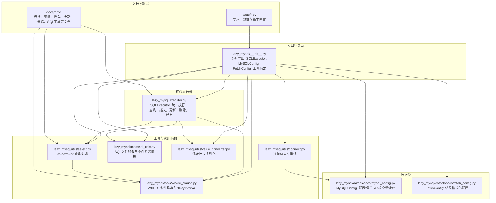
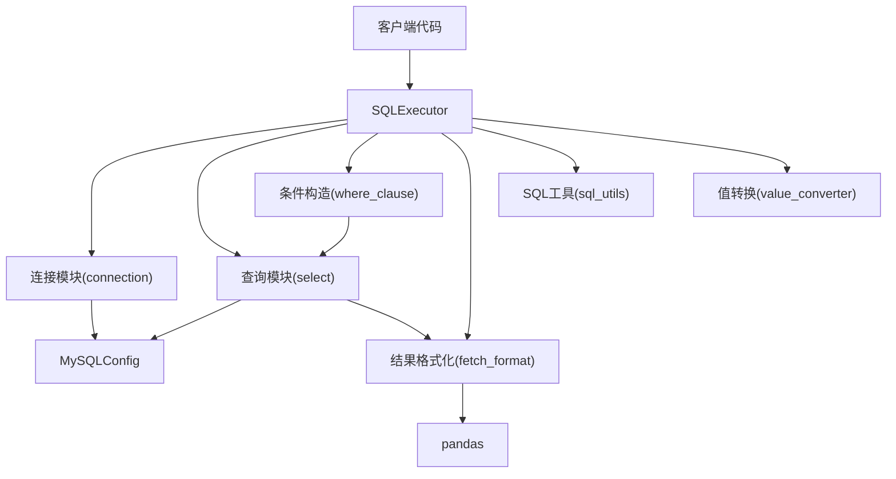
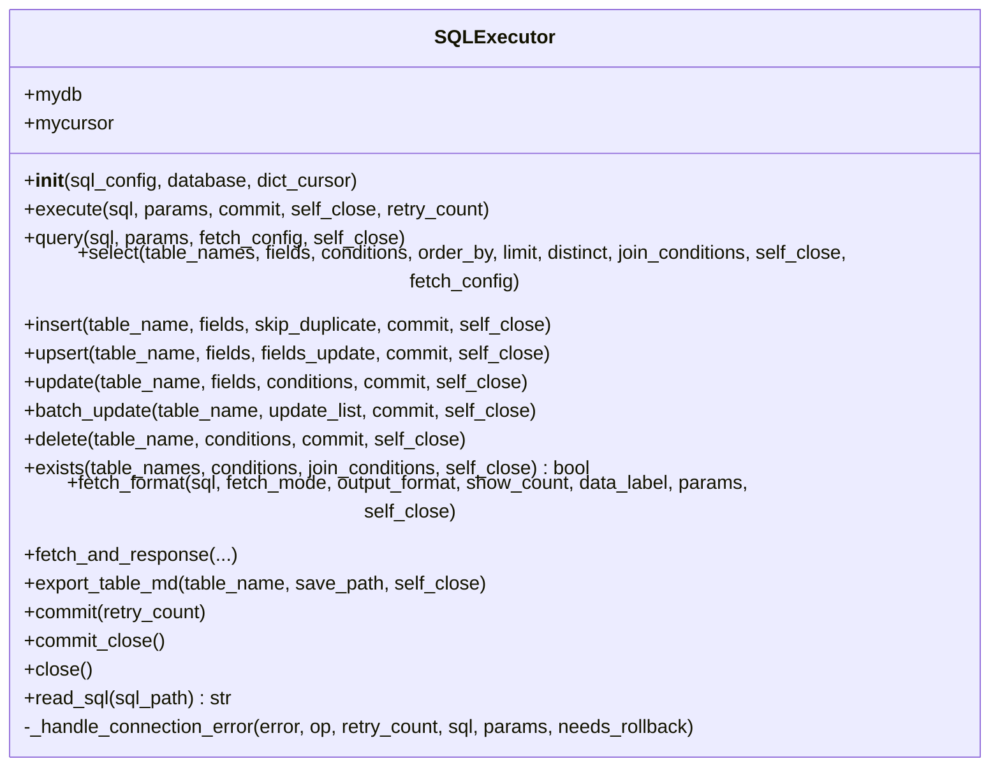
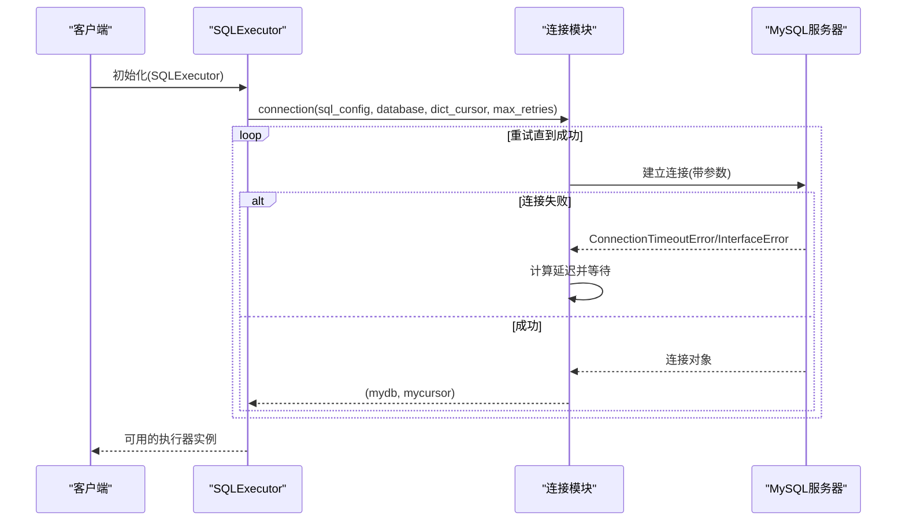
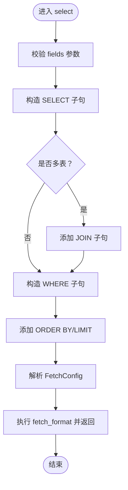
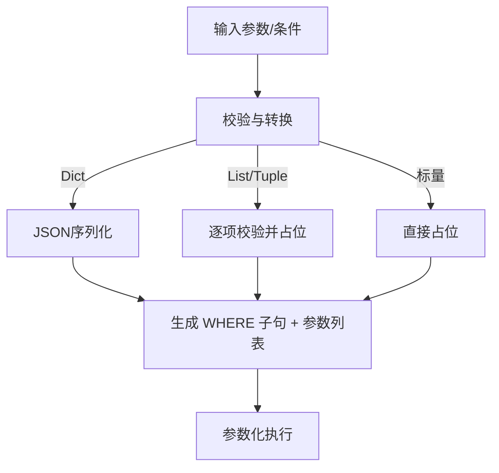
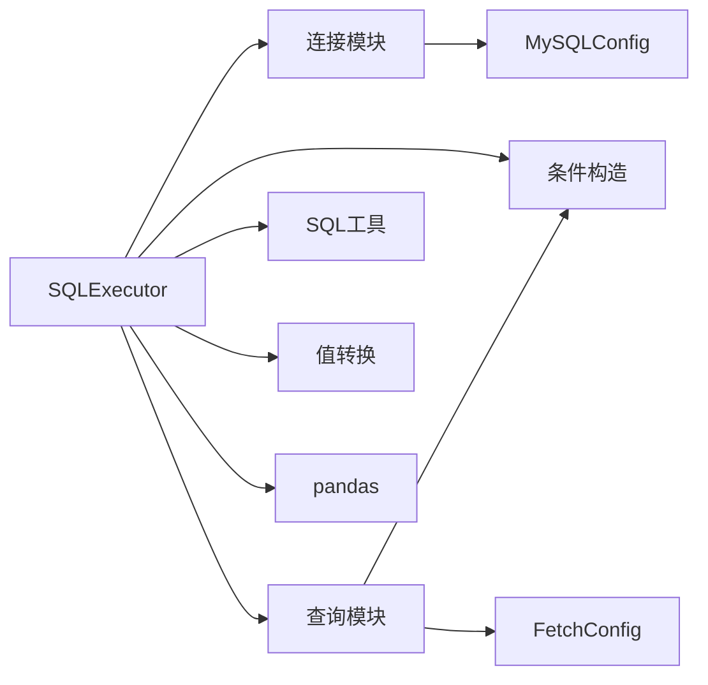

# 项目概述

<cite>
**本文引用的文件**
- [README.md](file://README.md)
- [setup.py](file://setup.py)
- [requirements.txt](file://requirements.txt)
- [lazy_mysql/__init__.py](file://lazy_mysql/__init__.py)
- [lazy_mysql/executor.py](file://lazy_mysql/executor.py)
- [lazy_mysql/dataclasses/mysql_config.py](file://lazy_mysql/dataclasses/mysql_config.py)
- [lazy_mysql/dataclasses/fetch_config.py](file://lazy_mysql/dataclasses/fetch_config.py)
- [lazy_mysql/utils/connect.py](file://lazy_mysql/utils/connect.py)
- [lazy_mysql/utils/select.py](file://lazy_mysql/utils/select.py)
- [lazy_mysql/tools/where_clause.py](file://lazy_mysql/tools/where_clause.py)
- [lazy_mysql/tools/sql_utils.py](file://lazy_mysql/tools/sql_utils.py)
- [lazy_mysql/utils/value_converter.py](file://lazy_mysql/utils/value_converter.py)
- [docs/CONNECTION.md](file://docs/CONNECTION.md)
- [docs/SELECT.md](file://docs/SELECT.md)
- [tests/test_import.py](file://tests/test_import.py)
</cite>

## 目录
1. [简介](#简介)
2. [项目结构](#项目结构)
3. [核心组件](#核心组件)
4. [架构总览](#架构总览)
5. [详细组件分析](#详细组件分析)
6. [依赖分析](#依赖分析)
7. [性能考量](#性能考量)
8. [故障排查指南](#故障排查指南)
9. [结论](#结论)
10. [附录](#附录)

## 简介
lazy_mysql 是一个面向Python的轻量级MySQL数据库操作库，旨在以简洁优雅的方式统一执行SQL、智能构建查询、批量处理数据，并提供安全的参数化查询与灵活的结果格式化能力。项目强调“少即是多”的设计哲学：通过统一的SQL执行接口、直观的查询构建器、自动优化的批量操作以及完善的错误处理与重试机制，帮助开发者在Web应用、数据分析、批量数据处理与企业级应用中快速落地。

- 核心价值与理念
  - 统一接口：隐藏底层差异，提供一致的API体验
  - 智能构建：自动拼接SQL、WHERE条件、JOIN、排序与限制
  - 批量优化：针对不同规模数据自动选择最优插入/更新策略
  - 安全可靠：参数化查询、连接重试、异常兜底、自动回滚
  - 结果多样：支持元组、字典、DataFrame、字典列表等多格式输出

- 技术栈
  - Python 3.7+（打包声明为3.10+，运行兼容3.7+）
  - MySQL 8.0.36+
  - 依赖：mysql-connector-python>=9.4.0、pandas>=2.3.1、pydantic>=2.0.0

- 适用场景
  - Web应用开发（快速原型与API后端）
  - 数据分析（DataFrame集成、报表与清洗）
  - 批量数据处理（日志导入、迁移、ETL）
  - 企业级应用（事务、并发、重试）

- 发布与许可
  - 已发布至PyPI：https://pypi.org/project/lazy-mysql/
  - 开源协议：MIT

**章节来源**
- [README.md:1-197](file://README.md#L1-L197)
- [setup.py:1-34](file://setup.py#L1-L34)
- [requirements.txt:1-3](file://requirements.txt#L1-L3)

## 项目结构
项目采用清晰的分层组织：入口模块负责对外暴露API；数据类封装配置与结果格式；工具模块提供SQL辅助与条件构造；工具模块提供连接、查询、更新、删除等核心能力；文档与测试完善使用说明与质量保障。



**图表来源**
- [lazy_mysql/__init__.py:1-21](file://lazy_mysql/__init__.py#L1-L21)
- [lazy_mysql/executor.py:1-616](file://lazy_mysql/executor.py#L1-L616)
- [lazy_mysql/dataclasses/mysql_config.py:1-135](file://lazy_mysql/dataclasses/mysql_config.py#L1-L135)
- [lazy_mysql/dataclasses/fetch_config.py:1-24](file://lazy_mysql/dataclasses/fetch_config.py#L1-L24)
- [lazy_mysql/utils/connect.py:1-91](file://lazy_mysql/utils/connect.py#L1-L91)
- [lazy_mysql/utils/select.py:1-237](file://lazy_mysql/utils/select.py#L1-L237)
- [lazy_mysql/tools/where_clause.py:1-127](file://lazy_mysql/tools/where_clause.py#L1-L127)
- [lazy_mysql/tools/sql_utils.py:1-53](file://lazy_mysql/tools/sql_utils.py#L1-L53)
- [lazy_mysql/utils/value_converter.py:1-115](file://lazy_mysql/utils/value_converter.py#L1-L115)

**章节来源**
- [lazy_mysql/__init__.py:1-21](file://lazy_mysql/__init__.py#L1-L21)
- [docs/CONNECTION.md:1-334](file://docs/CONNECTION.md#L1-L334)
- [docs/SELECT.md:1-672](file://docs/SELECT.md#L1-L672)

## 核心组件
- SQLExecutor：统一的数据库操作入口，封装连接、执行、格式化、重试、回滚与关闭等能力
- MySQLConfig：集中解析配置来源（显式参数、字典、环境变量），支持空值不覆盖与优先级合并
- FetchConfig：标准化查询结果格式化参数（获取模式、输出格式、列标签、计数）
- 连接模块：基于mysql-connector-python建立连接，支持重试、版本检查、字典游标
- 查询模块：select/exist智能构建SQL，支持JOIN、WHERE、排序、限制与结果格式化
- 条件构造：where_clause模块支持多种运算符、IN/NOT IN、空值判断、NDayInterval等
- 工具函数：sql_utils提供SQL文件加载与条件片段拼接；value_converter负责值规范化与序列化

**章节来源**
- [lazy_mysql/executor.py:14-616](file://lazy_mysql/executor.py#L14-L616)
- [lazy_mysql/dataclasses/mysql_config.py:10-135](file://lazy_mysql/dataclasses/mysql_config.py#L10-L135)
- [lazy_mysql/dataclasses/fetch_config.py:8-24](file://lazy_mysql/dataclasses/fetch_config.py#L8-L24)
- [lazy_mysql/utils/connect.py:16-91](file://lazy_mysql/utils/connect.py#L16-L91)
- [lazy_mysql/utils/select.py:4-237](file://lazy_mysql/utils/select.py#L4-L237)
- [lazy_mysql/tools/where_clause.py:42-127](file://lazy_mysql/tools/where_clause.py#L42-L127)
- [lazy_mysql/tools/sql_utils.py:4-53](file://lazy_mysql/tools/sql_utils.py#L4-L53)
- [lazy_mysql/utils/value_converter.py:74-115](file://lazy_mysql/utils/value_converter.py#L74-L115)

## 架构总览
lazy_mysql采用“执行器 + 配置 + 工具”的分层架构：
- 执行器层：SQLExecutor作为门面，协调连接、执行、格式化与资源管理
- 配置层：MySQLConfig与FetchConfig分别负责连接配置与结果格式化
- 工具层：连接、查询、条件构造、SQL工具与值转换模块提供原子能力
- 文档与测试：完善使用指南与导入一致性保障



**图表来源**
- [lazy_mysql/executor.py:14-616](file://lazy_mysql/executor.py#L14-L616)
- [lazy_mysql/utils/connect.py:16-91](file://lazy_mysql/utils/connect.py#L16-L91)
- [lazy_mysql/utils/select.py:4-237](file://lazy_mysql/utils/select.py#L4-L237)
- [lazy_mysql/tools/where_clause.py:42-127](file://lazy_mysql/tools/where_clause.py#L42-L127)
- [lazy_mysql/tools/sql_utils.py:4-53](file://lazy_mysql/tools/sql_utils.py#L4-L53)
- [lazy_mysql/utils/value_converter.py:74-115](file://lazy_mysql/utils/value_converter.py#L74-L115)
- [lazy_mysql/dataclasses/mysql_config.py:10-135](file://lazy_mysql/dataclasses/mysql_config.py#L10-L135)

## 详细组件分析

### 组件A：SQLExecutor（统一执行器）
- 设计要点
  - 统一入口：提供execute/query/select/insert/update/delete/upsert/batch_update/exists/export_table_md等方法
  - 参数化执行：支持元组/字典/列表参数，自动区分单条与批量executemany
  - 结果格式化：通过fetch_format与FetchConfig控制返回格式（元组、字典、DataFrame、字典列表、计数）
  - 错误处理：内置可重试错误识别、自动重连、回滚与关闭
  - 连接管理：支持自动关闭与commit_close
- 关键流程
  - 连接建立：resolve配置 -> 连接工厂 -> 游标
  - 执行流程：参数校验 -> 选择执行路径（execute/executemany）-> commit/self_close
  - 查询流程：select/exist -> 构造SQL -> fetch_format -> 格式化输出



**图表来源**
- [lazy_mysql/executor.py:14-616](file://lazy_mysql/executor.py#L14-L616)

**章节来源**
- [lazy_mysql/executor.py:14-616](file://lazy_mysql/executor.py#L14-L616)

### 组件B：连接与重试机制
- 设计要点
  - 配置解析：支持显式参数、字典、环境变量，空值不覆盖，优先级明确
  - 连接建立：use_pure=True、buffered=True、allow_local_infile=True等参数优化
  - 重试策略：连接超时与接口错误自动重试，指数递增延迟
  - 版本检查：提示升级mysql-connector-python至9.4.0+



**图表来源**
- [lazy_mysql/utils/connect.py:16-91](file://lazy_mysql/utils/connect.py#L16-L91)
- [lazy_mysql/dataclasses/mysql_config.py:82-135](file://lazy_mysql/dataclasses/mysql_config.py#L82-L135)

**章节来源**
- [lazy_mysql/utils/connect.py:16-91](file://lazy_mysql/utils/connect.py#L16-L91)
- [docs/CONNECTION.md:180-228](file://docs/CONNECTION.md#L180-L228)

### 组件C：智能查询构建器（select/exist）
- 设计要点
  - 字段与表名处理：支持单表与多表JOIN，自动表前缀
  - WHERE条件：支持等值、比较、IN/NOT IN、空值判断、NDayInterval
  - 排序与限制：order_by与limit参数直传
  - 结果格式化：FetchConfig控制fetch_mode与output_format
  - 存在性检查：exists使用SELECT 1 LIMIT 1优化性能



**图表来源**
- [lazy_mysql/utils/select.py:4-156](file://lazy_mysql/utils/select.py#L4-L156)
- [lazy_mysql/tools/where_clause.py:42-127](file://lazy_mysql/tools/where_clause.py#L42-L127)

**章节来源**
- [lazy_mysql/utils/select.py:4-237](file://lazy_mysql/utils/select.py#L4-L237)
- [docs/SELECT.md:120-371](file://docs/SELECT.md#L120-L371)

### 组件D：批量数据操作与优化
- 设计要点
  - 插入策略：单条、小批量executemany、大批量LOAD DATA INFILE（分批）
  - Upsert：ON DUPLICATE KEY UPDATE，支持单条与批量
  - 批量更新：根据条件复杂度选择CASE WHEN简化语法或通用语法
  - 值转换：自动处理None、NaN、pandas类型、JSON序列化等

```mermaid
flowchart TD
S(["insert/upsert/batch_update 入口"]) --> Strategy{"数据规模/类型？"}
Strategy --> |单条| Single["传统执行"]
Strategy --> |小批量(<1000)| Small["executemany"]
Strategy --> |中批量(1000-50k)| Medium["分批executemany(1k/5k)"]
Strategy --> |中大批量(50k-100k)| Large["分批executemany(5k/50k)"]
Strategy --> |超大批量(>=100k)| LDI["LOAD DATA INFILE(分批50k)"]
Single --> Commit["可选提交"]
Small --> Commit
Medium --> Commit
Large --> Commit
LDI --> Commit
Commit --> Close["可选关闭"]
Close --> E(["结束"])
```

**图表来源**
- [lazy_mysql/executor.py:214-321](file://lazy_mysql/executor.py#L214-L321)
- [lazy_mysql/utils/value_converter.py:74-115](file://lazy_mysql/utils/value_converter.py#L74-L115)

**章节来源**
- [lazy_mysql/executor.py:214-321](file://lazy_mysql/executor.py#L214-L321)
- [lazy_mysql/utils/value_converter.py:74-115](file://lazy_mysql/utils/value_converter.py#L74-L115)

### 组件E：安全与防注入（参数化查询）
- 设计要点
  - 所有动态值通过参数绑定（%s或%(name)s），避免字符串拼接
  - WHERE条件构造严格校验与转义，支持IN/NOT IN列表参数
  - Dict类型自动JSON序列化，避免直接写入数据库
  - Numpy类型禁止直接写入，强制转换



**图表来源**
- [lazy_mysql/tools/where_clause.py:17-39](file://lazy_mysql/tools/where_clause.py#L17-L39)
- [lazy_mysql/tools/where_clause.py:99-123](file://lazy_mysql/tools/where_clause.py#L99-L123)
- [lazy_mysql/utils/value_converter.py:30-115](file://lazy_mysql/utils/value_converter.py#L30-L115)

**章节来源**
- [lazy_mysql/tools/where_clause.py:42-127](file://lazy_mysql/tools/where_clause.py#L42-L127)
- [lazy_mysql/utils/value_converter.py:74-115](file://lazy_mysql/utils/value_converter.py#L74-L115)

## 依赖分析
- 内部依赖
  - SQLExecutor依赖连接模块、查询模块、条件构造、SQL工具与值转换
  - 查询模块依赖条件构造与FetchConfig
  - 连接模块依赖MySQLConfig
- 外部依赖
  - mysql-connector-python>=9.4.0（连接与执行）
  - pandas>=2.3.1（DataFrame输出）
  - pydantic>=2.0.0（配置模型与校验）



**图表来源**
- [lazy_mysql/executor.py:14-616](file://lazy_mysql/executor.py#L14-L616)
- [lazy_mysql/utils/connect.py:16-91](file://lazy_mysql/utils/connect.py#L16-L91)
- [lazy_mysql/utils/select.py:4-237](file://lazy_mysql/utils/select.py#L4-L237)
- [lazy_mysql/tools/where_clause.py:42-127](file://lazy_mysql/tools/where_clause.py#L42-L127)
- [lazy_mysql/tools/sql_utils.py:4-53](file://lazy_mysql/tools/sql_utils.py#L4-L53)
- [lazy_mysql/utils/value_converter.py:74-115](file://lazy_mysql/utils/value_converter.py#L74-L115)
- [lazy_mysql/dataclasses/mysql_config.py:10-135](file://lazy_mysql/dataclasses/mysql_config.py#L10-L135)
- [lazy_mysql/dataclasses/fetch_config.py:8-24](file://lazy_mysql/dataclasses/fetch_config.py#L8-L24)

**章节来源**
- [setup.py:14-18](file://setup.py#L14-L18)
- [requirements.txt:1-3](file://requirements.txt#L1-3)

## 性能考量
- 批量插入优化：根据数据规模自动选择executemany分批或LOAD DATA INFILE，显著缩短百万级数据导入时间
- 查询优化：exists使用SELECT 1 LIMIT 1避免全表扫描；select支持JOIN、排序与限制，减少应用层过滤
- 结果格式化：DataFrame输出适合数据分析场景；元组/字典列表适合Web API与轻量处理
- 连接与重试：自动重试与回滚降低网络抖动影响；字典游标与缓冲减少内存压力

[本节为通用性能讨论，不直接分析具体文件]

## 故障排查指南
- 连接失败
  - 检查环境变量与配置优先级，确认空值不覆盖规则
  - 观察重试日志与延迟，必要时调整max_retries与retry_delay_base
  - 确认mysql-connector-python版本不低于9.4.0
- 查询异常
  - 确认fields非空，避免空字段列表
  - 检查WHERE条件格式与运算符合法性
  - 使用exists进行存在性快速判断，避免全表扫描
- 批量操作
  - 避免对SELECT进行批量executemany（会严重降级）
  - 大批量数据优先考虑LOAD DATA INFILE策略
- 结果格式化
  - FetchConfig的output_format与data_label需匹配使用场景
  - DataFrame列名可通过data_label重命名

**章节来源**
- [docs/CONNECTION.md:180-228](file://docs/CONNECTION.md#L180-L228)
- [docs/SELECT.md:611-640](file://docs/SELECT.md#L611-L640)
- [lazy_mysql/executor.py:158-185](file://lazy_mysql/executor.py#L158-L185)

## 结论
lazy_mysql通过“统一接口 + 智能构建 + 批量优化 + 安全参数化 + 灵活格式化”的设计，在保证易用性的同时兼顾性能与可靠性。其清晰的分层架构与完善的文档、测试体系，使其既能满足初学者快速上手，也能支撑有经验开发者在复杂场景下的深入定制与优化。

[本节为总结性内容，不直接分析具体文件]

## 附录
- PyPI发布状态：已在PyPI发布，可通过链接访问
- 开源协议：MIT
- 环境要求：Python 3.7+（打包声明3.10+）、MySQL 8.0.36+、依赖库版本要求见setup.py与requirements.txt

**章节来源**
- [README.md:189-197](file://README.md#L189-L197)
- [setup.py:14-30](file://setup.py#L14-L30)
- [requirements.txt:1-3](file://requirements.txt#L1-3)