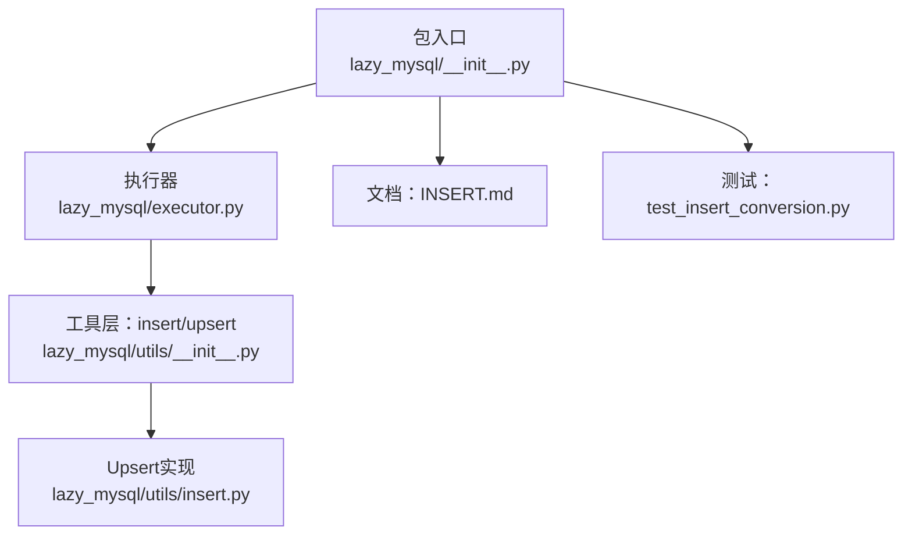
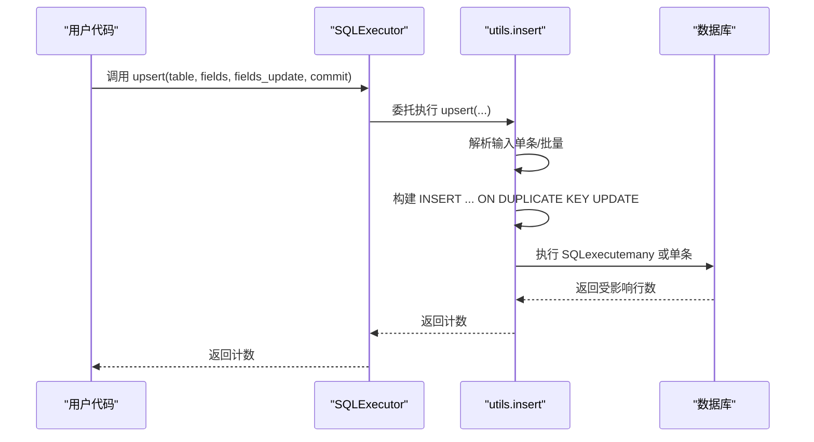
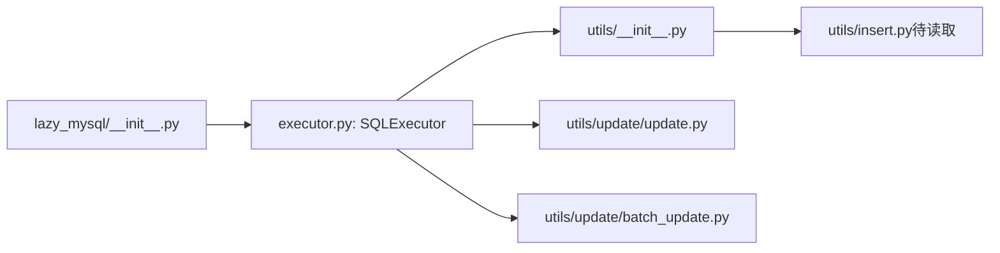

# Upsert操作

<cite>
**本文引用的文件**
- [lazy_mysql/__init__.py](file://lazy_mysql/__init__.py)
- [lazy_mysql/executor.py](file://lazy_mysql/executor.py)
- [lazy_mysql/utils/__init__.py](file://lazy_mysql/utils/__init__.py)
- [lazy_mysql/utils/update/update.py](file://lazy_mysql/utils/update/update.py)
- [lazy_mysql/utils/update/batch_update.py](file://lazy_mysql/utils/update/batch_update.py)
- [docs/INSERT.md](file://docs/INSERT.md)
- [tests/test_insert_conversion.py](file://tests/test_insert_conversion.py)
</cite>

## 目录
1. [简介](#简介)
2. [项目结构](#项目结构)
3. [核心组件](#核心组件)
4. [架构总览](#架构总览)
5. [详细组件分析](#详细组件分析)
6. [依赖分析](#依赖分析)
7. [性能考虑](#性能考虑)
8. [故障排查指南](#故障排查指南)
9. [结论](#结论)
10. [附录](#附录)

## 简介
本章节面向希望使用 lazy_mysql 实现“存在则更新、不存在则插入”的 Upsert 场景，系统讲解其智能判断逻辑、ON DUPLICATE KEY UPDATE 语句构建过程、冲突键识别与处理机制，并提供覆盖单字段唯一键与复合唯一键的使用示例。同时对比传统 INSERT...ON DUPLICATE KEY UPDATE 的优势与性能特性，说明错误处理与回滚机制。

## 项目结构
围绕 Upsert 的关键模块与入口如下：
- 入口导出：在包级导出中包含 upsert，便于直接调用
- 执行器：SQLExecutor 提供 upsert 方法，委托至 utils.insert.upsert
- 工具层：utils.insert 实现 Upsert 的智能策略与 SQL 构建
- 文档与测试：INSERT 文档说明 Upsert 的定位；测试验证 Python 值类型自动转换

图表来源
- [lazy_mysql/__init__.py:1-21](file://lazy_mysql/__init__.py#L1-L21)
- [lazy_mysql/executor.py:236-253](file://lazy_mysql/executor.py#L236-L253)
- [lazy_mysql/utils/__init__.py:1-6](file://lazy_mysql/utils/__init__.py#L1-L6)
- [docs/INSERT.md:15-26](file://docs/INSERT.md#L15-L26)
- [tests/test_insert_conversion.py:119-132](file://tests/test_insert_conversion.py#L119-L132)

章节来源
- [lazy_mysql/__init__.py:1-21](file://lazy_mysql/__init__.py#L1-L21)
- [lazy_mysql/executor.py:236-253](file://lazy_mysql/executor.py#L236-L253)
- [lazy_mysql/utils/__init__.py:1-6](file://lazy_mysql/utils/__init__.py#L1-L6)
- [docs/INSERT.md:15-26](file://docs/INSERT.md#L15-L26)
- [tests/test_insert_conversion.py:119-132](file://tests/test_insert_conversion.py#L119-L132)

## 核心组件
- 包导出与入口
  - 包导出包含 upsert，便于直接从包级导入使用
- SQLExecutor.upsert
  - 提供 upsert(table_name, fields, fields_update, commit, self_close) 接口
  - 支持单条记录（dict）与批量记录（list[dict]）两种输入形态
  - fields_update 可指定冲突时仅更新的字段集合，None 表示更新全部字段
- 工具层委托
  - 执行器内部委托至 utils.insert.upsert 实现具体逻辑

章节来源
- [lazy_mysql/__init__.py:18](file://lazy_mysql/__init__.py#L18)
- [lazy_mysql/executor.py:236-253](file://lazy_mysql/executor.py#L236-L253)
- [lazy_mysql/utils/__init__.py:1](file://lazy_mysql/utils/__init__.py#L1)

## 架构总览
下图展示了从调用到执行的端到端流程，以及与现有更新工具的关系：

图表来源
- [lazy_mysql/executor.py:236-253](file://lazy_mysql/executor.py#L236-L253)

## 详细组件分析

### Upsert 智能判断与决策机制
- 输入形态判定
  - 单条：dict，直接生成一条 ON DUPLICATE KEY UPDATE 语句
  - 多条：list[dict]，使用批量执行（executemany）逐条执行相同模板
- 冲突键识别与处理
  - Upsert 的冲突由表的唯一键（主键或 UNIQUE 索引）决定
  - 当某条记录的冲突键与现有记录冲突时，按 ON DUPLICATE KEY UPDATE 规则更新；否则插入新记录
- 字段更新范围控制
  - fields_update 为 None：冲突时更新所有字段
  - fields_update 为集合：仅更新指定字段，其余保持不变

章节来源
- [lazy_mysql/executor.py:236-253](file://lazy_mysql/executor.py#L236-L253)

### ON DUPLICATE KEY UPDATE 语句构建过程
- 字段准备
  - 对写入值进行统一类型转换，确保与数据库类型匹配
- SET 子句生成
  - 基于 fields 构造 SET 字段赋值片段
  - 若指定了 fields_update，则仅包含这些字段
- ON DUPLICATE KEY UPDATE 子句
  - 与 SET 子句对应，冲突时对相应字段赋值
- 批量执行
  - 单条：直接执行
  - 多条：使用 executemany，逐条传入参数

章节来源
- [lazy_mysql/utils/update/update.py:26-44](file://lazy_mysql/utils/update/update.py#L26-L44)
- [lazy_mysql/utils/update/batch_update.py:104-112](file://lazy_mysql/utils/update/batch_update.py#L104-L112)

### 冲突键识别与处理
- 冲突键来源
  - 由表结构的唯一键（主键或 UNIQUE 索引）决定
- 冲突检测
  - 执行 INSERT ... ON DUPLICATE KEY UPDATE 时，数据库自动检测冲突键
- 冲突分支
  - 冲突：按 ON DUPLICATE KEY UPDATE 更新指定字段
  - 无冲突：插入新记录

章节来源
- [docs/INSERT.md:15-26](file://docs/INSERT.md#L15-L26)

### 使用示例（场景化）

- 单字段唯一键（主键或单列 UNIQUE）
  - 场景：以 id 为主键，或 email 为 UNIQUE
  - 行为：若 id/email 存在则更新，否则插入
  - 适用：fields_update=None（更新全部字段）或指定部分字段
- 复合唯一键（多列 UNIQUE）
  - 场景：联合索引 (category, code) 为 UNIQUE
  - 行为：只有 category 与 code 同时冲突才触发更新；否则插入
  - 适用：fields_update 指定需要更新的业务字段，避免覆盖其他字段

注意：以上为概念性示例说明，具体字段与索引需依据实际表结构配置。

### 与传统 INSERT...ON DUPLICATE KEY UPDATE 的对比与优势
- 一体化封装
  - 提供统一接口，自动区分单条与批量，屏蔽底层差异
- 类型安全与一致性
  - 写入值统一转换，保证与数据库类型一致，减少因类型不匹配导致的冲突误判
- 批量优化
  - 批量场景下复用 executemany，具备良好的扩展性
- 与现有更新工具协同
  - 与 update/batch_update 的参数风格与类型转换规则保持一致，便于统一维护

章节来源
- [lazy_mysql/utils/update/update.py:26-44](file://lazy_mysql/utils/update/update.py#L26-L44)
- [lazy_mysql/utils/update/batch_update.py:104-112](file://lazy_mysql/utils/update/batch_update.py#L104-L112)

### 错误处理与回滚机制
- 可重试错误
  - 连接丢失、读取超时、超时错误等可重试场景，执行器会尝试重建连接并重试一次
- 回滚策略
  - 在 commit=True 且发生错误时，执行器会尝试回滚事务，避免半更新状态
- 统一异常输出
  - 打印 SQL 与参数，便于定位问题

章节来源
- [lazy_mysql/executor.py:62-107](file://lazy_mysql/executor.py#L62-L107)
- [lazy_mysql/executor.py:109-124](file://lazy_mysql/executor.py#L109-L124)

## 依赖分析
- 包导出与执行器
  - 包导出 upsert，执行器提供 upsert 方法并委托工具层
- 工具层与更新工具
  - Upsert 与 update/batch_update 共享类型转换与 WHERE 子句构建能力，保持一致性

图表来源
- [lazy_mysql/__init__.py:1-21](file://lazy_mysql/__init__.py#L1-L21)
- [lazy_mysql/executor.py:236-253](file://lazy_mysql/executor.py#L236-L253)
- [lazy_mysql/utils/__init__.py:1-6](file://lazy_mysql/utils/__init__.py#L1-L6)
- [lazy_mysql/utils/update/update.py:1-44](file://lazy_mysql/utils/update/update.py#L1-L44)
- [lazy_mysql/utils/update/batch_update.py:1-313](file://lazy_mysql/utils/update/batch_update.py#L1-L313)

## 性能考虑
- 单条 Upsert
  - 直接执行一条 INSERT ... ON DUPLICATE KEY UPDATE，适合低频写入
- 批量 Upsert
  - 使用 executemany，逐条传参，适合高频写入场景
- 与 INSERT 的关系
  - INSERT 文档中指出 Upsert 基于 INSERT ... ON DUPLICATE KEY UPDATE，二者共享类型转换与参数传递的一致性，有助于减少因类型不一致导致的冲突误判

章节来源
- [docs/INSERT.md:15-26](file://docs/INSERT.md#L15-L26)

## 故障排查指南
- 常见错误与处理
  - 连接丢失/超时：执行器会尝试重连并重试一次；若仍失败，打印 SQL 与参数并回滚事务
  - 参数为空：fields 或 conditions 为空会抛出异常，检查调用参数
- 日志与诊断
  - 发生异常时打印 SQL 与参数，便于快速定位问题
- 建议
  - 明确表的唯一键结构，确保 Upsert 的字段组合与唯一键一致
  - 在批量场景下合理设置 fields_update，避免不必要的字段更新

章节来源
- [lazy_mysql/executor.py:62-107](file://lazy_mysql/executor.py#L62-L107)
- [lazy_mysql/executor.py:109-124](file://lazy_mysql/executor.py#L109-L124)
- [lazy_mysql/utils/update/update.py:16-25](file://lazy_mysql/utils/update/update.py#L16-L25)

## 结论
lazy_mysql 的 Upsert 通过统一的接口与类型转换，实现了对单条与批量场景的无缝支持；其基于 MySQL 的 INSERT ... ON DUPLICATE KEY UPDATE，结合明确的冲突键识别与字段更新范围控制，能够在保证正确性的前提下获得良好的性能表现。配合完善的错误处理与回滚机制，使其在生产环境中更加稳健可靠。

## 附录

### 使用示例（路径参考）
- 单条 Upsert（Python 值类型自动转换验证）
  - [tests/test_insert_conversion.py:119-132](file://tests/test_insert_conversion.py#L119-L132)
- Upsert 文档说明
  - [docs/INSERT.md:15-26](file://docs/INSERT.md#L15-L26)