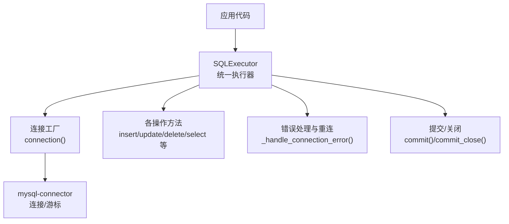
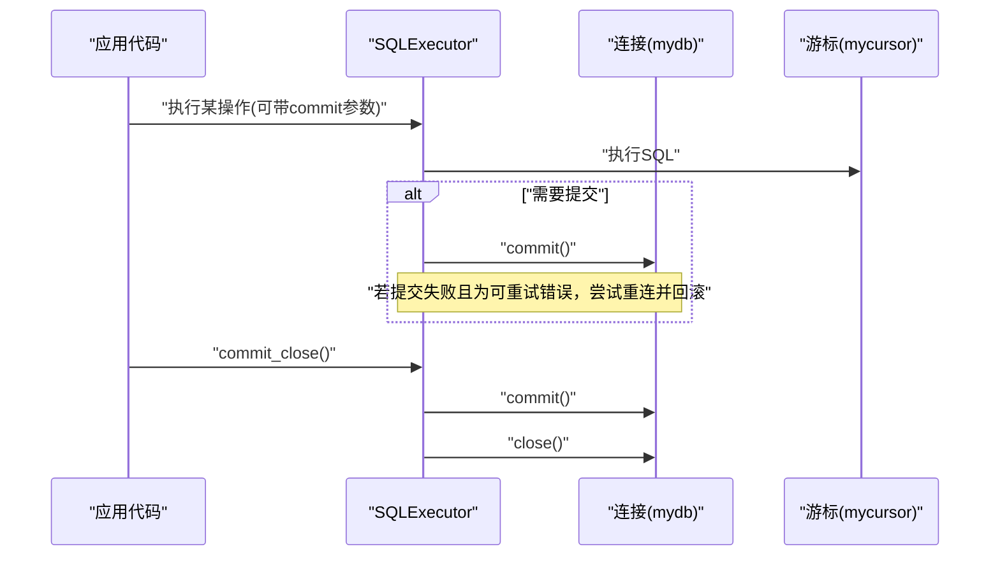
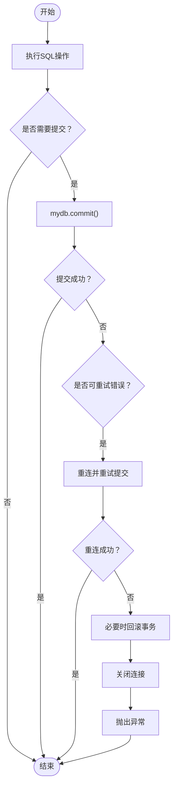
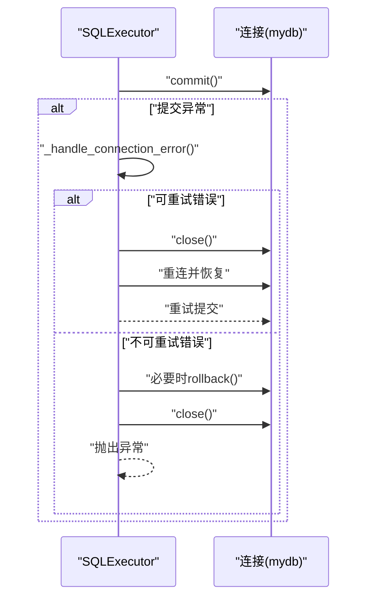
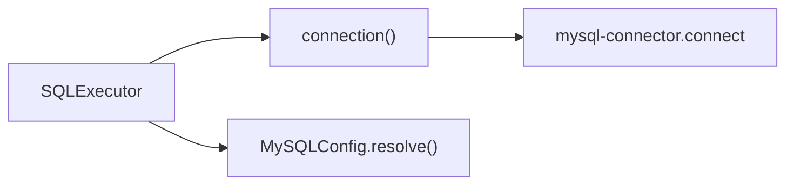

# 事务管理

<cite>
**本文引用的文件**   
- [lazy_mysql/__init__.py](file://lazy_mysql/__init__.py)
- [lazy_mysql/executor.py](file://lazy_mysql/executor.py)
- [lazy_mysql/utils/connect.py](file://lazy_mysql/utils/connect.py)
- [lazy_mysql/dataclasses/mysql_config.py](file://lazy_mysql/dataclasses/mysql_config.py)
- [README.md](file://README.md)
</cite>

## 目录
1. [简介](#简介)
2. [项目结构](#项目结构)
3. [核心组件](#核心组件)
4. [架构总览](#架构总览)
5. [详细组件分析](#详细组件分析)
6. [依赖分析](#依赖分析)
7. [性能考量](#性能考量)
8. [故障排查指南](#故障排查指南)
9. [结论](#结论)
10. [附录](#附录)

## 简介
本章节聚焦 lazy_mysql 的事务管理机制，围绕“自动提交与手动提交”、“事务的开启/提交/回滚”、“连接级事务控制与跨操作一致性”、“隔离级别与锁机制（现状与建议）”、“批量操作中的事务处理”、“最佳实践（错误处理、资源清理、超时控制）”以及“常见问题与解决方案”展开。读者无需深厚的数据库背景即可理解并正确使用。

## 项目结构
lazy_mysql 通过统一的 SQL 执行器封装了连接、执行、结果格式化与资源清理能力。事务控制主要体现在执行器对连接对象的提交与回滚调用，以及对可重试错误的自动重连与回滚策略。

图示来源
- [lazy_mysql/executor.py:14-616](file://lazy_mysql/executor.py#L14-L616)
- [lazy_mysql/utils/connect.py:15-91](file://lazy_mysql/utils/connect.py#L15-L91)

章节来源
- [lazy_mysql/__init__.py:1-21](file://lazy_mysql/__init__.py#L1-L21)
- [lazy_mysql/executor.py:14-616](file://lazy_mysql/executor.py#L14-L616)
- [lazy_mysql/utils/connect.py:15-91](file://lazy_mysql/utils/connect.py#L15-L91)

## 核心组件
- SQLExecutor：统一的数据库操作入口，负责执行 SQL、批量执行、提交事务、关闭连接、错误处理与重连。
- 连接工厂 connection()：创建数据库连接与游标，内置重试与版本检查。
- MySQLConfig：配置解析与优先级（显式参数 > 字典/对象 > 环境变量）。

章节来源
- [lazy_mysql/executor.py:14-616](file://lazy_mysql/executor.py#L14-L616)
- [lazy_mysql/utils/connect.py:15-91](file://lazy_mysql/utils/connect.py#L15-L91)
- [lazy_mysql/dataclasses/mysql_config.py:118-274](file://lazy_mysql/dataclasses/mysql_config.py#L118-L274)

## 架构总览
下图展示了事务相关的关键交互：应用通过 SQLExecutor 发起操作；当 commit=True 或显式调用 commit() 时触发事务提交；若发生可重试的连接错误，执行器会尝试重连并在需要时回滚事务，随后抛出异常。

图示来源
- [lazy_mysql/executor.py:108-124](file://lazy_mysql/executor.py#L108-L124)
- [lazy_mysql/executor.py:125-185](file://lazy_mysql/executor.py#L125-L185)

## 详细组件分析

### 事务提交与回滚
- 自动提交：当调用 insert/update/delete/batch_update 等方法时，若传入 commit=True，则在执行完成后调用连接的提交方法。
- 手动提交：通过显式调用 commit() 或 commit_close() 控制何时提交；commit_close() 会在提交后关闭连接。
- 回滚策略：当发生可重试的连接错误（如连接丢失、超时）且 needs_rollback=True 时，执行器会尝试回滚当前事务，然后抛出异常。

图示来源
- [lazy_mysql/executor.py:108-124](file://lazy_mysql/executor.py#L108-L124)
- [lazy_mysql/executor.py:125-185](file://lazy_mysql/executor.py#L125-L185)

章节来源
- [lazy_mysql/executor.py:108-124](file://lazy_mysql/executor.py#L108-L124)
- [lazy_mysql/executor.py:125-185](file://lazy_mysql/executor.py#L125-L185)

### 连接级事务控制与一致性
- 连接级：SQLExecutor 维护一个连接与一个游标，事务作用域限定在该连接生命周期内。同一连接上的多次操作共享同一事务上下文，从而保证跨操作的一致性。
- 一致性保障：在 commit=True 的情况下，单个操作完成后立即提交；对于批量操作，建议在业务层将相关联的多次操作置于同一连接实例上，避免跨连接的“伪事务”。

章节来源
- [lazy_mysql/executor.py:20-25](file://lazy_mysql/executor.py#L20-L25)
- [lazy_mysql/executor.py:125-185](file://lazy_mysql/executor.py#L125-L185)

### 自动提交 vs 手动提交
- 自动提交：在 insert/update/delete/batch_update 等方法中传入 commit=True，即可在单次调用内完成“执行+提交”，适合简单、独立的小事务。
- 手动提交：将多个相关联的操作集中在同一连接上，统一在最后调用 commit() 或 commit_close()，适合需要强一致性的复合业务流程。

章节来源
- [lazy_mysql/executor.py:213-321](file://lazy_mysql/executor.py#L213-L321)
- [README.md:94-140](file://README.md#L94-L140)

### 批量操作中的事务处理
- 批量执行：当传入的参数为列表且非 SELECT 时，执行器会调用批量执行接口；若 commit=True，将在批量执行后提交。
- 大数据量：对于超大规模数据，建议结合分批策略与手动提交，避免单次事务过大导致锁竞争与内存压力。
- 原子性：单次批量操作在数据库层面具备原子性；跨多次批量操作的原子性需通过手动提交策略与异常回滚机制共同保障。

章节来源
- [lazy_mysql/executor.py:125-185](file://lazy_mysql/executor.py#L125-L185)

### 隔离级别、锁机制与死锁检测
- 隔离级别：当前实现未显式设置隔离级别，遵循 mysql-connector 的默认行为。如需严格控制隔离级别，可在业务层显式执行 SET TRANSACTION 语句或在连接建立前设置。
- 锁机制：由底层驱动与 MySQL 服务器管理，执行器不直接暴露锁控制接口。
- 死锁检测与处理：当前实现未提供专门的死锁检测与重试逻辑。建议在业务层捕获死锁异常并进行指数退避重试，同时缩短事务时间、减少锁持有范围。

章节来源
- [lazy_mysql/utils/connect.py:54-67](file://lazy_mysql/utils/connect.py#L54-L67)

### 错误处理与重连
- 可重试错误：当检测到连接丢失或超时等可重试错误时，执行器会尝试重连并恢复操作；若在提交阶段发生错误，会先回滚再重试。
- 异常传播：重连失败或非可重试错误会关闭连接并抛出异常，避免状态不一致。

图示来源
- [lazy_mysql/executor.py:62-107](file://lazy_mysql/executor.py#L62-L107)
- [lazy_mysql/executor.py:108-124](file://lazy_mysql/executor.py#L108-L124)

章节来源
- [lazy_mysql/executor.py:62-107](file://lazy_mysql/executor.py#L62-L107)
- [lazy_mysql/executor.py:108-124](file://lazy_mysql/executor.py#L108-L124)

### 资源清理与超时控制
- 资源清理：提供 close() 与 __del__() 作为兜底清理；commit_close() 在提交后关闭连接，避免遗漏。
- 超时控制：连接工厂支持连接超时重试；执行器在执行与提交阶段均具备异常处理与重连能力，间接缓解超时影响。

章节来源
- [lazy_mysql/executor.py:32-61](file://lazy_mysql/executor.py#L32-L61)
- [lazy_mysql/executor.py:120-124](file://lazy_mysql/executor.py#L120-L124)
- [lazy_mysql/utils/connect.py:16-91](file://lazy_mysql/utils/connect.py#L16-L91)

## 依赖分析
- SQLExecutor 依赖连接工厂创建的连接与游标，事务提交/回滚均委托给连接对象。
- 连接工厂负责连接参数解析、重试与版本检查，确保连接稳定性。
- 配置解析模块提供统一的优先级策略，保证连接参数来源可控。

图示来源
- [lazy_mysql/executor.py:20-25](file://lazy_mysql/executor.py#L20-L25)
- [lazy_mysql/utils/connect.py:30-67](file://lazy_mysql/utils/connect.py#L30-L67)
- [lazy_mysql/dataclasses/mysql_config.py:217-274](file://lazy_mysql/dataclasses/mysql_config.py#L217-L274)

章节来源
- [lazy_mysql/executor.py:20-25](file://lazy_mysql/executor.py#L20-L25)
- [lazy_mysql/utils/connect.py:30-67](file://lazy_mysql/utils/connect.py#L30-L67)
- [lazy_mysql/dataclasses/mysql_config.py:217-274](file://lazy_mysql/dataclasses/mysql_config.py#L217-L274)

## 性能考量
- 连接缓冲：连接工厂启用缓冲游标，有助于避免“未读结果”问题并提升查询吞吐。
- 纯Python实现：use_pure=True 提升兼容性，但可能牺牲部分性能；可根据部署环境权衡。
- 批量优化：执行器在批量插入/更新时自动选择合适策略，建议配合手动提交与分批处理以获得更佳性能与更低锁竞争。

章节来源
- [lazy_mysql/utils/connect.py:46-67](file://lazy_mysql/utils/connect.py#L46-L67)
- [lazy_mysql/executor.py:213-307](file://lazy_mysql/executor.py#L213-L307)

## 故障排查指南
- 提交失败：若提交阶段出现连接异常，执行器会尝试重连并回滚；若仍失败，请检查网络与数据库状态。
- 连接丢失/超时：执行器会自动重试并恢复；若持续失败，检查连接参数与网络质量。
- 未提交即退出：务必调用 commit_close() 或在业务结束时显式调用 commit() 与 close()，避免资源泄漏。
- 大事务风险：避免一次性提交过多数据；拆分为多个小事务，缩短锁持有时间。

章节来源
- [lazy_mysql/executor.py:62-107](file://lazy_mysql/executor.py#L62-L107)
- [lazy_mysql/executor.py:108-124](file://lazy_mysql/executor.py#L108-L124)
- [lazy_mysql/executor.py:32-61](file://lazy_mysql/executor.py#L32-L61)

## 结论
lazy_mysql 的事务管理以连接为中心，通过 SQLExecutor 将“执行—提交—清理”串联起来。自动提交适合简单场景，手动提交更适合复杂业务流程。当前实现未显式设置隔离级别与提供死锁重试，建议在业务层补充相应策略。配合批量优化与资源清理，可满足大多数生产场景下的事务需求。

## 附录
- 使用示例（基于 README 的片段路径）
  - 自动提交示例：[README.md:94-116](file://README.md#L94-L116)
  - 手动提交与关闭示例：[README.md:133-140](file://README.md#L133-L140)
- API 参考（片段路径）
  - 提交与关闭：[lazy_mysql/executor.py:108-124](file://lazy_mysql/executor.py#L108-L124)
  - 执行与批量：[lazy_mysql/executor.py:125-185](file://lazy_mysql/executor.py#L125-L185)
  - 插入/更新/删除：[lazy_mysql/executor.py:213-321](file://lazy_mysql/executor.py#L213-L321)
  - 连接与重试：[lazy_mysql/utils/connect.py:16-91](file://lazy_mysql/utils/connect.py#L16-L91)
  - 配置解析：[lazy_mysql/dataclasses/mysql_config.py:217-274](file://lazy_mysql/dataclasses/mysql_config.py#L217-L274)