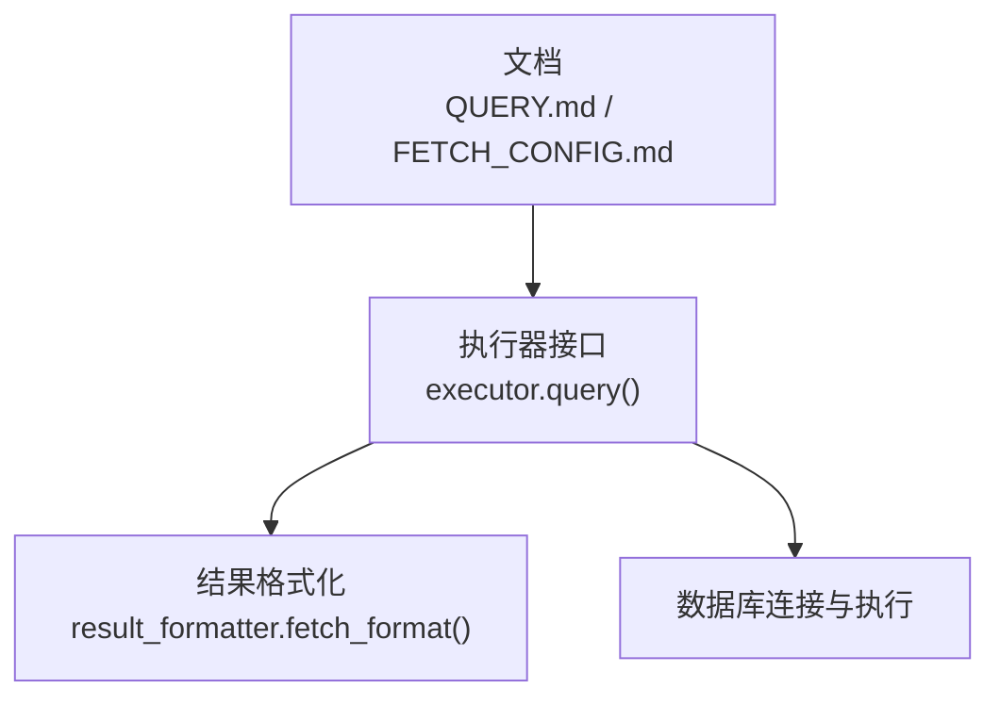
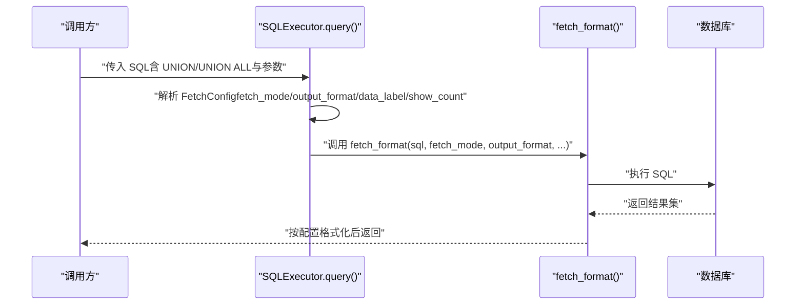
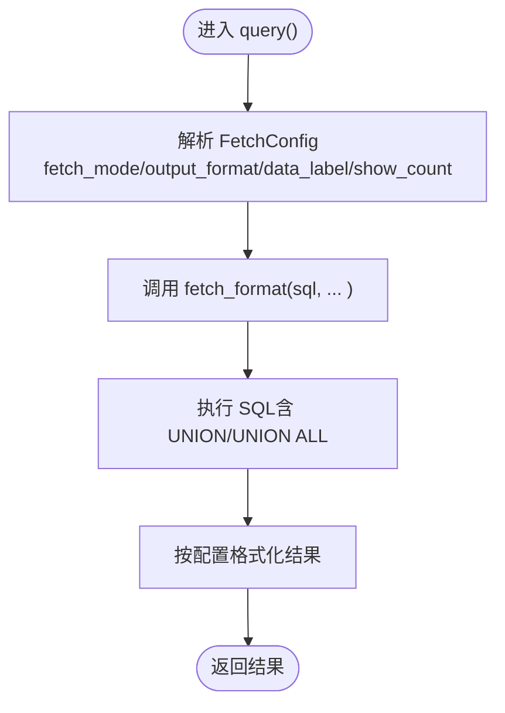
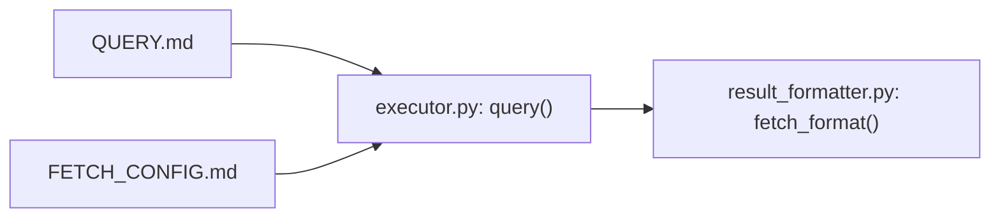

# UNION操作

<cite>
**本文引用的文件**
- [QUERY.md](file://docs/QUERY.md)
- [FETCH_CONFIG.md](file://docs/FETCH_CONFIG.md)
- [executor.py](file://lazy_mysql/executor.py)
- [result_formatter.py](file://lazy_mysql/tools/result_formatter.py)
</cite>

## 目录
1. [简介](#简介)
2. [项目结构](#项目结构)
3. [核心组件](#核心组件)
4. [架构总览](#架构总览)
5. [详细组件分析](#详细组件分析)
6. [依赖关系分析](#依赖关系分析)
7. [性能考虑](#性能考虑)
8. [故障排查指南](#故障排查指南)
9. [结论](#结论)
10. [附录](#附录)

## 简介
本章节聚焦于 lazy_mysql 中的 UNION 操作实现与使用方法，基于仓库内文档与源码对 UNION/UNION ALL 的调用方式、字段匹配与数据类型兼容性要求、结果格式化以及性能优化建议进行系统阐述。同时给出典型应用场景（数据整合、报表生成）的实践思路。

## 项目结构
围绕 UNION 的使用，主要涉及以下模块与文档：
- 文档层：QUERY.md 展示了 UNION 查询示例与适用场景；FETCH_CONFIG.md 详述结果格式化配置。
- 执行层：executor.py 提供 query() 与 fetch_format()，负责执行自定义 SQL 并按配置返回结果。
- 工具层：result_formatter.py 提供统一的结果格式化能力，支撑 UNION 查询的多格式输出。

图表来源
- [QUERY.md:156-171](file://docs/QUERY.md#L156-L171)
- [executor.py:514-590](file://lazy_mysql/executor.py#L514-L590)
- [result_formatter.py:1-24](file://lazy_mysql/tools/result_formatter.py#L1-L24)

章节来源
- [QUERY.md:156-171](file://docs/QUERY.md#L156-L171)
- [executor.py:514-590](file://lazy_mysql/executor.py#L514-L590)
- [result_formatter.py:1-24](file://lazy_mysql/tools/result_formatter.py#L1-L24)

## 核心组件
- query() 方法：接收完整 SQL（含 UNION/UNION ALL）与参数，通过 FetchConfig 控制返回格式。
- fetch_format()：统一执行 SQL 并按 fetch_mode/output_format/data_label/show_count 等配置返回结果。
- FetchConfig：集中管理返回模式与输出格式，支持 DataFrame、字典列表、单值等多种形态。

章节来源
- [executor.py:514-590](file://lazy_mysql/executor.py#L514-L590)
- [result_formatter.py:1-24](file://lazy_mysql/tools/result_formatter.py#L1-L24)
- [FETCH_CONFIG.md:1-223](file://docs/FETCH_CONFIG.md#L1-L223)

## 架构总览
下图展示了 UNION 查询在 lazy_mysql 中的端到端流程：调用方编写 SQL（含 UNION/UNION ALL），executor.query() 解析 FetchConfig，委托 fetch_format() 执行并格式化返回。

图表来源
- [executor.py:514-590](file://lazy_mysql/executor.py#L514-L590)
- [result_formatter.py:1-24](file://lazy_mysql/tools/result_formatter.py#L1-L24)

## 详细组件分析

### UNION 与 UNION ALL 的使用
- 使用场景：当需要合并多个 SELECT 的结果集时，UNION 会去重，UNION ALL 不去重，通常 UNION ALL 性能更优。
- 仓库示例：QUERY.md 展示了使用 query() 执行包含 UNION ALL 的合并查询，并通过 FetchConfig 指定输出格式与列标签。

章节来源
- [QUERY.md:156-171](file://docs/QUERY.md#L156-L171)

### 字段匹配与数据类型兼容性
- 字段数量一致：各 SELECT 子句必须返回相同数量的字段。
- 数据类型兼容：对应位置字段的数据类型应兼容（例如数值与数值字符串、日期与日期字符串等），否则可能导致隐式转换失败或结果异常。
- 列别名一致性：建议显式为字段设置别名，确保最终结果列名一致，便于后续处理。

章节来源
- [QUERY.md:156-171](file://docs/QUERY.md#L156-L171)

### 结果格式化与列标签
- 通过 FetchConfig 的 output_format 与 data_label 控制输出形态与列名：
  - output_format="df_dict"：返回字典列表，适合报表与二次加工。
  - output_format="df"：返回 DataFrame，便于统计分析。
  - show_count=True：返回 (数据, 总数) 元组，便于前端分页与统计。
- data_label 用于重命名列名，确保与 SELECT 字段一一对应。

章节来源
- [FETCH_CONFIG.md:1-223](file://docs/FETCH_CONFIG.md#L1-L223)
- [executor.py:574-590](file://lazy_mysql/executor.py#L574-L590)

### 执行流程与关键点
- query() 会将传入的 SQL 与参数交给 fetch_format() 执行。
- fetch_format() 负责实际执行 SQL 并按配置返回结果，支持 all/oneTuple/one 三种获取模式与多种输出格式。

图表来源
- [executor.py:514-590](file://lazy_mysql/executor.py#L514-L590)
- [result_formatter.py:1-24](file://lazy_mysql/tools/result_formatter.py#L1-L24)

## 依赖关系分析
- query() 依赖 fetch_format() 完成实际执行与格式化。
- fetch_format() 由 result_formatter.py 提供，executor.py 仅做配置解析与转发。
- 文档层 QUERY.md 与 FETCH_CONFIG.md 为使用与配置提供规范参考。

图表来源
- [QUERY.md:156-171](file://docs/QUERY.md#L156-L171)
- [FETCH_CONFIG.md:1-223](file://docs/FETCH_CONFIG.md#L1-L223)
- [executor.py:514-590](file://lazy_mysql/executor.py#L514-L590)
- [result_formatter.py:1-24](file://lazy_mysql/tools/result_formatter.py#L1-L24)

章节来源
- [QUERY.md:156-171](file://docs/QUERY.md#L156-L171)
- [FETCH_CONFIG.md:1-223](file://docs/FETCH_CONFIG.md#L1-L223)
- [executor.py:514-590](file://lazy_mysql/executor.py#L514-L590)
- [result_formatter.py:1-24](file://lazy_mysql/tools/result_formatter.py#L1-L24)

## 性能考虑
- 优先使用 UNION ALL：当不需要去重时，UNION ALL 通常更快，避免额外的去重步骤。
- 字段与索引设计：确保参与合并查询的字段具备合适的索引，尤其是 WHERE 条件与连接字段，有助于提升各子查询性能。
- 查询顺序与过滤前置：尽量在子查询内部进行 WHERE 过滤与 LIMIT 限制，减少中间结果集大小。
- 结果集大小控制：合理使用 LIMIT 与分页策略，避免一次性返回大量数据。
- 输出格式权衡：DataFrame 与字典列表在内存占用与处理效率上有所不同，按业务需求选择合适格式。

## 故障排查指南
- 未返回结果集：若提示“无结果集可获取”，检查 SQL 是否为查询语句、是否提前关闭了游标，或确认 query() 的 self_close 参数使用是否正确。
- 列数不一致：UNION/UNION ALL 各子句字段数必须一致，否则会报错。请核对每个 SELECT 的字段数量与顺序。
- 列类型不兼容：对应位置字段类型不兼容可能导致隐式转换异常。建议显式 cast 或统一类型。
- 输出格式异常：当 output_format="df"/"df_dict" 时，data_label 必须与字段数一致，否则会触发校验错误。

章节来源
- [executor.py:506-512](file://lazy_mysql/executor.py#L506-L512)
- [FETCH_CONFIG.md:92-93](file://docs/FETCH_CONFIG.md#L92-L93)
- [FETCH_CONFIG.md:153-154](file://docs/FETCH_CONFIG.md#L153-L154)

## 结论
lazy_mysql 通过 query() 与 FetchConfig 的组合，为 UNION/UNION ALL 提供了灵活、可控的执行与格式化能力。实践中应关注字段数量与类型一致性、索引与过滤前置优化，并根据业务场景选择合适的输出格式，以获得更好的性能与可维护性。

## 附录
- 应用场景示例（概念性说明）：
  - 数据整合：将用户表与管理员表的共同字段进行合并，统一标识类型，便于后续统一展示与统计。
  - 报表生成：将不同时间区间的销售数据进行合并，形成跨期汇总报表，支持按维度分组与排序。
  - 跨库/跨表聚合：在满足字段兼容的前提下，合并来自不同表或视图的数据，作为报表数据源。