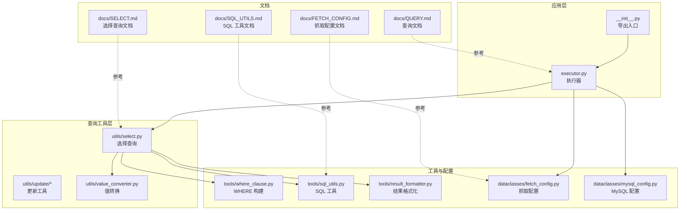
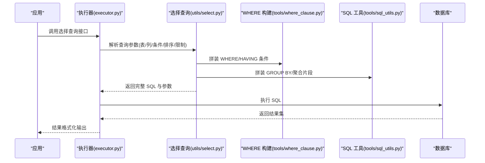
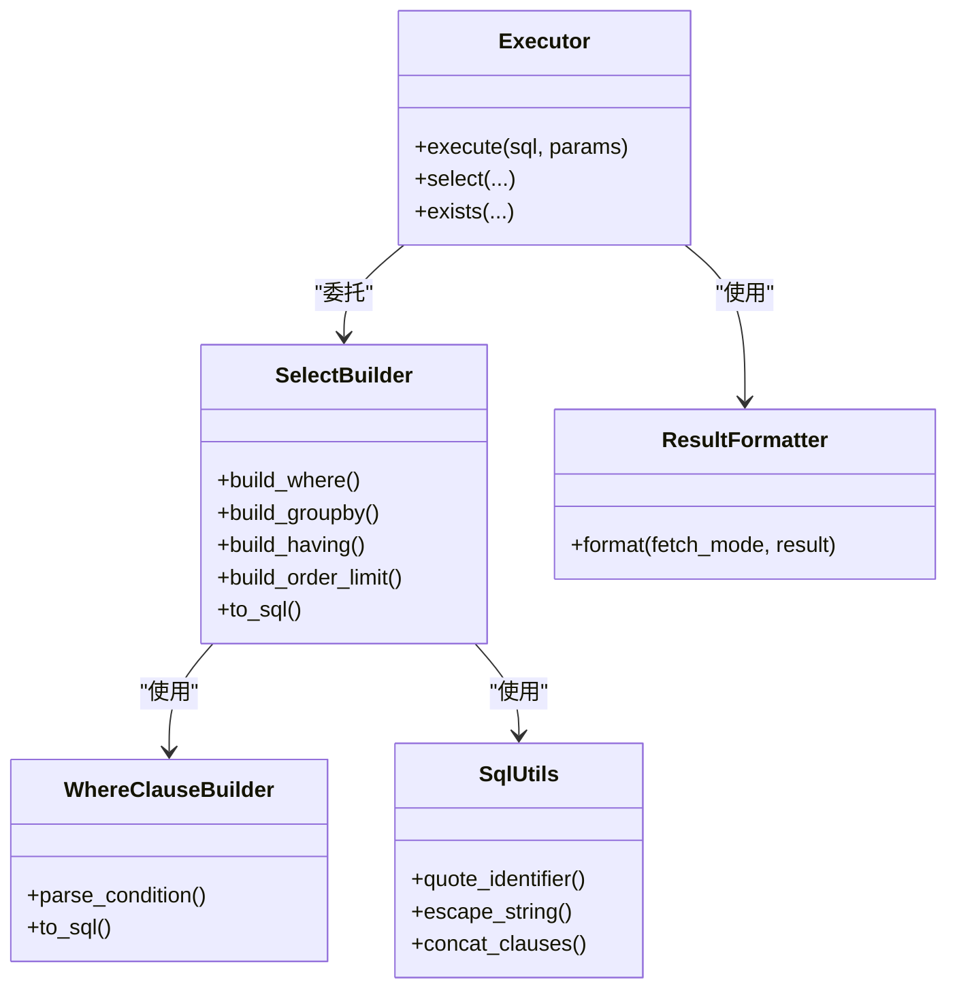
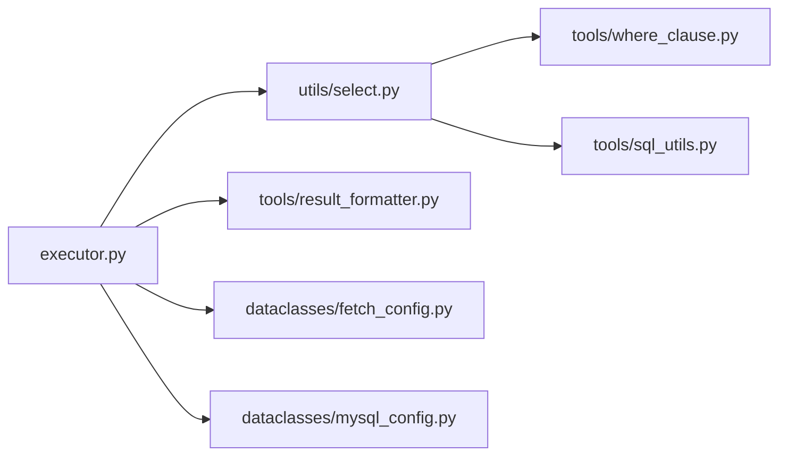

# 分组和聚合查询

<cite>
**本文引用的文件**
- [lazy_mysql/__init__.py](file://lazy_mysql/__init__.py)
- [lazy_mysql/executor.py](file://lazy_mysql/executor.py)
- [lazy_mysql/utils/select.py](file://lazy_mysql/utils/select.py)
- [lazy_mysql/utils/delete.py](file://lazy_mysql/utils/delete.py)
- [lazy_mysql/utils/update/update.py](file://lazy_mysql/utils/update/update.py)
- [lazy_mysql/utils/update/batch_update.py](file://lazy_mysql/utils/update/batch_update.py)
- [lazy_mysql/utils/update/merge_lists.py](file://lazy_mysql/utils/update/merge_lists.py)
- [lazy_mysql/utils/value_converter.py](file://lazy_mysql/utils/value_converter.py)
- [lazy_mysql/dataclasses/fetch_config.py](file://lazy_mysql/dataclasses/fetch_config.py)
- [lazy_mysql/dataclasses/mysql_config.py](file://lazy_mysql/dataclasses/mysql_config.py)
- [lazy_mysql/tools/sql_utils.py](file://lazy_mysql/tools/sql_utils.py)
- [lazy_mysql/tools/where_clause.py](file://lazy_mysql/tools/where_clause.py)
- [lazy_mysql/tools/result_formatter.py](file://lazy_mysql/tools/result_formatter.py)
- [docs/SELECT.md](file://docs/SELECT.md)
- [docs/QUERY.md](file://docs/QUERY.md)
- [docs/FETCH_CONFIG.md](file://docs/FETCH_CONFIG.md)
- [docs/SQL_UTILS.md](file://docs/SQL_UTILS.md)
</cite>

## 目录
1. [简介](#简介)
2. [项目结构](#项目结构)
3. [核心组件](#核心组件)
4. [架构总览](#架构总览)
5. [详细组件分析](#详细组件分析)
6. [依赖关系分析](#依赖关系分析)
7. [性能考虑](#性能考虑)
8. [故障排查指南](#故障排查指南)
9. [结论](#结论)
10. [附录](#附录)

## 简介
本文件围绕 lazy_mysql 中的分组与聚合查询展开，系统性阐述如何通过该库构建 GROUP BY 与 HAVING 子句，如何在查询中使用聚合函数（COUNT、SUM、AVG、MAX、MIN 等），以及 WHERE 与 HAVING 的区别与使用时机。同时给出多字段分组、条件聚合等高级用法的构建思路与实践建议，并总结分组查询的性能优化策略与索引使用建议。

## 项目结构
lazy_mysql 提供了统一的执行器与工具模块，用于构造 SQL 并执行。与分组聚合相关的入口主要集中在选择查询的工具层与文档说明中；底层执行器负责实际的 SQL 执行与结果处理。

图表来源
- [lazy_mysql/executor.py](file://lazy_mysql/executor.py)
- [lazy_mysql/utils/select.py](file://lazy_mysql/utils/select.py)
- [lazy_mysql/tools/where_clause.py](file://lazy_mysql/tools/where_clause.py)
- [lazy_mysql/tools/sql_utils.py](file://lazy_mysql/tools/sql_utils.py)
- [lazy_mysql/tools/result_formatter.py](file://lazy_mysql/tools/result_formatter.py)
- [lazy_mysql/dataclasses/fetch_config.py](file://lazy_mysql/dataclasses/fetch_config.py)
- [lazy_mysql/dataclasses/mysql_config.py](file://lazy_mysql/dataclasses/mysql_config.py)
- [docs/SELECT.md](file://docs/SELECT.md)
- [docs/QUERY.md](file://docs/QUERY.md)
- [docs/SQL_UTILS.md](file://docs/SQL_UTILS.md)
- [docs/FETCH_CONFIG.md](file://docs/FETCH_CONFIG.md)

章节来源
- [lazy_mysql/executor.py](file://lazy_mysql/executor.py)
- [lazy_mysql/utils/select.py](file://lazy_mysql/utils/select.py)
- [docs/SELECT.md](file://docs/SELECT.md)

## 核心组件
- 执行器与入口
  - 执行器负责接收查询参数、拼接 SQL、执行并返回结果。入口模块提供对外 API 导出。
- 选择查询工具
  - 选择查询工具封装了 WHERE、JOIN、LIMIT/OFFSET、ORDER BY 等子句的拼装逻辑，为分组与聚合提供基础能力。
- WHERE 子句构建
  - WHERE 子句工具模块提供条件表达式解析与 SQL 片段拼装，是 HAVING 条件的基础。
- SQL 工具与结果格式化
  - SQL 工具模块提供通用 SQL 片段拼装与转义；结果格式化模块负责将数据库结果按模式输出。
- 配置类
  - 抓取配置与 MySQL 配置类为执行器提供运行期参数与连接信息。

章节来源
- [lazy_mysql/executor.py](file://lazy_mysql/executor.py)
- [lazy_mysql/utils/select.py](file://lazy_mysql/utils/select.py)
- [lazy_mysql/tools/where_clause.py](file://lazy_mysql/tools/where_clause.py)
- [lazy_mysql/tools/sql_utils.py](file://lazy_mysql/tools/sql_utils.py)
- [lazy_mysql/tools/result_formatter.py](file://lazy_mysql/tools/result_formatter.py)
- [lazy_mysql/dataclasses/fetch_config.py](file://lazy_mysql/dataclasses/fetch_config.py)
- [lazy_mysql/dataclasses/mysql_config.py](file://lazy_mysql/dataclasses/mysql_config.py)

## 架构总览
下图展示了从应用调用到 SQL 生成与执行的整体流程，重点标注了与分组聚合相关的子句拼装位置。

图表来源
- [lazy_mysql/executor.py](file://lazy_mysql/executor.py)
- [lazy_mysql/utils/select.py](file://lazy_mysql/utils/select.py)
- [lazy_mysql/tools/where_clause.py](file://lazy_mysql/tools/where_clause.py)
- [lazy_mysql/tools/sql_utils.py](file://lazy_mysql/tools/sql_utils.py)

## 详细组件分析

### 1) 分组与聚合子句的构建要点
- GROUP BY 子句
  - 在选择查询工具中，应允许传入分组字段列表，自动拼接 GROUP BY 子句。
  - 支持多字段分组，字段顺序影响分组粒度与结果集排列。
- 聚合函数
  - COUNT、SUM、AVG、MAX、MIN 等应作为投影列或表达式参与 SELECT。
  - 对于条件聚合（如满足某条件才计入统计），可借助 CASE WHEN 或在 HAVING 中使用聚合函数表达式。
- HAVING 子句
  - HAVING 用于对分组后的聚合结果进行过滤，其条件通常包含聚合函数。
  - HAVING 与 WHERE 的区别在于：WHERE 过滤原始行，HAVING 过滤分组后的聚合行。

章节来源
- [lazy_mysql/utils/select.py](file://lazy_mysql/utils/select.py)
- [lazy_mysql/tools/where_clause.py](file://lazy_mysql/tools/where_clause.py)
- [docs/SELECT.md](file://docs/SELECT.md)

### 2) 多字段分组与条件聚合
- 多字段分组
  - 将多个维度字段放入分组集合，以实现更细粒度的统计。
  - 示例思路：在查询参数中提供分组字段数组，工具层将其转换为 GROUP BY 片段。
- 条件聚合
  - 使用 CASE WHEN 包裹字段，使仅满足条件的记录参与聚合计算。
  - 示例思路：在 SELECT 投影中加入基于 CASE WHEN 的聚合表达式，随后在 HAVING 中对这些表达式进行过滤。

章节来源
- [lazy_mysql/utils/select.py](file://lazy_mysql/utils/select.py)
- [docs/SELECT.md](file://docs/SELECT.md)

### 3) WHERE 与 HAVING 的区别与使用时机
- WHERE
  - 作用于原始行，先过滤再分组，能减少后续聚合计算量。
  - 适合对原始数据进行范围、相等性、正则等筛选。
- HAVING
  - 作用于分组后的聚合行，对 COUNT/SUM/AVG/MAX/MIN 等结果进行筛选。
  - 适合对统计结果设定阈值或比例条件。
- 使用时机
  - 先用 WHERE 去除无关数据，再用 HAVING 对统计结果进行二次筛选，可显著降低中间结果规模。

章节来源
- [lazy_mysql/utils/select.py](file://lazy_mysql/utils/select.py)
- [lazy_mysql/tools/where_clause.py](file://lazy_mysql/tools/where_clause.py)
- [docs/SELECT.md](file://docs/SELECT.md)

### 4) 复杂分组查询构建示例（思路）
以下为常见复杂场景的构建思路，便于在项目中扩展实现：

- 多维度销售统计
  - 分组字段：地区、产品类别、月份
  - 聚合指标：总销售额 SUM(金额)、订单数 COUNT(*)、平均客单价 AVG(金额)
  - HAVING：仅保留销售额大于阈值的分组
- 按日活跃用户统计
  - 分组字段：日期
  - 聚合指标：去重用户数 COUNT(DISTINCT 用户ID)
  - HAVING：仅保留日活超过阈值的日期
- 条件聚合：仅统计满足特定状态的订单
  - SELECT 中使用 CASE WHEN 包裹金额字段，仅当状态=完成时计入
  - HAVING 中对上述条件聚合求和进行阈值判断

章节来源
- [lazy_mysql/utils/select.py](file://lazy_mysql/utils/select.py)
- [docs/SELECT.md](file://docs/SELECT.md)

### 5) 代码级关系与调用链
下图展示与分组聚合相关的关键类与方法之间的关系（基于现有模块职责）：

图表来源
- [lazy_mysql/executor.py](file://lazy_mysql/executor.py)
- [lazy_mysql/utils/select.py](file://lazy_mysql/utils/select.py)
- [lazy_mysql/tools/where_clause.py](file://lazy_mysql/tools/where_clause.py)
- [lazy_mysql/tools/sql_utils.py](file://lazy_mysql/tools/sql_utils.py)
- [lazy_mysql/tools/result_formatter.py](file://lazy_mysql/tools/result_formatter.py)

## 依赖关系分析
- 组件耦合
  - 执行器依赖选择查询构建器与结果格式化模块；选择查询构建器进一步依赖 WHERE 子句构建器与 SQL 工具。
- 外部依赖
  - 通过配置类注入数据库连接与抓取参数，确保执行器在不同环境下的可配置性。
- 潜在循环依赖
  - 当前模块间为单向依赖，未见循环导入迹象。

图表来源
- [lazy_mysql/executor.py](file://lazy_mysql/executor.py)
- [lazy_mysql/utils/select.py](file://lazy_mysql/utils/select.py)
- [lazy_mysql/tools/where_clause.py](file://lazy_mysql/tools/where_clause.py)
- [lazy_mysql/tools/sql_utils.py](file://lazy_mysql/tools/sql_utils.py)
- [lazy_mysql/tools/result_formatter.py](file://lazy_mysql/tools/result_formatter.py)
- [lazy_mysql/dataclasses/fetch_config.py](file://lazy_mysql/dataclasses/fetch_config.py)
- [lazy_mysql/dataclasses/mysql_config.py](file://lazy_mysql/dataclasses/mysql_config.py)

章节来源
- [lazy_mysql/executor.py](file://lazy_mysql/executor.py)
- [lazy_mysql/utils/select.py](file://lazy_mysql/utils/select.py)
- [lazy_mysql/tools/where_clause.py](file://lazy_mysql/tools/where_clause.py)
- [lazy_mysql/tools/sql_utils.py](file://lazy_mysql/tools/sql_utils.py)
- [lazy_mysql/tools/result_formatter.py](file://lazy_mysql/tools/result_formatter.py)
- [lazy_mysql/dataclasses/fetch_config.py](file://lazy_mysql/dataclasses/fetch_config.py)
- [lazy_mysql/dataclasses/mysql_config.py](file://lazy_mysql/dataclasses/mysql_config.py)

## 性能考虑
- 查询阶段优化
  - 优先使用 WHERE 进行原始行过滤，减少进入分组与聚合的数据量。
  - 合理设计分组字段顺序，避免不必要的高基数组合导致结果集过大。
- 聚合阶段优化
  - 尽量使用覆盖索引列参与分组与过滤，减少回表与临时表创建。
  - 对 COUNT(*) 的统计，若业务允许，可考虑使用近似算法或预聚合表。
- 索引使用建议
  - 为分组字段建立合适的复合索引，提升分组效率。
  - 为 HAVING 中使用的聚合条件涉及的列建立索引，减少排序与临时表。
  - 对 WHERE 过滤列建立索引，降低扫描成本。
- 结果集与内存
  - 控制分组后的结果集大小，必要时配合 LIMIT/OFFSET 实现分页。
  - 使用合适的结果抓取模式，避免一次性加载大量数据。

## 故障排查指南
- 常见问题
  - 分组字段未出现在 SELECT 或 ORDER BY 中：需确保 SELECT 投影包含分组字段或聚合函数。
  - HAVING 中使用未聚合列：需确认该列已在分组字段中，或使用聚合函数包裹。
  - 条件聚合写法错误：CASE WHEN 应正确包裹参与聚合的字段。
- 定位手段
  - 逐步打印生成的 SQL 与参数，核对 WHERE/HAVING/GROUP BY 片段是否符合预期。
  - 使用 EXPLAIN 分析执行计划，关注索引使用、临时表与排序情况。
- 修复建议
  - 先简化查询，验证基本分组与聚合逻辑，再逐步增加条件与排序。
  - 对大数据量场景，优先在 WHERE 中做粗过滤，再在 HAVING 中做细过滤。

章节来源
- [lazy_mysql/utils/select.py](file://lazy_mysql/utils/select.py)
- [lazy_mysql/tools/where_clause.py](file://lazy_mysql/tools/where_clause.py)
- [lazy_mysql/tools/sql_utils.py](file://lazy_mysql/tools/sql_utils.py)
- [lazy_mysql/tools/result_formatter.py](file://lazy_mysql/tools/result_formatter.py)
- [docs/QUERY.md](file://docs/QUERY.md)

## 结论
lazy_mysql 在选择查询层面提供了灵活的 WHERE/HAVING、JOIN/LIMIT/OFFSET、ORDER BY 等子句拼装能力，为构建分组与聚合查询奠定了良好基础。通过合理运用 WHERE 与 HAVING 的时机差异、多字段分组与条件聚合技巧，以及遵循索引与执行计划优化策略，可在保证查询正确性的前提下获得更高的性能表现。

## 附录
- 相关文档参考
  - 选择查询与 JOIN、LIMIT/OFFSET、ORDER BY 等用法参见文档。
  - SQL 工具与抓取配置文档有助于理解底层拼装与参数注入机制。

章节来源
- [docs/SELECT.md](file://docs/SELECT.md)
- [docs/SQL_UTILS.md](file://docs/SQL_UTILS.md)
- [docs/FETCH_CONFIG.md](file://docs/FETCH_CONFIG.md)