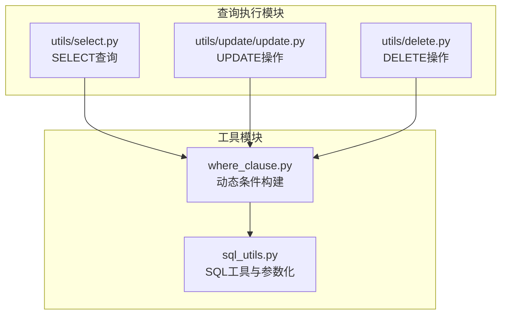
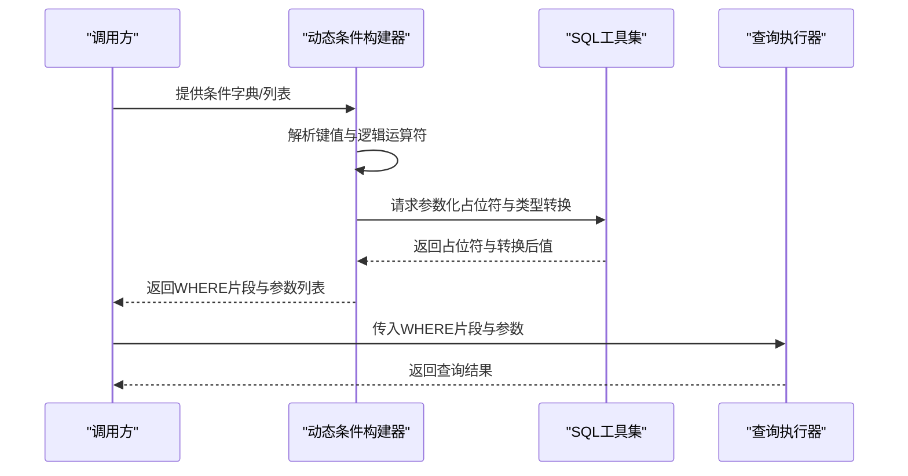
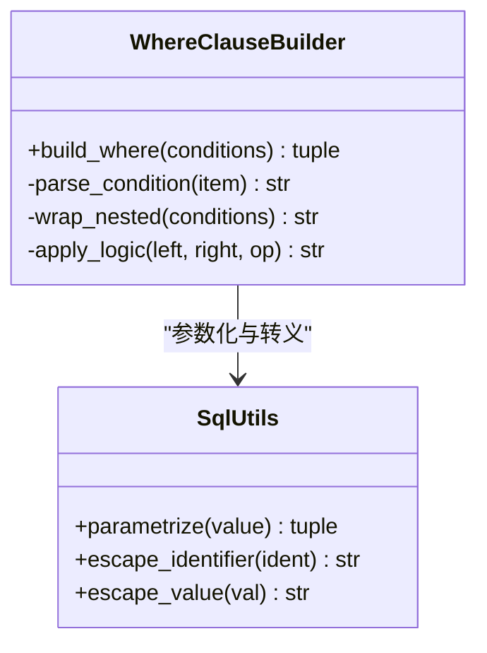
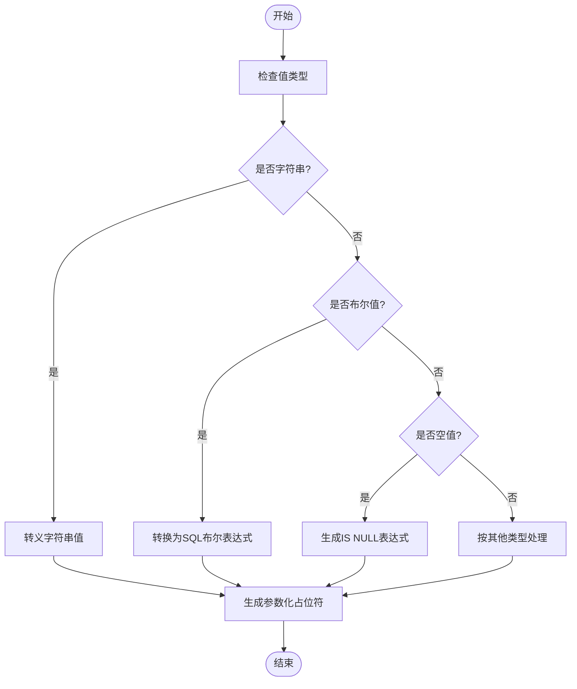
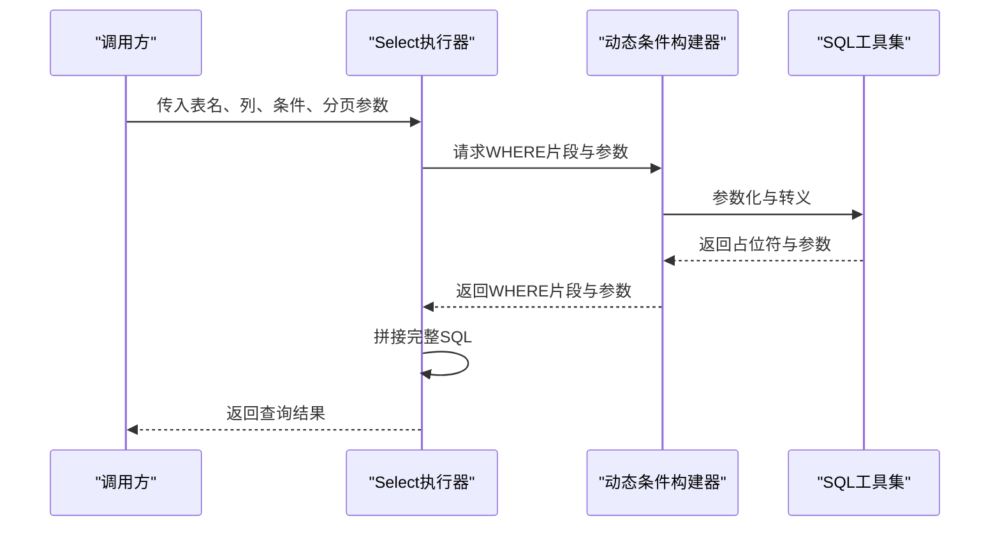
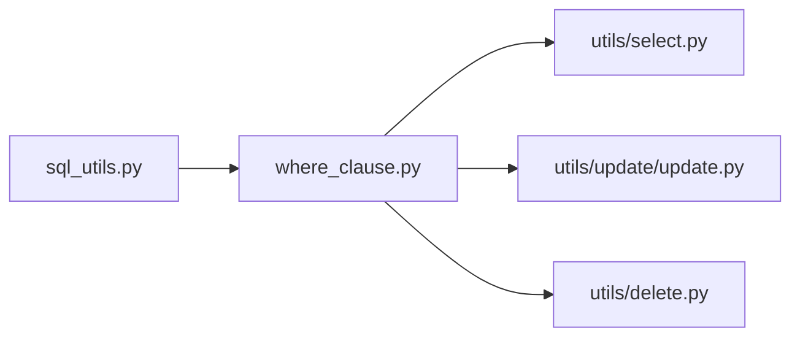

# 动态条件构建

<cite>
**本文档引用的文件**
- [lazy_mysql/__init__.py](file://lazy_mysql/__init__.py)
- [lazy_mysql/tools/where_clause.py](file://lazy_mysql/tools/where_clause.py)
- [lazy_mysql/tools/sql_utils.py](file://lazy_mysql/tools/sql_utils.py)
- [lazy_mysql/utils/select.py](file://lazy_mysql/utils/select.py)
- [lazy_mysql/utils/update/update.py](file://lazy_mysql/utils/update/update.py)
- [lazy_mysql/utils/delete.py](file://lazy_mysql/utils/delete.py)
- [docs/CONDITIONS.md](file://docs/CONDITIONS.md)
- [docs/QUERY.md](file://docs/QUERY.md)
- [docs/SELECT.md](file://docs/SELECT.md)
</cite>

## 目录
1. [简介](#简介)
2. [项目结构](#项目结构)
3. [核心组件](#核心组件)
4. [架构概览](#架构概览)
5. [详细组件分析](#详细组件分析)
6. [依赖关系分析](#依赖关系分析)
7. [性能考虑](#性能考虑)
8. [故障排除指南](#故障排除指南)
9. [结论](#结论)
10. [附录](#附录)

## 简介
本文件深入解析 lazy_mysql 中动态 WHERE 条件的构建机制，重点涵盖：
- 基于运行时条件动态拼接 SQL 条件语句
- AND、OR 逻辑运算符的组合使用
- 嵌套条件的构建方法与复杂条件表达式支持
- 条件参数化以确保 SQL 注入防护
- 实际应用场景：搜索过滤、权限控制等动态查询需求

该机制通过独立的条件构建模块与查询执行模块解耦，既保证了灵活性，又确保了安全性与可维护性。

## 项目结构
lazy_mysql 的动态条件构建主要集中在 tools 子模块中，核心文件包括：
- where_clause.py：动态 WHERE 条件的构建与拼接
- sql_utils.py：SQL 工具函数（包含参数化与转义）
- utils/select.py：SELECT 查询入口，集成动态条件
- utils/update/update.py：UPDATE 操作中对 SET 和 WHERE 的协同处理
- utils/delete.py：DELETE 操作中的动态 WHERE 构建

**图表来源**
- [lazy_mysql/tools/where_clause.py](file://lazy_mysql/tools/where_clause.py)
- [lazy_mysql/tools/sql_utils.py](file://lazy_mysql/tools/sql_utils.py)
- [lazy_mysql/utils/select.py](file://lazy_mysql/utils/select.py)
- [lazy_mysql/utils/update/update.py](file://lazy_mysql/utils/update/update.py)
- [lazy_mysql/utils/delete.py](file://lazy_mysql/utils/delete.py)

**章节来源**
- [lazy_mysql/__init__.py](file://lazy_mysql/__init__.py)
- [lazy_mysql/tools/where_clause.py](file://lazy_mysql/tools/where_clause.py)
- [lazy_mysql/tools/sql_utils.py](file://lazy_mysql/tools/sql_utils.py)
- [lazy_mysql/utils/select.py](file://lazy_mysql/utils/select.py)
- [lazy_mysql/utils/update/update.py](file://lazy_mysql/utils/update/update.py)
- [lazy_mysql/utils/delete.py](file://lazy_mysql/utils/delete.py)

## 核心组件
- 动态条件构建器（where_clause.py）：负责将字典或嵌套结构转换为 SQL WHERE 片段，并自动处理 AND/OR 组合与括号嵌套。
- SQL 工具集（sql_utils.py）：提供参数化占位符生成、值类型转换与安全转义，确保注入防护。
- 查询执行器（utils/select.py）：在 SELECT 查询中整合动态条件，支持分页、排序与结果格式化。
- 更新/删除执行器（utils/update/update.py、utils/delete.py）：在 UPDATE/DELETE 中复用动态条件构建能力，统一安全策略。

**章节来源**
- [lazy_mysql/tools/where_clause.py](file://lazy_mysql/tools/where_clause.py)
- [lazy_mysql/tools/sql_utils.py](file://lazy_mysql/tools/sql_utils.py)
- [lazy_mysql/utils/select.py](file://lazy_mysql/utils/select.py)
- [lazy_mysql/utils/update/update.py](file://lazy_mysql/utils/update/update.py)
- [lazy_mysql/utils/delete.py](file://lazy_mysql/utils/delete.py)

## 架构概览
动态条件构建的整体流程如下：
- 输入：用户提供的条件字典或列表（支持嵌套）
- 处理：where_clause 将其转换为 SQL 片段，自动插入 AND/OR 与括号
- 安全：sql_utils 对值进行参数化与类型转换
- 输出：拼接后的完整 WHERE 子句与参数列表
- 集成：查询执行器将 WHERE 与 FROM/SET/DELETE 等子句合并

**图表来源**
- [lazy_mysql/tools/where_clause.py](file://lazy_mysql/tools/where_clause.py)
- [lazy_mysql/tools/sql_utils.py](file://lazy_mysql/tools/sql_utils.py)
- [lazy_mysql/utils/select.py](file://lazy_mysql/utils/select.py)

## 详细组件分析

### 动态条件构建器（where_clause.py）
职责与特性：
- 支持键值对条件（字段=值）、范围条件（字段 BETWEEN ...）、比较运算符（>, <, >=, <=, !=, <>）
- 自动处理 AND/OR 逻辑组合，支持嵌套括号以保持优先级
- 支持空值判断（IS NULL/IS NOT NULL）
- 与 sql_utils 协作完成参数化与类型转换

**图表来源**
- [lazy_mysql/tools/where_clause.py](file://lazy_mysql/tools/where_clause.py)
- [lazy_mysql/tools/sql_utils.py](file://lazy_mysql/tools/sql_utils.py)

**章节来源**
- [lazy_mysql/tools/where_clause.py](file://lazy_mysql/tools/where_clause.py)

### SQL 工具集（sql_utils.py）
职责与特性：
- 参数化：为每个值生成安全的占位符，并返回对应的参数列表
- 类型转换：根据值类型选择合适的 SQL 表达式（字符串、数字、布尔、日期时间等）
- 转义：对标识符与字符串值进行安全转义，防止注入
- 与动态条件构建器配合，确保所有外部输入均被参数化

**图表来源**
- [lazy_mysql/tools/sql_utils.py](file://lazy_mysql/tools/sql_utils.py)

**章节来源**
- [lazy_mysql/tools/sql_utils.py](file://lazy_mysql/tools/sql_utils.py)

### 查询执行器（utils/select.py）
职责与特性：
- 接收动态 WHERE 条件与参数
- 与其他子句（FROM、JOIN、ORDER BY、LIMIT）拼接
- 支持分页与结果格式化
- 通过参数化避免注入风险

**图表来源**
- [lazy_mysql/utils/select.py](file://lazy_mysql/utils/select.py)
- [lazy_mysql/tools/where_clause.py](file://lazy_mysql/tools/where_clause.py)
- [lazy_mysql/tools/sql_utils.py](file://lazy_mysql/tools/sql_utils.py)

**章节来源**
- [lazy_mysql/utils/select.py](file://lazy_mysql/utils/select.py)

### 更新/删除执行器（utils/update/update.py、utils/delete.py）
职责与特性：
- 在 UPDATE/DELETE 中复用动态条件构建能力
- UPDATE 同时处理 SET 列表与 WHERE 条件
- 统一的安全策略：所有外部输入均参数化

**图表来源**
- [lazy_mysql/utils/update/update.py](file://lazy_mysql/utils/update/update.py)
- [lazy_mysql/utils/delete.py](file://lazy_mysql/utils/delete.py)
- [lazy_mysql/tools/where_clause.py](file://lazy_mysql/tools/where_clause.py)
- [lazy_mysql/tools/sql_utils.py](file://lazy_mysql/tools/sql_utils.py)

**章节来源**
- [lazy_mysql/utils/update/update.py](file://lazy_mysql/utils/update/update.py)
- [lazy_mysql/utils/delete.py](file://lazy_mysql/utils/delete.py)

## 依赖关系分析
- where_clause 依赖 sql_utils 进行参数化与转义
- 所有查询执行器（select、update、delete）依赖 where_clause 生成 WHERE 片段
- 通过模块解耦，新增查询类型只需遵循现有接口即可复用条件构建能力

**图表来源**
- [lazy_mysql/tools/sql_utils.py](file://lazy_mysql/tools/sql_utils.py)
- [lazy_mysql/tools/where_clause.py](file://lazy_mysql/tools/where_clause.py)
- [lazy_mysql/utils/select.py](file://lazy_mysql/utils/select.py)
- [lazy_mysql/utils/update/update.py](file://lazy_mysql/utils/update/update.py)
- [lazy_mysql/utils/delete.py](file://lazy_mysql/utils/delete.py)

**章节来源**
- [lazy_mysql/tools/where_clause.py](file://lazy_mysql/tools/where_clause.py)
- [lazy_mysql/tools/sql_utils.py](file://lazy_mysql/tools/sql_utils.py)
- [lazy_mysql/utils/select.py](file://lazy_mysql/utils/select.py)
- [lazy_mysql/utils/update/update.py](file://lazy_mysql/utils/update/update.py)
- [lazy_mysql/utils/delete.py](file://lazy_mysql/utils/delete.py)

## 性能考虑
- 参数化查询：通过占位符减少 SQL 重编译开销，提升缓存命中率
- 条件扁平化：尽量避免过深嵌套，减少括号层数与逻辑分支
- 值类型优化：合理使用 BETWEEN、IN 等表达式，减少 OR 数量
- 索引友好：在高频过滤字段上建立索引，结合动态条件提升查询效率

## 故障排除指南
常见问题与解决方案：
- 注入风险：确保所有外部输入经由 sql_utils 参数化，避免字符串拼接
- 逻辑错误：检查 AND/OR 组合与括号嵌套，必要时显式添加括号以明确优先级
- 类型不匹配：确认值类型与 SQL 表达式一致（如布尔值需转换为 SQL 布尔）
- 性能问题：分析 WHERE 条件是否导致全表扫描，优化索引与条件顺序

**章节来源**
- [lazy_mysql/tools/sql_utils.py](file://lazy_mysql/tools/sql_utils.py)
- [lazy_mysql/tools/where_clause.py](file://lazy_mysql/tools/where_clause.py)

## 结论
lazy_mysql 的动态 WHERE 条件构建机制通过模块化设计实现了高灵活性与强安全性：
- 运行时条件动态拼接，支持 AND/OR 组合与嵌套括号
- 全面参数化与类型转换，有效防范 SQL 注入
- 与查询执行器无缝集成，适用于搜索过滤、权限控制等场景
建议在实际应用中遵循参数化原则与索引优化策略，以获得最佳性能与安全性。

## 附录
- 参考文档：CONDITIONS.md、QUERY.md、SELECT.md
- 关键实现文件：where_clause.py、sql_utils.py、select.py、update.py、delete.py

**章节来源**
- [docs/CONDITIONS.md](file://docs/CONDITIONS.md)
- [docs/QUERY.md](file://docs/QUERY.md)
- [docs/SELECT.md](file://docs/SELECT.md)