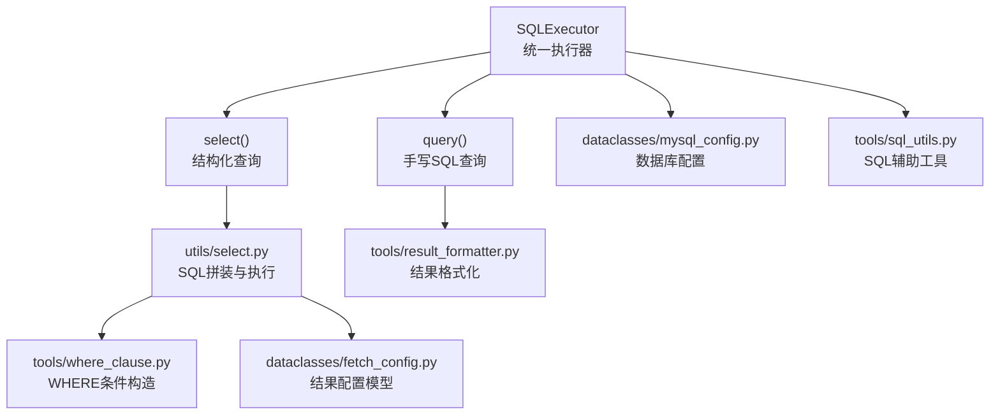
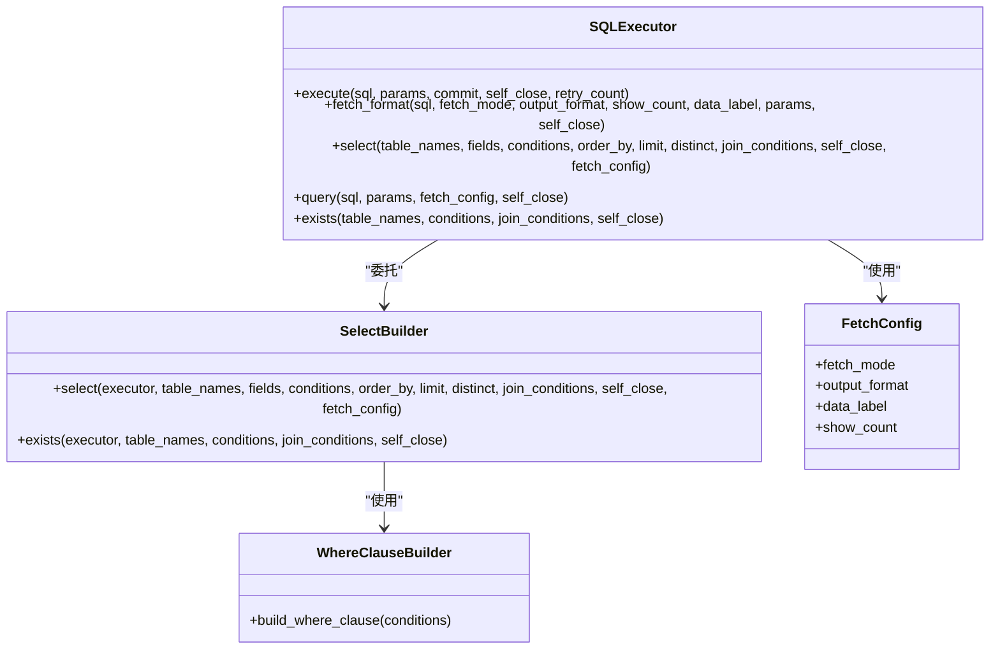
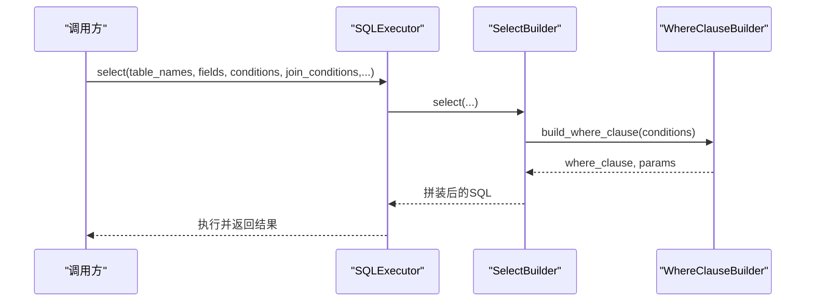
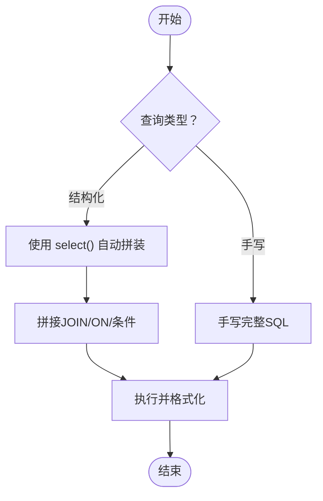
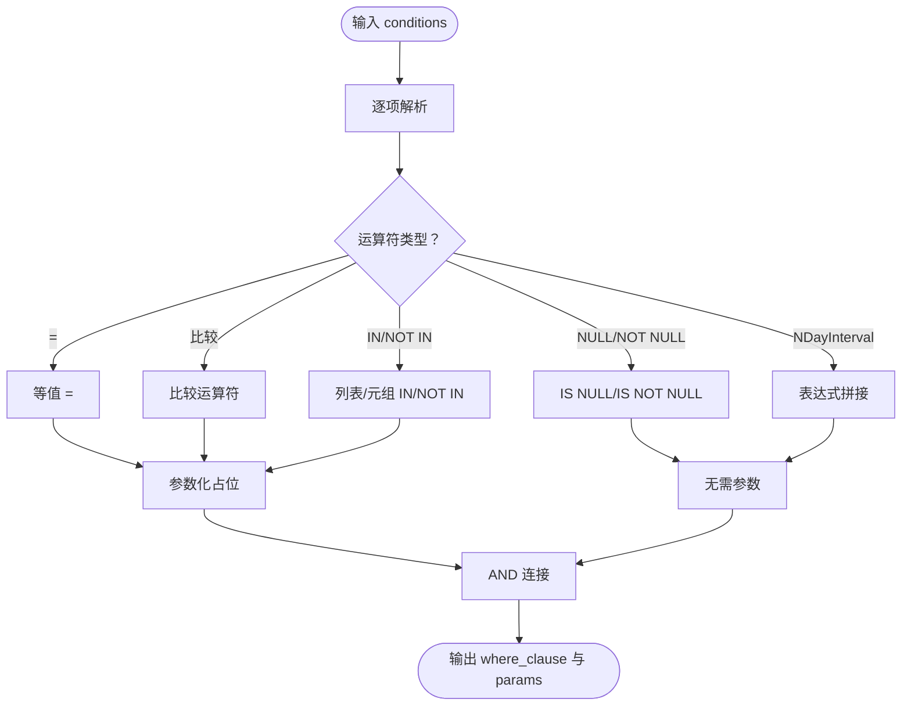
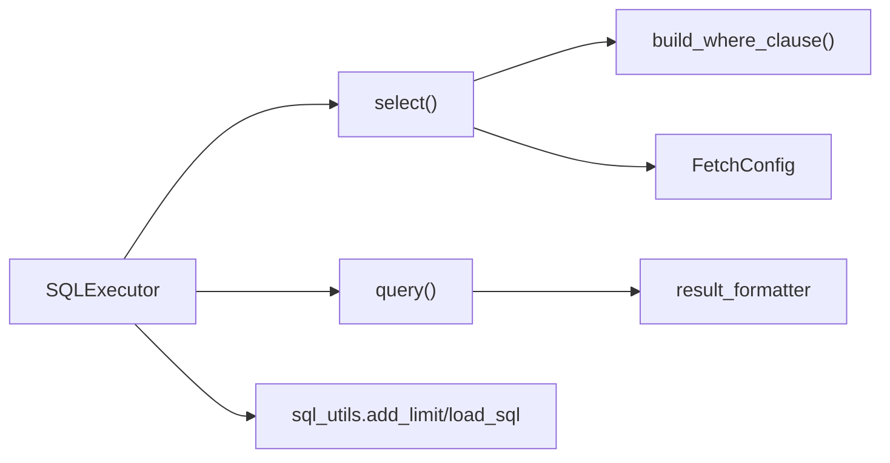

# 复杂查询构建器

<cite>
**本文引用的文件**
- [lazy_mysql/__init__.py](file://lazy_mysql/__init__.py)
- [lazy_mysql/executor.py](file://lazy_mysql/executor.py)
- [lazy_mysql/utils/select.py](file://lazy_mysql/utils/select.py)
- [lazy_mysql/tools/where_clause.py](file://lazy_mysql/tools/where_clause.py)
- [lazy_mysql/tools/sql_utils.py](file://lazy_mysql/tools/sql_utils.py)
- [lazy_mysql/dataclasses/fetch_config.py](file://lazy_mysql/dataclasses/fetch_config.py)
- [lazy_mysql/dataclasses/mysql_config.py](file://lazy_mysql/dataclasses/mysql_config.py)
- [docs/SELECT.md](file://docs/SELECT.md)
- [docs/QUERY.md](file://docs/QUERY.md)
- [docs/CONDITIONS.md](file://docs/CONDITIONS.md)
</cite>

## 目录
1. [简介](#简介)
2. [项目结构](#项目结构)
3. [核心组件](#核心组件)
4. [架构总览](#架构总览)
5. [详细组件分析](#详细组件分析)
6. [依赖关系分析](#依赖关系分析)
7. [性能考量](#性能考量)
8. [故障排查指南](#故障排查指南)
9. [结论](#结论)
10. [附录](#附录)

## 简介
本文件聚焦于 lazy_mysql 的“复杂查询构建器”能力，系统性阐述其多表关联查询、子查询、UNION、窗口函数、GROUP BY/HAVING、动态 WHERE 条件等高级特性。文档同时给出从简单到复杂的查询构建步骤、可视化流程图与序列图，并提供性能优化建议与常见问题排查要点，帮助读者快速掌握如何在不同场景下高效、安全地构建复杂 SQL。

## 项目结构
lazy_mysql 采用模块化设计，围绕 SQLExecutor 提供统一入口，select/query 两类查询路径分别对应“结构化自动 SQL 构建”和“手写 SQL 执行”，并辅以条件构造、结果格式化、配置模型等工具模块。

图表来源
- [lazy_mysql/executor.py:323-420](file://lazy_mysql/executor.py#L323-L420)
- [lazy_mysql/utils/select.py:1-237](file://lazy_mysql/utils/select.py#L1-L237)
- [lazy_mysql/tools/where_clause.py:42-127](file://lazy_mysql/tools/where_clause.py#L42-L127)
- [lazy_mysql/dataclasses/fetch_config.py:8-24](file://lazy_mysql/dataclasses/fetch_config.py#L8-L24)
- [lazy_mysql/dataclasses/mysql_config.py:10-135](file://lazy_mysql/dataclasses/mysql_config.py#L10-L135)
- [lazy_mysql/tools/sql_utils.py:1-53](file://lazy_mysql/tools/sql_utils.py#L1-L53)

章节来源
- [lazy_mysql/executor.py:14-616](file://lazy_mysql/executor.py#L14-L616)
- [lazy_mysql/__init__.py:1-21](file://lazy_mysql/__init__.py#L1-L21)

## 核心组件
- SQLExecutor：统一入口，封装连接、执行、结果格式化、错误处理与重试机制。
- select()：面向常规查询的结构化 SQL 构建器，支持 JOIN、WHERE、ORDER BY、LIMIT、DISTINCT、exists() 等。
- query()：面向复杂 SQL 的手写执行器，支持子查询、UNION、窗口函数、GROUP BY/HAVING 等。
- WHERE 条件构造：build_where_clause() 支持等值、比较、IN/NOT IN、NULL/NOT NULL、NDayInterval 等。
- FetchConfig：统一的结果格式化配置，支持 all/oneTuple/one、df、df_dict、list_1、dict 等。
- SQL 工具：add_limit()、load_sql() 等辅助函数，便于动态拼接条件与加载 SQL 文件。

章节来源
- [lazy_mysql/executor.py:14-616](file://lazy_mysql/executor.py#L14-L616)
- [lazy_mysql/utils/select.py:1-237](file://lazy_mysql/utils/select.py#L1-L237)
- [lazy_mysql/tools/where_clause.py:42-127](file://lazy_mysql/tools/where_clause.py#L42-L127)
- [lazy_mysql/dataclasses/fetch_config.py:8-24](file://lazy_mysql/dataclasses/fetch_config.py#L8-L24)
- [lazy_mysql/tools/sql_utils.py:1-53](file://lazy_mysql/tools/sql_utils.py#L1-L53)

## 架构总览
下面的类图展示了关键类之间的关系与职责边界。

图表来源
- [lazy_mysql/executor.py:323-420](file://lazy_mysql/executor.py#L323-L420)
- [lazy_mysql/utils/select.py:1-237](file://lazy_mysql/utils/select.py#L1-L237)
- [lazy_mysql/tools/where_clause.py:42-127](file://lazy_mysql/tools/where_clause.py#L42-L127)
- [lazy_mysql/dataclasses/fetch_config.py:8-24](file://lazy_mysql/dataclasses/fetch_config.py#L8-L24)

## 详细组件分析

### 多表关联查询（JOIN）
- 支持类型：INNER JOIN、LEFT JOIN、RIGHT JOIN、FULL OUTER JOIN（在手写 SQL 中使用）。
- 结构化 JOIN：通过 join_conditions 参数传入 join_type 与连接条件数组，自动拼接 ON 子句。
- 默认连接：若未提供具体条件，将默认使用主表与后续表的 item_id 字段进行连接。
- 多表链式 JOIN：传入表名列表，将依次追加 JOIN 子句，形成链式关联。

图表来源
- [lazy_mysql/utils/select.py:1-237](file://lazy_mysql/utils/select.py#L1-L237)
- [lazy_mysql/tools/where_clause.py:42-127](file://lazy_mysql/tools/where_clause.py#L42-L127)
- [lazy_mysql/executor.py:323-420](file://lazy_mysql/executor.py#L323-L420)

章节来源
- [lazy_mysql/utils/select.py:80-126](file://lazy_mysql/utils/select.py#L80-L126)
- [docs/SELECT.md:372-409](file://docs/SELECT.md#L372-L409)

### 子查询支持
- 结构化 select()：仅支持通过字典传入条件，不直接生成子查询。
- 手写 query()：完全开放，可直接编写子查询、相关/非相关子查询、UNION、窗口函数、GROUP BY/HAVING 等复杂 SQL。
- 示例参考：文档中提供了子查询、UNION、窗口函数的完整示例，可直接迁移至 query() 执行。

图表来源
- [docs/QUERY.md:131-192](file://docs/QUERY.md#L131-L192)
- [lazy_mysql/executor.py:514-590](file://lazy_mysql/executor.py#L514-L590)

章节来源
- [docs/QUERY.md:131-192](file://docs/QUERY.md#L131-L192)

### UNION 操作
- query() 支持 UNION/UNION ALL，可在同一查询中合并来自不同 SELECT 的结果集。
- 使用时注意列数与类型一致，必要时通过别名统一列名。

章节来源
- [docs/QUERY.md:156-171](file://docs/QUERY.md#L156-L171)

### 窗口函数
- query() 支持窗口函数（如 RANK()、ROW_NUMBER() 等），可与 WHERE/GROUP BY 等子句组合使用。
- 建议配合 ORDER BY 与 LIMIT 控制输出规模。

章节来源
- [docs/QUERY.md:173-191](file://docs/QUERY.md#L173-L191)

### GROUP BY 与 HAVING
- query() 支持在手写 SQL 中使用 GROUP BY 与 HAVING，适合聚合统计场景。
- 建议配合 ORDER BY/LIMIT 实现分页与排序。

章节来源
- [docs/QUERY.md:131-192](file://docs/QUERY.md#L131-L192)

### 动态 WHERE 条件构建
- 支持等值、比较、IN/NOT IN、NULL/NOT NULL、NDayInterval（最近N天）等。
- 自动参数化，防止 SQL 注入；支持字典类型自动 JSON 序列化。
- add_limit() 提供便捷的条件片段拼接，支持 AND/OR 前缀、IN/NOT IN、LIKE 等运算符。

图表来源
- [lazy_mysql/tools/where_clause.py:42-127](file://lazy_mysql/tools/where_clause.py#L42-L127)
- [lazy_mysql/tools/sql_utils.py:10-53](file://lazy_mysql/tools/sql_utils.py#L10-L53)

章节来源
- [lazy_mysql/tools/where_clause.py:42-127](file://lazy_mysql/tools/where_clause.py#L42-L127)
- [lazy_mysql/tools/sql_utils.py:10-53](file://lazy_mysql/tools/sql_utils.py#L10-L53)
- [docs/CONDITIONS.md:1-164](file://docs/CONDITIONS.md#L1-L164)

### EXISTS 快速存在性检查
- select() 的 exists() 通过 SELECT 1 ... LIMIT 1 优化性能，避免全表扫描。
- 适用于高频存在性判断场景，如“用户是否存在”、“某订单是否存在”。

章节来源
- [lazy_mysql/utils/select.py:159-237](file://lazy_mysql/utils/select.py#L159-L237)
- [docs/SELECT.md:161-265](file://docs/SELECT.md#L161-L265)

### 结果格式化与输出
- FetchConfig 控制 fetch_mode、output_format、data_label、show_count。
- 支持 all/oneTuple/one，以及 df、df_dict、list_1、dict 等输出格式。
- query() 默认 output_format=df_dict，与 select() 默认不同，需注意差异。

章节来源
- [lazy_mysql/dataclasses/fetch_config.py:8-24](file://lazy_mysql/dataclasses/fetch_config.py#L8-L24)
- [lazy_mysql/executor.py:514-590](file://lazy_mysql/executor.py#L514-L590)
- [docs/SELECT.md:418-543](file://docs/SELECT.md#L418-L543)

## 依赖关系分析
- SQLExecutor 作为核心入口，委托 select()/query() 执行。
- select() 依赖 where_clause 构造 WHERE，依赖 fetch_config 控制输出。
- query() 依赖 result_formatter 进行结果格式化。
- add_limit() 与 load_sql() 为工具函数，服务于动态条件与 SQL 文件加载。

图表来源
- [lazy_mysql/executor.py:323-590](file://lazy_mysql/executor.py#L323-L590)
- [lazy_mysql/utils/select.py:1-237](file://lazy_mysql/utils/select.py#L1-L237)
- [lazy_mysql/tools/where_clause.py:42-127](file://lazy_mysql/tools/where_clause.py#L42-L127)
- [lazy_mysql/dataclasses/fetch_config.py:8-24](file://lazy_mysql/dataclasses/fetch_config.py#L8-L24)
- [lazy_mysql/tools/sql_utils.py:1-53](file://lazy_mysql/tools/sql_utils.py#L1-L53)

章节来源
- [lazy_mysql/executor.py:14-616](file://lazy_mysql/executor.py#L14-L616)
- [lazy_mysql/__init__.py:1-21](file://lazy_mysql/__init__.py#L1-L21)

## 性能考量
- 优先使用 EXISTS 进行存在性判断，避免不必要的数据传输。
- WHERE 条件尽量落在数据库侧过滤，避免应用层二次过滤。
- JOIN 时让小表驱动大表，减少中间结果集。
- 使用索引覆盖 WHERE/GROUP BY/HAVING 的关键字段。
- 复杂聚合与窗口函数配合 LIMIT，控制输出规模。
- 使用参数化查询，避免 SQL 注入的同时提升缓存命中率。

章节来源
- [docs/SELECT.md:562-609](file://docs/SELECT.md#L562-L609)

## 故障排查指南
- 字段重复：多表查询时使用表前缀区分同名列，避免歧义。
- 空结果处理：对可能为空的查询，显式判断并做降级处理。
- 参数类型：确保传入值为 Python 原生类型，避免 numpy/dict 序列化异常。
- 连接异常：SQLExecutor 内置可重试错误类型与回滚逻辑，注意捕获异常并确认连接状态。
- SQL 文件加载：使用 load_sql() 读取外部 SQL，确保编码与路径正确。

章节来源
- [docs/SELECT.md:611-639](file://docs/SELECT.md#L611-L639)
- [lazy_mysql/tools/sql_utils.py:3-7](file://lazy_mysql/tools/sql_utils.py#L3-L7)
- [lazy_mysql/executor.py:62-106](file://lazy_mysql/executor.py#L62-L106)

## 结论
lazy_mysql 的复杂查询构建器通过“结构化自动 SQL 构建 + 手写 SQL 执行”的双通道设计，既保证了常规查询的易用性，又保留了复杂 SQL 的灵活性。借助完善的 WHERE 条件构造、结果格式化与错误处理机制，开发者可以在不同场景下高效、安全地构建从简单到复杂的查询。

## 附录
- 示例参考：SELECT 与 QUERY 文档提供了大量示例，涵盖 JOIN、子查询、UNION、窗口函数、GROUP BY/HAVING 等。
- 配置参考：FetchConfig 与 MySQLConfig 的字段与默认值，便于统一管理查询行为与数据库连接。

章节来源
- [docs/SELECT.md:1-672](file://docs/SELECT.md#L1-L672)
- [docs/QUERY.md:1-209](file://docs/QUERY.md#L1-L209)
- [docs/CONDITIONS.md:1-164](file://docs/CONDITIONS.md#L1-L164)
- [lazy_mysql/dataclasses/fetch_config.py:8-24](file://lazy_mysql/dataclasses/fetch_config.py#L8-L24)
- [lazy_mysql/dataclasses/mysql_config.py:10-135](file://lazy_mysql/dataclasses/mysql_config.py#L10-L135)