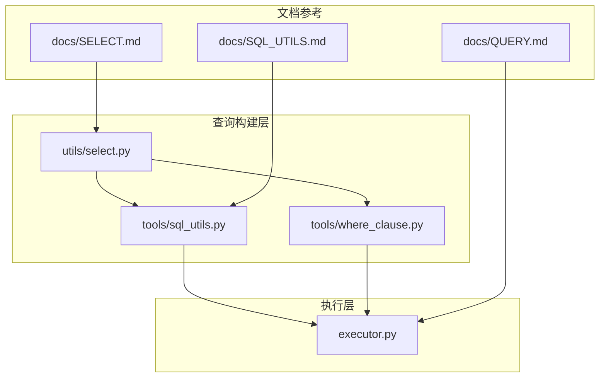
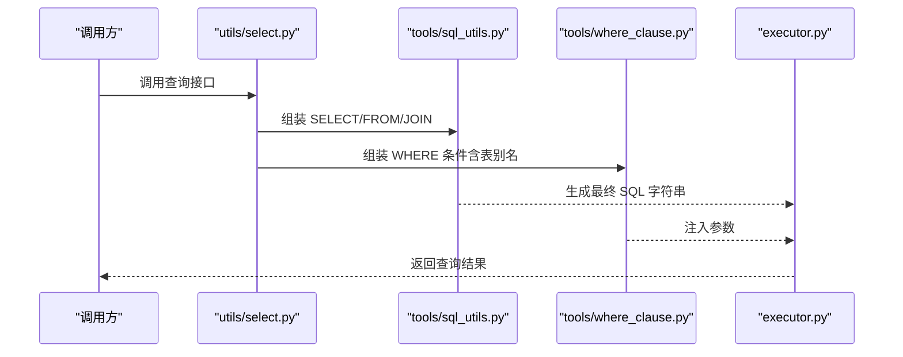
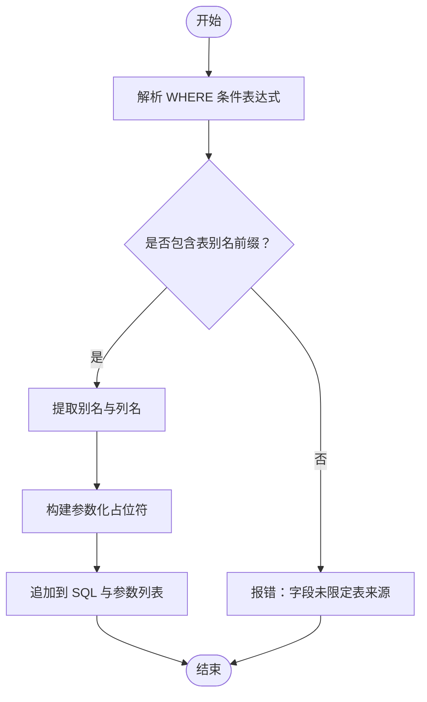
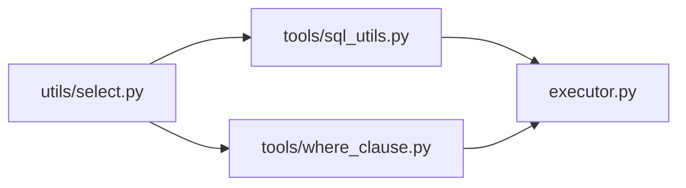

# 多表关联查询

<cite>
**本文引用的文件**
- [lazy_mysql/__init__.py](file://lazy_mysql/__init__.py)
- [lazy_mysql/utils/select.py](file://lazy_mysql/utils/select.py)
- [lazy_mysql/tools/sql_utils.py](file://lazy_mysql/tools/sql_utils.py)
- [lazy_mysql/tools/where_clause.py](file://lazy_mysql/tools/where_clause.py)
- [lazy_mysql/executor.py](file://lazy_mysql/executor.py)
- [docs/SELECT.md](file://docs/SELECT.md)
- [docs/QUERY.md](file://docs/QUERY.md)
- [docs/SQL_UTILS.md](file://docs/SQL_UTILS.md)
</cite>

## 目录
1. [引言](#引言)
2. [项目结构](#项目结构)
3. [核心组件](#核心组件)
4. [架构总览](#架构总览)
5. [详细组件分析](#详细组件分析)
6. [依赖关系分析](#依赖关系分析)
7. [性能考虑](#性能考虑)
8. [故障排查指南](#故障排查指南)
9. [结论](#结论)
10. [附录](#附录)

## 引言
本章节面向希望在 lazy_mysql 中构建复杂多表关联查询的用户与开发者，系统讲解以下内容：INNER JOIN、LEFT JOIN、RIGHT JOIN、FULL OUTER JOIN 的语法与使用场景；表别名的设置与引用（尤其在 WHERE 子句中的正确用法）；连接条件的构建（等值与非等值）；以及在该代码库中可复用的工具函数与最佳实践。为避免泄露具体代码，本文以“文件路径+行号范围”的形式标注关键实现位置。

## 项目结构
lazy_mysql 将“查询构建”与“执行”解耦：查询构建集中在工具模块与选择器模块，执行通过统一的执行器完成。与多表关联查询直接相关的模块包括：
- 查询构建与工具：tools/sql_utils.py、tools/where_clause.py
- 查询入口与封装：utils/select.py
- 执行器：executor.py
- 文档参考：docs/SELECT.md、docs/QUERY.md、docs/SQL_UTILS.md

图示来源
- [lazy_mysql/utils/select.py](file://lazy_mysql/utils/select.py)
- [lazy_mysql/tools/sql_utils.py](file://lazy_mysql/tools/sql_utils.py)
- [lazy_mysql/tools/where_clause.py](file://lazy_mysql/tools/where_clause.py)
- [lazy_mysql/executor.py](file://lazy_mysql/executor.py)
- [docs/SELECT.md](file://docs/SELECT.md)
- [docs/QUERY.md](file://docs/QUERY.md)
- [docs/SQL_UTILS.md](file://docs/SQL_UTILS.md)

章节来源
- [lazy_mysql/utils/select.py](file://lazy_mysql/utils/select.py)
- [lazy_mysql/tools/sql_utils.py](file://lazy_mysql/tools/sql_utils.py)
- [lazy_mysql/tools/where_clause.py](file://lazy_mysql/tools/where_clause.py)
- [lazy_mysql/executor.py](file://lazy_mysql/executor.py)
- [docs/SELECT.md](file://docs/SELECT.md)
- [docs/QUERY.md](file://docs/QUERY.md)
- [docs/SQL_UTILS.md](file://docs/SQL_UTILS.md)

## 核心组件
- 查询构建器（sql_utils）：负责拼接 SELECT、FROM、JOIN、WHERE 等子句，支持连接类型枚举与连接条件构造。
- 条件子句构建器（where_clause）：负责 WHERE 子句的拼接与参数化，支持表别名前缀的字段引用。
- 选择器（select）：对外暴露的高层查询接口，内部组合上述两个构建器。
- 执行器（executor）：统一执行 SQL 并返回结果。

章节来源
- [lazy_mysql/utils/select.py](file://lazy_mysql/utils/select.py)
- [lazy_mysql/tools/sql_utils.py](file://lazy_mysql/tools/sql_utils.py)
- [lazy_mysql/tools/where_clause.py](file://lazy_mysql/tools/where_clause.py)
- [lazy_mysql/executor.py](file://lazy_mysql/executor.py)

## 架构总览
下图展示了从高层选择器到底层执行器的调用链路，以及与工具模块的协作关系。

图示来源
- [lazy_mysql/utils/select.py](file://lazy_mysql/utils/select.py)
- [lazy_mysql/tools/sql_utils.py](file://lazy_mysql/tools/sql_utils.py)
- [lazy_mysql/tools/where_clause.py](file://lazy_mysql/tools/where_clause.py)
- [lazy_mysql/executor.py](file://lazy_mysql/executor.py)

## 详细组件分析

### 连接类型与语法
- INNER JOIN：保留两表均匹配的记录。
- LEFT JOIN：保留左表全部记录，右表无匹配时补 NULL。
- RIGHT JOIN：保留右表全部记录，左表无匹配时补 NULL。
- FULL OUTER JOIN：保留两表全部记录，双方无匹配时均补 NULL。

在该代码库中，连接类型通常以枚举或字符串常量的形式传入，由查询构建器根据类型拼接对应的 JOIN 子句。请参考以下路径定位实现细节：
- 连接类型定义与处理逻辑：[lazy_mysql/tools/sql_utils.py](file://lazy_mysql/tools/sql_utils.py)
- 查询入口与高层封装：[lazy_mysql/utils/select.py](file://lazy_mysql/utils/select.py)
- 文档参考：[docs/QUERY.md](file://docs/QUERY.md)、[docs/SQL_UTILS.md](file://docs/SQL_UTILS.md)

章节来源
- [lazy_mysql/tools/sql_utils.py](file://lazy_mysql/tools/sql_utils.py)
- [lazy_mysql/utils/select.py](file://lazy_mysql/utils/select.py)
- [docs/QUERY.md](file://docs/QUERY.md)
- [docs/SQL_UTILS.md](file://docs/SQL_UTILS.md)

### 表别名的设置与引用
- 设置表别名：在 FROM 或 JOIN 子句中为每个表指定别名，便于区分同库/同表的多实例或跨表字段。
- 在 WHERE 子句中引用：所有字段需以“别名.列名”的形式出现，确保解析器能正确识别所属表。
- 参数化绑定：WHERE 子句构建器会自动处理占位符与参数列表，避免 SQL 注入。

定位实现：
- 别名与字段引用规则：[lazy_mysql/tools/where_clause.py](file://lazy_mysql/tools/where_clause.py)
- JOIN 子句中别名的拼接：[lazy_mysql/tools/sql_utils.py](file://lazy_mysql/tools/sql_utils.py)
- 高层查询接口对别名的支持：[lazy_mysql/utils/select.py](file://lazy_mysql/utils/select.py)

章节来源
- [lazy_mysql/tools/where_clause.py](file://lazy_mysql/tools/where_clause.py)
- [lazy_mysql/tools/sql_utils.py](file://lazy_mysql/tools/sql_utils.py)
- [lazy_mysql/utils/select.py](file://lazy_mysql/utils/select.py)

### 连接条件的构建（等值与非等值）
- 等值连接：基于相等比较（=）建立关联，常见于主外键关系。
- 非等值连接：基于比较运算符（如 >、<、>=、<=、<>），用于范围匹配或时间窗口等场景。
- 条件表达式：支持 AND/OR 组合，括号明确优先级。
- 参数化：连接条件同样通过参数化绑定注入，保证安全与可维护性。

定位实现：
- 连接条件拼接与参数化：[lazy_mysql/tools/sql_utils.py](file://lazy_mysql/tools/sql_utils.py)
- WHERE 子句通用条件拼接与参数化：[lazy_mysql/tools/where_clause.py](file://lazy_mysql/tools/where_clause.py)
- 查询文档参考：[docs/QUERY.md](file://docs/QUERY.md)、[docs/SQL_UTILS.md](file://docs/SQL_UTILS.md)

章节来源
- [lazy_mysql/tools/sql_utils.py](file://lazy_mysql/tools/sql_utils.py)
- [lazy_mysql/tools/where_clause.py](file://lazy_mysql/tools/where_clause.py)
- [docs/QUERY.md](file://docs/QUERY.md)
- [docs/SQL_UTILS.md](file://docs/SQL_UTILS.md)

### 实际示例（以路径代替代码片段）
以下示例展示如何在该框架中组织多表关联查询。请按路径查看对应实现细节：
- 基础三层关联（INNER JOIN）示例：[lazy_mysql/utils/select.py](file://lazy_mysql/utils/select.py)
- 左连接与右连接混合示例：[lazy_mysql/tools/sql_utils.py](file://lazy_mysql/tools/sql_utils.py)
- WHERE 子句中使用表别名的示例：[lazy_mysql/tools/where_clause.py](file://lazy_mysql/tools/where_clause.py)
- 全外连接（FULL OUTER JOIN）的实现与限制说明：[lazy_mysql/tools/sql_utils.py](file://lazy_mysql/tools/sql_utils.py)
- 查询文档与示例参考：[docs/SELECT.md](file://docs/SELECT.md)、[docs/QUERY.md](file://docs/QUERY.md)

章节来源
- [lazy_mysql/utils/select.py](file://lazy_mysql/utils/select.py)
- [lazy_mysql/tools/sql_utils.py](file://lazy_mysql/tools/sql_utils.py)
- [lazy_mysql/tools/where_clause.py](file://lazy_mysql/tools/where_clause.py)
- [docs/SELECT.md](file://docs/SELECT.md)
- [docs/QUERY.md](file://docs/QUERY.md)

### 关键流程图：WHERE 子句与表别名解析

图示来源
- [lazy_mysql/tools/where_clause.py](file://lazy_mysql/tools/where_clause.py)

## 依赖关系分析
- 低耦合设计：选择器仅负责编排，不直接拼接 SQL；SQL 拼接与参数化由工具模块承担。
- 可扩展性：新增连接类型或条件表达式只需在工具模块扩展，不影响上层调用。
- 执行统一：无论几表关联，最终均由执行器统一执行，便于集中管理连接池与事务。

图示来源
- [lazy_mysql/utils/select.py](file://lazy_mysql/utils/select.py)
- [lazy_mysql/tools/sql_utils.py](file://lazy_mysql/tools/sql_utils.py)
- [lazy_mysql/tools/where_clause.py](file://lazy_mysql/tools/where_clause.py)
- [lazy_mysql/executor.py](file://lazy_mysql/executor.py)

章节来源
- [lazy_mysql/utils/select.py](file://lazy_mysql/utils/select.py)
- [lazy_mysql/tools/sql_utils.py](file://lazy_mysql/tools/sql_utils.py)
- [lazy_mysql/tools/where_clause.py](file://lazy_mysql/tools/where_clause.py)
- [lazy_mysql/executor.py](file://lazy_mysql/executor.py)

## 性能考虑
- 索引匹配：连接条件尽量使用已建索引的列，避免全表扫描。
- 连接顺序：小表驱动大表通常更优，减少中间结果集规模。
- 过滤前置：在 JOIN 前尽早应用 WHERE 条件，缩小数据集。
- 避免 SELECT *：仅选择必要列，降低网络与内存开销。
- 分页与分批：大数据量建议分页或流式读取，避免一次性拉取过多数据。
- 执行器层面：统一连接池与超时控制，减少长事务占用资源。

## 故障排查指南
- 字段未限定表来源：WHERE 子句中必须使用“别名.列名”，否则解析器无法确定来源。
- 连接类型不支持：确认所选连接类型在工具模块中已实现（如 FULL OUTER JOIN 的兼容性）。
- 参数数量不匹配：WHERE 条件与连接条件的参数个数需与占位符一致。
- SQL 片段拼接错误：检查 FROM/JOIN/WHERE 的顺序与逗号、括号闭合。

定位参考：
- WHERE 子句与别名解析：[lazy_mysql/tools/where_clause.py](file://lazy_mysql/tools/where_clause.py)
- JOIN 与条件拼接：[lazy_mysql/tools/sql_utils.py](file://lazy_mysql/tools/sql_utils.py)
- 执行器与异常传播：[lazy_mysql/executor.py](file://lazy_mysql/executor.py)

章节来源
- [lazy_mysql/tools/where_clause.py](file://lazy_mysql/tools/where_clause.py)
- [lazy_mysql/tools/sql_utils.py](file://lazy_mysql/tools/sql_utils.py)
- [lazy_mysql/executor.py](file://lazy_mysql/executor.py)

## 结论
lazy_mysql 通过“查询构建器 + 条件构建器 + 执行器”的分层设计，提供了清晰、可扩展且安全的多表关联查询能力。结合本文所述的连接类型、表别名与连接条件构建方法，以及性能与故障排查建议，可在生产环境中稳定地实现复杂的跨表查询。

## 附录
- 快速参考路径
  - 查询入口与高层封装：[lazy_mysql/utils/select.py](file://lazy_mysql/utils/select.py)
  - SQL 拼接与连接条件：[lazy_mysql/tools/sql_utils.py](file://lazy_mysql/tools/sql_utils.py)
  - WHERE 子句与参数化：[lazy_mysql/tools/where_clause.py](file://lazy_mysql/tools/where_clause.py)
  - 执行器与统一执行：[lazy_mysql/executor.py](file://lazy_mysql/executor.py)
  - 文档参考：[docs/SELECT.md](file://docs/SELECT.md)、[docs/QUERY.md](file://docs/QUERY.md)、[docs/SQL_UTILS.md](file://docs/SQL_UTILS.md)