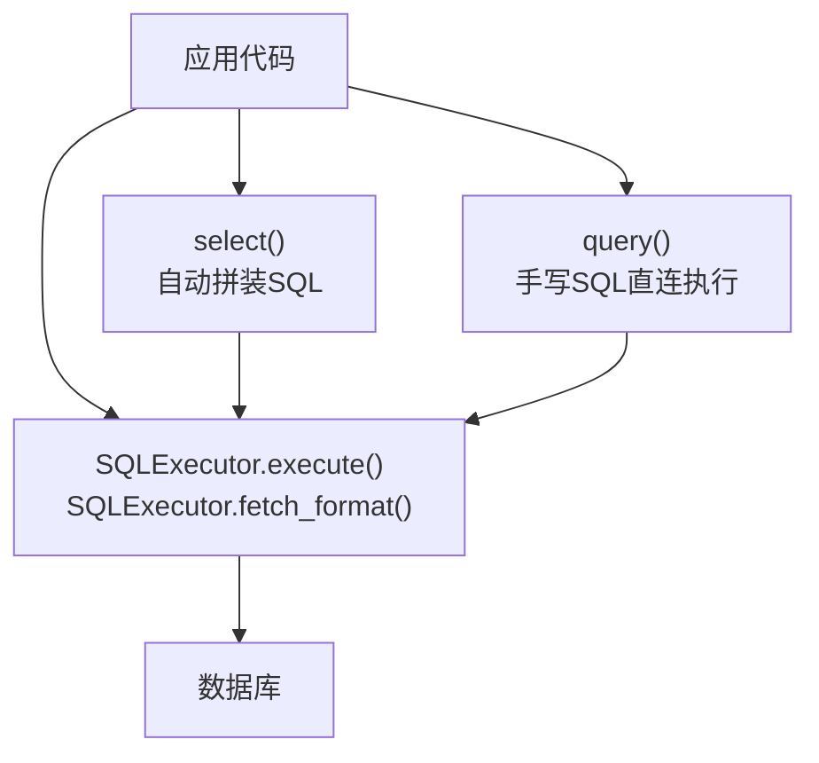
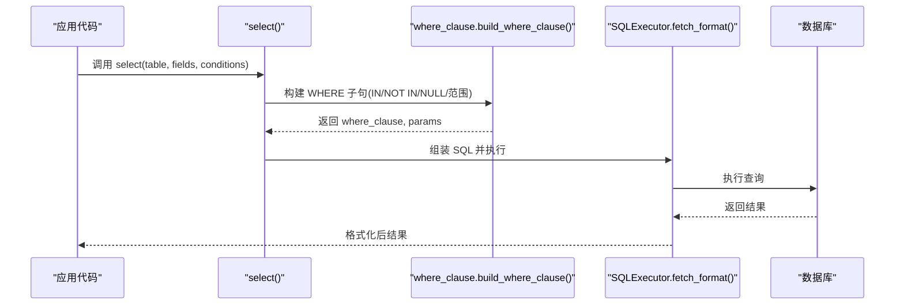
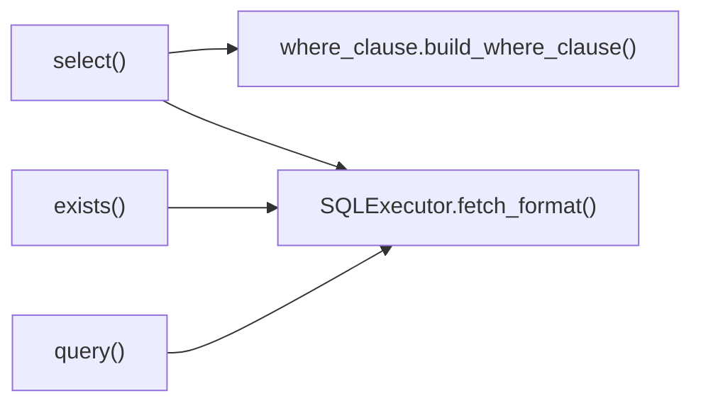

# 子查询支持

<cite>
**本文引用的文件**
- [lazy_mysql/__init__.py](file://lazy_mysql/__init__.py)
- [lazy_mysql/utils/select.py](file://lazy_mysql/utils/select.py)
- [lazy_mysql/utils/exists.py](file://lazy_mysql/utils/exists.py)
- [lazy_mysql/tools/where_clause.py](file://lazy_mysql/tools/where_clause.py)
- [lazy_mysql/tools/sql_utils.py](file://lazy_mysql/tools/sql_utils.py)
- [lazy_mysql/executor.py](file://lazy_mysql/executor.py)
- [docs/SELECT.md](file://docs/SELECT.md)
- [docs/QUERY.md](file://docs/QUERY.md)
- [docs/CONDITIONS.md](file://docs/CONDITIONS.md)
</cite>

## 目录
1. [简介](#简介)
2. [项目结构](#项目结构)
3. [核心组件](#核心组件)
4. [架构总览](#架构总览)
5. [详细组件分析](#详细组件分析)
6. [依赖分析](#依赖分析)
7. [性能考量](#性能考量)
8. [故障排查指南](#故障排查指南)
9. [结论](#结论)
10. [附录](#附录)

## 简介
本文件系统性阐述 lazy_mysql 在“子查询”方面的构建能力与使用方法，重点覆盖：
- 相关子查询与非相关子查询的实现路径
- EXISTS、NOT EXISTS、IN、NOT IN 等操作符的使用
- 子查询的嵌套层级限制与性能注意事项
- 子查询与连接查询（JOIN）的对比与选型建议
- 实战场景与示例路径，帮助在复杂查询中高效落地

## 项目结构
lazy_mysql 提供两类执行路径：
- 结构化查询：select() 自动拼装 SQL，适合常规场景
- 自定义 SQL：query() 直接执行手写 SQL，适合复杂场景（如子查询、UNION、窗口函数）

图表来源
- [lazy_mysql/utils/select.py:1-237](file://lazy_mysql/utils/select.py#L1-L237)
- [lazy_mysql/executor.py:125-200](file://lazy_mysql/executor.py#L125-L200)
- [docs/QUERY.md:133-154](file://docs/QUERY.md#L133-L154)

章节来源
- [lazy_mysql/__init__.py:1-21](file://lazy_mysql/__init__.py#L1-L21)
- [docs/SELECT.md:157-159](file://docs/SELECT.md#L157-L159)
- [docs/QUERY.md:1-209](file://docs/QUERY.md#L1-L209)

## 核心组件
- select()：面向 ORM 风格的结构化查询，支持 WHERE 条件、JOIN、排序、限制等；其 WHERE 条件由 where_clause 工具构建，IN/NOT IN 等操作符完全受支持。
- exists()：快速存在性检查，内部使用 SELECT 1 ... LIMIT 1，性能优于 select() + 判断。
- query()：手写 SQL 执行器，天然支持子查询、UNION、窗口函数等复杂语法。
- where_clause.build_where_clause()：统一构建 WHERE 子句，支持 IN/NOT IN、NULL/NOT NULL、范围比较、NDayInterval 等。
- sql_utils.add_limit()：辅助构建条件片段，支持 IN/NOT IN（注意：该工具主要用于“附加限制”，并非直接用于子查询主体）。

章节来源
- [lazy_mysql/utils/select.py:4-156](file://lazy_mysql/utils/select.py#L4-L156)
- [lazy_mysql/utils/select.py:159-237](file://lazy_mysql/utils/select.py#L159-L237)
- [lazy_mysql/tools/where_clause.py:42-127](file://lazy_mysql/tools/where_clause.py#L42-L127)
- [lazy_mysql/tools/sql_utils.py:9-53](file://lazy_mysql/tools/sql_utils.py#L9-L53)
- [docs/QUERY.md:133-154](file://docs/QUERY.md#L133-L154)

## 架构总览
子查询在 lazy_mysql 中的两条主要路径：
- 结构化路径：通过 select() 的 conditions 参数间接使用 IN/NOT IN 等操作符，从而在主查询中形成“非相关子查询”的效果（将子查询结果作为 IN 列表）。
- 自定义路径：通过 query() 直接书写子查询，实现相关/非相关子查询的完整形态。

图表来源
- [lazy_mysql/utils/select.py:114-156](file://lazy_mysql/utils/select.py#L114-L156)
- [lazy_mysql/tools/where_clause.py:42-127](file://lazy_mysql/tools/where_clause.py#L42-L127)
- [lazy_mysql/executor.py:187-200](file://lazy_mysql/executor.py#L187-L200)

## 详细组件分析

### 相关子查询与非相关子查询的实现
- 非相关子查询（推荐在 select() 中实现）：
  - 使用 IN/NOT IN 操作符，将子查询结果作为列表传入 conditions，即可在主查询中形成“非相关子查询”的效果。where_clause 工具会正确生成 IN/NOT IN 的占位符并注入参数，避免 SQL 注入。
  - 示例路径：[docs/SELECT.md:285-286](file://docs/SELECT.md#L285-L286)，[docs/CONDITIONS.md:51-52](file://docs/CONDITIONS.md#L51-L52)

- 相关子查询（推荐在 query() 中实现）：
  - 直接在 SQL 中书写子查询（如 EXISTS/NOT EXISTS、子查询表表达式），query() 支持任意复杂 SQL，天然适配相关/非相关子查询。
  - 示例路径：[docs/QUERY.md:133-154](file://docs/QUERY.md#L133-L154)

章节来源
- [lazy_mysql/tools/where_clause.py:98-108](file://lazy_mysql/tools/where_clause.py#L98-L108)
- [docs/CONDITIONS.md:36-53](file://docs/CONDITIONS.md#L36-L53)
- [docs/QUERY.md:133-154](file://docs/QUERY.md#L133-L154)

### EXISTS 与 NOT EXISTS 的使用
- exists() 方法基于 SELECT 1 ... LIMIT 1，性能优于 select() + 判断，适合“存在性”判定。
- 在 query() 中可直接使用 EXISTS/NOT EXISTS 子查询，灵活处理相关/非相关场景。
- 示例路径：
  - exists()：[docs/SELECT.md:161-247](file://docs/SELECT.md#L161-L247)
  - EXISTS 子查询：[docs/QUERY.md:133-154](file://docs/QUERY.md#L133-L154)

章节来源
- [lazy_mysql/utils/select.py:159-237](file://lazy_mysql/utils/select.py#L159-L237)
- [docs/SELECT.md:161-247](file://docs/SELECT.md#L161-L247)
- [docs/QUERY.md:133-154](file://docs/QUERY.md#L133-L154)

### IN 与 NOT IN 的实现细节
- where_clause.build_where_clause() 对 IN/NOT IN 的处理：
  - 校验列表/元组中的每个元素，统一参数化占位符，注入参数列表，确保安全与性能。
- sql_utils.add_limit() 也可用于 IN/NOT IN 条件片段，但主要用于“附加限制”，并非直接承载子查询主体。
- 示例路径：
  - IN/NOT IN 构建：[lazy_mysql/tools/where_clause.py:98-108](file://lazy_mysql/tools/where_clause.py#L98-L108)
  - add_limit() 用法：[lazy_mysql/tools/sql_utils.py:21-29](file://lazy_mysql/tools/sql_utils.py#L21-L29)

章节来源
- [lazy_mysql/tools/where_clause.py:98-108](file://lazy_mysql/tools/where_clause.py#L98-L108)
- [lazy_mysql/tools/sql_utils.py:21-29](file://lazy_mysql/tools/sql_utils.py#L21-L29)

### 子查询嵌套层级限制与性能考虑
- 嵌套层级限制
  - MySQL 对子查询嵌套深度有限制，建议不超过 6~10 层，具体以数据库版本为准。在 lazy_mysql 中，可通过 query() 直接控制 SQL 嵌套，便于精细管理。
- 性能要点
  - EXISTS/NOT EXISTS 优先：存在性判断使用 exists() 或 EXISTS 子查询，避免全表扫描。
  - IN/NOT IN 列表规模：IN 列表过大可能影响性能，建议拆分为临时表或使用 JOIN。
  - 索引与谓词下推：确保子查询中的过滤字段有索引，提升相关子查询性能。
  - LIMIT 优化：在子查询中尽早限制结果集，减少主查询压力。
- 示例路径：
  - EXISTS 优化：[docs/SELECT.md:185-189](file://docs/SELECT.md#L185-L189)
  - IN/NOT IN 说明：[docs/CONDITIONS.md:51-52](file://docs/CONDITIONS.md#L51-L52)

章节来源
- [docs/SELECT.md:185-189](file://docs/SELECT.md#L185-L189)
- [docs/CONDITIONS.md:51-52](file://docs/CONDITIONS.md#L51-L52)

### 子查询与连接查询（JOIN）的对比与选型
- 何时选子查询
  - 存在性判断（EXISTS/NOT EXISTS）
  - 需要“先计算再过滤”的复杂聚合或分组
  - 子查询结果作为 IN 列表参与主查询
- 何时选 JOIN
  - 两表或多表关联频繁、可复用的维度
  - 需要大量字段投影与排序
  - 性能优先且具备良好索引
- 示例路径：
  - 子查询示例：[docs/QUERY.md:133-154](file://docs/QUERY.md#L133-L154)
  - JOIN 示例：[docs/SELECT.md:372-409](file://docs/SELECT.md#L372-L409)

章节来源
- [docs/QUERY.md:133-154](file://docs/QUERY.md#L133-L154)
- [docs/SELECT.md:372-409](file://docs/SELECT.md#L372-L409)

### 实际应用场景与示例路径
- 场景一：查询“最近7天内有订单的用户”
  - 使用 EXISTS 子查询或 exists() 方法均可，前者适合复杂 SQL，后者适合快速存在性判断。
  - 示例路径：[docs/SELECT.md:207-221](file://docs/SELECT.md#L207-L221)
- 场景二：查询“订单金额超过某阈值的用户”
  - 使用子查询表表达式（在 query() 中）或在 select() 中使用 IN 列表（将子查询结果作为 IN 列表）。
  - 示例路径：[docs/QUERY.md:133-154](file://docs/QUERY.md#L133-L154)
- 场景三：查询“不在黑名单中的用户”
  - 使用 NOT EXISTS 或 NOT IN（IN 列表来自黑名单子查询）。
  - 示例路径：[docs/CONDITIONS.md:51-52](file://docs/CONDITIONS.md#L51-L52)

章节来源
- [docs/SELECT.md:207-221](file://docs/SELECT.md#L207-L221)
- [docs/QUERY.md:133-154](file://docs/QUERY.md#L133-L154)
- [docs/CONDITIONS.md:51-52](file://docs/CONDITIONS.md#L51-L52)

## 依赖分析
- select() 依赖 where_clause.build_where_clause() 生成 WHERE 子句，支持 IN/NOT IN 等操作符。
- query() 直接依赖 SQLExecutor.execute()/fetch_format() 执行与格式化。
- exists() 基于 select() 的存在性优化实现。

图表来源
- [lazy_mysql/utils/select.py:114-156](file://lazy_mysql/utils/select.py#L114-L156)
- [lazy_mysql/tools/where_clause.py:42-127](file://lazy_mysql/tools/where_clause.py#L42-L127)
- [lazy_mysql/executor.py:187-200](file://lazy_mysql/executor.py#L187-L200)

章节来源
- [lazy_mysql/utils/select.py:114-156](file://lazy_mysql/utils/select.py#L114-L156)
- [lazy_mysql/tools/where_clause.py:42-127](file://lazy_mysql/tools/where_clause.py#L42-L127)
- [lazy_mysql/executor.py:187-200](file://lazy_mysql/executor.py#L187-L200)

## 性能考量
- 存在性判断优先使用 EXISTS 或 exists()，避免全表扫描。
- IN/NOT IN 列表过大时，考虑使用临时表或 JOIN 替代。
- 子查询中尽量提前过滤与限制，减少中间结果集。
- 为子查询涉及的过滤字段建立索引，提升相关子查询性能。
- 使用 LIMIT 优化子查询结果规模。

章节来源
- [docs/SELECT.md:185-189](file://docs/SELECT.md#L185-L189)
- [docs/CONDITIONS.md:51-52](file://docs/CONDITIONS.md#L51-L52)

## 故障排查指南
- WHERE 条件构造错误
  - 检查 conditions 格式是否符合规范（字典键值、元组格式、字符串 'NULL'/'NOT NULL'）。
  - 参考路径：[docs/CONDITIONS.md:21-34](file://docs/CONDITIONS.md#L21-L34)
- IN/NOT IN 注入风险
  - where_clause 已内置参数化处理，确保安全；sql_utils.add_limit() 不建议直接用于子查询主体。
  - 参考路径：[lazy_mysql/tools/where_clause.py:98-108](file://lazy_mysql/tools/where_clause.py#L98-L108)
- 子查询性能问题
  - 检查是否缺少索引、是否过深嵌套、是否可替换为 JOIN。
  - 参考路径：[docs/QUERY.md:133-154](file://docs/QUERY.md#L133-L154)
- 连接与回滚异常
  - SQLExecutor 内置错误处理与重连机制，必要时查看日志定位。
  - 参考路径：[lazy_mysql/executor.py:62-106](file://lazy_mysql/executor.py#L62-L106)

章节来源
- [docs/CONDITIONS.md:21-34](file://docs/CONDITIONS.md#L21-L34)
- [lazy_mysql/tools/where_clause.py:98-108](file://lazy_mysql/tools/where_clause.py#L98-L108)
- [docs/QUERY.md:133-154](file://docs/QUERY.md#L133-L154)
- [lazy_mysql/executor.py:62-106](file://lazy_mysql/executor.py#L62-L106)

## 结论
- lazy_mysql 在“子查询”方面提供两条互补路径：select() 通过 IN/NOT IN/NULL 等操作符实现“非相关子查询”的效果；query() 直接支持复杂 SQL，天然适配相关/非相关子查询。
- 性能上，优先使用 EXISTS/NOT EXISTS 进行存在性判断；IN 列表过大时考虑 JOIN 或临时表；为子查询过滤字段建立索引。
- 选型建议：简单存在性与 IN 列表优先 select()；复杂子查询、UNION、窗口函数优先 query()。

## 附录
- 相关文档与示例路径
  - 结构化查询与 WHERE 条件：[docs/SELECT.md](file://docs/SELECT.md)
  - 自定义 SQL 与子查询：[docs/QUERY.md](file://docs/QUERY.md)
  - WHERE 条件构造指南：[docs/CONDITIONS.md](file://docs/CONDITIONS.md)
  - 执行器与结果格式化：[lazy_mysql/executor.py](file://lazy_mysql/executor.py)