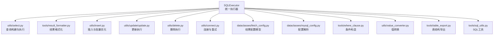
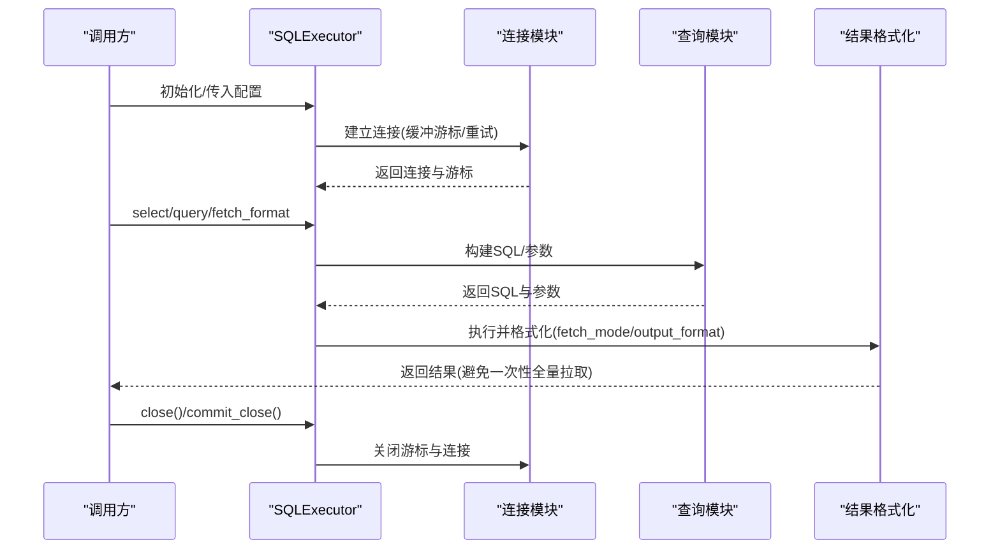
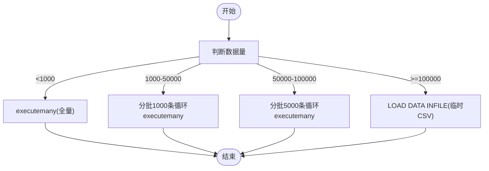
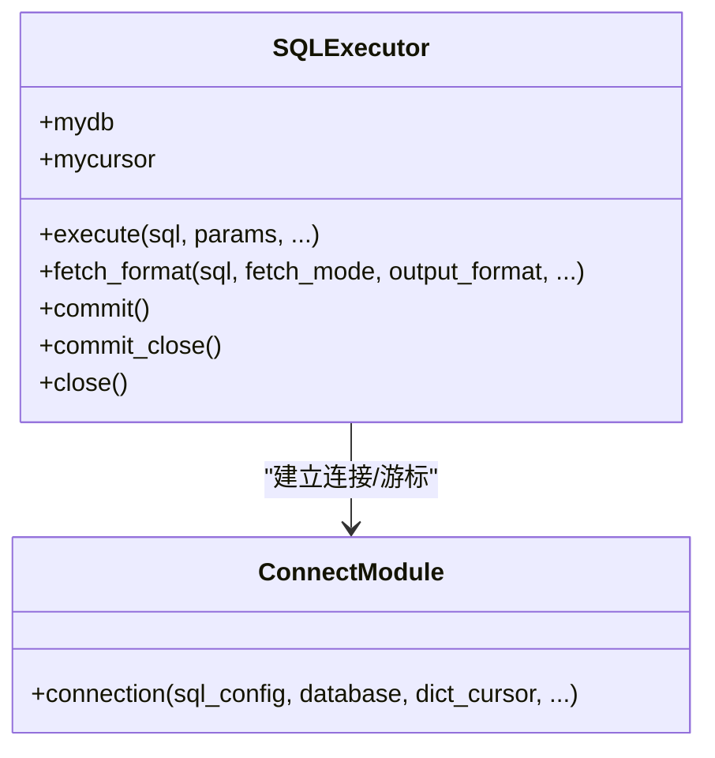
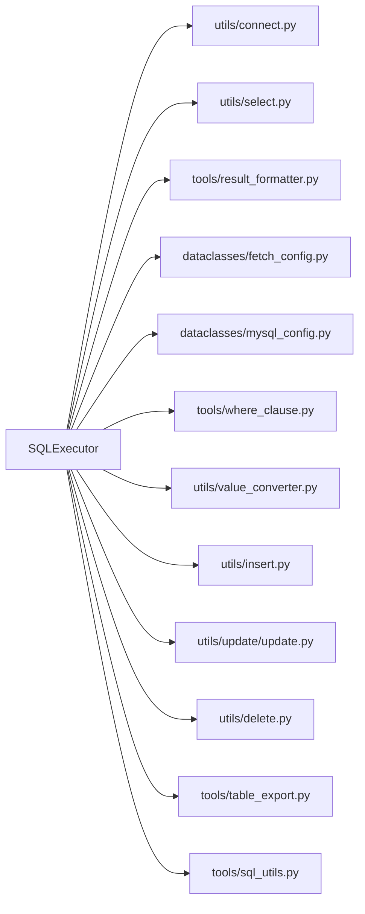

# 内存管理策略

<cite>
**本文引用的文件**
- [lazy_mysql/__init__.py](file://lazy_mysql/__init__.py)
- [lazy_mysql/executor.py](file://lazy_mysql/executor.py)
- [lazy_mysql/dataclasses/fetch_config.py](file://lazy_mysql/dataclasses/fetch_config.py)
- [lazy_mysql/utils/select.py](file://lazy_mysql/utils/select.py)
- [lazy_mysql/tools/result_formatter.py](file://lazy_mysql/tools/result_formatter.py)
- [lazy_mysql/utils/connect.py](file://lazy_mysql/utils/connect.py)
- [lazy_mysql/dataclasses/mysql_config.py](file://lazy_mysql/dataclasses/mysql_config.py)
- [lazy_mysql/utils/insert.py](file://lazy_mysql/utils/insert.py)
- [lazy_mysql/utils/update/update.py](file://lazy_mysql/utils/update/update.py)
- [lazy_mysql/utils/delete.py](file://lazy_mysql/utils/delete.py)
- [lazy_mysql/tools/table_export.py](file://lazy_mysql/tools/table_export.py)
- [lazy_mysql/tools/sql_utils.py](file://lazy_mysql/tools/sql_utils.py)
- [lazy_mysql/utils/value_converter.py](file://lazy_mysql/utils/value_converter.py)
- [lazy_mysql/tools/where_clause.py](file://lazy_mysql/tools/where_clause.py)
- [docs/FETCH_CONFIG.md](file://docs/FETCH_CONFIG.md)
- [docs/CONNECTION.md](file://docs/CONNECTION.md)
- [README.md](file://README.md)
</cite>

## 目录
1. [简介](#简介)
2. [项目结构](#项目结构)
3. [核心组件](#核心组件)
4. [架构总览](#架构总览)
5. [详细组件分析](#详细组件分析)
6. [依赖分析](#依赖分析)
7. [性能考量](#性能考量)
8. [故障排查指南](#故障排查指南)
9. [结论](#结论)
10. [附录](#附录)

## 简介
本文件聚焦于 lazy_mysql 在大数据量场景下的内存管理策略与优化技术，围绕“分批处理”“流式处理”“增量加载”“结果集处理优化”“内存监控与控制”等方面展开，结合代码实现与文档说明，给出不同数据规模下的最佳实践与性能建议。

## 项目结构
lazy_mysql 采用模块化设计，围绕 SQLExecutor 统一入口，配合 dataclasses、tools、utils 等子模块实现连接、查询、插入、更新、删除、结果格式化等功能。内存优化主要体现在：
- 连接层：缓冲游标与重试机制，避免频繁网络往返与资源泄露
- 查询层：FetchConfig 控制结果返回形态，避免一次性拉取全量数据
- 插入层：分批 executemany 与 LOAD DATA INFILE，显著降低内存峰值
- 工具层：类型转换与参数校验，减少中间层数据拷贝与异常



图表来源
- [lazy_mysql/executor.py:14-616](file://lazy_mysql/executor.py#L14-L616)
- [lazy_mysql/utils/select.py:1-237](file://lazy_mysql/utils/select.py#L1-L237)
- [lazy_mysql/tools/result_formatter.py:1-77](file://lazy_mysql/tools/result_formatter.py#L1-L77)
- [lazy_mysql/utils/insert.py:1-287](file://lazy_mysql/utils/insert.py#L1-L287)
- [lazy_mysql/utils/update/update.py:1-44](file://lazy_mysql/utils/update/update.py#L1-L44)
- [lazy_mysql/utils/delete.py:1-26](file://lazy_mysql/utils/delete.py#L1-L26)
- [lazy_mysql/utils/connect.py:1-91](file://lazy_mysql/utils/connect.py#L1-L91)
- [lazy_mysql/dataclasses/fetch_config.py:1-24](file://lazy_mysql/dataclasses/fetch_config.py#L1-L24)
- [lazy_mysql/dataclasses/mysql_config.py:1-135](file://lazy_mysql/dataclasses/mysql_config.py#L1-L135)
- [lazy_mysql/tools/where_clause.py:1-127](file://lazy_mysql/tools/where_clause.py#L1-L127)
- [lazy_mysql/utils/value_converter.py:1-115](file://lazy_mysql/utils/value_converter.py#L1-L115)
- [lazy_mysql/tools/table_export.py:1-190](file://lazy_mysql/tools/table_export.py#L1-L190)
- [lazy_mysql/tools/sql_utils.py:1-53](file://lazy_mysql/tools/sql_utils.py#L1-L53)

章节来源
- [lazy_mysql/executor.py:14-616](file://lazy_mysql/executor.py#L14-L616)
- [lazy_mysql/__init__.py:1-21](file://lazy_mysql/__init__.py#L1-L21)

## 核心组件
- SQLExecutor：统一的数据库操作入口，封装连接、执行、格式化、错误重试、关闭等能力
- FetchConfig：控制查询结果的 fetch_mode、output_format、data_label、show_count
- 连接模块：提供带重试的连接建立，使用缓冲游标避免“未读结果”问题
- 查询模块：select 构建 SQL 并委托执行器格式化结果
- 结果格式化：支持 all/oneTuple/one 三种模式，以及 list_1、df、df_dict、dict 等输出格式
- 插入模块：根据数据量自动选择策略，包含分批 executemany 与 LOAD DATA INFILE
- 工具模块：where_clause 条件构造、value_converter 值转换、sql_utils 辅助函数

章节来源
- [lazy_mysql/executor.py:14-616](file://lazy_mysql/executor.py#L14-L616)
- [lazy_mysql/dataclasses/fetch_config.py:8-24](file://lazy_mysql/dataclasses/fetch_config.py#L8-L24)
- [lazy_mysql/utils/select.py:4-156](file://lazy_mysql/utils/select.py#L4-L156)
- [lazy_mysql/tools/result_formatter.py:3-77](file://lazy_mysql/tools/result_formatter.py#L3-L77)
- [lazy_mysql/utils/insert.py:7-287](file://lazy_mysql/utils/insert.py#L7-L287)
- [lazy_mysql/utils/connect.py:16-91](file://lazy_mysql/utils/connect.py#L16-L91)
- [lazy_mysql/tools/where_clause.py:42-127](file://lazy_mysql/tools/where_clause.py#L42-L127)
- [lazy_mysql/utils/value_converter.py:74-115](file://lazy_mysql/utils/value_converter.py#L74-L115)

## 架构总览
下面的序列图展示了一次典型查询的内存相关流程：连接建立、SQL 构建、执行、结果格式化与关闭。



图表来源
- [lazy_mysql/executor.py:20-616](file://lazy_mysql/executor.py#L20-L616)
- [lazy_mysql/utils/connect.py:16-91](file://lazy_mysql/utils/connect.py#L16-L91)
- [lazy_mysql/utils/select.py:4-156](file://lazy_mysql/utils/select.py#L4-L156)
- [lazy_mysql/tools/result_formatter.py:3-77](file://lazy_mysql/tools/result_formatter.py#L3-L77)

## 详细组件分析

### 分批处理与内存优化（插入）
- 小数据量（<1000）：直接使用 executemany，适合少量数据的批量写入
- 中等数据量（1000-50000）：分批大小 1000，降低单次内存峰值
- 大数据量（50000-100000）：分批大小 5000，进一步控制内存占用
- 超大数据量（≥100000）：使用 LOAD DATA INFILE，将数据写入临时 CSV，再通过 SQL 加载，内存占用极低，支持流式处理



图表来源
- [lazy_mysql/utils/insert.py:46-67](file://lazy_mysql/utils/insert.py#L46-L67)
- [lazy_mysql/utils/insert.py:247-287](file://lazy_mysql/utils/insert.py#L247-L287)
- [lazy_mysql/utils/insert.py:162-244](file://lazy_mysql/utils/insert.py#L162-L244)

章节来源
- [lazy_mysql/utils/insert.py:7-287](file://lazy_mysql/utils/insert.py#L7-L287)

### 查询与结果集处理优化
- FetchConfig 控制返回形态：all/oneTuple/one；output_format 支持 list_1、df、df_dict、dict
- 当 output_format 为 df 或 df_dict 时，需要 data_label，避免列名不匹配
- show_count 可返回 (数据, 数量)，便于上层统计
- result_formatter 使用 fetchall 一次性拉取全量数据，适合小/中数据量；对于超大数据量，建议改用分页/流式/增量策略（见后续“大数据量策略”）

```mermaid
flowchart TD
QStart(["查询入口"]) --> BuildSQL["构建SQL/参数"]
BuildSQL --> Exec["执行SQL"]
Exec --> Mode{"fetch_mode"}
Mode --> |all| AllPath["fetchall获取全量"]
Mode --> |oneTuple| OneTuple["fetchone获取单条"]
Mode --> |one| OneVal["fetchone并取首列"]
AllPath --> OutFmt{"output_format"}
OutFmt --> |""| RawList["元组列表"]
OutFmt --> |"list_1"| FlatList["提取首列"]
OutFmt --> |"df"| ToDF["转DataFrame"]
OutFmt --> |"df_dict"| ToDFDict["DataFrame转字典列表"]
OutFmt --> |"dict"| TupleToDict["元组转字典"]
OneTuple --> DictCheck{"output_format==dict且data_label有效?"}
DictCheck --> |是| TupleToDict
DictCheck --> |否| OneTupleRet["返回元组"]
OneVal --> OneRet["返回单值"]
ToDF --> EndQ(["结束"])
ToDFDict --> EndQ
RawList --> EndQ
FlatList --> EndQ
TupleToDict --> EndQ
OneTupleRet --> EndQ
OneRet --> EndQ
```

图表来源
- [lazy_mysql/tools/result_formatter.py:3-77](file://lazy_mysql/tools/result_formatter.py#L3-L77)
- [lazy_mysql/dataclasses/fetch_config.py:8-24](file://lazy_mysql/dataclasses/fetch_config.py#L8-L24)
- [lazy_mysql/utils/select.py:4-156](file://lazy_mysql/utils/select.py#L4-L156)

章节来源
- [lazy_mysql/tools/result_formatter.py:3-77](file://lazy_mysql/tools/result_formatter.py#L3-L77)
- [lazy_mysql/dataclasses/fetch_config.py:8-24](file://lazy_mysql/dataclasses/fetch_config.py#L8-L24)
- [lazy_mysql/utils/select.py:4-156](file://lazy_mysql/utils/select.py#L4-L156)
- [docs/FETCH_CONFIG.md:1-223](file://docs/FETCH_CONFIG.md#L1-L223)

### 连接与游标缓冲
- 连接模块使用 buffered=True 与 use_pure=True，避免“未读结果”问题，提升兼容性
- 游标同样设置 buffered=True，确保 fetchall/fetchone 的一致性
- 提供重试机制与版本检查，增强稳定性



图表来源
- [lazy_mysql/executor.py:20-616](file://lazy_mysql/executor.py#L20-L616)
- [lazy_mysql/utils/connect.py:16-91](file://lazy_mysql/utils/connect.py#L16-L91)

章节来源
- [lazy_mysql/utils/connect.py:16-91](file://lazy_mysql/utils/connect.py#L16-L91)
- [docs/CONNECTION.md:1-334](file://docs/CONNECTION.md#L1-L334)

### 条件构造与参数校验（防注入与类型安全）
- where_clause 支持简单值、元组格式、IN/NOT IN、NULL/NOT NULL、NDayInterval 等
- 对 numpy 类型与 dict 自动校验/转换，避免写入异常
- 严格参数化，防止 SQL 注入

章节来源
- [lazy_mysql/tools/where_clause.py:42-127](file://lazy_mysql/tools/where_clause.py#L42-L127)
- [lazy_mysql/utils/value_converter.py:74-115](file://lazy_mysql/utils/value_converter.py#L74-L115)

### 表结构导出（辅助内存规划）
- table_export 支持单表/批量导出，内部使用 fetchall 获取结构信息
- 适合离线分析与索引/字符集规划，间接辅助内存优化决策

章节来源
- [lazy_mysql/tools/table_export.py:12-190](file://lazy_mysql/tools/table_export.py#L12-L190)

## 依赖分析
- 组件耦合：SQLExecutor 是核心入口，依赖连接模块、查询模块、结果格式化模块
- 外部依赖：mysql-connector-python（连接）、pandas（DataFrame 输出）
- 配置解耦：MySQLConfig 与 FetchConfig 作为数据传输对象，降低耦合



图表来源
- [lazy_mysql/executor.py:1-616](file://lazy_mysql/executor.py#L1-L616)
- [lazy_mysql/utils/connect.py:1-91](file://lazy_mysql/utils/connect.py#L1-L91)
- [lazy_mysql/utils/select.py:1-237](file://lazy_mysql/utils/select.py#L1-L237)
- [lazy_mysql/tools/result_formatter.py:1-77](file://lazy_mysql/tools/result_formatter.py#L1-L77)
- [lazy_mysql/dataclasses/fetch_config.py:1-24](file://lazy_mysql/dataclasses/fetch_config.py#L1-L24)
- [lazy_mysql/dataclasses/mysql_config.py:1-135](file://lazy_mysql/dataclasses/mysql_config.py#L1-L135)
- [lazy_mysql/tools/where_clause.py:1-127](file://lazy_mysql/tools/where_clause.py#L1-L127)
- [lazy_mysql/utils/value_converter.py:1-115](file://lazy_mysql/utils/value_converter.py#L1-L115)
- [lazy_mysql/utils/insert.py:1-287](file://lazy_mysql/utils/insert.py#L1-L287)
- [lazy_mysql/utils/update/update.py:1-44](file://lazy_mysql/utils/update/update.py#L1-L44)
- [lazy_mysql/utils/delete.py:1-26](file://lazy_mysql/utils/delete.py#L1-L26)
- [lazy_mysql/tools/table_export.py:1-190](file://lazy_mysql/tools/table_export.py#L1-L190)
- [lazy_mysql/tools/sql_utils.py:1-53](file://lazy_mysql/tools/sql_utils.py#L1-L53)

## 性能考量
- 连接层：缓冲游标与重试机制减少网络往返与异常恢复成本
- 查询层：合理使用 FetchConfig，避免一次性全量拉取
- 插入层：根据数据量选择分批 executemany 或 LOAD DATA INFILE
- 结果层：DataFrame 输出适合中等规模，超大规模建议分页/流式/增量

## 故障排查指南
- 连接失败与重试：自动捕获超时与接口错误，进行指数退避重试
- 未读结果：使用 buffered=True 避免多次查询时的游标状态异常
- 关闭与清理：提供 close 与 __del__ 双重兜底，降低资源泄露风险
- 常见错误提示：包含“无结果集可获取”的提示，指导检查游标状态

章节来源
- [lazy_mysql/executor.py:62-107](file://lazy_mysql/executor.py#L62-L107)
- [lazy_mysql/utils/connect.py:46-67](file://lazy_mysql/utils/connect.py#L46-L67)
- [docs/CONNECTION.md:180-228](file://docs/CONNECTION.md#L180-L228)

## 结论
lazy_mysql 在内存管理方面通过“连接缓冲、分批处理、结果格式化控制、LOAD DATA INFILE 流式写入”等手段，有效降低了大数据量场景下的内存峰值与 GC 压力。配合 FetchConfig 的灵活输出与 where_clause 的安全参数化，既提升了开发效率，又保障了运行时稳定性。

## 附录

### 不同数据规模下的内存优化策略
- 小数据量（<1000）
  - 插入：直接 executemany，简单高效
  - 查询：使用 fetch_mode="all" + output_format="df_dict"，一次性返回
- 中等数据量（1000-100000）
  - 插入：分批 executemany（1000/5000），降低单次内存峰值
  - 查询：优先使用 fetch_mode="oneTuple" 或 "one"，必要时使用 "list_1" 提取首列
- 大数据量（≥100000）
  - 插入：LOAD DATA INFILE，内存占用极低，支持流式处理
  - 查询：采用分页/增量策略（LIMIT/OFFSET 或时间窗口），避免一次性全量拉取；若需 DataFrame，建议分批聚合

章节来源
- [lazy_mysql/utils/insert.py:46-67](file://lazy_mysql/utils/insert.py#L46-L67)
- [lazy_mysql/utils/insert.py:247-287](file://lazy_mysql/utils/insert.py#L247-L287)
- [lazy_mysql/utils/insert.py:162-244](file://lazy_mysql/utils/insert.py#L162-L244)
- [lazy_mysql/tools/result_formatter.py:35-77](file://lazy_mysql/tools/result_formatter.py#L35-L77)
- [docs/FETCH_CONFIG.md:1-223](file://docs/FETCH_CONFIG.md#L1-L223)