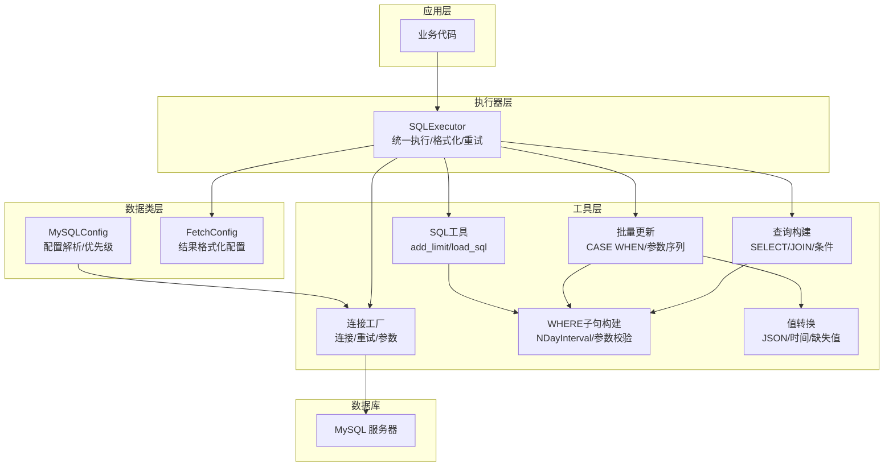
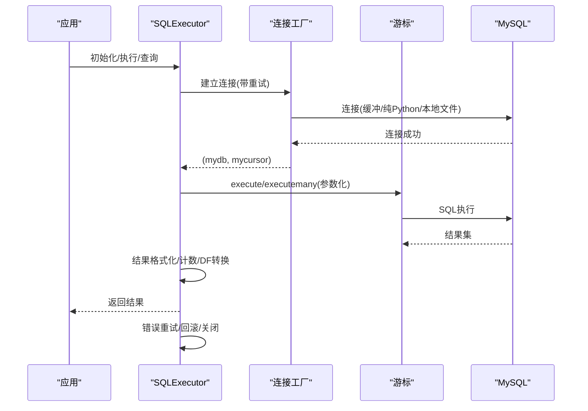
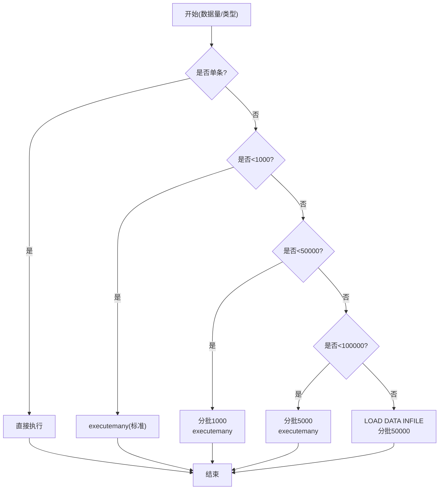
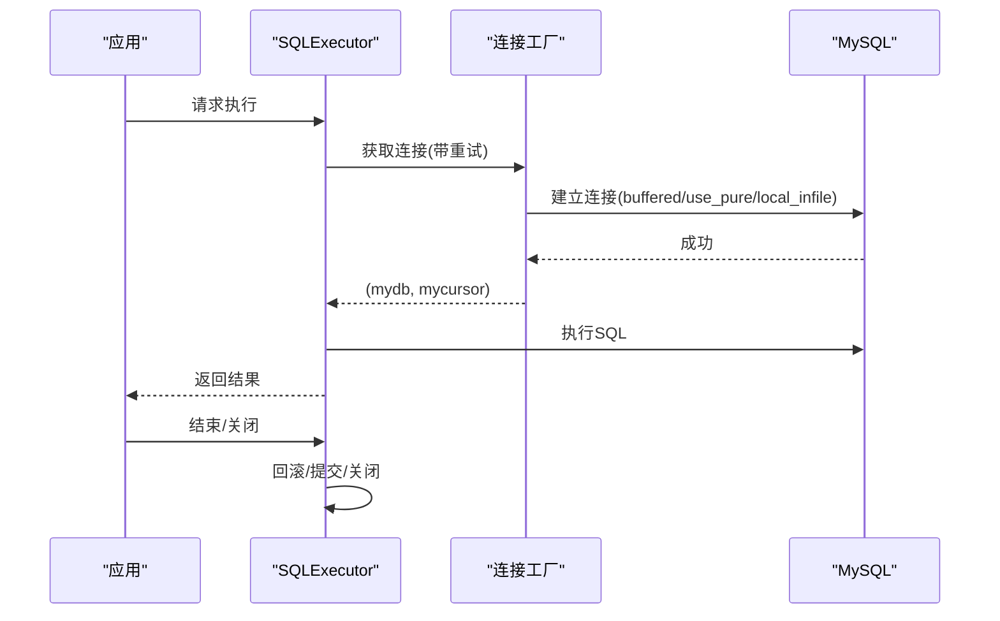
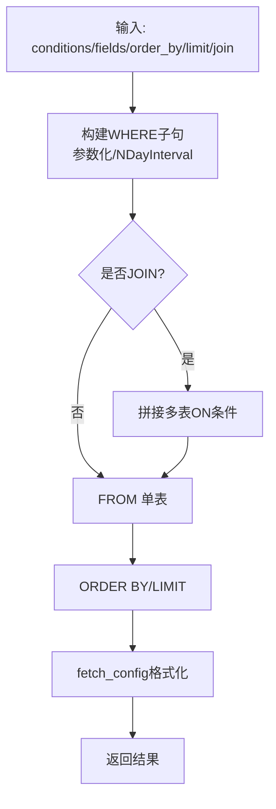
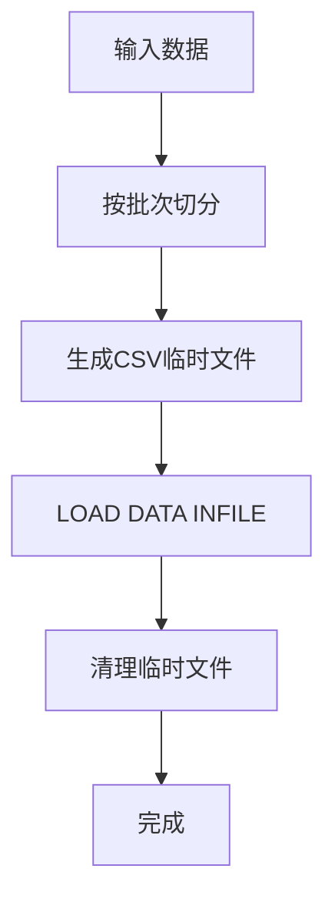
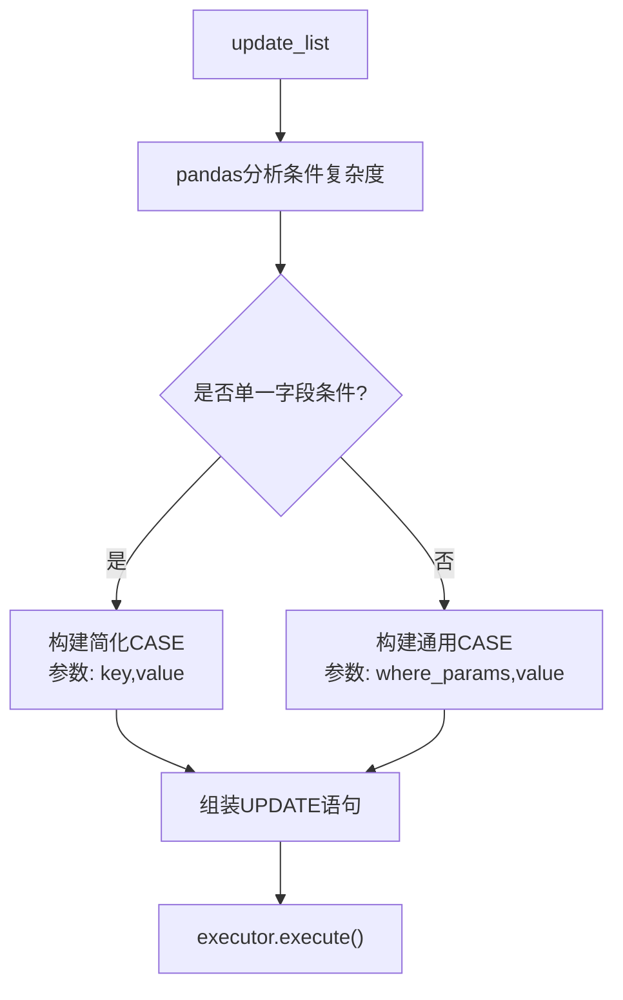
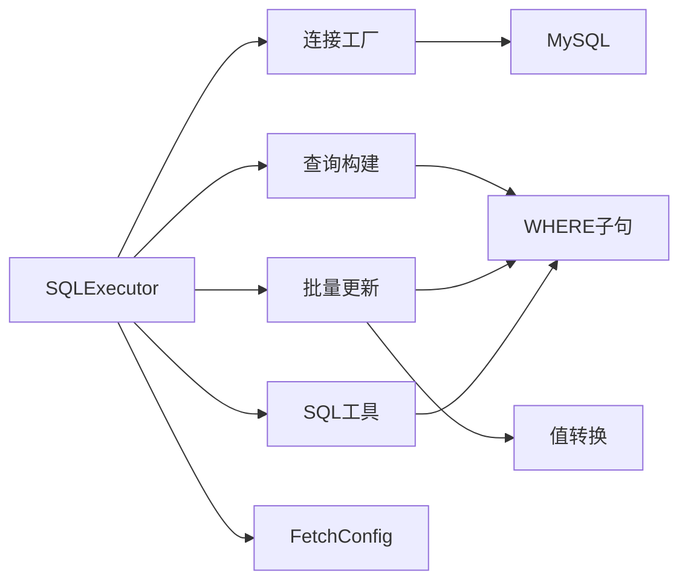

# 性能优化

<cite>
**本文引用的文件**
- [lazy_mysql/__init__.py](file://lazy_mysql/__init__.py)
- [lazy_mysql/executor.py](file://lazy_mysql/executor.py)
- [lazy_mysql/utils/connect.py](file://lazy_mysql/utils/connect.py)
- [lazy_mysql/dataclasses/mysql_config.py](file://lazy_mysql/dataclasses/mysql_config.py)
- [lazy_mysql/dataclasses/fetch_config.py](file://lazy_mysql/dataclasses/fetch_config.py)
- [lazy_mysql/utils/select.py](file://lazy_mysql/utils/select.py)
- [lazy_mysql/utils/update/batch_update.py](file://lazy_mysql/utils/update/batch_update.py)
- [lazy_mysql/tools/where_clause.py](file://lazy_mysql/tools/where_clause.py)
- [lazy_mysql/tools/sql_utils.py](file://lazy_mysql/tools/sql_utils.py)
- [lazy_mysql/utils/value_converter.py](file://lazy_mysql/utils/value_converter.py)
- [docs/CONNECTION.md](file://docs/CONNECTION.md)
- [docs/INSERT.md](file://docs/INSERT.md)
- [docs/QUERY.md](file://docs/QUERY.md)
- [docs/SQL_UTILS.md](file://docs/SQL_UTILS.md)
- [README.md](file://README.md)
</cite>

## 目录
1. [简介](#简介)
2. [项目结构](#项目结构)
3. [核心组件](#核心组件)
4. [架构总览](#架构总览)
5. [详细组件分析](#详细组件分析)
6. [依赖分析](#依赖分析)
7. [性能考量](#性能考量)
8. [故障排查指南](#故障排查指南)
9. [结论](#结论)
10. [附录](#附录)

## 简介
本文件面向使用者与开发者，系统性梳理 lazy_mysql 在批量操作、连接池与连接管理、查询优化、内存与大数据处理等方面的性能优化策略与技术细节，并提供可操作的性能测试与基准参考，帮助评估与持续优化系统性能。

## 项目结构
lazy_mysql 采用“执行器 + 工具模块 + 数据类”的分层组织方式：
- 执行器层：统一入口 SQLExecutor，封装连接、执行、结果格式化、错误重试等
- 工具层：SQL 构建、条件构造、结果格式化、值转换、导出等
- 数据类层：配置与结果格式化模型
- 文档层：连接、查询、插入、工具函数等使用说明与最佳实践

图示来源
- [lazy_mysql/executor.py:14-616](file://lazy_mysql/executor.py#L14-L616)
- [lazy_mysql/utils/connect.py:16-91](file://lazy_mysql/utils/connect.py#L16-L91)
- [lazy_mysql/utils/select.py:4-237](file://lazy_mysql/utils/select.py#L4-L237)
- [lazy_mysql/utils/update/batch_update.py:6-313](file://lazy_mysql/utils/update/batch_update.py#L6-L313)
- [lazy_mysql/tools/where_clause.py:42-127](file://lazy_mysql/tools/where_clause.py#L42-L127)
- [lazy_mysql/tools/sql_utils.py:4-53](file://lazy_mysql/tools/sql_utils.py#L4-L53)
- [lazy_mysql/utils/value_converter.py:74-115](file://lazy_mysql/utils/value_converter.py#L74-L115)
- [lazy_mysql/dataclasses/mysql_config.py:10-135](file://lazy_mysql/dataclasses/mysql_config.py#L10-L135)
- [lazy_mysql/dataclasses/fetch_config.py:8-24](file://lazy_mysql/dataclasses/fetch_config.py#L8-L24)

章节来源
- [lazy_mysql/__init__.py:1-21](file://lazy_mysql/__init__.py#L1-L21)
- [README.md:1-197](file://README.md#L1-L197)

## 核心组件
- SQLExecutor：统一的数据库操作入口，负责连接、执行、事务、结果格式化、错误重试与连接回收
- 连接工厂：封装 mysql-connector-python 的连接创建、重试与参数配置
- 查询构建器：select() 与 exists()，支持多表 JOIN、条件构造、排序限制、结果格式化
- 批量更新器：batch_update()，根据 WHERE 条件复杂度自动选择 CASE WHEN 简化或通用策略
- SQL 工具：add_limit()、load_sql()，辅助条件拼接与 SQL 文件读取
- 值转换器：prepare_db_value()，统一处理缺失值、JSON、时间类型、numpy/pandas 等
- 配置模型：MySQLConfig、FetchConfig，提供配置解析与结果格式化参数

章节来源
- [lazy_mysql/executor.py:14-616](file://lazy_mysql/executor.py#L14-L616)
- [lazy_mysql/utils/connect.py:16-91](file://lazy_mysql/utils/connect.py#L16-L91)
- [lazy_mysql/utils/select.py:4-237](file://lazy_mysql/utils/select.py#L4-L237)
- [lazy_mysql/utils/update/batch_update.py:6-313](file://lazy_mysql/utils/update/batch_update.py#L6-L313)
- [lazy_mysql/tools/sql_utils.py:4-53](file://lazy_mysql/tools/sql_utils.py#L4-L53)
- [lazy_mysql/utils/value_converter.py:74-115](file://lazy_mysql/utils/value_converter.py#L74-L115)
- [lazy_mysql/dataclasses/mysql_config.py:10-135](file://lazy_mysql/dataclasses/mysql_config.py#L10-L135)
- [lazy_mysql/dataclasses/fetch_config.py:8-24](file://lazy_mysql/dataclasses/fetch_config.py#L8-L24)

## 架构总览
下图展示 SQLExecutor 的关键流程：连接建立、SQL 执行、参数绑定、结果格式化与错误重试。

图示来源
- [lazy_mysql/executor.py:126-185](file://lazy_mysql/executor.py#L126-L185)
- [lazy_mysql/utils/connect.py:16-91](file://lazy_mysql/utils/connect.py#L16-L91)

章节来源
- [lazy_mysql/executor.py:126-185](file://lazy_mysql/executor.py#L126-L185)
- [lazy_mysql/utils/connect.py:16-91](file://lazy_mysql/utils/connect.py#L16-L91)

## 详细组件分析

### 批量操作性能优化
- 自适应策略
  - 单条：直接执行
  - 小批量（<1000）：标准 executemany
  - 中批量（1k-5w）：分批 1k
  - 中高批量（5w-10w）：分批 5k
  - 大批量（≥10w）：LOAD DATA INFILE，分批 5w
- 参数绑定优化
  - 统一使用参数化占位符，避免字符串拼接
  - 批量执行时使用 executemany，减少网络往返
- 网络传输减少
  - 使用 buffered=True，避免“未读结果”问题，减少多次往返
  - 通过分批与 LOAD DATA INFILE 降低单次传输体积
- 大数据处理
  - 自动生成 CSV 临时文件，UTF-8 编码，批次级错误隔离
  - 服务器端启用 LOCAL INFILE，调整 max_allowed_packet 等参数以支撑大批量

图示来源
- [lazy_mysql/executor.py:214-234](file://lazy_mysql/executor.py#L214-L234)
- [docs/INSERT.md:7-15](file://docs/INSERT.md#L7-L15)

章节来源
- [lazy_mysql/executor.py:214-234](file://lazy_mysql/executor.py#L214-L234)
- [docs/INSERT.md:7-15](file://docs/INSERT.md#L7-L15)
- [docs/INSERT.md:152-194](file://docs/INSERT.md#L152-L194)

### 连接池配置与管理
- 连接复用
  - 通过重用 SQLExecutor 实例复用底层连接，避免频繁创建/销毁
- 空闲连接回收
  - 应用层在合适时机调用 close()/commit_close()，确保连接归还给系统
- 连接数限制
  - 通过连接工厂参数控制并发与会话重置，避免超出服务器限制
- 重试与健壮性
  - 连接超时/接口错误自动重试，指数退避延迟
  - 版本检查与兼容性提示，建议使用较新版本连接器

图示来源
- [lazy_mysql/utils/connect.py:16-91](file://lazy_mysql/utils/connect.py#L16-L91)
- [docs/CONNECTION.md:180-229](file://docs/CONNECTION.md#L180-L229)

章节来源
- [lazy_mysql/utils/connect.py:16-91](file://lazy_mysql/utils/connect.py#L16-L91)
- [docs/CONNECTION.md:230-282](file://docs/CONNECTION.md#L230-L282)

### 查询优化技术
- 索引利用
  - WHERE 条件通过 build_where_clause 自动参数化，支持 IN/范围/模糊等，便于索引命中
- 查询计划分析
  - 支持手写 SQL 的 query() 方法，便于直接执行 EXPLAIN/执行计划分析
- 慢查询监控
  - 通过 exists() 使用 SELECT 1 LIMIT 1 快速判断，避免全表扫描
  - 使用 fetch_config 控制返回格式，减少不必要的数据传输

图示来源
- [lazy_mysql/utils/select.py:4-237](file://lazy_mysql/utils/select.py#L4-L237)
- [lazy_mysql/tools/where_clause.py:42-127](file://lazy_mysql/tools/where_clause.py#L42-L127)
- [docs/QUERY.md:25-44](file://docs/QUERY.md#L25-L44)

章节来源
- [lazy_mysql/utils/select.py:4-237](file://lazy_mysql/utils/select.py#L4-L237)
- [lazy_mysql/tools/where_clause.py:42-127](file://lazy_mysql/tools/where_clause.py#L42-L127)
- [docs/QUERY.md:1-209](file://docs/QUERY.md#L1-L209)

### 内存管理与大数据处理
- 分批处理
  - 批量插入/更新按固定批次切分，降低峰值内存占用
- 流式处理
  - LOAD DATA INFILE 采用临时文件，避免一次性将全部数据载入内存
- 内存限制
  - 值转换器对 numpy/pandas/JSON/时间类型进行规范化处理，避免异常类型导致的内存膨胀
  - 结果格式化支持 DataFrame/字典列表/扁平列表，按需选择以控制内存

图示来源
- [lazy_mysql/utils/update/batch_update.py:6-313](file://lazy_mysql/utils/update/batch_update.py#L6-L313)
- [docs/INSERT.md:152-194](file://docs/INSERT.md#L152-L194)
- [lazy_mysql/utils/value_converter.py:74-115](file://lazy_mysql/utils/value_converter.py#L74-L115)

章节来源
- [lazy_mysql/utils/update/batch_update.py:6-313](file://lazy_mysql/utils/update/batch_update.py#L6-L313)
- [docs/INSERT.md:152-194](file://docs/INSERT.md#L152-L194)
- [lazy_mysql/utils/value_converter.py:74-115](file://lazy_mysql/utils/value_converter.py#L74-L115)

### 批量更新的智能生成与参数绑定
- 策略选择
  - 单一主键条件：使用 CASE key_field WHEN 简化语法，参数顺序紧凑
  - 复杂条件：使用 CASE WHEN ... THEN 语法，WHERE 条件按记录聚合
- 参数绑定
  - SET 子句参数在前，WHERE 子句参数在后，保证参数顺序与占位符一一对应
  - 使用 prepare_db_value() 统一处理值类型，避免注入与类型不匹配

图示来源
- [lazy_mysql/utils/update/batch_update.py:6-313](file://lazy_mysql/utils/update/batch_update.py#L6-L313)
- [lazy_mysql/utils/value_converter.py:104-115](file://lazy_mysql/utils/value_converter.py#L104-L115)

章节来源
- [lazy_mysql/utils/update/batch_update.py:6-313](file://lazy_mysql/utils/update/batch_update.py#L6-L313)
- [lazy_mysql/utils/value_converter.py:104-115](file://lazy_mysql/utils/value_converter.py#L104-L115)

## 依赖分析
- 组件耦合
  - SQLExecutor 依赖连接工厂、查询构建器、批量更新器、SQL工具与值转换器
  - 查询构建器与批量更新器共享 WHERE 子句构建与值转换能力
- 外部依赖
  - mysql-connector-python：连接、缓冲、本地文件、纯 Python 实现
  - pandas：DataFrame 输出与列表化处理
- 循环依赖
  - 未发现循环导入；模块职责清晰，分层明确

图示来源
- [lazy_mysql/executor.py:14-616](file://lazy_mysql/executor.py#L14-L616)
- [lazy_mysql/utils/select.py:4-237](file://lazy_mysql/utils/select.py#L4-L237)
- [lazy_mysql/utils/update/batch_update.py:6-313](file://lazy_mysql/utils/update/batch_update.py#L6-L313)
- [lazy_mysql/tools/where_clause.py:42-127](file://lazy_mysql/tools/where_clause.py#L42-L127)
- [lazy_mysql/utils/value_converter.py:74-115](file://lazy_mysql/utils/value_converter.py#L74-L115)
- [lazy_mysql/utils/connect.py:16-91](file://lazy_mysql/utils/connect.py#L16-L91)

章节来源
- [lazy_mysql/executor.py:14-616](file://lazy_mysql/executor.py#L14-L616)
- [lazy_mysql/utils/connect.py:16-91](file://lazy_mysql/utils/connect.py#L16-L91)

## 性能考量
- 批量插入
  - 依据数据规模自动选择策略，显著降低网络往返与服务器解析开销
  - LOAD DATA INFILE 在超大规模场景下可获得 20-50 倍性能提升
- 批量更新
  - CASE WHEN 简化语法减少多条 UPDATE 的开销，参数绑定避免字符串拼接
- 查询
  - exists() 使用 SELECT 1 LIMIT 1，避免全表扫描
  - query() 支持复杂 SQL，便于 EXPLAIN 与计划分析
- 连接
  - buffered=True 与 use_pure=true 提升稳定性与兼容性
  - 重试机制降低瞬时网络波动影响
- 内存
  - 分批与临时文件流式处理，DataFrame 按需输出，避免内存峰值

章节来源
- [docs/INSERT.md:156-161](file://docs/INSERT.md#L156-L161)
- [docs/INSERT.md:175-187](file://docs/INSERT.md#L175-L187)
- [lazy_mysql/executor.py:388-421](file://lazy_mysql/executor.py#L388-L421)
- [docs/QUERY.md:1-209](file://docs/QUERY.md#L1-L209)
- [lazy_mysql/utils/connect.py:54-63](file://lazy_mysql/utils/connect.py#L54-L63)

## 故障排查指南
- 连接失败
  - 观察重试日志与异常类型，确认网络、凭据与服务器状态
  - 升级 mysql-connector-python 至建议版本，避免兼容性问题
- 执行失败
  - 检查 SQL 与参数绑定，确保 fetch_mode/output_format/data_label 配置正确
  - 对于 query()，务必使用参数化占位符与 params
- 结果异常
  - 使用 exists() 快速定位是否存在数据
  - 通过 fetch_config.show_count 获取总数辅助定位

章节来源
- [docs/CONNECTION.md:180-229](file://docs/CONNECTION.md#L180-L229)
- [lazy_mysql/executor.py:515-590](file://lazy_mysql/executor.py#L515-L590)
- [lazy_mysql/executor.py:388-421](file://lazy_mysql/executor.py#L388-L421)

## 结论
lazy_mysql 通过“策略化批量操作 + 参数化执行 + 连接与缓冲优化 + 智能查询构建 + 值转换与流式处理”的组合拳，在易用性与性能之间取得良好平衡。生产环境中建议：
- 优先使用 SQLExecutor 的内置策略，避免手写复杂 SQL
- 对超大规模数据采用 LOAD DATA INFILE 并合理分批
- 严格使用参数化查询与正确的结果格式化配置
- 结合 exists() 与 query() 进行快速验证与性能分析

## 附录
- 性能测试方法与基准参考
  - 批量插入：分别测试 1k、10k、50k、100k 条记录，记录耗时与内存峰值
  - 批量更新：构造不同 WHERE 条件复杂度，对比 CASE WHEN 简化与通用策略
  - 查询：使用 EXISTS 与普通 SELECT 对比，观察 LIMIT 优化效果
  - 连接：模拟网络抖动，验证重试与回滚机制
- 基准数据参考
  - 参考文档中的“性能优势”表格，结合自身环境进行回归测试

章节来源
- [README.md:180-188](file://README.md#L180-L188)
- [docs/INSERT.md:156-161](file://docs/INSERT.md#L156-L161)