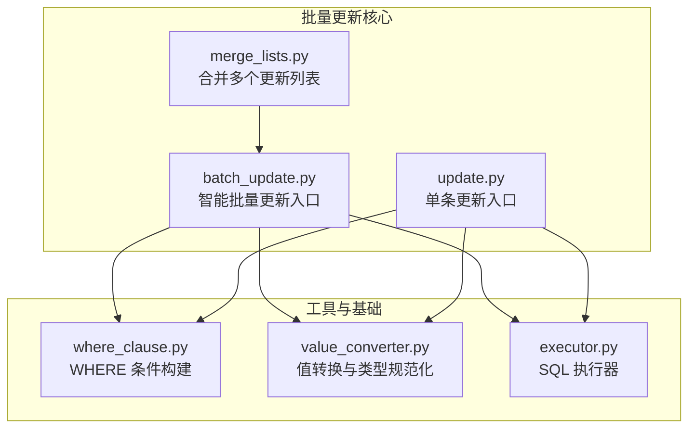
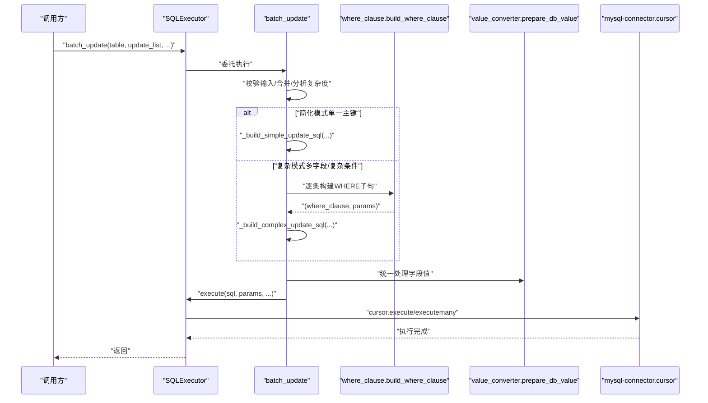
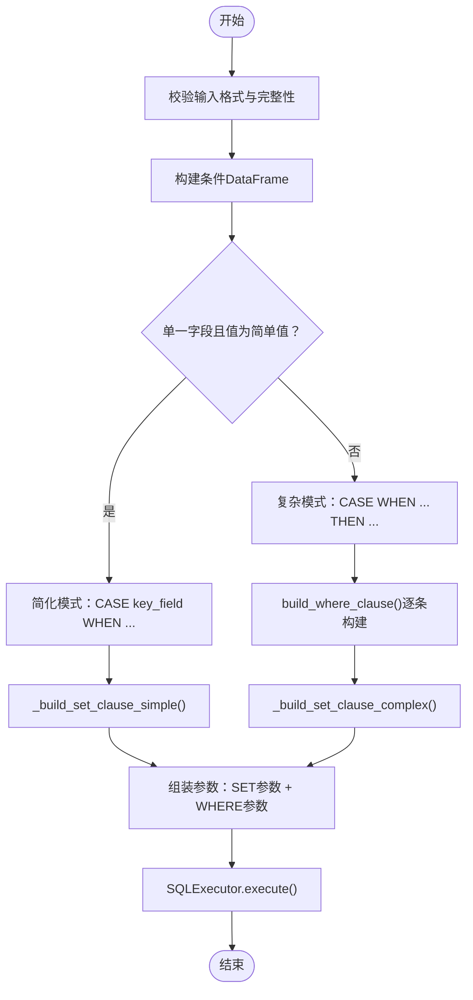
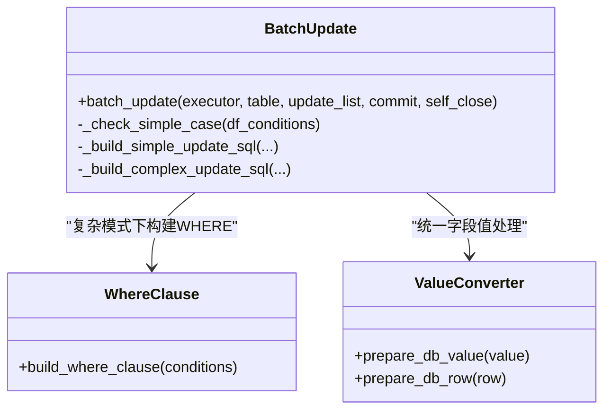
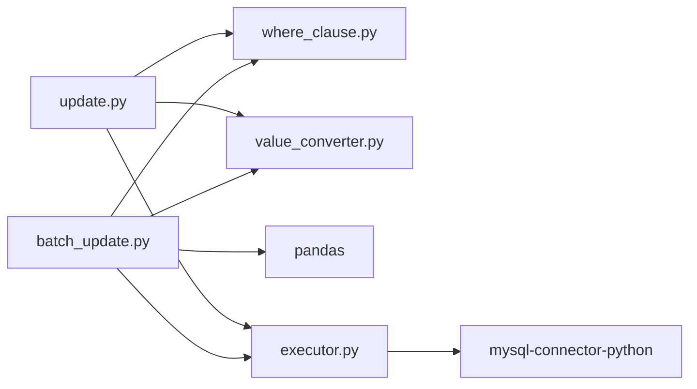

# 批量操作优化

<cite>
**本文引用的文件**
- [batch_update.py](file://lazy_mysql/utils/update/batch_update.py)
- [update.py](file://lazy_mysql/utils/update/update.py)
- [merge_lists.py](file://lazy_mysql/utils/update/merge_lists.py)
- [where_clause.py](file://lazy_mysql/tools/where_clause.py)
- [value_converter.py](file://lazy_mysql/utils/value_converter.py)
- [executor.py](file://lazy_mysql/executor.py)
- [test_batch_update.py](file://tests/test_batch_update.py)
- [README.md](file://README.md)
</cite>

## 目录
1. [简介](#简介)
2. [项目结构](#项目结构)
3. [核心组件](#核心组件)
4. [架构总览](#架构总览)
5. [详细组件分析](#详细组件分析)
6. [依赖分析](#依赖分析)
7. [性能考量](#性能考量)
8. [故障排查指南](#故障排查指南)
9. [结论](#结论)
10. [附录](#附录)

## 简介
本文件聚焦于 lazy_mysql 的批量更新能力，系统阐述其“智能批量更新算法”的设计思想与实现细节，包括：
- 简化模式与复杂模式的 SQL 生成策略选择机制
- CASE WHEN 语法的两种实现方式：基于单一主键的简化 CASE 语法与基于复杂条件的通用 CASE 语法
- 参数绑定优化、SQL 语句合并、网络传输减少等关键技术
- 批量操作的最佳实践，涵盖数据分批大小建议、内存使用优化、错误处理策略等

## 项目结构
围绕批量更新的核心模块主要位于 lazy_mysql/utils/update 与 lazy_mysql/tools 下，并通过 SQLExecutor 统一调度执行。

图表来源
- [batch_update.py:1-313](file://lazy_mysql/utils/update/batch_update.py#L1-L313)
- [update.py:1-44](file://lazy_mysql/utils/update/update.py#L1-L44)
- [merge_lists.py:1-91](file://lazy_mysql/utils/update/merge_lists.py#L1-L91)
- [where_clause.py:1-127](file://lazy_mysql/tools/where_clause.py#L1-L127)
- [value_converter.py:1-115](file://lazy_mysql/utils/value_converter.py#L1-L115)
- [executor.py:1-616](file://lazy_mysql/executor.py#L1-L616)

章节来源
- [README.md:140-160](file://README.md#L140-L160)

## 核心组件
- 智能批量更新入口：根据 WHERE 条件复杂度自动选择 SQL 生成策略，统一走 SQLExecutor 执行。
- 单条更新入口：面向常规更新场景，支持动态 WHERE 构建与参数绑定。
- 条件构建器：将条件字典转换为 WHERE 子句与参数列表，支持 IN、比较运算符、NULL/NOT NULL、日期区间等。
- 值转换器：统一处理各类数据类型的序列化与规范化，确保写入数据库的类型正确。
- 批量合并器：跨多个更新列表合并相同条件的字段，支持冲突处理策略（报错、跳过、覆盖）。

章节来源
- [batch_update.py:6-82](file://lazy_mysql/utils/update/batch_update.py#L6-L82)
- [update.py:4-44](file://lazy_mysql/utils/update/update.py#L4-L44)
- [where_clause.py:42-127](file://lazy_mysql/tools/where_clause.py#L42-L127)
- [value_converter.py:74-115](file://lazy_mysql/utils/value_converter.py#L74-L115)
- [merge_lists.py:21-91](file://lazy_mysql/utils/update/merge_lists.py#L21-L91)

## 架构总览
批量更新的整体流程如下：输入一组更新条目，先进行格式校验与合并，随后通过 Pandas 分析 WHERE 条件复杂度，选择简化或通用 CASE WHEN 生成策略，最终由 SQLExecutor 执行。

图表来源
- [executor.py:272-306](file://lazy_mysql/executor.py#L272-L306)
- [batch_update.py:60-82](file://lazy_mysql/utils/update/batch_update.py#L60-L82)
- [where_clause.py:42-127](file://lazy_mysql/tools/where_clause.py#L42-L127)
- [value_converter.py:74-115](file://lazy_mysql/utils/value_converter.py#L74-L115)

## 详细组件分析

### 智能批量更新算法与策略选择
- 输入校验：确保每个条目包含 fields 与 conditions，且均非空；字段值与条件值类型合法。
- 条件复杂度分析：使用 Pandas DataFrame 对所有记录的 conditions 进行统计，若仅有一个字段且值均为简单值，则判定为“简化模式”。
- 策略选择：
  - 简化模式：使用“CASE key_field WHEN ... THEN ... ELSE ... END”的 SET 子句，配合 WHERE IN(...)，参数顺序严格规范，便于一次网络往返完成。
  - 复杂模式：使用“CASE WHEN ... THEN ... ELSE ... END”的 SET 子句，逐条构建 WHERE 子句并通过 OR 连接不同记录的条件，参数顺序为“SET 子句参数 + WHERE 子句参数”。

图表来源
- [batch_update.py:84-101](file://lazy_mysql/utils/update/batch_update.py#L84-L101)
- [batch_update.py:232-264](file://lazy_mysql/utils/update/batch_update.py#L232-L264)
- [batch_update.py:267-313](file://lazy_mysql/utils/update/batch_update.py#L267-L313)
- [where_clause.py:42-127](file://lazy_mysql/tools/where_clause.py#L42-L127)

章节来源
- [batch_update.py:6-82](file://lazy_mysql/utils/update/batch_update.py#L6-L82)
- [batch_update.py:84-101](file://lazy_mysql/utils/update/batch_update.py#L84-L101)
- [batch_update.py:232-313](file://lazy_mysql/utils/update/batch_update.py#L232-L313)

### CASE WHEN 语法的两种实现方式
- 简化 CASE 语法（单一主键）
  - SET 子句：针对每个字段生成形如“field = CASE key WHEN %s THEN %s WHEN %s THEN %s END”，参数顺序为“key_value1, value1, key_value2, value2, ...”
  - WHERE 子句：形如“key IN (%s, %s, ...)”，参数为所有 key 的取值
  - 优点：参数少、SQL 简洁、网络往返少、执行效率高
- 通用 CASE 语法（复杂条件）
  - SET 子句：针对每个字段生成“field = CASE WHEN where1 THEN %s WHEN where2 THEN %s END”，参数顺序为“where_param1_1, where_param1_2, value1, where_param2_1, value2, ...”
  - WHERE 子句：将不同记录的条件用 OR 连接，形成“where1 OR where2 OR ...”
  - 优点：支持任意复杂条件组合，灵活性强

图表来源
- [batch_update.py:6-82](file://lazy_mysql/utils/update/batch_update.py#L6-L82)
- [batch_update.py:138-169](file://lazy_mysql/utils/update/batch_update.py#L138-L169)
- [where_clause.py:42-127](file://lazy_mysql/tools/where_clause.py#L42-L127)
- [value_converter.py:74-115](file://lazy_mysql/utils/value_converter.py#L74-L115)

章节来源
- [batch_update.py:172-229](file://lazy_mysql/utils/update/batch_update.py#L172-L229)
- [batch_update.py:202-229](file://lazy_mysql/utils/update/batch_update.py#L202-L229)
- [batch_update.py:267-313](file://lazy_mysql/utils/update/batch_update.py#L267-L313)

### 参数绑定优化与 SQL 合并
- 参数绑定优化
  - 简化模式：SET 子句参数与 WHERE 子句参数严格分段，避免混排导致的参数顺序错误
  - 复杂模式：SET 子句参数按“WHERE 参数 + THEN 值”的顺序排列，WHERE 子句参数紧随其后
- SQL 合并
  - 将多个 CASE WHEN 条件合并到同一 SET 子句中，减少 SQL 文本体积
  - WHERE 子句通过 OR 连接不同记录的条件，保证精准匹配
- 网络传输减少
  - 通过一次性生成完整 SQL 与参数列表，避免多次往返
  - 使用 executemany 批量执行（在 SQLExecutor 内部实现）

章节来源
- [batch_update.py:172-229](file://lazy_mysql/utils/update/batch_update.py#L172-L229)
- [batch_update.py:202-229](file://lazy_mysql/utils/update/batch_update.py#L202-L229)
- [batch_update.py:232-313](file://lazy_mysql/utils/update/batch_update.py#L232-L313)
- [executor.py:126-185](file://lazy_mysql/executor.py#L126-L185)

### 批量合并与冲突处理
- 合并规则
  - 相同 conditions 的记录合并 fields，重复字段按 on_conflict 策略处理
  - 支持跨列表合并，后传入的列表优先级更高（在覆盖策略下）
- 冲突处理策略
  - error：遇到冲突直接抛出异常
  - skip：保留先出现的值
  - override：后出现的值覆盖先出现的值

章节来源
- [merge_lists.py:21-91](file://lazy_mysql/utils/update/merge_lists.py#L21-L91)

### 单条更新与 WHERE 条件构建
- 单条更新：支持动态构造 WHERE 子句，统一字段值处理，参数顺序为“SET 值 + WHERE 值”
- WHERE 条件构建：支持等值、比较运算符、IN/NOT IN、NULL/NOT NULL、日期区间（NDayInterval）等

章节来源
- [update.py:4-44](file://lazy_mysql/utils/update/update.py#L4-L44)
- [where_clause.py:42-127](file://lazy_mysql/tools/where_clause.py#L42-L127)

## 依赖分析
- 批量更新依赖
  - where_clause.build_where_clause：复杂模式下逐条构建 WHERE 子句
  - value_converter.prepare_db_value：统一字段值类型转换
  - pandas：用于条件复杂度分析与数据结构处理
- 执行器依赖
  - mysql-connector-python：实际执行 SQL 的驱动
  - SQLExecutor.execute：统一封装执行、参数处理、错误重试与回滚

图表来源
- [batch_update.py:1-3](file://lazy_mysql/utils/update/batch_update.py#L1-L3)
- [update.py:1-2](file://lazy_mysql/utils/update/update.py#L1-L2)
- [executor.py:1-6](file://lazy_mysql/executor.py#L1-L6)

章节来源
- [batch_update.py:1-3](file://lazy_mysql/utils/update/batch_update.py#L1-L3)
- [update.py:1-2](file://lazy_mysql/utils/update/update.py#L1-L2)
- [executor.py:1-6](file://lazy_mysql/executor.py#L1-L6)

## 性能考量
- 策略选择
  - 简化模式：CASE key_field WHEN 语法 + WHERE IN，参数最少、SQL 最短，适合大量单字段条件的更新
  - 复杂模式：CASE WHEN ... THEN 语法 + WHERE OR 连接，灵活性高但参数较多
- 参数绑定与网络往返
  - 通过严格参数顺序与一次性 SQL 发送，减少网络往返次数
  - 使用 executemany 批量执行，避免逐条发送
- 内存与计算
  - 使用 pandas 进行条件分析，注意大数据量时的内存占用
  - 建议在调用前合并重复条件，减少条目数量
- 错误处理与重试
  - SQLExecutor 内置连接错误重试与回滚逻辑，提升稳定性

章节来源
- [batch_update.py:60-82](file://lazy_mysql/utils/update/batch_update.py#L60-L82)
- [executor.py:126-185](file://lazy_mysql/executor.py#L126-L185)

## 故障排查指南
- 常见错误与定位
  - “fields 不能为空”：检查 update_list 中每个条目的 fields 是否为空
  - “conditions 不能为空”：避免误传空条件导致全表更新
  - “update_list 中每个元素必须包含 'fields' 和 'conditions'”：确认数据结构
  - “conditions 构建失败”：复杂模式下 WHERE 子句构建失败，检查条件格式
- 参数顺序问题
  - 复杂模式：SET 子句参数顺序为“where_param1, where_param2, value1, ...”
  - 简化模式：SET 子句参数顺序为“key_value1, value1, key_value2, value2, ...”，随后是 WHERE IN 的 key 值
- 单元测试参考
  - 可参考测试用例对参数顺序与 SQL 结构的断言，快速定位问题

章节来源
- [batch_update.py:40-58](file://lazy_mysql/utils/update/batch_update.py#L40-L58)
- [batch_update.py:158-160](file://lazy_mysql/utils/update/batch_update.py#L158-L160)
- [test_batch_update.py:14-84](file://tests/test_batch_update.py#L14-L84)
- [test_batch_update.py:86-132](file://tests/test_batch_update.py#L86-L132)

## 结论
lazy_mysql 的批量更新通过“简化模式 + 复杂模式”的双策略设计，在保证灵活性的同时最大化性能。其关键优化点包括：
- 基于 WHERE 条件复杂度的自动策略选择
- CASE WHEN 语法的两种实现方式与严格的参数顺序
- 统一的值转换与 WHERE 条件构建
- SQL 合并与网络传输优化
结合批量合并与错误处理策略，可在大规模数据更新场景下获得稳定高效的执行效果。

## 附录

### 最佳实践建议
- 数据分批大小建议
  - 简化模式：单次更新条目建议控制在合理范围内，避免 WHERE IN 过长导致 SQL 超限
  - 复杂模式：建议分批执行，避免 CASE WHEN 过多导致 SQL 过长
- 内存使用优化
  - 使用 merge_lists 合并重复条件，减少条目数量
  - 在大数据场景下，考虑分批处理与流式写入
- 错误处理策略
  - on_conflict 选择：默认 error，冲突时显式处理
  - 使用 SQLExecutor 的自动重试与回滚，确保事务一致性
- 参数绑定与 SQL 生成
  - 严格遵循参数顺序，避免因顺序错误导致的更新异常
  - 复杂条件尽量使用元组格式，明确比较运算符与值

章节来源
- [merge_lists.py:21-91](file://lazy_mysql/utils/update/merge_lists.py#L21-L91)
- [executor.py:62-106](file://lazy_mysql/executor.py#L62-L106)
- [batch_update.py:172-229](file://lazy_mysql/utils/update/batch_update.py#L172-L229)
- [batch_update.py:202-229](file://lazy_mysql/utils/update/batch_update.py#L202-L229)