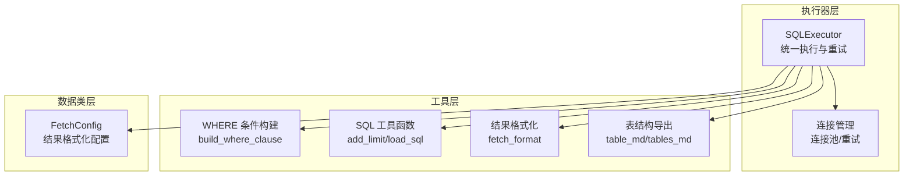
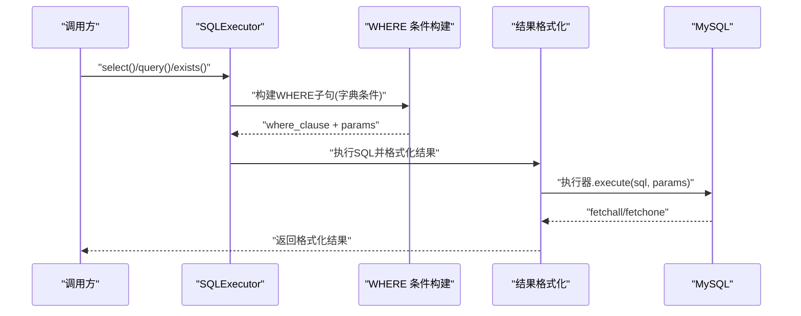
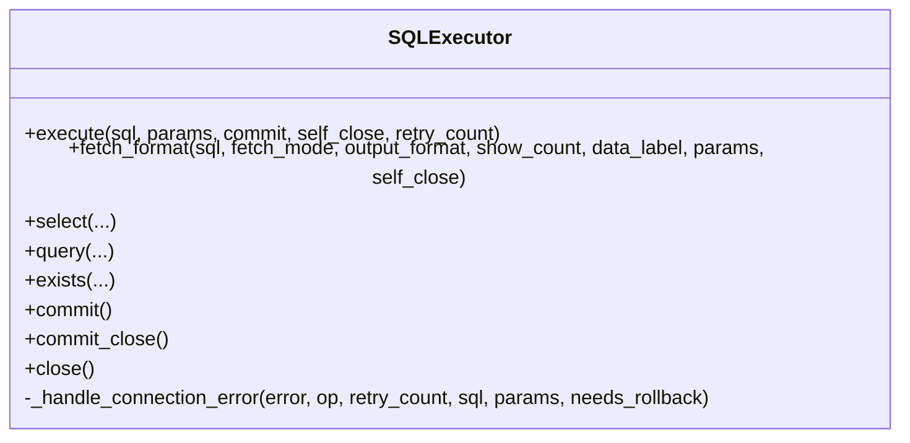
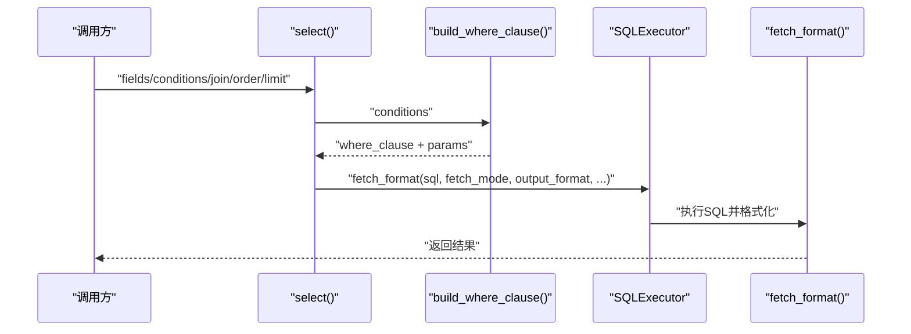
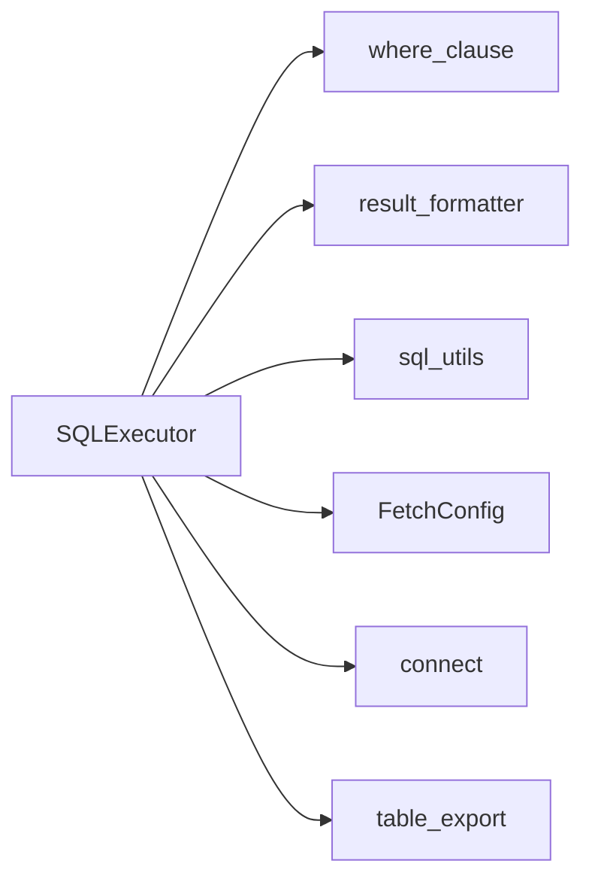

# 查询性能调优

<cite>
**本文引用的文件**
- [lazy_mysql/__init__.py](file://lazy_mysql/__init__.py)
- [lazy_mysql/executor.py](file://lazy_mysql/executor.py)
- [lazy_mysql/utils/connect.py](file://lazy_mysql/utils/connect.py)
- [lazy_mysql/utils/select.py](file://lazy_mysql/utils/select.py)
- [lazy_mysql/tools/where_clause.py](file://lazy_mysql/tools/where_clause.py)
- [lazy_mysql/tools/sql_utils.py](file://lazy_mysql/tools/sql_utils.py)
- [lazy_mysql/tools/result_formatter.py](file://lazy_mysql/tools/result_formatter.py)
- [lazy_mysql/dataclasses/fetch_config.py](file://lazy_mysql/dataclasses/fetch_config.py)
- [lazy_mysql/utils/insert.py](file://lazy_mysql/utils/insert.py)
- [lazy_mysql/tools/table_export.py](file://lazy_mysql/tools/table_export.py)
- [docs/QUERY.md](file://docs/QUERY.md)
- [docs/SQL_UTILS.md](file://docs/SQL_UTILS.md)
- [README.md](file://README.md)
</cite>

## 目录
1. [简介](#简介)
2. [项目结构](#项目结构)
3. [核心组件](#核心组件)
4. [架构总览](#架构总览)
5. [详细组件分析](#详细组件分析)
6. [依赖分析](#依赖分析)
7. [性能考量](#性能考量)
8. [故障排查指南](#故障排查指南)
9. [结论](#结论)
10. [附录](#附录)

## 简介
本文件围绕 lazy_mysql 的查询性能优化与调优策略展开，重点覆盖以下方面：
- SQL 语句生成优化：动态 SQL 构建、参数化查询优化、查询计划分析
- WHERE 条件优化：索引利用、复合条件优化、查询谓词推导
- 查询缓存策略、慢查询监控、执行计划分析等性能监控技术
- 常见性能瓶颈的识别与解决方案：索引缺失、查询设计不当、数据类型不匹配等

## 项目结构
lazy_mysql 采用模块化组织，围绕“执行器 + 工具 + 数据类”的分层设计：
- 执行器层：统一的 SQL 执行与结果格式化能力
- 工具层：SQL 构建、条件拼装、结果格式化、表结构导出等
- 数据类层：配置模型与结果格式化配置
- 文档层：使用说明与最佳实践



图表来源
- [lazy_mysql/executor.py:14-616](file://lazy_mysql/executor.py#L14-L616)
- [lazy_mysql/utils/connect.py:16-91](file://lazy_mysql/utils/connect.py#L16-L91)
- [lazy_mysql/utils/select.py:4-156](file://lazy_mysql/utils/select.py#L4-L156)
- [lazy_mysql/tools/where_clause.py:42-127](file://lazy_mysql/tools/where_clause.py#L42-L127)
- [lazy_mysql/tools/sql_utils.py:4-53](file://lazy_mysql/tools/sql_utils.py#L4-L53)
- [lazy_mysql/tools/result_formatter.py:3-77](file://lazy_mysql/tools/result_formatter.py#L3-L77)
- [lazy_mysql/dataclasses/fetch_config.py:8-24](file://lazy_mysql/dataclasses/fetch_config.py#L8-L24)
- [lazy_mysql/tools/table_export.py:12-190](file://lazy_mysql/tools/table_export.py#L12-L190)

章节来源
- [lazy_mysql/__init__.py:1-21](file://lazy_mysql/__init__.py#L1-L21)
- [README.md:1-197](file://README.md#L1-L197)

## 核心组件
- SQLExecutor：统一的数据库操作入口，封装连接、执行、重试、提交、关闭等；提供 select、exists、query、fetch_format 等高层接口
- WHERE 条件构建：build_where_clause 将字典条件转换为参数化 WHERE 子句，支持 IN、NULL/NOT NULL、NDayInterval 等
- 结果格式化：fetch_format 支持 all/oneTuple/one 三种模式与 list_1、df、df_dict 等输出格式
- SQL 工具：add_limit 动态拼接条件片段；load_sql 从文件读取 SQL
- 连接管理：连接池、重试、缓冲游标、字典游标等参数优化
- 表结构导出：table_md/tables_md 展示字段、索引、字符集等信息，辅助索引与查询设计

章节来源
- [lazy_mysql/executor.py:14-616](file://lazy_mysql/executor.py#L14-L616)
- [lazy_mysql/utils/select.py:4-156](file://lazy_mysql/utils/select.py#L4-L156)
- [lazy_mysql/tools/where_clause.py:42-127](file://lazy_mysql/tools/where_clause.py#L42-L127)
- [lazy_mysql/tools/result_formatter.py:3-77](file://lazy_mysql/tools/result_formatter.py#L3-L77)
- [lazy_mysql/tools/sql_utils.py:4-53](file://lazy_mysql/tools/sql_utils.py#L4-L53)
- [lazy_mysql/utils/connect.py:16-91](file://lazy_mysql/utils/connect.py#L16-L91)
- [lazy_mysql/tools/table_export.py:12-190](file://lazy_mysql/tools/table_export.py#L12-L190)

## 架构总览
lazy_mysql 的查询路径从高层 API 到底层执行器，形成清晰的职责边界与可扩展点。



图表来源
- [lazy_mysql/utils/select.py:4-156](file://lazy_mysql/utils/select.py#L4-L156)
- [lazy_mysql/tools/where_clause.py:42-127](file://lazy_mysql/tools/where_clause.py#L42-L127)
- [lazy_mysql/tools/result_formatter.py:3-77](file://lazy_mysql/tools/result_formatter.py#L3-L77)
- [lazy_mysql/executor.py:126-185](file://lazy_mysql/executor.py#L126-L185)

## 详细组件分析

### SQLExecutor 执行器
- 统一执行与重试：内置可重试错误类型，连接丢失/超时自动重连
- 参数化执行：支持单条/批量参数，自动校验并拒绝 SELECT 批量执行
- 结果格式化：集中处理 all/oneTuple/one 与 list_1、df、df_dict 等输出
- 高层封装：select、exists、query、fetch_format、insert/upsert/update/batch_update/delete 等



图表来源
- [lazy_mysql/executor.py:14-616](file://lazy_mysql/executor.py#L14-L616)

章节来源
- [lazy_mysql/executor.py:14-616](file://lazy_mysql/executor.py#L14-L616)

### WHERE 条件构建与参数化优化
- build_where_clause 将字典条件转换为参数化 WHERE 子句，支持：
  - 简单值：默认等值
  - 元组：(运算符, 值)，支持 IN/NOT IN、NULL/NOT NULL、NDayInterval
  - 参数校验：禁止 numpy 类型，字典自动 JSON 序列化
- 与 SQL 工具函数 add_limit 协作，动态拼接条件片段，避免手工拼接带来的性能与安全问题

```mermaid
flowchart TD
Start(["输入条件字典"]) --> CheckEmpty{"是否为空?"}
CheckEmpty --> |是| ReturnNone["返回(None, None)"]
CheckEmpty --> |否| Loop["遍历键值对"]
Loop --> TypeCheck{"值类型?"}
TypeCheck --> |元组(len==2)| TuplePath["处理运算符/值<br/>IN/NOT IN拆分子项<br/>NDayInterval特殊处理"]
TypeCheck --> |字符串(NULL/NOT NULL)| NullPath["生成IS/IS NOT NULL"]
TypeCheck --> |其他| SimplePath["默认=比较<br/>参数校验"]
TuplePath --> Append["追加到clauses/params"]
NullPath --> Append
SimplePath --> Append
Append --> Next{"还有键值?"}
Next --> |是| Loop
Next --> |否| Join["连接为AND子句"]
Join --> End(["返回(where_clause, params)"])
```

图表来源
- [lazy_mysql/tools/where_clause.py:42-127](file://lazy_mysql/tools/where_clause.py#L42-L127)

章节来源
- [lazy_mysql/tools/where_clause.py:42-127](file://lazy_mysql/tools/where_clause.py#L42-L127)
- [lazy_mysql/tools/sql_utils.py:9-53](file://lazy_mysql/tools/sql_utils.py#L9-L53)

### 查询构建与执行路径（select）
- select 将高层字段/表/JOIN/条件映射为标准 SQL，并通过 fetch_format 统一执行与格式化
- 支持 DISTINCT、ORDER BY、LIMIT，以及 FetchConfig 控制输出格式与列标签



图表来源
- [lazy_mysql/utils/select.py:4-156](file://lazy_mysql/utils/select.py#L4-L156)
- [lazy_mysql/tools/where_clause.py:42-127](file://lazy_mysql/tools/where_clause.py#L42-L127)
- [lazy_mysql/tools/result_formatter.py:3-77](file://lazy_mysql/tools/result_formatter.py#L3-L77)
- [lazy_mysql/executor.py:187-211](file://lazy_mysql/executor.py#L187-L211)

章节来源
- [lazy_mysql/utils/select.py:4-156](file://lazy_mysql/utils/select.py#L4-L156)

### 结果格式化与输出控制
- fetch_mode：all/oneTuple/one
- output_format：""/list_1/df/df_dict
- data_label：DataFrame 列名或字典键名
- show_count：all 模式下返回(数据, 数量)

```mermaid
flowchart TD
Enter(["进入fetch_format"]) --> Exec["executor.execute(sql, params)"]
Exec --> Mode{"fetch_mode"}
Mode --> |all| All["fetchall()"]
Mode --> |oneTuple| OneTuple["fetchone()"]
Mode --> |one| One["fetchone()并取首个字段"]
All --> OF{"output_format"}
OF --> |""| RetAll["返回元组列表"]
OF --> |list_1| Flat["提取首列"]
OF --> |df| DF["构造DataFrame(data_label)"]
OF --> |df_dict| DFD["to_dict(orient='records')"]
OneTuple --> DictCheck{"output_format==dict 且 data_label存在?"}
DictCheck --> |是| ToDict["zip(data_label, result)"]
DictCheck --> |否| RetOneTuple["返回元组"]
One --> RetOne["返回单值"]
RetAll --> Count{"show_count?"}
Count --> |是| RetPair["返回(数据, 数量)"]
Count --> |否| RetAll
RetOneTuple --> End(["结束"])
RetOne --> End
RetPair --> End
RetAll --> End
```

图表来源
- [lazy_mysql/tools/result_formatter.py:3-77](file://lazy_mysql/tools/result_formatter.py#L3-L77)
- [lazy_mysql/dataclasses/fetch_config.py:8-24](file://lazy_mysql/dataclasses/fetch_config.py#L8-L24)

章节来源
- [lazy_mysql/tools/result_formatter.py:3-77](file://lazy_mysql/tools/result_formatter.py#L3-L77)
- [lazy_mysql/dataclasses/fetch_config.py:8-24](file://lazy_mysql/dataclasses/fetch_config.py#L8-L24)

### 连接与性能参数
- buffered=True：避免“Unread result found”错误，减少跨查询状态干扰
- use_pure=True：提高兼容性，降低外部依赖
- allow_local_infile=True：启用 LOAD DATA LOCAL INFILE，支撑超大批次导入
- 字典游标：dictionary=True 返回字典列表，便于后续格式化

章节来源
- [lazy_mysql/utils/connect.py:16-91](file://lazy_mysql/utils/connect.py#L16-L91)

### 批量插入与大体量数据优化
- 自动策略选择：小批量直接 executemany；中批量分批 executemany；超大批量使用 LOAD DATA INFILE
- 分批大小：1000/5000/50000，兼顾吞吐与内存占用
- LOAD DATA INFILE：CSV 流式写入 + 本地临时文件，显著提升百万级数据导入速度

章节来源
- [lazy_mysql/utils/insert.py:7-287](file://lazy_mysql/utils/insert.py#L7-L287)

### 表结构导出与索引可视化
- table_md/tables_md：导出字段、类型、字符集、索引（含复合索引列顺序）等信息
- 辅助索引设计与查询谓词推导，识别潜在缺失索引与冗余索引

章节来源
- [lazy_mysql/tools/table_export.py:12-190](file://lazy_mysql/tools/table_export.py#L12-L190)

## 依赖分析
- 组件内聚与耦合
  - SQLExecutor 作为门面，聚合连接、执行、格式化、工具模块
  - where_clause 与 sql_utils 为条件构建与 SQL 片段拼装提供独立能力
  - result_formatter 与 fetch_config 解耦输出格式与执行流程
- 外部依赖
  - mysql-connector-python：连接与执行
  - pandas：DataFrame 输出
- 循环依赖：未发现循环导入



图表来源
- [lazy_mysql/executor.py:14-616](file://lazy_mysql/executor.py#L14-L616)
- [lazy_mysql/utils/select.py:1-2](file://lazy_mysql/utils/select.py#L1-L2)
- [lazy_mysql/tools/where_clause.py:1-2](file://lazy_mysql/tools/where_clause.py#L1-L2)
- [lazy_mysql/tools/result_formatter.py:1-1](file://lazy_mysql/tools/result_formatter.py#L1-L1)
- [lazy_mysql/tools/sql_utils.py:1-1](file://lazy_mysql/tools/sql_utils.py#L1-L1)
- [lazy_mysql/dataclasses/fetch_config.py:1-2](file://lazy_mysql/dataclasses/fetch_config.py#L1-L2)
- [lazy_mysql/utils/connect.py:1-4](file://lazy_mysql/utils/connect.py#L1-L4)
- [lazy_mysql/tools/table_export.py:1-3](file://lazy_mysql/tools/table_export.py#L1-L3)

## 性能考量
- SQL 生成优化
  - 使用字典条件自动构建 WHERE，避免手工拼接引发的性能与安全问题
  - 对 IN/NOT IN 使用参数化占位符，减少 SQL 重编译与注入风险
  - 使用 NDayInterval 生成日期范围表达式，避免字符串拼接
- 参数化查询优化
  - 严格使用 %s 占位符 + params，避免字符串拼接
  - 对批量执行进行显式校验，拒绝 SELECT 批量执行
- 查询计划分析
  - 使用 EXPLAIN/慢查询日志定位热点 SQL
  - 结合表结构导出与索引信息，评估覆盖索引与回表成本
- WHERE 条件优化
  - 优先使用可走索引的等值/范围条件
  - 复合条件遵循最左前缀原则，必要时增加联合索引
  - 避免在 WHERE 中对列进行函数计算或隐式类型转换
- 查询缓存与结果格式化
  - 使用 buffered 游标减少跨查询状态干扰
  - 对大结果集优先使用 df_dict/list_1，减少中间对象创建
- 大数据量处理
  - 选择合适的分批大小，平衡吞吐与内存占用
  - 超大规模数据导入使用 LOAD DATA INFILE

## 故障排查指南
- 连接与重试
  - 可重试错误：连接丢失、读取超时、超时错误、连接超时
  - 自动重连：断开后重建连接并重试一次
- 常见错误与修复
  - “SELECT 查询不支持批量执行”：将 SELECT 从批量参数中移除
  - “data_label 长度与字段数不一致”：核对字段数量与 data_label
  - “No result set to fetch from”：确认游标未被提前关闭
  - “字段值类型为 numpy”：转换为 Python/JSON 可序列化类型
- 慢查询定位
  - 使用 query() 执行手写 SQL 并结合 EXPLAIN 分析
  - 通过 table_export 导出索引信息，评估覆盖与回表
- 索引缺失与数据类型不匹配
  - 导出表结构与索引，识别缺失或冗余索引
  - 检查字段类型与比较运算符，避免隐式转换

章节来源
- [lazy_mysql/executor.py:62-107](file://lazy_mysql/executor.py#L62-L107)
- [lazy_mysql/tools/result_formatter.py:30-31](file://lazy_mysql/tools/result_formatter.py#L30-L31)
- [lazy_mysql/tools/where_clause.py:17-39](file://lazy_mysql/tools/where_clause.py#L17-L39)
- [lazy_mysql/tools/table_export.py:40-77](file://lazy_mysql/tools/table_export.py#L40-L77)

## 结论
lazy_mysql 通过“高层 API + 参数化执行 + 结果格式化 + 工具函数”的组合，提供了可维护、可扩展且具备性能意识的查询体系。结合 WHERE 条件构建、连接参数优化、大体量数据处理策略与表结构导出能力，能够有效支撑从常规查询到复杂 SQL 的性能优化需求。建议在实际项目中：
- 优先使用 select/query 的高层接口，配合字典条件与 FetchConfig 控制输出
- 对复杂 SQL 使用 query 执行并配合 EXPLAIN 分析
- 依据表结构导出与索引信息持续优化索引设计
- 针对批量场景选择合适策略，避免不必要的字符串拼接与类型转换

## 附录
- 使用参考
  - 自定义 SQL 查询：[docs/QUERY.md:1-209](file://docs/QUERY.md#L1-L209)
  - SQL 工具函数：[docs/SQL_UTILS.md:1-170](file://docs/SQL_UTILS.md#L1-L170)
- 核心 API 一览
  - select/exist/query/fetch_format：查询与格式化
  - add_limit/load_sql：SQL 片段与文件读取
  - FetchConfig：结果格式化配置

章节来源
- [docs/QUERY.md:1-209](file://docs/QUERY.md#L1-L209)
- [docs/SQL_UTILS.md:1-170](file://docs/SQL_UTILS.md#L1-L170)
- [lazy_mysql/__init__.py:1-21](file://lazy_mysql/__init__.py#L1-L21)