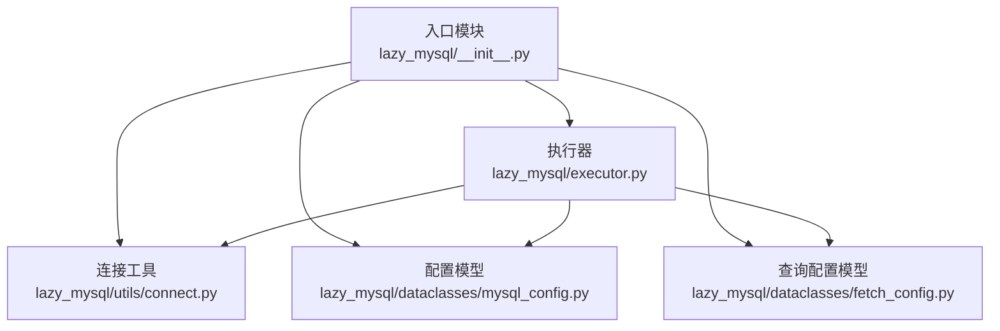
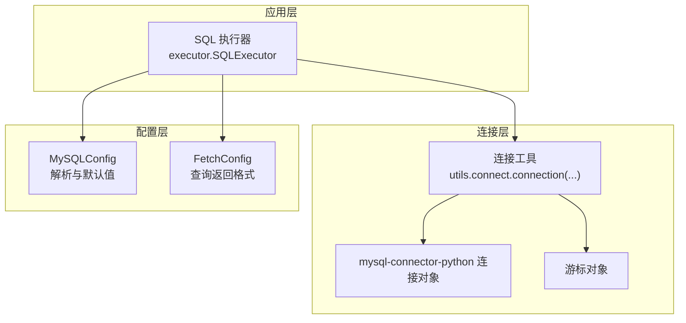
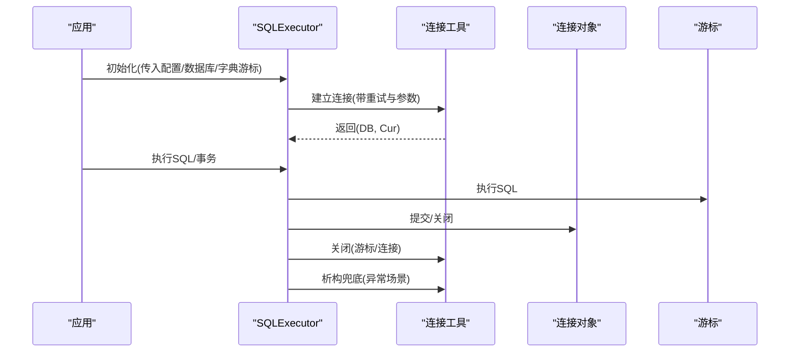
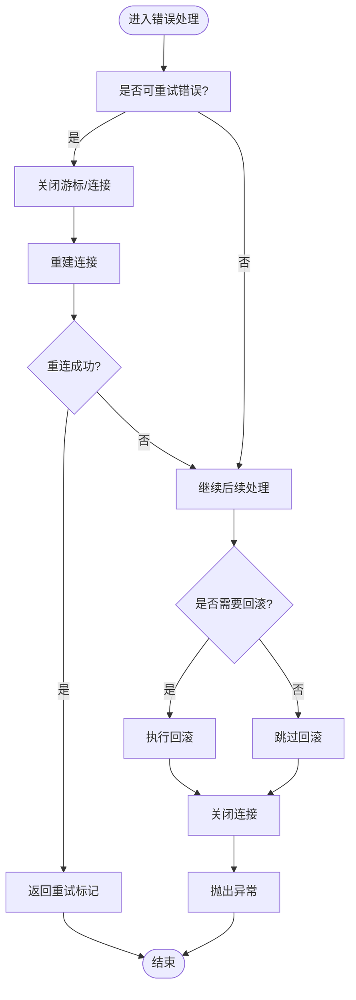
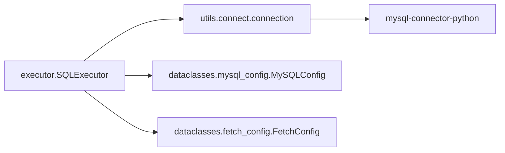

# 连接池优化

<cite>
**本文引用的文件**
- [lazy_mysql/__init__.py](file://lazy_mysql/__init__.py)
- [lazy_mysql/executor.py](file://lazy_mysql/executor.py)
- [lazy_mysql/utils/connect.py](file://lazy_mysql/utils/connect.py)
- [lazy_mysql/dataclasses/mysql_config.py](file://lazy_mysql/dataclasses/mysql_config.py)
- [lazy_mysql/dataclasses/fetch_config.py](file://lazy_mysql/dataclasses/fetch_config.py)
</cite>

## 目录
1. [引言](#引言)
2. [项目结构](#项目结构)
3. [核心组件](#核心组件)
4. [架构总览](#架构总览)
5. [详细组件分析](#详细组件分析)
6. [依赖分析](#依赖分析)
7. [性能考量](#性能考量)
8. [故障排查指南](#故障排查指南)
9. [结论](#结论)
10. [附录](#附录)

## 引言
本文件围绕 lazy_mysql 的连接池配置与优化展开，重点说明连接复用机制、连接生命周期管理、空闲连接回收策略，以及连接池大小配置原则（最大连接数、最小连接数、连接超时设置等）。同时给出连接状态监控与健康检查机制的建议，涵盖连接泄漏检测与异常连接清理，并提供高并发、长连接、短连接等不同应用场景的最佳实践。

## 项目结构
lazy_mysql 采用“入口导出 + 执行器 + 工具层 + 数据类”的分层组织方式：
- 入口模块负责对外暴露常用 API 与默认配置
- 执行器封装统一的 SQL 执行、事务提交、连接关闭与错误重试
- 工具层提供连接建立、SQL 工具与结果格式化
- 数据类定义配置模型与查询返回格式模型

图表来源
- [lazy_mysql/__init__.py:1-21](file://lazy_mysql/__init__.py#L1-L21)
- [lazy_mysql/executor.py:1-616](file://lazy_mysql/executor.py#L1-L616)
- [lazy_mysql/utils/connect.py:1-91](file://lazy_mysql/utils/connect.py#L1-L91)
- [lazy_mysql/dataclasses/mysql_config.py:1-135](file://lazy_mysql/dataclasses/mysql_config.py#L1-L135)
- [lazy_mysql/dataclasses/fetch_config.py:1-24](file://lazy_mysql/dataclasses/fetch_config.py#L1-L24)

章节来源
- [lazy_mysql/__init__.py:1-21](file://lazy_mysql/__init__.py#L1-L21)
- [lazy_mysql/executor.py:1-616](file://lazy_mysql/executor.py#L1-L616)
- [lazy_mysql/utils/connect.py:1-91](file://lazy_mysql/utils/connect.py#L1-L91)
- [lazy_mysql/dataclasses/mysql_config.py:1-135](file://lazy_mysql/dataclasses/mysql_config.py#L1-L135)
- [lazy_mysql/dataclasses/fetch_config.py:1-24](file://lazy_mysql/dataclasses/fetch_config.py#L1-L24)

## 核心组件
- SQL 执行器：提供统一的 SQL 执行、事务提交、连接关闭、错误重试与结果格式化能力
- 连接工具：封装 mysql-connector-python 的连接创建、重试与游标配置
- 配置模型：MySQLConfig 提供环境变量与多源合并解析；DEFAULT_MYSQL_CONFIG 提供默认配置
- 查询配置模型：FetchConfig 控制查询返回格式与行为

章节来源
- [lazy_mysql/executor.py:14-616](file://lazy_mysql/executor.py#L14-L616)
- [lazy_mysql/utils/connect.py:15-91](file://lazy_mysql/utils/connect.py#L15-L91)
- [lazy_mysql/dataclasses/mysql_config.py:10-135](file://lazy_mysql/dataclasses/mysql_config.py#L10-L135)
- [lazy_mysql/dataclasses/fetch_config.py:8-24](file://lazy_mysql/dataclasses/fetch_config.py#L8-L24)

## 架构总览
下图展示连接池在整体架构中的位置与交互关系。注意：当前实现通过 mysql-connector-python 的连接对象与游标进行连接复用，未直接使用其内置连接池参数。连接池大小由应用侧控制（如外部连接池或进程/线程粒度），并在连接建立阶段通过参数保障缓冲与兼容性。

图表来源
- [lazy_mysql/executor.py:20-24](file://lazy_mysql/executor.py#L20-L24)
- [lazy_mysql/utils/connect.py:15-68](file://lazy_mysql/utils/connect.py#L15-L68)
- [lazy_mysql/dataclasses/mysql_config.py:88-135](file://lazy_mysql/dataclasses/mysql_config.py#L88-L135)
- [lazy_mysql/dataclasses/fetch_config.py:8-24](file://lazy_mysql/dataclasses/fetch_config.py#L8-L24)

## 详细组件分析

### 连接复用机制与生命周期管理
- 连接复用：SQLExecutor 在初始化时通过连接工具创建连接与游标，并在整个对象生命周期内复用同一连接与游标，避免频繁握手与上下文切换
- 生命周期管理：
  - 显式关闭：提供 close 方法，安全关闭游标与连接，并将内部引用置空，降低析构期风险
  - 析构兜底：对象销毁时尝试关闭资源，避免资源泄露
  - 事务提交：commit/close 流程中若发生可重试错误，先关闭并重建连接，再重试
- 连接健壮性：对连接丢失与超时错误进行识别与自动重连，必要时回滚事务并抛出明确异常

图表来源
- [lazy_mysql/executor.py:20-47](file://lazy_mysql/executor.py#L20-L47)
- [lazy_mysql/executor.py:62-106](file://lazy_mysql/executor.py#L62-L106)
- [lazy_mysql/utils/connect.py:15-91](file://lazy_mysql/utils/connect.py#L15-L91)

章节来源
- [lazy_mysql/executor.py:20-47](file://lazy_mysql/executor.py#L20-L47)
- [lazy_mysql/executor.py:62-106](file://lazy_mysql/executor.py#L62-L106)
- [lazy_mysql/utils/connect.py:15-91](file://lazy_mysql/utils/connect.py#L15-L91)

### 空闲连接回收策略
- 当前实现未启用 mysql-connector-python 的内置连接池参数，连接回收策略由应用侧控制
- 建议策略：
  - 短连接场景：每次请求结束后立即 close，避免长期占用
  - 长连接场景：在进程/线程内复用连接，配合心跳与超时检测
  - 连接池场景：结合外部连接池（如连接池中间件）统一管理空闲回收与超时

说明：本节为通用实践建议，不直接对应特定源码实现

### 连接池大小配置原则
- 最大连接数：依据数据库最大连接限制与应用并发峰值设定，避免超过数据库承载上限
- 最小连接数：短连接场景可设为 0；长连接场景建议维持少量空闲连接以降低首次请求延迟
- 连接超时设置：结合网络抖动与业务 SLA，设置合理的连接超时与读写超时
- 连接参数建议：
  - 缓冲查询结果：提升连续查询稳定性
  - 纯 Python 实现：增强兼容性，减少外部依赖
  - 允许本地文件导入：满足大数据导入需求

章节来源
- [lazy_mysql/utils/connect.py:44-63](file://lazy_mysql/utils/connect.py#L44-L63)

### 错误处理与重试机制
- 可重试错误：连接丢失、读取超时、连接超时等
- 自动重连：在可重试错误发生时，关闭并重建连接，必要时回滚事务
- 异常上报：打印 SQL 与参数信息，便于定位问题

图表来源
- [lazy_mysql/executor.py:62-106](file://lazy_mysql/executor.py#L62-L106)

章节来源
- [lazy_mysql/executor.py:62-106](file://lazy_mysql/executor.py#L62-L106)

### 查询与结果格式化
- 查询入口：select/query/fetch_format 等方法统一走底层 fetch_format
- 结果格式：支持 all/oneTuple/one 三种获取模式与多种输出格式（元组列表、扁平列表、DataFrame、字典列表）
- 标签与计数：可配置 data_label 与 show_count，便于前端消费

章节来源
- [lazy_mysql/executor.py:187-211](file://lazy_mysql/executor.py#L187-L211)
- [lazy_mysql/executor.py:324-385](file://lazy_mysql/executor.py#L324-L385)
- [lazy_mysql/executor.py:515-590](file://lazy_mysql/executor.py#L515-L590)
- [lazy_mysql/dataclasses/fetch_config.py:8-24](file://lazy_mysql/dataclasses/fetch_config.py#L8-L24)

### 配置模型与默认值
- MySQLConfig：支持从环境变量与多源合并解析，提供默认配置 DEFAULT_MYSQL_CONFIG
- FetchConfig：定义查询返回格式与行为，兼容旧版字典方式

章节来源
- [lazy_mysql/dataclasses/mysql_config.py:10-135](file://lazy_mysql/dataclasses/mysql_config.py#L10-L135)
- [lazy_mysql/dataclasses/fetch_config.py:8-24](file://lazy_mysql/dataclasses/fetch_config.py#L8-L24)

## 依赖分析
- 执行器依赖连接工具与配置模型
- 连接工具依赖 mysql-connector-python 并使用其连接参数
- 查询配置模型被执行器广泛使用

图表来源
- [lazy_mysql/executor.py:20-24](file://lazy_mysql/executor.py#L20-L24)
- [lazy_mysql/utils/connect.py:15-68](file://lazy_mysql/utils/connect.py#L15-L68)
- [lazy_mysql/dataclasses/mysql_config.py:88-135](file://lazy_mysql/dataclasses/mysql_config.py#L88-L135)
- [lazy_mysql/dataclasses/fetch_config.py:8-24](file://lazy_mysql/dataclasses/fetch_config.py#L8-L24)

章节来源
- [lazy_mysql/executor.py:20-24](file://lazy_mysql/executor.py#L20-L24)
- [lazy_mysql/utils/connect.py:15-68](file://lazy_mysql/utils/connect.py#L15-L68)
- [lazy_mysql/dataclasses/mysql_config.py:88-135](file://lazy_mysql/dataclasses/mysql_config.py#L88-L135)
- [lazy_mysql/dataclasses/fetch_config.py:8-24](file://lazy_mysql/dataclasses/fetch_config.py#L8-L24)

## 性能考量
- 连接参数优化：
  - 缓冲查询结果：避免“未读结果”问题，提升连续查询稳定性
  - 纯 Python 实现：增强兼容性，减少外部依赖导致的失败
  - 允许本地文件导入：满足大数据导入场景
- 连接复用：在进程/线程内复用连接与游标，降低握手与上下文切换开销
- 结果格式化：按需选择输出格式，避免不必要的转换成本

章节来源
- [lazy_mysql/utils/connect.py:44-63](file://lazy_mysql/utils/connect.py#L44-L63)
- [lazy_mysql/executor.py:187-211](file://lazy_mysql/executor.py#L187-L211)

## 故障排查指南
- 连接超时/丢失：
  - 观察可重试错误识别与自动重连逻辑
  - 检查网络与数据库负载，适当增加重试次数与延迟
- 连接泄漏：
  - 确保每次使用后调用 close 或在事务完成后调用 commit_close
  - 利用析构兜底逻辑，但不应依赖它作为唯一保障
- 异常连接清理：
  - 发生错误时自动关闭连接并抛出明确异常，便于上层捕获与记录
- 版本兼容：
  - 注意连接器版本要求，避免低版本带来的兼容性问题

章节来源
- [lazy_mysql/executor.py:62-106](file://lazy_mysql/executor.py#L62-L106)
- [lazy_mysql/executor.py:32-47](file://lazy_mysql/executor.py#L32-L47)
- [lazy_mysql/utils/connect.py:6-13](file://lazy_mysql/utils/connect.py#L6-L13)

## 结论
lazy_mysql 当前通过连接工具与执行器实现连接复用与生命周期管理，未直接使用 mysql-connector-python 的内置连接池参数。连接池大小与回收策略应由应用侧结合外部连接池或进程/线程粒度进行控制。通过合理配置连接参数、事务与错误处理机制，可在不同场景下获得稳定与高性能的数据库访问体验。

## 附录
- 应用场景最佳实践建议（通用指导，非特定源码实现）：
  - 高并发场景：结合外部连接池统一管理连接，设置适中的最大连接数与空闲回收时间；短连接+批量提交策略
  - 长连接场景：在进程/线程内复用连接，开启心跳与超时检测；最小连接数维持少量空闲连接
  - 短连接场景：每次请求结束后立即关闭连接，避免长期占用；重试策略适度放宽