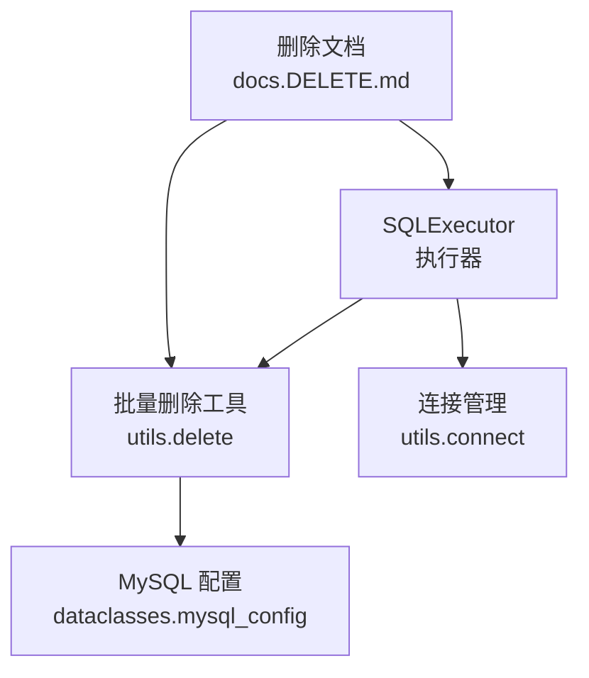
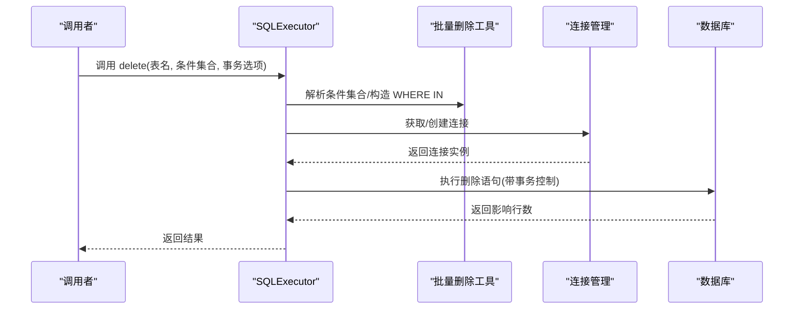
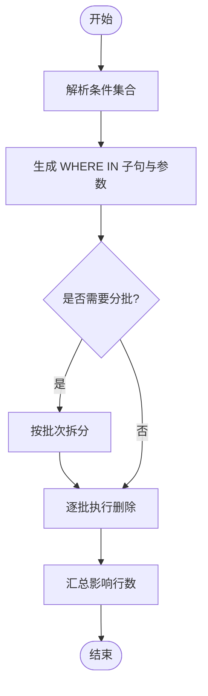
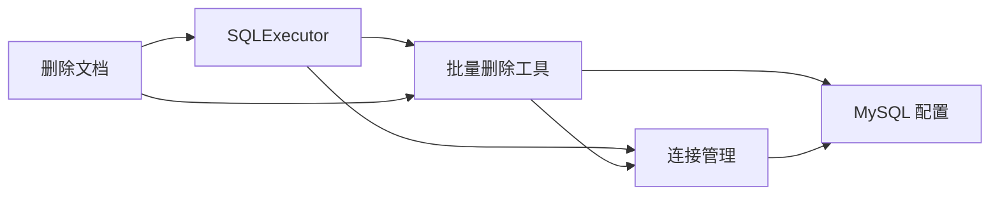

# 批量删除

<cite>
**本文引用的文件**
- [lazy_mysql/executor.py](file://lazy_mysql/executor.py)
- [lazy_mysql/utils/delete.py](file://lazy_mysql/utils/delete.py)
- [lazy_mysql/utils/connect.py](file://lazy_mysql/utils/connect.py)
- [lazy_mysql/dataclasses/mysql_config.py](file://lazy_mysql/dataclasses/mysql_config.py)
- [docs/DELETE.md](file://docs/DELETE.md)
- [docs/CONNECTION.md](file://docs/CONNECTION.md)
</cite>

## 目录
1. [简介](#简介)
2. [项目结构](#项目结构)
3. [核心组件](#核心组件)
4. [架构总览](#架构总览)
5. [详细组件分析](#详细组件分析)
6. [依赖关系分析](#依赖关系分析)
7. [性能考量](#性能考量)
8. [故障排查指南](#故障排查指南)
9. [结论](#结论)
10. [附录](#附录)

## 简介
本节介绍 lazy_mysql 的批量删除能力，重点说明其在大数据量场景下的使用方式、性能优势与注意事项。批量删除通过 SQLExecutor 的 delete 方法支持基于条件集合的批量 WHERE IN 查询，能够显著降低网络往返与事务开销，提升删除效率。

## 项目结构
围绕批量删除功能的关键文件组织如下：
- 执行器：负责构建 SQL、执行语句与事务控制
- 删除工具：封装批量删除的具体逻辑
- 连接管理：提供数据库连接与配置
- 文档：官方文档对删除行为与用法的说明

**图表来源**
- [lazy_mysql/executor.py](file://lazy_mysql/executor.py)
- [lazy_mysql/utils/delete.py](file://lazy_mysql/utils/delete.py)
- [lazy_mysql/utils/connect.py](file://lazy_mysql/utils/connect.py)
- [lazy_mysql/dataclasses/mysql_config.py](file://lazy_mysql/dataclasses/mysql_config.py)
- [docs/DELETE.md](file://docs/DELETE.md)

**章节来源**
- [lazy_mysql/executor.py](file://lazy_mysql/executor.py)
- [lazy_mysql/utils/delete.py](file://lazy_mysql/utils/delete.py)
- [lazy_mysql/utils/connect.py](file://lazy_mysql/utils/connect.py)
- [lazy_mysql/dataclasses/mysql_config.py](file://lazy_mysql/dataclasses/mysql_config.py)
- [docs/DELETE.md](file://docs/DELETE.md)

## 核心组件
- SQLExecutor：统一的 SQL 执行入口，提供 delete 方法用于批量删除；支持事务控制选项与连接管理。
- 批量删除工具（utils.delete）：封装批量删除的条件构造、分批处理与错误处理策略。
- 连接管理（utils.connect）：提供连接创建、关闭与上下文管理，确保事务安全。
- MySQL 配置（dataclasses.mysql_config）：定义连接参数与默认值，为执行器提供配置基础。
- 官方文档（docs/DELETE.md）：明确删除行为、参数约定与最佳实践。

**章节来源**
- [lazy_mysql/executor.py](file://lazy_mysql/executor.py)
- [lazy_mysql/utils/delete.py](file://lazy_mysql/utils/delete.py)
- [lazy_mysql/utils/connect.py](file://lazy_mysql/utils/connect.py)
- [lazy_mysql/dataclasses/mysql_config.py](file://lazy_mysql/dataclasses/mysql_config.py)
- [docs/DELETE.md](file://docs/DELETE.md)

## 架构总览
批量删除的整体流程如下：
- 调用者通过 SQLExecutor 的 delete 方法发起请求
- 执行器根据传入的条件集合生成 WHERE IN 子句
- 使用连接管理模块建立或复用连接
- 在可选的事务范围内执行删除语句
- 返回受影响行数与执行结果

**图表来源**
- [lazy_mysql/executor.py](file://lazy_mysql/executor.py)
- [lazy_mysql/utils/delete.py](file://lazy_mysql/utils/delete.py)
- [lazy_mysql/utils/connect.py](file://lazy_mysql/utils/connect.py)

## 详细组件分析

### SQLExecutor.delete 方法
- 功能：支持基于条件集合的批量删除，内部会将条件集合转换为 WHERE IN 子句。
- 参数要点：
  - 表名：目标表标识
  - 条件集合：通常为键值对列表或等价结构，表示多组删除条件
  - 事务控制选项：决定是否在事务中执行、是否自动提交
- 性能特性：批量删除通过一次 SQL 语句完成多条记录删除，减少网络往返与日志开销。

**章节来源**
- [lazy_mysql/executor.py](file://lazy_mysql/executor.py)

### 批量删除工具（utils.delete）
- 功能：解析输入的条件集合，生成 WHERE IN 子句与参数绑定，必要时进行分批处理以避免单次参数过多。
- 错误处理：捕获并包装底层异常，返回可识别的错误信息。
- 复杂度：时间复杂度近似 O(N)，N 为条件集合大小；空间复杂度取决于参数拼接与分批策略。

**图表来源**
- [lazy_mysql/utils/delete.py](file://lazy_mysql/utils/delete.py)

**章节来源**
- [lazy_mysql/utils/delete.py](file://lazy_mysql/utils/delete.py)

### 连接管理（utils.connect）
- 功能：提供连接创建、关闭与上下文管理，确保在事务控制下正确释放资源。
- 事务集成：配合 SQLExecutor 的事务选项，保证删除操作的原子性与一致性。

**章节来源**
- [lazy_mysql/utils/connect.py](file://lazy_mysql/utils/connect.py)

### MySQL 配置（dataclasses.mysql_config）
- 功能：定义连接参数（如主机、端口、用户名、密码、数据库名等），作为执行器的配置来源。
- 默认值：提供合理的默认值，便于快速上手。

**章节来源**
- [lazy_mysql/dataclasses/mysql_config.py](file://lazy_mysql/dataclasses/mysql_config.py)

### 官方文档（docs/DELETE.md）
- 功能：说明删除行为、参数格式、事务控制与性能建议，是使用批量删除的权威参考。
- 建议：在实际使用前阅读文档，确保参数与事务选项符合预期。

**章节来源**
- [docs/DELETE.md](file://docs/DELETE.md)

## 依赖关系分析
批量删除功能的依赖关系如下：
- SQLExecutor 依赖批量删除工具与连接管理
- 批量删除工具依赖配置模块与连接管理
- 连接管理依赖配置模块
- 文档为使用提供规范与约束

**图表来源**
- [lazy_mysql/executor.py](file://lazy_mysql/executor.py)
- [lazy_mysql/utils/delete.py](file://lazy_mysql/utils/delete.py)
- [lazy_mysql/utils/connect.py](file://lazy_mysql/utils/connect.py)
- [lazy_mysql/dataclasses/mysql_config.py](file://lazy_mysql/dataclasses/mysql_config.py)
- [docs/DELETE.md](file://docs/DELETE.md)

**章节来源**
- [lazy_mysql/executor.py](file://lazy_mysql/executor.py)
- [lazy_mysql/utils/delete.py](file://lazy_mysql/utils/delete.py)
- [lazy_mysql/utils/connect.py](file://lazy_mysql/utils/connect.py)
- [lazy_mysql/dataclasses/mysql_config.py](file://lazy_mysql/dataclasses/mysql_config.py)
- [docs/DELETE.md](file://docs/DELETE.md)

## 性能考量
- 批量删除 vs 单条删除
  - 批量删除：一次 SQL 语句删除多条记录，减少网络往返与日志写入，适合大批量清理
  - 单条删除：每次仅删除一条记录，适合精确控制与细粒度审计
- 条件集合规模
  - 当条件数量较大时，应考虑分批执行，避免单次参数过多导致性能下降或超限
- 事务控制
  - 在事务中执行可保证原子性，但过长事务可能占用锁资源，需权衡提交频率
- 索引与锁
  - 删除涉及的列应具备合适索引，以减少锁范围与等待时间
- 日志与回滚
  - 大批量删除会产生较多日志，注意评估磁盘与复制延迟影响

[本节为通用性能指导，不直接分析具体文件]

## 故障排查指南
- 常见问题
  - 参数格式不正确：确认条件集合的键值对与字段类型匹配
  - 事务未生效：检查事务控制选项与连接上下文
  - 超时或锁等待：优化条件集合规模与索引设计
- 排查步骤
  - 检查 SQLExecutor 的调用参数与返回值
  - 查看连接管理模块的日志与状态
  - 对照官方文档核对参数与事务选项
- 参考文档
  - 删除行为与参数约定请参阅官方文档

**章节来源**
- [docs/DELETE.md](file://docs/DELETE.md)
- [docs/CONNECTION.md](file://docs/CONNECTION.md)

## 结论
lazy_mysql 的批量删除通过 SQLExecutor 的 delete 方法与批量删除工具协同工作，在大数据量场景下显著优于单条删除。合理使用 WHERE IN 条件集合、分批策略与事务控制，可在保证一致性的同时获得更优性能。

[本节为总结性内容，不直接分析具体文件]

## 附录
- 使用建议
  - 明确删除范围与条件集合，避免误删
  - 在测试环境验证批量删除效果后再上线
  - 结合业务需求选择合适的事务粒度与提交频率
- 参考路径
  - 删除文档：[docs/DELETE.md](file://docs/DELETE.md)
  - 连接文档：[docs/CONNECTION.md](file://docs/CONNECTION.md)

[本节为补充说明，不直接分析具体文件]