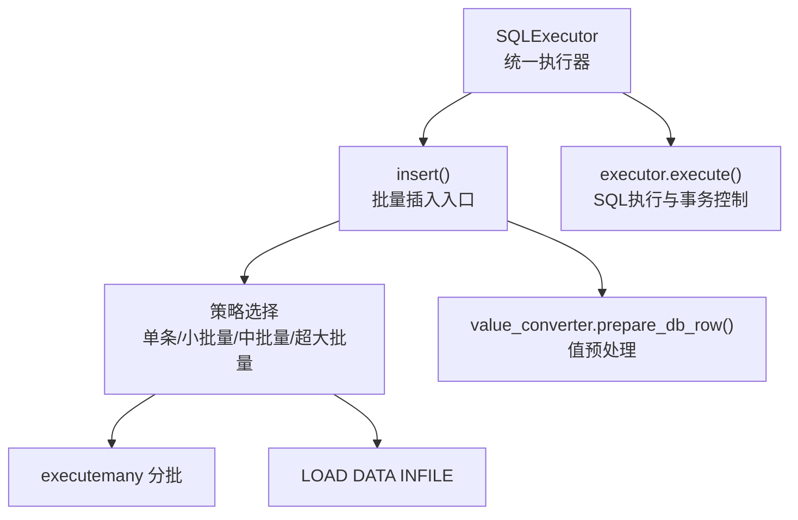
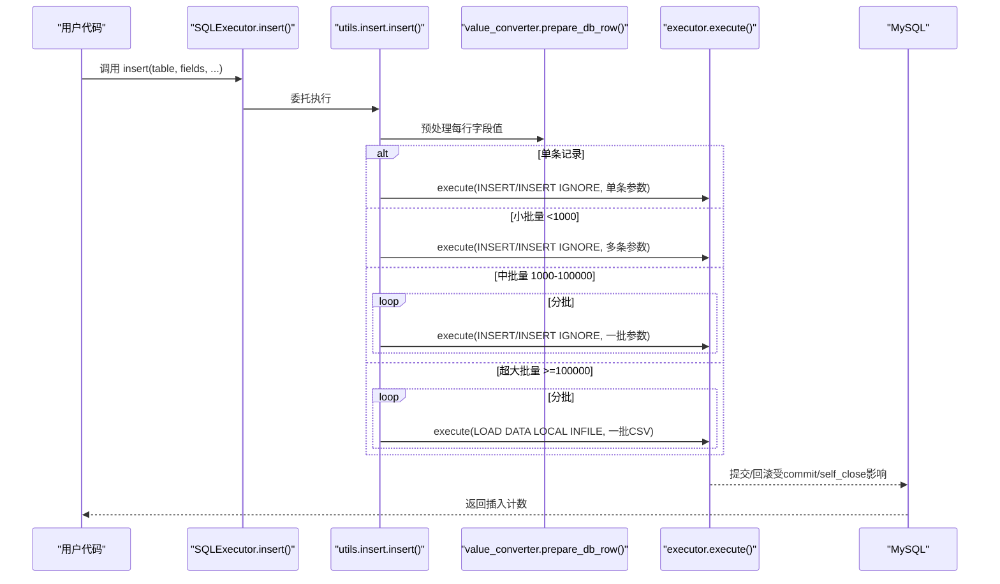
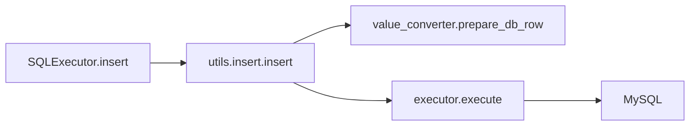

# 批量插入

<cite>
**本文引用的文件**
- [executor.py](file://lazy_mysql/executor.py)
- [insert.py](file://lazy_mysql/utils/insert.py)
- [value_converter.py](file://lazy_mysql/utils/value_converter.py)
- [INSERT.md](file://docs/INSERT.md)
</cite>

## 目录
1. [简介](#简介)
2. [项目结构](#项目结构)
3. [核心组件](#核心组件)
4. [架构总览](#架构总览)
5. [详细组件分析](#详细组件分析)
6. [依赖关系分析](#依赖关系分析)
7. [性能考量](#性能考量)
8. [故障排查指南](#故障排查指南)
9. [结论](#结论)
10. [附录](#附录)

## 简介
本篇文档聚焦 lazy_mysql 的批量插入能力，系统讲解其使用场景、性能优势与实现原理，并详细说明如何通过 SQLExecutor 的 insert 方法进行高效批量数据写入，包括数据格式要求、参数传递方式、事务控制选项与错误处理机制。同时对比批量插入与单条插入的差异及适用场景，提供面向生产的性能优化建议与实操指引。

## 项目结构
围绕批量插入的关键文件组织如下：
- 执行入口与统一接口：SQLExecutor（对外暴露 insert/upsert/update/delete/select 等方法）
- 批量插入实现：lazy_mysql/utils/insert.py（策略选择、分批执行、LOAD DATA INFILE）
- 数据类型转换：lazy_mysql/utils/value_converter.py（Pandas/NumPy/JSON/时间类型等标准化）
- 文档与示例：docs/INSERT.md（使用说明、参数表、示例与最佳实践）

图表来源
- [executor.py:213-234](file://lazy_mysql/executor.py#L213-L234)
- [insert.py:7-72](file://lazy_mysql/utils/insert.py#L7-L72)
- [value_converter.py:113-115](file://lazy_mysql/utils/value_converter.py#L113-L115)

章节来源
- [executor.py:14-616](file://lazy_mysql/executor.py#L14-L616)
- [insert.py:1-287](file://lazy_mysql/utils/insert.py#L1-L287)
- [value_converter.py:1-115](file://lazy_mysql/utils/value_converter.py#L1-L115)
- [INSERT.md:1-243](file://docs/INSERT.md#L1-L243)

## 核心组件
- SQLExecutor.insert：对外提供的批量插入统一入口，内部委派至 lazy_mysql/utils/insert.py 的 insert 方法；支持 skip_duplicate、commit、self_close 等参数。
- insert.py：实现智能策略选择与执行，涵盖单条、小批量（executemany）、中批量（分批executemany）、超大批量（LOAD DATA INFILE）。
- value_converter：负责将 Pandas/NumPy/JSON/时间/字节等复杂类型安全转换为数据库可接受的值，保证批量写入的稳定性与正确性。
- INSERT.md：官方使用指南，包含参数说明、示例与性能基准。

章节来源
- [executor.py:213-234](file://lazy_mysql/executor.py#L213-L234)
- [insert.py:7-72](file://lazy_mysql/utils/insert.py#L7-L72)
- [value_converter.py:74-115](file://lazy_mysql/utils/value_converter.py#L74-L115)
- [INSERT.md:28-53](file://docs/INSERT.md#L28-L53)

## 架构总览
批量插入的整体调用链路如下：

图表来源
- [executor.py:213-234](file://lazy_mysql/executor.py#L213-L234)
- [insert.py:35-66](file://lazy_mysql/utils/insert.py#L35-L66)
- [insert.py:162-244](file://lazy_mysql/utils/insert.py#L162-L244)
- [insert.py:247-287](file://lazy_mysql/utils/insert.py#L247-L287)
- [value_converter.py:113-115](file://lazy_mysql/utils/value_converter.py#L113-L115)

## 详细组件分析

### SQLExecutor.insert 方法
- 职责：对外暴露统一的批量插入接口，内部委派给 utils.insert.insert 并透传参数（表名、字段、是否跳过重复、是否自动提交、是否自动关闭连接等）。
- 事务控制：通过 commit/self_close 控制提交时机与连接生命周期。
- 错误处理：底层由 executor.execute 统一封装，异常时自动回滚并重连（见 executor._handle_connection_error）。

章节来源
- [executor.py:213-234](file://lazy_mysql/executor.py#L213-L234)

### 批量插入策略选择
- 单条记录（dict）：使用传统 INSERT 或 INSERT IGNORE（当 skip_duplicate=True）。
- 小批量（<1000）：直接使用 executemany，一次性发送多条参数。
- 中批量（1000-100000）：分批执行 executemany，批大小随体量调整（1000/5000）。
- 超大批量（≥100000）：使用 LOAD DATA LOCAL INFILE，按 50000 条/批写入临时 CSV 文件并导入。

章节来源
- [insert.py:35-66](file://lazy_mysql/utils/insert.py#L35-L66)
- [INSERT.md:7-13](file://docs/INSERT.md#L7-L13)

### 数据格式与参数传递
- 字段输入：支持单条字典或字典列表；列表为空时快速返回 0。
- 字段顺序：以首行字段为准，确保后续批次字段顺序一致。
- 值预处理：通过 value_converter.prepare_db_row 将复杂类型（Pandas/Timestamp/JSON/字节数组等）标准化，避免写入异常。
- 跳过重复：当 skip_duplicate=True 时，使用 INSERT IGNORE；仅对主键或唯一索引生效。

章节来源
- [insert.py:29-33](file://lazy_mysql/utils/insert.py#L29-L33)
- [insert.py:35-41](file://lazy_mysql/utils/insert.py#L35-L41)
- [insert.py:43-66](file://lazy_mysql/utils/insert.py#L43-L66)
- [insert.py:100-110](file://lazy_mysql/utils/insert.py#L100-L110)
- [value_converter.py:74-115](file://lazy_mysql/utils/value_converter.py#L74-L115)

### 事务控制与连接管理
- commit=True：每次执行后立即提交；分批场景下每批提交一次。
- commit=False：由上层统一提交；适合多表/多步骤原子性场景。
- self_close=True：在提交完成后自动关闭连接，避免资源泄漏。
- 异常回滚：底层 _handle_connection_error 在连接异常时自动回滚并尝试重连。

章节来源
- [executor.py:109-124](file://lazy_mysql/executor.py#L109-L124)
- [executor.py:62-106](file://lazy_mysql/executor.py#L62-L106)

### 分批执行（executemany 优化）
- 分批大小：1000（1000-50000）与 5000（50000-100000）两种策略。
- 进度输出：打印当前批次范围与累计插入计数，便于监控。
- 返回值：返回本次调用累计插入条数。

章节来源
- [insert.py:247-287](file://lazy_mysql/utils/insert.py#L247-L287)

### 超大批量导入（LOAD DATA INFILE）
- 适用场景：≥100000 条记录。
- 流程：逐批将字段序列化为 CSV，使用 LOAD DATA LOCAL INFILE 导入；每批独立提交。
- 性能：官方文档标注可比传统方法快 20-50 倍，内存占用低。
- 临时文件：自动创建/清理 CSV 文件；支持指定 temp_dir。
- 跳过重复：通过 IGNORE INTO TABLE 实现。

章节来源
- [insert.py:162-244](file://lazy_mysql/utils/insert.py#L162-L244)
- [INSERT.md:152-194](file://docs/INSERT.md#L152-L194)

### 错误处理与重试机制
- 可重试错误：连接丢失、读取超时、连接超时等，自动关闭并重建连接后重试一次。
- 回滚策略：若需要提交且发生异常，自动执行回滚并抛出异常。
- 异常传播：最终抛出统一异常，提示 SQL 操作失败与错误详情。

章节来源
- [executor.py:62-106](file://lazy_mysql/executor.py#L62-L106)

### 与单条插入的区别与适用场景
- 单条插入：适合少量数据或需要严格逐条校验的场景；性能较低。
- 批量插入：适合中大规模数据写入；自动选择最优策略，显著提升吞吐。
- UPSERT：当需要“存在则更新，不存在则插入”时使用 upsert 接口，与批量插入策略互补。

章节来源
- [INSERT.md:196-217](file://docs/INSERT.md#L196-L217)
- [executor.py:237-253](file://lazy_mysql/executor.py#L237-L253)

## 依赖关系分析
- SQLExecutor.insert 依赖 utils.insert.insert。
- utils.insert.insert 依赖 value_converter.prepare_db_row 与 executor.execute。
- executor.execute 支持单条/批量参数格式，并内置可重试的连接错误处理与事务控制。

图表来源
- [executor.py:213-234](file://lazy_mysql/executor.py#L213-L234)
- [insert.py:7-72](file://lazy_mysql/utils/insert.py#L7-L72)
- [value_converter.py:113-115](file://lazy_mysql/utils/value_converter.py#L113-L115)

章节来源
- [executor.py:126-185](file://lazy_mysql/executor.py#L126-L185)
- [insert.py:74-98](file://lazy_mysql/utils/insert.py#L74-L98)

## 性能考量
- 策略选择：根据数据规模自动选择最优策略，避免单条 INSERT 的 O(n) 开销。
- 分批大小：中等体量采用更大批次（5000）以减少往返次数；超大体量采用固定 50000 条/批，兼顾内存与吞吐。
- LOAD DATA INFILE：在海量数据场景下显著降低网络与协议开销，适合离线/后台任务。
- 值预处理：统一 JSON/时间/字节等类型转换，减少写入失败与二次处理成本。
- 事务粒度：合理设置 commit，避免长事务锁竞争；必要时手动控制提交以保证一致性。

章节来源
- [INSERT.md:156-160](file://docs/INSERT.md#L156-L160)
- [insert.py:247-287](file://lazy_mysql/utils/insert.py#L247-L287)
- [insert.py:162-244](file://lazy_mysql/utils/insert.py#L162-L244)

## 故障排查指南
- 连接异常（丢失/超时）：系统自动重连并重试一次；若仍失败，会回滚事务并抛出异常。
- 无结果集错误：常见于游标提前关闭或非查询语句误用查询接口，需检查连接生命周期与 SQL 类型。
- 重复键冲突：skip_duplicate=True 仅对主键/唯一索引生效；普通索引不会跳过重复。
- 超大批量导入失败：检查 MySQL 服务器是否允许 LOCAL INFILE、max_allowed_packet、innodb_buffer_pool_size 等参数；确认磁盘空间与 temp_dir 权限。
- 性能不达预期：核对数据规模与策略匹配；适当增大批大小（在内存与稳定性之间权衡）；避免在循环中频繁创建连接。

章节来源
- [executor.py:62-106](file://lazy_mysql/executor.py#L62-L106)
- [INSERT.md:142-146](file://docs/INSERT.md#L142-L146)
- [INSERT.md:221-229](file://docs/INSERT.md#L221-L229)

## 结论
lazy_mysql 的批量插入通过“策略自适应 + 分批执行 + 值预处理 + 事务与重试”的组合，在不同数据规模下均能获得稳定且优异的性能表现。对于中小规模数据优先使用分批 executemany，超大规模数据则采用 LOAD DATA INFILE。配合合理的事务控制与服务器参数优化，可在生产环境中实现高效、可靠的批量写入。

## 附录
- 使用示例与参数说明可参考官方文档：[INSERT.md:55-121](file://docs/INSERT.md#L55-L121)
- 事务管理与生产环境建议：[INSERT.md:196-242](file://docs/INSERT.md#L196-L242)