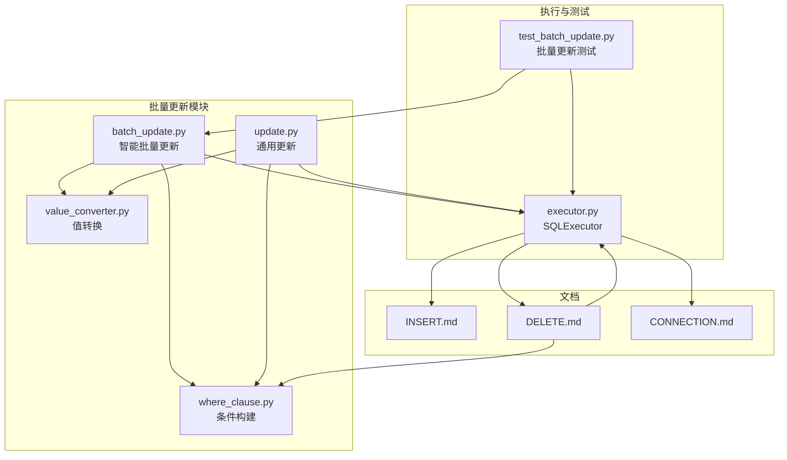
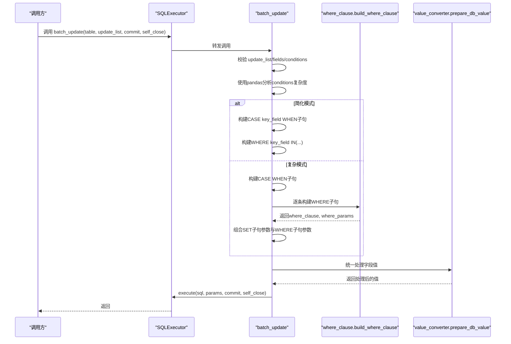
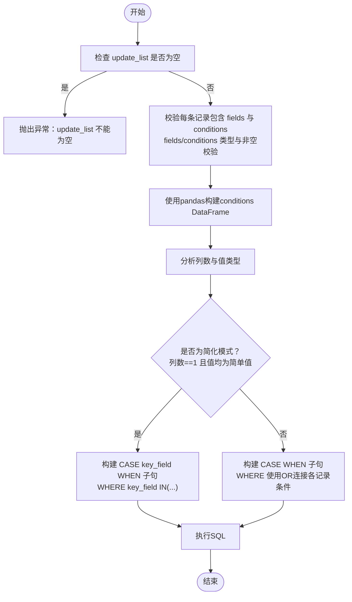
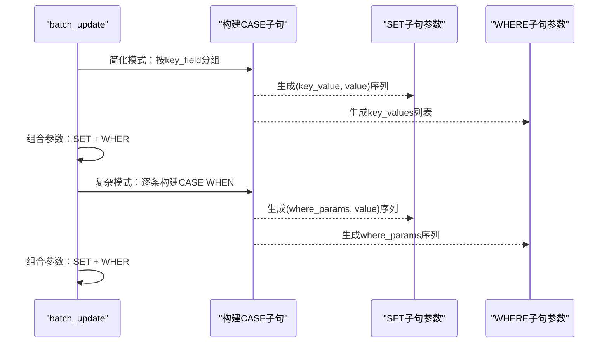
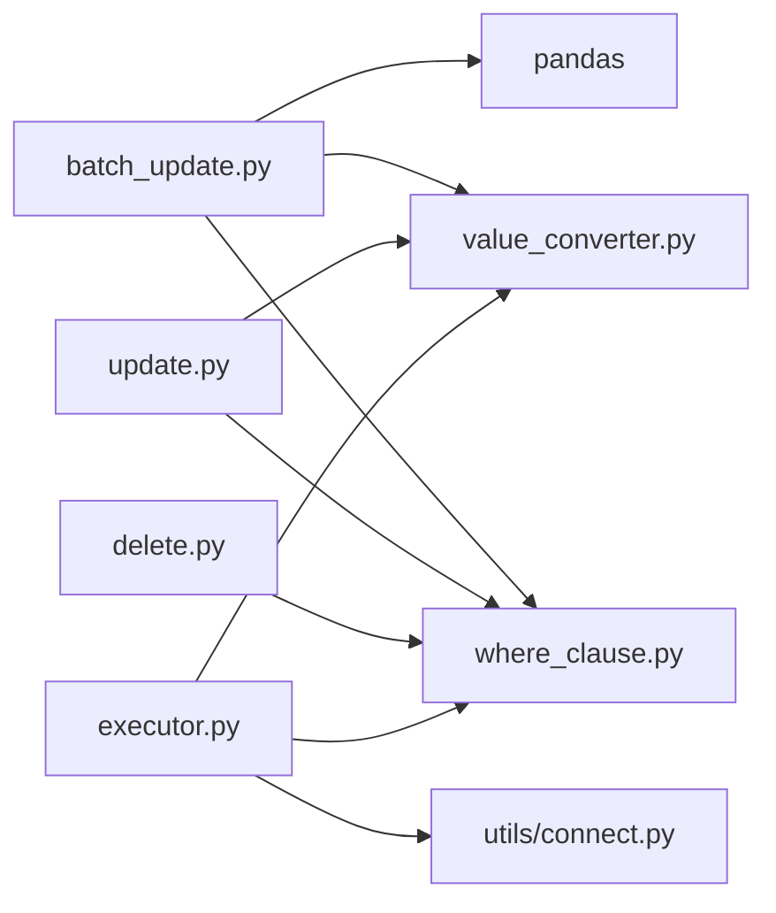

# 批量数据操作

<cite>
**本文引用的文件**
- [batch_update.py](file://lazy_mysql/utils/update/batch_update.py)
- [update.py](file://lazy_mysql/utils/update/update.py)
- [delete.py](file://lazy_mysql/utils/delete.py)
- [where_clause.py](file://lazy_mysql/tools/where_clause.py)
- [value_converter.py](file://lazy_mysql/utils/value_converter.py)
- [executor.py](file://lazy_mysql/executor.py)
- [test_batch_update.py](file://tests/test_batch_update.py)
- [INSERT.md](file://docs/INSERT.md)
- [DELETE.md](file://docs/DELETE.md)
- [CONNECTION.md](file://docs/CONNECTION.md)
</cite>

## 目录
1. [简介](#简介)
2. [项目结构](#项目结构)
3. [核心组件](#核心组件)
4. [架构总览](#架构总览)
5. [详细组件分析](#详细组件分析)
6. [依赖分析](#依赖分析)
7. [性能考量](#性能考量)
8. [故障排查指南](#故障排查指南)
9. [结论](#结论)
10. [附录](#附录)

## 简介
本节聚焦 lazy_mysql 的批量数据操作能力，尤其是批量更新的“智能批量更新算法”。内容涵盖：
- 批量插入、批量更新、批量删除的实现原理与使用方法
- 智能批量更新算法：简化模式与复杂模式的判定逻辑
- CASE WHEN 语法的两种实现方式及其参数顺序
- 性能优化策略与最佳实践
- 参数配置、错误处理与事务控制
- 通过测试用例展示单一字段条件与多字段复杂条件的更新场景

## 项目结构
围绕批量更新与相关工具，关键文件如下：
- 批量更新：lazy_mysql/utils/update/batch_update.py
- 通用更新：lazy_mysql/utils/update/update.py
- 批量删除：lazy_mysql/utils/delete.py
- 条件构建：lazy_mysql/tools/where_clause.py
- 值转换：lazy_mysql/utils/value_converter.py
- 执行器：lazy_mysql/executor.py
- 测试：tests/test_batch_update.py
- 文档：docs/INSERT.md、docs/DELETE.md、docs/CONNECTION.md

图表来源
- [batch_update.py:1-313](file://lazy_mysql/utils/update/batch_update.py#L1-L313)
- [update.py:1-44](file://lazy_mysql/utils/update/update.py#L1-L44)
- [delete.py:1-26](file://lazy_mysql/utils/delete.py#L1-L26)
- [where_clause.py:1-127](file://lazy_mysql/tools/where_clause.py#L1-L127)
- [value_converter.py:1-115](file://lazy_mysql/utils/value_converter.py#L1-L115)
- [executor.py:1-616](file://lazy_mysql/executor.py#L1-L616)
- [test_batch_update.py:1-192](file://tests/test_batch_update.py#L1-L192)
- [INSERT.md:1-243](file://docs/INSERT.md#L1-L243)
- [DELETE.md:1-122](file://docs/DELETE.md#L1-L122)
- [CONNECTION.md:1-334](file://docs/CONNECTION.md#L1-L334)

章节来源
- [batch_update.py:1-313](file://lazy_mysql/utils/update/batch_update.py#L1-L313)
- [executor.py:272-306](file://lazy_mysql/executor.py#L272-L306)

## 核心组件
- 智能批量更新（batch_update）：自动识别 WHERE 条件复杂度，选择 CASE key_field WHEN（简化模式）或 CASE WHEN ... THEN（复杂模式），并生成单条 UPDATE 语句一次性更新多条记录。
- 通用更新（update）：面向单条记录的动态 WHERE 构建与执行。
- 批量删除（delete）：面向多条记录的动态 WHERE 构建与执行。
- 条件构建（where_clause.build_where_clause）：将字典条件转换为 SQL WHERE 子句与参数列表，支持 IN、比较运算符、NULL/NOT NULL、NDayInterval 等。
- 值转换（value_converter.prepare_db_value/prepare_db_row）：统一处理缺失值、时间类型、JSON 序列化、NumPy/Pandas 类型等，保证写入数据库的类型正确性。
- 执行器（SQLExecutor）：封装连接、执行、提交、关闭、重试与回滚等事务控制与错误处理。

章节来源
- [batch_update.py:6-82](file://lazy_mysql/utils/update/batch_update.py#L6-L82)
- [update.py:4-44](file://lazy_mysql/utils/update/update.py#L4-L44)
- [delete.py:3-26](file://lazy_mysql/utils/delete.py#L3-L26)
- [where_clause.py:42-127](file://lazy_mysql/tools/where_clause.py#L42-L127)
- [value_converter.py:74-115](file://lazy_mysql/utils/value_converter.py#L74-L115)
- [executor.py:126-185](file://lazy_mysql/executor.py#L126-L185)

## 架构总览
批量更新的整体流程如下：
- 输入：SQLExecutor 实例、表名、更新列表（每条包含 fields 与 conditions）、commit/self_close 标志
- 数据校验：确保 update_list 非空、每条记录包含 fields 与 conditions、fields 非空、conditions 非空
- 条件复杂度分析：使用 pandas DataFrame 分析 conditions 的列数与值类型，判断是否为“简化模式”
- SQL 生成：
  - 简化模式：CASE key_field WHEN ... THEN ...，并使用 WHERE key_field IN (...) 限定范围
  - 复杂模式：CASE WHEN ... THEN ...，WHERE 使用 OR 连接各记录的条件
- 参数顺序：严格区分 SET 子句参数与 WHERE 子句参数，保证占位符与值一一对应
- 执行：调用 executor.execute(sql, params, commit, self_close)

图表来源
- [batch_update.py:6-82](file://lazy_mysql/utils/update/batch_update.py#L6-L82)
- [batch_update.py:232-313](file://lazy_mysql/utils/update/batch_update.py#L232-L313)
- [where_clause.py:42-127](file://lazy_mysql/tools/where_clause.py#L42-L127)
- [value_converter.py:74-115](file://lazy_mysql/utils/value_converter.py#L74-L115)
- [executor.py:126-185](file://lazy_mysql/executor.py#L126-L185)

## 详细组件分析

### 智能批量更新算法（简化模式 vs 复杂模式）
- 简化模式（CASE key_field WHEN ... THEN ...）
  - 触发条件：所有记录的 WHERE 条件仅包含一个字段，且该字段值为简单值（非元组）
  - 优点：单条 UPDATE 语句，参数最少，性能最优
  - 适用场景：主键或唯一键作为单一条件的批量更新
- 复杂模式（CASE WHEN ... THEN ...）
  - 触发条件：WHERE 条件包含多字段或包含比较运算符元组
  - 优点：支持任意复杂条件组合
  - 适用场景：跨字段组合条件、范围条件、多表关联条件等

图表来源
- [batch_update.py:40-101](file://lazy_mysql/utils/update/batch_update.py#L40-L101)
- [batch_update.py:232-313](file://lazy_mysql/utils/update/batch_update.py#L232-L313)

章节来源
- [batch_update.py:84-101](file://lazy_mysql/utils/update/batch_update.py#L84-L101)
- [batch_update.py:232-313](file://lazy_mysql/utils/update/batch_update.py#L232-L313)
- [test_batch_update.py:134-156](file://tests/test_batch_update.py#L134-L156)

### CASE WHEN 语法的两种实现方式与参数顺序
- 简化模式（CASE key_field WHEN ... THEN ...）
  - SET 子句参数顺序：按字段遍历，每个字段的 CASE 子句按 (key_value, value) 交替排列
  - WHERE 子句参数：key_field 的 IN(...) 列表
  - 参数总顺序：先 SET 子句参数，再 WHERE 子句参数
- 复杂模式（CASE WHEN ... THEN ...）
  - SET 子句参数顺序：每个 CASE WHEN 的 THEN 值按顺序排列
  - WHERE 子句参数顺序：每个 CASE WHEN 的 WHERE 条件参数按顺序排列
  - 参数总顺序：先 SET 子句参数（WHERE 参数 + THEN 值），再 WHERE 子句参数

图表来源
- [batch_update.py:114-169](file://lazy_mysql/utils/update/batch_update.py#L114-L169)
- [batch_update.py:172-229](file://lazy_mysql/utils/update/batch_update.py#L172-L229)
- [batch_update.py:232-313](file://lazy_mysql/utils/update/batch_update.py#L232-L313)

章节来源
- [batch_update.py:172-229](file://lazy_mysql/utils/update/batch_update.py#L172-L229)
- [batch_update.py:232-313](file://lazy_mysql/utils/update/batch_update.py#L232-L313)
- [test_batch_update.py:14-84](file://tests/test_batch_update.py#L14-L84)
- [test_batch_update.py:86-132](file://tests/test_batch_update.py#L86-L132)

### 单一字段条件与多字段复杂条件的更新场景
- 单一字段条件（简化模式）
  - 示例：按 id 批量更新 name 与 age
  - SQL 形态：UPDATE ... SET name = CASE id WHEN ... THEN ... END, age = CASE id WHEN ... THEN ... END WHERE id IN (...)
- 多字段复杂条件（复杂模式）
  - 示例：按 (order_id, platform) 组合条件或按 id > 100 的范围条件更新
  - SQL 形态：UPDATE ... SET field = CASE WHEN cond1 AND cond2 THEN ... WHEN id > %s THEN ... END WHERE (cond1 AND cond2) OR (id > %s)

章节来源
- [batch_update.py:232-313](file://lazy_mysql/utils/update/batch_update.py#L232-L313)
- [test_batch_update.py:25-84](file://tests/test_batch_update.py#L25-L84)
- [test_batch_update.py:90-132](file://tests/test_batch_update.py#L90-L132)

### 参数配置、错误处理与事务控制
- 参数配置
  - executor.batch_update(table_name, update_list, commit=False, self_close=False)
  - update_list：每条记录包含 fields 与 conditions
  - commit：是否自动提交
  - self_close：是否自动关闭连接
- 错误处理
  - 空列表、字段缺失、fields/conditions 类型错误、fields 为空、conditions 为空等均会抛出异常
  - 条件构建失败（build_where_clause 返回 None）会抛出异常
- 事务控制
  - executor.execute 支持 commit=True 自动提交
  - _handle_connection_error 在连接丢失或超时时尝试重连，并在需要时回滚事务
  - 批量执行时，若发生异常，executor 会回滚并关闭连接

章节来源
- [batch_update.py:40-59](file://lazy_mysql/utils/update/batch_update.py#L40-L59)
- [batch_update.py:158-161](file://lazy_mysql/utils/update/batch_update.py#L158-L161)
- [executor.py:126-185](file://lazy_mysql/executor.py#L126-L185)
- [executor.py:62-107](file://lazy_mysql/executor.py#L62-L107)

### 批量插入、批量更新、批量删除的使用方法
- 批量插入（INSERT）
  - 策略：根据数据量自动选择最优策略（单条、标准 executemany、优化 executemany、LOAD DATA INFILE）
  - 参考文档：docs/INSERT.md
- 批量更新（BATCH UPDATE）
  - 策略：智能模式选择（简化/复杂），单条 UPDATE 一次性更新多条记录
  - 参考实现：lazy_mysql/utils/update/batch_update.py
- 批量删除（DELETE）
  - 策略：动态 WHERE 构建，强制条件非空，防止误删
  - 参考实现：lazy_mysql/utils/delete.py

章节来源
- [INSERT.md:1-243](file://docs/INSERT.md#L1-L243)
- [batch_update.py:6-82](file://lazy_mysql/utils/update/batch_update.py#L6-L82)
- [delete.py:3-26](file://lazy_mysql/utils/delete.py#L3-L26)

## 依赖分析
- batch_update 依赖
  - pandas：用于分析 WHERE 条件的复杂度
  - value_converter：统一处理字段值类型
  - where_clause：构建 WHERE 子句与参数
- update/delete 依赖
  - where_clause：构建 WHERE 子句与参数
  - value_converter：统一处理字段值类型
- executor 依赖
  - 连接管理：utils/connect.connection
  - 执行与事务：execute/commit/rollback/close

图表来源
- [batch_update.py:1-3](file://lazy_mysql/utils/update/batch_update.py#L1-L3)
- [update.py:1-2](file://lazy_mysql/utils/update/update.py#L1-L2)
- [delete.py:1](file://lazy_mysql/utils/delete.py#L1)
- [executor.py:14-24](file://lazy_mysql/executor.py#L14-L24)

章节来源
- [batch_update.py:1-3](file://lazy_mysql/utils/update/batch_update.py#L1-L3)
- [update.py:1-2](file://lazy_mysql/utils/update/update.py#L1-L2)
- [delete.py:1](file://lazy_mysql/utils/delete.py#L1)
- [executor.py:14-24](file://lazy_mysql/executor.py#L14-L24)

## 性能考量
- 简化模式性能最优
  - 单条 UPDATE 语句，参数最少，避免多次往返
  - 使用 WHERE key_field IN (...) 限定范围，减少扫描
- 复杂模式性能次之
  - CASE WHEN 子句较长，但仍是单条语句
  - WHERE 使用 OR 连接多条记录条件，可能影响索引利用
- 值转换与类型处理
  - 统一使用 value_converter.prepare_db_value/prepare_db_row，避免类型不匹配导致的隐式转换开销
- 批量执行与连接
  - executor.execute 支持批量参数（executemany），减少网络往返
  - 连接失败自动重试与回滚，保障稳定性

章节来源
- [batch_update.py:114-169](file://lazy_mysql/utils/update/batch_update.py#L114-L169)
- [batch_update.py:232-313](file://lazy_mysql/utils/update/batch_update.py#L232-L313)
- [value_converter.py:74-115](file://lazy_mysql/utils/value_converter.py#L74-L115)
- [executor.py:126-185](file://lazy_mysql/executor.py#L126-L185)

## 故障排查指南
- 常见错误与定位
  - update_list 为空：抛出异常，检查输入数据
  - fields/conditions 缺失或为空：抛出异常，确保每条记录包含 fields 与 conditions 且非空
  - conditions 构建失败：build_where_clause 返回 None，检查条件格式
- 调试建议
  - 使用测试用例验证参数顺序与 SQL 生成逻辑
  - 在 executor.execute 前打印 SQL 与参数，确认顺序与数量
  - 结合 EXISTS/SELECT 预览将要更新/删除的记录数量
- 事务与连接
  - commit=True 时确保异常发生时会回滚
  - 连接丢失或超时会自动重连并重试

章节来源
- [batch_update.py:40-59](file://lazy_mysql/utils/update/batch_update.py#L40-L59)
- [batch_update.py:158-161](file://lazy_mysql/utils/update/batch_update.py#L158-L161)
- [executor.py:62-107](file://lazy_mysql/executor.py#L62-L107)
- [test_batch_update.py:14-84](file://tests/test_batch_update.py#L14-L84)

## 结论
lazy_mysql 的批量更新通过“简化模式”与“复杂模式”的智能选择，在保证灵活性的同时最大化性能。其核心优势在于：
- 单条 UPDATE 语句完成多条记录更新，减少往返与锁竞争
- 统一的值转换与条件构建，降低类型与 SQL 注入风险
- 严格的参数顺序与错误处理，确保执行稳定可靠
- 与执行器的事务控制与重试机制协同，提升生产可用性

## 附录
- 使用示例与最佳实践
  - 连接初始化：参考 docs/CONNECTION.md
  - 批量插入：参考 docs/INSERT.md
  - 批量删除：参考 docs/DELETE.md
- 测试用例
  - 批量更新参数顺序与模式判定：tests/test_batch_update.py

章节来源
- [CONNECTION.md:1-334](file://docs/CONNECTION.md#L1-L334)
- [INSERT.md:1-243](file://docs/INSERT.md#L1-L243)
- [DELETE.md:1-122](file://docs/DELETE.md#L1-L122)
- [test_batch_update.py:1-192](file://tests/test_batch_update.py#L1-L192)