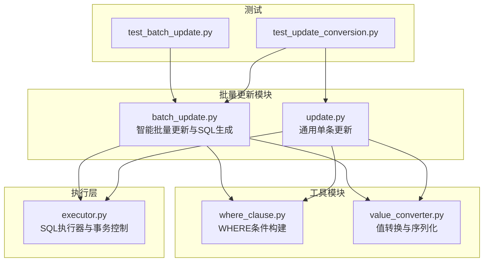
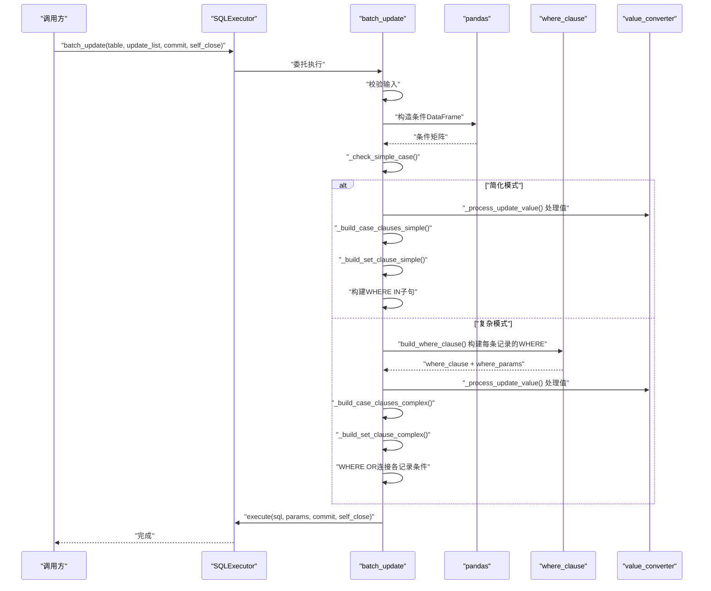
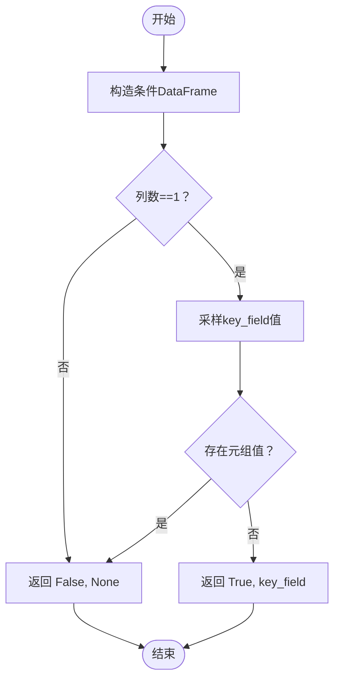
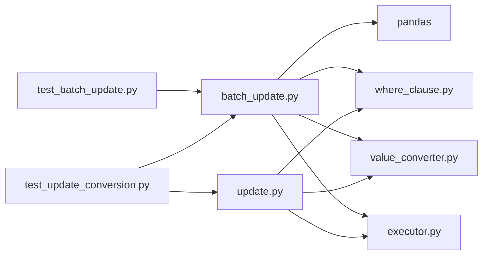

# 智能批量更新

<cite>
**本文引用的文件**
- [batch_update.py](file://lazy_mysql/utils/update/batch_update.py)
- [update.py](file://lazy_mysql/utils/update/update.py)
- [where_clause.py](file://lazy_mysql/tools/where_clause.py)
- [value_converter.py](file://lazy_mysql/utils/value_converter.py)
- [executor.py](file://lazy_mysql/executor.py)
- [test_batch_update.py](file://tests/test_batch_update.py)
- [test_update_conversion.py](file://tests/test_update_conversion.py)
- [README.md](file://README.md)
</cite>

## 目录
1. [简介](#简介)
2. [项目结构](#项目结构)
3. [核心组件](#核心组件)
4. [架构总览](#架构总览)
5. [详细组件分析](#详细组件分析)
6. [依赖关系分析](#依赖关系分析)
7. [性能考量](#性能考量)
8. [故障排查指南](#故障排查指南)
9. [结论](#结论)
10. [附录](#附录)

## 简介
本章节聚焦 lazy_mysql 的“智能批量更新”能力，这是批量操作的核心特性。它通过 pandas 对 WHERE 条件复杂度进行分析，自动在两种 CASE 语法之间切换：
- 简化模式：使用 CASE key_field WHEN 语法（性能最优）
- 复杂模式：使用 CASE WHEN ... THEN 语法（支持多字段与复杂条件）

同时，文档将给出完整使用示例、参数构建策略、错误处理机制、事务控制选项，并提供性能对比与最佳实践建议。

## 项目结构
与智能批量更新直接相关的模块与文件如下：
- 批量更新入口与策略选择：lazy_mysql/utils/update/batch_update.py
- 通用更新（单条）：lazy_mysql/utils/update/update.py
- WHERE 条件构建：lazy_mysql/tools/where_clause.py
- 值转换与序列化：lazy_mysql/utils/value_converter.py
- 执行器封装与事务控制：lazy_mysql/executor.py
- 单元测试：tests/test_batch_update.py、tests/test_update_conversion.py
- 项目概览与使用示例：README.md

图表来源
- [batch_update.py:1-313](file://lazy_mysql/utils/update/batch_update.py#L1-L313)
- [update.py:1-44](file://lazy_mysql/utils/update/update.py#L1-L44)
- [where_clause.py:1-127](file://lazy_mysql/tools/where_clause.py#L1-L127)
- [value_converter.py:1-115](file://lazy_mysql/utils/value_converter.py#L1-L115)
- [executor.py:125-185](file://lazy_mysql/executor.py#L125-L185)
- [test_batch_update.py:1-192](file://tests/test_batch_update.py#L1-L192)
- [test_update_conversion.py:1-136](file://tests/test_update_conversion.py#L1-L136)

章节来源
- [batch_update.py:1-313](file://lazy_mysql/utils/update/batch_update.py#L1-L313)
- [executor.py:271-306](file://lazy_mysql/executor.py#L271-L306)

## 核心组件
- 智能批量更新函数：负责输入校验、pandas 分析 WHERE 条件复杂度、选择 CASE 语法、组装 SQL 并调用执行器。
- WHERE 条件构建器：支持等值、比较、IN/NOT IN、IS NULL/IS NOT NULL、NDayInterval 等。
- 值转换器：统一处理缺失值、时间类型、JSON 序列化、pandas 类型等。
- 执行器：封装 execute、commit、commit_close，支持参数化执行与事务控制。
- 单元测试：覆盖参数顺序、简化/复杂模式判定、值转换一致性等。

章节来源
- [batch_update.py:6-82](file://lazy_mysql/utils/update/batch_update.py#L6-L82)
- [where_clause.py:42-127](file://lazy_mysql/tools/where_clause.py#L42-L127)
- [value_converter.py:74-115](file://lazy_mysql/utils/value_converter.py#L74-L115)
- [executor.py:125-185](file://lazy_mysql/executor.py#L125-L185)
- [test_batch_update.py:14-156](file://tests/test_batch_update.py#L14-L156)
- [test_update_conversion.py:27-136](file://tests/test_update_conversion.py#L27-L136)

## 架构总览
智能批量更新的整体流程如下：
- 输入校验：确保 update_list 非空、每个元素包含 fields 与 conditions、fields 非空、conditions 非空。
- 条件复杂度分析：使用 pandas DataFrame 统计 WHERE 条件维度与取值类型，判断是否为“单一字段 + 简单值”的简化模式。
- CASE 语法选择：
  - 简化模式：CASE key_field WHEN ... THEN，生成 SET 子句与 WHERE IN 子句。
  - 复杂模式：CASE WHEN ... THEN，逐条记录构建 WHERE 条件并通过 OR 连接。
- 参数构建：严格遵循参数顺序，保证 SET 子句参数在前、WHERE 子句参数在后。
- 执行与事务：调用执行器执行 SQL，支持 commit 与 self_close 控制。

图表来源
- [batch_update.py:6-82](file://lazy_mysql/utils/update/batch_update.py#L6-L82)
- [batch_update.py:84-101](file://lazy_mysql/utils/update/batch_update.py#L84-L101)
- [batch_update.py:114-135](file://lazy_mysql/utils/update/batch_update.py#L114-L135)
- [batch_update.py:138-169](file://lazy_mysql/utils/update/batch_update.py#L138-L169)
- [batch_update.py:172-200](file://lazy_mysql/utils/update/batch_update.py#L172-L200)
- [batch_update.py:202-229](file://lazy_mysql/utils/update/batch_update.py#L202-L229)
- [batch_update.py:232-264](file://lazy_mysql/utils/update/batch_update.py#L232-L264)
- [batch_update.py:267-313](file://lazy_mysql/utils/update/batch_update.py#L267-L313)
- [where_clause.py:42-127](file://lazy_mysql/tools/where_clause.py#L42-L127)
- [value_converter.py:104-111](file://lazy_mysql/utils/value_converter.py#L104-L111)
- [executor.py:125-185](file://lazy_mysql/executor.py#L125-L185)

## 详细组件分析

### 智能模式判断逻辑
- 输入：update_list 中每个元素的 conditions 字典。
- 判定依据：
  - 条件字段数必须为 1（len(columns) == 1）。
  - 该字段的所有取值必须为简单值（非元组），即不包含比较运算符或范围。
- 返回：(is_simple_case, key_field)，若为简化模式，key_field 为主键字段名；否则返回 False, None。

图表来源
- [batch_update.py:84-101](file://lazy_mysql/utils/update/batch_update.py#L84-L101)

章节来源
- [batch_update.py:84-101](file://lazy_mysql/utils/update/batch_update.py#L84-L101)
- [test_batch_update.py:134-156](file://tests/test_batch_update.py#L134-L156)

### CASE 语法实现方式
- 简化模式（CASE key_field WHEN ... THEN）：
  - 优点：性能最优，SQL 结构简单，参数顺序清晰。
  - 适用：WHERE 条件仅包含单一字段且为简单值。
  - SET 子句参数顺序：先 key_value1, value1, key_value2, value2, ...，再 WHERE IN 的 key_values。
- 复杂模式（CASE WHEN ... THEN）：
  - 适用：多字段条件、带比较运算符、IN/NOT IN、NULL/NOT NULL、表达式等。
  - WHERE 子句：不同记录的条件用 OR 连接，每条记录内部的多个条件用 AND 连接。
  - SET 子句参数顺序：先每条 CASE WHEN 的 where_params，再 THEN 的 value；最后 WHERE 子句的 where_params。

章节来源
- [batch_update.py:114-135](file://lazy_mysql/utils/update/batch_update.py#L114-L135)
- [batch_update.py:138-169](file://lazy_mysql/utils/update/batch_update.py#L138-L169)
- [batch_update.py:172-200](file://lazy_mysql/utils/update/batch_update.py#L172-L200)
- [batch_update.py:202-229](file://lazy_mysql/utils/update/batch_update.py#L202-L229)
- [batch_update.py:232-264](file://lazy_mysql/utils/update/batch_update.py#L232-L264)
- [batch_update.py:267-313](file://lazy_mysql/utils/update/batch_update.py#L267-L313)

### 参数构建策略
- 简化模式参数顺序：
  - SET 子句：按字段遍历，每个 CASE WHEN 添加 (key_value, value)。
  - WHERE IN：按 key_field 值列表。
- 复杂模式参数顺序：
  - SET 子句：按记录遍历，每个 CASE WHEN 添加 where_params + value。
  - WHERE 子句：按记录遍历，WHERE 条件 where_params 用 OR 连接。
- 值转换：统一调用 prepare_db_value/prepare_db_row，确保缺失值、时间类型、JSON、pandas 类型正确处理。

章节来源
- [batch_update.py:172-200](file://lazy_mysql/utils/update/batch_update.py#L172-L200)
- [batch_update.py:202-229](file://lazy_mysql/utils/update/batch_update.py#L202-L229)
- [batch_update.py:104-111](file://lazy_mysql/utils/update/batch_update.py#L104-L111)
- [value_converter.py:74-115](file://lazy_mysql/utils/value_converter.py#L74-L115)

### 错误处理机制
- 输入校验：
  - update_list 不能为空。
  - 每个元素必须包含 'fields' 和 'conditions'。
  - fields 必须为非空字典；conditions 必须为非空字典。
- WHERE 条件构建：
  - 若 build_where_clause 返回 None，则抛出 ValueError。
- 值转换：
  - _validate_param_value 会拒绝 numpy 类型与无法 JSON 序列化的 dict。
- 执行器：
  - execute 支持 commit/self_close；异常时触发 _handle_connection_error，必要时回滚并重连。

章节来源
- [batch_update.py:40-58](file://lazy_mysql/utils/update/batch_update.py#L40-L58)
- [batch_update.py:155-161](file://lazy_mysql/utils/update/batch_update.py#L155-L161)
- [where_clause.py:17-39](file://lazy_mysql/tools/where_clause.py#L17-L39)
- [executor.py:125-185](file://lazy_mysql/executor.py#L125-L185)

### 事务控制选项
- commit：执行完成后是否自动提交。
- self_close：执行完成后是否自动关闭连接。
- 执行器内部在 commit=True 时调用 mydb.commit()，在 self_close=True 时调用 close()。

章节来源
- [batch_update.py:21-23](file://lazy_mysql/utils/update/batch_update.py#L21-L23)
- [executor.py:174-184](file://lazy_mysql/executor.py#L174-L184)

### 使用示例与最佳实践
- 单一字段条件（简化模式）：
  - 场景：按主键 id 批量更新 name/age。
  - 特点：自动使用 CASE key_field WHEN 语法，性能最优。
- 多字段复杂条件（复杂模式）：
  - 场景：按 id+type 组合条件或 id > 某值等。
  - 特点：逐条记录构建 WHERE 条件并通过 OR 连接，支持任意复杂条件。
- 最佳实践：
  - 优先设计单一字段的 WHERE 条件，便于使用简化模式。
  - 大批量更新时启用 commit=True，减少中间状态。
  - 使用 self_close=True 在脚本末尾自动释放资源。
  - 对包含嵌套结构或时间类型的字段，确保值转换器正常工作。

章节来源
- [batch_update.py:25-39](file://lazy_mysql/utils/update/batch_update.py#L25-L39)
- [test_batch_update.py:86-132](file://tests/test_batch_update.py#L86-L132)
- [test_update_conversion.py:53-136](file://tests/test_update_conversion.py#L53-L136)

## 依赖关系分析
- batch_update 依赖：
  - pandas：用于条件复杂度分析与字段聚合。
  - where_clause：构建复杂模式下的 WHERE 子句。
  - value_converter：统一值转换。
  - executor：最终执行 SQL。
- update 依赖：
  - where_clause、value_converter、executor。
- 测试依赖：
  - 对 batch_update 的内部函数进行单元测试，覆盖参数顺序与模式判定。

图表来源
- [batch_update.py:1-3](file://lazy_mysql/utils/update/batch_update.py#L1-L3)
- [update.py:1-2](file://lazy_mysql/utils/update/update.py#L1-L2)
- [where_clause.py:1-2](file://lazy_mysql/tools/where_clause.py#L1-L2)
- [value_converter.py:1-6](file://lazy_mysql/utils/value_converter.py#L1-L6)
- [executor.py:125-185](file://lazy_mysql/executor.py#L125-L185)
- [test_batch_update.py:5-10](file://tests/test_batch_update.py#L5-L10)
- [test_update_conversion.py:6-7](file://tests/test_update_conversion.py#L6-L7)

## 性能考量
- 简化模式（CASE key_field WHEN ... THEN）：
  - 优点：SQL 结构简单，参数少，执行计划稳定，适合大批量单一主键更新。
  - 适用：WHERE 条件为单一字段且为简单值。
- 复杂模式（CASE WHEN ... THEN）：
  - 优点：灵活支持多字段、IN/NOT IN、表达式等复杂条件。
  - 成本：参数较多，SQL 较长，但仍是单次 DML 语句，优于多次单条更新。
- 参数顺序与类型转换：
  - 统一使用 prepare_db_value/prepare_db_row，避免类型不一致导致的隐性性能损耗。
- 事务与连接：
  - 批量更新建议 commit=True，减少中间事务开销。
  - 使用 self_close=True 避免连接泄漏。

章节来源
- [batch_update.py:114-135](file://lazy_mysql/utils/update/batch_update.py#L114-L135)
- [batch_update.py:138-169](file://lazy_mysql/utils/update/batch_update.py#L138-L169)
- [value_converter.py:74-115](file://lazy_mysql/utils/value_converter.py#L74-L115)
- [executor.py:174-184](file://lazy_mysql/executor.py#L174-L184)

## 故障排查指南
- “update_list 不能为空”：检查传入列表是否为空。
- “fields/conditions 缺失”：确认每个元素包含 fields 与 conditions。
- “fields 为空”：确保至少有一个字段需要更新。
- “conditions 为空”：避免导致全表更新，抛出异常。
- “conditions 构建失败”：检查复杂模式下 WHERE 条件格式是否合法。
- “numpy 类型或 Dict 无法序列化”：确保值转换器能处理对应类型。
- “参数顺序错误”：参考单元测试断言，确保 SET 子句参数在前、WHERE 子句参数在后。

章节来源
- [batch_update.py:40-58](file://lazy_mysql/utils/update/batch_update.py#L40-L58)
- [batch_update.py:155-161](file://lazy_mysql/utils/update/batch_update.py#L155-L161)
- [where_clause.py:17-39](file://lazy_mysql/tools/where_clause.py#L17-L39)
- [test_batch_update.py:14-84](file://tests/test_batch_update.py#L14-L84)

## 结论
lazy_mysql 的智能批量更新通过 pandas 对 WHERE 条件进行快速分析，在“简化模式”与“复杂模式”间自动切换，既保证灵活性又兼顾性能。其严格的参数顺序与统一的值转换策略，使得在复杂业务场景下仍能保持高可靠性和高效率。结合事务控制与连接管理的最佳实践，可在生产环境中稳定运行大规模批量更新任务。

## 附录
- 使用示例参考：
  - 单一字段条件：见 [batch_update.py:25-39](file://lazy_mysql/utils/update/batch_update.py#L25-L39)
  - 复杂条件：见 [batch_update.py:33-38](file://lazy_mysql/utils/update/batch_update.py#L33-L38)
- 性能对比与最佳实践参考：
  - 项目 README 的性能优势表格：见 [README.md:180-188](file://README.md#L180-L188)