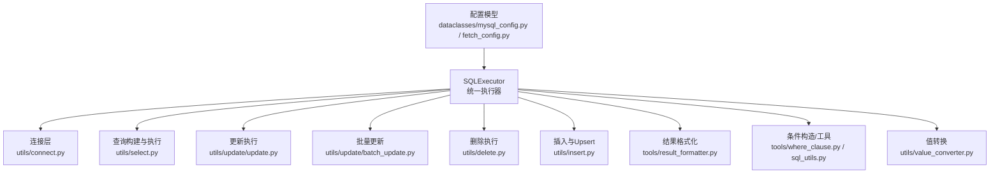
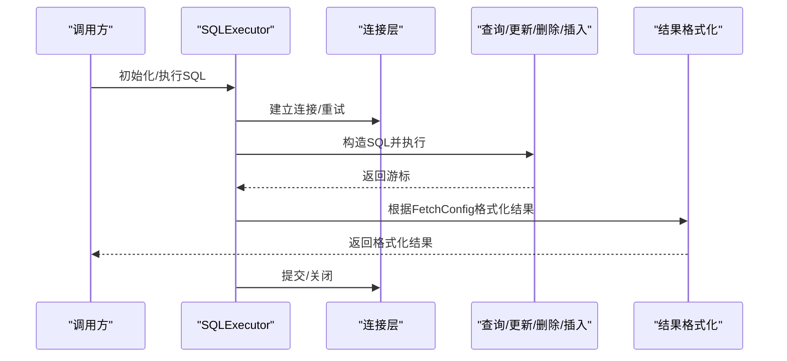
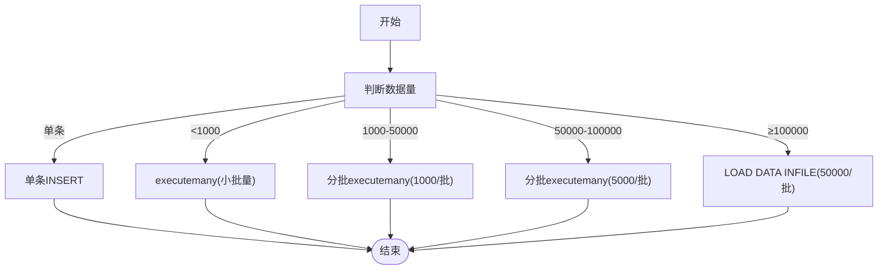
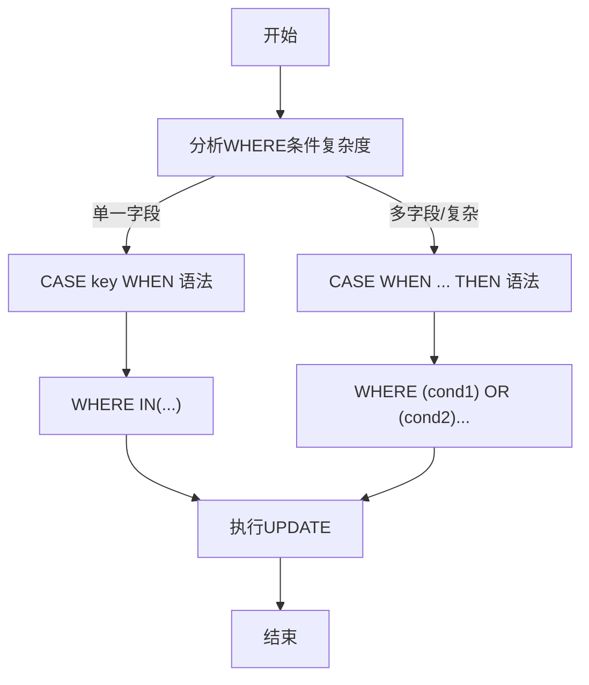
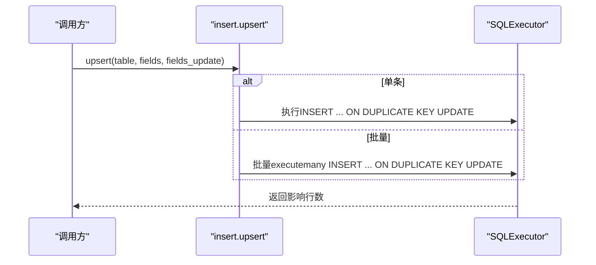
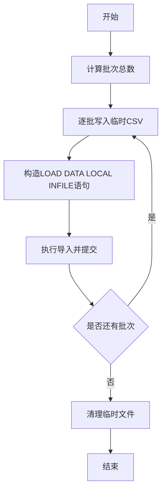
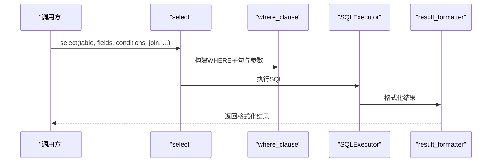
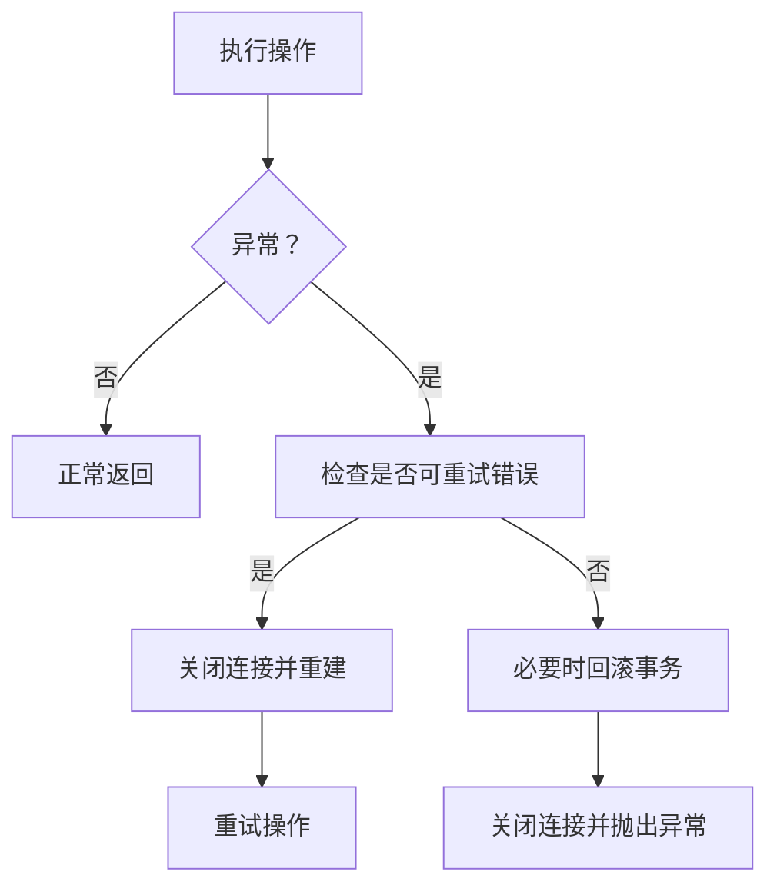
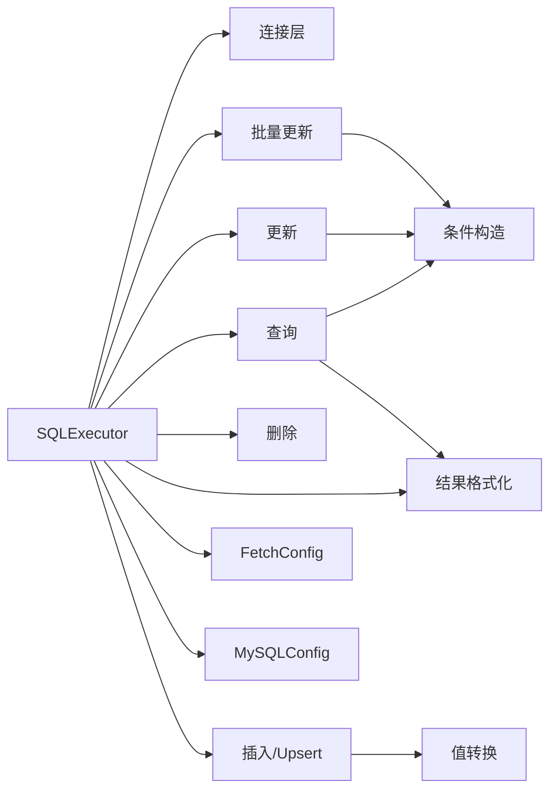

# 高级功能

<cite>
**本文引用的文件**   
- [lazy_mysql/__init__.py](file://lazy_mysql/__init__.py)
- [lazy_mysql/executor.py](file://lazy_mysql/executor.py)
- [lazy_mysql/utils/connect.py](file://lazy_mysql/utils/connect.py)
- [lazy_mysql/utils/select.py](file://lazy_mysql/utils/select.py)
- [lazy_mysql/utils/delete.py](file://lazy_mysql/utils/delete.py)
- [lazy_mysql/utils/update/batch_update.py](file://lazy_mysql/utils/update/batch_update.py)
- [lazy_mysql/utils/update/update.py](file://lazy_mysql/utils/update/update.py)
- [lazy_mysql/utils/value_converter.py](file://lazy_mysql/utils/value_converter.py)
- [lazy_mysql/tools/sql_utils.py](file://lazy_mysql/tools/sql_utils.py)
- [lazy_mysql/tools/where_clause.py](file://lazy_mysql/tools/where_clause.py)
- [lazy_mysql/tools/result_formatter.py](file://lazy_mysql/tools/result_formatter.py)
- [lazy_mysql/dataclasses/fetch_config.py](file://lazy_mysql/dataclasses/fetch_config.py)
- [lazy_mysql/dataclasses/mysql_config.py](file://lazy_mysql/dataclasses/mysql_config.py)
- [lazy_mysql/utils/insert.py](file://lazy_mysql/utils/insert.py)
- [README.md](file://README.md)
</cite>

## 目录
1. [简介](#简介)
2. [项目结构](#项目结构)
3. [核心组件](#核心组件)
4. [架构总览](#架构总览)
5. [详细组件分析](#详细组件分析)
6. [依赖分析](#依赖分析)
7. [性能考量](#性能考量)
8. [故障排查指南](#故障排查指南)
9. [结论](#结论)
10. [附录](#附录)

## 简介
本章节聚焦lazy_mysql的高级功能与性能优化能力，涵盖批量数据操作的自动优化策略（批量插入、批量更新、批量删除）、Upsert的智能判断与实现、LOAD DATA INFILE的高性能导入、复杂查询构建器（多表关联、子查询、UNION、窗口函数等）、事务处理与错误重试、连接池配置与企业级特性，并提供性能对比与最佳实践建议。

## 项目结构
lazy_mysql采用模块化设计，围绕SQLExecutor统一入口，将连接、查询、更新、删除、插入、格式化、工具函数与配置解耦，便于扩展与维护。

图示来源
- [lazy_mysql/executor.py:14-616](file://lazy_mysql/executor.py#L14-L616)
- [lazy_mysql/utils/connect.py:15-91](file://lazy_mysql/utils/connect.py#L15-L91)
- [lazy_mysql/utils/select.py:4-237](file://lazy_mysql/utils/select.py#L4-L237)
- [lazy_mysql/utils/update/update.py:4-44](file://lazy_mysql/utils/update/update.py#L4-L44)
- [lazy_mysql/utils/update/batch_update.py:6-313](file://lazy_mysql/utils/update/batch_update.py#L6-L313)
- [lazy_mysql/utils/delete.py:3-26](file://lazy_mysql/utils/delete.py#L3-L26)
- [lazy_mysql/utils/insert.py:7-287](file://lazy_mysql/utils/insert.py#L7-L287)
- [lazy_mysql/tools/result_formatter.py:3-77](file://lazy_mysql/tools/result_formatter.py#L3-L77)
- [lazy_mysql/tools/where_clause.py:42-127](file://lazy_mysql/tools/where_clause.py#L42-L127)
- [lazy_mysql/tools/sql_utils.py:4-53](file://lazy_mysql/tools/sql_utils.py#L4-L53)
- [lazy_mysql/utils/value_converter.py:74-115](file://lazy_mysql/utils/value_converter.py#L74-L115)
- [lazy_mysql/dataclasses/mysql_config.py:10-135](file://lazy_mysql/dataclasses/mysql_config.py#L10-L135)
- [lazy_mysql/dataclasses/fetch_config.py:8-24](file://lazy_mysql/dataclasses/fetch_config.py#L8-L24)

章节来源
- [lazy_mysql/__init__.py:1-21](file://lazy_mysql/__init__.py#L1-L21)
- [lazy_mysql/executor.py:14-616](file://lazy_mysql/executor.py#L14-L616)
- [lazy_mysql/utils/connect.py:15-91](file://lazy_mysql/utils/connect.py#L15-L91)
- [lazy_mysql/utils/select.py:4-237](file://lazy_mysql/utils/select.py#L4-L237)
- [lazy_mysql/utils/update/update.py:4-44](file://lazy_mysql/utils/update/update.py#L4-L44)
- [lazy_mysql/utils/update/batch_update.py:6-313](file://lazy_mysql/utils/update/batch_update.py#L6-L313)
- [lazy_mysql/utils/delete.py:3-26](file://lazy_mysql/utils/delete.py#L3-L26)
- [lazy_mysql/utils/insert.py:7-287](file://lazy_mysql/utils/insert.py#L7-L287)
- [lazy_mysql/tools/result_formatter.py:3-77](file://lazy_mysql/tools/result_formatter.py#L3-L77)
- [lazy_mysql/tools/where_clause.py:42-127](file://lazy_mysql/tools/where_clause.py#L42-L127)
- [lazy_mysql/tools/sql_utils.py:4-53](file://lazy_mysql/tools/sql_utils.py#L4-L53)
- [lazy_mysql/utils/value_converter.py:74-115](file://lazy_mysql/utils/value_converter.py#L74-L115)
- [lazy_mysql/dataclasses/mysql_config.py:10-135](file://lazy_mysql/dataclasses/mysql_config.py#L10-L135)
- [lazy_mysql/dataclasses/fetch_config.py:8-24](file://lazy_mysql/dataclasses/fetch_config.py#L8-L24)

## 核心组件
- SQLExecutor：统一的数据库操作入口，封装连接、执行、提交、关闭、错误重试、批量/单条执行、查询结果格式化等。
- 连接层：负责建立连接、重试、版本检查、游标配置（缓冲、字典游标）。
- 查询构建器：select与exists，支持多表JOIN、WHERE条件、排序、限制、DISTINCT、FetchConfig输出格式。
- 更新与批量更新：update与batch_update，支持条件复杂度分析与SQL生成策略选择。
- 删除：delete，强制条件校验，防止全表删除。
- 插入与Upsert：insert（智能策略：小批量executemany、分批executemany、LOAD DATA INFILE）、upsert（单条/批量）。
- 工具函数：where_clause（条件构造与NDayInterval）、sql_utils（add_limit）、result_formatter（结果格式化）、value_converter（值转换）。
- 配置模型：MySQLConfig（环境变量/字典/显式参数解析）、FetchConfig（查询输出格式与行为）。

章节来源
- [lazy_mysql/executor.py:14-616](file://lazy_mysql/executor.py#L14-L616)
- [lazy_mysql/utils/connect.py:15-91](file://lazy_mysql/utils/connect.py#L15-L91)
- [lazy_mysql/utils/select.py:4-237](file://lazy_mysql/utils/select.py#L4-L237)
- [lazy_mysql/utils/update/update.py:4-44](file://lazy_mysql/utils/update/update.py#L4-L44)
- [lazy_mysql/utils/update/batch_update.py:6-313](file://lazy_mysql/utils/update/batch_update.py#L6-L313)
- [lazy_mysql/utils/delete.py:3-26](file://lazy_mysql/utils/delete.py#L3-L26)
- [lazy_mysql/utils/insert.py:7-287](file://lazy_mysql/utils/insert.py#L7-L287)
- [lazy_mysql/tools/where_clause.py:42-127](file://lazy_mysql/tools/where_clause.py#L42-L127)
- [lazy_mysql/tools/sql_utils.py:4-53](file://lazy_mysql/tools/sql_utils.py#L4-L53)
- [lazy_mysql/tools/result_formatter.py:3-77](file://lazy_mysql/tools/result_formatter.py#L3-L77)
- [lazy_mysql/utils/value_converter.py:74-115](file://lazy_mysql/utils/value_converter.py#L74-L115)
- [lazy_mysql/dataclasses/mysql_config.py:10-135](file://lazy_mysql/dataclasses/mysql_config.py#L10-L135)
- [lazy_mysql/dataclasses/fetch_config.py:8-24](file://lazy_mysql/dataclasses/fetch_config.py#L8-L24)

## 架构总览
下图展示SQLExecutor如何协调各模块完成一次典型查询或修改流程。

图示来源
- [lazy_mysql/executor.py:20-616](file://lazy_mysql/executor.py#L20-L616)
- [lazy_mysql/utils/connect.py:15-91](file://lazy_mysql/utils/connect.py#L15-L91)
- [lazy_mysql/tools/result_formatter.py:3-77](file://lazy_mysql/tools/result_formatter.py#L3-L77)

## 详细组件分析

### 批量数据操作与自动优化
- 批量插入策略
  - 单条：直接执行INSERT。
  - 小批量（<1000）：executemany。
  - 中等批量（1000-50000）：分批executemany（1000条/批）。
  - 大批量（50000-100000）：分批executemany（5000条/批）。
  - 超大批量（≥100000）：LOAD DATA INFILE，分批50000条，流式写入临时CSV并本地导入。
- 批量更新策略
  - 条件分析：若所有记录的WHERE仅涉及单一字段（如主键），使用简化的CASE key WHEN语法，性能最优。
  - 复杂条件：使用通用CASE WHEN THEN语法，WHERE条件用OR连接，保证精确匹配与更新。
- 批量删除
  - 强制要求conditions非空，防止误删全表；通过动态WHERE构造实现灵活条件。

图示来源
- [lazy_mysql/utils/insert.py:7-72](file://lazy_mysql/utils/insert.py#L7-L72)
- [lazy_mysql/utils/insert.py:247-287](file://lazy_mysql/utils/insert.py#L247-L287)
- [lazy_mysql/utils/insert.py:162-244](file://lazy_mysql/utils/insert.py#L162-L244)

图示来源
- [lazy_mysql/utils/update/batch_update.py:6-82](file://lazy_mysql/utils/update/batch_update.py#L6-L82)
- [lazy_mysql/utils/update/batch_update.py:84-101](file://lazy_mysql/utils/update/batch_update.py#L84-L101)
- [lazy_mysql/utils/update/batch_update.py:232-264](file://lazy_mysql/utils/update/batch_update.py#L232-L264)
- [lazy_mysql/utils/update/batch_update.py:267-313](file://lazy_mysql/utils/update/batch_update.py#L267-L313)

章节来源
- [lazy_mysql/utils/insert.py:7-72](file://lazy_mysql/utils/insert.py#L7-L72)
- [lazy_mysql/utils/insert.py:247-287](file://lazy_mysql/utils/insert.py#L247-L287)
- [lazy_mysql/utils/insert.py:162-244](file://lazy_mysql/utils/insert.py#L162-L244)
- [lazy_mysql/utils/update/batch_update.py:6-82](file://lazy_mysql/utils/update/batch_update.py#L6-L82)
- [lazy_mysql/utils/update/batch_update.py:84-101](file://lazy_mysql/utils/update/batch_update.py#L84-L101)
- [lazy_mysql/utils/update/batch_update.py:232-264](file://lazy_mysql/utils/update/batch_update.py#L232-L264)
- [lazy_mysql/utils/update/batch_update.py:267-313](file://lazy_mysql/utils/update/batch_update.py#L267-L313)
- [lazy_mysql/utils/delete.py:3-26](file://lazy_mysql/utils/delete.py#L3-L26)

### Upsert智能判断与实现
- 单条Upsert：构造INSERT ... ON DUPLICATE KEY UPDATE，支持指定冲突时更新的字段集合。
- 批量Upsert：批量executemany方式，复用相同ON DUPLICATE KEY UPDATE逻辑。
- 字段更新范围控制：fields_update为集合时仅更新指定字段，未指定则更新所有字段。

图示来源
- [lazy_mysql/utils/insert.py:74-98](file://lazy_mysql/utils/insert.py#L74-L98)
- [lazy_mysql/utils/insert.py:125-159](file://lazy_mysql/utils/insert.py#L125-L159)

章节来源
- [lazy_mysql/utils/insert.py:74-98](file://lazy_mysql/utils/insert.py#L74-L98)
- [lazy_mysql/utils/insert.py:125-159](file://lazy_mysql/utils/insert.py#L125-L159)

### LOAD DATA INFILE 高性能导入
- 适用场景：超大规模数据（≥100000条）快速入库。
- 实现要点：
  - 分批处理，避免单文件过大。
  - 临时CSV写入，字段顺序严格对齐。
  - 使用LOAD DATA LOCAL INFILE，支持跳过重复（INSERT IGNORE）。
  - 自动清理临时文件，异常时安全收尾。
- 性能说明：官方文档宣称相较传统executemany快20-50倍，内存占用低，支持流式处理。

图示来源
- [lazy_mysql/utils/insert.py:162-244](file://lazy_mysql/utils/insert.py#L162-L244)

章节来源
- [lazy_mysql/utils/insert.py:162-244](file://lazy_mysql/utils/insert.py#L162-L244)
- [README.md:180-188](file://README.md#L180-L188)

### 复杂查询构建器
- 多表关联：支持JOIN类型与条件，自动为主表字段补全表前缀。
- 子查询与UNION：通过query方法直接执行任意SQL，支持子查询、UNION、窗口函数等。
- 条件构造：支持等值、比较运算符、IN/NOT IN、NULL/NOT NULL、NDayInterval（最近N天）。
- 结果格式化：FetchConfig控制fetch_mode/all/oneTuple/one、output_format（空/df/df_dict/list_1/dict）、data_label、show_count。

图示来源
- [lazy_mysql/utils/select.py:4-156](file://lazy_mysql/utils/select.py#L4-L156)
- [lazy_mysql/tools/where_clause.py:42-127](file://lazy_mysql/tools/where_clause.py#L42-L127)
- [lazy_mysql/tools/result_formatter.py:3-77](file://lazy_mysql/tools/result_formatter.py#L3-L77)
- [lazy_mysql/dataclasses/fetch_config.py:8-24](file://lazy_mysql/dataclasses/fetch_config.py#L8-L24)

章节来源
- [lazy_mysql/utils/select.py:4-156](file://lazy_mysql/utils/select.py#L4-L156)
- [lazy_mysql/tools/where_clause.py:42-127](file://lazy_mysql/tools/where_clause.py#L42-L127)
- [lazy_mysql/tools/result_formatter.py:3-77](file://lazy_mysql/tools/result_formatter.py#L3-L77)
- [lazy_mysql/dataclasses/fetch_config.py:8-24](file://lazy_mysql/dataclasses/fetch_config.py#L8-L24)

### 事务处理、错误重试与连接管理
- 事务：commit/commit_close，支持自动重连与回滚。
- 错误重试：识别“连接丢失/超时”等可重试错误，自动重建连接并重试一次。
- 连接：连接层支持重试、版本检查、缓冲游标、字典游标、启用LOCAL INFILE。
- 关闭：显式close与兜底__del__，避免资源泄漏。

图示来源
- [lazy_mysql/executor.py:62-107](file://lazy_mysql/executor.py#L62-L107)
- [lazy_mysql/executor.py:109-124](file://lazy_mysql/executor.py#L109-L124)
- [lazy_mysql/utils/connect.py:15-91](file://lazy_mysql/utils/connect.py#L15-L91)

章节来源
- [lazy_mysql/executor.py:62-107](file://lazy_mysql/executor.py#L62-L107)
- [lazy_mysql/executor.py:109-124](file://lazy_mysql/executor.py#L109-L124)
- [lazy_mysql/utils/connect.py:15-91](file://lazy_mysql/utils/connect.py#L15-L91)

### 值转换与类型兼容
- 支持None、NaN、pd.NA、pd.NaT、numpy/pandas类型、datetime/date/time、Decimal、bytes/bytearray/memoryview、dict/list/tuple/set等。
- JSON序列化与规范化，确保写入数据库的值类型正确且稳定。

章节来源
- [lazy_mysql/utils/value_converter.py:74-115](file://lazy_mysql/utils/value_converter.py#L74-L115)

### SQL工具与辅助函数
- add_limit：快速构建条件片段（支持=、!=、<>、>、>=、<、<=、LIKE、NOT LIKE、IN、NOT IN）。
- NDayInterval：生成最近N天的日期表达式，用于>=等运算符。

章节来源
- [lazy_mysql/tools/sql_utils.py:4-53](file://lazy_mysql/tools/sql_utils.py#L4-L53)
- [lazy_mysql/tools/where_clause.py:3-15](file://lazy_mysql/tools/where_clause.py#L3-L15)

## 依赖分析
- 组件内聚与耦合
  - SQLExecutor作为门面，聚合连接、执行、格式化、工具与配置，内聚度高、耦合度适中。
  - 查询、更新、删除、插入各自独立模块，通过公共工具（where_clause、value_converter、result_formatter）协作。
- 外部依赖
  - mysql-connector-python（>=9.4.0）、pandas（>=2.3.1），连接层启用use_pure与allow_local_infile以提升兼容性与功能。
- 循环依赖
  - 未发现循环导入；模块间通过函数调用与类型提示协作。

图示来源
- [lazy_mysql/executor.py:14-616](file://lazy_mysql/executor.py#L14-L616)
- [lazy_mysql/utils/select.py:4-237](file://lazy_mysql/utils/select.py#L4-L237)
- [lazy_mysql/utils/update/update.py:4-44](file://lazy_mysql/utils/update/update.py#L4-L44)
- [lazy_mysql/utils/update/batch_update.py:6-313](file://lazy_mysql/utils/update/batch_update.py#L6-L313)
- [lazy_mysql/utils/delete.py:3-26](file://lazy_mysql/utils/delete.py#L3-L26)
- [lazy_mysql/utils/insert.py:7-287](file://lazy_mysql/utils/insert.py#L7-L287)
- [lazy_mysql/tools/result_formatter.py:3-77](file://lazy_mysql/tools/result_formatter.py#L3-L77)
- [lazy_mysql/tools/where_clause.py:42-127](file://lazy_mysql/tools/where_clause.py#L42-L127)
- [lazy_mysql/utils/value_converter.py:74-115](file://lazy_mysql/utils/value_converter.py#L74-L115)
- [lazy_mysql/dataclasses/fetch_config.py:8-24](file://lazy_mysql/dataclasses/fetch_config.py#L8-L24)
- [lazy_mysql/dataclasses/mysql_config.py:10-135](file://lazy_mysql/dataclasses/mysql_config.py#L10-L135)

章节来源
- [lazy_mysql/executor.py:14-616](file://lazy_mysql/executor.py#L14-L616)
- [lazy_mysql/utils/select.py:4-237](file://lazy_mysql/utils/select.py#L4-L237)
- [lazy_mysql/utils/update/update.py:4-44](file://lazy_mysql/utils/update/update.py#L4-L44)
- [lazy_mysql/utils/update/batch_update.py:6-313](file://lazy_mysql/utils/update/batch_update.py#L6-L313)
- [lazy_mysql/utils/delete.py:3-26](file://lazy_mysql/utils/delete.py#L3-L26)
- [lazy_mysql/utils/insert.py:7-287](file://lazy_mysql/utils/insert.py#L7-L287)
- [lazy_mysql/tools/result_formatter.py:3-77](file://lazy_mysql/tools/result_formatter.py#L3-L77)
- [lazy_mysql/tools/where_clause.py:42-127](file://lazy_mysql/tools/where_clause.py#L42-L127)
- [lazy_mysql/utils/value_converter.py:74-115](file://lazy_mysql/utils/value_converter.py#L74-L115)
- [lazy_mysql/dataclasses/fetch_config.py:8-24](file://lazy_mysql/dataclasses/fetch_config.py#L8-L24)
- [lazy_mysql/dataclasses/mysql_config.py:10-135](file://lazy_mysql/dataclasses/mysql_config.py#L10-L135)

## 性能考量
- 批量插入
  - 小批量（<1000）：executemany即可满足需求。
  - 中等批量（1000-50000）：分批executemany（1000/批）平衡吞吐与内存。
  - 大批量（50000-100000）：分批executemany（5000/批）进一步降低峰值压力。
  - 超大批量（≥100000）：LOAD DATA INFILE，显著降低网络与解析开销，内存占用低。
- 批量更新
  - 单一主键条件：CASE key WHEN语法，避免多条件拼接，性能最优。
  - 复杂条件：CASE WHEN THEN语法，WHERE用OR连接，保证精确匹配。
- 查询
  - exists使用SELECT 1 LIMIT 1，避免全表扫描。
  - FetchConfig按需返回，DataFrame仅在需要时生成，减少中间对象。
- 连接与缓冲
  - buffered=True避免“未读结果”问题；dictionary=True/False切换返回格式。
  - use_pure=True提升兼容性；allow_local_infile=True启用LOAD DATA INFILE。
- 版本与兼容
  - 警告低版本连接器（<9.4），建议升级以获得更好性能与稳定性。

章节来源
- [lazy_mysql/utils/insert.py:7-72](file://lazy_mysql/utils/insert.py#L7-L72)
- [lazy_mysql/utils/insert.py:247-287](file://lazy_mysql/utils/insert.py#L247-L287)
- [lazy_mysql/utils/insert.py:162-244](file://lazy_mysql/utils/insert.py#L162-L244)
- [lazy_mysql/utils/update/batch_update.py:6-82](file://lazy_mysql/utils/update/batch_update.py#L6-L82)
- [lazy_mysql/utils/select.py:159-190](file://lazy_mysql/utils/select.py#L159-L190)
- [lazy_mysql/utils/select.py:191-237](file://lazy_mysql/utils/select.py#L191-L237)
- [lazy_mysql/utils/connect.py:15-91](file://lazy_mysql/utils/connect.py#L15-L91)
- [README.md:180-188](file://README.md#L180-L188)

## 故障排查指南
- 连接失败/超时
  - 观察可重试错误关键字，确认是否触发自动重连；若重连失败，检查网络与目标主机状态。
- “未读结果”或后续查询异常
  - 确认使用了buffered=True的游标；避免在同一连接上交错执行未消费的结果集。
- 删除全表风险
  - delete强制要求conditions非空，若误传空条件将抛出异常；请在测试环境先行验证。
- 查询无结果集
  - 若出现“无结果集可获取”，检查是否提前关闭了游标或连接；参考错误消息提示。
- 类型转换问题
  - numpy/pandas类型需转换后再写入；Dict类型会自动JSON序列化；注意编码与特殊字符。
- 输出格式错误
  - 当output_format为df/df_dict/dict时，data_label必须提供且长度与字段数一致。

章节来源
- [lazy_mysql/executor.py:62-107](file://lazy_mysql/executor.py#L62-L107)
- [lazy_mysql/utils/delete.py:14-18](file://lazy_mysql/utils/delete.py#L14-L18)
- [lazy_mysql/tools/result_formatter.py:29-31](file://lazy_mysql/tools/result_formatter.py#L29-L31)
- [lazy_mysql/tools/result_formatter.py:50-53](file://lazy_mysql/tools/result_formatter.py#L50-L53)
- [lazy_mysql/tools/where_clause.py:17-39](file://lazy_mysql/tools/where_clause.py#L17-L39)
- [lazy_mysql/utils/connect.py:15-91](file://lazy_mysql/utils/connect.py#L15-L91)

## 结论
lazy_mysql通过SQLExecutor统一入口，结合智能策略（分批executemany、LOAD DATA INFILE、CASE语法优化）、完善的错误重试与连接管理、灵活的查询构建与结果格式化，实现了从开发体验到生产性能的全面优化。对于批量数据处理、Upsert、复杂查询与企业级事务保障，具备良好的可用性与扩展性。

## 附录
- 最佳实践建议
  - 批量插入：根据数据规模选择策略；超大批量务必启用LOAD DATA INFILE。
  - 批量更新：尽量使用单一主键条件，以获得最优CASE语法；复杂条件谨慎使用OR连接。
  - 查询：优先使用exists进行存在性判断；需要DataFrame时再启用，避免不必要的内存占用。
  - 连接：生产环境开启缓冲与字典游标，合理设置重试与延迟；升级至推荐的连接器版本。
  - 安全：始终使用参数化查询与条件构造函数，避免手写SQL拼接；严格校验输入类型。